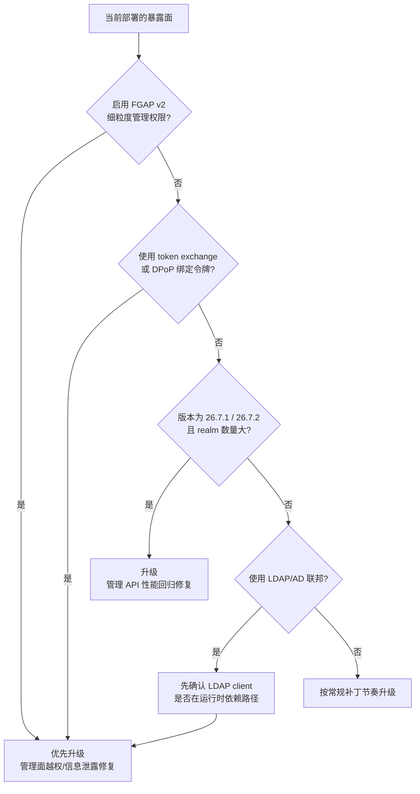

26.7.3 于 **2026-08-31** 发布，是 26.7 系列当前最新的补丁版本。它不引入新特性，但修复量级值得单独说明：官方 release note 列出 **20 项安全修复（CVE）、6 项弱点修复和 19 项缺陷修复**，合计 45 项。其中 **10 项直接标注 `admin/fine-grained-permissions`（FGAP v2）**，另有 1 项标注 `admin/rbac`。

所以这个补丁版本的主战场是**管理面授权与 OIDC 令牌语义**，不是运行时功能。如果你只读 26.7.0 的「新特性」清单，很容易把 26.7.x 理解成 SCIM/AuthZEN/MCP 那一批能力——那些是 26.7.0 的事；判断「我要不要马上升级」，要看的是这一页。

## 适用 / 不适用

| 场景 | 是否适用 |
|------|----------|
| 启用了 fine-grained admin permissions v2（FGAP v2），用 FGAP 做委派管理 | ✅ 必读，修复直接落在管理面授权 |
| 使用 token exchange，或用 DPoP 绑定 sender-constrained 令牌 | ✅ 必读，见第 3 节 |
| 运行 26.7.1 / 26.7.2 且 realm 数量较大、管理 API 明显变慢 | ✅ 必读，见第 4 节 |
| 使用 LDAP/AD User Federation（LDAPS 或 StartTLS） | ⚠️ 需要判断依赖路径，见第 5 节 |
| 仍在 26.6.x 及更早版本，未启用以上任何能力 | ⚠️ 按常规补丁节奏评估，不要为了这一页跨版本跳升 |
| 只做本地开发、单机 start-dev 试用 | ❌ 无生产影响面 |

## 升级优先级怎么判断



判断依据是修复条目挂的组件标签：这一版里 `admin/fine-grained-permissions`、`oidc`、`token-exchange` 三个标签占了绝大多数条目。标签代表官方归类的问题域，不等于所有部署都会命中——下面分四组说明前提条件。

## 45 项修复按影响面分类

| 类别 | 数量 | 代表条目 | 谁必须评估 |
|------|------|----------|-----------|
| 管理面授权（FGAP v2 / admin RBAC） | 11 | `POST /users` 创建用户时绕过组分配限制、组策略 partial evaluation 漏掉祖先组策略 | 启用 FGAP v2 做委派管理的部署 |
| 身份联邦与协议处理 | 5 | LDAP client 证书主机名校验、SAML ECP 错误信息泄露客户端存在性 | LDAP/AD 联邦、SAML 接入方 |
| OIDC 令牌与会话语义 | 7 | 授权码可被重定向到另一个客户端会话、客户端 not-before 吊销被忽略 | 自建 OIDC 客户端、依赖吊销语义的接入方 |
| Token Exchange / sender-constrained 令牌 | 3 | Microsoft 与 Google 外部 access token exchange 绕过配置限制 | 使用 token exchange 做联邦调用的部署 |
| 管理 API 与核心性能/健壮性 | 其余 | 管理 API 每请求成本随 realm 数量超线性增长、轻量 access token 角色解析全 realm 扫描 | realm 数量大或多租户部署 |

## 1. FGAP v2：这一版修复最集中的地方

10 项标注 `admin/fine-grained-permissions` 的条目覆盖了从「读」到「写」两端：

- **越权写入**：`POST /users` 创建用户时可以选择未被授权的组（CVE-2026-18571）；委派管理员可通过删除 role-composite 移除特权子角色（CVE-2026-16106）；管理界面创建 client 时可以省略 `protocol=oidc` 绕过 client-protocol 条件。
- **越权读取与信息泄露**：`GET /roles/{role}/users` 返回用户 PII 而不经过 per-user view filter（CVE-2026-17059）；认证器配置界面暴露 reCAPTCHA secret 原文（CVE-2026-16104）；realm 默认组读取会暴露隐藏组（CVE-2026-16108）；用户/组 role-mapping 端点泄露隐藏 client role 元数据。
- **评估语义不一致**：聚合策略的 partial evaluation 与运行时语义不一致（#51143）；partial evaluation 漏掉 `extendChildren` 的祖先组策略（#51144）。这一条不是直接越权，而是让管理界面上的「有效权限」预览与实际判定不一致——排查权限问题时最容易误判的地方。

**升级后必须回归的场景**：用一个只被授予部分管理权限的委派管理员账号，走一遍你实际授予它的操作（建用户、改组、改 client、看 role 用户列表），确认既没有多出来的能力，也没有因为修复而出现原本依赖的「越界但被容忍」的行为。把 FGAP v2 的升级当成一次权限模型回归，而不是一次镜像替换。

详细的能力模型与配置方式见 [Keycloak 细粒度权限与授权策略实战]()。

## 2. OIDC 令牌与会话语义

这组修复影响的是「令牌还能不能用」的判断，容易在升级后被误当成业务 bug：

| 条目 | 官方表述 | 你要检查什么 |
|------|----------|-------------|
| CVE-2026-16089 | 授权码可以被重定向到另一个客户端会话 | 自定义或第三方 OIDC 客户端对 `code` 与会话绑定关系的假设 |
| CVE-2026-18218 | realm 的 not-before 比 client 的 not-before 旧但非零时，客户端吊销被忽略 | 你是否依赖 not-before 做「强制下线/紧急吊销」，升级后重新演练一次 |
| CVE-2026-18209 | redirect_uri 的 OIDC response-parameter 注入修复不完整——forbidden-parameter 检查只覆盖 query string，未覆盖 URL fragment | 自定义 redirect_uri 校验逻辑、网关侧对 fragment 的处理 |
| CVE-2026-18570 | 省略 `fullScopeAllowed` 可绕过 full-scope-disabled 的 client 策略校验 | 依赖 client policy 限制 scope 的部署 |
| CVE-2026-18573 | client access-type 条件的更新判断使用了旧的 client 类型 | 用条件策略区分 public/confidential client 的部署 |

`CVE-2026-18209` 特别值得注意，它是**对既有修复的补齐**：上一轮只检查了 query string，攻击面在 fragment 上仍然存在。这类「incomplete fix」在 OIDC 实现中反复出现，本书 [OAuth 2.0 攻击面分析]() 里把 redirect_uri 校验列为一号攻击面，理由正是解析差异和分片处理往往不在同一处代码里。

## 3. Token Exchange 与 sender-constrained 令牌

- **CVE-2026-18215**：Microsoft 外部 access token exchange 绕过已配置的 tenant 限制。
- **CVE-2026-18214**：Google 外部 access token exchange 绕过 hosted-domain 限制。
- **#50963（缺陷）**：V1 token-exchange 会**剥离**绑定在 access token 上的 DPoP sender-constraint。

前两条是配置限制被绕过——如果你的架构依赖「只有特定 tenant/域的外部令牌才能换成本地令牌」做信任边界，需要重新验证。第三条更隐蔽：token 换过一手之后变成普通 bearer token，DPoP 的「持有密钥才能使用」保证在链路中段消失。如果你的服务间调用链上有 token exchange，且你认为全链路都是 sender-constrained，这就是一个语义缺口。

DPoP 的绑定机制与验证方式见 [OAuth 2.0 DPoP 深度解析]()。

## 4. 管理 API 的性能回归（26.7.1 起引入）

26.7.3 的缺陷修复列表里包含三条与规模相关的条目：

- **#51554**：管理 API 的每请求成本随 realm 数量**超线性增长**（自 26.7.1 起）。
- **#51707**：轻量 access token 的角色解析会在**每次管理 API 请求**中解析所有 realm 的角色。
- **#51523**：升级后所有节点出现持续高 CPU。

注意 #51554 的表述是「自 26.7.1 起」——也就是说从 26.7.1 升到 26.7.2 并不能解决这个问题，26.7.3 才是包含修复的版本。如果你在 26.7.1/26.7.2 上观察到管理控制台或 Admin REST API 变慢，并且 realm 数量较多，这一条比 CVE 更贴近你的实际痛点。多租户按 realm 隔离的部署可先参考 [多租户 IAM 架构设计]() 中的规模提示。

## 5. 一条容易被误读的修复：LDAP client 的 CVE

26.7.3 的安全修复列表第一条是 **#50785 / CVE-2026-35563**，标题为「LDAP client implementation in version 2.1.7 does not verify if the server certificate matches the intended LDAP hostname」。只看标题，很容易写成「LDAPS 可被中间人冒充，LDAP 联邦必须立即升级」。

但该 issue 的正文说明了另一层事实：这个组件是**通过 ApacheDS 传递进来的依赖**，单独更新会破坏 ApacheDS 2.0.0.AM26，升到 AM27 又因为 Kerberos 功能被移除而导致测试失败。也就是说，这条条目的实际暴露面需要在**你自己的依赖树上确认**——不能只凭 CVE 标题推断生产 LDAPS 通道一定可被冒充。本书因此不把它写成确定结论。

不过有一条与此独立、且无论如何都该做的加固：**确认 LDAP 服务器证书的主机名与 Keycloak 实际连接的主机名一致**。CA 受信任不等于目标主机可信，配置与排错方式见 [Keycloak LDAP / Active Directory 用户联邦]()。

## 升级步骤

1. **备份数据库并验证可恢复**。补丁版本同样会执行数据库迁移，不要在升级窗口临时决定备份策略。
2. **记录升级前的版本与行为基线**，至少包括管理 API 的关键调用耗时（realm 多的部署）和委派管理员的权限边界。
3. **先在预发升级并回归**，再滚动升级生产。多节点集群滚动升级期间要保持节点版本一致，不要长时间混跑。
4. **确认版本真的变了**，不要只看镜像 tag。

```bash
# 方式一：Admin REST API 读取服务器版本
TOKEN=$(curl -s -X POST \
  "https://auth.example.com/realms/master/protocol/openid-connect/token" \
  -d "client_id=admin-cli" -d "username=$KC_ADMIN" -d "password=$KC_ADMIN_PWD" \
  -d "grant_type=password" | jq -r .access_token)

curl -s -H "Authorization: Bearer $TOKEN" \
  "https://auth.example.com/admin/serverinfo" | jq -r .systemInfo.version

# 方式二：Operator 管理的实例，先改 CR 里的镜像再等 rollout
kubectl -n keycloak patch keycloak production-keycloak \
  --type=merge -p '{"spec":{"image":"quay.io/keycloak/keycloak:26.7.3"}}'
kubectl -n keycloak rollout status statefulset/production-keycloak
```

## 升级后验证清单

- [ ] `systemInfo.version` 显示 **26.7.3**，且所有副本一致。
- [ ] OIDC 登录、Token 刷新、登出全流程通过；如果依赖 not-before 吊销，单独演练一次强制下线。
- [ ] FGAP v2 委派管理员账号逐项回归：建用户、改组、改 client、读 role 用户列表。
- [ ] token exchange 链路（尤其外部 IdP 换本地令牌）与 DPoP 绑定令牌调用通过。
- [ ] LDAP/AD 联邦登录与增量同步正常，并在日志中确认 TLS 连接无证书告警。
- [ ] 管理 API 耗时对比升级前基线；realm 数量大的部署重点看这里的改善幅度。
- [ ] 反向代理后的 issuer 与回调地址未发生变化（补丁升级不改 hostname 处理，但代理配置经常在升级窗口被顺手改动）。

## 常见误区

**Q1：26.7.3 有新特性吗？**

没有。它是补丁版本，只有修复。想了解 26.7 的功能变化（SCIM API、多集群免外部缓存 HA、AuthZEN、OpenID SSF、SAML Step-up），看 [Keycloak 26.7 新特性深度解读]()。

**Q2：我已经在 26.7.2 上了，还需要升吗？**

需要按暴露面判断。26.7.3 的安全修复条目与 26.7.2 公布的 CVE 编号不重叠，也就是说这是在 26.7.2 之上追加的一批修复，而不是重复修复。启用 FGAP v2、token exchange 或大 realm 规模的部署升级收益最直接。

**Q3：CVE 数量多，是不是意味着这个版本风险特别高？**

不能这样读。45 项里大部分是管理面在特定权限配置下的越权或信息泄露，需要先具备「已登录的管理员」「特定的委派权限」等前提。真正需要立刻判断的是：你的暴露面前提是否成立。这也是上面按能力分组、而不是按 CVE 序号罗列的原因。

## 回滚方式

补丁版本的回滚与跨小版本一样，**不能只回退镜像**：如果数据库已经执行了迁移，直接把镜像换成旧版本可能无法启动。

1. 停止流量并保留故障现场（日志、`systemInfo`、失败请求样本）。
2. 在隔离环境用升级前的数据库快照验证旧版本能否正常启动。
3. 确认后再回退镜像；宁可保持 26.7.3 并修复配置问题，也不要用生产库做降级实验。

```bash
# 回退 Operator 管理的镜像（前提：已确认旧版本兼容当前数据库 schema）
kubectl -n keycloak patch keycloak production-keycloak \
  --type=merge -p '{"spec":{"image":"quay.io/keycloak/keycloak:26.7.2"}}'
```

## 参考来源

- [Keycloak 26.7.3 released（官方公告，2026-08-31）](https://www.keycloak.org/2026/08/keycloak-2673-released)
- [Keycloak 26.7.3 Release Notes（GitHub，含全部已解决条目）](https://github.com/keycloak/keycloak/releases/tag/26.7.3)
- [Keycloak 升级指南](https://www.keycloak.org/docs/latest/upgrading/index.html)
- [CVE-2026-35563 相关 issue #50785](https://github.com/keycloak/keycloak/issues/50785)
- [Keycloak Downloads（部署前复核最新版本）](https://www.keycloak.org/downloads)
