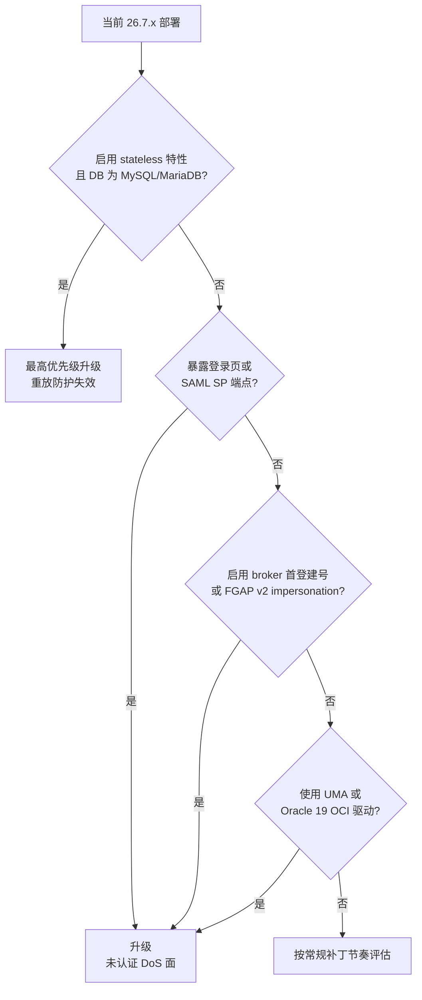

26.7.4 于 **2026-09-16** 发布，是 26.7 系列当前最新的补丁版本。官方列出 **6 项安全修复（CVE）**、1 项增强（Quarkus 3.33.3.2）和 9 项缺陷修复。

条目不多，但里面有一条的分量明显不同：**`CVE-2026-90997` 让 stateless 模式下的重放防护整体失效**——被截获一次的单次性凭据可以被反复使用。它不是管理面在特定权限下的越权，而是「重放门禁本身不再工作」。其余 5 条按常规补丁评估即可。

本文的源码结论基于 `keycloak/keycloak` **26.7.4** tag、26.7 分支的修复提交 `ea8fac03`，以及 PR `#52840`、`#52841`、`#52877`、`#52878` 的 diff，核查日期 2026-09-17。

## 这一版要不要升

| 你的部署 | 是否必须升 | 原因 |
|----------|-----------|------|
| 启用 `stateless` 特性 + MySQL / MariaDB | ✅ **最高优先级** | 单次性凭据重放防护失效，见第 1 节 |
| 用 FGAP v2 做委派管理，且授予过 `impersonation` 角色 | ✅ 必升 | 持有 impersonation 角色者可冒充 realm 管理员 |
| 启用外部 IdP broker（企业微信/飞书/钉钉/Entra ID/AD FS）并允许首次登录建号 | ✅ 必升 | 用户名/邮箱交叉碰撞会创建一个影子账号并把原账号顶掉 |
| 对外暴露登录页 / 主题资源（几乎所有生产部署） | ✅ 必升 | 未认证即可触发的 locale 缓存无界增长 |
| 对外暴露 SAML SP 端点（Redirect binding） | ✅ 必升 | 畸形请求可让 native 内存单调上涨直到进程被杀 |
| Authorization Services / 策略执行器，且资源配置依赖 matrix 参数、尾斜杠或 query/fragment 区分 | ⚠️ 升级前复核 | 26.7.4 起 URI 匹配前先归一化，这些区分不再生效（见第 5 节） |
| Oracle 19 + 全量 OCI 驱动 | ✅ 升，收益明确 | 26.6.0 起启动崩溃（#52233） |
| 用 UMA（User-Managed Access） | ⚠️ 建议升 | 缓存中的 UMA 允许判定返回的是 realm 的 `isEnabled()`（#52172） |
| 传统部署（数据在 Infinispan，不使用 stateless） | ⚠️ 按常规节奏 | 第一条不命中你，其余 5 条 CVE 不因数据库类型而豁免 |



判断表和图的差别在于：表回答「我命不命中」，图回答「命中几条」。只有第 1 节会被数据库类型豁免，其余 5 条 CVE 的触发条件与数据库无关——对照表的行做减法，而不是看到一条不命中就整体跳过。

上表针对社区版 Keycloak。**Red Hat build of Keycloak 用户不要直接套用**：CVE-2026-90997 的官方声明明确「只影响社区版，不影响 RHBK」，而其余条目（CVE-2026-17526 / 19607 / 18212 / 74909 / 79651）已在 RHBK 26.4.16 镜像里修复（RHSA-2026:68276，2026-09-16）。也就是说 RHBK 的评估路径是订阅公告，不是这页。

## 1. CVE-2026-90997：stateless 模式下被用过的凭据还能再用

issue `#52834` 的表述很直接：**在 stateless 部署模式下、数据库为 MySQL 或 MariaDB 时，单次性安全凭据的重放检测无法发现重复使用**。原因是数据库驱动默认配置与应用逻辑之间对「影响行数」的理解不一致：Keycloak 记录一个凭据已被使用时，MySQL/MariaDB 驱动会把「匹配到但未改动」的行也报告为受影响行，于是重放检测把已经用过的凭据当成首次使用，**接受每一次重放**。

### 受影响的三类凭据

官方列举的范围是：

- **JWT client assertions**：即 `private_key_jwt` 客户端认证，攻击者可以把截获的断言重放到 token endpoint；
- **DPoP proofs**：绑定了密钥的 proof 一旦可重放，`jti` 去重窗口在链路这一段就失效；
- **不可重用的 TOTP 验证码**：同一个验证码可以被再次提交到登录流程。

三类都是短时效凭据，所以攻击窗口取决于截获时机——但只要截获成功，防护不再提供额外价值。官方在同一个 issue 里明确：**token 撤销不受影响**。

### 为什么只有 stateless 模式命中

26.7 引入的 `stateless` 特性（Preview，特性名就是 `stateless`）把原本放在 Infinispan 里的易失数据搬到了数据库：认证会话、action token（邮箱验证链接、密码重置令牌、OAuth 授权码这类单次性对象）以及登录失败计数。非 stateless 部署的这些对象仍由 Infinispan 承担，不经过数据库 upsert 的返回值判断，因此不命中这一条。特性定位与代价见 [Keycloak 26.7 新特性深度解读]()。

### 根因：Hibernate 的 upsert 与驱动的默认行数语义

修复 PR `#52840` 在 `model/jpa` 里加了一个判断函数，注释把机制写得很清楚（原文大意）：**MySQL/MariaDB 驱动默认启用 `CLIENT_FOUND_ROWS`，使 `ON DUPLICATE KEY UPDATE` 对「匹配到但值没变」的行返回 1；Hibernate 会把 HQL 的 `on conflict ... do update ... where` 翻译成 CASE 自赋值，于是在一行仍然活跃的情况下，空操作更新与成功插入都返回 1，二者无法区分。**

而 Keycloak 的重放门禁正是建立在这个返回值上。SPI 的契约写得很直白：`SingleUseObjectProvider.putIfAbsent` 返回 `true` 的含义是「同一个 key 此前不在存储中」——重放防护依赖的正是这个「首次写入」判定。同一 PR 还去掉了 `put` / `replace` 两条写路径上的 `EntityManagerProxy.allowAsyncCommit`，不再对这类写入延迟提交：**写入时机与判定结果在这一层是同一件事**，把「写成功」当安全判定用的代码不能顺手加异步提交。

把它翻译成判定逻辑：门禁问的是「这一行是我刚写进去的吗」，数据库答的是「这一行确实存在」。在 PostgreSQL 上这两个答案一致——更新被跳过时 `ON CONFLICT ... DO UPDATE ... WHERE` 就是报 0 行；MySQL/MariaDB 的默认驱动把「匹配到」也算作受影响行，于是所有依赖「首次写入」语义的防护一起失效。这也是同一段代码在 PostgreSQL 上长期没暴露问题的原因。

### 修复方式

修复没有去要求运维改驱动参数，而是在方言层面绕开这个语义：

- `JpaUtils.isUpsertRowCountUnreliable(em)` 检查 Hibernate 方言是否为 `MySQLDialect`；
- 命中时改用原生 `DELETE FROM <表> WHERE ID = ?1 AND EXPIRE <= ?2` + `INSERT IGNORE INTO <表> (ID, EXPIRE) VALUES (?1, ?2)`，用「插入是否真的插入」替代「更新是否匹配」；
- 未命中时保留原有的命名查询路径。

同一 PR 同时覆盖了 `JpaSingleUseObjectProvider` 与 `JpaRevokedTokenProvider`（撤销令牌的写入用同一套行列语义），并去掉了 `put` / `replace` 两条写路径上的异步提交提示（`EntityManagerProxy.allowAsyncCommit`）——把「写成功」当安全判定的路径不再延迟提交。

这是一次典型的「把安全判定从数据库驱动的隐式默认值上解耦」的修复。它值得记住的地方不是这一条 CVE，而是**任何用影响行数做安全判定的代码，都要确认返回值语义与驱动配置一致**——这一层在多数评审里不可见。

### 怎么确认自己在不在受影响范围内

```bash
# 1) 确认是否启用 stateless 特性（Preview 特性需显式开启；启动日志的 Features 段同样能看到）
kubectl -n keycloak get deploy production-keycloak \
  -o jsonpath='{.spec.template.spec.containers[0].args}{"\n"}' | tr ',' '\n' | grep -i stateless

# 2) 确认单次性对象是否真的落在数据库
psql "$KC_DB_URL" -c 'SELECT COUNT(*) FROM single_use_object;'
# MySQL / MariaDB（表名默认大写）：
#   SELECT COUNT(*) FROM SINGLE_USE_OBJECT;
```

第 2 步要看清一个细节：**表存在不代表对象在表里**——建表是 Liquibase 的常规动作。有效信号是在有人登录或刷新令牌的过程中能查到活跃行（过期行不算）。只有「启用 stateless + 查询到活跃行 + 数据库是 MySQL/MariaDB」三者同时成立，才命中第 1 节的结论；否则它不适用于你，但后面几节仍然要看。

### 驱动参数不是升级的等价替代

Red Hat 给的缓解措施是「在 MySQL/MariaDB 的 JDBC 连接串里显式设置 `useAffectedRows=true`，然后重启实例」——它确实能在不升级的情况下改变返回语义。但本书仍建议以升级为主路径，理由有三条，都可以去官方文档核对：

- **同名参数在两个驱动上含义相反。** MySQL Connector/J 的 `useAffectedRows` 默认 `false`，此时驱动走 `CLIENT_FOUND_ROWS`（返回「找到的行」），置 `true` 才返回真实改动行数；MariaDB Connector/J 的官方文档写的是相反方向——默认 `false` 即「按 JDBC 标准报告真实受影响行数」，置 `true` 会把「匹配到但未改动」的行也计为 affected。同一条 `useAffectedRows=true` 建议落在两个驱动上指向的是不同的语义侧，照抄连接串并不自动等价于修复。
- **它是连接串级别的配置，要求逐节点一致。** 漏改一个副本就回到「接受重放」的状态，而这种不一致没有现成的监控信号——你不会收到告警，只会收到一个看起来正常的部署。
- **官方修复与驱动参数无关。** 修复走方言判断（`JpaUtils.isUpsertRowCountUnreliable`），一次升级覆盖两条 provider 路径，不需要把驱动参数变成长期的运维面契约。

变更窗口确实紧张时，可以先用连接串参数争取时间，但要把补丁升级留在待办里，并在预发做实打实的验证：同一份一次性凭据（例如 `private_key_jwt` 的 client assertion）在 `exp` 到期前连续提交两次，第二次必须被拒绝。验证不过，说明参数改动并没有提供你以为的那层保护。

## 2. CVE-2026-17526：impersonation 可以冒充 realm 管理员

一个持有 `impersonation` 角色的用户，可以冒充 realm 管理员——接管之后拿到的是 realm 的完整管理能力：用户、客户端、角色。Red Hat 的评估把它列为 Important，前提是攻击者**已经持有 impersonation 角色**。

修复 PR `#52841` 的标题就是修复语义本身：「只有在当前管理员的权限高于被冒充对象时才允许 impersonation」，改动落在管理面细粒度权限的 `UserPermissions` / `UserPermissionsV2` 上。也就是说，**权限比较是在 impersonation 动作发生时执行的**。

对运维的含义有两条：

1. 升级后把「支持账号冒充管理员」当作一条必须被拒绝的回归用例，而不是「不应该发生」的假设；
2. impersonation 的角色不应与 `manage-users` 混授。把支持人员放在独立组里、只给 realm-management 客户端上的 `impersonation` + `view-users`，是这个功能的安全用法。相关的角色分层与委派管理见 [Keycloak 细粒度权限与授权策略实战]()。

如果你的 Keycloak 来自 Red Hat build，该 CVE 已随 [RHSA-2026:68276](https://access.redhat.com/errata/RHSA-2026:68276) 的 26.4.16 镜像发布修复（同批还包含 CVE-2026-19607 / 18212 / 74909 / 79651）；upstream 对应小版本是否包含某一条，请查看该版本的 release note，不要只凭 CVE 编号推断。

## 3. CVE-2026-19607：broker 首登的用户名/邮箱交叉碰撞

PR `#52877` 的描述给出了完整链条：**first broker login 判重时，用「broker 返回的 email 对比已有用户的 email」和「broker 返回的 username 对比已有用户的 username」两组比较。当 realm 启用 login with email 时，邮箱和用户名都能定位用户，于是这个配对留下一个缺口——broker 返回的邮箱恰好等于某个既有账号的用户名时，判重不会识别为重复。**

接下来发生的事就顺理成章：为 broker 身份新建的账号遮住了原账号——因为用户查询按邮箱先于用户名解析——原账号再也无法用自己的用户名登录。这不是数据泄露，而是**用一个可注册的外部身份把目标用户挡住**，效果等同账号锁定。

Red Hat 对这条的评估是 **Moderate**（CVSS 5.3，`AV:N/AC:L/PR:N/UI:N/S:U/C:N/I:N/A:L`），前提是攻击者能在受信外部 IdP 上注册到目标邮箱。攻击成本低、影响是定向锁定单个账号——判断表里仍然给「必升」，因为触发条件对所有开放 broker 自动建号的 realm 都成立。

修复把 user profile validator 里已有的交叉校验搬进了 broker 路径：碰撞不再静默建号，而是走「关联已有账号、先证明所有权」的流程。

谁要关注：任何启用外部 IdP 做首次登录自动建号的部署，尤其是用户名允许用户自填、同时又开了 login with email 的 realm。升级后的验证很直接——用一个邮箱与某现存用户用户名相同的外部身份尝试登录，确认进入的是账号关联流程而不是新建账号。

## 4. CVE-2026-79651：登录页本地化接口的缓存无界增长

PR `#52878` 的 diff 把边界写得很清楚：`ThemeResource.getLocalizationTexts`（`GET /resources/{realm}/{themeType}/{locale}`）原本用 `Locale.forLanguageTag(localeString)` **直接解析请求里传来的 locale 值**，而修复注释点明「locale 在后面是缓存 key，因此从请求里直接取值会让客户端把这些缓存撑到无界」。

修复引入 `LocaleUtil.resolveSupportedLocale(realm, theme, localeString)`，先把请求值对齐到 realm 与主题**实际支持的 locale**，再进入缓存；同一处修改同时落到 `DefaultThemeManager`、`AdminRoot.getMessages` 和 `DefaultLocaleSelectorProvider`。

触发路径不需要认证（官方 CVE 标题即 "Unauthenticated Denial of Service"），这是它比多数管理面 CVE 更值钱升级的原因：登录页是每个生产部署对公网开放的入口。升级前如果怀疑已经被打过，排查方向是**主题消息缓存与进程内存随请求单调增长**；升级后可在受控环境重复变换 locale 参数确认不再增长。

同类问题（把请求参数直接当缓存 key）在自研网关和 BFF 里同样常见，与身份系统本身的缓存治理见 [IAM 会话管理]()。

## 5. CVE-2026-74909：PathMatcher 的分号矩阵参数绕过

标题里的 "Incomplete fix" 是关键词：**percent-encoded 的分号绕过了 PathMatcher 的矩阵参数剥离**。修复落在 `PathMatcher`（26.7 分支提交 `ea8fac03`，对应 issue `#52836`），做法是在**解码后的结果上重复执行**三件事——矩阵参数剥离、双斜杠折叠、`.` / `..` 段解析。也就是说，此前这些归一化只作用在未解码的路径上，攻击者用 `%3B`（`;`）之类的编码就能让剥离逻辑看不到它。改动同时补了 `PathMatcher` 的单元测试，并写进了 26.7.4 的升级说明。

这和本站记录过的 26.7.3 条目是同一个模式：`CVE-2026-18209` 是 `redirect_uri` 的 forbidden-parameter 检查只覆盖 query string、未覆盖 fragment。两次都是**归一化与校验不在同一层**。凡是有路径白名单的地方——管理路径保护、反向代理规则、SPA 路由守卫——都要把「先解码还是先匹配」当作安全边界来审，而不是配置细节。攻击面分类见 [OAuth 2.0 攻击面分析]()。

### 归一化带来的行为变更（Authorization Services）

26.7.4 的升级说明把这条列为 **Breaking change**：Authorization Services（策略执行器与 UMA 权限端点）在把请求 URI 与配置的资源 URI 比较之前先做归一化，归一化清单就是上面那几项——matrix 参数（含 `%3B`）、dot segment（含 `%2E%2E`、`%2e.`）、百分号编码的斜杠与它产生的重复斜杠、尾斜杠，以及 query string 与 fragment 都在匹配前被丢弃。绝对 URI 形式的资源只归一化 path 部分，scheme 与 authority 保留。

防护方向很清楚：变形 URI 不能再绕过为原资源配置的策略、落到兜底的 `/*`。反向的代价是**如果你的资源配置本来就依赖区分这些形式，判定也会跟着变**。需要复核的典型配置：

- 为 `/api/admin` 与 `/api/admin;v=2` 配了不同策略；
- 用 query string 或 fragment 区分同一路径下的不同资源；
- 用尾斜杠区分「目录」与「资源」。

这类变更不像 CVE 那样有明确症状，只能靠配置复核发现：升级前把资源配置与策略导出成清单，用归一化后的等价形式逐条核对，确认没有哪条策略是因为「原始形式不同」才生效的。资源与策略的组织方式见 [Keycloak 细粒度权限与授权策略实战]()。

## 6. CVE-2026-18212：SAML Redirect binding 的 native 内存泄漏

issue `#52839` 的描述给出了原理：SAML Redirect binding 的实现用自定义 `Deflater` / `Inflater` 处理 DEFLATE 压缩与解压，这些类通过 zlib 分配 **native 内存，不受 Java 堆管理**，而代码没有调用 `end()` 显式释放。未认证的远程攻击者只要反复发送畸形的 SAML Redirect 请求，RSS 就会一直上涨，直到操作系统因内存耗尽杀掉进程。

这条最容易在排查时被误判：**只看 JVM heap 指标会漏掉它**——堆稳定、Pod 却因 OOMKilled 重启，且节点上没有明显 GC 压力，才是指向 native 泄漏的形状。升级到 26.7.4 后观察 RSS 曲线是否恢复平稳。SAML 攻击面的其他常见方向见 [SAML 2.0 攻击面分析]()。

## 非安全修复合入的条目

补丁版本里的缺陷修复同样值得看一眼，其中两条与「配置或判定是否一致」有关：

| 条目 | 官方表述 | 你需要做什么 |
|------|----------|-------------|
| #52233 | Oracle 19 全量 OCI 驱动自 26.6.0 起启动崩溃（`SQLFeatureNotSupportedException: setNetworkTimeout`） | 使用 Oracle 19 + OCI 驱动的部署：这一条比 CVE 更贴近你的阻塞点 |
| #52172 | 缓存的 `RealmAdapter.isUserManagedAccessAllowed()` 返回 `isEnabled()` | 启用 UMA 的部署升级后回归一次授权请求，确认判定与配置一致 |
| #52173 | `realm_client` 被计算进 client 的 attributes 并在保存时持久化 | 用声明式方式（Terraform / Admin REST API / 配置导出）管理客户端的团队，检查 diff 里是否出现过这条属性 |
| #49635 | 26.6.2 起的性能问题 | 26.6.x 升级后观察到性能回退的部署重点看这一条 |
| #52241 | 管理控制台点击子组抛异常 | 日常管理员操作直接受益 |

#52173 值得单独提示做 IaC 的团队：客户端属性被写入后，配置导出与声明式配置之间会出现无意义的漂移，容易在下一次 apply 时被当成「有人手改过」而触发告警。

## 升级步骤

1. **备份数据库并验证可恢复**。补丁版本同样执行数据库迁移。
2. **如果用了 Authorization Services，先导出资源配置与策略清单**，按归一化后的等价形式逐条核对（见第 5 节）。这条行为变更没有报错提示，只能靠配置复核发现。
3. **如果启用了 stateless，先记录重放防护的基线**：用一个 `private_key_jwt` 客户端，把同一份 client assertion 连续提交两次到 token endpoint（assertion 有 `exp`，两次提交要在它过期前完成），记下当前版本第二次的结果。升级后再做一次，**第二次必须被拒绝**（具体错误文案随客户端认证流程不同，以日志为准）。
4. **记录 native 内存基线**：SAML SP 部署记录升级前 Pod 的 RSS 曲线；这比事后怀疑 native 泄漏有用得多。
5. **预发升级并回归**，再滚动升级生产，多节点期间不长期混跑版本。
6. **确认版本真的变了**，不要只看镜像 tag。

```bash
# 读取服务器版本
TOKEN=$(curl -s -X POST \
  "https://auth.example.com/realms/master/protocol/openid-connect/token" \
  -d "client_id=admin-cli" -d "username=$KC_ADMIN" -d "password=$KC_ADMIN_PWD" \
  -d "grant_type=password" | jq -r .access_token)

curl -s -H "Authorization: Bearer ***" \
  "https://auth.example.com/admin/serverinfo" | jq -r .systemInfo.version

# Operator 管理的实例
kubectl -n keycloak patch keycloak production-keycloak \
  --type=merge -p '{"spec":{"image":"quay.io/keycloak/keycloak:26.7.4"}}'
kubectl -n keycloak rollout status statefulset/production-keycloak
```

## 升级后验证清单

- [ ] `systemInfo.version` 显示 **26.7.4**，所有副本一致。
- [ ] 启用 stateless + MySQL/MariaDB 的部署：client assertion / DPoP proof / TOTP 三类凭据各做一次重放测试，第二次必须失败。
- [ ] FGAP v2 部署：支持账号冒充 realm 管理员必须被拒绝；正常范围内的 impersonation 仍然可用。
- [ ] Authorization Services：带 matrix 参数 / `%2F` / `/./` / 尾斜杠 / query 的变形 URI 命中预期策略，未落到兜底资源；依赖旧区分的策略已按新语义调整。
- [ ] broker 首登：邮箱与既有用户名碰撞的路径进入账号关联，而不是新建账号。
- [ ] SAML SP：RSS 曲线在升级后保持平稳（对比第 4 步的基线）。
- [ ] UMA 部署：授权判定与配置一致；声明式管理的客户端属性无异常漂移。
- [ ] 常规回归：OIDC 登录、刷新、登出；反向代理后的 issuer 与回调地址未变化。

## 常见误区

**Q1：我不用 MySQL/MariaDB，这一版可以跳过吗？**

不能这样推。第 1 节确实只命中 MySQL/MariaDB，但 locale 缓存的无界增长（未认证可触发）和 SAML 的 native 内存泄漏都与数据库类型无关，只要对外暴露登录页或 SAML 端点就在范围内。判断依据是暴露面，不是数据库品牌。

**Q2：26.7.3 我已经升过了，这一版是不是重复修复？**

不是。两版的 CVE 编号没有交集：26.7.3 的主战场是 FGAP v2 管理面授权、OIDC 令牌语义与 token exchange（见 [Keycloak 26.7.3 安全补丁解读]()），26.7.4 是它之上追加的一批。

**Q3：stateless 还是 Preview，能不能先不修？**

Preview 说明的是功能成熟度，不是补丁优先级。Red Hat 对这条的评估是 **High**（CVSS 7.4，`AV:N/AC:H/PR:N/UI:N/S:U/C:H/I:H/A:N`）——攻击复杂度 High 对应的是「要先截获一份短时效凭据」，但**不需要任何权限**。把 Preview 当免修理由，代价是重放防护在整段时间内不工作。

**Q4：我还在 26.6.x，需要跳到 26.7.4 吗？**

先看你的版本是否有对应的 backport release note，不要凭 CVE 编号推断。26.6 不含 stateless 特性，因此第 1 节不适用；其余条目是否已在你的版本修复，以该版本 release note 为准。跨小版本升级的评估见 [Keycloak 生产环境完整部署路线图]()。

**Q5：我用的是 RHBK，要不要跟着这条 CVE 动？**

CVE-2026-90997 的官方声明写明只影响社区版、不影响 Red Hat build of Keycloak，所以第 1 节不适用。RHBK 侧的同批修复（CVE-2026-17526 / 19607 / 18212 / 74909 / 79651）在 RHSA-2026:68276 发布的 26.4.16 镜像里，按订阅版本升级即可；判断依据是订阅公告，不是这页正文。

## 回滚

补丁版本回滚不能只回退镜像：数据库已执行迁移时，旧版本可能无法启动。

1. 停流量、保留现场（日志、`systemInfo`、失败请求样本、RSS 曲线）。
2. 在隔离环境用升级前快照验证旧版本能否启动。
3. **启用 stateless 的部署要额外判断**：回退到 26.7.3 等于把重放防护的失效带回生产，回滚窗口应尽量短；是否需要临时停用 stateless 特性，先按官方升级文档确认这条路径可行，再按计划变更执行，不要在现场临时决定。

```bash
# 回退镜像（前提：已确认旧版本兼容当前数据库 schema）
kubectl -n keycloak patch keycloak production-keycloak \
  --type=merge -p '{"spec":{"image":"quay.io/keycloak/keycloak:26.7.3"}}'
```

## 参考来源

- [Keycloak 26.7.4 released（官方公告，2026-09-16）](https://www.keycloak.org/2026/09/keycloak-2674-released)
- [Keycloak 26.7.4 Release Notes（GitHub，含全部已解决条目）](https://github.com/keycloak/keycloak/releases/tag/26.7.4)
- [Keycloak 26.7.4 升级说明：Authorization Services URI 归一化（标记为 Breaking change）](https://github.com/keycloak/keycloak/blob/26.7.4/docs/documentation/upgrading/topics/changes/changes-26_7_4.adoc)
- [issue #52834 / CVE-2026-90997 原始描述](https://github.com/keycloak/keycloak/issues/52834)、修复 PR [#52840 Fix row count on MySQL/MariaDB](https://github.com/keycloak/keycloak/pull/52840)（`JpaUtils` / `JpaSingleUseObjectProvider` / `JpaRevokedTokenProvider` diff）、[`SingleUseObjectProvider.putIfAbsent` 契约（26.7.3 SPI）](https://github.com/keycloak/keycloak/blob/26.7.3/server-spi/src/main/java/org/keycloak/models/SingleUseObjectProvider.java)
- [Red Hat CVE-2026-90997](https://access.redhat.com/security/cve/CVE-2026-90997)（High / CVSS 7.4；官方缓解建议 `useAffectedRows=true` 且需重启；声明不影响 RHBK）
- [MySQL Connector/J `useAffectedRows` 默认值 false](https://dev.mysql.com/doc/connector-j/en/connector-j-reference-configuration-properties.html)、[MariaDB Connector/J 同名参数说明](https://github.com/microsoft/mariadb-connector-j/blob/master/documentation/use-mariadb-connector-j-driver.creole)（默认对应 JDBC 标准，启用后把「匹配到但未改动」计为 affected）
- [issue #52838 / CVE-2026-17526](https://github.com/keycloak/keycloak/issues/52838)、修复 PR [#52841](https://github.com/keycloak/keycloak/pull/52841)；[Red Hat CVE-2026-17526](https://access.redhat.com/security/cve/CVE-2026-17526)、[RHSA-2026:68276（RHBK 26.4.16）](https://access.redhat.com/errata/RHSA-2026:68276)
- [issue #52837 / CVE-2026-19607](https://github.com/keycloak/keycloak/issues/52837)、修复 PR [#52877](https://github.com/keycloak/keycloak/pull/52877)；[Red Hat CVE-2026-19607](https://access.redhat.com/security/cve/CVE-2026-19607)（Moderate / CVSS 5.3）
- [issue #52835 / CVE-2026-79651](https://github.com/keycloak/keycloak/issues/52835)、修复 PR [#52878](https://github.com/keycloak/keycloak/pull/52878)（`ThemeResource` / `LocaleUtil` / `DefaultThemeManager` diff）
- [issue #52836 / CVE-2026-74909](https://github.com/keycloak/keycloak/issues/52836)、[26.7 分支修复提交 ea8fac03（`PathMatcher` + 单元测试）](https://github.com/keycloak/keycloak/commit/ea8fac03f11cc829456e1951551b8320d07c4988)
- [issue #52839 / CVE-2026-18212](https://github.com/keycloak/keycloak/issues/52839)
- [Multi-Cluster v2 and Stateless Mode now in Preview（官方博客，2026-07-17）](https://www.keycloak.org/2026/07/multi-cluster-v2-and-stateless-mode)（8–10 ms 交互延迟、数据库 CPU/IOPS 约翻倍、站点间 RTT 需低于 10 ms）、[Multi-cluster deployments (v2) 文档](https://www.keycloak.org/high-availability/multi-cluster-v2/introduction)、[issue #49469 Stateless mode](https://github.com/keycloak/keycloak/issues/49469)
- [Keycloak Supported Features（`stateless` 为 Preview 特性）](https://www.keycloak.org/server/features)
- [Keycloak 升级指南](https://www.keycloak.org/docs/latest/upgrading/index.html)

相关章节：[OAuth 2.0 DPoP 深度解析]()、[Keycloak Token Exchange 实战]()、[Keycloak MFA / 多因子认证]()、[Keycloak 生产巡检与运维清单]()。
