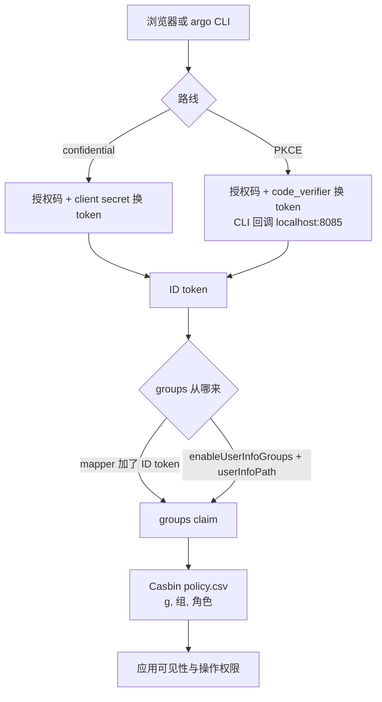

Argo CD 的 SSO 接入有两种结构：走内置 Dex，或直连一个已有的 OIDC 提供方。直连 Keycloak 的配置量很小——一个 client、一段 `oidc.config`、几行 RBAC——但有两个地方几乎人人会错一次：**CLI 登录只支持 PKCE 路线**，而 **`groups` claim 的形状取决于 Keycloak mapper 的 full path 开关，RBAC 里差一个前导斜杠就全部落空**。

本文给出一份可复制的最小配置，重点解释这两处，以及"登录成功但没权限"这一类问题从哪儿开始查。

配置核对自 Argo CD 官方 Keycloak / RBAC / OIDC 文档与 `argocd-cm.yaml` 示例、Argo CD 源码（`util/oidc/oidc.go`、`util/settings/settings.go`，master 分支）、`coreos/go-oidc` v3.12.0，以及 Keycloak `GroupMembershipMapper` 源码（main 分支）；核查日期 2026-09-27。

## 适用 / 不适用

| 场景 | 是否适用 |
|------|----------|
| 自建 Argo CD（Helm chart 或官方 manifests），要改 `argocd-cm` / `argocd-rbac-cm` | ✅ 本文的配置方式 |
| UI 和 `argocd` CLI 都要用公司账号登录 | ✅ 必须选 PKCE 路线，见第 1 节 |
| 上游是 SAML 或 LDAP，Argo CD 要复用同一个入口 | ⚠️ 直连 OIDC 覆盖不到，用内置 Dex 的 connector，见 [Dex + Keycloak 联合身份]() |
| 只是要给流水线一个自动化账号 | ❌ 用本地账号 + API token，不要进交互式 SSO，见 FAQ Q4 |
| 托管的 Argo CD 服务，改不了 ConfigMap | ❌ 配置入口不同 |

## 1. 先决定路线：client secret 还是 PKCE

官方 Keycloak 页面把两条路线分开写，其中一句是关键约束：**要用 argo-cd 命令行登录，就必须选 PKCE 方式**。原因是 CLI 的 SSO 登录会在本地起一个回调监听接收授权码（默认端口 8085，可用 `--sso-port` 改），再交回 argocd-server 换会话，这条路径复用 UI 的 PKCE 端点。

| 配置点 | Client authentication（confidential） | PKCE |
|--------|--------------------------------------|------|
| Keycloak Client authentication | `ON` | `OFF` |
| Argo CD `oidc.config` | `clientSecret: $oidc.keycloak.clientSecret` | `enablePKCEAuthentication: true` |
| Keycloak PKCE Method | 无关 | 必须 `S256` |
| Valid redirect URIs | `https://argocd.example.com/auth/callback` | 上面这条 + `https://argocd.example.com/pkce/verify` + `http://localhost:8085/auth/callback` |
| `argocd login --sso` | ❌ 不支持 | ✅ |
| 主要风险面 | secret 落在 `argocd-secret` | 授权码绑定 code_verifier，回调地址必须精确 |

判断标准只有一条：团队里有没有人用 `argocd` CLI 做交互式登录（流水线里的 API token 不算）。有，就选 PKCE；没有，confidential 更省事。

从 confidential 切到 PKCE 时有一个特定的报错：`invalid_request: Missing parameter: code_challenge_method`。它通常是**浏览器里残留的旧会话 cookie** 造成的——旧的授权请求没有 code_challenge，被 Keycloak 拒了。官方 Troubleshoot 的建议就是换无痕窗口或清 cookie，不用改配置。

## 2. Keycloak 端最小配置

| 字段 | 值 |
|------|-----|
| Client ID | `argocd` |
| Client authentication | PKCE 路线 `OFF`；confidential 路线 `ON` |
| Standard flow | `ON` |
| Implicit flow / Direct access grants | `OFF` |
| Valid redirect URIs | 见第 1 节表格，按路线二选一 |
| Web origins | `https://argocd.example.com` |
| Proof Key for Code Exchange Code Challenge Method | `S256`（PKCE 路线） |

Direct access grants 保持 `OFF`：SSO 接入不需要密码模式，OAuth 2.1 也已移除 Resource Owner Password Credentials（背景见 [OAuth 2.1 变化解读]()）。

## 3. groups claim：这一整套里最容易错的地方

Keycloak 的 **Group Membership** mapper 有一个 `Full group path` 开关，**源码里的默认值是 `true`**（`GroupMembershipMapper`：`property1.setDefaultValue("true")`）。所以在 Admin Console 里新建一个 group mapper 后，claim 实际长这样：

```json
{ "groups": ["/platform/ops", "/platform/dev"] }
```

而不是 `["platform/ops"]`。Argo CD 的 RBAC 是 Casbin 语法，组名逐字符匹配，少一个前导斜杠就匹配不上。症状是**登录成功、界面能进、但应用列表空白或所有操作 403**，日志里没有明显的鉴权错误。

两种形式必须与 RBAC 一致：

| Full group path | claim 形状 | `policy.csv` 写法 |
|-----------------|-----------|-------------------|
| `ON`（默认） | `/platform/ops` | `g, /platform/ops, role:admin` |
| `OFF` | `platform/ops` | `g, platform/ops, role:admin` |

**选哪个？** Argo CD 官方文档让你关掉 Full group path。这里的建议相反：**保留默认的 ON，在 RBAC 里写全路径**。依据就在 Keycloak 源码的字段说明里——关闭后只输出组名，而如果 realm 里存在层级同名组（`/platform/ops` 与 `/legacy/platform/ops` 都叫 `ops`），claim 会退化成无法区分的值。全路径更长，但不会因为重名把不该进 admin 的人放进来。这条取舍在扁平组结构里无所谓，在有多层组织的 realm 里是权限事故。

同一个 `full.path` 开关影响的不止 Argo CD：Harbor 的 `OIDC Admin Group` 与组过滤同样是拿 claim 原值做逐字符比较，配成 `/platform/harbor-admin` 还是 `platform/harbor-admin` 取决于这个开关，见 [Harbor 接入 Keycloak OIDC]()；GitLab 的 `required_groups` 也是逐字符比较，且声明式导入 mapper 时漏写 `"full.path": "true"` 会让 claim 静默变成不带斜杠的形式，见 [GitLab 接入 Keycloak OIDC]()。

另外三点同样常见：

- **Add to ID token 必须 `ON`**。Argo CD 从 ID token 取 `groups`；只勾了 access token 时，认证能过、授权全空。
- **client scope `groups` 挂在 Default，不要挂在 Optional**。Optional 意味着必须由客户端显式请求；`requestedScopes` 省略时 Argo CD 的默认值是 `["openid", "profile", "email", "groups"]`，但一旦有人在 `argocd-cm` 里显式写了 `requestedScopes` 却漏掉 `groups`，组就静默消失了。
- **组变更不会热更新**。Argo CD 在登录时取组并写进自己的会话，后续请求读的是会话里的副本。改完组要用户重新登录才生效；要缩短这个窗口，就把该 client 的 access token 寿命和 `refreshTokenThreshold` 一起调小（见第 4 节）。

如果确实不能让 `groups` 进 ID token，Argo CD 还有一条兜底路线：从 UserInfo 端点取。源码里 `SetGroupsClaimFromEndpoint` 要求 `enableUserInfoGroups` 与 `userInfoPath` **同时**生效，缺一个就静默不取：

```yaml
oidc.config: |
  enableUserInfoGroups: true
  userInfoPath: /realms/ops/protocol/openid-connect/userinfo
```

`userInfoPath` 会拼在 `userInfoBaseURL`（未设置时用 issuer）之后。代价是每个会话多一次到 Keycloak 的调用，并且组变更的可见性依旧受缓存影响。能用 ID token 就不走这条路。

## 4. Argo CD 端最小配置

```yaml
# argocd-cm
apiVersion: v1
kind: ConfigMap
metadata:
  name: argocd-cm
data:
  url: https://argocd.example.com
  oidc.config: |
    name: Keycloak
    issuer: https://sso.example.com/realms/ops
    clientID: argocd
    enablePKCEAuthentication: true
    refreshTokenThreshold: 2m
    requestedScopes: ["openid", "profile", "email", "groups", "offline_access"]
    requestedIDTokenClaims: {"groups": {"essential": true}}
```

四个参数的取值依据：

- **issuer** 必须与 Keycloak discovery 里的 `issuer` 逐字符一致（含末尾无斜杠）。Keycloak 17 之前要带 `/auth` 前缀，26.x 上不要带——照抄旧文档就是第 6 节第一条报错。
- **refreshTokenThreshold** 必须小于 client 的 access token 寿命。Keycloak 的 Access Token Lifespan 默认 5 分钟；把它设成 5m 或更大，Argo CD 会变成每个请求都去换一次 token。
- **requestedScopes** 里的 `offline_access` 用于会话内刷新，不需要刷新就删掉。
- **requestedIDTokenClaims** 的 `essential` 只是让 Argo CD 明确要求 ID token 中包含 `groups`。它**不能代替** Keycloak 侧的 mapper——claim 始终由 mapper 产生，`essential` 只是让缺失更早暴露在认证阶段，而不是等用户登录完再发现没权限。

`clientSecret` 路线改为 `clientSecret: $oidc.keycloak.clientSecret`，并先把值写进 Secret：

```bash
kubectl -n argocd patch secret argocd-secret \
  --patch='{"stringData": { "oidc.keycloak.clientSecret": "<REPLACE_WITH_CLIENT_SECRET>" }}'
```

RBAC 侧：

```yaml
# argocd-rbac-cm
apiVersion: v1
kind: ConfigMap
metadata:
  name: argocd-rbac-cm
data:
  policy.csv: |
    g, /platform/ops, role:admin
    g, /platform/dev, role:readonly
```

三条语义要先说清楚，否则很容易配出一个"看起来能用、实际所有人都是管理员"的结果：

1. `g, <组>, <角色>` 做的是"组 → 角色"绑定。直接写 `p, /platform/ops, applications, get, */*, allow` **不生效**——组必须先被分配角色，挂在组上的 `p` 规则才会被考虑。
2. **认证用户至少获得 `policy.default` 的权限，而且 deny 规则拦不住它**（官方 RBAC 文档明确警告）。所以不要用 `policy.default: role:admin` 图省事；需要放宽时宁可建一个权限极小的 `role:authenticated`，再按组逐个授权。
3. 上线前离线校验，不要靠"点一下界面试试"：

```bash
# 组是否能读某个应用
argocd admin settings rbac can '/platform/ops' get applications 'default/myapp' \
  --policy-file argocd-rbac-cm.yaml

# 策略文件本身是否合法
argocd admin settings rbac validate --policy-file argocd-rbac-cm.yaml
```

两条路线的数据流差异：



## 5. 验证顺序

1. **核对 issuer**：`curl -s https://sso.example.com/realms/ops/.well-known/openid-configuration | jq -r .issuer`，与 `oidc.config.issuer` 逐字符比对（末尾斜杠、`/auth` 前缀、内外网域名三处最容易差）。
2. **登录后看实际 claim**：`argocd account get-user-info -o yaml`，确认 `groups` 的值与第 3 节选的形状一致。这一步比"看界面能不能点"可靠得多——界面表现会被 `policy.default` 掩盖。
3. **离线校验 RBAC**：第 4 节的 `rbac can` / `rbac validate`。
4. **覆盖两类用户**：一个只有单层组的普通用户、一个跨层级组的用户，分别验证；组变更后再让用户重新登录复测一次。

## 6. 常见错误对照表

| 症状 | 根因 | 修复 |
|------|------|------|
| 登录成功但应用列表空白 / 全部 403 | `groups` 没进 ID token，或 full path 形式与 `policy.csv` 不一致 | 先 `get-user-info` 看实际组值，再让 policy 对齐斜杠形式；检查 mapper 的 Add to ID token |
| 启动或登录报 `Failed to query provider ... oidc: issuer did not match the issuer returned by provider, expected "X" got "Y"` | `oidc.config.issuer` 与 discovery 的 issuer 不一致（反代域名、`frontendUrl`/hostname 配置、旧文档里的 `/auth` 前缀） | 以 discovery 返回值为准修正；Keycloak 26 的 URL 由 hostname v2 决定，详见 [Keycloak Hostname v2 配置]() |
| `invalid_request: Missing parameter: code_challenge_method` | 从 confidential 切到 PKCE 后浏览器残留旧会话 | 无痕窗口或清 cookie；确认 Keycloak client 的 PKCE Method 为 `S256` |
| `argocd login --sso` 卡住或回调失败 | `http://localhost:8085/auth/callback` 不在 Valid redirect URIs，或本地 8085 被占用 | 补回调地址；换端口时 Keycloak 侧与 `--sso-port` 同步改 |
| UI 登录 401 或无限重定向 | argocd-server 上残留的旧 OIDC 配置 / 会话状态 | 按官方 Troubleshoot 先 `kubectl rollout restart deployment argocd-server -n argocd`，再判断是否配置问题 |
| 调整组之后权限没变化 | 组在登录时取，已登录会话不更新 | 让用户重新登录；需要更快收敛就缩短 access token 寿命并调整 `refreshTokenThreshold` |
| 所有登录用户都是管理员 | `policy.default` 给了过高权限，且 deny 拦不住 | 换成最小默认角色，再按组授权（第 4 节第 2 条） |
| Keycloak 里删了组，Argo CD 里权限还在 | 用户会话未失效 | 让用户重新登录；必要时在 Keycloak 侧撤销该用户会话 |

## 7. 回滚

1. **先保住入口**：在 SSO 全流程（含 CLI、含一个非管理员用户）验证通过之前，不要设 `admin.enabled: "false"`。只留 SSO 登录路径的部署，在 Keycloak 故障时会同时失去 Argo CD 的运维入口。
2. **回滚 Argo CD 侧**：
   ```bash
   kubectl -n argocd patch cm argocd-cm --type=json \
     -p='[{"op":"remove","path":"/data/oidc.config"}]'
   ```
   移除后登录页回到本地账号；通过 SSO 登录过的用户记录不会消失，重新配置 SSO 后即可再次登录。
3. **回滚 Keycloak 侧**：删除 client 与 group mapper。如果组名被其他应用复用（Grafana、oauth2-proxy 等），先确认没有连带影响再删。
4. **注意 issuer 的连带影响**：如果回滚涉及 hostname / `frontendUrl`，staging 上先验证——issuer 一变，已签发的 token 全部失效，所有用户需要重新登录一次。

## 常见问题（IAM 单点登录）

**Q1：Argo CD 的 IAM 权限用 Keycloak 的组还是 realm 角色？**

看授权变更由谁发起。权限跟着组织架构走、按部门批量调整的团队用组；由集中 IAM 平台维护、变更走审批的团队用 realm 角色。区别在于 Argo CD 的 RBAC 只认 claim 的值，两种来源都能用，但不要在同一个实例上混用两套来源——角色冲突时很难解释谁生效。同类的应用侧映射对照见 [Grafana 接入 Keycloak OIDC]()。

**Q2：Argo CD 用内置 Dex 还是直连 Keycloak OIDC？**

上游只支持 SAML/LDAP，或需要 Dex 的 connector 做额外映射时用 Dex；Keycloak 本身就是 OIDC 提供方时直连，少一层组件、少一套 claim 转换。注意 Dex 路径下 Argo CD 的 `refreshTokenThreshold` 不作用于 Dex 的网页登录流程——Dex 签发的 ID token 过期后用户必须重新登录。

**Q3：为什么 deny 规则挡不住默认角色给的权限？**

`policy.default` 的权限是"所有已认证用户的基线"，官方文档明确说明这部分访问**无法被 deny 规则阻断**。所以授权模型应该建立在"默认权限尽量小"的前提上，而不是靠 deny 兜底。这是 Argo CD RBAC 与常见的"默认拒绝、按需放行"直觉不一致的地方，评审配置时要专门看一眼。

**Q4：CI 流水线里需要 `argocd login --sso` 吗？**

不需要，也不应该。SSO 登录是交互式的，需要浏览器与人。流水线用本地账号 + `apiKey` 能力生成 token，或直接用项目级的 RBAC 角色限定权限范围；把交互式登录塞进流水线既不稳定，也会让权限审计变复杂。

## 参考来源

- [Argo CD: Keycloak](https://argo-cd.readthedocs.io/en/stable/operator-manual/user-management/keycloak/)（两条路线的差异、Valid redirect URIs、Group Membership mapper、CLI 需要 PKCE、Troubleshoot）
- [Argo CD: User Management Overview](https://argo-cd.readthedocs.io/en/stable/operator-manual/user-management/)（`refreshTokenThreshold`、Dex 与直连 OIDC 的边界、`insecureEnableGroups`、UserInfo 取 claim）
- [Argo CD: RBAC Configuration](https://argo-cd.readthedocs.io/en/stable/operator-manual/rbac/)（`g`/`p` 语法、组必须先分配角色、`policy.default` 的 warning、`policy.*.csv` 组合）
- [Argo CD `argocd-cm.yaml` 示例](https://github.com/argoproj/argo-cd/blob/master/docs/operator-manual/argocd-cm.yaml)（`requestedScopes` 默认值、`requestedIDTokenClaims`）
- [Argo CD 源码 `util/settings/settings.go`](https://github.com/argoproj/argo-cd/blob/master/util/settings/settings.go)（`OIDCConfig` 字段、`UserInfoGroupsEnabled`）
- [Argo CD 源码 `util/oidc/oidc.go`](https://github.com/argoproj/argo-cd/blob/master/util/oidc/oidc.go)（`SetGroupsClaimFromEndpoint` 的生效条件、UserInfo URL 拼接）
- [Argo CD CLI: `argocd login`](https://argo-cd.readthedocs.io/en/stable/user-guide/commands/argocd_login/)（`--sso-port` 默认 8085）
- [Argo CD CLI: `argocd account get-user-info`](https://argo-cd.readthedocs.io/en/stable/user-guide/commands/argocd_account_get-user-info/)、[`argocd admin settings rbac can`](https://argo-cd.readthedocs.io/en/stable/user-guide/commands/argocd_admin_settings_rbac_can/)
- [coreos/go-oidc v3.12.0 `oidc/oidc.go`](https://github.com/coreos/go-oidc/blob/v3.12.0/oidc/oidc.go)（issuer 不匹配的错误文本）
- [Keycloak `GroupMembershipMapper.java`](https://github.com/keycloak/keycloak/blob/main/services/src/main/java/org/keycloak/protocol/oidc/mappers/GroupMembershipMapper.java)（`full.path` 默认值与同名层级组说明）
- [Keycloak Server Administration Guide](https://www.keycloak.org/docs/latest/server_admin/index.html)（client scope、Group Membership mapper、Access Token Lifespan 默认值）

相关章节：[Keycloak Hostname v2 配置]()、[Dex + Keycloak 联合身份]()、[Grafana 接入 Keycloak OIDC]()、[Keycloak 直连 Kubernetes OIDC 认证]()、[Keycloak 细粒度权限与授权策略实战]()。
