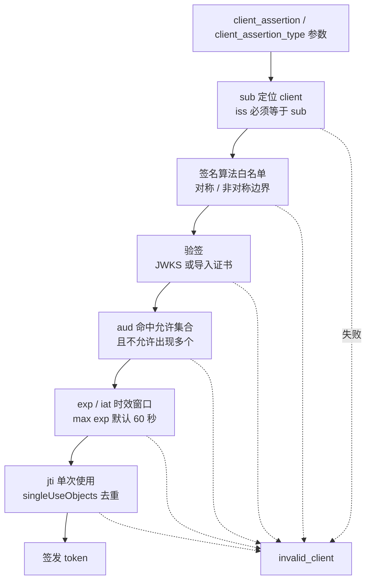

## 场景

服务间调用、定时任务、第三方系统对接——这类 confidential client 的凭据通常就是一个 `client_secret`，写在 Deployment 的环境变量或 ConfigMap 里，从上线那天起没换过。Keycloak 里可以用的客户端认证器有四种（另有由 IdP 代签断言的一种），它们对「谁能签发凭据、允许什么算法、断言多久有效、怎么轮换」的约束各不相同；配错之后报错几乎都是同一个 `invalid_client`，日志只有一句 `Client authentication with signed JWT failed`，看不出到底是密钥不对还是 `aud` 不对。

这篇文章解决三件事：四种认证器的硬边界、`private_key_jwt` 断言的完整校验链（哪些 `invalid_client` 其实与密钥无关）、以及 client secret 不停机轮换怎么做和它的前置条件。

只讨论 token endpoint 上的**客户端认证**，不涉及用户登录流程；用户侧的 MFA/Passkey 落地见 [Passkey / WebAuthn / FIDO2 IAM 企业落地指南]()。下文源码结论取自 Keycloak **26.7.4** tag 的 `services/src/main/java/org/keycloak/authentication/authenticators/client/`，错误文案为该版本源码中的原文；文档与实现不一致时以实现为准。

## 四种认证器与它们的硬边界

| Client Authenticator（控制台） | provider id | 凭据形态 | 算法边界（源码强制） |
|---|---|---|---|
| Client Id and Secret | `client-secret` | 共享密钥，`client_secret_basic` 或 `client_secret_post` | 无签名 |
| Signed JWT | `client-jwt` | 客户端私钥签名断言（= `private_key_jwt`） | 只接受**非对称**算法，否则 `Algorithm is not asymmetric` |
| Signed JWT with Client Secret | `client-secret-jwt` | 用 secret 做 HMAC 签名断言（= `client_secret_jwt`） | 只接受**对称**算法，否则 `Algorithm is not symmetric` |
| X.509 Certificate | `client-x509` | TLS 客户端证书 | 校验 Subject DN 与根 CA Subject DN |

再加一种由 IdP 代签断言的 Signed JWT（SPIFFE JWT SVID、Kubernetes service account 这类跨信任域凭据），它的 `iss` 不等于 `sub`，处理逻辑独立，本文不展开——这类凭据属于工作负载身份，签发、轮换与校验方式见 [SPIFFE/SPIRE 工作负载身份 IAM 落地]()。顺带说明一个常见误用：JWT-SVID 不能直接当 client assertion 用，它的 `sub` 是签发方标识的 SPIFFE ID，不是提出请求的客户端自己。

两条最常踩的硬约束，都来自实现而非文档：

1. **`client-jwt` 不能用 HS256**。`JWTClientAuthenticator.verifySignature` 在验签前要求 `signatureProvider.isAsymmetricAlgorithm()` 为真，否则抛出 `Algorithm is not asymmetric`，最终以 `invalid_client` 返回。
2. **`client-secret-jwt` 不能用 RS256**。`JWTClientSecretAuthenticator` 的检查方向相反（`Algorithm is not symmetric`），且 `JWTClientSecretValidator` 覆盖 `isSymmetricAlgorithmAllowed()` 返回 `true` 才允许对称算法进入白名单；`none` 在所有认证器下都被拒绝。

选型上还需要一个清醒判断：**`client-secret-jwt` 不是在「更安全地使用 secret」**。HMAC 断言的密钥仍然是那个长期共享密钥，它只避免了把 secret 明文放进请求体，一旦 secret 泄露，攻击者照样能签出合法断言。真正要脱离共享密钥，得走 `client-jwt`。

## 按约束选：四种场景

- **调用方不可信（第三方 SaaS、外部运维面），你无法约束它的密钥保管** → `private_key_jwt` + JWKS URL：Keycloak 只保存公钥，私钥永远不出你的边界。
- **自家服务，但共享密钥靠 ConfigMap 分发** → `private_key_jwt`，密钥对在服务侧外部生成。
- **已有成熟的 secret 托管与轮换流程（Vault 等），不想引入密钥管理** → `client-secret` + 轮换策略；并把 **Allowed authentication method** 限制为 `client_secret_basic`，避免 secret 出现在 POST body 里被网关、CI 的 debug 日志记下来。
- **需要证书即身份（能接受 TLS 在 Keycloak 终结或透传）** → `client-x509`，前提见下文 mTLS 一节。

## client assertion 的校验链

四种认证器共用同一套断言校验（`AbstractJWTClientValidator.validate()`），所以下面这些错误的**文案与顺序在所有认证器下一致**，可以照着日志定位：

| # | 校验项 | 失败文案（26.7.4 源码原文） | 触发条件 |
|---|---|---|---|
| 1 | `client_assertion_type` 精确匹配 | `Parameter client_assertion_type has value '...' but expected is '...'` | 必须为 `urn:ietf:params:oauth:client-assertion-type:jwt-bearer` |
| 2 | `sub` 必填，且被当作 client_id | `Token sub claim is required` | Keycloak 用 `sub` 查 client，查不到即 `client_not_found` |
| 3 | `iss` 必须等于 `sub` | 无报错，**该认证器直接跳过** | 见下方说明，这是最难定位的一条 |
| 4 | form 中的 `client_id` 与 `sub` 一致 | `client_id parameter does not match authenticated client` | 同时传 `client_id` 时必须一致 |
| 5 | 签名算法 | `Invalid signature algorithm` | `alg=none`、非对称/对称用错、或与客户端配置的 Signature algorithm 不匹配 |
| 6 | `aud` 命中允许集合 | `Invalid token audience` | 见下方允许值清单 |
| 7 | 不允许出现多个 `aud` | `Multiple audiences not allowed` | 默认开关关闭时 `aud` 数组长度 > 1 |
| 8 | `exp` 必填、时钟偏移 | `Token exp claim is required` / `Token is not active` | 允许偏移 15 秒（`getAllowedClockSkew()`） |
| 9 | 断言的签发窗口 | `Token was issued too far in the past to be used now` / `Token was issued in the future` | Max expiration 默认 60 秒，有 `iat` 时按 `iat` 判定 |
| 10 | `jti` 必填且单次使用 | `Token jti claim is required` / `Token reuse detected` | 去重键为「校验器类名:jti」，存活时间取 `min(exp-now, Max expiration)` |
| 11 | 公钥可加载 | `Unable to load public key`（HTTP 400，`CLIENT_CREDENTIALS_SETUP_REQUIRED`） | Keys 里没配、JWKS URL 不可达、`kid` 找不到 |

这些检查是**按顺序短路**执行的（`AbstractJWTClientValidator.validate()` 的与运算链），日志里出现的永远是第一个失败的检查：



理解这个顺序能省掉大量猜测：如果一份断言的 `aud` 也错了、时间也超了，你只会看到 `Invalid token audience`，改完 `aud` 之后才会看到时间错误。一次性把断言的所有字段对齐，比逐个试错快得多。

### 第 3 条：`iss ≠ sub` 时为什么没有报错

`JWTClientAuthenticator.authenticateClient` 里有一行判断：断言的 `iss` 与 `sub` 不一致时直接 `return`，把请求交给「第三方签发断言」的处理器。也就是说，如果你把 `iss` 写成 realm URL（`https://auth.example.com/realms/myrealm`）而不是 client_id，这个认证器**不会告诉你 iss 错了**，而是不处理；请求继续走后面的认证器，最终以一个缺少可读原因的 `invalid_client` 结束。用了很久的适配器配置直接搬到 `private_key_jwt` 上时，这是第一个会撞上的坑：`iss` = `sub` = client_id。

### 第 6 条：`aud` 到底可以填什么

`JWTClientValidator.getExpectedAudiences()` 给出的允许集合是五个值，命中任意一个即可：

1. realm issuer URL：`https://auth.example.com/realms/myrealm`
2. token endpoint：`.../protocol/openid-connect/token`
3. token introspection endpoint：`.../protocol/openid-connect/token/introspect`
4. PAR endpoint：`.../protocol/openid-connect/ext/par/request`
5. CIBA backchannel authentication endpoint：`.../protocol/openid-connect/ext/ciba/auth`

所以「aud 填 issuer 还是 token URL」并不是二选一——两个都能过。真正会失败的是把 `aud` 填成自己的业务地址、服务名，或者某些客户端库默认塞进去的额外值。

默认**不允许**出现多个 `aud`（`OIDCProviderConfig.DEFAULT_ALLOW_MULTIPLE_AUDIENCES_FOR_JWT_CLIENT_AUTHENTICATION = false`）。如果调用方库习惯在 `aud` 里同时放 issuer 和 token URL，就会得到 `Multiple audiences not allowed`。可以打开服务端开关放宽：

```bash
# SPI 配置项，需在各节点一致
--spi-login-protocol-openid-connect-allow-multiple-audiences-for-jwt-client-authentication=true
```

但注意代价：这个选项在 26.x 源码里已标注 deprecated（`@deprecated To be removed in Keycloak 27`），启用时启动日志会打 warning（`It is allowed to have multiple audiences for the JWT client authentication. This option is not recommended and will be removed in one of the future releases.`）。正确做法是让调用方把 `aud` 收敛成单个值。

### 第 9、10 条：时间与重放

这两条把一大批「看起来像密钥错误」的失败归到时间上：

- **Max expiration 默认 60 秒**（客户端属性 `token.endpoint.auth.signing.max.exp`，控制台字段为 Max expiration）。有 `iat` 时，Keycloak 要求 `currentTime <= iat + maxExp`；没有 `iat` 时退化为 `exp - now <= maxExp`。断言的「签发时刻到请求到达」超过这个窗口，无论是节点时钟漂移、还是把断言缓存起来复用，都会失败。
- **时钟偏移容忍 15 秒**，且 `iat` 在未来超过 15 秒会报 `Token was issued in the future`。容器与 Keycloak 节点没同步 NTP 时，这里会比签名错误更早暴露。
- **`jti` 单次使用**：通过 `singleUseObjects().putIfAbsent()` 落库去重，重复提交同一份断言（哪怕还在有效期内）返回 `Token reuse detected`。这也是 [26.7.4 修复的 stateless 重放问题]()所涉及的同一层机制：去重窗口失效时，断言可被重放。

## 最小配置：private_key_jwt

**第一步：在客户端侧外部生成密钥对**（不要在控制台点 `Generate new keys`，官方已标注该功能 deprecated，且私钥只存在于你下载的那一次，Keycloak 不会保留）：

```bash
keytool -genkeypair -alias my-client -keyalg RSA -keysize 3072 -sigalg SHA256withRSA \
  -validity 730 -storetype PKCS12 -keystore client.p12 -storepass changeit \
  -dname "CN=my-client"

keytool -exportcert -alias my-client -keystore client.p12 -storepass changeit \
  -rfc -file client.pem
openssl x509 -in client.pem -pubkey -noout > public.pem
```

把公钥转成 JWKS（`kid` 必须与签名时 JWT header 里的 `kid` 一致）并托管在一个 Keycloak 可达的地址上。

**第二步：Keycloak 侧配置**（Clients → 目标 client → Credentials）：

| 字段 | 值 |
|---|---|
| Client Authenticator | Signed JWT |
| Signature algorithm | `RS256`（留空表示不校验算法，不建议） |
| Max expiration | 60（默认值就是 60 秒） |
| Keys | 首选 **Use JWKS URL**：密钥更换后 Keycloak 自动重新导入；也可 Import Certificate 导入 `client.pem`，但之后每次轮换都要手工更新 |

对应的客户端属性名（Admin API / 客户端 JSON 里可见）：`use.jwks.url`、`jwks.url`、`token.endpoint.auth.signing.alg`、`token.endpoint.auth.signing.max.exp`。

**第三步：客户端构造断言**：`iss` = `sub` = client_id，`aud` = token endpoint 或 issuer URL（单个值），`iat` = 当前时间，`exp` = now + 60，`jti` = 每次唯一的随机值，用私钥以 RS256 签名。请求形态：

```bash
curl -s -X POST "$KC/realms/$REALM/protocol/openid-connect/token" \
  -d grant_type=client_credentials \
  -d scope=openid \
  -d client_assertion_type=urn:ietf:params:oauth:client-assertion-type:jwt-bearer \
  -d client_assertion="$ASSERTION" | jq -r .access_token
```

## client secret 不停机轮换

**先确认前置条件：这是 Preview 特性。** `secret-rotation` executor 由 `Profile.isFeatureEnabled(Feature.CLIENT_SECRET_ROTATION)` 门控，而该 Feature 在 `Profile` 中定义为 `Type.PREVIEW`。不开特性时，控制台里根本不会出现 `secret-rotation` 这个 executor 类型：

```bash
--features=client-secret-rotation
```

**配置路径**：Realm Settings → Client Policies → Profiles → Create profile → Add executor → 选 `secret-rotation`，然后 Save；再在 Policies → Create policy，condition 选 `client-access-type` = `confidential`，关联该 profile。

三个参数的键名与默认值（源码 `ClientSecretRotationExecutorFactory`）：

| 参数 | 配置键 | 默认值 | 含义 |
|---|---|---|---|
| Secret expiration | `expiration-period` | 29 天 | 新 secret 的有效期 |
| Rotated Secret expiration | `rotated-expiration-period` | 2 天 | 轮换后旧 secret 的剩余有效期，必须小于前者；设为 0 表示轮换瞬间删除旧 secret |
| Remain Expiration Time | `remaining-rotation-period` | 10 天 | 动态客户端注册的 update 请求在此窗口内会自动触发轮换 |

三个容易误解的地方：

1. **轮换不是后台定时任务。** 官方文档明确：不会自动或由后台进程轮换，必须有一次客户端更新动作（控制台 Credentials 页的 Regenerate Secret，或 Admin REST API 的更新）触发。
2. **策略对存量 client 不会自动生效**，需要先建好 policy，再对该 client 执行一次更新。
3. **轮换期间最多两个 secret 同时有效**：新 secret 成为主 secret，旧 secret 变成 rotated secret 并保留到自己的过期时间。

**窗口内为什么不会中断**（源码依据）：`ClientIdAndSecretAuthenticator` 在主 secret 校验失败后会调用 `wrapper.validateRotatedSecret()`；`JWTClientSecretAuthenticator` 在验签失败后用 `wrapper.toRotatedClientModel()` 重试一次。所以「先 Regenerate，再逐个更新调用方」是可行的——但必须在 `rotated-expiration-period` 内改完。

反过来说，**不要用关闭特性来「回滚」轮换**：`OIDCClientSecretConfigWrapper.hasRotatedSecret()` 的第一项就是 `isRotationFeatureEnabled`，特性关闭后 rotated secret 会被直接忽略，窗口内还没改完的调用方会立刻拿到 `invalid_client`。

还有一个纯运维的坑：**通过 Admin REST API 读 client secret 需要 `manage-clients` 权限**。只有 `view-clients` 的账号拿到的是掩码占位符 `**********`（官方文档明确，掩码串就是 10 个星号），客户端列表、单个客户端详情与专用 `/clients/{id}/client-secret` 三个端点的行为一致；需要读 secret 的委派管理员或自动化账号必须显式拿到 `manage-clients` realm 角色。脚本报「secret 读取异常」之前，先确认权限。

## mTLS：能用在哪一层

**开启方式分两段**，容易记混：

```bash
# build time：选择证书来源 provider（前置换 TLS 终结时才需要）
--spi-x509cert-lookup--provider=haproxy

# start/run time：开启 mTLS 校验本身 + 信任库
--https-client-auth=request
--https-trust-store-file=/path/to/truststore.pem --https-trust-store-password=***
```

`--https-client-auth=required` 表示所有请求都必须带证书，`request` 表示有证书才校验。信任库**全局共享，不能按 realm 区分**；管理接口继承主 HTTP 服务器的 mTLS 设置，需要区分时用 `https-management-client-auth` 覆盖。默认使用系统信任库，指定自有信任库时按扩展名识别类型（`.p12/.pfx`、`.jks/.truststore`、`.pem/.crt/.ca`）。

**校验两层身份**：客户端证书的 Subject DN，以及签发它的根 CA 的 Subject DN（源码属性 `ATTR_SUBJECT_DN` / `ATTR_CA_SUBJECT_DN`）。用正则表达式匹配 Subject DN 的能力已经在弃用路径上（实现注释说明它依赖的 `getSubjectDN()` 本身不可靠），且每走一次正则匹配都会打一条 warning，新配置用精确 DN。

CA 这一层有个容易被忽略的兼容行为：如果客户端没配 `ca-subject-dn`，26.7.4 的实现只打一条 warning（提示该配置已弃用、建议补上以提升安全性），随后对该请求**直接返回成功**——源码里在 `caSubjectDN` 为空的分支上留了 `// TODO: enforce CA subject for keycloak 27.0`。也就是说，这个检查在当前版本属于「配了才校验」：只填 Subject DN、不填 CA Subject DN 的客户端可以正常认证。要依赖 CA 白名单做隔离，必须显式配置它并接受 27.0 起的行为变更。

**client_id 的三个来源**依次是：POST form 参数、query 参数、session attribute；都没有时返回 400 `Missing client_id parameter`。

**没有证书时不会报「证书缺失」**：`X509ClientAuthenticator` 在证书链为空时调用 `context.attempted()` 静默跳过，只在 debug 日志里写一句 `x509 client certificate is not available for mutual SSL`。所以 mTLS 排错第一步是开 debug 日志，否则你会怀疑配置而实际上请求根本没带证书。

**TLS 在前置代理终结时的安全前提**：Keycloak 官方明确建议对 X.509 客户端认证优先使用 **TLS passthrough**，因为透传不需要通过 HTTP 头传证书。只有在 re-encrypt / edge 终结这类无法透传的拓扑下，才使用 lookup provider 从头里取证书，可选 `apache` / `haproxy` / `nginx` / `traefik` / `envoy` / `rfc9440`，头名通过 `--spi-x509cert-lookup--<provider>--ssl-client-cert` 指定。此时必须做到：

1. 网络层保证只有代理能连到 Keycloak（这是部署前提，不是 Keycloak 配置项——官方文档只列出下面两条）；
2. 代理必须**覆盖**（而不是附加）该头；
3. `--spi-x509cert-lookup--<provider>--trust-proxy-verification=true` 只能在代理确实校验了证书链时开启——否则任何能构造该头的人都可伪造证书通过认证。

各 provider 的取材方式并不相同，这带来两类容易忽略的差异：`nginx` 的 SSL 模块不暴露客户端证书链，Keycloak 会改用**自己的信任库**把链补全，所以选 nginx provider 时必须先给 Keycloak 配好信任库，否则链校验无从进行；`traefik` 则要求先在 Traefik 侧启用 `PassTLSClientCert` 中间件并设置 `pem: true`，否则请求头里根本没有可用的证书。

RFC 9440 的 `Client-Cert` / `Client-Cert-Chain` 头由 `rfc9440` provider 读取，它的第一道判断是 `httpRequest.isProxyTrusted()`，不满足时记 `HTTP header "..." is not trusted` 并返回空。这层信任判定与 `proxy-headers` / `proxy-trusted-addresses` 是同一套配置，部署顺序与陷阱见 [Keycloak 反向代理真实客户端 IP 与代理信任边界]()。

## 验证

**1. 断言本身**：解出 header 确认 `alg`/`kid`，payload 确认 `iss`=`sub`=client_id、`aud` 是单个允许值、`exp - iat <= 60`。

**2. 事件详情**：客户端断言会被写进事件详情，排错时不用猜是谁发的——启用 admin events 后可以看到 `CLIENT_ASSERTION_ID`（`jti`）、`CLIENT_ASSERTION_ISSUER`、`CLIENT_ASSERTION_SUB`，以及只读密钥加载成功时的 `CLIENT_JWT_KID`。

**3. 客户端配置**（把「我以为配了」变成「确实配了」）：

```bash
kcadm.sh get clients -r "$REALM" -q clientId=my-client \
  --fields clientId,clientAuthenticatorType,attributes
```

重点看 `clientAuthenticatorType` 与 `attributes` 里的 `use.jwks.url` / `token.endpoint.auth.signing.alg` / `token.endpoint.auth.signing.max.exp`。

**4. 轮换演练**：轮换窗口内用旧 secret 和新 secret 各取一次 token，两者都应成功；等 rotated secret 过期后再用旧 secret，必须失败。这一步必须在预发做，因为「旧凭据还能用」是你唯一的回退窗口。

## 常见错误表

| 症状 | 根因 | 修复 |
|---|---|---|
| `Algorithm is not asymmetric` | HS256 配在了 Signed JWT 上 | 改 RS256/ES256，或改用 Signed JWT with Client Secret |
| `Algorithm is not symmetric` | RS256 配在了 Signed JWT with Client Secret 上 | 换成 HS256，或改用 Signed JWT |
| 断言看起来没问题，仍无原因地 `invalid_client` | `iss ≠ sub`，认证器静默跳过 | `iss` 与 `sub` 都填 client_id |
| `Invalid token audience` | `aud` 填了业务地址/服务名 | 改为 issuer URL 或 token endpoint 等五个允许值之一 |
| `Multiple audiences not allowed` | 调用方在 `aud` 里放了多个值 | 收敛为单值（推荐），或临时开 `allow-multiple-audiences-for-jwt-client-authentication` |
| 间歇性 `invalid_client`，重试就好 | 断言签发到请求到达超过 Max expiration（默认 60 秒），或时钟漂移 | 缩短断言本地缓存；校对 NTP；按需调大 max.exp |
| `Token reuse detected` | 复用同一份断言（同一 `jti`） | 每次请求重新签发断言 |
| `Unable to load public key` | Keys 未配置、JWKS URL 不可达、`kid` 不匹配 | 用 JWKS URL 方式让 Keycloak 自动重新导入 |
| 控制台找不到 `secret-rotation` executor | Preview 特性未开启 | 启动参数加 `--features=client-secret-rotation` |
| 轮换后部分调用方失败 | 旧 secret 已过 `rotated-expiration-period` | 窗口内完成更新；或再执行一次 Regenerate 换取新窗口 |
| Admin API 读到 `**********` | 账号只有 `view-clients` | 授予 `manage-clients` |
| mTLS 客户端始终 `invalid_client`，且无 x509 日志 | 请求未带客户端证书，认证器静默跳过 | 开 debug 日志确认证书链；检查代理是否覆盖了证书头 |

## 回滚

1. **认证器切回 Client Id and Secret**：切换即时生效。保留 `private_key_jwt` 的 Keys 配置不要删，那是你切回去的退路。
2. **轮换窗口内发现漏改**：再执行一次 Regenerate Secret——源码 `rotateSecret` 会把当前主 secret 变成新的 rotated secret 并给它一个新的过期时间，相当于重置窗口。不要用「关闭 `client-secret-rotation` 特性」来止血，那会让 rotated secret 立即失效。
3. **mTLS 回滚**：`--https-client-auth` 改回 `none`（或从 `required` 降到 `request`）是 run time 变更；但 `--spi-x509cert-lookup--provider` 是 **build time** 选项，改动需要重新执行 `kc.sh build` 并重建镜像，滚动发布。把它写进变更窗口，不要当成随手可改的参数。

## IAM FAQ

### IAM 里 client secret 和 private_key_jwt 的本质区别是什么？

`client secret` 是对称共享凭据：校验方持有同一份密钥，任何持有者都能冒充任意一方，且必须随调用方一起分发。`private_key_jwt` 是非对称的：私钥只存在于客户端，Keycloak 只保存公钥，凭据不能从服务端复制出去。差别在泄露面上——前者泄露即永久冒用（直到轮换完成），后者只暴露公钥。若调用方是第三方或不可信运维面，走 `private_key_jwt`。

### Keycloak 支持 mTLS 客户端认证吗？

支持，但它的落地成本主要不在 Keycloak 侧，而在 TLS 拓扑：Keycloak 需要看到客户端证书链。TLS 在 Keycloak 自身终结（或 passthrough）时最直接；前置换 TLS 终结时必须用 lookup provider 从 HTTP 头取证书，并满足「只有代理可连」「代理覆盖头部」「`trust-proxy-verification` 仅在代理真的校验证书链时开启」三条前提，否则等于允许伪造证书登录。

### client assertion 的 aud 应该填什么？

Keycloak 接受五个值中的任意一个：realm issuer URL、token endpoint、token introspection endpoint、PAR endpoint、CIBA backchannel authentication endpoint。常见客户端库默认填 issuer URL 或 token URL 都能通过；失败通常是填了业务地址，或一次放了多个值（默认不允许）。

### client secret 轮换需要停机吗？

配置正确时不需要。轮换期间新 secret 成为主 secret，旧 secret 作为 rotated secret 继续被接受（`ClientIdAndSecretAuthenticator` 与 `JWTClientSecretAuthenticator` 都会在主线凭据失败后尝试 rotated secret），窗口长度由 `rotated-expiration-period` 决定，默认 2 天。代价是这个特性在 26.7.x 属于 Preview，需要显式开启；且 rotated secret 的过期时间在轮换那一刻就写进了客户端属性，事后改策略参数不会追溯延长。

## 延伸阅读

- [Keycloak Server Admin Guide — Confidential client credentials](https://www.keycloak.org/docs/latest/server_admin/#_client-credentials)——四种 Client Authenticator 的字段定义、JWKS URL 与导入证书两种公钥来源、控制台生成密钥已 deprecated
- [Keycloak Server Admin Guide — Client Secret Rotation](https://www.keycloak.org/docs/latest/server_admin/#_secret_rotation)——轮换规则、两个并发 secret 的语义、存量客户端需先更新一次
- [Keycloak — Configuring trusted certificates for mTLS](https://www.keycloak.org/server/mutual-tls)——`https-client-auth`、信任库选项与「信任库跨 realm 共享」的限制
- [Keycloak — Using a reverse proxy](https://www.keycloak.org/server/reverseproxy)——x509cert-lookup provider 清单、头部选项、passthrough 与 trust-proxy-verification 的安全警告
- [JWTClientValidator.java](https://github.com/keycloak/keycloak/blob/26.7.4/services/src/main/java/org/keycloak/authentication/authenticators/client/JWTClientValidator.java)、[AbstractBaseJWTValidator.java](https://github.com/keycloak/keycloak/blob/26.7.4/services/src/main/java/org/keycloak/authentication/authenticators/client/AbstractBaseJWTValidator.java)——`aud` 允许集合、15 秒时钟偏移、Max expiration 判定与 `jti` 单次使用
- [ClientSecretRotationExecutorFactory.java](https://github.com/keycloak/keycloak/blob/26.7.4/services/src/main/java/org/keycloak/services/clientpolicy/executor/ClientSecretRotationExecutorFactory.java)——Preview 特性门控与三个参数的默认值
- [RFC 7523](https://datatracker.ietf.org/doc/html/rfc7523)——JWT 作为客户端认证断言的规范依据；[RFC 9440](https://datatracker.ietf.org/doc/html/rfc9440)——`Client-Cert` / `Client-Cert-Chain` 头
- [Keycloak 26.7.4 安全补丁解读与 IAM 升级判断]()——stateless 模式下断言重放防护失效的根因
