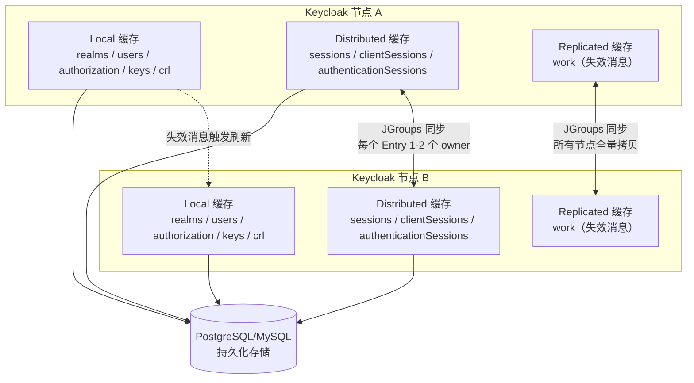
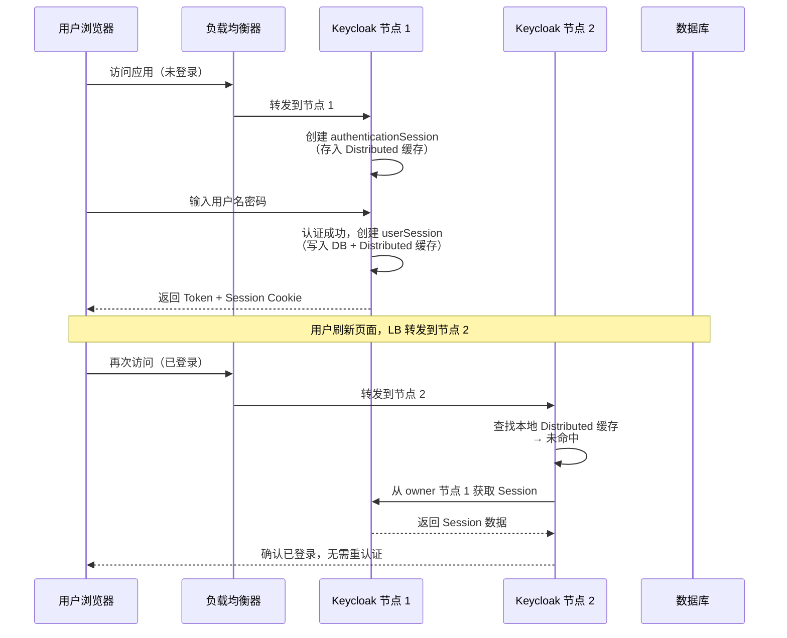

## 场景

你已经按 [Keycloak 高可用集群部署]() 把两个以上的 Keycloak 节点跑起来了，负载均衡器也配好了。但上线后开始遇到：

- 用户登录后刷新页面跳到另一个节点，又弹回登录页——Session 丢了
- 集群日志里频繁出现 `SuspectException` 或 `JGRP000006: failed accepting connection`
- 改了 Realm 配置，另一个节点几分钟后才生效
- 内存占用持续增长，JVM GC 频繁，怀疑缓存没设上限

这些问题根因都在 **Infinispan 分布式缓存层**。本文不重复集群部署步骤，只聚焦缓存层的配置、调优和排错。

## 适用与不适用

| 适用 | 不适用 |
|------|--------|
| Keycloak 24+ Quarkus 发行版，集群模式 | 开发模式（`start-dev`，只有本地缓存） |
| 2 个以上节点组成集群 | 单节点部署 |
| 需要理解 `cache-ispn.xml` 或排查缓存相关问题 | 不需要集群、只用默认配置就能跑 |
| 使用 `jdbc-ping`、`DNS_PING` 等传输栈 | WildFly 旧版 Keycloak（配置路径不同） |

## Keycloak 缓存架构全景

Keycloak 的缓存层由 Infinispan 驱动，按数据特性分为三种缓存类型：



**三种缓存类型说明**：

| 缓存类型 | 包含数据 | 数据一致性 | 容量特征 |
|---------|---------|-----------|---------|
| **Local** | Realm 配置、用户元数据、授权策略、公钥 | 通过 `work` 缓存广播失效消息，各节点独立从数据库刷新 | 每个节点最大 10,000 条（默认），可调 |
| **Distributed** | 在线 Session、认证中 Session、登录失败计数、Action Token | 每个 Entry 在集群中有 1-2 个 owner 节点，其他节点按需远程读取 | 每个节点最大 10,000 条（默认），超出后 LRU 驱逐，下次从数据库加载 |
| **Replicated** | 失效消息（work cache） | 写入时同步到所有节点 | 消息极短生命周期，不应持续增长 |

> **关键理解**：Session 数据同时存在数据库和 Distributed 缓存中。数据库是持久化副本，缓存是热数据副本。节点挂了，其他节点可以从缓存或数据库恢复 Session——不需要共享存储。

### 认证 Session 的生命周期



如果**没有配置会话亲和性**，每次请求都可能在节点间远程取 Session——这增加了延迟和网络开销。生产环境推荐启用会话亲和性（见下文）。

## cache-ispn.xml 关键配置

Keycloak 的 Infinispan 配置文件位于 `conf/cache-ispn.xml`。以下是影响最直接的几个配置段：

### 1. Distributed 缓存容量与 owner 数

```xml
<!-- conf/cache-ispn.xml -->
<distributed-cache name="sessions" owners="1">
    <memory max-count="10000"/>
</distributed-cache>

<distributed-cache name="clientSessions" owners="1">
    <memory max-count="10000"/>
</distributed-cache>

<distributed-cache name="authenticationSessions" owners="1">
    <memory max-count="10000"/>
</distributed-cache>

<distributed-cache name="offlineSessions" owners="1">
    <memory max-count="10000"/>
</distributed-cache>
```

| 参数 | 默认值 | 建议 | 说明 |
|------|--------|------|------|
| `owners` | 1 | 2（生产环境） | 每个 Entry 在集群中的副本数。设为 2 可以在一个节点宕机时不丢 Session（另一个 owner 还在） |
| `max-count` | 10000 | 根据并发用户数调整 | 在线 Session 数 = 并发用户 × 人均 Client Session 数。一个用户登录 3 个应用 ≈ 3 个 clientSession |
| `expiration` | 无显式上限 | 按需设置 | Authentication Session 默认 5 分钟过期（由 Keycloak 代码控制，不在 XML 中） |

**调优公式**：`max-count` ≥ 峰值并发用户 × 2（留缓冲）。例如 5000 并发用户 → 设 `max-count="15000"`。

### 2. Local 缓存容量

```xml
<local-cache name="realms">
    <memory max-count="10000"/>
</local-cache>

<local-cache name="users">
    <memory max-count="10000"/>
</local-cache>

<local-cache name="authorization">
    <memory max-count="10000"/>
</local-cache>
```

`realms` 缓存的条目数与 Realm 数量 + Client 数量 + Role 数量相关，一般不需要调大。但对于有数百个 Client 的大 Realm，建议适当调高。

### 3. 自定义配置方式

不直接修改 `cache-ispn.xml`（升级时会覆盖），而是通过 `conf/cache-ispn.xml` 的模板变量或在启动时传 JVM 参数：

```bash
# 方式一：通过环境变量设置自定义配置文件路径
export KC_CACHE_CONFIG_FILE=/opt/keycloak/conf/my-cache-ispn.xml

# 方式二：自定义 cache 配置文件后启动
bin/kc.sh start --cache=ispn --cache-config-file=/opt/keycloak/conf/my-cache-ispn.xml
```

将默认的 `cache-ispn.xml` 复制一份，修改其中的 `max-count` 和 `owners` 参数。

## 传输栈（Transport Stack）选型

传输栈决定了集群节点如何互相发现。Keycloak 26.x 的可用选项：

| 传输栈 | 传输协议 | 发现机制 | 状态 | 适用场景 |
|--------|---------|---------|------|---------|
| **jdbc-ping** | TCP | 通过数据库 `JGROUPSPING` 表注册节点 | ✅ 默认/推荐 | 裸机部署、VM 部署、简单 K8s |
| **jdbc-ping-udp** | UDP | 通过数据库（UDP 传输） | ⚠️ 已弃用 | 不推荐新项目 |
| **kubernetes (DNS_PING)** | TCP | DNS 解析 Headless Service FQDN | ⚠️ 已弃用 | 旧版 K8s 部署 |
| **tcp (MPING)** | TCP | IP 多播 | ⚠️ 已弃用 | 不推荐 |
| **udp** | UDP | IP 多播 | ⚠️ 已弃用 | 不推荐 |
| ec2/azure/google | — | 云平台 API | ⚠️ 已弃用 | 不推荐 |
| **jdbc-ping** + K8s | TCP | 数据库注册 | ✅ 推荐 | K8s 生产环境 |

> **2026 年推荐**：新部署统一使用 `jdbc-ping`。它是 Keycloak 26.x 的默认选项，通过数据库注册节点，不需要额外网络配置，兼容所有部署环境。K8s 环境下也推荐 `jdbc-ping` 而非已弃用的 `DNS_PING`。

### 启动命令

```bash
# 集群模式 + jdbc-ping（默认）
bin/kc.sh start --cache=ispn --cache-stack=jdbc-ping

# 如果数据库连接信息与 Keycloak 数据库相同，无需额外配置
# JGroups 会自动使用 Keycloak 的 datasource
```

**验证集群形成**：

```bash
# 查看日志确认节点发现
grep -E "ISPN000094|Received new cluster view" /opt/keycloak/logs/keycloak.log

# 期望输出示例：
# ISPN000094: Received new cluster view for channel keycloak: [node1|2] (1) [node1, node2]
```

括号中的数字表示集群中的节点数。如果始终只看到 `(1)`，说明节点发现失败。

## 会话亲和性（Session Affinity）配置

即使 Distributed 缓存可以在节点间迁移 Session，生产环境仍然应该配置会话亲和性——避免每次请求都跨节点远程读取 Session。

### Nginx Ingress Controller

```yaml
apiVersion: networking.k8s.io/v1
kind: Ingress
metadata:
  name: keycloak-ingress
  annotations:
    nginx.ingress.kubernetes.io/affinity: "cookie"
    nginx.ingress.kubernetes.io/session-cookie-name: "KC_ROUTE"
    nginx.ingress.kubernetes.io/session-cookie-path: "/"
    nginx.ingress.kubernetes.io/session-cookie-max-age: "3600"
    nginx.ingress.kubernetes.io/session-cookie-samesite: "Lax"
spec:
  rules:
    - host: sso.example.com
      http:
        paths:
          - path: /
            pathType: Prefix
            backend:
              service:
                name: keycloak-service
                port:
                  number: 8080
```

### HAProxy

```
backend keycloak_backend
    balance roundrobin
    cookie KC_ROUTE insert indirect nocache httponly secure
    server kc1 keycloak-1.example.com:8080 check cookie kc1
    server kc2 keycloak-2.example.com:8080 check cookie kc2
```

### Istio DestinationRule

```yaml
apiVersion: networking.istio.io/v1beta1
kind: DestinationRule
metadata:
  name: keycloak-session-affinity
spec:
  host: keycloak-service
  trafficPolicy:
    loadBalancer:
      consistentHash:
        httpCookie:
          name: KC_ROUTE
          ttl: 3600s
```

## Istio 服务网格兼容方案

当 Keycloak 运行在 Istio 服务网格中时，Infinispan 节点间的 mTLS 可能与 Istio 的 sidecar mTLS 冲突。典型错误：

```
JGRP000006: failed accepting connection from peer SSLSocket
```

**解决方案一**：允许 Keycloak Pod 间直连（绕过 Istio mTLS 对 7800 端口）

```yaml
apiVersion: security.istio.io/v1beta1
kind: PeerAuthentication
metadata:
  name: keycloak-infinispan-direct
spec:
  selector:
    matchLabels:
      app: keycloak
  portLevelMtls:
    "7800":
      mode: PERMISSIVE
```

**解决方案二**：禁用 Infinispan 的 mTLS，依赖 Istio 加密传输

```bash
bin/kc.sh start --cache=ispn --cache-stack=jdbc-ping \
  --cache-embedded-mtls-enabled=false
```

然后在 Istio 中配置 AuthorizationPolicy，只允许 Keycloak Pod 之间访问 7800 端口：

```yaml
apiVersion: security.istio.io/v1beta1
kind: AuthorizationPolicy
metadata:
  name: keycloak-jgroups-internal
spec:
  selector:
    matchLabels:
      app: keycloak
  rules:
    - from:
        - source:
            principals: ["cluster.local/ns/default/sa/keycloak-sa"]
      to:
        - operation:
            ports: ["7800"]
```

## 常见错误排错表

| 错误/症状 | 原因 | 排查命令 | 修复方式 |
|----------|------|---------|---------|
| 启动日志中始终只有 1 个节点 | JGroups 未发现对端 | `grep "Received new cluster view" logs/keycloak.log` | 检查 `--cache-stack` 参数；确认数据库连接可用；K8s DNS_PING 检查 Headless Service FQDN |
| `org.infinispan.remoting.transport.jgroups.SuspectException` | 网络分区、节点间 JGroups 端口不通 | `nc -zv <peer-ip> 7800` | 确认防火墙/安全组放行 TCP 7800；检查 Istio/CNI 网络策略 |
| `JGRP000006: failed accepting connection from peer SSLSocket` | Infinispan mTLS 与 Istio sidecar 冲突 | 观察持续出现该错误且集群未形成 | 配置 `PeerAuthentication` 对 7800 端口 PERMISSIVE（见上文） |
| Realm 配置更新后另一节点不生效 | `work` 缓存失效消息未到达或 Local 缓存未刷新 | 等待 30 秒后检查另一节点；或重启该节点 | 正常情况下应在数秒内同步；若持续不同步，检查 JGroups 连接 |
| 内存持续增长、GC 频繁 | Session 缓存未设上限，或 `max-count` 过小导致频繁驱逐 | `jcmd <pid> VM.native_memory` 或 Prometheus JVM 指标 | 调整 sessions/clientSessions 的 `max-count`；检查是否有离线 Session 堆积 |
| 恢复到数据库备份后 Realm 不显示 | 缓存中旧版本数据未失效 | 重启所有节点；或在启动时加 `--spi-connections-infinispan-quarkus-cache-remote-max-idle=1` | 重启是确保缓存重置的最可靠方式 |
| 节点频繁加入/离开集群 | 网络不稳定或 GC 停顿导致心跳超时 | `grep "view change\|left the cluster" logs/*` | 调大 JGroups FD 超时参数；检查网络延迟；增加节点资源 |

## 验证清单

部署或调优缓存后，逐项验证：

- [ ] 所有节点启动日志中出现 `Received new cluster view for channel keycloak: [nodeX|N]`，括号中 N = 节点总数
- [ ] 在其中一台上创建测试用户，另一台能立即查询到（通过 Admin Console 或 API）
- [ ] 从一个节点登录，关闭该节点后刷新页面仍保持登录（Session 从另一节点恢复）
- [ ] 会话亲和性已配置：同一用户多次请求路由到同一节点（检查 Cookie `KC_ROUTE`）
- [ ] 7800 端口在节点间互通：`nc -zv <peer-ip> 7800`
- [ ] 日志中无持续的 `SuspectException` 或 `JGRP000006` 错误

## 常见问题

### Q: 为什么 Keycloak 用 Infinispan 而不是 Redis？

Infinispan 是 Keycloak 项目中长期使用的嵌入式分布式数据网格，与 JGroups 深度集成可实现节点发现、故障检测和分布式数据结构。Redis 更适合作为**外部的、跨系统的**会话共享存储（例如 oauth2-proxy 的 session store），而 Keycloak 需要的是一种嵌入式、无需外部依赖的集群同步方案。Infinispan 作为嵌入式库内嵌在 Keycloak JVM 中，不需要额外运维 Redis 集群。

### Q: 节点间 Session 同步有延迟吗？

Distributed 缓存的 Session 数据在写入时同步到 owner 节点（无延迟），非 owner 节点按需远程读取（有网络延迟）。如果配置了会话亲和性，绝大多数请求不需要远程读取。

### Q: owners=2 会加倍内存占用吗？

会。每个 Session Entry 在集群中有 2 个副本，分布在 2 个不同节点。但好处是任一节点宕机时 Session 不丢失。建议在 3 节点以上集群中设置 `owners=2`。

### Q: 使用 K8s 时到底用哪个传输栈？

Keycloak 26.x 推荐在所有环境（包括 K8s）统一使用 `jdbc-ping`。它通过数据库注册节点，不需要 DNS 解析、IP 多播或云 API——这是最稳定、最通用的方案。旧版 `kubernetes (DNS_PING)` 已在 26.x 中标记为弃用。

## 回滚方式

如果修改 `cache-ispn.xml` 后出现问题：

```bash
# 1. 恢复默认配置
bin/kc.sh start --cache=ispn --cache-stack=jdbc-ping
# 不指定 --cache-config-file 时 Keycloak 使用内建默认值

# 2. 如果配置了自定义 XML
# 将 my-cache-ispn.xml 恢复为修改前的版本
# 然后重启所有节点

# 3. 极端情况：清除所有缓存数据
# 重启所有节点（Local/Distributed 缓存从数据库重建）
```

## 参考来源

- [Keycloak Server Guide: Configuring distributed caches](https://www.keycloak.org/server/caching) — Keycloak 26.7.0 官方文档
- [Infinispan Configuration Guide](https://infinispan.org/docs/stable/titles/configuring/configuring.html)
- [Keycloak HA & DR Guide]()
