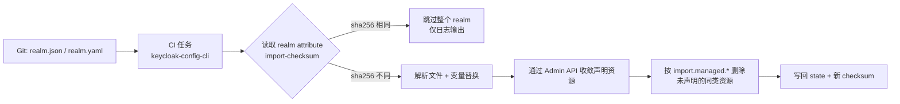

## 场景描述

Keycloak 自带的两条导入路径都撑不起长期配置管理。`--import-realm` 只在 realm 不存在时导入，realm 已存在直接跳过——它的设计目的是防止重启丢状态，不是让你持续同步配置。`kc.sh import` 命令行更麻烦：官方文档明确要求导入/导出时所有节点停止，并且写明这条命令**不会接入缓存集群**，覆盖 realm 会导致集群缓存不一致，建议改用 Admin API 删除后再导入。

所以「Git 里的配置 = 生产配置」这件事只能走 Admin API。keycloak-config-cli（仓库 `adorsys/keycloak-config-cli`，下称 kc-cli）是这条路上最主流的实现：读 JSON/YAML（Keycloak realm 导出格式的裁剪版），通过 Admin API 把 realm 收敛到文件声明的状态。

本文只回答三个问题：它凭什么判断「要不要改」、哪些出厂默认值会让你删掉生产数据、以及在 Keycloak 26.7.x 上要注意什么。

## 判定机制：state 和 checksum 都存在 realm attributes 里

kc-cli 不维护外部状态文件，它把状态直接写回 Keycloak 的 realm attributes。v6.5.1 源码 `ImportConfigProperties.java` 里两个前缀是公开常量：

- `de.adorsys.keycloak.config.state-{0}-{1}` — kc-cli 自己创建过的资源清单（remote state）
- `de.adorsys.keycloak.config.import-checksum-{0}` — 配置文件内容的 SHA-256

checksum 的计算方式是 `sha256(文件内容 + 行为盐)`（`KeycloakImportProvider.java`），比对不上就执行导入，比对得上就整段跳过。日志里出现下面这行，意味着那次运行没有对 realm 做任何写操作：

```
No need to update realm '<realm>', import checksum same: '<sha256>'
```

**这里有一个必须提前建立的认知：它检测的是「文件变了没有」，不是「Keycloak 变了没有」。** 有人在 Admin Console 里给 client 加了 redirect URI，只要 Git 里的文件没动，下一次 apply 因为 checksum 相同会直接返回，什么都不做。所以 kc-cli 不是漂移检测工具，它只保证「文件声明的状态被应用过」。

这条推论决定了两个配套动作：控制台上的手工改动必须回流到 Git（否则会在下次改文件时被静默覆盖回去）；想发现漂移得自己做——定时 `kc.sh export` 或读 Admin REST API 与文件 diff，别指望 apply 帮你发现。

`import.behaviors.checksum-changed` 默认是 `continue`（文件变了就重新导入并更新 checksum）。改成 `fail` 时，只要文件内容相对上次导入发生变化就直接中断——这适合「配置文件不应该在流水线里被意外改动」的护栏场景，迭代期开着它只会不断失败。



注意图中的两条分支不对称：只有 `C→E` 这条路才会走到 `G` 的删除动作，而 `C→D` 那条完全无事发生。生产事故里有相当一部分是「以为 apply 没动，其实动了」或者「以为 apply 会修，其实没跑」。

## 最小可运行配置

凭证不要用 master admin 的密码。给 kc-cli 建一个专用 client，用 `client_credentials`，并把 `KEYCLOAK_LOGINREALM` 指向业务 realm，而不是默认的 `master`。要同时设置 `--keycloak.skip-server-info=true`，否则 kc-cli 会去读 server info 导致非 master realm 登录失败——这是 README 表格里一句话带过、但实际配置时必然踩到的前置条件。

镜像 tag 需要按语义选：`latest` 是「针对最新支持的 Keycloak 版本构建」，会随上游发布漂移；`latest-x.y.z` 里的 `x.y.z` 指的是**构建它所针对的 Keycloak 版本**，不是 kc-cli 自己的版本号。生产上钉到完整 tag。

```yaml
apiVersion: batch/v1
kind: Job
metadata:
  name: keycloak-realm-config
spec:
  backoffLimit: 1
  template:
    spec:
      restartPolicy: Never
      containers:
        - name: kc-cli
          # 钉到与你的 Keycloak 版本匹配的完整 tag，不要用 latest
          image: quay.io/adorsys/keycloak-config-cli:6.5.1-<keycloak-version>
          env:
            - name: KEYCLOAK_URL
              value: "https://keycloak.example.com"
            - name: KEYCLOAK_LOGINREALM
              value: "ops-realm"          # 不要用 master
            - name: KEYCLOAK_GRANTTYPE
              value: "client_credentials"
            - name: KEYCLOAK_CLIENTID
              valueFrom: { secretKeyRef: { name: kc-cli, key: clientId } }
            - name: KEYCLOAK_CLIENTSECRET
              valueFrom: { secretKeyRef: { name: kc-cli, key: clientSecret } }
            - name: KEYCLOAK_SKIPSERVERINFO
              value: "true"               # 非 master realm 登录的前提
            # 默认关闭，Kubernetes 里必须打开，否则 Keycloak 未就绪即失败
            - name: KEYCLOAK_AVAILABILITYCHECK_ENABLED
              value: "true"
            - name: KEYCLOAK_AVAILABILITYCHECK_TIMEOUT
              value: "300s"
            - name: IMPORT_FILES_LOCATIONS
              value: "/config/realm.yaml"
            - name: IMPORT_VARSUBSTITUTION_ENABLED
              value: "true"
          volumeMounts:
            - { name: config, mountPath: /config }
      volumes:
        - name: config
          configMap: { name: keycloak-realm-config }
```

`keycloak.availability-check.enabled` 出厂是 `false`，重试间隔 2 秒、超时 120 秒。在 Kubernetes 里不打开它，Pod 起得比 Keycloak 快就会看到连接错误，然后被判成「配置有问题」，实际只是时序问题。

Helm 场景下 kc-cli 提供 `contrib/charts/keycloak-config-cli`，但它的定位是 chart dependency + hook，不是常驻服务——不要把它做成 Deployment。

## 会删数据的出厂默认值：`import.managed.*`

这是全文最需要停下来看的部分。kc-cli 的删除语义是「按类型接管」：**只要你在文件里定义了某一类资源（比如 `clients`），kc-cli 就接管整个 realm 的该类资源，把没在文件里出现的同类项删掉；如果写成空数组，就是删光该类。** 文件里完全不含该字段，则完全不碰。

更麻烦的是有些类型它无法区分「Keycloak 自动创建的默认项」和「用户创建的项」，所以 `required-action`、`component`、`sub-component`、`authentication-flow`（内置流除外）必须把默认项一并抄进配置文件，否则默认项会被当成多余项删除。

v6.5.1 的 `application.properties` 里出厂默认值如下（19 个键）：

| 出厂默认 | 资源类型键 |
|---------|-----------|
| `full`（定义即接管，未声明即删除） | `authentication-flow`、`group`、`sub-group`、`required-action`、`client-scope-mapping`、`component`、`sub-component`、`identity-provider`、`identity-provider-mapper`、`role`、`client`、`client-authorization-resources`、`client-authorization-policies`、`client-authorization-scopes`、`message-bundles`、`workflow`、`organization` |
| `no-delete`（只增改，不删） | `client-scope`、`scope-mapping` |

这里有一个很容易误判的坑：源码里这 19 个参数的 `@DefaultValue` **全部**标注为 `FULL`，但 jar 内打包的 `application.properties` 把 `client-scope` 和 `scope-mapping` 覆盖成了 `no-delete`——最终生效的是 properties 文件。也就是说 **client 会被删，client scope 不会**。上游 issue #1012（remote state 未覆盖 managed scopes 与 scopeMappings）能解释这个不对称的来历。只读源码注解来判断默认行为，会得到相反结论。

`import.managed.*` 的取值只有 `<full|no-delete>` 两种，没有更细的粒度。要关掉某一类的删除：

```properties
import.managed.client=no-delete
import.managed.role=no-delete
import.managed.required-action=no-delete
```

**用户联邦是风险最高的一类。** kc-cli 对「自己创建过的」user federation，默认行为是删除并重建。删除联邦时，由该联邦提供（并同步）的用户会一并删除，连带 offline token 等关联数据。LDAP/AD 接生产环境前，先确认这条路径的实际行为，必要时把对应类型的删除关掉。具体连接、同步与属性映射见 [Keycloak LDAP / AD 用户联邦]()。

`import.remote-state.enabled` 出厂是 `true`（只清理自己创建过的资源）。**把它设成 `false` 会切换成「清理文件中未声明的所有实体」**——这是整套选项里最危险的一个开关，生产上不要动它。

state 默认以明文存放在 realm attribute 里。要加密需要提供 `import.remote-state.encryption-key`；注意 `import.remote-state.encryption-salt` 出厂是一个硬编码的公共值，源码注释直接写着「出于安全原因，要加密 state 就改掉这个值」。换句话说，只设 key 不换 salt，等于用公开盐加密。

## 用户、密钥与变量替换

`import.users.merge-roles` 和 `import.users.merge-groups` 出厂都是 `false`：文件里没列出的角色/组，会从用户身上移除。上游 #1622 / #1132「User update without groups deletes previously set groups from user」就是这个问题。只做增量维护时把这两个打开。

变量替换需要显式开启（`import.var-substitution.enabled` 出厂 `false`），前缀/后缀默认是 `$(` 和 `)`，**不是** `${` 和 `}`。嵌套替换默认开，`import.var-substitution.undefined-is-error` 默认 `true`——变量拼错会直接失败。CI 里这是好事，但第一次开启要有心理准备：配置文件里任何形如 `$(` 的字符串都会被当成变量。

注意区分两套占位符语法：Keycloak 官方的导入支持 `${MY_VAR}` 这种环境变量占位符，kc-cli 用的是 `$(env:MY_VAR)`。同一份文件不要指望两套同时生效。如果把 kc-cli 的前缀改成 `${`/`}`（3.x 的默认值），Keycloak 内置的 `${role_uma_authorization}` 之类就必须写成 `$${role_uma_authorization}` 转义。

替换在 kc-cli 本地执行：环境变量必须在跑 kc-cli 的那台机器/那个 Pod 上存在，`$(file:...)`、`$(url:...)` 也只读本机可访问的位置。反过来，不要为了省事打开 `logging.level.realm-config=trace`——它会打印包含**敏感信息**的完整配置（上游历史上就有 API 密码明文进日志的 #1302），CI 日志会留存这些东西。

JavaScript 求值是独立的 opt-in 开关，需要同时打开 `import.var-substitution.enabled=true` 和 `import.var-substitution.script-evaluation-enabled=true`，语法固定为 `$${javascript: ... }`（双美元），沙箱里只有一个 `env` 对象，输出必须是可 JSON 序列化的值。文档里提到的 `$(script:javascript: ... )` 是旧语法，官方已不推荐。

## 版本与兼容：v6.5.1 没有测到 Keycloak 26.7

kc-cli 最新发布是 **v6.5.1（2026-05-22）**，README 的口径是「支持 Keycloak 最近 4 个版本」。而 tag `v6.5.1` 的 CI 矩阵实际覆盖的是：21.1.2、22.0.4、23.0.7、24.0.5、25.0.1、26.0.5、26.1.0、**26.5.5**——最高到 26.5.5。Keycloak 当前稳定版是 **26.7.4（2026-09-16）**。

也就是说 26.6.x 和 26.7.x 都不在 kc-cli v6.5.1 的测试矩阵里。源码中还保留了按版本编译的兼容 profile（`-Ppre-keycloak26-4`、`-Ppre-keycloak26`、`-Ppre-keycloak23`、`-Ppre-keycloak22`），说明不同 Keycloak 版本需要不同的构建产物，不存在「一个 jar 通用」这回事。

本书的建议：镜像钉到与你的 Keycloak 版本匹配的完整 tag；升级 Keycloak 小版本时，kc-cli 也要一起在预发验证；如果在 26.7.x 上遇到 Admin API 行为差异，先怀疑 kc-cli 尚未覆盖该版本，再怀疑自己的配置文件。

## 已知边界与未支持项

这些是上游 issue 里长期挂着的能力缺口，落地前应该知道，而不是等出事才发现：

| 上游 issue | 状态 | 对你的影响 |
|-----------|------|-----------|
| #1645 没有 dry-run / plan 模式 | OPEN | 你不能「先看看会改什么」。只能靠 staging realm 预演 + 事前导出快照 |
| #1673 不能把某个角色标记为不可改 | OPEN | 想保护个别内建角色做不到，`no-delete` 是唯一的粗粒度手段 |
| #1680 6.5.0 起 UserProfile 更新忽略 `http-proxy` / `ssl-verify` / 超时 / TLS | OPEN | 强制经代理出网的内网环境，会在用户属性更新这一步失败；上线前用一次含 User Profile 变更的 apply 验证 |
| #1660 捆绑的 Spring / Jackson / logback 存在已知 CVE | OPEN | 把它当特权管理工具：镜像钉 digest、纳入镜像扫描、只在内网 CI 跑，不要暴露成常驻服务 |
| #1652 realm 的 organization 超过 10 个时 reconcile 会重复创建 | OPEN | 用 Organizations 做多租户时先控制数量或等修复，见 [Keycloak Organizations 多租户实践]() |

另外有一条 FGAP 相关的硬边界：kc-cli 官方文档标注，Keycloak 在 FGAP V2 下**有意屏蔽**了 `admin-permissions` 客户端的 Authorization Services API 端点（返回 HTTP 400 `unknown_error`），并引用了 keycloak/keycloak#43977（该 issue 已关闭）。意思是这个客户端的授权模型不打算让外部工具改。在启用 FGAP v2 的 realm 上，不要试图用 kc-cli 管理它，详见 [Keycloak IAM 细粒度权限与授权策略实战]()。

## 误删防护：一份可以照抄的安全基线

1. **apply 之前先导出快照。** 用 `kc.sh export`，注意官方要求导出时所有节点停止以保证一致性——要么放进维护窗口，要么明确接受快照可能不完整。Console 的 partial export 不能当回滚源：它会把密码和 client secret 全部掩码成 `*`。导出/导入的完整取舍见 [Keycloak 导出与导入实践](/blog/keycloak-export-import-on-k8s/) 和 [高可用与灾难恢复]()。
2. **`import.validate` 显式写死，不要依赖默认值。** v6.5.1 的 `application.properties` 里是 `import.validate=true`，而同一版本的 README CLI 选项表写的是默认 `false`——文档与实现对不上，这种地方只能显式声明。
3. **不可重建的资源一律 `no-delete`**：user federation、client authorization policies、以及任何由业务在运行时动态创建的资源。
4. **生产保持 `import.remote-state.enabled=true`**，永远不要为了「一次性清干净」把它关掉。
5. **`import.cache.key` 默认是 `default`。** 多个团队、多份配置集管理同一个 realm 时，各自用不同的 cache key，否则 checksum 会互相干扰。
6. **变更分级：** 新增类改动可以自动合入；涉及删除的改动（文件里少了某个 client / role / group）必须人工 review diff 后再放行。

## 验证

1. **幂等验证（最强的自检）。** 第一次 apply 应该有实际变更；紧接着跑第二次，日志里必须出现 `No need to update realm '<realm>', import checksum same: '<sha256>'`。这同时证明了三件事：工具连得上、文件被正确解析、状态写入成功。
2. **状态核对。** `GET /admin/realms/{realm}` 读取 realm attributes，应该能看到 `de.adorsys.keycloak.config.*` 前缀的 state 与 checksum 条目。这是判断「某次 apply 到底跑没跑」的唯一可靠依据——比翻 CI 日志可靠得多。
3. **端点侧验证。** 用 client_credentials 取一次 token，确认 issuer 与 audience 与改动前一致。配置类改动最容易被业务发现的形态，是某个 client 的 redirect URI 或协议 mapper 被删。

## 常见错误症状表

| 症状 | 根因 | 处理 |
|------|------|------|
| apply 显示成功，但控制台看不到任何变化 | checksum 与服务端记录一致，整段跳过 | 这是幂等命中。要看是否真的改了文件（内容变化才触发导入） |
| 手工在控制台新增的 client 在下次改文件后消失 | `import.managed.client=full` 出厂默认接管该类 | 属预期行为；要么把改动回流 Git，要么把该类设成 `no-delete` |
| 一批 role / group 在导入后消失 | 文件里定义了同类资源，未声明的被判定为多余项 | 补全声明，或按类型设 `no-delete` |
| 导入后 LDAP 用户和 offline token 不见了 | user federation 被删除重建 | 立刻停止流水线；从导出快照恢复；把对应类型设为 `no-delete` 后重跑 |
| 报变量未定义，明明是普通文本 | 启用了变量替换（前缀 `$(`），文件里有形如 `$(` 的字符串 | 转义或调整 prefix/suffix；确认 `undefined-is-error` 的预期 |
| 非 master realm 登录失败 | 缺少 `--keycloak.skip-server-info=true` | 按上文最小配置补齐 |
| Keycloak 刚启动时任务失败 | availability check 出厂关闭 | 打开 `keycloak.availability-check.enabled` 并把超时调到足够大 |
| 用户属性更新失败，其他资源正常 | 6.5.0 起 UserProfile 更新忽略代理/TLS 选项（#1680） | 走直连或换版本，别在这一步浪费时间排代理配置 |
| 用 FGAP v2 的 realm 上配置 `admin-permissions` 报 400 `unknown_error` | Keycloak 有意屏蔽该端点 | 属设计行为，不要用 kc-cli 管理它 |

## 回滚

**核心约束：删除动作不可逆。** kc-cli 没有 dry-run（#1645），也没有「撤销上一次 apply」。回滚只能依靠事前快照，再 apply 一遍旧文件是恢复不了已被删除的对象的。

顺序建议：

1. **先停流水线。** 发现异常后第一件事是停掉定时任务与 CI 触发，否则下一次 apply 会继续按当前文件收敛，扩大损失。
2. **用最新导出快照评估损失。** 对比快照与当前 realm，确认被删的是 client、role、group 还是 federation 用户。
3. **只恢复删除项**。realm 级对象可以从快照里重建；但要注意密钥类数据：CLI 全量导出与 Console partial export 对 client secret 的处理不同，Console 导出用 `*` 掩码，**不能用来恢复密钥**，密钥需要从你的 secret 管理系统重新下发。
4. **修正 Git 文件后再 apply。** 文件内容改回旧版本时 checksum 也会变回旧值，因此导入会正常执行。
5. **长期护栏：** 生产禁掉删除类清理（对应类型设 `no-delete`），在预发保留 `full`，让预发先替你暴露误删。回归流程里的基线抽查项见 [Keycloak 生产巡检与运维清单]()，从零搭建的整体顺序见 [Keycloak 生产环境完整部署路线图]()。

## 常见问题（FAQ）

**Q: 用了 keycloak-config-cli，还需要给 Keycloak 做 IAM 配置备份吗？**

需要，而且两者不重叠。kc-cli 保证「Git 里的声明被应用过」，它不保存运行时状态：用户、会话、密钥、以及任何没写进文件的配置都不在它的覆盖范围内。配置即代码 + 定期导出快照是两件事，缺一个都会在最需要的时候发现没有可回滚的基线。

**Q: 它能不能检测有人在控制台手改了 IAM 配置（配置漂移）？**

不能。判定依据是配置文件内容的 SHA-256，与 Keycloak 实际状态无关。手工改动在下次改文件之前不会被发现，之后会被静默覆盖。要做漂移检测，得用导出的 realm JSON 与 Git 里的文件做定时 diff，把它当成独立任务而不是 apply 的副产品。

**Q: 多个团队、多个 IAM realm 共用一套流水线怎么办？**

每个 realm 一份独立配置、独立的 `import.cache.key`、独立的服务账号与 RBAC 边界。cache key 出厂都是 `default`，共用会让 checksum 记录互相覆盖，表现是「改了文件但没生效」或「没改文件却重新导入」，而且日志上看不出明显异常。另外别让多个团队共用一个高权限服务账号——一次误删的爆炸半径会覆盖全部 realm。

**Q: LDAP/AD 用户联邦能不能交给 kc-cli 管理？**

可以声明，但要非常小心：默认行为包含删除重建，而删除联邦会连带删除该联邦提供的用户和 offline token。权威源在目录、且用户量大的场景，建议把联邦相关的删除关掉（`no-delete`），只接受新建与参数更新，联邦的生命周期改动走变更流程人工执行。

**Q: 只改一个 client 的配置，会影响到别的 client 吗？**

会——只要你把这个 realm 的任何一个 client 写进文件，kc-cli 就接管整个 realm 的 clients 类型，其余未声明的 client 都会被删除。想只维护一个 client 而不接管全部，必须把该类设成 `no-delete`，或者把所有 client 都纳入文件。这也是为什么第一次接管存量 realm 时，正确的做法是先全量导出、裁剪、再上流水线。

## 技术来源

- keycloak-config-cli 仓库与文档：<https://github.com/adorsys/keycloak-config-cli>；`docs/MANAGED.md`（remote state、`import.managed.*`、全量接管与删除语义）、`docs/IMPORT.md`（Ant 风格文件定位）、`docs/javascript-substitution.md`（`$${javascript: ... }` 语法与两个开关）、`README.md`（CLI/env 选项表、镜像 tag 语义、availability check、兼容性口径）
- 发行版本：v6.5.1，2026-05-22（GitHub Releases API）；Docker/Quay 发布由仓库 CI 在多个 Keycloak 版本上分别构建
- 源码依据（tag `v6.5.1`）：`src/main/resources/application.properties`（`import.validate=true`、`import.remote-state.enabled=true`、硬编码 `encryption-salt` 及安全注释、`import.managed.*` 全部出厂值）、`src/main/java/de/adorsys/keycloak/config/properties/ImportConfigProperties.java`（`de.adorsys.keycloak.config.state-{0}-{1}`、`.import-checksum-{0}` 前缀常量；19 个 `import.managed` 键及其 `@DefaultValue("FULL")`）、`src/main/java/de/adorsys/keycloak/config/service/checksum/ChecksumService.java` 与 `.../provider/KeycloakImportProvider.java`（`sha256(content + salt)` 与 `No need to update realm ... import checksum same` 日志）、`.github/workflows/ci.yaml`（兼容矩阵与 `-Ppre-keycloak*` profile）
- keycloak-config-cli issues：#1645（dry-run）、#1673（不可改角色）、#1680（UserProfile 忽略代理/TLS）、#1660（捆绑依赖 CVE）、#1652（Organizations 分页导致重复创建）、#1012（remote state 未覆盖 scope/scopeMapping）、#1622 与 #1132（用户组被移除）、#1302（密码进日志）
- Keycloak 官方文档「Importing and exporting realms」（`--import-realm` 对已存在 realm 跳过、`import` 命令不接入缓存集群并建议改用 Admin API、Console partial export 掩码敏感值、导出一致性要求）：<https://www.keycloak.org/server/importExport>
- Keycloak FGAP v2 屏蔽 `admin-permissions` 授权端点：<https://github.com/keycloak/keycloak/issues/43977>
- Keycloak 版本基线：26.7.4（2026-09-16，GitHub Releases API）

工具行为以你部署的具体版本为准；升级 Keycloak 或 kc-cli 前，先在预发跑一次全量 apply 并核对 realm attributes。
