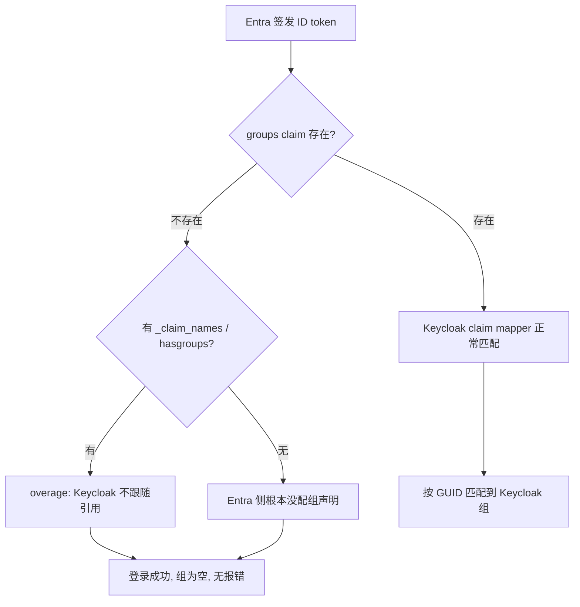

## 场景

企业已经在 Microsoft Entra ID（原 Azure AD）里管理员工和组，现在要把 Entra 作为上游 IdP 挂到 Keycloak 下，由 Keycloak 作为统一 IAM 入口向内部应用发 token。联调时登录是通的，但下游应用的 RBAC 全部失效——用户能进系统，却拿不到任何角色。

排查时通常会先怀疑 Keycloak 的 mapper 写错了，于是反复改组路径、改 claim 名。真正的原因往往不在 Keycloak：**Entra 的 `groups` claim 不是一个稳定输出**，它会在用户组数超限时被整体省略，而 Keycloak 的 claim mapper 不会去解析那个替代它的 Graph 指针。这种情况下 mapper 配置完全正确，结果依然是没有组。

本文处理三个具体问题：

1. 内置 Microsoft provider 和通用 OIDC provider 各自能做到什么，什么时候必须换路线；
2. Entra 的组声明在什么条件下会消失，消失后 Keycloak 侧会发生什么（包括对**已有用户**的影响）；
3. 多租户场景下 `iss` 校验、`common` 端点和 `tid` 的边界。

## 先说结论

- **需要基于 Entra 的组做授权，就必须用通用 OIDC provider（`oidc`），不要用内置的 Microsoft provider。** 内置 provider 的用户档案来自 Graph `/me`，默认 scope 只有 `User.read` 且不含 `openid`，而 `oidc-advanced-group-idp-mapper` 的兼容列表里没有 `microsoft`，Admin 界面根本不会给出组映射选项。
- **组数超限时 Entra 不报错，只是把 `groups` claim 换成一个指向 Graph 的引用。** Keycloak 不跟随该引用，于是"登录成功 + 零组"成为静默结果。
- **如果 mapper 的有效同步模式是 `FORCE`，组消失的后果不只是新用户没有组**：每次登录都会重新计算，已经进过组的用户会被移出组。这是本文最需要在生产上注意的一条。

## 两条接入路线的能力边界

Keycloak 里接 Entra 有两条路，它们不是"简单版 / 复杂版"的关系，而是能力集不同。

| 维度 | 内置 Microsoft provider（`microsoft`） | 通用 OIDC provider（`oidc`） |
|------|--------------------------------------|------------------------------|
| 实现基类 | `AbstractOAuth2IdentityProvider` | `OIDCIdentityProvider` |
| 用户档案来源 | Graph `https://graph.microsoft.com/v1.0/me/` | OIDC userinfo（Entra 侧即 `https://graph.microsoft.com/oidc/userinfo`）+ ID token |
| 默认 scope | `User.read`（`MicrosoftIdentityProvider.DEFAULT_SCOPE`） | `openid` |
| ID token | 不请求，因此 token 内的 claim 映射无从谈起 | 有，claim mapper 的主要输入 |
| `iss` 校验 | 无（不比对 issuer） | `OIDCIdentityProvider.validateToken` 按配置的 issuer 精确比对 |
| 租户限制 | `tenantId` 留空即 `common`；具体租户只在**外部 token 交换**路径比对 `tid` | issuer 固定到具体租户，校验天然生效 |
| 组映射 mapper | 列表里没有 | `oidc-advanced-group-idp-mapper` 可用 |

两个细节值得展开，因为它们决定了上面的判断：

**为什么内置 provider 里找不到组映射？** `AdvancedClaimToGroupMapper.COMPATIBLE_PROVIDERS` 只有 `keycloak-oidc` 和 `oidc`，而 Admin REST 的 `identity-provider/instances/{alias}/mapper-types` 是按 `IdentityProvider.isMapperSupported` 过滤的——它要求兼容列表包含 mapper 的任意 provider 标记或当前 IdP 的 `providerId`。内置 Microsoft provider 的 `providerId` 是 `microsoft`，两条都不满足，所以 UI 的下拉里不会出现它。即使绕过 UI 把 mapper 写进去，claim 来源也不成立：内置 provider 拿用户信息是拿 access token 去调 Graph `/me`（`doGetFederatedIdentity`），既没有 ID token，Graph `/me` 也不返回 `groups`。

**内置 provider 的租户限制容易被误读成安全边界。** `MicrosoftIdentityProvider.isTenantRestricted` 把 `common`、`organizations`、`consumers` 一律视为"不限制"，只有填了具体租户 ID 才算限制；而且这处比对发生在 `validateExternalTokenThroughUserInfo`（外部 token 交换）里，比的是传入 token 的 `tid`。换句话说，`tenantId` 留空 = 多租户端点 = 任何 Entra 租户的账号都能完成登录。这不是"配置方便"，是准入范围的放宽。

## Entra 侧：groups claim 的三种形态

Entra 发组声明的方式由应用注册的 `groupMembershipClaims` 决定，但**发不发得出来还要看用户的组数量**。三种形态：

| 形态 | 触发条件 | token 里的表现 | Keycloak 侧结果 |
|------|---------|---------------|----------------|
| 正常 | 组数在限额内（SAML 150 / JWT 200，含嵌套组） | `groups: ["<group-object-id>", ...]` | mapper 可匹配 |
| overage | 超过限额，或 token 体积超限 | 无 `groups`；出现 `_claim_names.groups = "src1"` 与 `_claim_sources.src1.endpoint`（指向 Graph 的成员查询接口） | **静默零组** |
| hasgroups | 隐式流 token 且用户组数超过 5 | `hasgroups: true` | **静默零组** |

overage 用的不是自定义机制，而是 OpenID Connect Core 的 aggregated / distributed claims（5.6.2）：值被换成引用，消费方需要自己去取。Keycloak 的 `AbstractClaimMapper` 只读 token 里的 claim，**不解析 `_claim_sources` 里的 endpoint，也不会替你调 Graph**。所以"登录成功但没组"这个现象，在 Keycloak 侧没有任何报错，日志里也找不到线索。



图后需要说明的是判断顺序：**先确认 token 里到底有没有 `groups`**，再去怀疑 mapper。这两个故障的处置方式完全不同（前者改 Entra 配置，后者改 Keycloak 映射），混在一起排查会浪费大量时间。

## 三种让组稳定进入 token 的做法

| 做法 | 配置位置 | 代价与限制 |
|------|---------|-----------|
| 只发分配给本应用的组 | Token configuration → Add groups claim → **Groups assigned to the application**（manifest `groupMembershipClaims: "ApplicationGroup"`）+ 在 Enterprise app 的 Users and groups 里把组 Assign 进来 | 组级分配需要 Entra ID P1/P2；`All` 与 `ApplicationGroup` 互斥，`All` **不包含** assigned 组 |
| 改用 app roles | 应用清单里定义 app roles，并把用户/组分配到具体角色 | 基于角色而非组的授权（微软官方对新应用的建议）；不受组数限额影响，角色集可控 |
| 组过滤 | Enterprise apps → 对应应用的属性里配置 Group filter | 只对该入口配置的组声明生效，不能解决"组数已经超限"的根因 |

三个容易踩的坑：

- **`emit_as_roles` 会挤掉 app roles。** 把组声明改成 role claim（`additionalProperties` 加 `emit_as_roles`）之后，应用里已配置的 app roles **不会**再出现在 role claim 中。AD FS 迁移历史应用时经常这么做，结果是新加的 app role 永远读不到。
- **组显示名不是 claim 值。** 默认发的是组的 **ObjectId（GUID）**，不是名字。`sAMAccountName` / `GroupSID` 这类属性只有从 Active Directory 同步过来的组才有，云原生组没有；多个 AD 域同步到同一租户时同名组还会冲突。云组想发显示名，只能走 `cloud_displayname`，且要求 `groupMembershipClaims` 已经是 `ApplicationGroup`。
- **改本应用的清单不影响 Graph 的 access token。** access token 的 claim 由**资源方**的清单决定，不是客户端的。内置 provider 用 `User.read` 换到的 access token 面向 Graph，你在自己应用注册上怎么配组声明，都不会改变那个 token 的内容。

## 最小配置：通用 OIDC provider + 组映射

Entra 侧：App registrations 里新建应用，Redirect URI 类型选 **Web**，值填 Keycloak 的回调地址：

```
https://<keycloak-host>/realms/<realm>/broker/<idp-alias>/endpoint
```

Token configuration 里按上一节的方式配好组声明；如果走过 `AADSTS50011`，先核对这里和 Keycloak 里的一字不差。

Keycloak 侧：Identity providers 里新增 **OpenID Connect v1.0**，Alias 用 `entra-id`，Issuer 填具体租户（见下一节），Client ID / Secret 用应用注册里的值。不要用内置的 Microsoft 模板。

然后在该 IdP 的 Mappers 里加 **Advanced Claim to Group**：

```json
{
  "name": "entra-platform-ops",
  "identityProviderAlias": "entra-id",
  "identityProviderMapper": "oidc-advanced-group-idp-mapper",
  "config": {
    "claims": "{\"groups\":\"<platform-ops-group-object-id>\"}",
    "group": "/platform/ops",
    "are.claim.values.regex": "false",
    "syncMode": "FORCE"
  }
}
```

配置项语义来自源码：`claims` 是"claim 名 → 期望值"的映射，支持用 `.` 引用嵌套 claim（需要字面点号时用 `\\.` 转义）；`are.claim.values.regex` 关闭时按精确值匹配，打开后 claim 值走正则；`group` 是 Keycloak 里的组**路径**。

两个不显眼的行为：

- **组路径写错不会报错。** `KeycloakModelUtils.getGroupForIdpMapper` 找不到路径时只写一行 `Unable to find group by path ...` 的 warn 然后返回 null，mapper 直接跳过。登录照常成功。排查"mapper 配了但没生效"时，先去翻服务端日志里的这行 warn。
- **claim 的查找顺序是 access token → ID token → userinfo。** `AbstractClaimMapper.getClaimValue` 先看 access token，命中就返回，否则再看 ID token，最后才看 userinfo。所以把 `groups` 只配到 ID token 是可行的（会回落），但不要两边都配成不同的值——access token 那边一旦有值就会优先。

## 用户标识：mail、userPrincipalName 与 oid

内置 provider 取用户名的逻辑（`extractIdentityFromProfile`）是：先取 Graph `/me` 的 `mail`；为空则取 `userPrincipalName`，而且**只有它通过邮箱格式校验时才使用**；再不行就用 Graph 返回的 `id`。于是两类用户会得到意外结果：没有邮箱代理地址的账号，用户名字段直接变成 GUID；来宾账号或未验证域名的账号，`userPrincipalName` 形如 `user@tenant.onmicrosoft.com`。

走通用 OIDC provider 时，`preferred_username` 就是那个 UPN，`email` 属于可选声明，不配就没有。无论哪条路线，把邮箱当稳定外部键都会导致同一个自然人在 Entra、Keycloak、下游应用里对应到不同标识，最终表现为"重复账号"或"账户链接不上"。

建议：把**目录里的不可变对象 ID（`oid`）作为稳定外部键**，邮箱只作为展示属性；JIT 场景下用 `Username Template Importer` 这类 mapper 明确指定用户名模板，不要让默认行为决定用户名。

## 多租户的边界：issuer 模板与 tid

Entra 的多租户别名端点在 discovery 里给出的 issuer 是一个**带占位符的模板**：

```
https://login.microsoftonline.com/organizations/v2.0/.well-known/openid-configuration
→ "issuer": "https://login.microsoftonline.com/{tenantid}/v2.0"
```

真实 ID token 的 `iss` 是具体租户。而 Keycloak 的 `OIDCIdentityProvider.validateToken` 会在 issuer 配置非空时做精确比对，不匹配就抛 `Wrong issuer from token. Got: ... expected: ...`。**把 discovery 里的 `{tenantid}` 模板原样抄进 Issuer 字段，登录一定失败。**

处理方式：Issuer 字段填具体租户 issuer；确实需要接受多个租户时，用英文逗号分隔多个 issuer（源码按 `,` 切分后逐个比对）。这比把 issuer 留空要安全得多——留空等于不校验。

另外两点边界：

- 该端点的 `userinfo_endpoint` 指向 `https://graph.microsoft.com/oidc/userinfo`，返回的 claim 集受限且**不含 `groups`**。不要指望靠 userinfo 兜底拿组，它和 Graph `/me` 一样不是组声明的来源。
- 内置 provider 的 `tid` 比对只发生在外部 token 交换路径（`validateExternalTokenThroughUserInfo`），走的是普通浏览器登录流程时不会因为租户不匹配而拒绝。

## 企业应用分配：AADSTS50105 与 roles claim

配置组声明的过程经常要动"谁能访问这个应用"，这会把另一个报错牵进来：

- 企业应用的 **Assignment required? = Yes** 且请求用户没有分配时，Entra 直接返回 `AADSTS50105`。这与组声明在同一个应用的属性/分配页面，改配置前后要注意区分是登录被拦还是映射没生效。
- 分配时选 **Default Access** 可以满足分配要求，但它**不会**给 token 加 `roles` claim。用 app roles 做授权时，必须分配到具体角色，否则角色永远为空。
- **全局管理员不受分配限制**，用管理员账号测试会得到假阳性——排障要用受影响的普通用户账号重放。
- 组级分配需要 Entra ID P1/P2 许可。

## 验证

按"从上游到下游"的顺序验，每一步失败都能直接定位到一层：

```bash
# 1. 先看 Entra 到底发了什么：取一条真实 ID token 解码，确认 groups / _claim_names / hasgroups / roles
#    （在 jwt.ms 之类的解码器里粘 ID token，或本地解码 JWT payload）
#    关键判断：有 groups → Entra 侧没问题；有 _claim_names → overage；都有没有 → 组声明没配

# 2. 再看 Keycloak 侧 mapper 是否命中：登录一次，看用户实际进了哪些组
kcadm.sh get users -r <realm> -q username=<user> --fields id,username
kcadm.sh get users/<user-id>/groups -r <realm>

# 3. 最后看下游应用拿到的 claim（以 roles 为例）
kcadm.sh get users/<user-id>/role-mappings/realm -r <realm>
```

第 2 步的组列表为空时，先回去看第 1 步的 token——顺序颠倒会一直卡在改 mapper 上。

## 排错表

| 症状 | 根因 | 处理 |
|------|------|------|
| 登录成功但用户没有任何组 | Entra 侧 overage，`groups` 被 `_claim_names` 取代 | 改成只发 assigned 组，或改用 app roles |
| 升级/扩容后一批老用户突然丢组 | 组数越过限额触发 overage，且 mapper 同步模式为 `FORCE`，每次登录重算 | 先改 Entra 组声明范围，再核对被移出的用户 |
| mapper 配好但完全不生效，日志无异常 | `group` 路径不存在，mapper 直接返回 null | 搜服务端日志的 `Unable to find group by path`；补建组或改路径 |
| 登录跳回 Keycloak 报 `Wrong issuer from token` | Issuer 抄了 `{tenantid}` 模板 | 填具体租户 issuer，多租户用逗号分隔 |
| `AADSTS50011: reply URL does not match` | Redirect URI 与 Keycloak 回调地址不一致 | 统一为 `/realms/<realm>/broker/<alias>/endpoint` |
| `AADSTS50105` | Assignment required 打开且用户未分配 | 分配用户或组；不要用全局管理员账号判断 |
| token 里有 `roles` 但没有预期的应用角色 | 用了 `emit_as_roles`（互斥），或只分配了 Default Access | 二者取一；改用角色分配 |
| 组名匹配不上 | claim 里是组 ObjectId，不是显示名 | 用 GUID 配 mapper；云组不要指望 `sAMAccountName` |
| 用户名字段是 GUID，或出现重复账号 | `mail` 为空回退到 `id`；UPN 与邮箱不一致 | 指定用户名模板，用 `oid` 作为稳定键 |
| 任意外部租户账号都能登录 | `tenantId` 留空 = `common` 多租户端点 | 填具体租户 ID，或改用通用 OIDC provider 固定 issuer |

## 生产检查清单

- [ ] 明确租户准入范围：具体租户 ID / issuer 列表，确认没有留 `common`
- [ ] 组声明只覆盖授权真正需要的组（assigned 组或 app roles），不接受"`All` 先跑起来"
- [ ] 记录配置 mapper 时引用的组 GUID 与其来源（哪个租户、哪个组），变更时同步维护
- [ ] 用 `oid` 而不是邮箱作为跨系统稳定标识
- [ ] 监控 token 中是否出现 `_claim_names` / `hasgroups`——这是组数量逼近限额的先行指标
- [ ] 明确 mapper 的同步模式语义：`FORCE` 会在每次登录重算，claim 一旦消失就会移出组
- [ ] 用普通受影响用户账号做验收，不用全局管理员

## 回滚

按"影响面从小到大"退：

1. **先把 mapper 的同步模式从 `FORCE` 改成 `IMPORT`**。这能立刻止住"每次登录都重算并移出组"的扩散，已经受影响的用户不会继续扩大。注意它同时也意味着后续的组变更不再同步。
2. **恢复 Entra 侧的组声明配置**。改回原来的 `groupMembershipClaims` 或恢复 optional claims。改完用第 1 步的解码方法确认 `groups` 回来了，再重新登录验证。
3. **不要用"删 IdP"来重置**。删除 IdP 会一并丢掉该 alias 下的 mapper 和身份链接关系，已建立的账户关联不会自动重建，代价远大于收益。禁用 IdP 是可控的中间态。
4. **被移出组的用户需要单独补**。用户组关系被 mapper 覆盖后，回滚配置不会自动把它们加回去，要靠重新登录触发映射，或按第 2 步验证通过后手动补。回滚前先导出一份受影响用户的组成员关系。

## 常见问题（IAM 联邦）

**Q1：为什么 IAM 里组映射配得没错，用户还是没组？**

先看 token，不要看 Keycloak。Entra 的 `groups` claim 在用户组数超过限额（SAML 150 / JWT 200，含嵌套组）时会被整体省略，替换成指向 Graph 的 `_claim_names` / `_claim_sources` 引用。Keycloak 的 claim mapper 只读 token 内的 claim，不跟随该引用，所以映射规则正确但没有任何输入。判断依据是 token 里有没有 `groups` 键。

**Q2：Entra 组声明里给的是组名还是 ID？**

默认是组的 ObjectId（GUID）。`sAMAccountName` 与 `GroupSID` 只在从 Active Directory 同步过来的组上存在，云原生组没有这些属性；多个 AD 域同步到同一租户时同名组还可能冲突。所以 IAM 侧的映射必须写 GUID，而不是显示名。

**Q3：能不能直接用 `common` 做多租户登录？**

`common` 意味着任何 Entra 租户的账号都能通过认证。用通用 OIDC provider 时还有一个额外障碍：`common` / `organizations` 的 discovery 给出的 issuer 是 `https://login.microsoftonline.com/{tenantid}/v2.0` 模板，而 Keycloak 做的是精确比对，照抄会直接报 `Wrong issuer from token`。要限定租户，就填具体租户的 issuer；要多租户，就用逗号分隔的 issuer 列表。

**Q4：基于组的授权该用 `groups` 还是 app roles？**

微软对新应用的建议是 app roles：它把授权信息从"用户的组关系"变成"应用内的角色分配"，不受 token 组数限额影响，也不会因为组织里组膨胀而每天变化。已经重度依赖 AD 组的存量应用可以先用 assigned 组收敛范围，再逐步迁到角色。

**Q5：为什么 Keycloak 的内置 Microsoft provider 做不了组映射？**

它默认 scope 只有 `User.read`（不含 `openid`），用户档案直接来自 Graph `/me`，没有 ID token 可供 claim 映射；同时 `oidc-advanced-group-idp-mapper` 的兼容列表里没有 `microsoft`，Admin 界面不会提供该 mapper。需要组授权就用通用 OIDC provider 接入同一个 Entra 应用。

## 延伸阅读

- 内置 provider 的基础对接与社交登录差异：[Keycloak 社交登录：Google / GitHub / Apple / Microsoft]()
- 从 AD FS 迁到 Entra 时的声明映射背景：[AD FS 迁移 Microsoft Entra ID]()
- 联邦与身份代理的整体模型：[身份联邦与代理]()
- 组/角色映射到下游授权的完整链路：[Keycloak 细粒度权限与授权策略]()、[最小权限落地]()
- 用 groups claim 做应用级 RBAC 的一个实例：[Argo CD 接入 Keycloak OIDC]()
- 组数据的另一条同步路径（SCIM）：[Keycloak SCIM API 与用户生命周期]()
- 多租户身份架构的取舍：[多租户 IAM 方案]()
