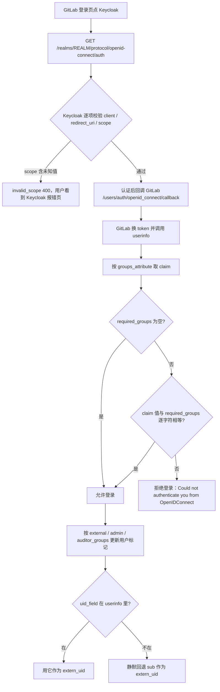

## 场景

- 自建 GitLab（Omnibus 或 Helm chart）想用 Keycloak 做统一登录；或者已经接通了，但「限制谁能登录 / 谁能当管理员」这几个组配置配了没反应。
- 三种成因的症状完全一样：用户照样登录成功、GitLab 日志干净、Keycloak 侧也只有认证成功记录。区别在于**位置写错**（组相关键没放进 `client_options.gitlab`）、**版本不对**（组门禁是 Premium/Ultimate 能力，Free/CE 上这些键不生效）、**值对不上**（Keycloak 的 Group Membership mapper 默认输出带前导斜杠的完整路径）。
- 还有一条必须提前说清的边界：**GitLab 的 OIDC 接入不会把 IdP 的组变成 GitLab 组**。这是官方明确写死的限制，不是配置技巧问题，选型阶段就要知道。

字段与行为核对自 GitLab 官方 OIDC / OmniAuth 文档（`doc/administration/auth/oidc.md`、`doc/integration/omniauth.md`）、GitLab MR !111904（OIDC 组支持，15.10 引入）与 MR !249924（`groups_attribute` 位置说明），以及 Keycloak main 分支 `GroupMembershipMapper.java`；核查日期 2026-10-03。Keycloak 客户端与 mapper 的通用配置见 [Keycloak IAM 第三方软件集成指南]()。

## 适用 / 不适用

| 场景 | 是否适用 |
|------|----------|
| 自建 GitLab（Omnibus / Helm chart）接 Keycloak 做登录 SSO | ✅ |
| 用 Keycloak 的组限制「谁能登录 GitLab」（`required_groups`） | ⚠️ 需要 Premium 及以上，Free/CE 上不生效且无提示（见 2.3） |
| 用 Keycloak 的组授予 GitLab 管理员 / 标记外部用户 / 审计员 | ⚠️ 同上，且只影响这几类用户标记 |
| 让 Keycloak 的组自动变成 GitLab 组成员（决定谁能进哪个 project） | ❌ OIDC 做不到，官方明确声明；需要 Group SAML 或 SCIM |
| 让 `git clone https://` 用 SSO 账号密码认证 | ❌ Git over HTTP 密码认证不支持 OmniAuth（官方 Known issues）→ PAT / SSH key |
| IdP 只提供 SAML、不提供 OIDC | ❌ 改用 `saml` provider；注意它的组配置键位置与 OIDC 不同（见 2.2） |

## 1. Keycloak 端最小配置

| 字段 | 值 |
|------|-----|
| Client ID | `gitlab` |
| Client authentication | `ON`（GitLab 要 client secret） |
| Standard flow | `ON` |
| Direct access grants | `OFF`（浏览器登录只走授权码 + PKCE） |
| Valid redirect URIs | `https://gitlab.example.com/users/auth/openid_connect/callback` |
| Realm Settings → Tokens → Default Signature Algorithm | `RS256`（官方要求非对称算法，不要用 HS256/HS384） |

两条硬前提：

- **Keycloak 必须对外是 HTTPS。** GitLab 官方文档原话是 "GitLab can only communicate with a Keycloak server that uses HTTPS"——内网里给 Keycloak 挂自签证书、或让 GitLab 走 `http://kc-internal` 都不行。
- **`issuer` 必须逐字符等于 discovery 文档里的 `issuer`**（`https://kc.example.com/realms/myrealm`，不带尾斜杠）。填内部服务地址时的失败现象与排查路径和 [Keycloak Hostname v2 配置]() 里描述的一致。

### 1.1 groups claim：mapper 位置与 full path

只有需要做登录门禁或用户标记时才配组 claim。在 `gitlab` 客户端关联的 client scope（或直接在该 client）上加一个 `Group Membership` mapper：

| 配置项 | 建议值 | 原因 |
|--------|--------|------|
| Token Claim Name | `groups` | GitLab 侧 `groups_attribute` 默认找 `groups`，名字改了要两边同步 |
| Add to ID token | `ON` | 兜底来源 |
| Add to userinfo | `ON` | GitLab 的实际取值来源，见 2.4 |
| Full group path | 保留默认，或按需关闭 | 直接决定 GitLab 看到的是 `/platform/gitlab-users` 还是 `gitlab-users` |

`Full group path` 的默认值是 `true`：`GroupMembershipMapper` 源码里 `full.path` 的默认值为 `"true"`，`useFullPath()` 决定输出走 `ModelToRepresentation::buildGroupPath`，也就是 claim 里放的是 `/platform/gitlab-users` 这种带前导斜杠的完整路径。

GitLab 侧的匹配规则是「值必须与 IdP 返回的一致」（官方原文："The value defined for a specific group must reflect the value returned by the identity provider"），而且是**逐字符**比较。所以两种做法只能选一种：

- **保留 full path（推荐）**：GitLab 配置里所有组名都写成 `/platform/gitlab-users` 这种完整路径。组树里有同名层级组（`/platform/ops` 与 `/legacy/platform/ops`）时不会歧义，代价是每个组名都带斜杠。
- **关掉 full path**：配置里写裸组名，干净但依赖「realm 内组名唯一」这个隐含前提。关掉之后，任何依赖完整路径的下游（Harbor、Argo CD 等）也要一起改口径。

同一个取舍在 [Argo CD]() 与 [Harbor]() 篇里出现过，结论一致：不要一半带斜杠、一半不带。

### 1.2 不要把 `groups` 写进 GitLab 的 scope 列表

GitLab 文档在 `auditor_groups` 的示例里写了 `scope: ["openid","profile","email","groups"]`——那是面向 Azure AD 之类认这个 scope 的 IdP。**Keycloak 并没有默认的 `groups` client scope**，授权端点会逐个校验 scope 参数，解析不到就直接 400（`Invalid scopes: groups`）。claim 是否出现由 mapper 的开关决定，与 scope 名字无关。判断依据与 [Harbor 篇]() 引用的 `AuthorizationEndpointChecker.checkValidScope` 一致；这条在新版本上仍建议用 Client scopes → Evaluate 实测一次。

### 1.3 组名到底长什么样，用 Evaluate 定死

Client scopes → 选中 GitLab 用的 scope → **Evaluate** → 选一个用户，看 `Generated ID token` 与 `Generated user info` 里 `groups` 的实际值（有没有前导斜杠、有几个组），然后**把值原样复制**到 GitLab 配置里。

不要用组树推断父组是否也会出现在 claim 里——这取决于 mapper 实现与版本，直接看生成结果是最省事的做法。

## 2. GitLab 端配置

### 2.1 最小配置

```ruby
gitlab_rails['omniauth_providers'] = [
  {
    name: "openid_connect", # 不能改
    label: "Keycloak",
    args: {
      name: "openid_connect",
      scope: ["openid", "profile", "email"], # 不要加 groups，见 1.2
      response_type: "code",
      issuer: "https://kc.example.com/realms/myrealm",
      discovery: true,
      client_auth_method: "basic",
      uid_field: "preferred_username",
      pkce: true,
      client_options: {
        identifier: "gitlab",
        secret: "<SECRET>",
        redirect_uri: "https://gitlab.example.com/users/auth/openid_connect/callback",
        gitlab: {
          groups_attribute: "groups",
          required_groups: ["/platform/gitlab-users"],
          admin_groups: ["/platform/gitlab-admins"]
        }
      }
    }
  }
]
gitlab_rails['omniauth_allow_single_sign_on'] = ['openid_connect']
gitlab_rails['omniauth_block_auto_created_users'] = false
```

- Omnibus：`sudo gitlab-ctl reconfigure`；Helm chart：改 `globals.omniauth.providers` 后 `helm upgrade`。
- `omniauth_allow_single_sign_on` 决定首次登录时是否自动建号；`omniauth_block_auto_created_users` 决定新建账号是否需要管理员审批（官方示例里显式写成 `true`）。要放开 JIT 就设 `false`，同时接受「任何能通过 IdP 认证的人都可以自助创建 GitLab 账号」这个后果。
- 已有本地账号想与 SSO 身份合并，靠 `omniauth_auto_link_user`（按邮箱自动关联）或引导式关联流程；不配就是两条独立身份。

### 2.2 位置决定生效与否：`gitlab:` 键必须在 `client_options` 里

- **OIDC**：`omniauth_providers` → `args` → `client_options` → **`gitlab`**。这是官方文档给出的唯一形态，MR !111904 的验收配置也是同一层级（`client_options.gitlab` 下写 `groups_attribute` / `required_groups` / `external_groups` / `admin_groups`）。
- **SAML**：同名键放在 provider 顶层，与 `name`、`label` 同级，**不在 `args` 里**。GitLab 有一份官方 MR（!249924）专门记录这个坑：放进 `args` 后 GitLab 永远读不到该键，"users sign in normally, the assertion still carries the groups, and no error or warning is written."

两条结论：

1. 从 SAML 示例照抄到 OIDC（或反着抄）不会报错，只会**静默失效**——组配置等于不存在。
2. 改完必须做第 4 节的负测试，否则无法区分「生效」和「没生效」。

### 2.3 组门禁是付费能力：Free/CE 上这些键不生效

官方文档 "Configure users based on OIDC group membership" 一节（含 `required_groups` / `external_groups` / `auditor_groups` / `admin_groups`）标注的 Tier 是 **Premium、Ultimate**，Offering 覆盖 GitLab.com、Self-Managed、Dedicated。SAML 侧同样受订阅与 EE 限制，社区里有用户在 CE 上配好 `required_groups`、发现组外用户照样能登录并开 issue，最终以「文档已说明依赖订阅与 EE」关闭。

后果是安全层面的：**在 Free/CE 上配了 `required_groups`，访问控制看起来配好了，实际并不存在**，而且没有任何提示。上线前先确认实例版本与许可证，把这条写进安全评审记录。

### 2.4 这四类组配置能做什么、不能做什么

| 配置键 | 作用 | 边界 |
|--------|------|------|
| `required_groups` | 登录门禁：不在任一组里则拒绝登录 | 不设或为空 = 任何通过 IdP 认证的用户都能登录 |
| `external_groups` | 把这些组的人标记为 external user（不能访问内部项目） | 只影响用户标记，不限制登录 |
| `admin_groups` | 授予管理员 | 每次登录时检查并更新属性 |
| `auditor_groups` | 授予审计员 | Premium/Ultimate |
| —— | **不会**把用户加入 GitLab 组（group/project 命名空间成员） | 官方原话："This feature does not allow you to automatically add users to GitLab groups." |

三点需要注意：

- 这四类都是「每次登录时检查并更新」，不是持续生效的授权引擎。把管理员授予建立在 `admin_groups` 上之后，务必保留一个不受 IdP 影响的 break-glass 账号（Keycloak 挂了还得能进 GitLab）。
- `groups_attribute` 的取值来源是 userinfo（GitLab 对 `uid_field` 的说明写明取值自 `user_info.raw_attributes`），所以 mapper 的 *Add to userinfo* 不能关；两个开关都开是最稳的组合。
- 组名逐字符比较，`/platform/gitlab-users` 与 `platform/gitlab-users` 是两个不同的组。

### 2.5 uid_field：改一次等于换一批账号

`uid_field` 决定 GitLab 用哪个 claim 作为用户的 `extern_uid`，默认是 `sub`。官方文档明确记录了两个坑：

1. 不设置 `uid_field` 就用 `sub`，"results in additional identities being created in GitLab that have to be manually modified"——迁移或更换 provider 时尤其明显。
2. 你配了 `preferred_username`，但该字段不在 `user_info.raw_attributes` 里时，**GitLab 静默回退到 `sub`**。表现是「配置看起来生效了」，但身份键与预期不同；等你后来把 mapper 修好，同一批用户的 `extern_uid` 又会变，出现重复账号。

所以：选定 claim 后先用 Evaluate 确认它在 userinfo 里存在，再决定上线；更改 `uid_field` 属于需要人工收拾的变更（改 `extern_uid`），做之前先备份。

### 2.6 client_auth_method 的语义

GitLab 只识别三种值：`basic`、`jwt_bearer`、`mtls`；**其他任何值都会把 client_id / secret 放进请求体**（即 client_secret_post）。GitLab 自己示例里的 `query` 属于「其他值」，实际效果是 body 传参，不要按字面理解成「secret 出现在 URL 里」。

与 Keycloak 的对应关系：

- `basic` ↔ `client_secret_basic`，其他值（含 `query`）↔ `client_secret_post`，两者都是 Keycloak 默认 `Client Id and Secret` 认证器支持的。
- `jwt_bearer` 要求 Keycloak 侧为这个 client 启用带签名 JWT 的认证器，算法与 `iss=sub`、`aud` 等约束见 [Keycloak 客户端认证与 IAM 凭据轮换]()。

建议先用 `basic` 打通链路。客户端认证不匹配时错误发生在 token 端点，GitLab 页面只给一句 `Could not authenticate you from OpenIDConnect because ...`，原文要到 Keycloak 日志里看（`invalid_client`）。

## 3. 一次登录里组判定的完整路径



逐步说明：

1. **scope 在 Keycloak 侧就被拒**。用户看到的是 Keycloak 的错误页或回调时的报错，不是 GitLab 的配置问题——别在这一层去翻 GitLab 配置。
2. **组判定发生在 GitLab 侧**，值来自 userinfo。Keycloak 侧只会记录「认证成功」，看不到任何拒绝记录，这是这类问题最容易被误判成「IdP 没传组」的原因。
3. **逐字符比较是排查重点**。full path 打开时 `/platform/gitlab-users` 与 `platform/gitlab-users` 不等价，配错了不会有报错，只会把该用户挡在门外（或反过来，把门禁变成摆设）。
4. **静默回退不报错**，只改变身份键，属于事后才发现的类型。
5. **全程没有任何「同步 GitLab 组成员」的环节**——OIDC provider 里这条链不存在。

## 4. 验证顺序

1. **Keycloak Evaluate 预览 claim**：确认 `groups` 的值形状（前导斜杠、组的完整清单），原样复制到 GitLab 配置。
2. **看 userinfo 原始返回**（GitLab 的实际取值来源）：

```bash
curl -s https://kc.example.com/realms/myrealm/protocol/openid-connect/userinfo \
  -H "Authorization: Bearer ***" | jq '{preferred_username, email, groups}'
```

3. **正测试**：属于 `/platform/gitlab-users` 的账号能登录，且用户属性上的 external / admin 标记符合预期。
4. **负测试（必做）**：一个不在任何 `required_groups` 里的账号，必须被拒绝登录。这一步是判断配置「真的生效」还是「静默失效」的唯一方法——位置写错或在 Free/CE 上，这个账号会登录成功。
5. **变更测试**：把用户从 Keycloak 组里移除后重新登录，观察外部用户 / 管理员标记随登录更新；同时确认 GitLab 的组与项目成员**没有**跟着变（预期不变，见 2.4）。
6. 出问题时按层取原文：Keycloak 授权/令牌端点的错误在 Keycloak 日志与浏览器回调 URL 里；GitLab 侧的失败在登录页提示与 Omnibus 默认日志目录 `/var/log/gitlab/gitlab-rails/` 下。

## 5. 常见错误对照表

| 症状 / 报错 | 根因 | 处理 |
|-------------|------|------|
| 登录页 `Could not authenticate you from OpenIDConnect because "Email can't be blank"`（或同类 Rails 校验文案） | userinfo 里没有 email：用户无邮箱，或客户端缺 `email` scope / mapper | GitLab 建号与账号关联都需要 email，先补 claim |
| Keycloak 400 `Invalid scopes: groups` | GitLab 的 scope 列表里写了 `groups`，Keycloak 没有该 client scope | 从 scope 里删掉；claim 由 mapper 决定 |
| 回调阶段 `invalid_redirect_uri` | Keycloak 的 Valid redirect URIs 与 GitLab 实际回调地址不一致（端口、http/https、`external_url` 不一致） | 逐字符对齐；注意 GitLab 只与 HTTPS 的 Keycloak 通信 |
| 用户能登录，`required_groups` 完全不起作用 | (a) 组键没放进 `client_options.gitlab`；(b) Free/CE（需要 Premium/Ultimate）；(c) 值不逐字符相等（缺前导斜杠） | 逐条排查，并用负测试确认「到底有没有生效」 |
| 配了 `admin_groups`，用户不是管理员 | 组值与 claim 不相等（full path 缺斜杠最常见） | 从 Evaluate 结果复制原文 |
| 同一用户每次登录都新建账号 / 出现重复账号 | `uid_field` 未设置或配的 claim 不在 userinfo 里（静默回退 `sub`），或中途改过 `uid_field` | 先定死 claim 再上线；已产生的重复身份要人工修正 `extern_uid` |
| Keycloak 日志 `invalid_client`，页面表现为 omniauth 失败 | Client authentication 未开，或 `client_auth_method` 与实际认证器不匹配（如用了 `jwt_bearer` 但 Keycloak 未启用签名 JWT 认证器） | 开启客户端认证，或先改用 `basic` |
| `git clone https://...` 用 SSO 账号密码 401 | Git over HTTP 密码认证不支持 OmniAuth（官方 Known issues） | 用 personal access token 或 SSH key；CI 用项目 / 组 access token |
| 从 GitLab 登出后 Keycloak 会话仍在（或反之） | 两套会话独立，互不感知 | 按需配置登出行为，见 [IAM 单点登出排错]() |

## 6. 回滚

顺序上先动 GitLab、再动 Keycloak，避免出现两边都不可用的中间态。

1. **先确认本地账号可用**。Omnibus 安装自带本地 `root`；密码丢失时用 `sudo gitlab-rake "gitlab:password:reset[root]"` 重置。SSO 接入的整个生命周期里，这个账号都不要交给 IdP 管。
2. **摘掉 provider**：把 `gitlab_rails['omniauth_providers']` 置空并 reconfigure。用户立刻无法再用 SSO 登录，已建账号与身份记录保留；确认本地账号能登录后再做后续清理。
3. **Keycloak 侧先禁用、不要删除 client**：禁用能立刻停止新登录且保留 redirect URI 与 mapper，回滚回来成本最低；删除要重建全部配置。
4. **不要为了「干净」删用户或身份记录**。`extern_uid` 丢了，重新接入时同一批人会以新身份建号，历史 issue / MR 的归属会断。
5. **验证清单**：本地 root 可登录、原有用户与项目成员没少、PAT 与 SSH 克隆仍可用、Runner 不受影响（CI 本来就不走 SSO 会话）。

## 常见问题（IAM 单点登录）

**Q1：GitLab 的 OIDC 组和 GitLab 自己的 Group 是什么关系？**

两个不同的概念。OIDC 的组信息只用于四件事：登录门禁（`required_groups`）、标记外部用户（`external_groups`）、授予管理员（`admin_groups`）、授予审计员（`auditor_groups`），且属于 Premium/Ultimate 能力。GitLab 自己的 Group（`gitlab.example.com/<group>` 这样的命名空间）不受 IdP 组影响——官方明确说明这个功能不会把用户自动加入 GitLab 组。想要「Keycloak 组 = GitLab 组」，只有 Group SAML 的 group sync（自建可用，同样有套餐限制）或 SCIM 方向，支持范围按你的版本与订阅先核对。

**Q2：SAML provider 里配 `groups_attribute` 能生效，搬到 OIDC 就没反应，为什么？**

位置不同。SAML 的同名键在 provider 顶层（与 `name`、`label` 同级），OIDC 的在 `args.client_options.gitlab` 里。GitLab 官方 MR !249924 记录过 SAML 侧放错位置后的完整现象：登录正常、断言里也带着组、但既不报错也不写日志。两套示例混用不会报错，只会让组配置形同不存在。

**Q3：用 `required_groups` 做登录门禁，等于做完授权了吗？**

不等于。它只回答「这个人能不能进 GitLab」。进来之后能看哪些项目、能推哪些分支，由 GitLab 的成员与角色决定；`external_groups` 没配时，外部人员仍然能看到内部项目。把门禁当授权边界，是这类接入最常见的认知偏差。

**Q4：Keycloak 认证成功、GitLab 拒绝（或反过来），怎么快速定位在哪一层？**

看拒绝发生在哪一步：Keycloak 授权端点的 400（scope、redirect_uri）用户看到的是 Keycloak 的报错；GitLab 回调之后的拒绝显示为登录页的 `Could not authenticate you from OpenIDConnect because ...`；Keycloak 日志里的 `invalid_client` 是令牌端点客户端认证问题。先定层，再去那一层取原文。

**Q5：需要给 GitLab 的 client 打开 Direct Access Grants 吗？**

不需要。浏览器登录走 Standard flow（授权码 + PKCE）。ROPC 在 OAuth 2.1 中已被移除，GitLab 也不使用；脚本化访问用 personal access token 或项目 access token。

**Q6：接入 SSO 后，原来的 GitLab 密码还能用吗？**

配了 `openid_connect` 只是多了一个登录入口，不会删除本地密码认证；如果不希望用户继续用本地密码登录，需要另外限制（例如关掉密码登录流程、或在上游统一治理），并明确这对 break-glass 账号的影响。

## 参考来源

- [GitLab: Use OpenID Connect as an authentication provider](https://docs.gitlab.com/administration/auth/oidc/)（客户端配置项说明、`client_auth_method` 的三种受支持值与「其他值走请求体」、`uid_field` 与静默回退 `sub`、`client_options.gitlab` 的配置位置、required / external / auditor / admin groups 与 Premium·Ultimate 标注、"does not allow you to automatically add users to GitLab groups"、Keycloak 与 HTTPS 约束、RSA256/RSA512 建议、email claim 是建号与关联的前提、Group SAML 与 SCIM 的对照关系）
- [GitLab: OmniAuth](https://docs.gitlab.com/integration/omniauth/)（`allow_single_sign_on`、`block_auto_created_users` 示例、`auto_link_user` 关联方式、Known issues：多数 OmniAuth provider 不支持 Git over HTTP 密码认证）
- [GitLab MR !111904 — Support admin/external/required groups for OIDC](https://gitlab.com/gitlab-org/gitlab/-/merge_requests/111904)（OIDC 组支持的实现与验收配置：`client_options.gitlab` 的嵌套形态、`groups_attribute` 默认 `groups`）
- [GitLab MR !249924 — docs: Clarify `groups_attribute` placement](https://gitlab.com/gitlab-org/gitlab/-/merge_requests/249924)（同名键在 SAML 侧必须放 provider 顶层；放错时"no error or warning is written"）
- [GitLab Forum: SAML + Keycloak required_groups not recognized](https://forum.gitlab.com/t/saml-keycloak-required-groups-not-recognized-could-groups-attribute-be-the-problem/50659)（CE 上组配置不生效的社区案例，后被以「文档已说明依赖订阅与 EE」关闭）
- Keycloak 源码 [`GroupMembershipMapper.java`](https://github.com/keycloak/keycloak/blob/main/services/src/main/java/org/keycloak/protocol/oidc/mappers/GroupMembershipMapper.java)（`full.path` 默认值 `true`；`useFullPath()` 决定走 `ModelToRepresentation::buildGroupPath`）
- [Keycloak Server Administration Guide](https://www.keycloak.org/docs/latest/server_admin/index.html)（Client scopes、Evaluate 预览 ID token 与 userinfo、Group Membership mapper）

相关章节：[Keycloak IAM 第三方软件集成指南]()、[Harbor 接入 Keycloak OIDC]()、[Jenkins 接入 Keycloak OIDC]()、[Argo CD 接入 Keycloak OIDC]()、[Keycloak 客户端认证与 IAM 凭据轮换]()、[IAM SCIM 用户自动配置实战]()。
