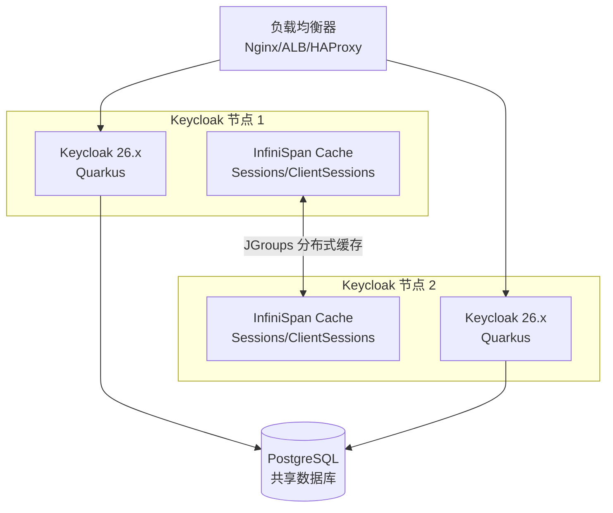

## 场景

你在生产环境跑着单节点的 Keycloak，业务方已经依赖它完成 SSO 登录。某天凌晨数据库挂了、节点 OOM 重启了，或者 Kubernetes Node 被 drain 了——所有依赖 Keycloak 的应用全部掉线。

你需要在故障发生前就把集群搭好，并且有一套经过演练的备份恢复流程。

本文不重复 [Keycloak Kubernetes 生产部署]() 的完整 Operator 部署步骤，而是聚焦三个核心问题：

1. 多节点集群怎么配才能**不丢 Session、不断登录**？
2. 数据库备份怎么做到**可验证恢复**而不仅仅是"dump 了"？
3. 故障发生时的**恢复步骤**和**回滚路径**是什么？

## 适用与不适用

| 适用 | 不适用 |
|------|--------|
| Keycloak 24+ 基于 Quarkus 发行版 | 旧版 WildFly 发行版（集群配置不同） |
| 生产环境需要 HA 和灾难恢复 | 开发环境单节点即可 |
| Kubernetes（Operator/Helm）或裸机部署 | 刚接触 Keycloak、还未完成单节点部署 |
| PostgreSQL/MySQL 等外部数据库 | 内嵌 H2 数据库（不可用于集群或生产） |

## 集群架构概览

Keycloak 集群的核心依赖只有两个：**共享数据库** + **节点发现机制**。没有共享存储、没有共享 Session 文件。



**关键理解**：Keycloak 的 Session 数据存在两个地方——数据库是持久化的（离线 token、持久 session），InfiniSpan 分布式缓存是内存/近缓存（在线 session）。节点挂了，在线 session 从其他节点的 InfiniSpan 缓存中恢复；如果整个集群都挂了，持久化的 session 从数据库恢复。

> 关于缓存层的深度调优——`cache-ispn.xml` 参数详解、传输栈选型对比、`owners` 参数调优、Istio 服务网格兼容方案、常见缓存故障排错，参见 [Keycloak 集群缓存深度调优与排错指南]()。

## 节点发现：JGroups 配置

Keycloak 使用 JGroups 做节点间通信和发现。Kubernetes 环境下推荐 DNS_PING；裸机推荐 JDBC_PING 或 TCPPING。

### Kubernetes 环境（DNS_PING）

使用 Operator 部署时，只需在 CR 中指定 `hostname` 使 Pod 有稳定的 DNS 名。JGroups 默认使用 `dns.DNS_PING` 通过 Headless Service 发现对端。

```yaml
# 使用 Operator CR 的多节点配置要点
apiVersion: k8s.keycloak.org/v2alpha1
kind: Keycloak
metadata:
  name: keycloak
spec:
  instances: 2          # 节点数
  hostname:
    hostname: sso.example.com
  additionalOptions:
    - name: cache
      value: ispn        # 使用 InfiniSpan 分布式缓存（默认）
    - name: cache-stack
      value: kubernetes  # JGroups 使用 kubernetes stack
```

**验证节点发现**：

```bash
# 查看集群节点
kubectl -n keycloak exec deploy/keycloak -- \
  kcadm.sh get serverinfo --fields members -r master 2>/dev/null || \
  kubectl -n keycloak logs deploy/keycloak | grep "ISPN000094\|joined the cluster"
```

日志中看到 `Received new cluster view` 和 `ISPN000094` 表示节点已加入集群。

### 裸机/Docker Compose 环境（JDBC_PING）

如果不用 Kubernetes，推荐 JDBC_PING——节点通过数据库中的 `JGROUPSPING` 表相互发现，无需额外服务。

```bash
# 启动参数（每个节点用相同数据库但不同 --db 配置即可）
bin/kc.sh start \
  --cache=ispn \
  --cache-stack=jdbc-ping \
  --db=postgres \
  --db-url=jdbc:postgresql://postgres:5432/keycloak \
  --db-username=keycloak \
  --db-password=***
```

JDBC_PING 会自动在数据库中维护节点注册表，节点退出时自动清理。

## Session 亲和性与负载均衡

多节点集群中，**必须启用 Session 亲和性（Sticky Session）**。虽然 InfiniSpan 可以在节点间复制 Session，但跨节点每次查找都有开销。

### Nginx 配置

```nginx
upstream keycloak {
    ip_hash;  # 基于客户端 IP 的会话保持
    server keycloak-0.keycloak-headless:8443;
    server keycloak-1.keycloak-headless:8443;
}

server {
    listen 443 ssl;
    server_name sso.example.com;

    location / {
        proxy_pass https://keycloak;
        proxy_set_header Host $host;
        proxy_set_header X-Real-IP $remote_addr;
        proxy_set_header X-Forwarded-For $proxy_add_x_forwarded_for;
        proxy_set_header X-Forwarded-Proto $scheme;
    }
}
```

### Kubernetes Ingress 配置

```yaml
apiVersion: networking.k8s.io/v1
kind: Ingress
metadata:
  name: keycloak
  annotations:
    nginx.ingress.kubernetes.io/affinity: "cookie"
    nginx.ingress.kubernetes.io/session-cookie-name: "KEYCLOAK_SESSION"
    nginx.ingress.kubernetes.io/session-cookie-path: "/"
    nginx.ingress.kubernetes.io/session-cookie-max-age: "3600"
spec:
  rules:
  - host: sso.example.com
    http:
      paths:
      - path: /
        pathType: Prefix
        backend:
          service:
            name: keycloak-service
            port:
              number: 8443
```

> **为什么不推荐 ip_hash → 替代方案**：`ip_hash` 在企业 NAT/代理环境下会将大量用户分配到同一节点，负载不均。`nginx.ingress.kubernetes.io/affinity: "cookie"` 更可靠，但 Keycloak 本身有 Cookie（`KEYCLOAK_SESSION`、`AUTH_SESSION_ID` 等），Ingress Cookie 层只是加速路由，不影响 Keycloak 自身 Cookie。

## 备份策略

Keycloak 需要备份的三类数据：

| 数据类型 | 存储位置 | 备份方式 | 频率建议 |
|---------|---------|---------|---------|
| 数据库 | PostgreSQL/MySQL | `pg_dump` / `mysqldump` | 每日全量 + 持续 WAL 归档 |
| Realm 导出 | Keycloak 管理控制台 | `kc.sh export` 或 Operator RealmImport | 每次重大配置变更后 |
| 自定义主题/SPI | 挂载的 Volume/ConfigMap | 纳入配置管理（Git/Helm） | 变更时触发 |

### 数据库备份（含验证）

```bash
#!/bin/bash
# 备份并验证
BACKUP_FILE="/backup/keycloak-$(date +%Y%m%d-%H%M).sql.gz"
pg_dump -h $DB_HOST -U keycloak -d keycloak | gzip > "$BACKUP_FILE"

# 验证备份可恢复（在独立实例上）
if [ "${VERIFY:-0}" = "1" ]; then
  zcat "$BACKUP_FILE" | psql -h verify-db -U keycloak -d keycloak_verify > /dev/null 2>&1
  echo "Backup verified: $BACKUP_FILE"
fi
```

**关键提醒**：只 dump 不验证 = 没有备份。建议每周至少一次自动恢复到独立验证实例。

### Keycloak 配置导出

```bash
# 导出整个 Realm（含 client、role、group、identity provider 配置）
bin/kc.sh export --realm myrealm --dir /backup/realms/ --users realm_file

# 输出：/backup/realms/myrealm-realm.json
```

导出的 JSON 文件可以直接用 Operator 的 `KeycloakRealmImport` 恢复，也可以手动导入。

### 恢复流程（重要）

按顺序执行，每步都验证：

```bash
# 步骤 1：停止所有 Keycloak 节点写入
kubectl -n keycloak scale deploy/keycloak --replicas=0  # K8s
# 或 systemctl stop keycloak  # 裸机

# 步骤 2：恢复数据库
zcat /backup/keycloak-20260709-0100.sql.gz | psql -h $DB_HOST -U keycloak -d keycloak

# 验证恢复
psql -h $DB_HOST -U keycloak -d keycloak -c "SELECT COUNT(*) FROM REALM;"

# 步骤 3：如果需要，导入 Realm 配置
# 方式 A：通过 Operator（K8s）
kubectl -n keycloak apply -f realm-import.yaml
# 方式 B：导入数据库后重启节点自动使用已有 Realm 配置

# 步骤 4：启动集群
kubectl -n keycloak scale deploy/keycloak --replicas=2

# 步骤 5：验证集群就绪
kubectl -n keycloak rollout status deploy/keycloak
kubectl -n keycloak logs deploy/keycloak | grep "ISPN000094"

# 步骤 6：功能验证
curl -s https://sso.example.com/realms/master/.well-known/openid-configuration | jq .issuer
curl -s -X POST https://sso.example.com/realms/myrealm/protocol/openid-connect/token \
  -d 'client_id=test&grant_type=password&username=test&password=test' | jq '.access_token'
```

## 常见错误与排错

| 症状 | 根因 | 排错命令 |
|------|------|---------|
| 节点启动后孤岛运行（只有自己） | JGroups 发现机制配置错误 | `grep -i "ISPN000094\|JGRP"` 看日志：无 "Received new cluster view" 说明未发现对端 |
| 登录后跳转到另一个节点就掉登录 | Session 亲和性未配置 | 检查 Ingress/LB 是否配置 Sticky Session |
| InfiniSpan `org.infinispan.remoting.transport.jgroups.SuspectException` | 网络分区或节点间端口不通 | 确认 JGroups 端口（默认 7800）在节点间互通：`nc -zv <peer-ip> 7800` |
| 恢复数据库后 Realm 不显示 | 缓存未刷新 | 启动时加 `--spi-connections-infinispan-quarkus-cache-remote-max-idle=1` 清理缓存，或重启后等待缓存同步 |
| 备份恢复后用户登录报 `invalid_grant` | Session/Token 状态不一致 | 恢复的是数据库快照，在线 Session 已丢失是正常的——用户重新登录即可；也可用 `kc.sh export/import` 配合 `--users skip` 保留数据一致性 |
| 集群节点全部重启后 InfiniSpan 缓存为空 | 分布式缓存在内存，无持久化 | 正常行为——持久化的用户/Client/Realm 从 DB 加载；在线 Session 丢失，用户需重新登录 |
| Kubernetes DNS_PING 报 `java.net.UnknownHostException` | Headless Service 未创建或 DNS 未就绪 | 检查 Service: `kubectl get svc keycloak-headless`；确认 Pod 内 `nslookup keycloak-headless` 可解析 |

## 生产检查清单

- [ ] 数据库使用外部 PostgreSQL（非 H2），配置了主从或定期备份
- [ ] 备份脚本有验证步骤，定期做恢复演练（至少每月一次）
- [ ] 集群至少 2 个节点，分布于不同宿主机/可用区
- [ ] 负载均衡器配置了 Session 亲和性
- [ ] JGroups 节点发现已验证（启动日志中有 cluster view）
- [ ] PodDisruptionBudget 已配置（K8s）
- [ ] 监控已覆盖：节点数、JGroups 状态、数据库连接数、登录延迟（参考 [Keycloak Prometheus 监控]()）
- [ ] 有明确的恢复 Runbook（步骤、负责人、预期时长）
- [ ] 节点间网络延迟 < 5ms（InfiniSpan 分布式缓存对网络延迟敏感）
- [ ] Keycloak 版本、Operator 版本、CRD 版本保持一致

## 回滚方式

灾难恢复有两种回滚场景：

### 场景 A：恢复后发现问题，回滚到上一个备份

```bash
# 1. 停服
kubectl -n keycloak scale deploy/keycloak --replicas=0

# 2. 恢复到上一个备份
zcat /backup/keycloak-20260708-0100.sql.gz | psql -h $DB_HOST -U keycloak -d keycloak

# 3. 重新启动集群（缓存为空，从数据库重新加载）
kubectl -n keycloak scale deploy/keycloak --replicas=2
```

### 场景 B：数据库本身完好，只需重建 Keycloak 节点

```bash
# Keycloak 节点无状态（Session 在 InfiniSpan 缓存中，数据在 DB），重建节点不影响业务
kubectl -n keycloak rollout restart deploy/keycloak
```

**重要**：不要在生产环境中直接 `DELETE` Keycloak CR 再重建——Operator 会删除关联的 Secrets/Ingress 等资源。需要重建时，使用 `rollout restart` 或逐个替换 Pod。

## 延伸阅读

- [Keycloak 生产部署 — Operator、Helm 与高可用]() — 完整 Operator 部署步骤
- [Keycloak Prometheus 监控指标详解]() — 集群节点监控和告警配置
- [Keycloak 内部架构 — Realms、Clients、Users、Roles]() — 理解集群各组件关系
- [Keycloak Redis 外部会话缓存]() — 用 Redis 替代 Infinispan 实现无状态节点
- [IDaaS 性能与扩展性]() — 缓存策略与容量规划
