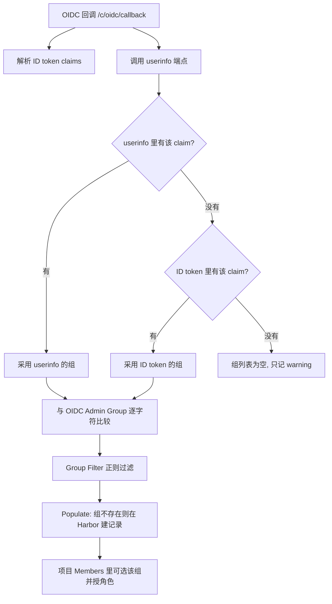

## 场景

- 内网跑着一套 Harbor 做镜像仓库，用户已经在 Keycloak 里；目标是让 Harbor 用同一套账号登录，并且按 Keycloak 的组决定谁能 push、谁只能 pull。
- Harbor 的 OIDC 配置项不多，但有几个「配错也不报错」的字段：组 claim 名字留空、组过滤正则写坏、组名的斜杠前缀与预期不一致——结果是登录一路成功，权限一个都没生效。
- 还有一层是认证方式本身：Harbor 从本地数据库模式切到 OIDC 有前置条件，切过去之后本地用户管理功能就关了，回滚路径必须先想清楚。

本文只写 Harbor 侧的字段语义、claim 从 IdP 到 Harbor 的完整判定路径、以及每一类错误的定位点。Keycloak 客户端的通用配置（client、Protocol Mapper、redirect URI 组织方式）见 [Keycloak IAM 第三方软件集成指南]()。

字段与行为核对自 Harbor 2.13 官方文档和 `goharbor/harbor` main 分支源码（`src/pkg/oidc/helper.go`、`src/core/auth/oidc/oidc.go`、`src/pkg/usergroup/manager.go`、`src/common/const.go`、`src/server/v2.0/handler/oidc.go`），以及 Keycloak main 分支源码（`GroupMembershipMapper.java`、`OIDCAttributeMapperHelper.java`、`AuthorizationEndpointChecker.java`、`TokenManager.java`）；核查日期 2026-09-28。源码行为随版本可能变化，升级大版本后建议按第 5 节重跑一遍验证。

## 适用 / 不适用

| 场景 | 是否适用 |
|------|----------|
| 自建 Harbor 2.x（docker-compose / Helm / Operator），接 Keycloak 做 SSO | ✅ |
| Harbor 里已有一批本地用户，想「顺便」切到 OIDC | ⚠️ 先看第 1 节，切换有硬前提 |
| 要按组做项目级授权（谁能 push 到哪个 project） | ✅ 用 Group Claim，不要指望 realm role |
| 只是想让 `docker login` 用 SSO 账号 | ⚠️ CLI 走不了 OIDC 跳转，用 Harbor 的 CLI secret |
| IdP 只提供 SAML、不提供 OIDC | ❌ Harbor 的 IdP 接入只有 OIDC 与 LDAP/AD 两条 |

## 1. 切认证方式之前，先确认两件事

Harbor 官方 OIDC 文档里有一句容易跳过的限制：

> You can change the authentication mode from database to OIDC only if no local users have been added to the database. If there is at least one user other than `admin` in the Harbor database, you cannot change the authentication mode.

**只要库里除 `admin` 之外还有本地用户，认证方式就改不了。** 这一条会直接卡死「先启起来试试、回头再切回去」的路径：OIDC 模式下 Harbor 不支持自助注册、创建用户、删除用户、改密码、重置密码（用户归 IdP 管），所以只要有本地用户依赖 Harbor 密码登录，就得先决定这批账号的去留。

切换前先盘点本地用户：

```bash
# 以 admin 身份列出现有用户
curl -s -u 'admin:<PASSWORD>' \
  'https://harbor.example.com/api/v2.0/users?page_size=100' | jq -r '.[].username'
```

第二件事是确认本地 `admin` 密码可用。OIDC 模式启用后登录页仍保留 `LOGIN VIA LOCAL DB`，直接访问 `https://harbor.example.com/account/sign-in` 也能走数据库登录——**这是回滚时唯一的入口**，切换前先登录一次，别等出事时才发现密码不在手上。

## 2. Keycloak 端最小配置

| 字段 | 值 |
|------|-----|
| Client ID | `harbor` |
| Client authentication | `ON`（Harbor 需要 client secret） |
| Standard flow | `ON` |
| Direct access grants | `OFF`（Harbor 不用密码模式，OAuth 2.1 也已移除 ROPC） |
| Valid redirect URIs | `https://harbor.example.com/c/oidc/callback` |
| Web origins | `https://harbor.example.com` |

`/c/oidc/callback` 不是猜的：Harbor 源码里 `OIDCCallbackPath` 就是这个常量，配置页底部显示的 Redirect URI 也是同一个值。填错的表现是回调阶段直接拿到 `invalid_redirect_uri`。

### 2.1 Scope 会被 Keycloak 逐个校验，写错直接 400

Keycloak 在授权端点会校验请求中的每个 scope 能否解析到对应的 client scope（`AuthorizationEndpointChecker.checkValidScope` → `TokenManager.isValidScope`），解析不到就返回：

```
error=invalid_scope
error_description=Invalid scopes: groups
```

所以 Harbor 的 OIDC Scope 里能写什么，取决于 Keycloak 侧存在哪些 client scope：

- `openid profile email`：Keycloak 默认就有，最稳。
- 想追加 `groups`：**Keycloak 里并不存在名为 `groups` 的默认 client scope**（默认的组映射是挂在 `profile` 上的 Protocol Mapper，不是 scope）。要么新建一个名为 `groups` 的 client scope 并关联到 `harbor` 客户端，要么干脆不要把它写进 Harbor 的 scope 列表——claim 是否出现在 token 里由 mapper 决定，不由这个 scope 名决定。
- `offline_access`：Harbor 的 CLI secret 依赖 refresh token，字段提示明确要求 scope 包含 `openid` 与 `offline_access`；Keycloak 侧这是标准 scope，不需要新建。

### 2.2 groups claim 怎么出、出成什么形状

在 `harbor` 客户端关联的 client scope 上（复用它已关联的 `profile`，或新建专用 scope）加一个 `Group Membership` mapper：

| 配置项 | 建议值 | 原因 |
|--------|--------|------|
| Token Claim Name | `groups` | Harbor 按这个名字取 claim，对不上就是「登录成功但没有组」 |
| Add to ID token | `ON`（源码默认 `true`） | Harbor 取值时 ID token 是兜底来源，见第 4 节 |
| Add to userinfo | `ON`（源码默认 `true`） | userinfo 端点才是 Harbor 的**第一**取值来源 |
| Full group path | 按需，见下 | 直接决定 Harbor 看到的是 `/platform/ops` 还是 `ops` |

`Full group path` 在 Keycloak 里的**默认值是 `true`**（`GroupMembershipMapper` 源码中 `full.path` 的默认值为 `"true"`），也就是 claim 里放 `/platform/ops` 这种带前导斜杠的完整路径。这个选择会一路传到 Harbor：Harbor 的 `OIDC Admin Group` 和组名都是**逐字符比较**，`/platform/ops` 与 `ops` 是两个不同的组，配错不会报错、只会「不生效」。

取舍和 Argo CD 那次相同：关掉 `full.path` 组名干净，但 realm 里存在同名层级组（`/platform/ops` 与 `/legacy/platform/ops`）时会退化成歧义；保留完整路径则下游所有配置都得带前导斜杠。权衡细节见 [Argo CD 接入 Keycloak OIDC]()。

## 3. Harbor 端字段与语义

Configuration → Authentication → Auth Mode 选 `OIDC`：

| 字段 | 示例值 | 语义与陷阱 |
|------|--------|-----------|
| OIDC Provider Name | `Keycloak` | 只影响登录按钮文案 |
| OIDC Provider Endpoint | `https://kc.example.com/realms/myrealm` | 必须与 discovery 文档里的 `issuer` 一致，不能填内部服务地址 |
| OIDC Client ID / Secret | `harbor` / `<SECRET>` | secret 存库，Keycloak 侧轮换后要同步改 |
| OIDC Scope | `openid profile email offline_access` | 见 2.1，未知 scope 会被 Keycloak 拒 |
| Group Claim Name | `groups` | **留空时源码不打任何日志**，见第 4 节 |
| OIDC Group Filter | `^harbor-.*$` | 非锚定正则；非法正则等于不过滤 |
| OIDC Admin Group | `/platform/harbor-admin` | 只能一个；与 claim 值逐字符相等 |
| Username Claim | `preferred_username` | 勾了 Automatic onboarding 就必填 |
| Automatic onboarding | 按需 | 不勾则首次登录要求用户自己起一个 Harbor 用户名 |
| Verify Certificate | 按证书情况 | 关闭后仍要求 TLS 1.2+（源码里 fallback transport 的 `MinVersion`） |
| OIDC Session Logout | 按需 | 勾选后从 Harbor 登出会连带结束 IdP 会话，影响其他已 SSO 的应用 |

### Group Filter 是「正则匹配」，不是「前缀」

Harbor 源码里 `filterGroup` 用的是 Go 的 `regexp.MatchString`，这是**非锚定**匹配：filter 写 `harbor` 时，`/platform/harbor-ops` 也会被匹配上。想精确限定就自己加锚点：`^harbor-.*$`。

更需要注意的是非法正则的处理：

```go
pattern, err := regexp.Compile(filter)
if err != nil {
    log.Errorf("failed to filter group, invalid filter %v", filter)
    return groupNames   // 原样返回，等于不过滤
}
```

正则写错（例如中文括号、未转义的 `(`）不会让登录失败，而是记录一条 error 日志后**把 claim 里所有组都放进 Harbor**。这是一个静默扩大授权面的配置错误：日志里只有一行 `failed to filter group, invalid filter ...`，界面上看不出任何异常。

### Admin Group 的判定发生在 Filter 之前

`userInfoFromClaims` 里判断管理员用的是原始组列表：

```go
if len(setting.AdminGroup) > 0 {
    if slices.Contains(res.Groups, setting.AdminGroup) {
        res.AdminGroupMember = true
    }
}
```

这段发生在 `filterGroup` 被调用之前。两个结论：

1. `OIDC Admin Group` 的值必须与 token 中的组字符串**完全相等**（full path 打开时就是 `/platform/harbor-admin`，少一个斜杠就判定失败）。
2. 被 Group Filter 过滤掉、不会进 Harbor 组列表的组，**仍然可以授予 Harbor 系统管理员**。所以 Filter 不能当成权限边界来用——它只决定哪些组会被建档，不决定谁能当管理员。

## 4. groups claim 从 IdP 到 Harbor 的完整路径



逐步说明：

**第一步，ID token 与 userinfo 各解析一次。** Harbor 先解析 ID token 的 claims，再调用 IdP 的 userinfo 端点，然后合并（`mergeUserInfo`）：

```go
if remote.hasGroupClaim {
    res.Groups = remote.Groups
} else if local.hasGroupClaim {
    res.Groups = local.Groups
} else {
    res.Groups = []string{}
}
```

**userinfo 优先，ID token 兜底。** Harbor 官方文档写的是「组 claim 必须映射进 ID token」，但源码的实际顺序是 userinfo 在前、ID token 在后。两处都开最稳：只留 userinfo 时，一旦 userinfo 调用失败（证书、网络、scope 不含 openid）就会退到 ID token，而如果 ID token 里也没有，就是无提示的「没有组」。所以第 2.2 节建议两个开关都保持 `ON`。作为对照，MinIO 是另一个极端：它只从 ID token 取 claim，userinfo 仅在开启 `claim_userinfo` 时用于**补缺且不覆盖**——同一个 Keycloak 里，「Harbor 能读到、MinIO 读不到」的 claim 是常见现象，两者的差异与定位路径见 [MinIO 接入 Keycloak OIDC：IAM 策略映射与 SSO 排错]()。

**claim 名字对不上时的日志行为不一致。** 源码里找不到 claim 时只在 key 非空的情况下打 warning：

```go
claim, exists := claimMap[k]
if !exists {
    if len(strings.TrimSpace(k)) > 0 {
        log.Warningf("Unable to get groups from claims, claim key not found: %s", k)
    }
    return res, false
}
```

`Group Claim Name` 留空 → `k` 是空字符串 → **连 warning 都不打**。这就是「登录成功、组一个都没有、日志一片干净」最常见的成因。排查时先把这一项填上。

**claim 值的形状也有要求。** `groupsFromClaims` 只接受数组和字符串两种形态：被输出成 JSON 对象时记 `claim is neither string nor array` 并返回空组；数组元素不是字符串时逐条 warning 跳过。Keycloak 的 `Group Membership` mapper 这两种情况都不会产生（它强制多值），但如果链条中间还有别的网关或自定义 mapper，值得在验证时把原始 claim 打印出来看。

**组记录是在登录时创建的。** 过滤后的组交给 `usergroup.Mgr.Populate`，内部对每个组调用 `Onboard`（不存在则建记录）。含义是：**某个组要出现在 Harbor 的 User Groups 列表里，前提是已经有一个属于该组的用户成功登录过一次**。管理员在项目里提前添加还看不到的组，不是权限问题，是记录还没落库。

**CLI secret 与 ID token 绑定。** `docker login` / `helm registry login` 走不了浏览器跳转，Harbor 的做法是把账号的 CLI secret 当密码用；这个 secret 关联用户的 ID token，Harbor 会尝试刷新它。IdP 不返回 refresh token、或刷新失败时，旧的 CLI secret 会失效，表现是「昨天还能 push，今天 401」——重新网页登录一次即可。这也是 Scope 里要带 `offline_access` 的实际原因。

## 5. 验证顺序

按下面的顺序做，能把「配置错」和「claim 没到」两类问题分开：

1. **`Test OIDC Server` 按钮**（对应 `POST /api/v2.0/system/oidc/ping`）只验证 discovery 可达与 issuer 一致，不验证登录链路。它过了不代表能登录。
2. **在 Keycloak 侧预览 claim**：Client scopes → 选中 harbor 用的 scope → Evaluate → 选一个用户，看 `Generated ID token` 与 `Generated user info` 里是否都有 `groups`，以及值的形状（有没有前导斜杠）。这一步不依赖 Harbor，是最快的定位点。
3. **直接看 userinfo 端点的原始返回**（Harbor 的第一取值来源）：

```bash
curl -s https://kc.example.com/realms/myrealm/protocol/openid-connect/userinfo \
  -H "Authorization: Bearer <ACCESS_TOKEN>" | jq .
```

4. **首次 OIDC 登录**：用目标组里的账号登录一次。勾了 Automatic onboarding 就不该再弹「起用户名」对话框；弹了就说明 `Username Claim` 没配或该 claim 不在 token 里（源码里会记 `Failed to recover Username from claim`）。
5. **核对组是否落库**：Administration → User Groups 里应能看到与 claim 完全一致的组名（含斜杠形式）。看不到就回到第 2、3 步比对 claim 值；看得到但项目里选不到，是项目权限页面的筛选问题，不是认证问题。
6. **项目成员授权**：Project → Members → Add → 选 `Group` → 选组 → 授角色。只授组、不要同时给个人，否则后面回收权限会漏。
7. **CLI 验证**：User Profile 复制 CLI secret，然后

```bash
docker login harbor.example.com -u <username> -p <CLI_SECRET>
```

## 6. 常见错误对照表

| 症状 / 报错 | 根因 | 处理 |
|-------------|------|------|
| 切到 OIDC 时报错或选项不可用 | 库中存在 `admin` 之外的本地用户 | 先处理本地账号（迁移或删除），再切 |
| `Test OIDC Server` 报 `oidc: issuer did not match the issuer returned by provider, expected "http://kc-internal..." got "https://kc.example.com..."` | Endpoint 填了内部服务地址，而 Keycloak 的 `issuer` 是外部地址 | Endpoint 改填外部 issuer；或调整 Keycloak hostname 配置，见 [Keycloak Hostname v2 配置]() |
| 登录跳转后 `invalid_scope` / `Invalid scopes: groups` | Harbor 的 Scope 里写了 Keycloak 侧不存在的 client scope | 从 Scope 里删掉，或在 Keycloak 建同名 client scope 并关联客户端 |
| 回调阶段 `invalid_redirect_uri` | Keycloak 的 Valid redirect URIs 与配置页显示的 `/c/oidc/callback` 不一致（常见是端口或 `http/https` 不一致） | 逐字符对齐 |
| 登录成功，User Groups 为空，日志无任何 group 相关告警 | `Group Claim Name` 留空 | 填成 `groups` 后重登 |
| 日志有 `claim key not found: groups` | claim 名与实际输出不一致（mapper 的 Token Claim Name 改了） | 两边对齐同一个名字 |
| 日志有 `claim is neither string nor array` | claim 被输出成对象 | 检查 mapper 与中间网关的 claim 改写 |
| 配了 Admin Group 但用户不是管理员 | 值与 claim 不逐字符相等（full path 下缺前导斜杠，或拼写不同） | 在 Evaluate 结果里复制组名原文 |
| Group Filter 配了却像没生效 | 正则不锚定，或正则非法（源码里非法即不过滤） | 用 `^...$` 锚定并检查 Core 日志的 `failed to filter group` |
| 勾了 Automatic onboarding，首次登录报系统错误 | `Username Claim` 未设置，或该 claim 不在 ID token 里 | 设置 `preferred_username` 并确认它在 token 中 |
| 昨天能 push，今天 `docker login` 401 | CLI secret 依赖的 ID token 已过期且刷新失败（无 refresh token） | Scope 加 `offline_access`；重新网页登录获取新 CLI secret |
| 从 Harbor 登出后其他 SSO 应用也掉了 | 勾了 `OIDC Session Logout` | 按需关闭，或接受这一行为并写进运维说明 |

## 7. 回滚

顺序上先动 Harbor，再动 Keycloak，避免出现「两边都不可用」的中间态。

1. **保留组与成员关系。** OIDC 组记录和项目成员绑定都在 Harbor 库里；回滚过程中不要删除组，删除会连带移除项目成员关系，恢复要手工重加。
2. **Harbor 切回数据库模式。** Auth Mode 改回 `Database`，用本地 `admin` 登录验证。注意 OIDC 用户记录仍在 `harbor_user` 表里，切回后这些人无法再用 IdP 登录，也不会凭空获得本地密码——要么给他们设本地密码，要么删除记录。
3. **Keycloak 侧先禁用、不要删除 client。** 禁用能立刻停止新登录且保留配置；删除会丢掉 redirect URI 与 mapper，重建成本更高。
4. **验证清单**：`admin` 能登录、原有项目成员没少、非敏感项目能 push、CI 用的机器人账号（robot account）不受影响——robot account 与 OIDC 无关，回滚时不用重发。

## 常见问题（IAM 单点登录）

**Q1：Keycloak 的 realm role 能不能直接变成 Harbor 的项目角色？**

不能。Harbor 只读一个组 claim，项目角色由 Harbor 自己的成员表决定；IdP 侧的角色不会映射进来。可行模型是两层：Keycloak 组负责「谁属于哪个团队」，Harbor 组 → 项目成员角色负责「这个团队在该项目里能做什么」。想让 Keycloak 的角色影响组，就在 Keycloak 里用组而不是角色做授权主体。

**Q2：文档说 groups 必须在 ID token 里，为什么只开 userinfo 也能用？**

因为源码里 userinfo 优先、ID token 兜底（见第 4 节）。但这属于「能用但不稳」：userinfo 调用失败时才会退到 ID token，如果那时 ID token 里也没有 claim，表现就是无告警的零组。两个开关都保持开启，是这个组合里成本最低的稳妥选择。

**Q3：切到 OIDC 之后，本地 admin 还能登进去吗？**

能。登录页保留 `LOGIN VIA LOCAL DB`，`/account/sign-in` 也直接走数据库登录。这是 Harbor 给系统管理员留的后门，也是回滚依赖——正因为如此，切换前必须先确认 admin 密码可用。反过来，本地普通用户就没有这条路：他们在 OIDC 模式下无法用 Harbor 密码登录。

**Q4：CI 流水线要怎么认证？**

不要让流水线走交互式 SSO。Harbor 的 robot account 是项目级的机器身份，与认证模式无关，回滚或切换 IdP 都不影响它；需要人机交互的场景（本地 `docker login`）才用 CLI secret，它绑定用户的 ID token 与 refresh token，会过期、会失效，不适合放进流水线。

## 参考来源

- [Harbor: Configure OIDC Provider Authentication](https://goharbor.io/docs/2.13.0/administration/configure-authentication/oidc-auth/)（认证模式切换限制、字段含义、Automatic onboarding 与 Username Claim、CLI secret 与 refresh token、OIDC Session Logout）
- [Harbor: Managing Users](https://goharbor.io/docs/2.13.0/administration/managing-users/)（OIDC 模式下用户来源与系统管理员授予方式）
- Harbor 源码 [`src/pkg/oidc/helper.go`](https://github.com/goharbor/harbor/blob/main/src/pkg/oidc/helper.go)（`groupsFromClaims`、`filterGroup`、`mergeUserInfo`、`populateGroupsDB`、`InjectGroupsToUser`、provider 创建与 issuer 校验）
- Harbor 源码 [`src/core/auth/oidc/oidc.go`](https://github.com/goharbor/harbor/blob/main/src/core/auth/oidc/oidc.go)、[`src/pkg/usergroup/manager.go`](https://github.com/goharbor/harbor/blob/main/src/pkg/usergroup/manager.go)（OIDC 组类型与 `Populate`/`Onboard`）
- Harbor 源码 [`src/common/const.go`](https://github.com/goharbor/harbor/blob/main/src/common/const.go)（`OIDCCallbackPath = "/c/oidc/callback"`）、[`src/server/v2.0/handler/oidc.go`](https://github.com/goharbor/harbor/blob/main/src/server/v2.0/handler/oidc.go)（`Test OIDC Server` 调用链）
- Harbor Issue [#22830](https://github.com/goharbor/harbor/issues/22830)、[#18336](https://github.com/goharbor/harbor/issues/18336)（issuer 不匹配报错原文与维护者回复）
- Keycloak 源码 [`GroupMembershipMapper.java`](https://github.com/keycloak/keycloak/blob/main/services/src/main/java/org/keycloak/protocol/oidc/mappers/GroupMembershipMapper.java)（`full.path` 默认值 `true`）、[`OIDCAttributeMapperHelper.java`](https://github.com/keycloak/keycloak/blob/main/services/src/main/java/org/keycloak/protocol/oidc/mappers/OIDCAttributeMapperHelper.java)（`id.token.claim` / `userinfo.token.claim` 默认值）
- Keycloak 源码 [`AuthorizationEndpointChecker.java`](https://github.com/keycloak/keycloak/blob/main/services/src/main/java/org/keycloak/protocol/oidc/endpoints/AuthorizationEndpointChecker.java)、[`TokenManager.java`](https://github.com/keycloak/keycloak/blob/main/services/src/main/java/org/keycloak/protocol/oidc/TokenManager.java)（scope 校验与 `Invalid scopes` 错误文本）
- [Keycloak Server Administration Guide](https://www.keycloak.org/docs/latest/server_admin/index.html)（Client scopes、Evaluate 预览、Group Membership mapper）

相关章节：[Keycloak IAM 第三方软件集成指南]()、[Keycloak Hostname v2 配置]()、[Argo CD 接入 Keycloak OIDC]()、[Grafana 接入 Keycloak OIDC]()、[Keycloak LDAP / AD 用户联邦]()。
