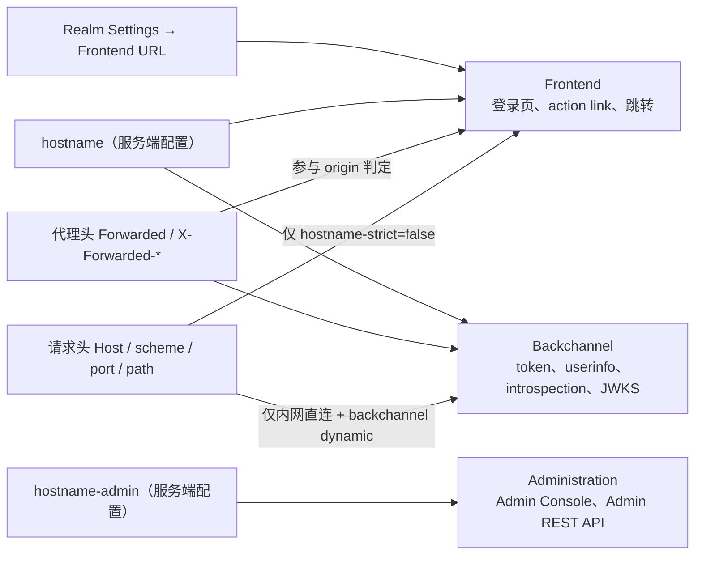

## 场景

升级到 Keycloak 26 之后，有三类问题几乎总会同时出现：

1. 容器/Pod 直接起不来，日志停在 `Failed to start server in (production) mode`；
2. 服务起来了，但 `/.well-known/openid-configuration` 里的 `issuer` 是 `http://keycloak-service:8080/realms/app` 这种内网地址，oauth2-proxy 报 `expected audience` 或 issuer 不匹配；
3. 用户点浏览器里的「忘记密码」，邮件里的 action link 指回内网主机名，点开是 404 或证书错误。

这三种症状的根因是同一个：**Keycloak 26 的 hostname v2 把 URL 生成权从「请求头」收回到「显式配置」**。hostname v1 在 Keycloak 25 弃用，**26.0.0 已彻底移除**（`hostname-url`、`hostname-path`、`hostname-port`、`hostname-strict-backchannel`、`hostname-strict-https`，以及 `proxy` 一起被删）。旧文档和旧博客里的参数照抄过来，在 26 上不是「不生效」，而是启动校验直接拒绝。

本文只解决一个具体问题：**在 26.x 上把 hostname 配对，并在配错时知道是哪一条校验挂了**。

## 适用 / 不适用

| 适合 | 不适合 |
|------|--------|
| 正在从 Keycloak ≤25 升级到 26.x，需要逐项替换 hostname 参数 | 还在用 v1 且短期不升级（本篇参数对 v1 无效） |
| 首次以 `kc.sh start`（production profile）部署，被启动校验拦住 | 只需要排查登录循环 / Cookie / CSRF（见文末重定向循环排查） |
| discovery issuer 与客户端期望不一致、邮件链接指向内网 | 只想临时跑 `start-dev` 做本地验证（开发模式默认 `hostname-strict=false`） |
| 需要区分公网前端域名、内网 backchannel、独立 admin 域名 | 需要多域名共享同一实例（本篇给出边界与不推荐理由） |

## 解析模型：三类端点，四个选项

hostname v2 把 Keycloak 对外暴露的 URL 分成三组，每组有独立的解析来源：



图中的关键含义：**同一个请求头可能同时影响前端和 backchannel 的 URL 生成**，而 v2 的设计意图是让 `hostname` / `hostname-admin` 这两条「服务端配置」路径成为主路径，请求头只在显式开启时才参与——这也是它比 v1 更安全的根本原因。

| 选项 | 作用 | 约束 | 默认值 |
|------|------|------|--------|
| `hostname` | 前端 URL 基准；同时是 backchannel 基准 | 纯 hostname 或**完整 URL**（含 scheme） | 无，production 下必须显式给出 |
| `hostname-admin` | 管理端 URL 基准（与前端不同域时用） | 只能填**完整 URL**；且此时 `hostname` 也必须是完整 URL | 无 |
| `hostname-backchannel-dynamic` | 允许 backchannel URL 按请求头动态解析（内网直连场景） | 为 `true` 时 `hostname` 必须是完整 URL | `false` |
| `hostname-strict` | 关闭后允许从请求头推导 hostname | 与 `hostname` 同时出现时被忽略（只用于强制校验「必须显式配置」） | `true` |

**为什么默认禁止动态解析？** 官方文档给的理由很直接：Keycloak 会主动对外披露自己的 URL（OIDC Discovery、邮件里的 action link）。如果这些 URL 从 Host 头推导，攻击者构造一个请求就能让邮件链接或 issuer 指向自己的域名，从而窃取 action token、密码重置凭据。所以 production profile 下，要么给 `hostname`，要么显式写 `hostname-strict=false` 承担这个风险——二选一，没有第三条路。

## v1 → v2 选项映射

| v1 写法（26 已移除） | v2 写法 | 说明 |
|----------------------|---------|------|
| `hostname=my.example.com` + `hostname-url=https://...` | `hostname=my.example.com` 或 `hostname=https://...` | 合并为一个选项；`-url` 后缀取消 |
| `hostname-path=/auth` + `https-port=8543` | `hostname=https://my.example.com:8543/auth` | path 与 port 折进 URL；不带 port 时按 scheme 默认端口（443/80） |
| `hostname-admin=admin.example.com` + `hostname-admin-url=...` | `hostname-admin=https://admin.example.com:8443` | 只接受完整 URL，裸域名会被拒绝 |
| `hostname-strict-backchannel=true` | `hostname-backchannel-dynamic=false` | **语义反转**，见下 |
| `hostname-strict-https=true` | 无对应项 | HTTPS 由 `hostname` URL 里的 scheme 表达；不再单独强制 |
| `proxy=edge` / `proxy=passthrough` | `--proxy-headers=xforwarded` 或 `forwarded` | `proxy` 选项已从服务器删除；TLS passthrough 则**不设置** `proxy-headers` |

### 最容易踩的一条：backchannel 默认行为反了

- v1 默认 backchannel **动态**解析，想要和前端一致必须显式加 `hostname-strict-backchannel=true`；
- v2 默认 backchannel 与前端**一致**（`hostname-backchannel-dynamic=false`），想让内网客户端走独立地址才需要显式开 `true`。

也就是说，从 v1 迁移时把 `hostname-strict-backchannel=true` 直译成「也写个 true」是错的——要迁移为 `hostname-backchannel-dynamic=false`（通常就等于不配）。反过来，如果你的后端服务一直是靠请求头拿内网地址的，升级后会发现 token/userinfo 端点突然变成公网域名，这是预期行为变化，不是 bug。

### `hostname` 的合法形式

源码层的校验逻辑（`HostnameV2ProviderFactory`，26.7.3）是这样判定的：不带 `http(s)://` 前缀时按纯 hostname 校验，实现上是 `URI.create("http://" + hostname)` 后要求 `getHost()` 与输入**完全相等**。因此：

| 写法 | 结果 |
|------|------|
| `sso.example.com` | ✅ 合法 hostname |
| `https://sso.example.com` | ✅ 合法 URL |
| `https://sso.example.com:8543/auth` | ✅ 合法 URL（含 port 与 path） |
| `sso.example.com:8543` | ❌ 既不是纯 hostname 也不是合法 URL（`getHost()` 不等于原字符串），报 `Provided hostname is neither a plain hostname nor a valid URL` |
| `https://sso.example.com/` | ✅（尾部斜杠被规范化） |
| `https://sso.example.com/?a=1` | ❌ URL 不允许带 query / fragment / userinfo |

另外：只有在**没有**设置 `hostname` 时，`hostname-strict` 才有意义；设置之后它被忽略，启动日志会打印 `If hostname is specified, hostname-strict is effectively ignored`。

## 四种拓扑的最小配置

### 拓扑 1：边缘 TLS 终结（Ingress / LB 建 TLS，明文到 Pod）

最常见，也是唯一需要 `proxy-headers` 的拓扑：

```bash
bin/kc.sh start \
  --hostname https://sso.example.com \
  --http-enabled true \
  --proxy-headers xforwarded
```

要点：`hostname` 用完整 HTTPS URL 固化 scheme 和端口，别依赖 `X-Forwarded-Proto` 推导——请求头需要的话是给 backchannel 用的，前端 URL 越静态越安全。

### 拓扑 2：TLS passthrough（代理只转发 TCP，Pod 自己拿证书）

```bash
bin/kc.sh start --hostname https://sso.example.com
# 不设置 --proxy-headers
```

passthrough 下不能同时启用 `proxy-headers`，也不能开 `hostname-backchannel-dynamic`：动态 backchannel 走 HTTPS 时，Pod 出示的证书是公网主机名对应的证书，而请求里带的是内网主机名，hostname 校验会失败。这是官方文档明确写出的排除项。

### 拓扑 3：内网 backchannel 动态解析

后端服务走集群内地址访问 Keycloak，前端用户走公网域名：

```bash
bin/kc.sh start \
  --hostname https://sso.example.com \
  --hostname-backchannel-dynamic true \
  --proxy-headers xforwarded
```

`hostname` 必须是完整 URL（否则启动直接报 `hostname-backchannel-dynamic must be set to false if hostname is not provided as full URL`）。开了这个选项等于**允许请求头参与 backchannel URL 生成**，所以代理必须覆盖写入 `X-Forwarded-Host`/`X-Forwarded-Proto`，并在网络层禁止绕过代理直连 Service——否则内网任何能发请求的人都能影响 Keycloak 生成的 URL。

### 拓扑 4：Admin 独立域名

```bash
bin/kc.sh start \
  --hostname https://sso.example.com \
  --hostname-admin https://admin.sso.example.com
```

两个必须记住的边界：

- `hostname-admin` 与 `hostname` 都必须是完整 URL，两者同时出现才合法；
- **`hostname-admin` 不限制 Admin REST API 仍可从前端 URL 访问**。控制台用 admin 域名，但 `https://sso.example.com/admin/realms/...` 依然可用。要真正收敛管理面，只能在反向代理层按路径/来源 IP 拒绝，或让管理端口不对外暴露。

## Kubernetes / Operator 写法

Operator 把 hostname 做成了 CR 的一等字段，与 CLI 选项一一对应（当前文档使用 `k8s.keycloak.org/v2beta1`，实际版本号要按集群里已安装的 CRD 核对）：

```yaml
apiVersion: k8s.keycloak.org/v2beta1
kind: Keycloak
metadata:
  name: keycloak
spec:
  instances: 2
  hostname:
    hostname: https://sso.example.com   # 完整 URL，固化 scheme/port
    admin: https://admin.example.com    # 可选；设置后 hostname 也必须是 URL
    strict: true                        # 不设 hostname 时才需要显式 false
    backchannelDynamic: false
  http:
    httpEnabled: true                   # 代理终结 TLS 时以明文转发
  proxy:
    headers: xforwarded                 # 对应 --proxy-headers=xforwarded
```

Operator 侧的额外注意点：Keycloak 26.0 起 Operator **不再默认 `proxy=passthrough`**。以前靠默认值就能在固定边缘域名下工作的部署，升级 Operator 后需要显式声明代理头配置（`spec.proxy.headers`），否则会出现「Pod 正常、登录后跳回错误地址」这类半故障状态。

## 验证

```bash
# 1. 看最终生效配置（而不是你写了什么）
bin/kc.sh show-config | grep -i -E 'hostname|proxy' 

# 2. issuer 与两个关键端点的实际取值
curl -s https://sso.example.com/realms/app/.well-known/openid-configuration \
  | jq '{issuer, authorization_endpoint, token_endpoint}'
# 期望：三者同属 https://sso.example.com，token_endpoint 不能是内网地址

# 3. 排查解析过程（官方提供的调试开关）
bin/kc.sh start --hostname=https://sso.example.com --hostname-debug=true
```

两个容易漏掉的检查项：

- **邮件 action link**：真正触发一次「忘记密码」，看邮件里的链接域名与 scheme。这一步是唯一能验证「URL 生成是否被请求头污染」的端到端证据；discovery 正确不代表邮件链接正确。
- **Realm 级 Frontend URL**：Admin Console → Realm Settings → General → Frontend URL 属于硬编码来源之一，设置后会覆盖该 realm 的前端 URL。全局 hostname 明明对了、只有某个 realm 行为异常时，先来这里看。

## 常见错误症状表

| 症状 | 根因 | 处理 |
|------|------|------|
| `Failed to start server in (production) mode` + `hostname is not configured; either configure hostname, or set hostname-strict to false` | production 下 `hostname-strict` 仍为默认 `true`，但没给 `hostname` | 设置 `--hostname https://sso.example.com`；只在过渡期用 `hostname-strict=false` |
| `Provided hostname is neither a plain hostname nor a valid URL` | 写了 `sso.example.com:8543` 这类裸 `host:port`，或 URL 带 query/fragment | 纯 hostname，或完整 URL（scheme+host[:port][/path]） |
| `hostname must be set to a URL when hostname-admin is set` | 配了 `hostname-admin`，但 `hostname` 只写了裸域名 | 把 `hostname` 改成完整 URL |
| `hostname-backchannel-dynamic must be set to false ...` | 开了动态 backchannel，但 `hostname` 不是完整 URL | 补全 scheme，或关掉动态解析 |
| 启动 warning：`Hostname v1 options [...] are still in use, please review your configuration` | 配置里仍有 `proxy`、`hostname-url`、`hostname-strict-https` 等已移除项 | 按映射表逐项替换；这类残留参数不会报错，只会静默失效或触发校验 |
| 启动 warning：`When using an edge proxy, you must use proxy-headers` | HTTPS 监听开启、`hostname` 是 https URL，但没设 `proxy-headers` | 边缘终结场景加 `--proxy-headers xforwarded` |
| 启动 warning：`HTTPS not enabled, proxy-headers unset, and hostname-strict=false` | 明文监听 + 无代理头，属不安全上下文 | 启用 HTTPS，或补齐代理头；此类部署的跨域 Cookie 也会异常 |
| discovery 的 `issuer` 是内网地址 | backchannel URL 被请求头动态解析，或代理未覆盖 `X-Forwarded-*` | 固定 `hostname` 为完整 URL；确需动态则先保证代理覆盖写入请求头 |
| 登录后跳到 `:8443` 或内部主机名 | `hostname` 只写了裸域名，scheme/port 由请求头推导 | 改用完整 URL `https://sso.example.com` |
| 密码重置 / 验证邮件链接指回内网 | 同上一行，邮件链接沿用前端 URL 生成 | 同上；改完必须重新走一次邮件流程验证 |
| oauth2-proxy / 客户端报 issuer 或 audience 不匹配 | 客户端 `--oidc-issuer-url` 与 discovery 的 `issuer` 不一致 | 以 discovery 实际返回值为准对齐；注意尾部斜杠与 `/realms/<realm>` 路径 |
| 只有某个 realm 异常 | realm 级 Frontend URL 覆盖了全局配置 | 清空该字段让全局配置生效，或保持一致 |

## 回滚

hostname 改动本身**不涉及数据库结构变更**，回滚就是把参数改回去、重启：

```bash
# 裸机 / 容器：回滚启动参数或环境变量（KC_HOSTNAME / KC_HOSTNAME_ADMIN / KC_PROXY_HEADERS）
# K8s Operator：回滚 CR 中的 spec.hostname 与 spec.proxy，Operator 会重建 Deployment
kubectl -n keycloak rollout status statefulset/keycloak   # 确认回滚后 Pod 就绪
```

但有一个必须先算清楚的副作用：**issuer 变了，已签发的 token 全部失效**。客户端的 OIDC 库会校验 `iss`，改完 hostname 后存量 access/ID Token 会被拒绝，用户需要重新登录一次；同时任何按域名做的 Cookie、CORS、回调 URI 白名单配置都要跟着改。所以：

- 不要在业务高峰改 hostname；
- 改之前先确认所有客户端（oauth2-proxy、自研 OIDC 客户端、K8s API Server、Grafana 等）的 issuer/redirect URI 配置项，一次改完；
- 如果客户端支持多 issuer 或 issuer 可热更新，先加新值再切流量，避免全站 401。

## IAM FAQ

### IAM 平台升级到 Keycloak 26 后，`hostname-url` / Realm 里的 `frontendUrl` 还能用吗？

不能。`hostname-url`、`hostname-admin-url`、`hostname-path`、`hostname-port`、`hostname-strict-backchannel`、`hostname-strict-https` 与 `proxy` 都在 26.0.0 被移除，配置里残留时启动会打印 `Hostname v1 options [...] are still in use` 警告。Realm Settings 里的 Frontend URL 字段仍然存在，但它属于硬编码来源之一，会覆盖该 realm 的前端 URL，排查「只影响单个 realm」的异常时优先看它。

### IAM 里可以把 `hostname-strict=false` 当长期方案吗？

不建议。它把前端、backchannel、admin 三类 URL 都交给请求头决定，等于把 issuer 生成权开放给任何能发请求的人——邮件 action token、密码重置链接都可能被引向攻击者域名，oauth2-proxy 这类客户端也会因 origin 判定错误出现 403。它只适合两类场景：`start-dev` 本地开发，以及升级窗口期的临时排障。生产环境应固定完整 URL 的 `hostname`，动态需求用 `hostname-backchannel-dynamic` 精确限定在 backchannel 上。

### IAM 的 backchannel 动态解析什么时候必须开？

当「用户浏览器走公网域名、后端服务走内网地址访问同一个 Keycloak」时。默认 `false` 会让 token、userinfo、JWKS 端点都返回公网域名，内网服务就得绕出去访问公网入口（可能根本不通，或引出额外的出网策略问题）。开启后需要同时满足两个前提：`hostname` 是完整 URL，且反向代理覆盖写入 `X-Forwarded-*` 并在网络层禁止绕过代理直连——否则等于把 URL 生成权交给了内网任意请求。

### 一个 Keycloak 实例能给多个域名提供服务吗？

技术上可以，但边界很窄。`hostname-strict=false` 会让 URL 按请求解析，多域名「都能登录」，代价是上面说的 issuer 信任问题和 HTTPS 场景下的 CORS/origin 不一致；Realm 级 Frontend URL 只能影响单个 realm 的前端 URL，不解决 backchannel 与 admin。工程上更稳的做法是：对外只保留一个规范化域名（多个域名由代理 301 到主域名），确有隔离需求时再拆实例或按 realm 拆入口。

## 相关阅读

- [IAM 网关 Keycloak 重定向循环与 401 排错]()：hostname 配对之后的 Cookie / CSRF / TLS 层次问题
- [Keycloak 生产环境完整部署路线图]()：反向代理与 TLS 在整体部署顺序中的位置
- [Keycloak + oauth2-proxy 集成指南]()：issuer 与 audience 对齐的客户端侧配置
- [Keycloak 高可用集群部署与灾难恢复]()：Operator CR 与多节点场景
- [Kubernetes 生产部署]()：Ingress 终结 TLS 的完整清单
- [Traefik ForwardAuth + Keycloak + oauth2-proxy]()

### 关键来源

- [Keycloak 官方文档 — Configuring the hostname (v2)](https://www.keycloak.org/server/hostname)：选项语义、校验规则、`hostname-debug`
- [Keycloak Upgrading Guide — Hostname v1 feature removed](https://www.keycloak.org/docs/latest/upgrading/)：26.0.0 移除清单与迁移要求
- [Red Hat build of Keycloak — Migration changes](https://docs.redhat.com/en/documentation/red_hat_build_of_keycloak/26.0/html/upgrading_guide/migration-changes)：v1 → v2 选项对照表、backchannel 行为变化
- `HostnameV2ProviderFactory` 与 `HostnameV2PropertyMappers`（Keycloak `26.7.3` tag）：本文的启动错误文本与 misconfiguration 警告取自上游源码校验逻辑
- [Keycloak Operator — Advanced configuration](https://www.keycloak.org/operator/advanced-configuration)：CR `spec.hostname` 字段
