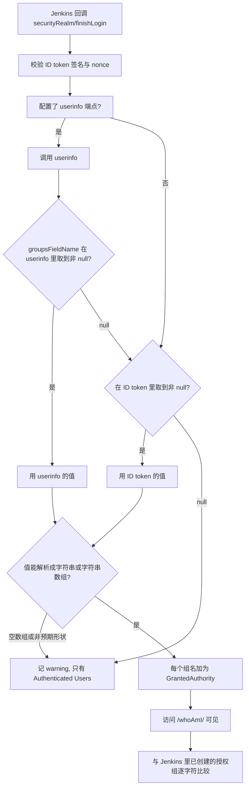

## 场景

- 内网一套 Jenkins 跑 CI，账号在 Keycloak 里；目标是统一登录，并且按 Keycloak 的组决定谁能管 Jenkins、谁能配流水线、谁只能看。
- oic-auth 的配置项不多，但有三处「配错也不报错」：`groupsFieldName` 写了非法 JMESPath、claim 名两边对不上、Jenkins 侧没有同名组——三种情况下用户都能正常登录，却一个权限都没有。
- 另一类错误在回调地址上：Jenkins 的 root URL、反向代理、Keycloak 的 redirect URI 白名单三者必须一致，差一个 context path 就登不进去。

本文只写 Jenkins 侧（oic-auth 插件）的字段语义、claim 从 Keycloak 到 Jenkins 的判定路径、以及每类错误的定位点。Keycloak 客户端的通用配置（client、Protocol Mapper、redirect URI 的组织方式）见 [Keycloak IAM 第三方软件集成指南]()。

字段与行为核对自 oic-auth `4.727.v84644c157a_f8`（2026-10-02 发布）源码（`OicSecurityRealm.java`、`OicLogoutAction.java`、`properties/EscapeHatch.java`）、插件官方文档，以及 Keycloak main 分支源码（`OIDCLoginProtocolFactory.java`、`GroupMembershipMapper.java`、`UserRealmRoleMappingMapper.java`、`LogoutEndpoint.java`、`AuthorizationEndpointChecker.java`）与管理控制台文案；核查日期 2026-10-02。

## 适用 / 不适用

| 场景 | 是否适用 |
|------|----------|
| 自建 Jenkins（war / Docker / Helm）接 Keycloak OIDC，用 oic-auth 做 Security Realm | ✅ |
| 要按 Keycloak 的组控制 Jenkins 权限（管理员 / 流水线 / 只读） | ✅ 组名需在 Jenkins 侧逐字符对齐，见第 5 节 |
| 想让流水线脚本继续用「用户名 + 密码」调 Jenkins API | ❌ oic-auth 下 basic auth 不工作，改用 API token |
| 希望 Keycloak 的 MFA / 条件访问策略对 Jenkins 生效 | ✅ 策略由 Keycloak 决定，Jenkins 只消费结果 |
| 需要 SAML 而不是 OIDC | ❌ oic-auth 只做 OIDC，SAML 用 Jenkins 的 SAML 插件 |
| 没有能力维护反向代理与证书，Jenkins 直接暴露在公网 | ⚠️ 先解决 TLS 与 root URL，再谈 SSO |

## 1. 选型：oic-auth 还是 Keycloak 插件

Jenkins 生态里能接 Keycloak 的有两个插件，名字容易让人选错：

| 插件 | 当前版本（2026-10-02 核对） | 配置形态 | 备注 |
|------|------------------------------|----------|------|
| [oic-auth](https://plugins.jenkins.io/oic-auth/) | `4.727.v84644c157a_f8`（2026-10-02），要求 Jenkins ≥ 2.539 | 填 well-known 地址或手动端点，claim 用 JMESPath 映射 | 通用 OIDC，JCasC 可声明式配置 |
| [keycloak](https://plugins.jenkins.io/keycloak/) | `2.4.3`（2026-09-19），要求 Jenkins ≥ 2.541.3 | 粘贴 `keycloak.json` | 2023-05-26 的 2.3.2 之后停更到 2026-09-14 才恢复发布；插件页挂着三条公告：CSRF 与 session fixation 影响 2.3.0 及更早，open redirect 影响 2.4.1 及更早 |

**默认选 oic-auth。** 理由不是「哪个更新」，而是配置的可验证性：

- oic-auth 用 discovery 文档（`/.well-known/openid-configuration`）拿端点，端点、issuer、JWKS 都来自 Keycloak 自己，不需要人工誊抄；`keycloak.json` 则是一份静态副本，客户端改配置后要重新导出并在 Jenkins 里替换。
- oic-auth 把 claim 映射写成公开的 JMESPath（`groupsFieldName`、`userNameField`），出问题能在 Jenkins 日志里定位到具体表达式；插件还提供 `escapeHatch`、`pkce`、`allowedTokenExpirationClockSkew` 这类可声明的开关。
- 两者都只能做认证，授权都在 Jenkins 侧完成（第 5 节），所以插件的差异集中在这三点上。

`keycloak` 插件并非配不通——Keycloak 控制台至今保留「Download adapter config」（控制台文案 key：`downloadAdapterConfig`），可以导出 `keycloak.json`。但它把认证路径绑在一份离线配置文件上，本文的配置示例与排错路径都以 oic-auth 为准。

## 2. Keycloak 端最小配置

| 字段 | 值 | 说明 |
|------|-----|------|
| Client ID | `jenkins` | |
| Client type | `OpenID Connect` | |
| Client authentication | `ON` | oic-auth 使用 client secret，`tokenAuthMethod` 用 `client_secret_basic` |
| Standard flow | `ON` | 走授权码流程 |
| Direct access grants | `OFF` | oic-auth 不用密码模式 |
| Valid redirect URIs | `https://jenkins.example.com/securityRealm/finishLogin` | 见 2.1，路径是插件常量 |
| Valid post logout redirect URIs | `https://jenkins.example.com/OicLogout` | 缺这一条时登出直接 400，见 2.1 |
| PKCE Method | 留空，或按 2.2 取舍 | 控制台文案：「If not required, Keycloak only uses PKCE when the client includes a code challenge and method in its authorization request.」 |

### 2.1 两个回调地址是插件常量，不要自己猜

插件文档给出的注册信息（与源码一致）：

- 登录回调：`${JENKINS_ROOT_URL}/securityRealm/finishLogin`（源码 `ensureRootUrl() + "securityRealm/finishLogin"`）
- 登出回调：`${JENKINS_ROOT_URL}/OicLogout`（`OicLogoutAction.POST_LOGOUT_URL = "OicLogout"`）
- scope：`openid profile email`

两个容易踩的地方：

1. **`JENKINS_ROOT_URL` 含 context path。** Jenkins 挂在 `https://jenkins.example.com/ci/` 时，注册的 URI 必须是 `/ci/securityRealm/finishLogin`，源码里登出地址也是用 `req.getContextPath()` 拼出来的。只写 `/securityRealm/finishLogin` 会在回调阶段拿到 `invalid_redirect_uri`。
2. **登出地址要在 Keycloak 的 post-logout 白名单里。** 开启 `logoutFromOpenidProvider` 后，插件调用 `end_session_endpoint` 并带上 `post_logout_redirect_uri`；Keycloak 的 `LogoutEndpoint` 会用客户端已配置的 post-logout URI 集合逐个比对，不匹配就返回 400 `invalid_redirect_uri`。所以「登录能用、登出报错」通常是这一条没配。

反向代理下 root URL 的判断规则（源码 `getRootUrl()`）：默认取 Jenkins 系统配置里的 Jenkins URL；只有显式打开 `rootURLFromRequest` 时才改用 `Jenkins.get().getRootUrlFromRequest()`。**先在 Jenkins 的 Manage Jenkins → System → Jenkins URL 里填对外地址**，这是可预测的做法；`rootURLFromRequest` 留给「反代已正确传递 Host/Proto，但无法固定 root URL」的场景，它会让你依赖代理头的正确性。

### 2.2 想强制 PKCE 就走 S256

Keycloak 客户端的 PKCE Method 有两种状态：

- **留空**：客户端主动带 `code_challenge` 才校验（控制台文案原话见上表），此时 Jenkins 开不开 `pkce` 都不报错。
- **设为 `S256`**：强制，授权请求里没有 `code_challenge_method` 就报错。源码路径 `AuthorizationEndpointChecker.checkParamsForPkceEnforcedClient` 抛出的文本是 `Missing parameter: code_challenge_method`——Jenkins 侧对应开关就是 `pkce` 属性。

对 confidential client（有 client secret）而言 PKCE 是额外一层，不会替代 secret 校验；两者同时开启是允许的。**不建议**为绕过配置问题去开 `disableNonce` 或 `disableTokenVerification`：前者关掉重放防护，后者关掉 ID token 与 userinfo 的验签，等于把认证结果交给网络。

### 2.3 `groups` claim 的两种含义（本节最常被误解）

Keycloak 的内置 client scope 里**没有**一个专门用来输出用户组、且恰好叫 `groups` 的 scope。但你在 token 里确实能看到 `groups`，原因是 `microprofile-jwt` scope：

```java
// OIDCLoginProtocolFactory.java
public static final String GROUPS = "groups";
...
model = UserRealmRoleMappingMapper.create(null, GROUPS, GROUPS, true, true, true, true);
builtins.put(GROUPS, model);
```

`microprofile-jwt` 是一个**可选** scope，它把 **realm 角色**映射到名为 `groups` 的 claim。所以：

| 你想要的 | claim 名 | Keycloak 侧怎么来 | 值的例子 |
|----------|----------|-------------------|----------|
| realm / client 角色 | `realm_access.roles`、`resource_access.<client>.roles` | 内置 `roles` 默认 scope（新建 client 就自带） | `["ci-admin", "viewer"]` |
| 用户所属组（Groups 页面里的那个） | 自定义，惯例仍叫 `groups` | 自己加 `Group Membership` mapper（可挂在专用 scope 上） | `["/platform/ci"]`，`full.path` 默认 `true` |

两个结论：

1. 如果 Jenkins 的 `groupsFieldName` 写成 `groups` 而你在 Keycloak 里关联的是 `microprofile-jwt`，**拿到的是角色名不是组名**。名字对上了、权限对不上，就是这里错了。
2. `Group Membership` mapper 的 `full.path` 默认值是 `true`，claim 输出 `/platform/ci` 这种带前导斜杠的完整路径。这个斜杠会一路带到 Jenkins 的组名里——要么让它带斜杠，要么在 mapper 里关掉 `full.path` 并接受同名层级组退化为歧义（取舍同 [Argo CD 接入 Keycloak OIDC]()）。

组名带斜杠时还要注意 JMESPath 的语法边界，见 4.2。

## 3. Jenkins 端（oic-auth）配置

界面路径：Manage Jenkins → Security → Security Realm 选 `OpenID Connect`。

| 字段 | 示例值 | 说明 |
|------|--------|------|
| Well-known configuration URL | `https://kc.example.com/realms/myrealm/.well-known/openid-configuration` | 自动模式，端点/JWKS/issuer 都从这里取 |
| Client ID / Secret | `jenkins` / `<SECRET>` | 与 Keycloak 客户端一致 |
| User name field name | `preferred_username` | 默认是 `sub`，见下方警告 |
| Full name field name | `name` | 可留空 |
| Email field name | `email` | 可留空，留空则用户没有邮箱属性 |
| Groups field name | `realm_access.roles` 或自定义组 claim | 见第 4 节 |
| Logout from OpenID provider | 按需 | 开启时联动结束 Keycloak 会话，影响同一浏览器里其他 SSO 应用 |
| Post logout redirect URL | `https://jenkins.example.com/OicLogout` | 必须与 Keycloak 的 post-logout 白名单一致 |
| `pkce` | 按需 | Keycloak 强制 S256 时必开，见 2.2 |
| `allowedTokenExpirationClockSkew` | 时钟有漂移时才设 | 单位秒，附加到 access token 过期判断上 |
| `allowTokenAccessWithoutOicSession` | 默认关 | 打开后 API token 可在 OIDC 会话结束后继续用，见第 8 节 |

同一份配置用 JCasC 表达（可直接进 Git 管理）：

```yaml
jenkins:
  securityRealm:
    oic:
      serverConfiguration:
        wellKnown:
          wellKnownOpenIDConfigurationUrl: "https://kc.example.com/realms/myrealm/.well-known/openid-configuration"
      clientId: "jenkins"
      clientSecret: "${JENKINS_OIDC_CLIENT_SECRET}"
      userNameField: "preferred_username"
      fullNameFieldName: "name"
      emailFieldName: "email"
      groupsFieldName: "realm_access.roles"
      logoutFromOpenidProvider: true
      postLogoutRedirectUrl: "https://jenkins.example.com/OicLogout"
      properties:
      - escapeHatch:
          username: "breakglass"
          group: "jenkins-admins"
          secret: "${JENKINS_ESCAPE_HATCH_SECRET}"
```

> **改 `userNameField` 之前想清楚。** Jenkins 是用这个 claim 的值当用户 ID 建账号的。从默认的 `sub`（一串 UUID）改成 `preferred_username` 之后，同一个人在 Jenkins 里会变成**另一个用户**：个人凭据、权限记录、流水线里按用户 ID 写死的配置都不会跟着迁移。要在接入前定好，不要上线后再改。

## 4. groups 从 Keycloak 到 Jenkins 的判定路径



### 4.1 取值顺序：userinfo 优先，ID token 只兜「取不到」

源码 `determineAuthorities` 的逻辑是：

```java
// userInfo has precedence when available
if (userInfo != null) {
    groupsObject = this.groupsFieldExpr.search(userInfo);
}
if (groupsObject == null && idToken != null) {
    groupsObject = this.groupsFieldExpr.search(idToken.getJWTClaimsSet().getClaims());
}
```

三段式后果，值得分开记：

- **表达式在 userinfo 里取不到（null）** → 回退到 ID token。所以「只把 claim 放进 ID token」在多数情况下也能用。
- **表达式在 userinfo 里取到值但是空数组**（例如 `realm_access.roles: []`）→ `groupsObject` 不是 null，**不回退**，直接进入解析，得到空列表，日志里是 `Could not identify groups in ...`。用户登录成功、没有任何组权限。
- **表达式本身不合法** → `groupsFieldExpr` 为 null，日志是 `Not adding groups because groupsFieldName is invalid.`，只挂一个 `Authenticated Users` 权限。

三种情况都**不影响登录**——这是设计使然（认证与授权分离），但意味着「Jenkins 里能进去」不能当作集成成功的判据。判据是 `/whoAmI/` 里能看到组名（第 6 节）。

顺带说明：`userNameField`、`emailFieldName`、`fullNameFieldName` 这些单值字段的取值逻辑是「userinfo 取不到就回退 ID token」，与 groups 的处理并不完全对称——**groups 会因为空数组卡在 userinfo 这一层，字符串字段不会**。同一个用户身上两种字段表现不一致时，按这个差异去查。

### 4.2 JMESPath 的语法边界

`groupsFieldName` 是 JMESPath 表达式，不是普通字段名。两处会翻车的地方：

- **claim 名里带 `-`**（例如 client 名叫 `my-ci`）：`resource_access.my-ci.roles` 会被解析成减法，表达式非法 → 落入上面的 fail-open 分支。正确写法是加引号：`resource_access."my-ci".roles`。JMESPath 语法里带引号的字符串本身就是合法的标识符。
- **case 与空格**：`realm_access.roles` 必须小写，`realm_access.Roles` 取不到值、静默变成「没有组」。

先用 Keycloak 的 Evaluate（第 6 节第 1 步）拿到真实 JSON，再拿这份 JSON 去调表达式，比在 Jenkins 里反复试快得多。

## 5. Jenkins 侧授权：组必须先存在

oic-auth 只把组名交给 Jenkins，**不会自动创建组，也不会自动授予任何权限**。官方 HOWTO 的流程是三段：

1. Keycloak 侧把用户放进组；
2. Jenkins 侧在授权策略（Matrix-based / Project-based）里新建**同名**组并勾权限；
3. 用户登录时，插件把组名作为 authority 挂上，Jenkins 按名字匹配到第 2 步的权限。

几个必须记住的细节：

- **名字逐字符比较**，大小写和空格都算：claim 里是 `/platform/ci`，Jenkins 里建 `platform/ci` 就是不匹配。
- Jenkins 有内置组 `Authenticated Users`，用来给「所有能登录的人」一个最小权限（通常是 `Overall/Read`）。把管理员权限放在自定义组上，不要放在它上面。
- 两套建模二选一，别混用：
  - **角色驱动**：`groupsFieldName: realm_access.roles`，Jenkins 组名 = Keycloak realm 角色名。配置最少，但角色通常还承担 Keycloak 内部授权职责，语义容易混。
  - **组驱动**：用 `Group Membership` mapper 输出用户组，Jenkins 组名 = Keycloak 组路径。与 HR/IdP 同步的组对齐更自然，适合「团队结构决定权限」的场景。本书建议后者。
- 只授组、不单独授个人。否则人员调动时要手工回收个人权限，一定会漏。

## 6. 验证顺序

按这个顺序做，能把「配置错」「claim 没到」「Jenkins 没建组」三类问题分开：

1. **Keycloak 侧预览 claim**：Clients → 选 `jenkins` → Client scopes → Evaluate → 选一个测试用户，看 `Generated ID token` 与 `Generated user info` 里目标 claim 是否存在、值的形状（有无前导斜杠）。这一步不依赖 Jenkins，是最快的定位点。
2. **首次登录**：用测试账号走一遍浏览器登录，确认停在 Jenkins 页面而不是错误页。
3. **看插件实际拿到的 authority**：访问 `${JENKINS_URL}/whoAmI/`（注意 Q 与 I 的大小写），Authorities 列表里应出现第 1 步看到的组名原文。看不到就回到第 1、4 节，不要先去查 Jenkins 权限配置。
4. **核对 Jenkins 组**：Manage Jenkins → Security 里确认同名组存在且勾了预期权限；测试账号重新登录后再验一次实际权限（例如能否构建、能否进系统管理）。
5. **脚本化访问**：用 API token 而不是密码验证远程调用能通过。

```bash
# Jenkins 远程调用：用户名 + API token（不是密码）
curl -s -u "ci-bot:<API_TOKEN>" "https://jenkins.example.com/api/json?tree=jobs[name]" | jq '.jobs | length'
```

6. **登出验证**：从 Jenkins 登出（开启 `logoutFromOpenidProvider` 时会连带结束 Keycloak 会话），确认不再自动登录；这一步同时验证第 2.1 节的 post-logout 白名单。

## 7. 常见错误对照表

| 症状 / 报错 | 根因 | 处理 |
|-------------|------|------|
| 登录跳转后 Keycloak 报 400 `invalid_redirect_uri` | Valid redirect URIs 与 Jenkins 实际 root URL 不一致（context path、端口、`http/https`） | 先确认 Jenkins 的 Root URL 配置，再逐字符对齐 `/securityRealm/finishLogin` |
| 回调地址 404 / `Not found` | root URL 指向内部地址或缺少 context path | 修 Jenkins URL；反代场景确认是否需要用 `rootURLFromRequest` |
| 登出后 Keycloak 400 `invalid_redirect_uri` | `/OicLogout` 不在 Valid post logout redirect URIs 里 | 补上 `${JENKINS_ROOT_URL}/OicLogout` |
| 日志 `Not adding groups because groupsFieldName is invalid.` | `groupsFieldName` 不是合法 JMESPath（常见：带 `-` 的 claim 名没加引号、大小写写错） | 用 Evaluate 的 JSON 调通表达式，例如 `resource_access."my-ci".roles` |
| 日志 `idToken and userInfo did not contain group field name: X` | claim 名两边不一致，或 mapper 没关联到该 client 的 scope | 对齐 mapper 的 Token Claim Name 与 Jenkins 的表达式 |
| 日志 `Could not identify groups in X=[]` | userinfo 里该 claim 是空数组，不回退 ID token | 确认用户在组里、mapper 的 Add to userinfo 设置与取值来源 |
| claim 值是 realm 角色，不是用户组 | 关联了 `microprofile-jwt` scope（它的 `groups` 是 realm 角色映射） | 删掉该 scope，改用 `Group Membership` mapper，见 2.3 |
| claim 里有组，但 Jenkins 权限没生效 | Jenkins 侧没建同名组/没勾权限；或组名斜杠、大小写不一致 | 从 `/whoAmI/` 复制组名原文建组 |
| 401 且密码正确 | oic-auth 下 basic auth 不工作 | 改用 Jenkins API token |
| API token 隔一段时间失效，重新网页登录后又好了 | 用户 OIDC 会话结束，而 `allowTokenAccessWithoutOicSession` 默认为关 | 重新登录；确需长时间无人值守再评估打开该开关 |
| 授权请求报 `Missing parameter: code_challenge_method` | Keycloak 客户端 PKCE Method = `S256`，Jenkins 未开 `pkce` | 打开 `pkce`，或把 PKCE Method 置空 |
| 偶发 token 过期类报错 | 服务器时钟漂移 | 校准 NTP；必要时设置 `allowedTokenExpirationClockSkew` |

## 8. 回滚与锁死防护

Security Realm 一改，Jenkins 原有的数据库/LDAP 登录方式就同时不可用了（插件文档明确写了这点）。所以顺序是「先留后门，再切」。

1. **切换前先配好 `escapeHatch`**：一个独立用户名 + 密码（源码里以 BCrypt 存储）+ 组名。它的用途是在 IdP 不可达或配置写错时恢复访问；即便配置正确也建议保留，但要把它当高权限凭据管——源码为该入口注册了 CSRF crumb 豁免，它不在常规表单校验链上。
2. **回滚 Jenkins**：Security Realm 改回 Jenkins 自己的用户数据库或 LDAP。注意 OIDC 期间自动建出来的用户记录还在，但他们**没有本地密码**：要么用 escape hatch 进去重置，要么删除记录。
3. **Keycloak 侧先禁用 client，不要删除**：禁用立即停止新登录且保留 redirect URI、mapper 与 secret，删除后重建成本更高。
4. **验证清单**：breakglass 能登录、原管理员权限没少、有个非敏感流水线能跑通、用 API token 的机器人账号不受影响。
5. **CI 守护进程的 token 不要用人工 SSO 账号**：oic-auth 下 API token 的可用性与用户的 OIDC 会话相关（`allowTokenAccessWithoutOicSession` 默认关），把它交给长期运行的 CI 服务，会在会话到期后以「莫名其妙的 401」形式暴露出来。给脚本单独准备账号与 token，并写进凭据轮换流程。

## 常见问题（IAM 单点登录）

**Q1：Keycloak 里没有叫 `groups` 的 client scope，为什么 token 里有 `groups`？**

因为 claim 名由 mapper 决定，不由 scope 名决定。内置的 `microprofile-jwt` scope 会把 **realm 角色**输出到名为 `groups` 的 claim（源码 `UserRealmRoleMappingMapper.create(null, GROUPS, GROUPS, ...)`）；用户所属组要自己加 `Group Membership` mapper。两个来源都可能叫 `groups`、值却完全不同——这也是本文建议直接用 `realm_access.roles` 或给组 claim 起独立名字的原因。

**Q2：能不能让 Keycloak 的组自动变成 Jenkins 权限？**

不能。插件的职责到「把组名作为 authority 挂到用户身上」为止，Jenkins 侧要手工建同名组并勾权限。也就是每个新组都要在 Jenkins 里落地一次——组多的场景建议用 JCasC 把授权策略一起声明化，避免漏配。

**Q3：Keycloak 登出后，Jenkins 里的会话还在吗？**

默认是两个独立会话：Jenkins 有自己的 cookie 和超时，不会因为 Keycloak 会话消失而立刻失效。Jenkins → Keycloak 方向的联动由 `logoutFromOpenidProvider` 提供（并依赖 post-logout 白名单）；反方向（Keycloak 侧登出立刻踢掉 Jenkins 会话）不在本文配置路径里，需要 IdP 主动通知客户端的能力，接入前先按版本确认。

**Q4：Jenkins 在反向代理后面，redirect URI 到底填什么？**

填**用户浏览器看到的外部地址**加固定路径：`https://jenkins.example.com[/context]/securityRealm/finishLogin`。同时确认 Jenkins 的 Root URL 就是这个外部地址——它决定插件在授权请求里发出去的 `redirect_uri`。内部服务地址、`http://` 与 `https://` 混用、漏掉 context path，是这一类 400 报错的全部成因。

## 参考来源

- [OpenID Connect Authentication Plugin（Jenkins 插件页）](https://plugins.jenkins.io/oic-auth/)（版本与 Jenkins 版本要求、`${JENKINS_ROOT_URL}/securityRealm/finishLogin` 与 `/OicLogout`、scope、Security Realm 切换后其他认证方式不可用、escape hatch、脚本化客户端需用 API token）
- [oic-auth: docs/configuration/README.md](https://github.com/jenkinsci/oic-auth-plugin/blob/master/docs/configuration/README.md)（well-known 与手动两种模式、`groupsFieldName` 等 claim 字段、`pkce` / `disableNonce` / `disableTokenVerification` / `allowedTokenExpirationClockSkew` / `escapeHatch` / `allowTokenAccessWithoutOicSession` 等属性、JCasC 字段）
- [oic-auth: docs/howto/GROUPS_FROM_IDP.md](https://github.com/jenkinsci/oic-auth-plugin/blob/master/docs/howto/GROUPS_FROM_IDP.md)（从 IdP 提取组、在 Jenkins 建同名组、用 `/whoAmI/` 检查 authorities、`Authenticated Users` 内置组）
- oic-auth 源码 [`OicSecurityRealm.java`](https://github.com/jenkinsci/oic-auth-plugin/blob/master/src/main/java/org/jenkinsci/plugins/oic/OicSecurityRealm.java)（`determineAuthorities` 的 userinfo 优先与 null 回退、空数组不回退、`ensureString`、`getRootUrl`/`rootURLFromRequest`、`finishLogin` 与 `post_logout_redirect_uri` 拼装）、[`OicLogoutAction.java`](https://github.com/jenkinsci/oic-auth-plugin/blob/master/src/main/java/org/jenkinsci/plugins/oic/OicLogoutAction.java)、[`properties/EscapeHatch.java`](https://github.com/jenkinsci/oic-auth-plugin/blob/master/src/main/java/org/jenkinsci/plugins/oic/properties/EscapeHatch.java)
- [Keycloak Authentication Plugin（Jenkins 插件页）](https://plugins.jenkins.io/keycloak/)（`keycloak.json` 配置形态、版本与安全公告、Jenkins 版本要求）
- Keycloak 源码 [`OIDCLoginProtocolFactory.java`](https://github.com/keycloak/keycloak/blob/main/services/src/main/java/org/keycloak/protocol/oidc/OIDCLoginProtocolFactory.java)（`roles` 与 `web-origins` 为默认 client scope、`GROUPS = "groups"` 由 realm 角色映射生成、`microprofile-jwt` 为可选 scope）、[`UserRealmRoleMappingMapper.java`](https://github.com/keycloak/keycloak/blob/main/services/src/main/java/org/keycloak/protocol/oidc/mappers/UserRealmRoleMappingMapper.java)、[`GroupMembershipMapper.java`](https://github.com/keycloak/keycloak/blob/main/services/src/main/java/org/keycloak/protocol/oidc/mappers/GroupMembershipMapper.java)（`full.path` 默认 `true`）
- Keycloak 源码 [`LogoutEndpoint.java`](https://github.com/keycloak/keycloak/blob/main/services/src/main/java/org/keycloak/protocol/oidc/endpoints/LogoutEndpoint.java)（post-logout URI 白名单校验与 `invalid_redirect_uri`）、[`AuthorizationEndpointChecker.java`](https://github.com/keycloak/keycloak/blob/main/services/src/main/java/org/keycloak/protocol/oidc/endpoints/AuthorizationEndpointChecker.java)（`Missing parameter: code_challenge_method`）
- [Keycloak Server Administration Guide](https://www.keycloak.org/docs/latest/server_admin/index.html)（客户端与 client scope 概念、Evaluate 预览 claim）与 Keycloak 管理控制台文案（`pkceRequiredHelp`、`downloadAdapterConfig`）
- [JMESPath Specification](https://jmespath.org/specification.html)（带引号标识符语法）

相关章节：[Keycloak IAM 第三方软件集成指南]()、[Argo CD 接入 Keycloak OIDC]()、[Grafana 接入 Keycloak OIDC]()、[Harbor 接入 Keycloak OIDC]()、[Keycloak Adapter 弃用迁移指南]()、[Keycloak 直连 K8s OIDC]()。
