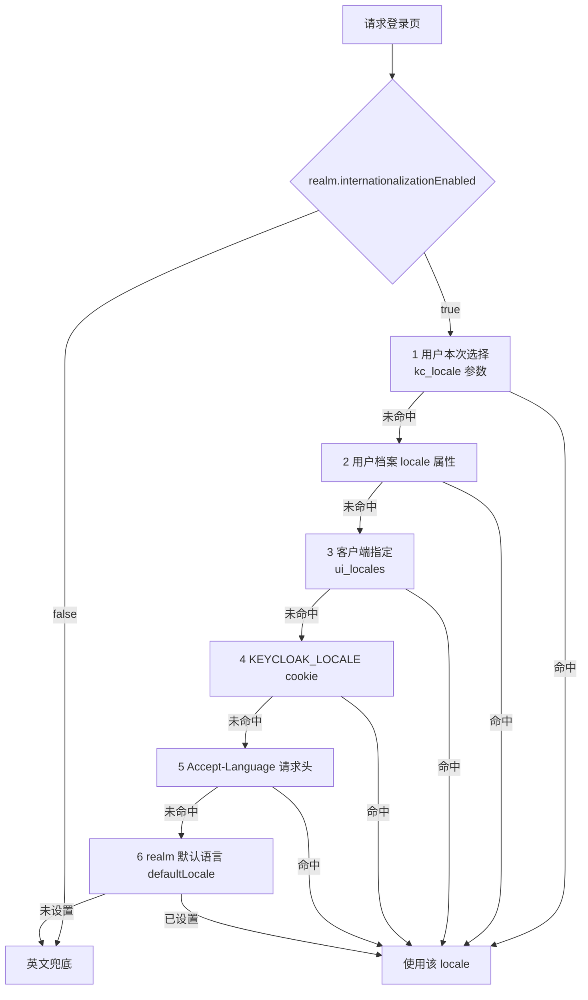

## 场景

Realm Settings → Localization 里勾了「Enable Internationalization」，登录页还是英文。或者按网上教程建了 `messages_zh_CN.properties`，重启后没任何变化。再或者登录页终于中文了，用户收到的密码重置邮件依然是英文标题加英文正文。

这三类现象对应三条互相独立的链路：**locale 有没有被解析出来**、**解析出来以后去哪取文案**、**邮件是不是走了同一套文案**。下面按这个顺序拆开。

## 适用 / 不适用

| 适用 | 不适用 |
|------|--------|
| 自建主题里做中文化、需要精确控制哪些页面是中文 | 只想改几个词、且能接受官方中文 → 用 Realm overrides 即可，不必写主题 |
| 为多语言用户提供语言切换，需要知道优先级与用户偏好怎么落库 | 要求管理控制台界面完全本地化（Admin Console 是 SPA，翻译跟着前端 bundle 走） |
| 邮件标题/正文要与登录页语言一致 | 需要按用户属性动态拼接多语言邮件正文（那是邮件模板 FreeMarker 的活，见文末主题章节） |

## 本地化由三层决定，各管一段

| 层 | 载体 | 覆盖范围 | 谁改 |
|----|------|----------|------|
| 主题 message bundle | `<主题>/<类型>/messages/messages_<LOCALE>.properties` | 该主题该类型的所有页面 | 开发/运维 |
| Realm overrides | Realm Settings → Localization → Realm overrides（`localizationTexts`） | **该 realm 的全主题**，优先级高于主题文件 | 管理员 |
| 用户 locale | 用户档案 `locale` 属性、`KEYCLOAK_LOCALE` cookie | 决定用哪个 bundle | 用户 / 管理员 |

先记住一个结论：**主题文件里写了中文不等于会被选中，被选中也不等于邮件会跟着变**。这三层任何一层没通，现象都是「还是英文」。

## 最小配置：把中文加进自定义主题

以 26.7.x 的官方 bundle 为基线，做一个只覆盖差异的 `mybrand` 主题：

```properties
# themes/mybrand/login/theme.properties
parent=keycloak
import=common/keycloak
locales=en,zh-Hans
```

```properties
# themes/mybrand/login/messages/messages_zh_Hans.properties
# 只写要改的 key，其余继承父主题
usernameOrEmail=用户名或邮箱
doLogIn=登录
```

三个约束必须同时满足，否则前面的配置全部无效：

1. **文件名后缀就是 locale 代码**。文件叫 `messages_zh_Hans.properties`，对应的 locale 就是 `zh-Hans`；写 `messages_zh_CN.properties` 得到的是另一个 locale `zh-CN`。
2. **必须在 `theme.properties` 的 `locales` 里声明**。只放文件不加 `locales=`，语言不会出现在 Realm 的可选语言里。
3. **login / account / email 三类主题都要支持**。官方文档原文：*"For a language to be available to users in a realm, the login, account, and email theme types must support the language"*。只改 login，账户中心与邮件就是另一套语言。

邮件还要单独一份 bundle——邮件主题的文案不在 login 目录下：

```properties
# themes/mybrand/email/messages/messages_zh_Hans.properties
passwordResetSubject=重置密码
passwordResetBody=有人请求重置账户 {2} 的凭证。请点击以下链接：\n\n{0}\n\n链接将在 {3} 后过期。
passwordResetBodyHtml=<p>有人请求重置账户 {2} 的凭证。</p><p><a href="{0}">重置密码</a></p>
```

每个邮件有**三条消息**：`xxxSubject`、`xxxBody`（纯文本）、`xxxBodyHtml`。官方文档明确：*"There are three messages for each email. One for the subject, one for the plain text body and one for the html body."* 只译 Subject 和 Body、漏掉 BodyHtml，用户邮箱里看到的（HTML 客户端默认渲染 HTML 版本）还是英文——这是「邮件只翻了标题」的典型成因。

## locale 是怎么解析出来的

官方文档给出的顺序与 `DefaultLocaleSelectorProvider` 源码一致（26.7.x）：



几个从这条链路直接推出的排错结论：

- **`internationalizationEnabled=false` 时会在第一步直接返回英文**，连用户档案里的 `locale` 都不看。有人手工给用户设了 `locale=zh-Hans` 却毫无效果，先查这个开关。
- **用户档案优先于 cookie 和浏览器语言**。官方文档也写了：用户在登录页用语言下拉切过一次之后，*"the user's locale is also updated at this point"*，也就是会写回用户档案。之后无论浏览器 Accept-Language 是什么，这个用户都会用那个语言登录——「某个用户永远是英文」要去看他的 `locale` 属性，不是看 realm 配置。
- **客户端可以用 `ui_locales` 覆盖**（`getClientSelectedLocale` 读认证会话上的 `locale_client_requested`）。做多语言门户时由应用传参比让用户手选更稳。
- **语言下拉只在两个条件同时成立时渲染**。base 登录主题的 `template.ftl` 判断是 `realm.internationalizationEnabled && locale.supported?size gt 1`。自己重写了 `template.ftl` 而没带这段 `<#if>`，登录页右上角的语言切换就消失了——「i18n 开了但没有语言入口」多数是这个问题。
- **`kc_locale` 是 URL 级强制切换参数**（`LocaleSelectorProvider.KC_LOCALE_PARAM = "kc_locale"`），排查时可以手工带上它，命中即说明 locale 解析本身没问题。

### zh-CN 与 zh-Hans 的兼容规则

官方文档里有一条专门为中文写的兼容规则，网上多数中文教程没有覆盖到：

> To simplify migration to the new language codes `zh-Hant` and `zh-Hans`, the classloader and folder based themes pick up for the old language codes `zh-TW` and `zh-CN` also the files `messages_zh_Hant.properties` and `messages_zh_Hant.properties`. Entries in `messages_zh_Hant.properties` take precedence over entries in `messages_zh_TW.properties`, and entries in `messages_zh_Hans.properties` take precedence over entries in `messages_zh_CN.properties`.

落到实操上有两个后果：

1. Keycloak 仓库里**只有** `messages_zh_Hans.properties` 和 `messages_zh_Hant.properties`（`themes/src/main/resources-community/theme/base/{login,email,account,admin}/messages/`），没有 `messages_zh_CN.properties`。想让自定义翻译命中官方中文包所在的那一支，文件名要用 `zh_Hans`。
2. 两个文件同时存在时 **`zh_Hans` 胜出**。只写 `messages_zh_CN.properties` 也能被拾取（旧代码兼容），但只要父主题（`parent=keycloak`）里有 `zh_Hans`，你改的条目会被父主题覆盖，表现就是「文件明明放对了却没用」——因为它只在 `zh_CN` 这个 locale 下生效，而实际选中 `zh_Hans` 的用户看不到。

一个需要留意的匹配边界：locale 匹配只看**语言 + 国家**，不比较 script（`doesLocaleMatch` 只比较 `getLanguage()` 与 `getCountry()`）。`Accept-Language: zh-CN` 会命中 `zh-Hans`；当 realm 同时勾选 `zh-Hans` 与 `zh-Hant` 而用户只给了 `zh` 类语言标签时，两支都算「匹配」，实现里保留先遍历到的那个。因此**别依赖隐式匹配，把 realm 的 `defaultLocale` 显式设成你要的那一支**，繁体/简体都要就靠语言下拉让用户自己选。

## 官方中文包够不够用：先量，再决定翻什么

中文化的第一站不是「自己翻译」，而是量出官方包差多少。以 26.7.4 的 `themes/src/main/resources-community/theme/base/login/messages/` 为基准，统计非注释行（`^[^#!].*=`）的 key 数：

| 指标 | 数值 |
|------|------|
| `messages_en.properties` key 数 | 500 |
| `messages_zh_Hans.properties` key 数 | 487 |
| 中文包缺失 key 数 | 13 |

（两个包里都没有重复 key，因此行数即 key 数；复现：`grep -c '^[^#!].*=' messages_en.properties`。）

缺的 13 个 key 按官方英文键名列出：

`accountUpdatedTitle`、`credentialOfferTitle`、`credentialOfferStep1`、`credentialOfferStep2`、`credentialOfferUri`、`delegationScopeConsentText`、`did`、`didExistsMessage`、`doSwitchOrganization`、`identityProviderAlreadyLinkedToCurrentUserMessage`、`naturalPersonScopeConsentText`、`orgDisabledMessage`、`traceIdSupportMessage`。

缺失的 key 不会显示中文，而是**回退英文**（官方文档：*"If you omit a translation for messages, those messages appear in English."*）。这里有一条与直觉相反、值得单独记的结论：

- 缺的这批集中在 **Credential Offer**（`credentialOffer*`，5 个）、**DID/VC**（`did`、`didExistsMessage`）、**Organization**（`doSwitchOrganization`、`orgDisabledMessage`）以及较新的同意/状态提示上——都是 26.x 新引入的功能面。
- 反过来，`webauthn-error-*` 系列（7 个 key）在 26.7.4 的中文包里**已经全部翻译**。所以「新功能一定没中文」不成立，而「登录页看着没问题就代表中文包够用」同样不成立。

判断口径应该按自己 realm 实际启用的功能去抽查：`Realm Settings → Localization → Effective message bundles` 支持按主题、语言、主题类型查某个 key 的最终生效值，比翻一遍 properties 文件快。缺口也不是登录包独有——同一目录下 email 包英文 68 个 key、中文 65 个，同样有 3 条会回退英文。

另外，官方 `zh_Hans` 包里混着台港惯用词。实测词频（同一登录包内）：`帐号` 出现 10 次而 `账号` 0 次，`连结` 11 次、`使用者` 4 次、`登入` 4 次、`电子信箱` 2 次，与同文件中的 `链接`/`用户`/`登录`/`电子邮箱` 并存。术语不统一对用户是可见的（例如 `requiredAction.update_user_locale` 的值是「更新使用者语系」），这也是需要主题级覆盖、而不是「官方有中文就不用管」的实际原因。

## 常见错误对照表

| 症状 | 根因 | 处理 |
|------|------|------|
| Localization 页勾不上 / 登录页没有语言下拉 | 主题的 `locales` 未声明该语言，或 `locale.supported?size` 只有 1 | 在 `theme.properties` 加 `locales=`；确认至少两个 locale 可用 |
| 放了 `messages_zh_CN.properties` 但界面没变 | 实际选中的是 `zh_Hans`，`zh_CN` 的条目被父主题覆盖 | 文件名改为 `messages_zh_Hans.properties`，或不再继承官方中文包 |
| i18n 已开、用户档案也设了 `locale`，仍是英文 | `internationalizationEnabled` 实际未生效（配置未保存/改的是别的 realm） | `GET /admin/realms/{realm}` 核对 `internationalizationEnabled` |
| 登录页中文，账户中心/邮件英文 | 只给 login 主题加了语言 | account、email 主题各建一份 `messages_zh_Hans.properties` 并在各自 `locales=` 声明 |
| 邮件主题是中文，正文是英文 | 每个邮件三条消息，漏了 `xxxBodyHtml` | 补齐 Subject / Body / BodyHtml 三条 |
| 改了 properties 重启也不生效 | 生产模式主题缓存开启 | 用 `--spi-theme--cache-themes` / `--spi-theme--cache-templates`，或删掉 `data/tmp/kc-gzip-cache` |
| 中文变成乱码或 `??` | properties 文件不是 UTF-8 | 存成 UTF-8；Keycloak 按 UTF-8 读取，读不出来才回退 ISO-8859-1 |
| 某个用户永远是中文/英文 | 用户档案 `locale` 属性优先级高于 cookie 与 Accept-Language | 清掉该用户的 `locale` 属性，或让其重新选择语言 |
| 管理控制台没有中文 | Admin Console 是 SPA，翻译来自前端 bundle，不受 login 主题的 `locales` 影响 | master realm 的管理主题单独设置；界面文案不要指望通过 login 主题改动 |

## 验证

```bash
# 1. 带浏览器语言请求登录页，看解析出的 lang
curl -s -H 'Accept-Language: zh-CN' \
  'https://<keycloak-host>/realms/<realm>/protocol/openid-connect/auth?client_id=account-console&response_type=code&scope=openid&redirect_uri=https%3A%2F%2F<keycloak-host>%2Frealms%2F<realm>%2Faccount%2F' \
  | grep -o '<html[^>]*lang="[^"]*"'

# 2. 强制指定 locale，验证 locale 解析链路本身是否正常
#    在登录页 URL 后追加 &kc_locale=zh-Hans

# 3. 核对 realm 侧的三个字段
curl -s -H "Authorization: Bearer $TOKEN" \
  'https://<keycloak-host>/admin/realms/<realm>' \
  | jq '{internationalizationEnabled, supportedLocales, defaultLocale}'
```

另外两个官方提供的排查入口，比翻日志快得多：

- **Realm Settings → Localization → Effective message bundles**：按主题、语言、主题类型查某个 key 的**最终生效值**，能直接区分「主题文件没写对」和「realm override 覆盖了它」。
- **Realm Settings → Email → Test connection**：测试邮件本身也走 email 主题的 bundle，中文包里 `emailTestSubject`（值为 `[KEYCLOAK] - SMTP 测试讯息`）、`emailTestBody`、`emailTestBodyHtml` 三条都在。一封测试邮件能同时验证两件事：SMTP 链路是否通、email 主题的中文是否生效（顺便能看到官方用词风格——这里用的是台港惯用的「讯息」而不是「信息」）。比等一封密码重置邮件快得多。

## 回滚

改动全部是可回退的配置，按依赖倒序退回：

1. Realm Settings → Themes，把 Login / Account / Email Theme 切回 `keycloak`（或改动前的主题）。
2. Realm Settings → Localization，删掉 Realm overrides 里冲突的条目。
3. 自定义主题若通过 `providers/` 下的 JAR 部署，删掉 JAR 并重启；若通过挂载目录部署，摘掉挂载。
4. 最后清理 theme.properties 里的 `locales=` 与自定义 messages 目录。

回退只影响文案，不涉及数据迁移，不需要恢复数据库。

## 常见问题

**Keycloak 怎么设置成中文？**

三步：Realm Settings → Localization 勾选 Enable Internationalization；勾选要支持的语言（官方主题里对应的是 `zh-Hans` / `zh-Hant`）；把 realm 的 `defaultLocale` 设为 `zh-Hans`，并让用户通过登录页语言下拉或客户端 `ui_locales` 选择。只勾 Enable 不勾语言，界面不会变。

**为什么改了 `messages_zh_CN.properties` 完全没反应？**

26.x 自带的中文包叫 `messages_zh_Hans.properties`，两者是不同的 locale 代码。同时存在时 `zh_Hans` 的条目优先，所以只覆盖 `zh_CN` 往往被父主题盖掉。把文件名改成 `zh_Hans` 再做覆盖。

**i18n 已经启用，为什么界面还是英文？**

按解析优先级从高到低查：URL 里有没有 `kc_locale`、用户档案有没有 `locale`、客户端有没有传 `ui_locales`、浏览器 cookie（`KEYCLOAK_LOCALE`）与 Accept-Language、realm 的默认语言是否设置。前四步任一命中，realm 默认语言就不会被用到。

**邮件标题是中文、正文是英文怎么办？**

每个邮件有三条消息（Subject / Body / BodyHtml），缺哪条哪条回退英文。HTML 邮件客户端默认渲染 BodyHtml，所以只补充纯文本 Body 时，用户看到的仍是英文正文。

**可以在 UI 上点一下刷新主题缓存吗？**

26.x 的 Realm 设置里没有这个按钮。官方给的手工方式是在启动时禁用主题缓存（`--spi-theme--cache-themes=false` / `--spi-theme--cache-templates=false` / `--spi-theme--static-max-age=-1`），或删除服务端发行包的 `data/tmp/kc-gzip-cache` 目录后重启。

## 与已有章节的衔接

- [Keycloak 主题定制 — 品牌化登录页与自定义 UI 开发]()：主题目录结构、FreeMarker 模板覆盖、主题 JAR 部署与 Keycloakify
- [Keycloak SMTP 邮件配置与密码重置]()：SMTP 侧发不出去的排查，与本文的「发得出去但语言不对」互补
- [Passkey / WebAuthn / FIDO2 IAM 企业落地指南]()：`webauthn-error-*` 系列文案在 26.7.4 中文包里已翻译，但相关报错页的中文完整性仍需按自己的版本核对
- [Keycloak 升级与零停机滚动更新]()：升级后自定义模板与 message bundle 的回归检查项
- [Keycloak Kubernetes 生产部署]()：把主题打进镜像或挂载到 `/opt/keycloak/themes` 的部署侧选择

## 来源

- [Working with themes（UI Customization Guide, 26.7.4）](https://www.keycloak.org/ui-customization/themes)：主题类型、`theme.properties` 的 `locales`、主题缓存与 `data/tmp/kc-gzip-cache`、`--spi-theme--*` 选项、主题 JAR 与 `keycloak-themes.json`、邮件三条消息、Admin/Account 控制台共用 `index.ftl`
- [Localization（UI Customization Guide, 26.7.4）](https://www.keycloak.org/ui-customization/localization)：message bundle 覆盖与 Realm overrides、添加语言的完整步骤、UTF-8 读取与 ISO-8859-1 回退、**zh-Hans/zh-Hant 与 zh-CN/zh-TW 的兼容与优先级**
- [Enabling internationalization / User locale selection（Server Administration Guide）](https://www.keycloak.org/docs/latest/server_admin/index.html)：locale 选择优先级（用户选择 → 用户档案 → 客户端 → cookie → Accept-Language → realm 默认 → 英文）
- Keycloak 源码 `services/src/main/java/org/keycloak/locale/DefaultLocaleSelectorProvider.java`：`resolveLocale` 的早退（i18n 关闭直接返回英文）、`getUserProfileSelection` 读 `UserModel.LOCALE`、`getLocaleCookieSelection` 读 `CookieType.LOCALE`、`findBestMatchingLocale` / `doesLocaleMatch` 的语言+国家匹配规则
- Keycloak 源码 `server-spi/src/main/java/org/keycloak/locale/LocaleSelectorProvider.java`：`KC_LOCALE_PARAM = "kc_locale"`、`USER_REQUEST_LOCALE` / `CLIENT_REQUEST_LOCALE`；`server-spi-private/.../cookie/CookieType.java`：`KEYCLOAK_LOCALE`
- Keycloak 源码 `quarkus/runtime/src/main/resources/application.properties`：dev profile 的主题 no-cache 默认值 `%dev.kc.spi-theme--cache-themes=false`、`%dev.kc.spi-theme--cache-templates=false`、`%dev.kc.spi-theme--static-max-age=-1`
- Keycloak 源码 `themes/src/main/resources/theme/base/login/template.ftl`：语言下拉的渲染条件 `realm.internationalizationEnabled && locale.supported?size gt 1`
- Keycloak 仓库 `themes/src/main/resources-community/theme/base/{login,email,account,admin}/messages/messages_zh_Hans.properties`：中文包实际文件与登录包缺口（`messages_en` 500 key / `messages_zh_Hans` 487 key，缺 13 个）、email 包（英文 68 / 中文 65）、台港用词词频、`webauthn-error-*` 已翻译（各 7 条）、`emailTestSubject` 的「讯息」用词
- Keycloak 源码 `core/src/main/java/org/keycloak/representations/idm/RealmRepresentation.java`：`internationalizationEnabled` / `supportedLocales` / `defaultLocale` / `localizationTexts` 字段名
- Keycloak 源码 `docs/documentation/upgrading/topics/migrate_themes.adoc`：跨版本升级自定义主题时模板、消息、样式三类迁移步骤
