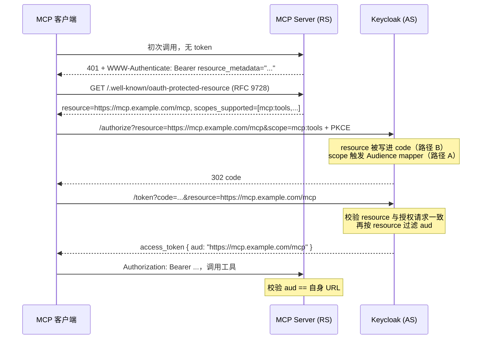

## 场景

MCP server 用 Keycloak 做授权服务器之后，接入方报的错几乎都是同一个：token 能签发、能验签、`iss` 也对，但 MCP server 返回 `401 invalid_token`，描述是「token 的 audience 不是给我的」。原因在 MCP 授权规范的一条 MUST——客户端必须在**授权请求和 token 请求**里带 `resource` 参数（[RFC 8707](https://datatracker.ietf.org/doc/html/rfc8707)），MCP server 必须校验 token 是专门为它签发的；而 Keycloak 的官方文档在 26.7.4 明确写着「Keycloak cannot recognize `resource` parameter」，MCP 2025-06-18 / 2025-11-25 / 2026-07-28 三个版本都被标为 *Partially Supported without Resource Indicators*。

也就是说：客户端一定会带 `resource`，Keycloak 默认**静默忽略**它，既不报错也不按它设置 `aud`。这一篇文章讲清两件事——怎么在官方推荐路径下把 `aud` 绑对，以及 26.6.0 起已进入发布版、但仍属实验特性的 resource indicators，在源码层面到底做了什么、什么情况下会把已经能跑的客户端打断。

结论先说：**Keycloak 的实验实现是「过滤」aud，不是「添加」aud。** 如果 token 里本来没有目标资源的标识，`resource` 不会帮你补上，而是直接返回 `invalid_target`。理解这一点，能省掉一轮线上排错。

## 适用与不适用

| 场景 | 是否适用 | 说明 |
|---|---|---|
| MCP server 放在 Keycloak 后面，客户端是 VS Code / Claude Code / MCP Inspector | ✅ | 需要 CIMD（`client_id` 是 URL）或 DCR 注册客户端 |
| 一个 realm 里有多台 MCP server，同一个 agent 客户端要分别取 token | ✅ | aud 收敛为单值是这套机制的核心价值，跨 server 重放会被拒 |
| 只需要给单台 server 发 token，且不想开实验特性 | ✅（走官方 scope 路径） | 见下节路径 A，稳定、无需实验特性 |
| MCP 2025-03-26 及更早版本 | ❌ | 该版本不要求 `resource` 与 aud 绑定，Keycloak 文档写明 *No special setup is required* |
| 本地 stdio 传输的 MCP server | ❌ | 没有 HTTP 授权层，与本文无关 |
| 生产环境无法接受「实验特性可能破坏性变更」 | ⚠️ | 路径 A 即可满足 MCP 的 MUST/SHOULD 集合，路径 B 是增益不是前提 |

## 两条落地路径

| | 路径 A：scope 驱动（官方文档路径） | 路径 B：resource 驱动（实验特性） |
|---|---|---|
| 机制 | 用 `scope` 触发 Audience mapper，把 MCP server 的标识**追加**进 `aud` | 解析 `resource` 参数，把 `aud` **替换**成该参数对应的资源 |
| 前置配置 | client scope + Audience mapper | 在 A 的基础上，额外给 MCP server 的客户端配 `resource_url` 属性，并启用 `resource-indicators` 特性 |
| 特性开关 | 不需要 | `--features=resource-indicators`（26.7.4 为 EXPERIMENTAL） |
| token 的 `aud` | 取决于客户端请求了哪些 scope，可能是多个值 | 只剩 `resource` 对应的单值（多值会被覆盖） |
| 失败模式 | 客户端没请求 scope → `aud` 缺失 → RS 401 | `resource` 解析不到客户端 → `invalid_target`（token 根本不签发） |
| 合规状态 | 官方文档认可，但 RFC 8707 那一行仍是 Not supported | 实现已合入（[PR #46763](https://github.com/keycloak/keycloak/pull/46763)），文档未发布（[#47127](https://github.com/keycloak/keycloak/issues/47127) 仍 open） |

官方文档给出的做法是路径 A：为 MCP server 声明的每个 scope 建一个 client scope，每个 scope 里放一个 Audience mapper，*Included Custom Audience* 填 MCP server 的 URL（例如 `https://example.com/mcp`）。客户端请求哪些 scope，`aud` 里就有对应值。这条路能跑通，因为 MCP 客户端会从 RFC 9728 Protected Resource Metadata 里读取 `scopes_supported` 并请求这些 scope——**如果 MCP server 没在元数据里声明 scope，客户端就不会请求，mapper 也就不会触发**，这是路径 A 最常见的哑火原因。

## 完整链路



几个容易看错的地方：

1. `resource` 在授权请求和 token 请求里都要带，且**值必须完全相同**。Keycloak 把授权请求里的 `resource` 写进授权码，token 阶段会比对；不一致直接 `invalid_target: The requested resource is not matching the original request.`
2. token 请求可以省略 `resource`——此时 Keycloak 用授权请求里的原值（源码里 `requestedResource == null` 时会回填 `originalResourceParam`）。反过来，授权请求没带、token 请求带了，一定会失败。
3. `resource` 的值是**字符串精确比较**，不做 URL 归一化。客户端 SDK 对 URL 做序列化时可能补上根路径：`new URL('https://mcp.example.com').href` 在 Node 里等于 `https://mcp.example.com/`。配置侧写的是不带斜杠的那个，就会一路 `invalid_target`。
4. 该填哪个字符串，由 MCP 规范定义：`resource` 必须是 MCP server 的 canonical URI（RFC 8707 §2 的服务标识），并且要与 MCP server 在 RFC 9728 元数据里声明的 `resource` 字段一致。同一台 server 的 `https://mcp.example.com` 与 `https://mcp.example.com/mcp` 是两个不同的资源标识，权威来源是元数据文档，不是你的直觉。配置 mapper 之前先把那个值抄下来。

## 最小配置

### 1. Audience mapper：两条路径都要

```bash
REALM=myrealm
KCADM=/path/to/kcadm.sh

# 建一个 optional client scope，名字与 MCP server 在 Protected Resource Metadata 里声明的 scope 一致
$KCADM create client-scopes -r "$REALM" \
  -s name=mcp:tools -s protocol=openid-connect \
  -s 'attributes."include.in.token.scope"=true'

# 取 scope id，加 Audience mapper
SCOPE_ID=$($KCADM get client-scopes -r "$REALM" -q name=mcp:tools --fields id --format csv --noquotes)

# 路径 A：Included Custom Audience 填 MCP server 的 URL
$KCADM create "client-scopes/$SCOPE_ID/protocol-mappers/models" -r "$REALM" \
  -s name=mcp-audience -s protocol=openid-connect \
  -s protocolMapper=oidc-audience-mapper \
  -s 'config."included.custom.audience"=https://mcp.example.com/mcp' \
  -s 'config."access.token.claim"=true' \
  -s 'config."id.token.claim"=false'
```

`included.client.audience` 与 `included.custom.audience` 的互斥与追加语义见 [Spring Boot 3 资源服务器接入 Keycloak]()，这里不重复。最后把这个 client scope 挂到 MCP 客户端上（默认或可选），并用 Evaluate 页确认 `aud` 真的出现在 access token 里。

### 2. 路径 B 追加：客户端属性 `resource_url`

```bash
CLIENT_UUID=$($KCADM get clients -r "$REALM" -q clientId=mcp-server --fields id --format csv --noquotes)

# MCP server 作为一个客户端存在，resource_url 指向它对外暴露的 URL
$KCADM update "clients/$CLIENT_UUID" -r "$REALM" \
  -s 'attributes."resource_url"=https://mcp.example.com/mcp'
```

**这里有一个必须同步改的地方**：路径 A 的 mapper 填的是 URL（`included.custom.audience=https://mcp.example.com/mcp`），而路径 B 的过滤逻辑要求 token 里初始的 `aud` 里含**能被查成客户端的 clientId**。源码是这么找的：

```java
// ResourceIndicatorsPostProcessor.findAudienceByClientAttribute
for (String a : audience) {
    ClientModel client = session.clients().getClientByClientId(realm, a);
    if (client != null && resource.equals(client.getAttribute("resource_url"))) {
        return resource;   // 命中后 aud 被替换成 resource
    }
}
return null;               // → invalid_target
```

也就是说，只把 mapper 的 *Included Custom Audience* 写成 URL 的话，`getClientByClientId("https://mcp.example.com/mcp")` 查不到客户端，过滤必然失败。开启特性前要把 mapper 改成 *Included Client Audience* = `mcp-server`（或同时保留一个），让 `aud` 初始值就是那个 clientId，再由 post processor 替换成 URL。

还有一条更省的等价写法：`resource` 用 `urn:client:mcp-server`，此时不需要配 `resource_url`，只要 `aud` 里含 `mcp-server` 即可。它适合非 MCP 的自定义资源；对 MCP 场景不适用，因为规范要求 `resource` 就是 MCP server 的 URL。

### 3. 开启特性

```bash
# 通用特性文档的写法（build 阶段）
bin/kc.sh build --features=resource-indicators

# MCP 指南里的写法（start 阶段，CIMD 用了同样的形式）
bin/kc.sh start --features=resource-indicators

# 容器镜像
# env: KC_FEATURES=resource-indicators
```

`client-id-metadata-document`（CIMD）与 `resource-indicators` 都不在[官方特性列表](https://www.keycloak.org/server/features)的 supported / preview / deprecated 三类里——那份列表没有 Experimental 分类。启用它们意味着不享受任何兼容性承诺：升一个小版本就可能改行为。`Profile.Feature.RESOURCE_INDICATORS` 在 26.7.4 的类型正是 `EXPERIMENTAL`。

### 4. CIMD：让 VS Code / Claude Code 能登录

VS Code 与 Claude Code 桌面版发的 `client_id` 是一个 URL（`https://vscode.dev/oauth/client-metadata.json`、`https://claude.ai/oauth/claude-code-client-metadata`）。Keycloak 默认不处理这种 `client_id`，需要开启 `--features=cimd`，再配一套 Client Policies：

| 配置项 | VS Code desktop | Claude Code desktop |
|---|---|---|
| Profile executor | `client-id-metadata-document` | 同左 |
| Allow http scheme | OFF | OFF |
| Trusted domains | `vscode.dev`, `code.visualstudio.com`, `127.0.0.1` | `claude.ai`, `localhost`, `127.0.0.1` |
| Restrict same domain | **OFF** | **OFF** |
| Only Allow Confidential Client | OFF（public client + PKCE） | OFF（public client + PKCE） |
| Policy condition | `client-id-uri`，scheme `https`，domains `vscode.dev` | `client-id-uri`，scheme `https`，domains `claude.ai` |

两个容易踩的点：*Trusted domains* 不只约束 `client_id` URL，也约束元数据里所有 URL 类型属性——VS Code 的元数据带一个指向 `code.visualstudio.com` 的 `logo_uri`，漏掉这个域就会加载失败；*Restrict same domain* 必须关，因为两个客户端都用 `127.0.0.1` / `localhost` 回调，与 `client_id` 域不同源。

CIMD 的缓存与体积限制只能通过 SPI 选项配置，Admin Console 里没有：`--spi-client-policy-executor--client-id-metadata-document--{min-cache-time|max-cache-time|upper-limit-metadata-bytes}`，默认 300 秒 / 259200 秒 / 5000 字节。

## 验证

**1. 解 token 看 `aud`**：路径 A 下 `aud` 与 mapper 配置一致；路径 B 下应只剩 `resource` 的单值，且 `azp` 是 MCP 客户端。

**2. 负向验证（这一步才是关键）**：换一个不存在的资源取 token——`resource=https://other.example.com/mcp`。正确行为是返回 `invalid_target`，而**不是**签发一个 `aud` 仍然指向旧 server 的 token。如果拿到的是后者，说明特性没生效，`resource` 被忽略了。

**3. 刷新链路**：`resource` 会被写进 refresh token；刷新时带相同值 → 新 token 的 `aud` 不变；刷新时换成一个不同的值 → `invalid_target`。客户端 SDK 在刷新时丢掉 `resource` 是安全的（Keycloak 回填原值），但**授权时没带、刷新时带上**会失败。

**4. 校验规则实测**：`ResourceIndicatorValidation.isValidResourceIndicator()` 决定 `resource` 格式是否合法，不合法直接 `invalid_target: The requested resource is invalid, missing, unknown, or malformed.`。把 26.7.4 的该类原样复制出来跑一遍，结果如下（`javac ResourceIndicatorValidation.java && java ResourceIndicatorValidation`）：

| `resource` 取值 | 是否通过 | 说明 |
|---|---|---|
| `https://mcp.example.com/mcp` | ✅ | 常规形态 |
| `https://mcp.example.com/mcp/` | ✅ | 末尾斜杠是**另一个**合法值，不自动等价 |
| `https://mcp.example.com/` | ✅ | |
| `https://mcp.example.com` | ✅ | 无路径也放行：Java 的 `URI.getPath()` 返回空串而非 `null`，`getPath() == null` 分支对层次 URI 不会命中 |
| `http://mcp.example.com/mcp` | ✅ | **不限制 scheme**，https 要求不在 Keycloak 这一层 |
| `ftp://mcp.example.com/mcp` | ✅ | 同上 |
| `https://mcp.example.com/mcp?tenant=a` | ❌ | 含 query 被拒（RFC 8707 只要求 SHOULD NOT） |
| `https://mcp.example.com/mcp#frag` | ❌ | 含 fragment 被拒 |
| `mcp.example.com/mcp`、`/mcp` | ❌ | 必须是绝对 URI |
| `urn:client:mcp-server` | ✅ | 客户端 URN 形态 |
| `urn:CLIENT:Mcp-Server` | ✅ | 正则带 `CASE_INSENSITIVE`，但下游 `startsWith("urn:client:")` 是大小写敏感的——**校验通过不代表会被识别为客户端 URN** |
| `urn:example:rootgroup/subgroup` | ❌ | NSS 里的 `/` 被拒；按 RFC 8141 它应合法，见 [#52324](https://github.com/keycloak/keycloak/issues/52324) |
| `urn:example:foo~bar`、`urn:example:foo&bar` | ❌ | `~` 与 `&` 不在字符集内，同样是比 RFC 更严的地方 |
| `urn:a:b` | ✅ | 单字符 NID 被接受（RFC 8141 要求至少两个字符） |

这张表的价值在于：**校验规则比 RFC 严的地方和比 RFC 松的地方同时存在**，而客户端发过来的值是 SDK 拼的。排错时不要假设「URL 看着对就是对的」，直接拿实际请求里的字符串比对。

## 常见错误表

| 症状 | 根因 | 修复 |
|---|---|---|
| RS 返回 `401 invalid_token`，`aud` 与自身 URL 不符 | 路径 A 下客户端没请求对应的 scope（MCP server 未在 RFC 9728 元数据里声明），mapper 未触发 | 在 MCP server 的 `scopes_supported` 里声明 scope，并确认客户端请求了它 |
| 开启了 `resource-indicators` 后所有 MCP 客户端立刻 `invalid_target` | token 初始 `aud` 里是 URL 而非 clientId，或 MCP server 客户端没配 `resource_url` | mapper 改成 *Included Client Audience*；给客户端补 `attributes."resource_url"`；紧急回滚见下节 |
| `invalid_target: The requested resource is not matching the original request.` | 授权请求没带 `resource`，token 请求带了；或刷新时换了 `resource` | 两个请求都带完全相同的值；刷新沿用授权时的值 |
| `invalid_target: The requested resource is invalid, missing, unknown, or malformed.` | 值里含 query / fragment、不是绝对 URI、URN 里含 `/`，或客户端查不到 | 对照上表核对字符串；确认客户端存在且 `resource_url` 精确相等 |
| 直接访问 MCP server 报 401，但 token 在 jwt.io 解出来一切正常 | RS 只校验签名与 `iss`，没校验 `aud` | RS 侧必须校验 `aud` 等于自身 URL——这正是 MCP 规范里的 MUST |
| VS Code 登录时 Keycloak 报客户端未找到 | 未开 `cimd` 特性，或 `client-id-uri` 条件里没放 `vscode.dev` | 开 `KC_FEATURES=cimd`，补齐 policy 条件与 profile executor |
| CIMD 元数据加载失败 | Trusted domains 漏了元数据里的 `logo_uri` 域（VS Code 是 `code.visualstudio.com`） | 把该域加进 executor 的 Trusted domains |
| CIMD 请求被拒，日志提示重定向域不匹配 | executor 的 *Restrict same domain* 是 ON，而回调在 localhost | 设为 OFF（两个桌面客户端都是 localhost 回调） |
| MCP Inspector 注册客户端失败 | Client Registration 的匿名访问策略没放行 | Allowed Client Scopes / Allowed Registration Web Origins / Trusted Hosts 三项都要配 |

## 回滚

1. **最优先、最安全的回滚是关掉特性**：去掉 `--features=resource-indicators`（或 `KC_FEATURES` 里的对应项）即回到「忽略 `resource`」的行为，客户端不再因为 `resource` 解析失败而拿不到 token。代价是失去按请求收窄 aud 的能力，RS 侧必须回到路径 A 的 scope 校验。
2. **`resource_url` 不要单独删**。删掉它但保持特性开启，会让本来能过过滤的客户端变成 `invalid_target`。要么两者一起回滚，要么先改 mapper 再改属性。
3. **切换路径的顺序**：先加 mapper 让 `aud` 正确（这一步对现有客户端无影响）→ 再启用特性 → 用负向验证确认过滤生效 → 全量回归 MCP 客户端。任何一步出问题都能退回上一步，不要把 mapper 改动和特性开关压在同一个发布里。
4. **CIMD 回滚**：关掉 `cimd` 特性后，URL 形式的 `client_id` 立即不被接受，VS Code / Claude Code 会退回到「注册客户端」路径（如果它支持）或直接不可用。回滚前先确认真有替代注册方式。
5. **升级风险**：这两个特性都属于实验状态，且官方已计划在 26.8 补齐 RFC 8707 的正式支持（Keycloak 的 MCP 文档跟踪 issue 仍在更新）。升级前应把「MCP 客户端能否取到 token」作为回归用例，而不是只看版本号。

## IAM FAQ

### MCP 授权为什么一定要做 audience 绑定？

一个 agent 客户端可以同时持有访问多台 MCP server 的 token。如果 token 的 `aud` 不能区分目标，任何一台 server 拿到泄露的 token 都能拿去打另一台——这是标准的 token 混用（token confusion）面。RFC 8707 的 `resource` 参数就是让**客户端声明**自己要访问哪个资源，AS 据此把 token 的受众收窄到单值。MCP 规范把它列为 MUST，是因为 agent 生态里「一个客户端多台资源」是默认形态，而不是例外。相关的令牌换手与外泄场景见 [Keycloak Token Exchange 实战]()——那里同样是「audience 只能收窄、不能放宽」的语义。

### Keycloak 到底支持不支持 RFC 8707？

分三层回答，混在一起说就是误导：

1. **官方文档**：26.7.4 的 MCP 指南里，RFC 8707 一行的状态是 *Not supported*，并明确写「Keycloak cannot recognize `resource` parameter」。
2. **实现**：`Initial experimental support for Resource Indicators`（[PR #46763](https://github.com/keycloak/keycloak/pull/46763)，2026-03-17 合入）已经进入发布版——26.6.0 起就能看到完整的 `org.keycloak.protocol.oidc.resourceindicators` 包，26.7.4 里 `Profile.Feature.RESOURCE_INDICATORS` 的类型是 `EXPERIMENTAL`。
3. **文档缺口**：配套文档 issue（[#47127](https://github.com/keycloak/keycloak/issues/47127)）仍未关闭，所以官方站点上的一致性说明还没出现。

结论：可以试，但要按实验特性对待——默认关闭、明文标注可能破坏性变更、不写进长期架构假设。

### 为什么开启了特性之后，反而有客户端报 `invalid_target`？

因为实现是**过滤**而不是**添加**：`ResourceIndicatorsPostProcessor` 只会在 token 已有的 `aud` 里找出与 `resource` 对应的那一个，然后把 `aud` 替换掉；找不到就抛 `invalid_target`，连 token 都不签发。默认路径下 `aud` 来自 Audience mapper 的 *Included Custom Audience*（一个 URL 字符串），它不是任何客户端的 clientId，查不到客户端，于是从「能跑但 aud 靠 scope 撑着」直接变成「取不到 token」。这是从路径 A 迁到路径 B 时唯一必须同步修改的配置。

### 一个 realm 里有多台 MCP server，怎么做资源隔离？

每台 server 一个客户端、一个 `resource_url`、一个自己的 scope 组；客户端按需请求对应 scope。关键收益是路径 B 下 token 的 `aud` 会被收敛为**单值**，即使某个客户端的 token 泄露，也无法拿去访问另一台 MCP server。审计上建议让 MCP server 用独立的客户端条目而不是复用登录客户端——`azp` 与 `aud` 的存在感都依赖这一点，具体取舍可参考 [IAM 最小权限落地指南]()。

## 延伸阅读

- [Integrating with Model Context Protocol (MCP) — Keycloak](https://www.keycloak.org/securing-apps/mcp-authz-server)：官方支持矩阵（RFC 8707 为 Not supported）、scope + Audience mapper 的稳定路径、CIMD 的 executor/policy 配置与 VS Code、Claude Code 对接步骤
- [Enabling and disabling features — Keycloak](https://www.keycloak.org/server/features)：`--features` / `--feature-<name>=enabled` 的写法、supported 与 preview 清单（`resource-indicators`、`cimd` 均不在其中）
- [MCP 授权规范](https://modelcontextprotocol.io/specification/2025-06-18/basic/authorization)：`resource` 参数 MUST 出现在授权请求与 token 请求、MCP server MUST 校验受众
- [RFC 8707 Resource Indicators for OAuth 2.0](https://datatracker.ietf.org/doc/html/rfc8707)、[RFC 9728 OAuth 2.0 Protected Resource Metadata](https://datatracker.ietf.org/doc/html/rfc9728)
- 源码（26.7.4 tag）：[ResourceIndicatorsPostProcessor.java](https://github.com/keycloak/keycloak/blob/26.7.4/services/src/main/java/org/keycloak/protocol/oidc/resourceindicators/ResourceIndicatorsPostProcessor.java)、[ResourceIndicatorValidation.java](https://github.com/keycloak/keycloak/blob/26.7.4/services/src/main/java/org/keycloak/protocol/oidc/resourceindicators/ResourceIndicatorValidation.java)、[Profile.java](https://github.com/keycloak/keycloak/blob/26.7.4/common/src/main/java/org/keycloak/common/Profile.java)
- GitHub 跟踪项：[PR #46763](https://github.com/keycloak/keycloak/pull/46763)（初始实验实现）、[#47117](https://github.com/keycloak/keycloak/issues/47117)（实验特性跟踪）、[#47121](https://github.com/keycloak/keycloak/issues/47121)（客户端级开关）、[#52324](https://github.com/keycloak/keycloak/issues/52324)（URN 校验与 RFC 8141 的偏差）、[#35743](https://github.com/keycloak/keycloak/discussions/35743)（`resource` → `aud` 映射的原始讨论）
- 站内：[OAuth 2.1 相比 OAuth 2.0 的变化]()、[Spring Boot 3 资源服务器接入 Keycloak]()
