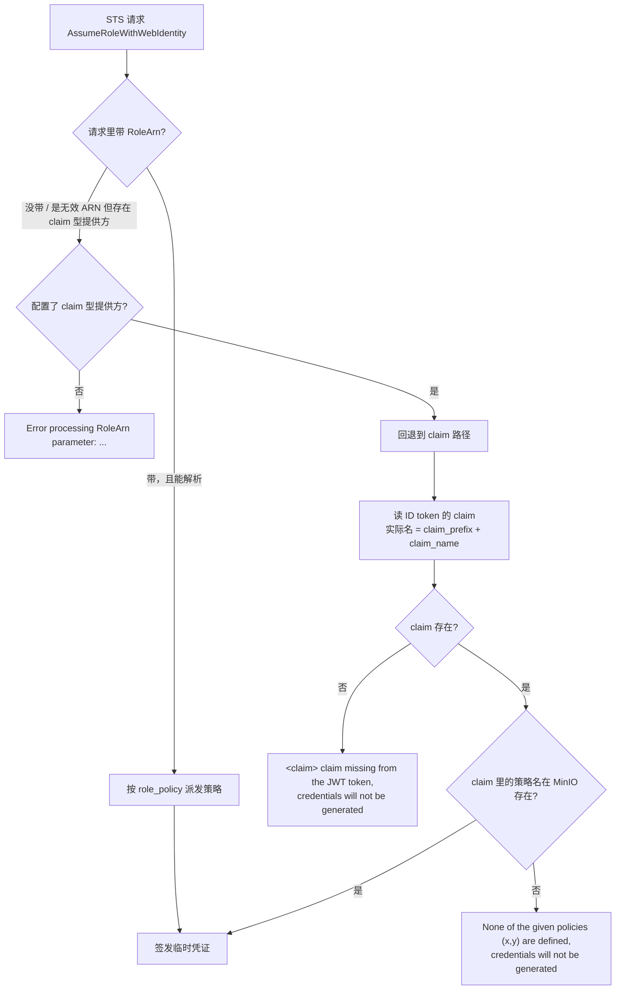

MinIO 的 OIDC 接入和其他应用不太一样：它不做角色映射，也不认 `groups`，只认**一个 claim**，把这个 claim 的值当成 MinIO 自己的策略名列表去比对。登录成功但拿不到权限，绝大多数情况不是「配置没生效」，而是这个 claim 没出现在 MinIO 真正读取的位置上。

本文给出可复制的最小配置，并解释三处最容易踩的地方：claim 只从 ID token 读、`claim_prefix` 即使已废弃仍会改变实际查找的 claim 名、`role_policy` 与 `claim_name` 的互斥边界。

配置与行为核对自 MinIO 官方 OpenID 设置参考与 Keycloak 对接流程，`minio/minio` master 分支源码（`internal/config/identity/openid/{openid.go,help.go,jwt.go,providercfg.go,provider/keycloak.go}`、`cmd/sts-handlers.go`、`cmd/utils.go`、`internal/config/identity/openid/openid.go`）与 `minio/pkg/v3/policy/policy.go`；核查日期 2026-10-03。

## 适用 / 不适用

| 场景 | 是否适用 |
|------|----------|
| 自建 MinIO（单机或分布式），控制台要接公司账号 | ✅ 原生 OIDC，不需要前置认证代理 |
| 程序用 `AssumeRoleWithWebIdentity` 换临时凭证 | ✅ 与控制台共用同一条 claim 判定路径 |
| 所有 SSO 用户给同一套策略 | ✅ 用 `role_policy`，Keycloak 侧不需要配任何 claim |
| 按人、按组给不同的 bucket 权限 | ✅ 用 `claim_name`，但要在 Keycloak 上把组属性聚合出来，见第 2 节 |
| 上游只有 SAML 或 LDAP | ⚠️ MinIO 只实现 OIDC。先用 Keycloak 的身份代理把上游统一成 OIDC：[LDAP / AD 用户联邦]()、[Keycloak 作为 SAML IdP 接入应用]() |
| 直接把 Keycloak 的 `groups` / `realm_access.roles` 当权限用 | ❌ MinIO 不读这两个 claim，只读 `claim_name` 指定的那一个 |
| 一台 MinIO 同时接多个「按用户 claim 授权」的 IdP | ❌ 源码里明确不支持（见第 1 节），只能有一个 claim 型提供方 |

## 1. 先弄清 MinIO 怎么决定权限

MinIO 的授权只有两条路，互斥：

| 需求 | 用哪个 | Keycloak 侧工作量 |
|------|--------|------------------|
| 所有 SSO 用户同一套权限 | `role_policy`（在 MinIO 配置里写死策略名列表） | 零，不需要任何 mapper |
| 每人/每组不同权限 | `claim_name`（默认 `policy`），claim 的值 = MinIO 策略名 | 需要 client scope + mapper + 用户属性 |

`role_policy` 和 `claim_name` 不能同时配。源码里的冲突校验带一个容易被忽略的条件（`internal/config/identity/openid/openid.go`）：

```go
if p.ClaimName != policy.PolicyName && p.RolePolicy != "" {
    return c, config.Errorf("Role Policy (=`%s`) and Claim Name (=`%s`) cannot both be set", p.RolePolicy, p.ClaimName)
}
```

也就是说：**只有在 `claim_name` 被显式改成非默认值时才会报冲突**。`claim_name` 留空（内部默认 `policy`）同时设 `role_policy`，是合法的——这正好对应「我用 role_policy，但配置模板里那行 `claim_name=policy` 我没删」这种情况，它不会报错，也不会按 claim 授权。

判定顺序可以从 `cmd/sts-handlers.go` 读出来：



三条附带结论：

- **无效 RoleArn 会被静默降级**。AWS SDK / CLI 有些客户端不允许 `AssumeRoleWithWebIdentity` 不带 RoleARN，源码注释写得很直白：当存在 claim 型提供方时，无法识别的 RoleArn 会被当成「没传 RoleArn」，以便这些客户端随便填一个 ARN。而在**只有 role_policy 型提供方**时，无效 RoleArn 是硬错误，报 `Error processing RoleArn parameter: ...`。这条差异能解释「同一个脚本换个 MinIO 就报 ARN 错」。
- **claim 型提供方全实例只能有一个**。源码注释：*we do not support multiple claim based IDPs, as there is no defined parameter to disambiguate the intended IDP in this STS request*。多命名提供方（`_PARTNERS` 之类）只对 `role_policy` 型有意义。
- **claim 名不是 `claim_name` 一个人决定的**。STS 侧实际用的是（`internal/config/identity/openid/openid.go`）：

```go
func (r *Config) GetIAMPolicyClaimName() string {
    pCfg, ok := r.arnProviderCfgsMap[DummyRoleARN]
    if !ok {
        return ""
    }
    return pCfg.ClaimPrefix + pCfg.ClaimName   // ← 前缀会被拼上
}
```

`claim_prefix` 在 `help.go` 里已标 `[DEPRECATED use 'claim_name']`、在 `openid.go` 里被归入 *Removed params*，**但拼接逻辑还在**。所以从旧教程抄来的 `claim_prefix="customer1/"` 会让 MinIO 去找 `customer1/policy` 这个 claim。Keycloak 的 mapper 输出的是 `policy`，于是 STS 报 `customer1/policy claim missing from the JWT token`——报错里带着前缀，就是这条路径的直接证据。新配置里不要再写 `claim_prefix`。

### claim 从哪里读：只读 ID token

这是 MinIO 与 Harbor、GitLab 这类应用最大的区别。官方文档的原话是 *MinIO looks for a specific claim in the id_token (JWT)*，对应源码 `internal/config/identity/openid/jwt.go`：先用 ID token 组 claims，只有在 `claim_userinfo=on` 时才去 UserInfo 端点补，而且**只补缺、不覆盖**：

```go
if ok && pCfg.ClaimUserinfo {
    ...
    uclaims, err := pCfg.UserInfo(ctx, accessToken, r.transport)
    ...
    for k, v := range uclaims {
        if _, ok := claims[k]; !ok { // only add to claims not update it.
            claims[k] = v
        }
    }
}
```

两个直接推论：

1. Keycloak mapper 的 **Add to ID token** 必须是 `On`。关掉它、只往 access token 加 claim，MinIO 一定读不到——access token 里有没有这个 claim 对 MinIO 无用。
2. 对 Keycloak **不需要**开 `claim_userinfo`。ID token 里已经有 claim 时它什么也不做，还多一次网络调用；一旦请求里没有 access token，直接报 `access_token is mandatory if user_info claim is enabled`。这个开关是给「组信息只暴露在 UserInfo 端点」的 IdP（例如 GitLab）准备的。

## 2. Keycloak 端最小配置

MinIO 官方 Keycloak 指南走的是「用户属性 + mapper」：在用户（或组）的 Attributes 里写 `policy`，再建一个 User Attribute mapper 把它输出成 `policy` claim。下面的做法把同一个 mapper 放进独立的 client scope，好处是这段映射能被多个 client 复用、也能只在被请求时执行；只接一个应用时，按官方那样直接挂在 client 的 Mappers 上更省事。

**第一步：建 client scope**（例如 `minio-authorization`），**Include in token scope** 打开。

**第二步：在 scope 里建 mapper**：

| 字段 | 值 |
|------|-----|
| Mapper Type | `User Attribute` |
| User Attribute | `policy` |
| Token Claim Name | `policy` |
| **Add to ID token** | **`On`** |
| Claim JSON Type | `String` |
| Multivalued | `On` |
| Aggregate attribute values | `On`（让用户继承所属组上设置的策略） |

**第三步：把该 client scope 分配给 MinIO client，Assigned type 选 `default`。**

这一步的选型不是随便挑的。Keycloak 的 client scope 分 default 和 optional：default 每次发 token 都执行，optional 只有被请求时才执行。MinIO 的 `scopes` 配置是「我请求哪些 scope」，所以：

- 选 `default` → 不依赖 `scopes`，最稳，官方流程这么给。
- 选 `optional` → 必须把 scope 名（如 `minio-authorization`）加进 MinIO 的 `scopes` 里，否则 mapper 不执行、claim 不出现。旧文档里 `scopes="openid,policy_role_attribute"` 那种写法就是这种可选 scope 的用法，别只抄一半。

官方指南里还留了另一条更省事的路：不建 mapper，直接把 `claim_name` 设成 `groups`，再在 MinIO 里创建与 Keycloak 组名同名的策略。它能省掉 mapper，但有两个前提要先接受：Keycloak 默认**不会**把 `groups` 放进 ID token，仍需要一个 Group Membership mapper 才会出现；而组名必须与 MinIO 策略名逐字符相同，组一旦改名就等于权限重建。组名里的 `/` 也要一起固化——Group Membership mapper 默认输出完整路径（`/platform/ops`），策略名就得写成带斜杠的形式，否则同样对不上。组结构会频繁调整时，这条路的维护成本很快就超过一个 mapper。

**第四步：给用户或组加属性** `policy`，值就是 MinIO 里已存在的策略名。多策略用逗号分隔写在一个属性里即可（原因见下）。

**第五步：MinIO client 本体**：`confidential` + Client authentication `On`，Valid redirect URIs 至少包含 `https://minio.example.com/oauth_callback`（地址由 MinIO 侧 `MINIO_BROWSER_REDIRECT_URL` 决定），Web origins 填控制台域名。

### 策略名的取值格式

`minio/pkg/v3/policy/policy.go` 的 `GetValuesFromClaims` 接受三种格式，注释写得很清楚：*string / comma separated values / string array*。所以「Multivalued 到底开不开」不是生死问题——`"s3-read,s3-write"` 和 `["s3-read","s3-write"]` 等价。差别只在：

- Multivalued `Off`：一个用户只能有一个属性值，但值里可以塞多个逗号分隔的策略。
- Multivalued `On`：属性本身可以多值，配合 **Aggregate attribute values** 才能把组上的策略继承过来。

一个静默坑：数组元素如果不是字符串（数字、布尔、null），会被**跳过而不是报错**，解析结果里少一个策略名。claim 里出现 `None of the given policies` 而你在 Keycloak 里明明写对了时，先把 ID token 解出来看值的类型。

## 3. MinIO 端最小配置

环境变量形式（推荐，重启即生效，不会因为配置命令写错而部分落地）：

```bash
export MINIO_IDENTITY_OPENID_CONFIG_URL="https://kc.example.com/realms/myrealm/.well-known/openid-configuration"
export MINIO_IDENTITY_OPENID_CLIENT_ID="minio"
export MINIO_IDENTITY_OPENID_CLIENT_SECRET="SECRET"
export MINIO_IDENTITY_OPENID_CLAIM_NAME="policy"
export MINIO_IDENTITY_OPENID_SCOPES="openid,profile,email"
export MINIO_IDENTITY_OPENID_VENDOR="keycloak"
export MINIO_IDENTITY_OPENID_KEYCLOAK_REALM="myrealm"
export MINIO_IDENTITY_OPENID_KEYCLOAK_ADMIN_URL="https://kc.example.com/admin/"
export MINIO_BROWSER_REDIRECT_URL="https://minio.example.com"
export MINIO_IDENTITY_OPENID_REDIRECT_URI_DYNAMIC="on"
```

`mc` 形式（等效，注意新版是 `mc idp openid`，`mc admin config set identity_openid` 是旧入口）：

```bash
mc idp openid add myminio \
  config_url="https://kc.example.com/realms/myrealm/.well-known/openid-configuration" \
  client_id="minio" \
  client_secret="SECRET" \
  claim_name="policy" \
  scopes="openid,profile,email" \
  vendor="keycloak" \
  keycloak_realm="myrealm" \
  keycloak_admin_url="https://kc.example.com/admin/"
mc admin service restart myminio
```

逐条说明几个不直观的：

- **`config_url` 用 realm 级 discovery 文档**（`/realms/myrealm/.well-known/openid-configuration`）。MinIO 会解析它拿到 `jwks_uri` 与 `userinfo_endpoint`，地址写错就是启动即失败，不会静默降级。
- **`scopes` 是替换而不是追加**。源码：`p.DiscoveryDoc.ScopesSupported = scopes`。写 `scopes="openid,profile"` 就真的只剩这两个，发现文档里原有的 `offline_access` 之类全被丢掉；列表里出现空元素（如 `openid,,email`）会直接报 `empty scope value is not allowed`，完全不写这项才沿用发现文档的 scopes。上面特意把 `email` 留在里面，是为了控制台能显示用户邮箱。
- **`redirect_uri` 这个配置键已废弃**，官方 help 指向环境变量 `MINIO_BROWSER_REDIRECT_URL`。控制台登录回调地址由它决定，多副本 + LB 必须显式设置，否则回调地址会按节点主机名拼。
- **`redirect_uri_dynamic` 默认 `off`**。LB 走轮询时，MinIO 用「发起请求的节点主机名」拼 redirect_uri，浏览器可能被送回另一个节点，登录会断在回调上；置 `on` 改为用请求的 `Host` 头构造，这是官方给出的解法。
- **`vendor="keycloak"` 不是装饰**。help 原文：*vendor specific behavior for checking validity of temporary credentials and service accounts on MinIO*，配合 `keycloak_admin_url` + `keycloak_realm`，MinIO 会回 Keycloak Admin API 校验用户是否仍存在/有效，这样在 Keycloak 里删除或禁用用户后，已经签发的 STS 凭证不会一直可用。**`keycloak_realm` 留空时源码默认值是 `master`**（`provider.KeyCloak`），如果你建的是命名 realm 而忘了填，校验会查错 realm，且不会有明显报错。
- **`claim_prefix` 不要写**，理由见第 1 节。

## 4. 验证

不要用「能跳转到 Keycloak 登录页」当作集成完成。按下面三步收敛：

**第一步：确认 claim 真的在 ID token 里。** Keycloak Admin Console → Clients → 选中 MinIO client → Client scopes → 对该 scope 点 **Evaluate**，填入用户名，看 **Generated ID Token** 里有没有 `policy`，值的类型是字符串还是数组。这一步不经过 MinIO，能一次分清「Keycloak 没发 claim」和「MinIO 没读到 claim」。

**第二步：确认 MinIO 侧配置写对了。**

```bash
mc admin config get myminio identity_openid
```

`client_secret` 会被脱敏返回，重点看 `config_url`、`claim_name`、`scopes` 是否符合预期——特别是确认没有残留的 `claim_prefix`。

**第三步：负向验证一次。** 把某个用户的 `policy` 属性临时改成 MinIO 里不存在的策略名，用该用户登录或调 STS，应当拿到 `None of the given policies (...) are defined`。能稳定复现这条报错，说明链路是活的、判定真的走到了策略比对那一步；此时再改回正确值，才算验证完成。

## 5. 常见报错对照表

| 报错 / 症状 | 根因 | 处理 |
|-------------|------|------|
| `<claim> claim missing from the JWT token, credentials will not be generated` | ID token 里没有这个 claim。注意报错里的 `<claim>` 就是 MinIO 实际查找的名字——如果它带前缀，说明配置里有残留 `claim_prefix` | mapper 的 Add to ID token 打开；client scope 若为 optional 则要在 `scopes` 里请求它；清掉 `claim_prefix`；确认用户/组上有 `policy` 属性 |
| `None of the given policies ('x,y') are defined, credentials will not be generated`（原文里策略名两侧用的是反引号） | claim 有值，但 MinIO 策略库里没有同名策略 | `mc admin policy create` 补齐，或修正属性值；注意大小写与多余空格（值是 `TrimSpace` 后才比对的，逗号分隔不影响） |
| 请求期报 `expected policy (x) missing from the JWT claim policy, rejecting the request` | 凭证签发时策略存在，之后被删除或改名 | 恢复策略或让用户重新登录换新凭证；这条是**请求时**的告警，和签发时的报错不同源 |
| 登录后能进控制台，但任何 bucket 都是 `Access Denied` | claim 存在却是空的，或数组里的非字符串元素被静默跳过 | 用 Evaluate 页看 ID token 实际值类型 |
| Keycloak 页面报 `Invalid parameter: redirect_uri` | 回调地址不匹配：`MINIO_BROWSER_REDIRECT_URL` 未设（多副本下按节点主机名拼），或 Valid redirect URIs 少了 `/oauth_callback` | 设 `MINIO_BROWSER_REDIRECT_URL`，补齐 Valid redirect URIs，LB 轮询场景开 `redirect_uri_dynamic=on` |
| 配置加载报 `Role Policy` 与 `Claim Name` 不能同时设置（原文同时打印两个值） | `role_policy` 与**非默认的** `claim_name` 同时出现 | 只留一条路。若确实要用 role_policy，把 `claim_name` 恢复默认或删掉这一行 |
| 只有 role_policy 型提供方时，报 `Error processing RoleArn parameter: ...` | 请求带了一个无法识别的 RoleArn，且实例上没有 claim 型提供方可回退 | 用配置里对应的 RoleArn，或改成 claim 型授权 |
| 开了 `claim_userinfo` 后报 `access_token is mandatory if user_info claim is enabled` / `please specify config_url to enable fetching claims from UserInfo endpoint` | 该开关要求请求里带 access token，且必须有 `config_url` | Keycloak 场景关掉它；只为组信息只在 UserInfo 端点的 IdP 开启 |
| STS 报 `token expired` | ID token 没有 `exp`。`updateClaimsExpiry` 在 `exp` 缺失时直接返回 `ErrTokenExpired` | 使用会签发标准 `exp` 的 IdP；同时注意**请求里带 DurationSeconds 时 MinIO 会用 `now + DurationSeconds` 覆盖 `exp`**，凭证时长以 MinIO 的 STS 时长限制为准 |

## 6. 回滚

先确认 **root 账号还能登录**，再动 OIDC 配置。顺序反了会得到一个「控制台进不去、只能改环境变量」的维护窗口。

1. 备份当前配置：`mc admin config get myminio identity_openid > identity_openid.bak`（或记录环境变量文件）。
2. 关闭提供方：新版配置有显式开关，`mc admin config set myminio identity_openid enable=off`；不同版本对 `enable` 的支持不一致，**先 `mc admin config get` 确认这个键是否存在**。不存在时直接删除环境变量 / 配置块后重启 MinIO。
3. `mc admin service restart myminio`，用 root 凭证验证 S3 API 与控制台都正常。
4. 清理 Keycloak 侧：删除 MinIO client 与 `minio-authorization` client scope。它只被这一个 client 使用，删除不影响其他应用。
5. SSO 期间签发的 STS 凭证会按自身 `exp` 自然过期，不需要额外吊销；用户的 bucket 权限来自 MinIO 策略本身，回滚 OIDC 不会改动策略与数据。

## FAQ

**MinIO 能不能直接用 Keycloak 的 `groups` claim 授权？**
不能直接映射。MinIO 只读 `claim_name` 指定的那一个 claim（默认 `policy`）。要让组生效，得在 Keycloak 侧把组上的 `policy` 属性聚合进这个 claim（User Attribute mapper，Multivalued `On` + Aggregate attribute values `On`），再由 MinIO 按策略名比对。

**一个用户能同时拿到多个 MinIO 策略吗？**
能。claim 的值支持逗号分隔的单个字符串，也支持字符串数组（源码 `GetValuesFromClaims`）。前提是这些策略名都已存在于 MinIO，否则整次签发直接失败。

**MinIO 支持 SAML 吗？**
不支持，只实现 OIDC。存量 SAML 系统要走 Keycloak 的身份代理，对 MinIO 暴露 OIDC 端点；这条路径的字段对应与排错见 [Keycloak 作为 SAML IdP 接入应用]()。

**在 Keycloak 里禁用或删除用户后，MinIO 已签发的临时凭证还有效吗？**
取决于是否配了 `vendor=keycloak` + `keycloak_admin_url` + `keycloak_realm`。配了，MinIO 会回 Keycloak 校验用户有效性，凭证会被判定失效；没配，就只受 token 自身 `exp` 约束。这是「离职用户还能用旧凭证访问对象存储」这类问题的根因，值得在巡检清单里单独查一项（参考 [IAM 最小权限原则落地指南]()）。

**MinIO 控制台前面还有一层 oauth2-proxy 行不行？**
不建议叠加。MinIO 控制台自带 OIDC，再前置一个认证代理会出现两套会话与两个回调地址，排错成本远高于收益。只有目标应用完全不支持 OIDC 时才用 [Keycloak + oauth2-proxy]() 那条路。
