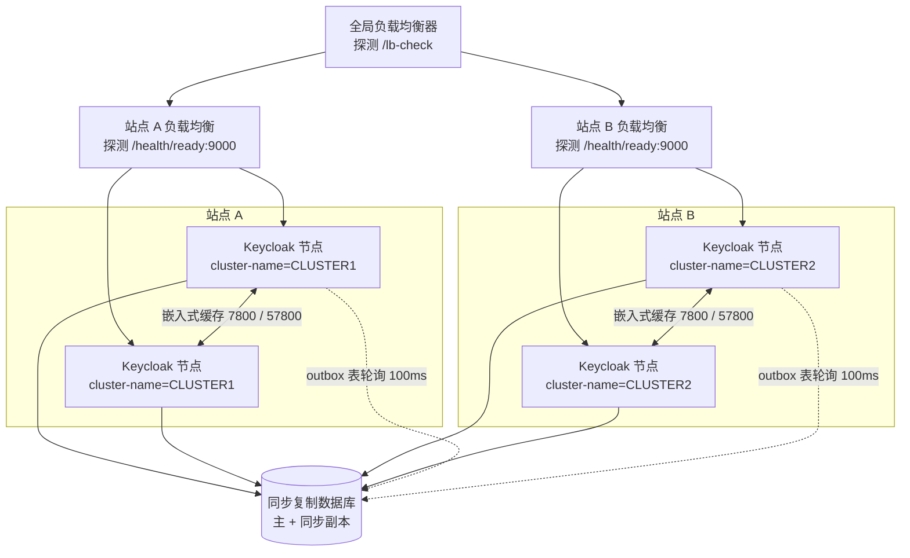

## 场景

单个 Keycloak 集群已经能做到多可用区、Pod 故障不中断，但整台 Kubernetes 控制面炸掉、机房网络被切断、云厂商单一区域长时间不可用时，这个集群仍然会整体掉线。所有依赖 SSO 的应用在同一时刻失去登录和 token 校验能力。

[Keycloak 高可用集群部署与灾难恢复]() 解决的是「集群内部不丢会话、数据可恢复」；本文解决的是再上一层的两个问题：

1. 两个机房各自跑一个独立 Keycloak 集群、共享同一份数据，怎么配才能让用户会话、realm 配置、授权数据在两个站点之间保持一致？
2. 已经有了 v1 的跨站点部署（外部 Infinispan + 围栏自动化），能不能拆掉这套复杂依赖？

**先说结论**：Keycloak 26.7 引入的 multi-cluster v2（`stateless` 特性）可以把外部 Infinispan 集群、跨站点复制、fencing 自动化和 Infinispan 专属监控全部拆掉，代价是数据库负载约翻倍。但它是 **Preview**，官方文档明确写着不在生产环境完全支持，适合在预发环境先跑通。

> **26.8.0 起这条结论要重估（2026-10-01）**：26.8.0 把 `stateless` 从 preview 转为**正式支持**（`Profile.java` 中类型为 `DISABLED_BY_DEFAULT`——已支持，但默认不启用，仍要显式 `--features=stateless`），同时把多集群 v1 的 `multi-site` 标记为弃用并计划移除，`clusterless` 也将在未来移除。也就是说「特性状态」不再是拦在生产门外的理由，真正需要论证的变成两件事：数据库能不能承受翻倍的负载，以及跨站点 commit 延迟是否稳定低于 10 ms。
>
> 同版本还把两个集群参数提升为一等 CLI 选项：`--cache-embedded-cluster-name`（环境变量 `KC_CACHE_EMBEDDED_CLUSTER_NAME`）和 `--cache-embedded-node-name`（`KC_CACHE_EMBEDDED_NODE_NAME`），取代原来的低层 SPI 属性；使用 Operator 时节点名会自动取 Pod 名，不再每次启动随机生成，指标与日志才可跨重启对齐。此外 `jdbc-ping` 会周期检查同一数据库上是否存在**不同 cluster name** 的其他 Keycloak 部署，检测到且未启用 `stateless` 时报错并把节点标记为 unhealthy——蓝绿升级若存在「两套集群短时间并存」的窗口，这段告警是预期行为。完整清单见 [Keycloak 26.8.0 升级：IAM 破坏性变更排查]()。

## 适用与不适用

| 适用 | 不适用 |
|------|--------|
| 已经完成单集群 HA，需要容忍整个 K8s 集群 / 站点故障 | 还在单节点部署阶段，先解决单集群 HA |
| 两个站点之间有稳定的低延迟网络（commit 延迟 < 10 ms 是硬要求） | 两站点延迟只有几十毫秒的跨大区部署 |
| 数据库支持同步复制且能自动切换（如 Aurora PostgreSQL 跨 AZ 同步复制） | 只有异步复制或手工主从切换的数据库 |
| 需要在预发环境验证 stateless 模式，为将来去掉外部 Infinispan 做准备 | 生产环境直接采用 Preview 特性作为唯一双活方案 |
| 有统一的、能主动探测站点健康的外部负载均衡器 | 只有 DNS 轮询、没有主动探活的入口 |

跨机房双活不是「再起一组 Pod」这么简单：**它的全部复杂度都在数据库、时钟和探活这三件事上**，配置本身反而很少。下面按这个顺序展开。

## 三种 HA 架构的分工

官方把 Keycloak 的高可用架构分成三类，先分清边界再动手，否则容易把 v1 的运维经验和 v2 混在一起。

| 架构 | 容忍的故障 | 主要代价 | 状态 |
|------|-----------|---------|------|
| 单集群（single-cluster） | Pod 故障、可用区故障（需跨 AZ 调度且满足延迟要求） | Kubernetes 集群是单点故障，控制面故障会影响全部 Pod | 支持 |
| 多集群 v1（multi-cluster v1） | 可用区故障、整个 K8s 集群故障、不透明网络（跨网段/跨云） | 每站点一套外部 Infinispan，需要外部 LB、外部围栏自动化（如 AWS Lambda）、双份控制面；**官方只测试并支持两个站点** | 支持 |
| 多集群 v2（multi-cluster v2） | 可用区故障、集群故障；不再要求外部 Infinispan | 外部 LB 仍然必需；数据库 CPU 与写入 IOPS 约翻倍；延迟和时钟要求严格 | **Preview** |

选型上有个容易被忽略的点：**如果两个站点在同一区域的多个可用区、网络是透明的，单集群跨 AZ 部署往往比多集群更划算**——没有额外 LB、没有跨站点数据同步、没有多套控制面。只有当你必须容忍「整个 K8s 集群消失」或者两个站点无法互通二层网络时，多集群才有意义。



图里的关键分工：

- **`/health/ready`（管理端口 9000）回答「这个节点能不能接流量」**，给站点内部的 LB 或 Kubernetes readiness probe 用。节点级故障由它暴露。
- **`/lb-check` 回答「这个站点整体还能不能用」**，给外部/全局 LB 用。站点级故障由它暴露。这个端点从 Keycloak 23.0.2 开始提供，实现跑在事件循环上，所以在请求队列积压、系统过载时依然能及时响应——这正是站点探活需要的行为：过载时不应该被误判为故障而把全部流量切走。
- **两个端点不能互换使用**。用 `/health/ready` 做站点级探活，会出现「站点里有一半节点挂了就把整个站点摘掉」的误判；用 `/lb-check` 做节点级就绪判断，则会把站点级故障当成单节点问题，继续把请求发给已经不能服务的节点。

## 四条硬性前提

这四条任何一条不满足，跨机房双活就不是「配置问题」而是「必然丢数据」的问题。

### 1. 数据库必须同步复制

官方要求在站点之间**同步复制**的数据库。原因是 v2 把用户会话、认证会话、action token、登录失败计数都放在数据库里，数据库成为会话状态的唯一真源。如果用的是异步复制：

- 数据库主库故障切换到副本时，尚未同步的写入会丢失——丢的就是用户会话和最近的配置变更；
- 从站点读到陈旧副本时，会出现「刚改的 client 配置在另一个站点看不到」这类不一致。

官方测试配置是 Amazon Aurora PostgreSQL 17.5，主实例在一个可用区、同步复制的读副本在第二个可用区。任何满足同步复制和延迟要求的 Keycloak 支持数据库都可以，但容灾设计要与数据库厂商确认。

### 2. commit 延迟：建议 < 5 ms，必须 < 10 ms

同步复制意味着**每次 commit 都要等主库把 WAL 写到副本**。登录、token 请求、会话写入全部是写操作，commit 延迟会直接放大成接口延迟：延迟高 → 请求排队 → 超时 → 吞吐下降。

站点内节点之间的往返延迟同样是建议 < 5 ms、必须 < 10 ms。这条要求决定了 v2 的适用范围：同城双活可以做，跨大区（几十毫秒）不要做。

### 3. 时钟必须同步

Keycloak 用时间戳判断集群成员关系、并通过数据库分发缓存失效消息。官方明确写着：**跨集群时钟偏差超过 10 秒，缓存失效消息可能投递失败，导致缓存数据陈旧**。

这不是理论风险，症状是「A 站点改了 client 的重定向地址，B 站点过了一段时间还在用旧值」，而日志里看不到任何错误。用 NTP 或等价机制保证所有 Keycloak 节点时钟一致。

### 4. 必须有主动探活的外部负载均衡器

如果没有 LB 主动探测站点健康，站点故障后流量会继续打到故障站点或分裂的分区上，直到人工介入。官方在限制章节里也承认：**在部分故障场景下仍然可能有多分钟的不可用**，Keycloak 默认约一分钟内检测到对端节点故障并通过 readiness probe 传播状态。

两种常见的 LB 拓扑：

| 拓扑 | 结构 | 优点 | 代价 |
|------|------|------|------|
| 每站点 LB + 全局 LB | 站点内 LB 探 `/health/ready`（9000），全局 LB 通过站点 LB 探 `/lb-check` | 运维隔离好：单个站点可以摘流量维护，不动全局配置 | 组件更多 |
| 单一 LB | 一个 LB 直接探所有节点的 `/health/ready` | 结构简单 | 摘站点、隔离故障要改共享组件，操作风险高 |

站点维护（数据库大版本升级、Keycloak 升级）时，v2 的做法就是**把站点从 LB 摘掉/挂回去**——不再需要 v1 里 Infinispan 的 site offline/online 流程。

## 最小配置

### Kubernetes（Operator）

```yaml
apiVersion: k8s.keycloak.org/v2beta1   # v2alpha1 已废弃但仍被服务
kind: Keycloak
metadata:
  name: keycloak
  namespace: keycloak
spec:
  instances: 3
  image: <KEYCLOAK_IMAGE>
  startOptimized: false
  hostname:
    hostname: https://sso.example.com   # 两个站点必须一致
  db:
    vendor: postgres
    url: jdbc:postgresql://<DB_HOST>:5432/keycloak
    poolMinSize: 30                     # initial/min/max 保持一致以启用语句缓存
    poolInitialSize: 30
    poolMaxSize: 30
    usernameSecret:
      name: keycloak-db-secret
      key: username
    passwordSecret:
      name: keycloak-db-secret
      key: password
  features:
    enabled:
      - stateless                       # 取代 v1 的 multi-site
  additionalOptions:
    - name: cache-embedded-cluster-name
      value: CLUSTER1                   # 每个站点唯一，不能重名
    - name: db-tls-mode
      value: verify-server
    - name: metrics-enabled
      value: "true"
  http:
    tlsSecret: keycloak-tls-secret
  truststores:
    db:
      configMap:
        name: keycloak-db-rootcert      # 数据库 CA，Operator 自动挂载
```

### 裸机 / 虚拟机

```bash
export KC_DB_USERNAME=<DB_USERNAME>
export KC_DB_PASSWORD=<DB_PASSWORD>

bin/kc.sh start \
  --db=postgres \
  --db-url=jdbc:postgresql://<DB_HOST>:5432/keycloak \
  --db-pool-initial-size=30 --db-pool-min-size=30 --db-pool-max-size=30 \
  --features=stateless \
  --cache-embedded-cluster-name=CLUSTER1 \
  --hostname=https://sso.example.com \
  --https-certificate-file=/path/to/tls.crt \
  --https-certificate-key-file=/path/to/tls.key \
  --db-tls-mode=verify-server \
  --truststore-paths=/path/to/db-ca.pem \
  --proxy-protocol-enabled=true \
  --shutdown-delay=30 \
  --health-enabled=true --metrics-enabled=true \
  --http-max-queued-requests=1000
```

几个参数不是可选项：

| 参数 | 为什么必须配 |
|------|-------------|
| `cache-embedded-cluster-name` | 跨集群缓存失效靠数据库 outbox 表分发，每个集群必须有唯一名字。启用 `stateless` 后该选项是**必填**项，且不能保持默认值 `ISPN`（26.8.0 起是一等 CLI 选项 / `KC_CACHE_EMBEDDED_CLUSTER_NAME`，取代旧的 SPI 属性 `kc.spi-cache-embedded--default--cluster-name`） |
| `db-tls-mode=verify-server` + `truststore-paths` | 数据库连接要校验服务端证书；纯测试环境可设 `disabled` 并省略 truststore |
| `proxy-protocol-enabled=true` | 让 Keycloak 从 PROXY protocol 头读取真实客户端 IP；此时 LB 要配 `send-proxy-v2`。**TLS 透传场景下不能同时设置 `proxy-headers`，两者互斥** |
| `shutdown-delay=30` | 给 LB 留出「探活失败 → 摘节点」的时间，取值应 ≥ 探活间隔 × 失败阈值 |
| `http-max-queued-requests=1000` | 过载保护：超过队列长度的请求直接返回 503，而不是无限排队拖垮整个站点 |
| `hostname` | **两个站点必须是同一个对外 URL**，否则 OIDC issuer 不一致，客户端校验 `iss` 会失败 |
| pool 三个值一致 | v2 把更多状态搬进数据库，连接池要按负载上调；initial/min/max 一致才能启用语句缓存 |

`cache-embedded-cluster-name` 的校验发生在**启动阶段**，不是运行期。启用 `stateless` 但没设该值、或者把默认值留在那里时，节点直接启动失败：

```text
Option 'cache-embedded-cluster-name' must be set to a value other than the default 'ISPN'
when the stateless feature is enabled. Each deployment sharing the same database must use
a distinct cluster name.
```

这段校验来自 Keycloak 源码的 `CachingPropertyMappers#validateClusterName`，触发条件是「`stateless` 已启用 + 嵌入式 Infinispan 参与缓存」同时成立。K8s 上表现为 Pod 反复 CrashLoopBackOff 而 CR 状态只显示未就绪——排查时应该先看容器日志，而不是先怀疑数据库。

集群内节点通信端口：**7800**（单播数据）和 **57800**（`FD_SOCK2` 故障检测，默认是 7800 + 50000 偏移）。跨站点的节点之间**不需要**互通这两个端口——它们只在同一站点的节点之间使用。

## 跨集群缓存失效怎么工作

这是 v2 与 v1 最大的实现差异，直接决定了你会看到哪些「奇怪现象」。

- 每个 Keycloak 集群仍在**本地嵌入式缓存**里缓存高频读取的 realm、client、group、授权数据。
- **集群内部**的缓存失效继续走 `work` 缓存。
- **跨集群**的缓存失效改为通过数据库的 **outbox 表**分发（26.7 的表名是 `OUTBOX_ENTRY`）：修改方把失效消息写入队列表，其他站点按轮询间隔（默认 100 ms）拉取。
- 修改方会等待 5 个轮询周期，确认对端已消费消息后才返回给调用者。因此**修改 realm 相关数据的接口会额外多出最多约 100 ms 的延迟**。

由此产生三个运维约束：

1. **修改 realm/client 配置的接口变慢是预期行为**，不是性能故障。做大批量 realm 变更（例如一次导入几千个 client）时，官方建议先只留一个集群在线，改完再把其他集群拉起来。
2. **失效消息最多排队 60 秒**，这与集群成员机制一致——成员信息每 30–45 秒写一次数据库。
3. **数据库连接中断期间会漏掉失效消息**。恢复连接后 Keycloak 会自动清空本地缓存；兜底机制是 realm 缓存默认 1 小时后过期，下次需要时重新从数据库拉取。

## 从 multi-cluster v1 迁移到 v2

如果已经跑着 v1，迁移的收益很直接：**外部 Infinispan 集群、跨站点复制、凭据与 TLS secret、围栏自动化（如 AWS Lambda）、Infinispan 专属监控和告警全部可以删掉**。

| 组件 | v2 中的处理 |
|------|------------|
| 外部 Infinispan 集群 | 删除。认证会话、action token、登录失败计数改存数据库 |
| Infinispan 跨站点复制 | 删除。跨站点数据全部由数据库承担 |
| `remote-store-secret`、`ispn-xsite-sa-token`、`xsite-keystore-secret`、`xsite-truststore-secret`、`xsite-token-secret` | 删除 |
| 围栏自动化（AWS Lambda + AlertmanagerConfig / PrometheusRule + SNS / IAM） | 删除。v2 不再需要 split-brain 围栏 |
| Infinispan 监控与 Grafana 面板 | 删除 |
| 数据库 | 保留。**预留约两倍的 CPU 与写入 IOPS**，并相应调整实例规格、存储 IOPS 和连接池 |
| 外部 LB | 保留。改探 `/lb-check`，删除指向 Infinispan 端点的健康检查 |

配置变更只有四项：

1. 用 `stateless` 特性**替换** `multi-site`（官方迁移指南的措辞是 "Replaces the multi-site feature"）；
2. 为每个站点设置唯一的 `cache-embedded-cluster-name`；
3. 上调数据库连接池；
4. 删除 `cache-remote-host`、`cache-remote-port`、`cache-remote-username`、`cache-remote-password` 等外部 Infinispan 连接参数。

**迁移会丢什么**（必须在低峰维护窗口执行）：

| 数据 | 影响 |
|------|------|
| 用户会话 | **不丢**——v1 中用户会话已经存在数据库里，迁移后用户保持登录状态 |
| 进行中的认证会话 | 丢。正在登录的用户需要重新发起登录流程 |
| 登录失败计数器 | 丢。暴力破解统计归零，正在生效的临时锁定被清除 |
| Infinispan 中的 OAuth 授权码 | 丢。正在进行中的 OAuth 授权流程需要重新发起 |

**迁移顺序**（每个 K8s 集群都做一遍）：先把所有站点的 Keycloak 缩容到 0，确认所有 Pod 已终止，再更新 CR（特性、集群名、连接池、删除外部 Infinispan 参数）并部署，验证通过后才删除 Infinispan 的 `Cache` CR、`Infinispan` CR、相关 secret 和围栏自动化。

有两个坑：

- **优化过的自定义镜像，`stateless` 是 build-time 特性**，只改 CR 不生效，必须用 `--features=stateless` 重新构建镜像，`startOptimized` 才能为 true。
- 上游 `main`（未发布）已经把 `multi-site` 从 `DISABLED_BY_DEFAULT` 改成 `DEPRECATED`，同时把 `stateless` 从 26.7 的 `PREVIEW` 提升为 `DISABLED_BY_DEFAULT`（受支持、默认关闭）。这两个改动一起说明：stateless 正在走向正式支持，而 v1 那条外部 Infinispan 路线在收缩。即使暂时不迁移 v2，v1 部署也要把这一点纳入升级规划。

## 验证

```bash
# 1) 每个节点就绪（管理端口 9000），返回 200 且 status=UP
curl -sk -w '\n%{http_code}\n' https://<NODE>:9000/health/ready

# 2) 两个站点的 issuer 必须完全一致
curl -sk https://<SITE_A_LB>/realms/master/.well-known/openid-configuration | jq -r .issuer
curl -sk https://<SITE_B_LB>/realms/master/.well-known/openid-configuration | jq -r .issuer

# 3) 站点内集群视图（期望看到该站点全部节点）
kubectl -n keycloak logs deploy/keycloak | grep ISPN000094

# 4) 集群规模指标与预期节点数一致
curl -sk https://<NODE>:9000/metrics | grep vendor_cluster_size

# 5) Operator 侧就绪状态
kubectl wait --for=condition=Ready keycloaks.k8s.keycloak.org/keycloak
kubectl wait --for=condition=RollingUpdate=False keycloaks.k8s.keycloak.org/keycloak
```

然后做一次**跨站点失效验证**——这比看健康检查更有意义：在站点 A 修改某个 client 的 `redirectUris`，在站点 B 的节点上立刻重新读取该 client 配置，确认拿到的是新值。如果站点 B 返回旧值，先查时钟同步，再查数据库连接是否有抖动。

## 常见错误与排错

| 症状 | 根因 | 定位与处理 |
|------|------|-----------|
| `/lb-check` 返回 404 或不可用 | 没有启用站点级特性。v1 由 `multi-site` 提供，v2 由 `stateless` 接替 | 确认 `features.enabled` 含 `stateless`（裸机为 `--features=stateless`）；优化镜像需重新构建 |
| 站点 A 改了 client 配置，站点 B 长时间仍用旧值 | 跨集群时钟偏差 > 10 s，失效消息投递失败；或数据库连接抖动期漏消息 | 检查 NTP 同步状态；确认数据库连接稳定；realm 缓存 1 小时后会自动过期刷新 |
| 修改 client / realm 配置的接口耗时多出几百毫秒 | 跨集群缓存失效的等待窗口，属预期行为 | 属正常；大批量变更时临时只保留一个集群在线 |
| 登录回调报 issuer 不匹配、token 校验失败 | 两个站点的 `hostname` 不一致 | 两个站点必须使用同一个对外 URL，且与 LB 上配置的主机名一致 |
| 数据库 CPU / 写入 IOPS 翻倍，连接池被耗尽 | `stateless` 把认证会话与 action token 搬进数据库 | 按约两倍容量规划数据库；连接池上调且 initial/min/max 保持一致 |
| 配了 sticky session 但没看到收益 | `stateless` 下 Keycloak 不在内存里保存会话数据 | 官方明确：v2 中配置会话亲和性**不再推荐**，不会带来性能收益，可以改为轮询 |
| 升级/维护期间出现数分钟不可用 | LB 探活间隔 + 失败阈值 + 数据库切换时间的叠加 | 这是官方文档承认的局限；调小探活间隔、控制 `shutdown-delay`，并接受这部分窗口 |
| 站点摘除后回挂，部分用户需要重新登录 | 站点离线期间进行中的认证流程丢失 | 属预期；用户重新登录即可，用户会话仍在数据库中 |
| 单个节点探活失败，但 `/lb-check` 正常 | 节点级故障，不是站点故障 | 不要用节点探活摘整个站点；让站点内 LB 摘掉问题节点 |
| 启用 `stateless` 后 Pod 起不来，CR 一直未就绪 | 没设 `cache-embedded-cluster-name`，或保留了默认值 `ISPN` | 看容器日志里的 `must be set to a value other than the default 'ISPN'`；给每个站点设唯一名字。这是启动期校验，不改数据库 |
| 启动报数据库表不存在 / 迁移失败 | `stateless` 需要 26.7 的新表（`AUTH_SESSION` / `LOGIN_FAILURE` / `OUTBOX_ENTRY` 等），数据库账号没有建表权限或迁移被跳过 | 确认 `kc.sh start` 有权执行 schema 迁移；DB 变更冻结期不要与其它变更叠加 |

## 生产检查清单

- [ ] 数据库在站点之间**同步复制**，并已验证自动故障切换行为
- [ ] 数据库 commit 延迟实测 < 10 ms（目标 < 5 ms）
- [ ] 所有节点启用 NTP，跨站点时钟偏差 < 10 s
- [ ] 全局 LB 探活 `/lb-check`，站点内 LB / readiness probe 探活 `/health/ready`
- [ ] 两个站点的 `hostname` 完全一致，issuer 校验通过
- [ ] 每个站点 `cache-embedded-cluster-name` 唯一且不是默认值 `ISPN`（stateless 下必填，缺失直接启动失败）
- [ ] 数据库账号具备执行 26.7 schema 迁移（`AUTH_SESSION` / `LOGIN_FAILURE` / `OUTBOX_ENTRY` 等新表）的权限，并已安排迁移窗口
- [ ] 连接池 initial = min = max，且按 stateless 的数据库负载上调
- [ ] 数据库连接启用 TLS（`db-tls-mode=verify-server` + truststore）
- [ ] `shutdown-delay` ≥ 探活间隔 × 失败阈值
- [ ] 已配置过载保护（`http-max-queued-requests`）与告警
- [ ] 已演练：摘掉一个站点的流量 → 业务无感；数据库主库切换 → 用户不掉线
- [ ] 明确记录「哪些站内数据会在切换中丢失」（进行中的认证流程、暴力破解计数、进行中的授权码）
- [ ] Preview 特性使用范围与回滚方案已书面确认

## 回滚方式

**v2 → v1（配置回退）**

```bash
# 1) 站点整体摘流量（不要直接删 CR，Operator 会清理关联资源）
#    在全局 LB 上移除该站点

# 2) 回退 CR：把 stateless 换回 multi-site，恢复 cache-remote-* 参数
kubectl -n keycloak apply -f keycloak-v1.yaml

# 3) 确认 Pod 全部滚动完成、集群视图正常
kubectl -n keycloak rollout status deploy/keycloak
kubectl -n keycloak logs deploy/keycloak | grep ISPN000094

# 4) 恢复探活与流量
```

回退时要注意的边界：

- **启用 `stateless` 会执行一次数据库 schema 迁移**。26.7 的变更集新增 `ROOT_AUTH_SESSION`、`AUTH_SESSION`、`LOGIN_FAILURE`、`SINGLE_USE_OBJECT`、`OUTBOX_ENTRY`、`CLUSTER_EVENT` 等表——认证会话、登录失败计数、action token 和跨集群失效队列各自落到一张表。所以「切到 v2」这一步要按数据库变更来安排：迁移窗口、数据库账号的建表权限、以及在数据库变更冻结期内避免与其它变更叠加。反方向（v2 → v1）**不需要删表、也不涉及数据迁移**，这些表留在库里不被使用，属于可接受的残留。
- **两个方向都会丢易失数据**：v1 → v2 会丢进行中的认证会话、暴力破解计数和 Infinispan 里的授权码（见上文迁移表）；v2 → v1 同样会丢这些。用户会话不丢。
- **`stateless` 是 `SHUTDOWN` 更新策略的特性**，开关它需要重启节点，不能在滚动更新中平滑切换——安排维护窗口。
- 如果回退后出现大面积会话异常，优先怀疑数据库而不是 Keycloak：v2 期间数据库承载了会话状态，回退前应确认数据库主从状态正常。
- 用数据库快照回滚是最后手段：它会连同 v2 期间产生的会话、配置变更一起回退，需要评估业务影响后再决定。

## FAQ

**多集群 v2 和 v1 应该选哪个？**

新部署优先评估 v2：少一套外部 Infinispan、少一套围栏自动化，运维面明显更小；代价是数据库负载翻倍，且 v2 在 26.7 仍是 Preview（上游已把 stateless 在未发布的 main 上提升为 `DISABLED_BY_DEFAULT`）。已有稳定运行的 v1 且数据库余量不足时，不急于迁移，但要把 v1 的技术路线收缩纳入规划。

**stateless 模式下 IAM 单点登录的会话存在哪里？**

用户会话、认证会话、action token、登录失败计数都在数据库（这也是数据库连接池要上调的原因）；realm、client、group 和授权数据仍缓存在每个集群的本地嵌入式缓存中，跨集群靠数据库 outbox 分发失效消息。节点不再是「无状态」的——它仍然持有本地缓存和集群内工作缓存，只是易失的会话状态不再只放在内存里。

**跨机房双活会让 IAM 登录变慢吗？**

会，但幅度可控。登录本身是写操作，要走同步复制数据库的 commit，所以登录延迟受 commit 延迟支配（目标 < 5 ms）；修改 realm/client 配置的接口会额外增加最多约 100 ms 的跨集群失效等待，这只影响管理面操作，不影响用户登录。

**v2 能用在我现有的数据库上吗？**

只要数据库支持同步复制、能在站点间自动切换、并且 commit 延迟满足要求就可以。官方测试配置是 Aurora PostgreSQL 17.5。MySQL / 其他数据库的跨站点同步复制与切换行为必须与数据库厂商确认，不能假设等价。

**生产环境可以直接用 stateless 吗？**

官方把它归为 Preview，文档写明「不完全支持、默认关闭、不建议用于生产」。合理的做法是在预发环境完整跑一遍迁移与故障演练（摘站点、切数据库主库、时钟偏差测试），把数据丢失范围和回滚步骤写进 Runbook，再评估是否在生产试用。

## 与已有章节的衔接

- [Keycloak 高可用集群部署与灾难恢复]()：单集群内的节点发现、备份恢复与故障演练
- [Keycloak 集群缓存深度调优与排错]()：Infinispan 参数、`owners`、脑裂诊断
- [Keycloak Redis 外部会话缓存]()：另一种把会话拿出内存的思路与它的边界
- [Keycloak Kubernetes 生产部署]()：Operator / Helm 基础部署
- [Keycloak Prometheus 监控指标详解]()：集群规模、缓存与数据库指标的告警配置
- [IDaaS 性能与扩展性]()：容量规划与水平扩展

## 来源

- [Multi-cluster deployments (v2) — introduction](https://www.keycloak.org/high-availability/multi-cluster-v2/introduction)（基础设施要求、commit 延迟 < 5 ms 建议 / < 10 ms 要求、跨集群时钟偏差 > 10 s 导致失效消息投递失败、Aurora PostgreSQL 17.5 测试配置）
- [Concepts for multi-cluster deployments (v2)](https://www.keycloak.org/high-availability/multi-cluster-v2/concepts)（outbox 分发、100 ms 轮询与 5 倍等待、60 s 排队、realm 缓存 1 小时过期、30–45 s 成员信息）
- [Deploying Keycloak for HA with the Operator (v2)](https://www.keycloak.org/high-availability/multi-cluster-v2/deploy-keycloak-kubernetes)（`v2beta1` CR、连接池 30、数据库负载约两倍、取消 sticky session）
- [Deploying Keycloak for HA on bare-metal (v2)](https://www.keycloak.org/high-availability/multi-cluster-v2/deploy-keycloak-bare-metal)（`cache-embedded-cluster-name`、`db-tls-mode`、PROXY protocol 与 `proxy-headers` 互斥、`shutdown-delay`、7800/57800 端口、`/health/ready` 9000）
- [Migrating from multi-cluster v1 to v2](https://www.keycloak.org/high-availability/multi-cluster-v2/migrate-from-v1-to-v2)（四项配置变更、迁移丢失的易失数据、K8s 迁移步骤）
- [Multi-Cluster v2 and Stateless Mode now in Preview](https://www.keycloak.org/2026/07/multi-cluster-v2-and-stateless-mode)（`stateless` 搬入数据库的数据种类、v1 → v2 迁移收益）
- Keycloak 26.7.0 发布说明：[Simplified multi-cluster high availability without external caches (preview)](https://www.keycloak.org/docs/latest/release_notes/index.html)
- Keycloak 源码 `common/.../Profile.java`：`STATELESS` 为 `Type.PREVIEW`、`FeatureUpdatePolicy.SHUTDOWN`（未发布的 main 上已改为 `Type.DISABLED_BY_DEFAULT`）；`MULTI_SITE` 在 main 上为 `Type.DEPRECATED`
- Keycloak 源码 `quarkus/.../mappers/CachingPropertyMappers.java`：`CACHE_EMBEDDED_CLUSTER_NAME` 在 stateless 下 `isRequired`，`validateClusterName` 拒绝默认值 `ISPN`
- Keycloak 源码 `quarkus/.../KeycloakProcessor.java`：`/lb-check` 仅在 `multi-site` 或 `stateless` 启用时作为构建期条件注册；`services/.../resources/LoadBalancerResource.java` 为 `@NonBlocking`
- Keycloak 源码 `model/jpa/.../META-INF/jpa-changelog-26.7.0.xml`：新增 `OUTBOX_ENTRY`、`ROOT_AUTH_SESSION`、`AUTH_SESSION`、`LOGIN_FAILURE`、`SINGLE_USE_OBJECT`、`CLUSTER_EVENT` 表
- Keycloak 源码 `operator/.../Constants.java`：`CRDS_VERSION = "v2beta1"`；`docs/documentation/upgrading/.../changes-26_6_0.adoc`：`v2alpha1` 废弃但仍被服务，schema 无差异
