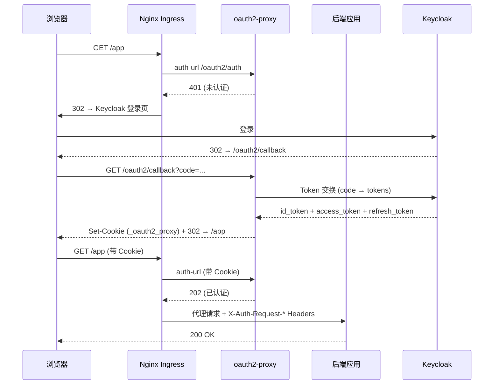

## 场景

你有一组内部 Web 应用（Grafana、Kibana、自研管理后台等），它们本身没有认证逻辑。你想用 Keycloak 做统一身份认证，用 oauth2-proxy 做反向代理层拦截所有未认证请求，在 Kubernetes 集群里通过 Nginx Ingress 暴露。

一句话：**Keycloak 负责「你是谁」，oauth2-proxy 负责「你能不能进这个应用」**。如果应用还有转账、改密等高风险操作，不能把 `/oauth2/auth` 的放行结果当成授权或 Step-Up 已完成；应由后端按 `iss`、`aud`、权限和认证强度再次判断，参见 [零信任 IAM 中 JWT 与 Introspection 的边界]()。

## 适用与不适用

| 适用 | 不适用 |
|------|--------|
| 内部工具统一认证（Grafana、Prometheus、Kibana） | 需要细粒度授权的对外 API（用 BFF 或 API 网关） |
| 快速给老旧应用加 OIDC 登录 | SPA 直连 Keycloak（不需要代理层） |
| K8s Ingress 统一认证入口 | 需要 Keycloak Adapter 老项目的迁移目标（直接用标准 OIDC 库，参考 [迁移指南]()） |
| 多个应用共享同一个 oauth2-proxy 实例 | 移动端 Native App（应该用系统浏览器 + PKCE） |

## 架构



流程要点：
1. Nginx Ingress 用 `auth-url` 注解把认证委托给 oauth2-proxy
2. oauth2-proxy 发现没有有效 Cookie，返回 401，Ingress 把用户重定向到 Keycloak
3. 用户在 Keycloak 完成登录，回调到 oauth2-proxy
4. oauth2-proxy 用授权码换 Token，设置加密 Cookie，写回浏览器
5. 后续请求带 Cookie，oauth2-proxy 验证通过，Ingress 放行

## Keycloak 端配置

### 1. 创建客户端

在目标 Realm 下创建 OpenID Connect 客户端：

| 配置项 | 值 | 说明 |
|--------|-----|------|
| Client ID | `oauth2-proxy` | 客户端标识 |
| Client type | `confidential` | 机密客户端（有密钥） |
| Valid Redirect URIs | `https://<你的域名>/oauth2/callback` | oauth2-proxy 回调地址 |
| Web Origins | `https://<你的域名>` | 允许的 CORS 来源 |
| Client Authentication | `On` | 启用客户端认证 |
| Standard Flow | `Enabled` | 标准授权码流程（oauth2-proxy 默认使用） |

### 2. 配置 Audience Mapper（最容易遗漏）

oauth2-proxy v7.4+ 默认验证 ID Token 的 `aud` 字段。Keycloak 默认不把 client ID 写入 audience，导致 `expected audience` 错误。

**Protocol Mapper 配置：**

| 配置项 | 值 |
|--------|-----|
| Mapper Type | `Audience` |
| Name | `aud-oauth2-proxy` |
| Included Client Audience | `oauth2-proxy` |
| Add to ID token | `ON` |
| Add to access token | `ON` |

如果后端只需要 oauth2-proxy 校验 ID Token，也可以只为 ID Token 增加 audience，避免无必要地扩大 Access Token 的 claim 集合。另一条路径是在 oauth2-proxy 配置 `--oidc-extra-audience=<已注册的 audience>`，适合兼容已有 Token audience 的场景；它不会修改 Keycloak 签发的 Token。两者都不应与跳过 issuer、签名或 audience 校验的“临时修复”混用。

配置后 Keycloak 签发的 ID Token payload 会包含：
```json
{
  "aud": ["account", "oauth2-proxy"],
  ...
}
```

### 3. 先分清 issuer、client ID 和 audience

`expected audience` 报错时，不要先改 Cookie 或反复重启 Pod。先把三个值分开：

| 值 | 例子 | 校验对象 |
|-----|------|---------|
| `issuer` | `https://keycloak.example.com/realms/myrealm` | OIDC Discovery 返回的 `issuer`，必须与 Token 的 `iss` 一致 |
| `client_id` | `oauth2-proxy` | oauth2-proxy 作为 OIDC Client 向 Keycloak 请求授权码时使用 |
| `aud` | `oauth2-proxy` | 接收并验证 ID Token 的应用；应由 Keycloak 的 Audience mapper 写入 |

这三个值经常碰巧相同或相近，但职责不同。尤其不要把应用后端 API 的 audience 直接当成 oauth2-proxy 的 audience：前者是后端验证 Access Token 的目标，后者是代理验证登录会话所需的目标。需要后端使用 Access Token 时，后端仍应按自己的 issuer、audience 和 scope 独立验证，不能因为请求经过 oauth2-proxy 就信任任意 `X-Auth-Request-*` 头。

用下面的命令先确认 Discovery 和 issuer，而不是猜 `/auth/realms` 路径：

```bash
ISSUER='https://keycloak.example.com/realms/myrealm'
curl --fail-with-body -sS "$ISSUER/.well-known/openid-configuration" \
  | jq -e --arg issuer "$ISSUER" '.issuer == $issuer'
```

如果命令失败，先修正 Keycloak 的外部 hostname、反向代理 headers 或 `--oidc-issuer-url`；Discovery 没有对齐时，继续改 mapper 只是在给错误堆更多日志。

> **安全边界**：RFC 7636 的 PKCE 保护的是授权码兑换过程，不会替代 `iss`、`aud`、签名和过期时间校验。oauth2-proxy 的 `/oauth2/auth` 只适合做入口认证判定；后端若接收并使用 Bearer Token，仍需独立完成资源服务器校验。

### 4. 只解码 Token 做诊断，不把解码当作验证

临时排错时可以查看 payload，确认 `iss`、`aud`、`exp` 是否符合预期；不要把 jwt.io 或下面的 Base64 解码结果当成“Token 有效”。签名、issuer、audience 和时间窗口必须由 oauth2-proxy 或后端的 OIDC/JWT 库验证。

```bash
# 仅用于查看 payload；TOKEN 不要写入 shell 历史或 CI 日志
TOKEN='<脱敏后的三段 JWT>'
python3 - "$TOKEN" <<'PY'
import base64, json, sys
part = sys.argv[1].split('.')[1]
part += '=' * (-len(part) % 4)
print(json.dumps(json.loads(base64.urlsafe_b64decode(part)), ensure_ascii=False, indent=2))
PY
```

排错顺序建议固定为：`Discovery/iss` → 签名和 `exp` → `aud` → `email/groups` claim → Cookie 与 Ingress。这样能把“身份令牌问题”和“浏览器会话问题”分开，避免看到 401 就统一归咎于 Cookie。

## oauth2-proxy 端配置

### Kubernetes Deployment

```yaml
apiVersion: v1
kind: Secret
metadata:
  name: oauth2-proxy-secret
  namespace: auth
type: Opaque
stringData:
  client-id: "oauth2-proxy"
  client-secret: "<从 Keycloak 客户端 Credentials 复制>"
  cookie-secret: "<openssl rand -base64 32 生成>"
---
apiVersion: apps/v1
kind: Deployment
metadata:
  name: oauth2-proxy
  namespace: auth
spec:
  replicas: 2
  selector:
    matchLabels:
      app: oauth2-proxy
  template:
    metadata:
      labels:
        app: oauth2-proxy
    spec:
      containers:
      - name: oauth2-proxy
        # 生产环境请固定到已验证的版本，不要直接使用 latest。
        image: quay.io/oauth2-proxy/oauth2-proxy:<已验证版本>
        args:
        - --provider=keycloak-oidc
        - --oidc-issuer-url=https://keycloak.example.com/realms/myrealm
        - --client-id=$(OAUTH2_PROXY_CLIENT_ID)
        - --client-secret=$(OAUTH2_PROXY_CLIENT_SECRET)
        - --cookie-secret=$(OAUTH2_PROXY_COOKIE_SECRET)
        - --cookie-secure=true
        - --cookie-samesite=lax
        - --cookie-domain=.example.com
        - --cookie-refresh=1h
        - --cookie-expire=24h
        - --upstream=static://202
        - --http-address=0.0.0.0:4180
        - --reverse-proxy=true
        - --set-xauthrequest=true
        - --set-authorization-header=true
        - --pass-access-token=true
        - --pass-authorization-header=true
        - --email-domain=*
        - --scope=openid email profile
        env:
        - name: OAUTH2_PROXY_CLIENT_ID
          valueFrom:
            secretKeyRef:
              name: oauth2-proxy-secret
              key: client-id
        - name: OAUTH2_PROXY_CLIENT_SECRET
          valueFrom:
            secretKeyRef:
              name: oauth2-proxy-secret
              key: client-secret
        - name: OAUTH2_PROXY_COOKIE_SECRET
          valueFrom:
            secretKeyRef:
              name: oauth2-proxy-secret
              key: cookie-secret
        ports:
        - containerPort: 4180
          name: http
        livenessProbe:
          httpGet:
            path: /ping
            port: 4180
        readinessProbe:
          httpGet:
            path: /ping
            port: 4180
---
apiVersion: v1
kind: Service
metadata:
  name: oauth2-proxy
  namespace: auth
spec:
  selector:
    app: oauth2-proxy
  ports:
  - port: 4180
    targetPort: 4180
```

### 关键参数说明

| 参数 | 值 | 为什么 |
|------|-----|--------|
| `--provider=keycloak-oidc` | v7.3+ 专用 Provider | 设置正确的 OIDC discovery URL（自动拼接 `/realms/xxx`），默认 scope `openid email profile` |
| `--oidc-issuer-url` | `https://<keycloak>/realms/<realm>` | 必须以 realm 路径结尾，不含尾部斜杠 |
| `--cookie-domain` | `.example.com` | 主域名前加点号，使子域名也能共用 Cookie。单域名不加点号 |
| `--cookie-secure` | `true` | 生产环境必须开启，只通过 HTTPS 传输 Cookie |
| `--cookie-samesite` | `lax` | 允许从外部链接跳转时携带 Cookie（`strict` 会拦截来自 Keycloak 的回调） |
| `--upstream=static://202` | 固定 202 响应 | auth-url 模式：oauth2-proxy 仅做认证判定，不代理到后端 |
| `--reverse-proxy` | `true` | 信任反向代理传入的 `X-Forwarded-*` 头 |
| `--set-xauthrequest` | `true` | 向后端传递 `X-Auth-Request-User`、`X-Auth-Request-Email`、`X-Auth-Request-Groups` 等头 |
| `--pass-access-token` | `true` | 将 Access Token 传给后端（Header: `X-Auth-Request-Access-Token`） |
| `--email-domain` | `*` | 允许所有邮箱域。如需限定，改为 `example.com` 或 `--authenticated-emails-file` |

## Nginx Ingress 配置

```yaml
apiVersion: networking.k8s.io/v1
kind: Ingress
metadata:
  name: my-app-ingress
  namespace: default
  annotations:
    nginx.ingress.kubernetes.io/auth-url: "http://oauth2-proxy.auth.svc.cluster.local:4180/oauth2/auth"
    nginx.ingress.kubernetes.io/auth-signin: "https://$host/oauth2/start?rd=$escaped_request_uri"
    nginx.ingress.kubernetes.io/auth-response-headers: "X-Auth-Request-User,X-Auth-Request-Email,X-Auth-Request-Groups,X-Auth-Request-Access-Token"
spec:
  ingressClassName: nginx
  tls:
  - hosts:
    - myapp.example.com
    secretName: myapp-tls
  rules:
  - host: myapp.example.com
    http:
      paths:
      - path: /
        pathType: Prefix
        backend:
          service:
            name: my-app
            port:
              number: 80
```

> **注意**：`auth-signin` 使用 `$host` 变量，确保重定向到当前访问的域名。oauth2-proxy 的 Service 必须和 Ingress 在同一个集群内可达。
>
> **不要用 `auth-snippet` 试图放行 `/oauth2/callback`。** `auth-url` 是当前 Ingress 对请求执行的外部认证检查；回调入口应单独创建一个不带 `auth-url` 的 Ingress，指向 oauth2-proxy Service。否则回调请求可能再次进入认证检查，形成登录循环。下面的业务 Ingress 只负责保护应用，`/oauth2/*` 由独立 Ingress 暴露。

```yaml
apiVersion: networking.k8s.io/v1
kind: Ingress
metadata:
  name: oauth2-proxy-endpoints
  namespace: auth
spec:
  ingressClassName: nginx
  tls:
  - hosts: [myapp.example.com]
    secretName: myapp-tls
  rules:
  - host: myapp.example.com
    http:
      paths:
      - path: /oauth2
        pathType: Prefix
        backend:
          service:
            name: oauth2-proxy
            port:
              number: 4180
```

这两个 Ingress 可以共享同一个 host；关键区别是业务 Ingress 有 `auth-url`，回调 Ingress 没有。若集群启用了 `server-snippet` 或其他全局认证策略，还要确认它没有覆盖这个例外路径。
## Traefik ForwardAuth 配置

如果用 Traefik 替代 Nginx Ingress，使用 `ForwardAuth` 中间件。完整配置、排错和对比见专用指南：

👉 **[Traefik ForwardAuth + Keycloak + oauth2-proxy 完整配置与排错指南]()**

以下为快速参考配置：

```yaml
apiVersion: traefik.io/v1alpha1
kind: Middleware
metadata:
  name: oauth2-proxy-auth
  namespace: auth
spec:
  forwardAuth:
    address: http://oauth2-proxy.auth.svc.cluster.local:4180/oauth2/auth
    trustForwardHeader: true
    authResponseHeaders:
    - X-Auth-Request-User
    - X-Auth-Request-Email
    - X-Auth-Request-Groups
    - X-Auth-Request-Access-Token
---
apiVersion: traefik.io/v1alpha1
kind: IngressRoute
metadata:
  name: my-app-route
spec:
  entryPoints:
  - websecure
  routes:
  - match: Host(`myapp.example.com`)
    kind: Rule
    middlewares:
    - name: oauth2-proxy-auth
      namespace: auth
    services:
    - name: my-app
      port: 80
```

Traefik 的 ForwardAuth 行为与 Nginx Ingress auth-url 类似：返回 2xx 放行，返回 401 触发重定向。

## 验证

部署完成后按以下顺序验证：

```bash
# 1. 确认 oauth2-proxy 健康
curl -sS http://oauth2-proxy.auth.svc.cluster.local:4180/ping
# 预期：OK

# 2. 确认 Keycloak OIDC Discovery 可访问
curl -sS https://keycloak.example.com/realms/myrealm/.well-known/openid-configuration | jq .issuer
# 预期："https://keycloak.example.com/realms/myrealm"

# 3. 确认未经认证请求被拦截（返回 302 重定向到 Keycloak 登录）
curl -sS -o /dev/null -w "%{http_code}" https://myapp.example.com/
# 预期：302

# 4. 端到端测试：浏览器打开 https://myapp.example.com/
# 预期：跳转到 Keycloak 登录页 → 登录 → 跳回应用

# 5. 确认后端能读到认证信息
# 在应用中打印 HTTP Headers，预期见到：
# X-Auth-Request-User: <username>
# X-Auth-Request-Email: <user@example.com>
# X-Auth-Request-Access-Token: eyJ...
```

## 常见错误排错表

> **完整版速查**：这里列出了最常见错误。12 个高频错误的完整诊断命令、根因分析和修复步骤见 **[IAM 网关 oauth2-proxy 常见错误排错]()**。

| 错误现象 | 根本原因 | 解决方案 |
|----------|----------|----------|
| `expected audience "oauth2-proxy" got ["account"]` | ID Token 没有包含 oauth2-proxy audience，或 mapper 未绑定到实际登录客户端 | 确认 mapper 的 Included Client Audience 是 `oauth2-proxy`，勾选 "Add to ID token"；重新登录并检查新 Token，旧 Cookie 不会自动变正确 |
| 登录后无限重定向循环 | Cookie Domain 不匹配 / SameSite 过严 | 检查 `--cookie-domain` 是否正确，`--cookie-samesite` 是否为 `lax`。详细排查见 [Keycloak 重定向循环与 401 排错指南]() |
| `csrf cookie not found` | Cookie 被浏览器拦截（SameSite/跨域） | 部署在相同主域名下；`--cookie-samesite=lax`；确保 HTTPS |
| 登录后返回 403 | `--email-domain` 过滤掉了用户 | 临时设置 `--email-domain=*` 验证，确认后再精确配置 |
| `invalid_token` / `token contains an invalid number of segments` | ID Token 格式异常或 JWT 校验失败 | 检查 `--oidc-issuer-url` 是否正确，Keycloak Realm 名是否对 |
| Nginx Ingress 返回 503 | oauth2-proxy Service 不可达 | 确认 Service 在 `auth` namespace 下，ClusterIP 可解析 |
| Cookie 在子域名不生效 | `--cookie-domain` 未加点号前缀 | `.example.com`（带点号）= 所有子域共用；`example.com` = 仅该域名 |
| 登出后其他应用也退出 | Cookie Domain 跨应用共享 | 不同应用用不同的 oauth2-proxy 实例，或不同 Cookie Name |

### 诊断命令速查

```bash
# 查看 oauth2-proxy 日志
kubectl logs -n auth deploy/oauth2-proxy --tail=50

# 查看 Ingress Controller 日志（确认 auth-url 调用）
kubectl logs -n ingress-nginx deploy/ingress-nginx-controller --tail=50 | grep auth

# 手动测试 auth-url 端点（带 cookie）
# 1. 先通过浏览器完成一次登录
# 2. 从浏览器 DevTools → Application → Cookies 复制 _oauth2_proxy 的值
# 3. 在终端重复请求
curl -v -H "Cookie: _oauth2_proxy=<复制值>" \
  http://oauth2-proxy.auth.svc.cluster.local:4180/oauth2/auth
# 预期 HTTP 202（已认证）

# 检查 Keycloak 签发的 ID Token（用 jwt.io 或命令行解码）
# 在浏览器 DevTools → Network → /oauth2/callback → Response Headers 中找到
# 或从 oauth2-proxy 日志中获取
```

## 多条应用共享一个 oauth2-proxy

如果多个应用使用同一个 Keycloak Client 和 oauth2-proxy 实例（例如 `grafana.example.com`、`kibana.example.com` 都在 `.example.com` 下）：

**适用条件**：
- 所有应用部署在同一主域名下（Cookie Domain 覆盖）
- 使用同一个 Keycloak Realm 和 Client
- 不需要按应用区分用户组/角色（如果后端需要区分，用 `--set-xauthrequest` 传 `X-Auth-Request-Groups`，由后端自行判断）

**配置要点**：
- `--cookie-domain=.example.com`（注意前面的点号）
- 每个应用的 Ingress 都配相同的 `auth-url` 和 `auth-signin`
- 用一个共享的 cookie-secret

**不适用**：
- 不同域名（a.com + b.com）：Cookie 不能跨域，需要各自独立的 oauth2-proxy 实例
- 不同用户组：如果 A 应用只允许 `admin` 组、B 应用只允许 `viewer` 组，要么用不同 Client + oauth2-proxy 实例，要么用 `--allowed-group` 结合 Nginx Ingress `configuration-snippet` 做分流

## 生产环境注意事项

1. **Cookie Secret 轮换**：cookie-secret 用于加密 Cookie，泄露后攻击者可伪造认证 Cookie。定期轮换需同步更新部署（旧 secret 签发的 Cookie 会失效，用户需重新登录）。
2. **副本数**：至少 2 副本，配合 PodDisruptionBudget 保证高可用。
3. **资源限制**：不要把未经压测的内存或 CPU 数字当成默认值。先用实际登录峰值、回调延迟和 OIDC 上游请求量建立基线，再设置 requests/limits；认证服务通常在发布或 Cookie 失效时出现突发流量。
4. **Session Store 要按模式选择**：默认加密 Cookie 模式不要求多个副本共享服务端会话；只有需要 Redis 集中保存 Session、Cookie 过大，或希望服务端统一撤销时，才配置 `--session-store-type=redis` 和对应连接参数。引入 Redis 同时引入连接、超时、故障降级和凭据轮换问题，不能为了“多副本”机械添加。
5. **TLS 与代理信任**：外部访问必须使用 HTTPS；如果 TLS 在 Ingress 终结，需正确传递并限制 `X-Forwarded-*`，避免客户端可以直接向 oauth2-proxy 注入代理头。Keycloak 也必须配置与公开地址一致的 hostname/proxy 模式。
6. **监控**：按所用版本确认 `/metrics` 是否启用，并监控认证成功率、回调失败、上游 OIDC 错误、延迟和 401/403 比例；不要只看 Pod 是否存活。
7. **后端再次验证 Token**：`X-Auth-Request-*` 是认证代理传递的请求头，后端必须只信任来自 Ingress 的请求。若后端使用 `Authorization` 或 `X-Auth-Request-Access-Token` 做 API 授权，仍要独立校验签名、`iss`、`aud`、过期时间和权限，不能把“已通过 `/oauth2/auth`”当成 API 授权结果。

## IAM 常见问题（FAQ）

### Keycloak、oauth2-proxy 和后端分别负责什么？

Keycloak 是 IAM 的身份提供者，负责认证并签发 OIDC Token；oauth2-proxy 是入口认证网关，负责把浏览器会话转换成对应用的放行结果；后端仍负责资源授权和 Token 校验。`/oauth2/auth` 返回 2xx 只说明入口会话有效，不代表用户有权执行某个 API 操作。

### 为什么登录成功后仍然出现 `expected audience`？

先确认 Discovery 返回的 `issuer` 与 Token 的 `iss` 一致，再检查新签发的 ID Token 的 `aud` 是否包含 oauth2-proxy 的 client ID。Audience Mapper 修改后必须重新登录；旧 Cookie 或旧 Token 不会自动获得新的 claim。不要把后端 API 的 audience 填给 oauth2-proxy，两个接收方是不同的 IAM 边界。

### 多个应用应该共用一个 oauth2-proxy 吗？

只有当应用处于同一主域名、同一 Realm，且能接受共享 Cookie 会话时才适合共用。不同租户、不同安全等级或需要独立登出的应用应使用不同的 Cookie Name 或独立实例；共享 Cookie 会扩大会话泄露和误登出的影响范围，不能只因为少部署一个 Pod 就选它。

## 回滚方式

如果新配置导致认证失败，快速回滚步骤：

```bash
# 1. 回滚 oauth2-proxy Deployment 到上一个版本
kubectl rollout undo deployment/oauth2-proxy -n auth

# 2. 回滚 Ingress 注解（如果改过 auth-url 等）
# 还原 Ingress YAML 后重新 apply

# 3. 验证服务恢复
curl -sS -o /dev/null -w "%{http_code}" https://myapp.example.com/
```

如果问题是 Keycloak 客户端配置导致的（比如误改了 Audience Mapper），需在 Keycloak Admin Console 中手动还原配置。Keycloak 客户端配置不受 Kubernetes rollout 影响，建议在改动前导出客户端 JSON 备份：

```bash
# Keycloak Admin CLI 导出客户端配置（需要 admin token）
kcadm.sh get clients/<client-id> -r <realm> > client-backup.json
```

---

## 延伸阅读

- [OAuth 2.0 深度解读 — 授权码流程与 PKCE]()：理解 oauth2-proxy 底层的 OAuth 2.0 授权码 + PKCE 流程
- [JWT 深入解读]()：oauth2-proxy 验证的 ID Token 本质就是 JWT——理解其结构、签名和声明验证逻辑
- [第 18 章：IDaaS 集成模式与实践]()：网关模式与其他集成模式的对比
- [第 14 章：Keycloak 架构与部署]()：Keycloak 生产部署的完整指南
- [oauth2-proxy 官方文档 — Keycloak OIDC Provider](https://oauth2-proxy.github.io/oauth2-proxy/configuration/providers/keycloak_oidc)
- [oauth2-proxy 官方配置总览](https://oauth2-proxy.github.io/oauth2-proxy/configuration/overview/)
- [ingress-nginx 外部认证示例：auth-url 与 auth-signin](https://kubernetes.github.io/ingress-nginx/examples/auth/oauth-external-auth/)
- [oauth2-proxy Issue #2808：audience 缺失时的错误处理](https://github.com/oauth2-proxy/oauth2-proxy/issues/2808)
- [Keycloak 反向代理配置](https://www.keycloak.org/server/reverseproxy)
