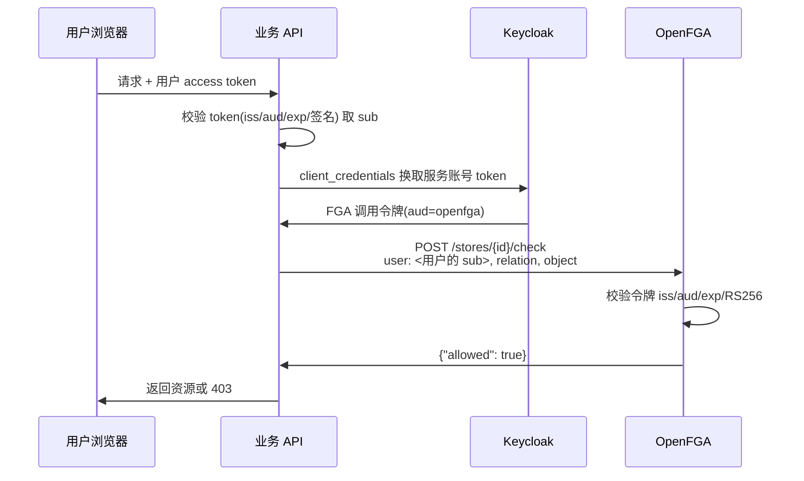

## 场景

Keycloak 把「谁是谁」管得很好，一到「这个人能不能看这份文档」就开始别扭：文档级、文件夹级的共享关系用 Role 表达会迅速爆炸，用 Authorization Services 又要为每个资源建 Resource 和 Permission。你想让 Keycloak 继续做认证，把关系型授权交给 OpenFGA，结果卡在第一步——OpenFGA 用 OIDC 校验调用方，而 Keycloak 默认签发的 token 不带它要的 `aud`。

这篇文章只解决三个具体问题：怎么让 Keycloak 签出 OpenFGA 认的 token、权限主体该取哪个字段、元组数据怎么和 Keycloak 的用户/组变更对齐。

边界先划清：**Keycloak 负责认证和身份来源，OpenFGA 负责授权判定，两者之间只有 JWT 一条缝。** 缝没对齐，后面全是白干。授权模型的原理与 RBAC/ABAC/ReBAC 的选型判断见 [IAM RBAC、ABAC、ReBAC 授权模型对比]()。

## 适用与不适用

| 适用 | 不适用 |
|------|--------|
| 权限由「资源与人的关系」决定：文档共享、项目协作、多级组织、文件夹继承 | 权限只按职能划分（管理员/编辑/只读）——Keycloak Realm/Client Roles 就够 |
| 资源数量大且关系动态变化，不适合逐个建 Role 或 Resource | 只需要按属性做条件判断（时间段、部门、密级）——用 OPA/Cedar 更直接 |
| 已经在用 Keycloak 做认证，不想再引入一套用户体系 | 团队没有能力运维「授权数据库」及其一致性——引入 OpenFGA 等于多一个强依赖 |
| 需要「列出我可见的所有文档」这类反向查询（ListObjects） | 只做网关级登录拦截——那是 [Keycloak + oauth2-proxy]() 的战场 |

Keycloak 原生的 Authorization Services（UMA 风格 Resource/Permission/Policy）与 OpenFGA 的取舍：前者把资源定义在 Keycloak 里，适合资源少、策略集中在 IdP 的场景；后者把关系存成独立的图数据，适合资源多、关系由业务写入的场景。Keycloak 侧的细粒度能力与边界见 [Keycloak IAM 细粒度权限与授权策略实战]()。

## 调用链



三个容易搞混的角色：

1. **用户的 token** 只用来证明「请求者是谁」，它的 `aud` 通常指向你的业务 API，不需要也不应该包含 OpenFGA。
2. **服务账号的 token** 才是调 OpenFGA 的凭据，`aud` 必须包含 OpenFGA 配置的 audience 值。
3. **OpenFGA 不看 `roles`/`groups` claim**。它只认 `iss`、`aud`、`exp`、签名算法和（可选的）`sub`；权限完全来自元组和授权模型。把「角色→权限」的换算塞进 claim 再期待 OpenFGA 理解，是这条链路上最常见的误解。

## Keycloak 端：让调用令牌带上正确的 aud

### 1. 建一个 audience 占位客户端

Keycloak 的 Audience mapper 有 `Included Client Audience` 和 `Included Custom Audience` 两个字段，前者的取值是**本 Realm 内已存在客户端的 Client ID 列表**（[Protocol Mappers 字段定义](https://www.keycloak.org/admin-api/protocol-mappers)）。所以：

- 用 `Included Client Audience`：先在 Realm 里建一个 Client ID 为 `openfga` 的客户端。它不需要启用任何登录流程，作用只是给 mapper 一个可选的 audience 目标；将来权限审计时「哪些客户端能调 OpenFGA」也能直接在 mapper 引用关系里看到。
- 用 `Included Custom Audience`：填任意字符串，例如 `https://fga.example.com`。这个字段只在 `Included Client Audience` 为空时生效。URL 形式的 audience 更贴近资源服务器语义，缺点是拼写错误不会有任何校验。

两种都可以，OpenFGA 只做字符串比较。团队内统一一种，别混着用。

### 2. 建调用方客户端并启用服务账号

| 设置项 | 值 |
|--------|-----|
| Client ID | `fga-caller`（业务后端用它换令牌） |
| Client authentication | ON（confidential，需要 client secret） |
| Service accounts roles | ON（走 client_credentials） |
| Standard flow | OFF（后端不需要浏览器登录流程） |

### 3. 用 Client Scope 挂 Audience mapper

不要把 mapper 直接塞进客户端——用独立 Client Scope 才能在多个调用方之间复用：

1. Realm → Client scopes → Create client scope，名称 `openfga-audience`，Type 选 `None`（不自动分配给所有客户端）。
2. 在该 scope 的 Mappers 里 Add mapper → By configuration → **Audience**。
3. 填写（字段名与默认值依据 Keycloak 官方 Protocol Mappers 定义）：

| 字段 | 值 | 默认值 |
|------|-----|--------|
| Name | `aud-openfga` | — |
| Included Client Audience | `openfga` | None |
| Add to access token | ON | `access.token.claim` 为 `true` |
| Add to ID token | 按需 | `id.token.claim` 为 `false` |
| Add to lightweight access token | 按需 | `lightweight.claim` 为 `false` |

4. 回到 `fga-caller` 客户端 → Client scopes → Add client scope → 选中 `openfga-audience`，设为 **Default**。

三个必须自己确认的点：

- **mapper 挂在客户端没有引用的 scope 上不生效。** 症状是「配置明明在，token 里就是没有 aud」。
- **access token 与 ID token 是两份独立的开关。** 如果调用代码取的是 ID token（Keycloak 的 ID token 默认不含该 audience），就会在 OpenFGA 侧报 `invalid claims`。用 client_credentials 换令牌时本来也只有 access token，这个坑一般出现在复用浏览器登录流程的场景。
- **如果部署启用了 lightweight access token，`lightweight.claim` 默认是关闭的。** 遇到「mapper 配对了但 aud 不出现」，先确认手里的令牌是哪种类型，再怀疑 mapper。

### 4. 让 issuer 就是公开地址

OpenFGA 启动时会拉 `<issuer>/.well-known/openid-configuration` 并用它拿 JWKS。这要求：

- OpenFGA 所在网络能访问该 issuer；
- issuer 字符串**逐字符**等于 Keycloak 对外发布的地址。Keycloak 在反向代理后面时，若对外域名与内部地址不一致，Discovery 返回的 `issuer` 会与 `--authn-oidc-issuer` 对不上，表现为所有令牌校验失败。这类问题的根因和解法见 [Keycloak Hostname v2 配置]() 与 [反向代理下的真实客户端 IP 与代理信任边界]()。

## OpenFGA 端：OIDC 认证最小配置

以下参数名与默认值来自 OpenFGA [Configuration Options](https://openfga.dev/docs/getting-started/setup-openfga/configuration)（v1.20.0 文档）。

```yaml
# config.yaml —— 与环境变量 OPENFGA_* 等价，命令行参数优先级最高
authn:
  method: oidc
  oidc:
    issuer: "https://keycloak.example.com/realms/myorg"
    audience: "openfga"
    # 可选：接受额外 issuer 别名（多域名/迁移期）
    issuerAliases: []
    # 可选：调用方白名单，见下方「subjects 的真实语义」
    subjects: []
http:
  tls:
    enabled: true
    cert: /etc/openfga/tls/server.crt
    key: /etc/openfga/tls/server.key
playground:
  enabled: false
```

| 参数 | 说明 |
|------|------|
| `authn.method` | `none` / `preshared` / `oidc`，默认 `none`。生产环境用 `none` 等于把授权数据库敞开 |
| `authn.oidc.issuer` | 授权服务器 issuer。**必填** |
| `authn.oidc.audience` | 令牌的接收方标识。**必填** |
| `authn.oidc.issuerAliases` | 额外接受的 `iss` 值，用于多域名或迁移期 |
| `authn.oidc.subjects` | 调用方 `sub` 白名单；**为空时不做任何 `sub` 校验** |
| `authn.oidc.clientIdClaims` | 解析 client ID 用的 claim，默认按 `azp` → `client_id` 顺序取值 |

### 源码层面的硬约束（写在这里，省掉一轮排错）

读到 `internal/authn/oidc/oidc.go`，校验逻辑比文档更窄，这几点必须提前知道：

1. **只接受 RS256。** 解析器固定了 `jwt.WithValidMethods([]string{"RS256"})`。Realm 密钥换成 ES256/EdDSA 时，令牌会在 OpenFGA 侧直接失效，错误信息只会说 claims 无效，不会提示算法不支持。Keycloak 默认的 RSA 生成器是 RS256，所以要改密钥算法时把这条列入回归项。
2. **`exp` 必须存在，`iat` 会被校验。** 手工构造的测试令牌如果缺 `exp`，同样进不来。
3. **`iss` 和 `aud` 长度为零时，进程直接拒绝启动**（构造器返回 error）。这是 1.18.0 起的行为，动机见下面 CVE 一节。
4. **密钥轮换基本是自动的。** JWKS 客户端开启了 `RefreshUnknownKID`，遇到未知 `kid` 会重新拉取，周期刷新间隔 48 小时，刷新动作本身有 1 分钟限流。含义：Keycloak 轮换签名密钥后通常不需要重启 OpenFGA；但如果轮换瞬间有大量请求同时撞上未知 `kid`，刷新会被这 1 分钟限流挡住，可能出现短暂的 401。轮换安排在低峰期，并盯一下 OpenFGA 的 `invalid claims` 日志。
5. **`subjects` 的真实语义**：配置后按 `sub` 精确匹配（源码用 `jwt.WithSubject` 校验）；`clientIdClaims` 只用来解析并记录 client ID，**不参与白名单判定**。Keycloak 的 client_credentials 令牌里，`sub` 是服务账号用户的 UUID，client ID 在 `azp`——把 client ID 填进 `subjects` 一定被拒。因为该 UUID 每个 Realm 都不同、跨环境不可复用，实践上更推荐用「audience 收窄 + 网络层只放行业务后端」而不是硬编码 `subjects`。

### 生产环境的三条最低要求

OpenFGA 官方 [Running in Production](https://openfga.dev/docs/best-practices/running-in-production) 的第一条就是配置认证，配合这里的具体项：

- **启用 HTTPS（HTTP 或 gRPC 至少一个走 TLS）。** OIDC 令牌是持有即生效的凭据，明文 HTTP 上等同于把授权数据库的写权限广播出去。
- **关闭 Playground。** 它只在 `authn.method=none` 时可用，且官方已标记弃用；开着它意味着必须关掉认证。
- **收敛 CORS。** `http.corsAllowedOrigins` 的默认值是 `*`。让浏览器直接访问 OpenFGA 时，这个默认值会把检查接口暴露给任意站点，因此要么显式设为业务前端域名，要么干脆只允许服务端调用。

## 权限主体用 sub，不用用户名和邮箱

元组里的 `user` 必须用 `user:<sub>`。理由是规范层面的：

- OIDC Core 规定 `sub` 是本地唯一且**永不复用**的标识；
- `preferred_username` 只是便于展示的简写名，规范明确不保证唯一、不保证稳定；
- `email` 可以被用户自己修改，企业目录里还可能被回收再分配。

用 `preferred_username` 或 `email` 做 `user:` 前缀的后果不是「偶尔出错」，而是两类确定性故障：

- 用户改了用户名 → 老元组仍挂在旧字符串上，权限凭空消失或遗留；
- 目录里邮箱被回收后分给新员工 → 新员工继承离职者的全部关系权限，这是安全事件。

Keycloak 换成 LDAP/AD 联邦后，`preferred_username` 还可能因为 username mapper 调整而整体变化。这类身份源侧的影响面见 [Keycloak LDAP / AD 用户联邦]()。

需要展示名字时，用 `sub` 查用户资料即可，不要让展示字段进入授权判断。

## 后端调用模式与越权边界

推荐形态：**业务后端用自己的服务账号调 OpenFGA，把用户的 `sub` 作为 Check 的 `user`**。

这里有一条必须守住的红线：`sub` 只能从**已经验签的业务 token**里取，绝不能接受客户端传参。`POST /check` 的入参是一个普通 JSON 字段，服务端如果不加校验就用请求体里的 `user` 值去查，攻击者改成别人的 `sub` 就能拿到别人的权限结果，这正是典型的 confused deputy。业务后端对用户令牌的校验方式（签名、`iss`、面向自身的 `aud`、`exp`、scope）见 [Keycloak Spring Boot 3 资源服务器接入指南]()。

另一种形态是让前端直接调 OpenFGA：需要为用户令牌单独加一个 `aud=openfga` 的 audience，还要放开 CORS。除非产品明确需要「前端一次拉回可见资源列表」，否则不要开——它把授权查询接口变成了面向浏览器的公开 API，攻击面跟着放大。

## 元组同步的边界

Keycloak 管用户与组，OpenFGA 管关系，两者之间必然要做同步。四个具体约束，都是踩过才知道的：

1. **Write API 不是幂等的。** 官方 API 定义写明：写入一个已存在的元组、或删除一个不存在的元组，都会报错。因此「用户组变更 → 批量写元组」这种同步消费者不能盲目重放消息，需要先读后写，或把这类错误当作「已达成目标状态」处理；否则消息重投会不断报错，掩盖真正的失败。
2. **删除操作不写进审计语义。** 删除元组时随元组携带的 `condition` 会被忽略，别指望用条件元组表达「过期即删」——过期判断要在写入侧或查询侧完成。
3. **同步方向要单向。** 权限真相只有一处。如果既允许在 OpenFGA 里手工加元组，又允许 Keycloak 组变更自动写元组，回收权限时必然漏掉手工那部分。建议明确「组织关系来自 Keycloak、资源关系来自业务系统」，两条来源写不同 relations。
4. **对账要可执行。** 用 Read/ReadChanges 定期比对元组数量和关键用户的关系集合，比事后翻日志有效。写了多少条、删了多少条、失败重试几次，这些指标要进监控。

同步链路本身建议做成 outbox + 幂等消费者：业务事务里只落一条事件，消费者负责调用 OpenFGA，失败重试到成功为止。这个模式与 Keycloak 事件导出、SIEM 消费的思路一致，参见 [Keycloak 审计日志配置与 IAM 合规实践]()。

## 验证

**第一步：确认 Keycloak 签出的令牌带对了 aud。**

```bash
# 用服务账号换令牌（client secret 从环境变量传入，不要写进命令历史）
TOKEN=$(curl -sS -X POST \
  "https://keycloak.example.com/realms/myorg/protocol/openid-connect/token" \
  -d "grant_type=client_credentials" \
  -d "client_id=fga-caller" \
  -d "client_secret=${FGA_CALLER_SECRET}" | jq -r .access_token)

# 解码 payload 看 iss / aud / azp / sub（JWT Payload 只是可读编码，不是加密）
echo "$TOKEN" | cut -d. -f2 | base64 -d 2>/dev/null | jq '{iss, aud, azp, sub, exp}'
```

期望结果：`aud` 包含 `openfga`，`iss` 与 OpenFGA 配置的 issuer 完全一致。

**第二步：用同一个令牌打检查接口，正反都要验。**

```bash
# 正向：存在的关系应返回 allowed=true
curl -sS -X POST "https://fga.example.com/stores/${FGA_STORE_ID}/check" \
  -H "Authorization: Bearer ${TOKEN}" \
  -H "content-type: application/json" \
  -d '{"tuple_key":{"user":"user:'"${USER_SUB}"'","relation":"viewer","object":"document:roadmap"}}' \
  | jq .

# 负向 1：不带令牌，必须 401
curl -sS -o /dev/null -w '%{http_code}\n' -X POST \
  "https://fga.example.com/stores/${FGA_STORE_ID}/check" \
  -H "content-type: application/json" -d '{"tuple_key":{}}'

# 负向 2：换成另一个服务（aud 不含 openfga）的令牌，必须被拒
# 负向 3：把 user 换成不存在关系的 sub，应返回 allowed=false（而不是报错）
```

注意一个容易误判的返回值：如果请求里的 `relation` 在授权模型里**根本没有定义**，接口返回的是 `400 Bad Request`，不是 `allowed:false`。`false` 只表示「该 relation 存在但没有匹配的元组」。把 400 当成权限不足来排查，会浪费很多时间。

## 常见错误表

| 症状 | 可能原因 | 排查 |
|------|---------|------|
| 启动即失败，日志含 `oidc: audience must be set` | 1.18.0 起 issuer 与 audience 必须同时配置 | 补上 `authn.oidc.audience`，不要退回旧版本绕过 |
| 所有请求 `invalid claims` | issuer 与 Discovery 返回的 `issuer` 不一致 | `curl <issuer>/.well-known/openid-configuration \| jq .issuer` 逐字符比对 |
| 同上 | 令牌算法不是 RS256 | 解出头部 `alg`，确认 Realm 密钥类型 |
| 同上 | 令牌 `exp` 缺失或 `iat` 异常 | 解码 payload 检查时间字段与服务器时钟 |
| Keycloak 里配了 mapper，令牌仍无 `aud` | mapper 挂在客户端未引用的 Client Scope 上 | Client → Client scopes → Evaluate，看生效后的令牌内容 |
| 浏览器登录流程拿到 ID token 后调 OpenFGA 失败 | ID token 默认不含该 audience | 显式打开 `Add to ID token`，或改用 access token |
| 密钥轮换后短时大量 401 | 未知 `kid` 触发 JWKS 刷新，受 1 分钟限流 | 低峰期轮换，观察 OpenFGA 校验失败指标，必要时滚动重启 |
| 配了 `subjects` 仍拒绝，或填了 client ID 被拒 | `subjects` 只匹配 `sub`，Keycloak 服务账号的 `sub` 是 UUID | 解码令牌取 `sub`，或评估是否真的需要白名单 |
| 同步消费者反复报错 | Write API 非幂等，重复写/删不存在元组会失败 | 改为先读后写，或把该错误视为已达目标状态 |
| 用户改名后权限错乱 | 元组主体用了 `preferred_username` 或 `email` | 迁移到 `sub`，一次性重建元组 |

## CVE-2026-55689：aud 校验曾经会被静默跳过

这条漏洞解释了为什么 1.18.0 要把「必填 audience」做成启动期硬校验。

- **影响**：当 `authn.method=oidc` 且只配了 issuer、**没有配 audience** 时，OIDC 认证器会跳过 `aud` 校验。若同一个 IdP 同时为多个服务签发令牌，一个本来发给其他服务的令牌可以直接通过 OpenFGA 的认证。
- **前置条件**（两个同时满足才受影响）：`authn.method=oidc`；配了 `authn.oidc.issuer` 但没配 `authn.oidc.audience`。
- **修复**：OpenFGA 1.18.0 起强制要求两者同时配置，且 `aud` 始终参与校验；Helm chart 对应 0.3.9。升级后进程会在启动期直接报错，而不是静默降级——这属于「把配置错误暴露成启动失败」，不要为了让它起来就把参数删掉。
- **自查**：翻一遍部署清单，确认 `OPENFGA_AUTHN_OIDC_AUDIENCE` / `--authn-oidc-audience` 确实存在且非空。这一步比升级更需要人工确认，因为它是一处配置缺失，不是代码缺陷。

来源：[GHSA-hcxc-wf8j-23hv](https://github.com/openfga/openfga/security/advisories/GHSA-hcxc-wf8j-23hv)、[OpenFGA CHANGELOG](https://github.com/openfga/openfga/blob/main/CHANGELOG.md)。

## 回滚方式

按影响面从大到小：

1. **OpenFGA 侧停用 OIDC**：改回 `authn.method=preshared` 并下发新密钥，属于凭据轮换，需要同步更新所有调用方；这条路径是应急通道，不是长期方案。
2. **业务侧降级到 Keycloak 原生授权**：把检查接口封装成后端内部函数（`check(user, relation, object)`），降级时改为读 Keycloak Role/Group 的粗粒度判断。这层封装是引入 OpenFGA 时就该做的——没有它，「换掉 OpenFGA」等于改所有业务代码。
3. **单点回退 audience 配置**：Audience mapper 删除后，新签发令牌不再带 `aud`，OpenFGA 会立即拒绝所有请求。回滚时要同时安排 OpenFGA 参数与调用方令牌的变更顺序，不要留下「一半有 aud、一半没有」的中间状态。
4. **元组数据**：OpenFGA 的元组是独立数据集。停用服务前先导出（Read 全量），否则重建授权数据的工作量会远超停服务的收益。

## IAM FAQ

### Keycloak 和 OpenFGA 在 IAM 体系里各做什么？

Keycloak 是身份提供者（IdP）与认证服务器：管用户、组、角色、密码策略、MFA、身份联邦，签发 JWT。OpenFGA 是授权决策点（PDP）的数据层：存储「谁与哪个资源有什么关系」，回答 `Check` 查询。Keycloak 回答「你是谁」，OpenFGA 回答「你能不能动这个资源」。二者不重叠，也不互相替代。

### Keycloak 已经有 Authorization Services，为什么还要 OpenFGA？

资源规模与关系形态不同。Authorization Services 把资源、Scope、Permission 定义在 Keycloak 的 Realm 里，适合资源数量可控、策略集中在 IdP 的场景；当资源由业务动态创建（每份文档、每个项目都是一个资源），并把资源元数据全塞进 IdP 会拖慢管理面、也难以表达继承与共享关系。ReBAC 用关系图表达继承，无需为每个资源建对象。选型判断见 [IAM RBAC、ABAC、ReBAC 授权模型对比]()。

### OpenFGA 能不能直接用用户令牌做认证，不用服务账号？

可以，只要该令牌的 `aud` 等于 OpenFGA 配置的 audience，且算法为 RS256。代价是：要么给用户令牌额外加一个 OpenFGA audience（扩大该令牌的可用范围），要么向前端开放检查接口并放开 CORS。除非产品明确需要前端直接查询权限，否则后端代理调用 + 服务账号令牌是风险更小的默认选择。

### 引入 OpenFGA 后 IAM 的运维负担增加在哪里？

增加三处：一是授权数据库成为强依赖，Check 不可用会直接阻断业务判断，需要同步纳入高可用与容量规划；二是元组的一致性——Keycloak 的组织变更要可靠地传导到元组，否则出现「有账号但没权限」或相反；三是密钥与信任链，Token 的 `iss`/`aud`/算法任何一项变化都会中断整条链路。没准备好承担这三项，就不要引入。

## 延伸阅读

- [OpenFGA Configuration Options](https://openfga.dev/docs/getting-started/setup-openfga/configuration)——`authn.*` 全部参数与默认值，本文参数表依据
- [Running OpenFGA in Production](https://openfga.dev/docs/best-practices/running-in-production)——TLS、缓存、连接池与并发限制的官方建议
- [OpenFGA Concepts](https://openfga.dev/docs/concepts)——type、relation、tuple、userset 与 Check 的语义
- [OpenFGA Perform a Check](https://openfga.dev/docs/getting-started/perform-check)——Check API 的请求体与返回语义（含 relation 未定义返回 400）
- [GHSA-hcxc-wf8j-23hv / CVE-2026-55689](https://github.com/openfga/openfga/security/advisories/GHSA-hcxc-wf8j-23hv)——aud 校验缺失的影响范围与修复版本
- [OpenFGA 成为 CNCF Incubating 项目](https://www.cncf.io/blog/2025/11/11/openfga-becomes-a-cncf-incubating-project/)——2025 年 10 月从 Sandbox 晋级，项目成熟度信号
- [Keycloak Protocol Mappers 字段定义](https://www.keycloak.org/admin-api/protocol-mappers)——Audience mapper 字段名与默认值
- [Keycloak 反向代理与 hostname 配置](https://www.keycloak.org/server/hostname)——issuer 与对外地址一致性的前提
- [Keycloak IAM 细粒度权限与授权策略实战]()——Keycloak 原生授权能力与边界
- [Ory Keto 与 Ory 生态]()——另一种云原生 ReBAC 实现，适合对比选型
- [零信任身份架构]()——关系型授权在持续验证架构中的位置
