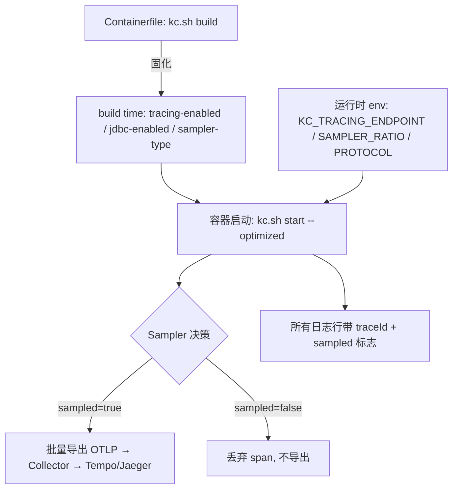

用户报「登录转圈 5 秒」，你去翻 Keycloak 日志，只看到一条 `LOGIN` 事件的时间戳——没有耗时分解。一次登录在 Keycloak 内部会串起 PostgreSQL 查询、LDAP 绑定、上游 IdP 的 HTTP 往返三段外部依赖，事件日志只能告诉你「有没有成功」，不能告诉你「慢在哪一段」。

OpenTelemetry 追踪补的就是这段空白，但 Keycloak 的 tracing 配置有一个绕不开的特性：**开启开关和采样器类型是 build time 选项，不是运行时可调参数**。不知道这一点，你会在 Kubernetes 里改完 `KC_TRACING_ENABLED` 然后发现日志里连 traceId 都没出现。

本文基线：**Keycloak 26.7.4**（2026-09-16 发布）。选项类型与默认值核对自 `26.7.4` 标签的 `TracingOptions.java`、`TelemetryOptions.java`、`TracingPropertyMappers.java` 源码与官方 Tracing / Container / Operator 文档，核对日期 2026-09-20。文中标注了哪些是规范/产品行为、哪些是本书建议、哪些是待验证假设。

## 适用与不适用

| 适用 | 不适用 |
|------|--------|
| Keycloak 26.x（Quarkus 发行版），需要定位认证链路耗时、排查 LDAP/IdP 超时 | Keycloak 19 及更早（WildFly 发行版没有这套 OTel 集成） |
| 已经有 OTLP 后端（Tempo、Jaeger、Datadog、Honeycomb 等） | 只想看「错误码分布」——那是审计事件日志和 metrics 的活，不必上追踪 |
| 微服务 + 网关 + IdP 多跳，需要跨系统串一次请求 | 单机单实例、登录延迟稳定在 100ms 以内的小规模部署：投入产出比不高 |

## 最小可运行配置

### 开发环境：先看到一条完整 trace

官方给的最短路径是把 trace 直接打到 Jaeger all-in-one（它自带 OTel collector 和 UI，不用另外装 collector）：

```bash
podman|docker run --name jaeger \
  -p 16686:16686 \
  -p 4317:4317 \
  -p 4318:4318 \
  jaegertracing/all-in-one

# 另开终端：Keycloak 打开追踪（注意是 build time 选项）
bin/kc.sh start-dev --tracing-enabled=true
```

UI 在 `http://localhost:16686`。这条命令来自官方 Tracing 指南，本书环境未实跑，仅作为端口与默认值参照；真正的验证点在第 5 节的日志 traceId。

### 生产：把 build time 选项固化进镜像

官方容器文档推荐用多阶段 Containerfile 预先 `kc.sh build`，再用 `start --optimized` 启动。tracing 的开关必须写在 build 阶段：

```dockerfile
FROM quay.io/keycloak/keycloak:26.7.4 AS builder

ENV KC_DB=postgres
# 以下三项是 build time 选项，必须在这里给，运行时再传会失败
ENV KC_TRACING_ENABLED=true
ENV KC_TRACING_SAMPLER_TYPE=traceidratio
ENV KC_TRACING_JDBC_ENABLED=false

RUN /opt/keycloak/bin/kc.sh build

FROM quay.io/keycloak/keycloak:26.7.4
COPY --from=builder /opt/keycloak/ /opt/keycloak/

# 以下为运行时可调项：改这里无需重建镜像
ENV KC_DB_URL=<DBURL>
ENV KC_DB_USERNAME=<DBUSERNAME>
ENV KC_DB_PASSWORD=<DBPASSWORD>
ENV KC_TRACING_ENDPOINT=http://otel-collector.observability.svc:4317
ENV KC_TRACING_SAMPLER_RATIO=0.02
ENV KC_TELEMETRY_SERVICE_NAME=keycloak-prod
ENTRYPOINT ["/opt/keycloak/bin/kc.sh"]
```

启动命令是 `start --optimized`。

### OTel Collector 侧（参考配置）

Keycloak 默认用 gRPC 协议、批量上报，端点默认 `http://localhost:4317`。Collector 最小链路如下（后端按你的实际部署替换，本书未实测该拓扑）：

```yaml
receivers:
  otlp:
    protocols:
      grpc:
        endpoint: 0.0.0.0:4317
processors:
  memory_limiter:
    check_interval: 1s
    limit_percentage: 75
  batch: {}
exporters:
  otlp/tempo:
    endpoint: tempo.observability.svc:4317
    tls:
      insecure: true
service:
  pipelines:
    traces:
      receivers: [otlp]
      processors: [memory_limiter, batch]
      exporters: [otlp/tempo]
```

### Kubernetes Operator：用 CR 而不是 env

Operator 有 first-class 字段，不需要自己拼环境变量（Keycloak CR `v2beta1`）：

```yaml
spec:
  tracing:
    enabled: true
    endpoint: http://otel-collector.observability.svc:4317
    samplerType: parentbased_traceidratio   # 默认 traceidratio
    samplerRatio: 0.01                      # 默认 1
  additionalOptions:
    # tracing-jdbc-enabled 没被提升为顶层字段（官方说明：未来可能不再维护该开关）
    - name: tracing-jdbc-enabled
      value: "false"
    # 需要带认证头上报时（值放 Secret，不要写在 CR 明文里）
    - name: tracing-header-Authorization
      secret:
        name: otel-collector-auth
        key: token
```

一个容易踩的细节：Operator 会**自动注入** `KC_TRACING_SERVICE_NAME` 和 `KC_TRACING_RESOURCE_ATTRIBUTES` 两个环境变量（后者至少含 `k8s.namespace.name`）。而官方已把 `tracing-service-name` / `tracing-resource-attributes` 标记为 deprecated，改用 `telemetry-service-name` / `telemetry-resource-attributes`，且后者**优先级更高**。所以想固定 `service.name`，请在 `additionalOptions` 里设 `telemetry-service-name`，不要跟 Operator 注入的旧名变量较劲（这一点是本书从两组官方说明推导的，未逐版本实测 Operator 注入行为）。

## 三个 build time 选项：真正卡人的地方

`TracingOptions.java` 里只有三个选项带 `.buildTime(true)`：

| 选项 | 类型 | 默认值 | 依据 |
|------|------|--------|------|
| `tracing-enabled` | **build time** | `false` | 源码 `.buildTime(true)` |
| `tracing-jdbc-enabled` | **build time** | `true` | 源码 `.buildTime(true)` |
| `tracing-sampler-type` | **build time** | `traceidratio` | 源码 `.buildTime(true)` |
| `tracing-sampler-ratio` | runtime | `1.0` | 无 buildTime 标记；官方说明可运行时可设 `0.0` 完全关闭采样 |
| `tracing-endpoint` | runtime | `http://localhost:4317` | 无 buildTime 标记 |
| `tracing-protocol` | runtime | `grpc` | 无 buildTime 标记 |
| `tracing-infinispan-enabled` | runtime | `true` | 无 buildTime 标记 |
| `tracing-compression` | runtime | `none` | 无 buildTime 标记 |

官方文档对 `start --optimized` 的规则说得很直接：

- 启动时传的 build 选项**值等于** build 阶段用的值 → 该选项被静默忽略（已固化在镜像里）；
- 值**不同** → **直接报错**，必须先重新 build 才能生效。



图里两个要点：第一，`tracing-enabled` 走的是左边那条被固化的路径，右边运行时 env 改不动它；第二，**采样决策只影响 span 是否导出，不影响日志里 traceId 的生成**——所以「采不到 trace」和「日志里没有 traceId」是两个独立的故障，排查方向不同（见第 6 节）。

诊断命令：

```bash
# 查看当前实际生效的构建选项与运行时选项（含来源）
bin/kc.sh show-config | grep -i tracing

# 只列 build 选项（可用于 CI 校验镜像是否带 tracing）
bin/kc.sh build --help | grep tracing
```

顺带一提，26.7.4 的源码里还有 `telemetry-logs-enabled` / `telemetry-metrics-enabled` 一族选项，可以把日志和指标也通过 OTLP 推送（两者默认 `false`，同样是 build time 选项；`telemetry-metrics-interval` 默认 `60s`，为运行时选项）。它们是 tracing 的补充而不是替代：指标走 OTLP 推送和 Prometheus 拉 `/metrics` 是两条独立链路，选一条即可，不必都开。

## 采样与成本：默认值就是「全采」

官方给的两个默认值组合起来，是生产环境最容易翻车的地方：

- `tracing-sampler-type` 默认 `traceidratio`，而 `tracing-sampler-ratio` 默认 **1.0**，意思是**每一条 trace 都上报**；
- `tracing-jdbc-enabled` 默认 **true**：Keycloak 会为出站数据库访问（包括获取连接）生成 span；
- `tracing-infinispan-enabled` 默认 **true**：嵌入式 Infinispan 也生成 span。

也就是说，一次登录请求产生的 span 数量远不止 1（HTTP 入口 + 若干 SQL + 可能的 LDAP / IdP HTTP 调用），而默认配置下它们**全部**进后端存储。上线前必须先把 ratio 降下来：

```bash
# 生产起手值：先按 1%~2% 采，观察量和存储增长后再调
KC_TRACING_SAMPLER_RATIO=0.02
```

采样率的量级估算不要靠猜，用你现有的认证 QPS 反推：`每秒 span 数 ≈ 认证 QPS × 采样率 × 单次请求平均 span 数`。单次平均 span 数可以直接在 Jaeger/Tempo 里挑一条 trace 数出来（开了 JDBC tracing 的实例通常两位数）。先按 24 小时观察存储增量，再决定长期值。

采样器类型还有一个安全取舍，官方文档专门讲了，中文资料基本没提：

- `traceidratio`（默认）**不继承父 span 的采样决策**。代价是 trace 可能不完整（父 span 采了、子 span 没采），好处是外部调用方无法通过注入 `traceparent` / `tracestate` 头把采样率拉满、把你的 trace 存储打爆；
- `parentbased_traceidratio` 保证父子 span 采样一致、trace 完整，但正因为继承父决策，**伪造的父 span 会连带放大采样量**，官方明确提到需要配合调用方信任评估和 `tracestate` 头过滤（参见 W3C Trace Context 的安全考量）。

**本书建议**：面向公网的 Keycloak（登录入口）保留默认 `traceidratio`；只有在内网、上游 caller 可控的场景（例如只被网关调用的内部 IdP）才考虑 `parentbased_traceidratio` 换取 trace 完整度。切换采样器类型要重新 build 镜像，别指望运行时改。

## 验证

1. **日志里出现 traceId**（最快的一步，不需要后端就绪）：

   ```bash
   kubectl logs deploy/keycloak -n keycloak --tail=200 | grep -o 'traceId=[a-f0-9]*' | tail -3
   ```

   正常输出形如 `traceId=b636ac4c665ceb901f7fdc3fc7e80154`，同一请求的所有日志行 traceId 相同。若完全搜不到，先看「常见错误表」里「日志里完全没有 traceId」那一行。

2. **`sampled` 标志**：日志行里带 `sampled=true|false`。`sampled=false` 说明采样把它丢了——后端里查不到是预期行为，不是 exporter 故障。

3. **后端能看到服务**：在 Jaeger/Tempo 里按 `service.name`（默认 `keycloak`，被 `telemetry-service-name` 覆盖）查询。Keycloak 给 span 打的业务标签统一带 `kc.` 前缀，定位具体用户/客户端时用 `kc.realmName`、`kc.clientId`、`kc.sessionId`、`kc.token.sid`、`kc.authenticationSessionId` 这些标签过滤，比按时间翻快得多。

4. **让用户把 traceId 报给你**：Keycloak base 登录主题的 `error.ftl` 默认已经渲染 traceId（Freemarker 变量名 `traceId`）。自定义主题时保留这个变量，报错页截图里就带着 ID，能直接跳到那条 trace，也能在 Loki/ELK 里捞同一请求的全部日志行。这是把追踪接进工单流程的最低成本做法。

## 常见错误表

| 症状 | 根因 | 处理 |
|------|------|------|
| `start --optimized` 启动失败，提示 build 选项值不一致 | `KC_TRACING_ENABLED`（或 sampler-type/jdbc-enabled）只在运行时给了值 | 把该选项移到 Containerfile 的 `kc.sh build` 阶段，重建镜像；或暂时去掉 `--optimized` 让启动时自动 build |
| 开关都配了，Jaeger 里没有 `keycloak` 服务 | `tracing-endpoint` 仍是默认 `http://localhost:4317`，在容器里指向的是 Keycloak 自己 | 改成 Collector 的 Service DNS 与端口 |
| 协议改 `http/protobuf` 后上报 404 / 路径不对 | Keycloak 的 `tracing-endpoint` 映射到的是 **信号专属** OTLP 端点（`quarkus.otel.exporter.otlp.traces.endpoint`）。按 OTLP 规范，只有非信号专属变量才会自动补 `/v1/traces`，信号专属端点原样使用 | 显式写全路径：`http://otel-collector.observability.svc:4318/v1/traces` |
| 日志里完全没有 traceId | ① tracing 未启用；② 显式设置了 `log-console-format` / `log-file-format`——官方明确说明此时 `*-include-trace` 不生效，追踪信息不会注入 | 去掉自定义 format，或在自定义 format 里自行加 traceId 占位；用 `show-config` 确认 `tracing` 相关项生效 |
| 改了采样器类型不生效 | `tracing-sampler-type` 是 build time 选项 | 重新 build；只想降量就先改运行时的 `tracing-sampler-ratio` |
| trace 存储量/成本远超预期 | 默认 ratio=1.0 全采，且 JDBC、Infinispan span 默认开启 | 运行时降 `tracing-sampler-ratio`；必要时 build 阶段关 `tracing-jdbc-enabled` |
| Operator 部署下 `service.name` 不是自己设的值 | Operator 注入 `KC_TRACING_SERVICE_NAME`；而 `telemetry-service-name` 优先级更高 | 在 `additionalOptions` 中设 `telemetry-service-name` |
| 排错时 trace 里查不到用户报错的那次请求 | 该 trace `sampled=false`，从未导出 | 看日志里的 ID 和 `sampled` 标志；需要复现时临时提高 ratio（如 1.0）再让用户重试一次 |

## 回滚

按影响面从小到大：

```bash
# 1) 应急止血：运行时把采样率降到 0，立即停止向后端写入（无需重启镜像重建）
kubectl set env deploy/keycloak -n keycloak KC_TRACING_SAMPLER_RATIO=0

# 2) 彻底关闭（多阶段镜像）：从 Containerfile 的 build 阶段去掉 KC_TRACING_ENABLED，重建并滚动更新
# 3) Operator 部署：把 spec.tracing.enabled 置 false，再观察滚动更新
kubectl patch keycloak keycloak -n keycloak --type=merge -p '{"spec":{"tracing":{"enabled":false}}}'
kubectl rollout status statefulset/keycloak -n keycloak
```

回滚后的验证：新请求的日志行不再带 traceId，后端服务的 span 数停止增长。

两个注意点：

- 关闭 tracing **不影响认证、授权、Token 签发**，是纯可观测性开关；
- 如果日志采集链路（Loki/ELK 的解析规则、看板、告警）已经依赖 traceId 字段，先确认下游不会因为字段消失而报错，再执行第 2/3 步。第 1 步（ratio=0）只停导出、不动 tracing 开关，按 FAQ Q4 的推断日志字段仍然保留，所以要单独确认这一点后再决定是否用它过渡。

## IAM 可观测性 FAQ

**Q1：Keycloak 的 tracing 和 IAM 审计日志是同一件事吗？**

不是，两者互补但不能互相替代。审计事件（`LOGIN`、`LOGOUT`、`REFRESH_TOKEN` 等）回答「谁在什么时候做了什么事」，是合规取证的事实来源；trace 回答「这次请求的 5 秒耗在哪一段」，是排错工具。特别注意：`sampled=false` 的请求不会进 trace 后端，所以任何合规结论都不能依赖追踪数据。审计侧的做法见 [Keycloak 审计日志配置与 IAM 合规实践]()。

**Q2：IAM 系统的 trace 采样率应该定多少？**

IAM 有明确的流量特征：登录请求集中在上班前后，其余时段很低。建议对 Keycloak 用固定低比例（1%~2%）而不是 `always_on`，同时对登录失败率、P95 延迟用 metrics 做告警（见 [Keycloak Prometheus 监控指标详解]()），需要细节时再临时提高采样率复现。追踪负责「出问题时能看细节」，metrics 负责「平时发现异常」，别让追踪承担监控职责。

**Q3：多租户 IAM（多 Realm）怎么在 trace 里区分？**

Keycloak 已经给每个 span 打了 `kc.realmName` 和 `kc.clientId` 标签，不需要自己加埋点。在 Jaeger/Tempo 里按这两个标签过滤即可；如果要把 trace 量和租户成本对应起来，注意默认的 `traceidratio` 是按 trace 独立随机的，不是按租户配额采样，大租户自然产生更多 trace。

**Q4：没有 Tempo/Jaeger，只想用 traceId 把一次请求的日志串起来，可行吗？**

可行，做法是启用 tracing 但把导出关掉。官方文档说明 `tracing-sampler-ratio` 可以在**运行时**设为 `0.0` 完全关闭采样，而日志中的 traceId 与 `sampled` 标志由追踪上下文生成——**「日志里仍有 traceId、后端里没有 trace」这个组合是本书的待验证假设**，因为它依赖「traceId 生成独立于采样决策」这一 W3C Trace Context 语义。验证方法：设 `KC_TRACING_SAMPLER_RATIO=0` 重启后抓两条请求的日志，若仍能看到形如 `traceId=..., sampled=false` 的行，则假设成立（此时只产生ID、零导出流量）。

## 参考来源

- [Keycloak — Root cause analysis with tracing](https://www.keycloak.org/server/tracing)（选项默认值、span 范围、日志 traceId、采样器取舍、Operator 注入行为）
- [Keycloak 26.7.4 `TracingOptions.java`](https://github.com/keycloak/keycloak/blob/26.7.4/quarkus/config-api/src/main/java/org/keycloak/config/TracingOptions.java)（三个 build time 选项的源码依据）
- [Keycloak 26.7.4 `TelemetryOptions.java`](https://github.com/keycloak/keycloak/blob/26.7.4/quarkus/config-api/src/main/java/org/keycloak/config/TelemetryOptions.java)（`telemetry-*` 选项族）
- [Keycloak 26.7.4 `TracingPropertyMappers.java`](https://github.com/keycloak/keycloak/blob/26.7.4/quarkus/runtime/src/main/java/org/keycloak/quarkus/runtime/configuration/mappers/TracingPropertyMappers.java)（`tracing-endpoint` → 信号专属 OTLP 端点映射）
- [Keycloak — Configuring Keycloak](https://www.keycloak.org/server/configuration)（`start` 自动 build、`--optimized` 对 build 选项的处理规则）
- [Keycloak — Running Keycloak in a container](https://www.keycloak.org/server/containers)（多阶段 Containerfile 与 `start --optimized` 官方范式）
- [Keycloak — Operator advanced configuration: Tracing](https://www.keycloak.org/operator/advanced-configuration)（`spec.tracing` 字段与 `additionalOptions` 用法）
- [Keycloak 26.0.0 release notes](https://www.keycloak.org/2024/10/keycloak-2600-released)（该能力引入时状态为 preview）
- [OpenTelemetry — OTLP exporter 端点规范](https://github.com/open-telemetry/opentelemetry-specification/blob/main/specification/protocol/exporter.md)（信号专属端点不追加 `/v1/traces`）

延伸阅读：[第 23 章 IAM 监控与可观测性]()、[Keycloak 生产巡检与运维清单]()、[Keycloak 集群缓存调优与排错]()。
