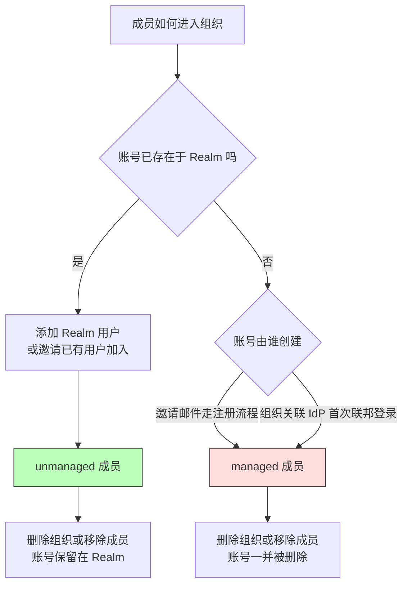

## 场景

一个 Realm 要同时服务多个外部企业客户时，per-Realm 方案的成本会先于隔离收益出现：每个 Realm 都自带一整套默认 client、role、client scope 和管理配置，改一次公共策略要遍历所有 Realm，租户数一多，管理 API 的耗时本身就成了基线问题。

Keycloak Organizations 提供了第三条路：**在同一个 Realm 内用组织（Organization）建模 B2B 租户**。用户仍然是 Realm 用户，但通过组织归属获得受限的上下文——包括独立的成员集合、独立的组织组层级、独立绑定的上游 IdP 和独立的邮件域名路由。它没有把 Realm 变小，而是把「租户」从配置边界变成了 Realm 内的运行时数据对象。

这篇文章只讲落地时会真正卡住的地方：成员到底是 managed 还是 unmanaged、claim 为什么是空的、存量 Realm 打开开关后为什么什么都没发生。

## 适用 / 不适用

| 适用场景 | 不适用场景 |
|----------|------------|
| B2B / B2B2C：一个 Realm 对接多个企业客户、合作伙伴或部门 | 租户之间需要独立的签名密钥、独立数据库或独立故障域——这些边界 Organizations 不提供 |
| 每个租户要用自己企业的 IdP 登录（Bring Your Own IdP） | 需要为每个租户定制完全不同的登录主题与整套认证策略（组织可以改变认证流分支，不等于全套策略隔离） |
| 希望按邮箱域名自动把用户路由到对应组织，并强制成员使用本组织域名 | 无法控制组织成员邮箱域名的场景（域名不是必填，但缺省时也不做域名校验，此时不适合靠域名做租户识别） |
| 需要把租户成员自助管理权限委派出去（26.7 起有细粒度委派） | 仍在 Keycloak 25 及更早版本——25 的 Organizations 是 technology preview，26.0 才正式支持 |

多租户隔离模式（共享 IDP、独立 Realm、联邦 IDP）的完整对比与选型决策树见 [多租户 IAM 架构设计与方案对比]()；Organizations 是其中「共享 IDP + 逻辑隔离」在 Keycloak 上的原生实现方式。

## 版本边界：先确认你手上的版本能做什么

Organizations 的能力是分版本长出来的，照抄任何一篇不分版本的教程都会踩空：

| 能力 | 起始版本 | 说明 |
|------|---------|------|
| Organizations 正式支持 | 26.0 | 25 为 technology preview，需以 `--features organization` 启动；26.0 起为 supported |
| 组织域名可留空 | 26.4 | 26.4 之前每个组织至少需要一个邮件域名 |
| 组织组（Organization Groups） | 26.6 | 每个组织独立的组层级，同名路径不再冲突 |
| 组织组的角色继承 | 26.7 | 组织组可承载 realm / client 角色映射，自动进入成员的 role claim |
| 组织管理细粒度委派 | 26.7 | 新增 `manage-organizations`、`query-organizations` |

> 26.0 之前（25）的部署方式不要照抄到 26.x：preview 时期靠服务器启动参数启用，26.x 的启用位置在 Realm 级。如果升级后的部署里还挂着 25 时代的 `--features organization`，先对照官方 features 文档确认是否仍需要保留。

## 最小配置

### 1. 打开 Realm 级开关

Realm Settings → **Organizations** → On → Save。按官方 26.6 文档，组织能力的启用只涉及这一个 Realm 级开关，开关打开后菜单里才出现 Organizations 段。组织是 Realm 内的对象，不会自动出现在其他 Realm。

### 2. 建组织：字段语义比表单看起来更重要

| 字段 | 关键约束 |
|------|---------|
| Name | Realm 内唯一，面向用户展示 |
| Alias | Realm 内唯一、必须 URL 友好；**一旦设定不能再修改**，未填时会尝试用 Name 推导 |
| Domains | 一个域名不能同时属于同一 Realm 内的两个组织 |
| Redirect URL | 接受邀请或完成注册后的跳转目标，留空则回到 Account Console |
| Attributes | 多值 key/value，可随 claim 一起下发 |
| Enabled | 关闭后组织仍可管理，但成员认证行为会变（见回滚一节） |

Alias 不可变这一条值得单独记住：它和 Identity Provider alias 在 26.7.0 起不可修改是同一类设计变化。任何「重命名租户」的自动化脚本都要改成「新建并迁移引用」，不要依赖就地改别名。

Domains 的行为要按业务确认两点：一是域名可以留空，但**留空意味着认证和 profile 校验都不做域名限制**，此时不能把域名当作租户识别依据；二是配置了域名后，Keycloak 会用邮箱域名去匹配组织，这既是自动路由的基础，也是强制成员使用本组织邮箱的手段——特别是在成员身份来自组织关联 IdP 时。

### 3. 成员如何进入组织：managed 与 unmanaged 是必须做的决策

成员有四条接入路径，路径决定了账号的生命周期归属：



| 成员类型 | 产生方式 | 事实来源 | 删除组织 / 移除成员时 |
|---------|---------|---------|---------------------|
| managed | 邀请邮件注册新账号、组织关联 IdP 联邦登录 | 组织是唯一事实来源 | 账号一并被删除 |
| unmanaged | 已有的 Realm 用户被加入组织 | Realm 是唯一事实来源 | 账号保留在 Realm，只解除组织关联 |

这条区分直接决定两个生产问题：**删组织会不会带走账号**，以及**账号该由谁负责生命周期**。让 HR 系统管的员工账号应该是 unmanaged，走组织 IdP 联邦进来的外部客户账号才是 managed。

四条路径里两条走邀请。邀请有 Pending / Expired 状态，被接受后邀请记录自动删除，也可重发或删除；这些操作都能通过 Admin REST API 完成，方便把租户入驻接进工单系统。还有一条硬限制：**LDAP provider 关闭 import 模式时，非导入用户不能加入组织**——因为成员关系需要落库，而这类用户既不在本地库也不在 LDAP 里同步。要用组织承接 LDAP 用户，先把 import 模式打开。

### 4. 让 organization claim 出现在 token 里

`organization` 是 Realm 内置的 optional client scope，默认会加到 Realm 内新建的 client 上——也就是说，**默认不会自动下发，客户端要显式请求**：

| 请求格式 | 映射结果 |
|---------|---------|
| `organization` | 用户只属一个组织时映射该组织；属多个组织时会在认证时要求用户选择 |
| `organization:<alias>` | 只映射指定 alias 的组织 |
| `organization:*` | 映射用户所属的全部组织 |

请求到 scope 之后拿到的 claim 形状如下，key 是组织 alias：

```json
{
  "organization": {
    "acme-corp": {
      "id": "f8d3c4e1-...",
      "groups": ["/Engineering/Backend"]
    }
  }
}
```

两个默认值最容易误导人：**组织 id 和 attributes 默认不在 claim 里**，要在 Organization Membership mapper 上打开 *Add organization id* / *Add organization attributes* 才会出现。

组织组要进 token 则是另一个坑：**Organization Group Membership mapper 单独加不生效**，它必须与 Organization Membership mapper 处在同一个 scope 里（内置的 `organization` scope 已经包含后者，最省事的做法就是把组 mapper 加到这个 scope）。26.7 起这个 mapper 还多一个 *Add group role mappings* 选项，可以把组织组承载的角色映射一并带进 claim。

### 5. 存量 Realm：只打开开关是不够的

新建 Realm 时，浏览器流和 first broker login 流会自动带上组织相关步骤。**存量 Realm 不会**——这是启用 Organizations 之后「登录页看起来毫无变化」的最常见原因。需要手工改两条流，改之前先把当前流复制一份，避免直接动正在生效的绑定：

**Browser 流**

1. 在 Identity Provider Redirector 之后插入一个子流（Alternative），例如 `My Organization`
2. 在该子流内插入条件子流（Conditional），加 `Condition - user configured`（Required）
3. 在条件子流内加 `Organization Identity-First Login` 执行步骤（Alternative）
4. 需要「只允许组织成员登录」时，在该执行步骤的设置里打开 **Requires user membership**；不满足时会直接显示错误页
5. 把 Browser 绑定切到新流

**First broker login 流**

1. 复制当前绑定到 First broker login 的流
2. 加一个 `Organization Member - Conditional` 子流（Conditional），内置 `Condition - user configured`（Required）
3. 加 `Organization Member Onboard` 执行步骤（Required），让联邦用户完成首次登录后自动成为组织成员
4. 把绑定切到新流

组织关联的 IdP 上还有一个开关会影响入驻路径：打开 *Redirect when email domain matches* 后，用户输入邮箱即被直接重定向到该组织的 IdP；关闭它但保持 *Hide on login page* 为关闭，用户则可以在登录页手动选择该 IdP。

## 验证

先确认组织对象和成员关系，再确认 token 内容——顺序反了会分不清是配置问题还是 claim 映射问题。

```bash
KC=https://auth.example.com

# 管理 token
ADMIN_TOKEN=$(curl -s -X POST "$KC/realms/master/protocol/openid-connect/token" \
  -d client_id=admin-cli -d username=admin -d password="$ADMIN_PWD" \
  -d grant_type=password | jq -r .access_token)

# 建组织：alias 生成后不可再改
curl -s -X POST "$KC/admin/realms/acme/organizations" \
  -H "Authorization: Bearer $ADMIN_TOKEN" -H "Content-Type: application/json" \
  -d '{"name":"Acme Corp","alias":"acme-corp","domains":["acme.example.com"]}'

# 列表与成员
curl -s "$KC/admin/realms/acme/organizations" \
  -H "Authorization: Bearer $ADMIN_TOKEN" | jq '.[] | {id,name,alias,domains}'

# 邀请新账号（走注册流程 → managed 成员）
curl -s -X POST "$KC/admin/realms/acme/organizations/$ORG_ID/members/invite-user" \
  -H "Authorization: Bearer $ADMIN_TOKEN" -H "Content-Type: application/json" \
  -d '{"email":"ops@acme.example.com"}'

# 邀请已有用户加入（→ unmanaged 成员）
curl -s -X POST "$KC/admin/realms/acme/organizations/$ORG_ID/members/invite-existing-user" \
  -H "Authorization: Bearer $ADMIN_TOKEN" -H "Content-Type: application/json" \
  -d '{"id":"'"$USER_ID"'"}'

# 查看邀请状态
curl -s "$KC/admin/realms/acme/organizations/$ORG_ID/invitations" \
  -H "Authorization: Bearer $ADMIN_TOKEN" | jq '.[] | {email,status,expiresAt}'
```

> 组织相关的管理端点在 Admin REST API 里统一挂在 `/admin/realms/{realm}/organizations/...` 下；组织组的子资源是 `/organizations/{org-id}/groups`，也支持通过 group-by-path 按路径查询。部分文档正文把这段前缀简写成 `orgs`，以官方 REST API 参考为准。

拿一个带着 `organization` scope 的 token，直接解码看 claim：

```bash
# token 先写入 /tmp/token.txt，然后用 python 解码 payload（base64url 需补 padding）
python3 - <<'PY'
import base64, json
tok = open('/tmp/token.txt').read().strip()
p = tok.split('.')[1]
p += '=' * (-len(p) % 4)
print(json.dumps(json.loads(base64.urlsafe_b64decode(p)).get('organization'),
                 indent=2, ensure_ascii=False))
PY
```

claim 为 `null` 时按三步定位：client 有没有请求 scope、用户是否真的属于某个组织、组织是否被禁用。

## 常见错误表

| 症状 | 根因 | 定位 / 修复 |
|------|------|------------|
| 存量 Realm 打开开关后登录页毫无变化 | 没有修改 Browser 流 | 按上文插入 `Organization Identity-First Login` 子流，再把绑定切过去 |
| 联邦用户登录成功但没进组织 | First broker login 流缺少 `Organization Member Onboard` | 在条件子流里补上该执行步骤并设为 Required |
| token 里没有 `organization` claim | 客户端没请求 `organization` scope | 在授权请求里带上 scope；注意默认不会自动下发 |
| claim 里有 alias 但没有 id / attributes | mapper 默认不含这两项 | 在 Organization Membership mapper 打开 *Add organization id* / *Add organization attributes* |
| 加了组织组 mapper，groups 仍不出现 | 同 scope 内缺少 Organization Membership mapper | 把组 mapper 加到内置 `organization` scope，或自建一个同时含两个 mapper 的 scope |
| 某个 LDAP 用户无法加入组织 | LDAP provider 关闭了 import 模式 | 打开 import 模式；非导入用户无法建立组织成员关系 |
| 保存组织时报域名冲突 | 域名在 Realm 内已被其他组织占用 | 域名不能跨组织共享，先确认现有组织的 Domains |
| 删除组织后用户跟着消失 | 该用户是 managed 成员 | 删除前先通过 `/organizations/{org-id}/members` 导出清单，确认哪些是 managed |
| 组织组无法用于授权策略 | 设计如此 | 组织组不能用于 Keycloak authorization policies，需要 realm group；角色映射能力另见 26.7 的角色继承 |
| 组织管理员权限过大或过小 | 26.7 之前没有组织级细粒度权限 | 26.7 起用 `manage-organizations` / `query-organizations`；注意 `manage-realm` 仍隐式包含全部组织管理权限 |

涉及细粒度权限与委派管理的整体设计，参见 [Keycloak 细粒度权限与授权策略实战]()；组织成员的上游同步与生命周期自动化，参见 [IAM SCIM 用户自动配置实战]() 与 [Keycloak LDAP / AD 用户联邦]()。

## 选型边界：Organizations 缓解的是重复，不是边界

Organizations 解决的是配置与运维上的重复：不必为每个客户建 Realm，公共 client、scope、策略只维护一份。但它不提供独立的签名密钥、独立的数据库、独立的备份粒度或独立的故障域——组织是同一 Realm 共享进程和存储里的数据对象。

所以混合模式通常是更实际的答案：**对少数有强隔离诉求的大客户保留 per-Realm（或独立实例），把长尾客户放进 Organizations**。判断依据不是租户数量，而是这个客户是否需要独立的密钥边界、独立恢复窗口或独立性能 SLA。Realm 数量带来的启动、管理 API 与缓存开销，需要按目标版本和真实数据做容量测试，不能套用一个数字阈值。

## 回滚

回滚要分三层看，因为这三层可逆性完全不同：

**认证流改动（可逆）**：改流前复制了原流，把 Browser / First broker login 的绑定切回原流即可，组织数据不受影响。

**Realm 级开关（可逆）**：关闭 Organizations 开关后，组织本身仍可在管理界面里维护，但行为会变——managed 成员不能再认证进 Realm，组织关联的 IdP 也会被自动禁用；unmanaged 成员本身还是 Realm 用户，仍能登录，只是 token 里不再带该组织的元数据。重新打开开关即恢复。

**删除组织（不可逆）**：删除组织会连同其 managed 成员账号一起清除，unmanaged 用户和 IdP 会保留在 Realm 但解除关联。这一步没有撤销手段，唯一的保护是删除前导出成员清单并确认 managed / unmanaged 归属。

**版本回退**：组织数据是 Realm 内的数据库对象。把 Keycloak 镜像回退到不支持 Organizations 的版本之前，必须先确认该版本能识别这些数据；像对待其他数据库迁移一样，先在隔离环境用升级前快照验证恢复，不要直接拿生产库做降级实验。

## 延伸阅读

- [Keycloak 26.0.0 released（Organizations 正式支持）](https://www.keycloak.org/2024/10/keycloak-2600-released)
- [Keycloak 26.7.0 released（组织组角色继承、组织管理细粒度委派）](https://www.keycloak.org/2026/07/keycloak-2670-released)
- [Organization Groups: Structure Your Organizations with Hierarchical Group Management](https://www.keycloak.org/2026/04/org-groups)
- [Keycloak Release Notes（26.4 起组织域名可留空）](https://www.keycloak.org/docs/latest/release_notes/index.html)
- [Keycloak Server Administration Guide — Managing organizations](https://www.keycloak.org/docs/latest/server_admin/)
- [Keycloak Admin REST API 参考（organizations 端点）](https://www.keycloak.org/docs-api/latest/rest-api/index.html)
- [多租户 IAM 架构设计与方案对比]()
- [Keycloak LDAP / AD 用户联邦]()
- [身份联邦与代理]()
