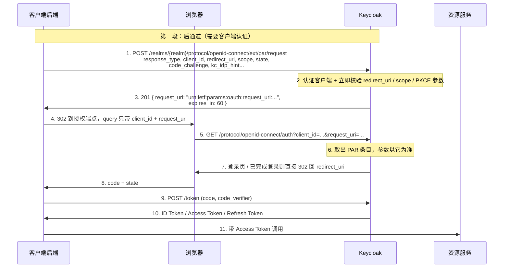

## 场景

- 安全评审要求：`redirect_uri`、`scope`、`kc_idp_hint`、`resource` 这些参数不许出现在浏览器地址栏，也不许出现在前置 Nginx / 网关的 access log 里。
- 你在 Keycloak 客户端 Advanced settings 里打开了 **Pushed Authorization Request Required**，然后 oauth2-proxy、Dex 上游、kube-apiserver 的 OIDC 认证接连失败，用户被弹回应用并带上 `error=invalid_request&error_description=Pushed Authorization Request is only allowed.`
- 另一个方向的误判：以为「客户端用了 PAR」就等于「参数不会被篡改」，但客户端仍然把 `state`、`kc_idp_hint` 拼在授权 URL 上发出去——参数一旦走到前置通道，谁改的都不好查。

本文只回答 PAR 落地时的四个具体问题：在 Keycloak 上怎么开、开完哪些集成方会断、报错怎么区分是谁拦的、怎么退回去。OAuth 2.0 授权码流程与 PKCE 的基础机制不在这里重复，见文末相关章节。

适用：Keycloak 26.x（本文基线 26.7.x，源码结论取自 `keycloak/keycloak` `main` 分支，核查日期 2026-09-13）；FAPI 2.0、金融、政企等保这类要求授权请求完整性保护的项目。

不适用：无法改造的第三方 SaaS 回调（绝大多数不支持 PAR，见下文「谁还不支持 PAR」）；纯 client credentials / service account 场景——没有前端授权请求，PAR 不参与；以及只想「让 URL 短一点」的诉求，那属于工程洁癖，不值得为它牺牲集成兼容性。

## PAR 改变了什么

RFC 9126 把一次授权请求拆成两段，前端只留一个不透明引用：



关键点看图：

- **第 1-3 步是一次「先验后放」**：`redirect_uri`、`scope`、`code_challenge` 这些参数在用户还没看到登录页之前就被校验过一次。参数非法时错误直接返回给客户端后端，浏览器连跳转都不会发生——这比「用户登录完再报错」的体验和排查成本都低得多。
- **第 4-5 步是 PAR 唯一的目的**：前端通道只承载 `client_id` 和不透明引用，参数没有落进 URL、Referer、浏览器历史和代理日志的机会。
- **第 6 步是语义变化最容易被忽略的地方**：授权端点上的参数以 PAR 条目为准，而不是以 query 为准。所以「改一下 URL 参数再刷一次」这类操作在 PAR 下不再有意义——这正是防篡改的实际机制。
- **第 9-10 步的 PKCE 不受影响**：`code_verifier` 是 token 请求阶段的参数，从来不走前端通道。

三个典型采用场景：多 IdP/多租户下必须钉住 `kc_idp_hint` 与 `scope` 的场景；授权参数被 RAR（`authorization_details`）、多 resource 撑长、逼近 URL 长度上限的场景；前置代理会把完整 query 写进访问日志、而参数本身属于合规敏感信息的场景。反过来，如果这三条都不成立，PAR 带来的收益有限，先别动。

## Keycloak 端：两种强制方式，报错完全不同

Keycloak 里「要求客户端使用 PAR」有两条路径，它们拦的是同一个行为，但抛出的事件和错误码不一样——**排查时必须先分清是哪一条在拦**。

### 方式一：客户端属性（粗粒度）

Admin Console → Clients → 目标客户端 → **Advanced settings** → *Pushed Authorization Request Required* 设为 `On`；等价的客户端属性是：

```
require.pushed.authorization.requests
```

用 Admin CLI 或 partial import 写配置时用的是这个字符串（源码常量 `ParConfig.REQUIRE_PUSHED_AUTHORIZATION_REQUESTS`）：

```bash
# 让该客户端只能通过 PAR 发起授权
kcadm.sh update clients/<CLIENT_INTERNAL_ID> \
  -s 'attributes."require.pushed.authorization.requests"=true'
```

行为特征：授权端点收到一个不带 PAR 类型 `request_uri` 的请求时，`AuthorizationEndpointChecker.checkParRequired()` 抛出校验异常，Keycloak **把错误重定向回客户端的 redirect_uri**：

```
error=invalid_request
error_description=Pushed Authorization Request is only allowed.
```

服务端日志同时出现 `Missing parameter: request_uri`。注意这是「回跳到应用并带错误参数」，不是 Keycloak 自己的报错页——如果你的应用没有渲染 `error_description`，用户只会看到一个空白页或「登录失败」，容易误判成网络问题。

一个必须知道的元数据陷阱：Keycloak 的 `/.well-known/openid-configuration` 里 `require_pushed_authorization_requests` 是**硬编码的 `false`**（`OIDCWellKnownProvider` 中直接 `setRequirePushedAuthorizationRequests(Boolean.FALSE)`）。原因不复杂——这个字段是 realm 级元数据，而「必须用 PAR」是客户端级策略，两者无法表达。后果是：**不要指望客户端库读元数据后自动切换到 PAR**。Quarkus OIDC 就是一个典型例子，它会在元数据声明必须 PAR 时自动启用，但面对 Keycloak 你必须显式写 `quarkus.oidc.authentication.par.enabled=true`。

### 方式二：client policy 的 `secure-par-content`（细粒度，FAPI 2.0 profile 自带）

Keycloak 内置的 `fapi-2-security-profile`、`fapi-2-message-signing`、`fapi-2-dpop-security-profile`、`fapi-2-dpop-message-signing` 四个 profile 里都挂了 `secure-par-content` executor（见 `keycloak-default-client-profiles.json`）。它比客户端属性严格得多：

| 检查点 | 触发条件 | 返回 |
|--------|---------|------|
| PAR 必须带 `redirect_uri` | PAR 请求缺 `redirect_uri` | `invalid_request`：`PAR is required to have a 'redirect_uri' parameter` |
| 授权请求必须是 PAR | 授权端点未带 PAR 类型 `request_uri` | `invalid_request`：`PAR request_uri not included.` |
| request_uri 必须存在 | 单次使用存储里查不到 | `invalid_request_uri`：`PAR not found, not issued or used multiple times.` |
| 授权端点不得夹带额外参数 | query 里出现了 PAR 条目里没有的参数 | `invalid_request_object`：`PAR request did not include query parameter`，**并且该 request_uri 被立即删除** |

两条推论值得写进上线检查单：

1. **只要 realm 给客户端分配了 fapi-2-* profile，PAR 就已经被强制了**，即使你没动 *Pushed Authorization Request Required*。把 FAPI 2.0 profile 当成「签名算法和 client 认证的合规开关」而忽略 PAR 强制，是上线后才发现的最常见一类事故。
2. 最后一行那个「立即删除」是排错时的坑：客户端多发一个冗余参数（例如自己又拼了一次 `scope`），导致的不是一次失败，而是**这个 request_uri 彻底作废**；用户重试会拿到 `invalid_request_uri`，让根因看起来像「PAR 过期」而不是「参数重复」。

### Realm 级：request_uri 的有效期

Realm Settings → **Tokens** → *Lifetime of the Request URI for Pushed Authorization Request*，对应 realm 属性 `parRequestUriLifespan`，源码默认值 `ParConfig.DEFAULT_PAR_REQUEST_URI_LIFESPAN = 60`（秒）。界面帮助文本写的是「默认 1 分钟」。

这是**整个 realm 一个值，没有客户端级覆盖**。三个实践含义：

- 60 秒只覆盖「PAR 请求成功 → 浏览器落到授权端点」这一小段，正常跳转绰绰有余；它不限制用户在登录页停留多久，也不限制授权码流程整体时长。
- 如果你的拓扑里授权端点和应用之间还有一层 IdP 中转、或者客户端把 `request_uri` 存下来等异步动作，60 秒会很紧，需要把这个值调大——但它是 realm 级的，调大等于放宽所有客户端的重放窗口，别为了一个例外放宽全局。
- 这个值和 SSO Session / Client Session 超时完全无关，不要和 [IAM 会话超时排错]() 里的那套参数混在一起调。

## 最小可运行验证

下面四步在测试 realm 里跑一遍，就能确认 PAR 是否真的生效。域名与凭据用占位符替换。

```bash
# 1) 拿 PAR 端点（不要自己拼 URL，用 discovery）
curl -s https://keycloak.example.com/realms/<REALM>/.well-known/openid-configuration \
  | jq '{pushed_authorization_request_endpoint, require_pushed_authorization_requests}'
```

```bash
# 2) 提交 PAR 请求（机密客户端 + PKCE）
curl -s -i -X POST \
  https://keycloak.example.com/realms/<REALM>/protocol/openid-connect/ext/par/request \
  -u '<CLIENT_ID>:<CLIENT_SECRET>' \
  -H 'Content-Type: application/x-www-form-urlencoded' \
  --data-urlencode 'response_type=code' \
  --data-urlencode 'redirect_uri=https://app.example.com/callback' \
  --data-urlencode 'scope=openid profile email' \
  --data-urlencode 'state=<RANDOM_STATE>' \
  --data-urlencode 'code_challenge=<S256_CHALLENGE>' \
  --data-urlencode 'code_challenge_method=S256'
```

期望 `HTTP/1.1 201 Created`（RFC 9126 §2.2 要求 201，不是 200），响应体形如：

```json
{ "request_uri": "urn:ietf:params:oauth:request_uri:<OPAQUE>", "expires_in": 60 }
```

```bash
# 3) 浏览器只带 client_id + request_uri（把上一步的值 URL 编码后填入）
# https://keycloak.example.com/realms/<REALM>/protocol/openid-connect/auth
#   ?client_id=<CLIENT_ID>&request_uri=urn%3Aietf%3Aparams%3Aoauth%3Arequest_uri%3A<OPAQUE>
```

```bash
# 4) 换 token（与普通授权码流程一致，PKCE 的 code_verifier 照常提交）
curl -s -X POST https://keycloak.example.com/realms/<REALM>/protocol/openid-connect/token \
  -u '<CLIENT_ID>:<CLIENT_SECRET>' \
  -d 'grant_type=authorization_code' \
  -d 'code=<CODE>' \
  -d 'redirect_uri=https://app.example.com/callback' \
  -d 'code_verifier=<VERIFIER>'
```

四个观察点：PAR 返回 201；`expires_in` 等于 realm 的 `parRequestUriLifespan`；授权 URL 里不含除 `client_id`、`request_uri` 之外的参数；同一 `request_uri` 在流程完成前被 Refresh 一次仍能继续（见下一节）。

## request_uri 的「一次性」到底在哪个时刻生效

这一条中文资料几乎没写清楚，而它决定了你排错时该看哪段日志。

源码事实：PAR 参数存放在 `SingleUseObjectProvider` 中（key 前缀 `par:<realmId>:`，TTL 为 realm 的 request_uri 有效期），而删除动作 `AuthzEndpointParParser.removeRequestObject()` 只在两个地方被调用——`OIDCLoginProtocol.authenticationComplete()`（认证完成、准备签发授权码时），以及 `secure-par-content` 判定违规时。

由此得到三条可操作的结论：

1. **认证完成之前**，同一个 `request_uri` 被重复访问是允许的：用户刷新授权页、浏览器预取、Safari/移动端多标签页，都不会让流程失败。RFC 9126 §4 也明确允许授权服务器容忍这类重复。
2. **认证完成之后**复用同一 `request_uri`，条目已被删除，抛出的不是 400 而是 `AuthenticationFlowException`（`PAR not found, not issued or used multiple times.`），表现为内部错误页。**排查时不要只盯授权端点的访问日志，要看认证完成阶段的 Keycloak 日志**——错误发生在用户已经输完密码之后。
3. `request_uri` 与 `client_id` 不匹配时，解析阶段直接抛 `PAR was issued for a different client.`。同一个 Keycloak realm 下多个应用共用一套回调域名时，很容易把 A 应用的 `request_uri` 拿去 B 应用用，看起来像「PAR 莫名失效」。

## 常见错误表

| 用户/客户端看到的 | 服务端线索 | 根因 | 处理 |
|------------------|-----------|------|------|
| 回跳到应用，带 `error=invalid_request` + `Pushed Authorization Request is only allowed.` | 日志 `Missing parameter: request_uri` | 客户端开启了 *Pushed Authorization Request Required*，但集成方仍走 front-channel 授权（见「谁还不支持 PAR」） | 换支持 PAR 的客户端库；或先关掉该客户端的开关 |
| `invalid_request_uri` + `PAR not found, not issued or used multiple times.` | 授权端点正常收到 `request_uri` | 被 fapi-2 profile 的 `secure-par-content` 拦；也可能是上一次尝试因多余参数被删除，或 60 秒 TTL 已过 | 核对客户端是否多发参数；确认链路耗时未超 `parRequestUriLifespan` |
| `invalid_request_object` + `PAR request did not include query parameter` | 日志 `PAR request did not include query parameter: <参数名>` | 授权 URL 上带了 PAR 条目里没有的参数（客户端自己又拼了一次 `scope`/`state`） | 客户端需只发送 `client_id` + `request_uri`；修好后重新发 PAR 请求 |
| `invalid_request` + `invalidRequestMessage`（PAR 端点） | PAR 请求被拒，参数校验未过 | 客户端 *Request Object Required* 设成了 `request only`，Keycloak 会把这个设置也套到 PAR 端点上，而 PAR 阶段客户端只提交普通参数 | 改成 `request or request_uri`；JAR 与 PAR 同时要求时参见 [RFC 9126 与 JAR 的组合](https://datatracker.ietf.org/doc/html/rfc9126#section-3) |
| `invalid_request` + `It is not allowed to include request_uri to PAR.` | PAR 端点直接返回 400 | 请求体里带了 `request_uri` 参数 | RFC 9126 §2.1 第 2 条明确禁止；删掉该参数 |
| 授权端点报 `DPoP Proof public key thumbprint does not match dpop_jkt.` | — | PAR 请求带了 DPoP Proof，授权或 token 请求换了密钥 | 全链路复用同一个 DPoP 密钥；参见 [OAuth 2.0 DPoP 深度解析]() |
| `kc_idp_hint` 在 PAR 下不生效，总是走默认 IdP | — | Keycloak 26.6.0 之前不解析 PAR 请求里的 `kc_idp_hint` | 升级到 26.6.0+，或退回把 *Default Identity Provider* 配在 Identity Provider Redirector 上 |
| `acr_values` 在 PAR 下被忽略 | — | 上游仍只支持 `kc_idp_hint` 的重定向透传，ACR 参数未随 PAR 传递 | 需要按 ACR 分级认证时，先用非 PAR 客户端验证，或把该客户端排除在 PAR 强制之外 |

## 谁还不支持 PAR

PAR 需要客户端库改造，而「在 Keycloak 侧打开开关」是零成本的——所以事故几乎总是「IdP 侧先硬化、客户端没跟上」。下面这张表是核查过的现状（核查日期 2026-09-13，核查方式为对上游仓库做代码/issue 检索，不是凭印象）：

| 客户端 | PAR 客户端支持 | 证据 | 给它的客户端要不要开 Require PAR |
|--------|---------------|------|-------------------------------|
| oauth2-proxy（v7.15.4，2026-08-20） | ❌ | 仓库内检索 `pushed_authorization` 零命中 | **不要**。这是最常见的踩坑组合，oauth2-proxy 仍走 front-channel 授权请求 |
| Dex（作为上游 OIDC 客户端） | ❌ | issue #4755「Support Pushed Authorization Request」仍 open（2026-04-22） | 不要 |
| Kubernetes kube-apiserver OIDC authenticator | ❌ | `kubernetes/kubernetes` 无 PAR 相关实现 | 不要。它会直接打断集群登录链路，参见 [Keycloak 直连 K8s OIDC]() |
| Go `golang.org/x/oauth2` | ❌ | golang/oauth2 #653、golang/go #65956 两个提议均 open | 不要 |
| Spring Security OAuth2 Client（应用侧） | ❌ | spring-security #11301 仍 open；仓库中的 PAR 实现位于 `oauth2-authorization-server`（服务端）模块 | 不要 |
| Quarkus OIDC | ✅ | `quarkus.oidc.authentication.par.enabled=true`；注意 Keycloak 元数据中 `require_pushed_authorization_requests` 恒为 false，必须显式开启 | 可以 |
| mod_auth_openidc | ✅ | `OIDCProviderAuthRequestMethod PAR`（FAPI20 profile 隐含） | 可以 |

工程含义很直接：**PAR 的强制粒度必须跟着客户端库的能力走**。在同一个 Keycloak realm 里混用 oauth2-proxy 网关和自研 OIDC 应用时，把开关开在自研应用上、对 oauth2-proxy 保持关闭，是能同时满足合规与可用性的现实选择——但要在变更记录里写清楚「哪些客户端尚未覆盖」，而不是写「本 realm 已启用 PAR」。

## 与 PKCE / JAR / DPoP 的三个组合边界

1. **PAR + JAR**：PAR 阶段可以携带 Request Object，且 Request Object 内的参数优先于 PAR 请求体里的同名参数。但 Keycloak 会把客户端的 *Request Object Required* 设置也应用到 PAR 端点上，`request only` 会导致 PAR 请求被拒——合法的组合值是 `request or request_uri`。RFC 9126 §2.1 只禁止 `request_uri` 出现在 PAR 里，没有禁止 `request`。
2. **PAR + PKCE**：仍然必须。FAPI 1.0 Baseline profile 通过 `pkce-enforcer`（`auto-configure: true`）强制 S256；FAPI 2.0 的四个 profile 同样带 PKCE。PAR 让授权请求被提前校验，但攻击者仍可能读取提交到授权端点的内容，PKCE 拦的是授权码被截获后的兑换——两者攻击面不同，不能互替。PKCE 的完整生命周期见 [OAuth 2.0 授权码流程与 PKCE]()。
3. **PAR + DPoP**：PAR 请求带了 DPoP Proof 时，公钥指纹（`jkt`）会被写进 PAR 条目，后续授权与 token 请求必须使用同一密钥，否则报 `DPoP Proof public key thumbprint does not match dpop_jkt.`。也就是说 PAR 里的密钥绑定会成为整条链路的锚点——「入口 DPoP」这件事只有在换手环节（token exchange 等）不破坏绑定语义时才成立。

三个边界之外补一条版本边界：`kc_idp_hint` 26.6.0 起支持随 PAR 传递（keycloak PR #47244），`acr_values` 到 2026-04 的 upstream 讨论为止仍未随 PAR 透传。做多 IdP 路由的团队在升级前应该把这两条分别验证，而不是笼统写「26.7 支持 PAR」。

## 回滚

- **方式一（客户端属性）**：Advanced settings 里把 *Pushed Authorization Request Required* 关掉，或写 `attributes."require.pushed.authorization.requests"=false`。立即生效、无需重启；已发出的 `request_uri` 会在 60 秒内自然过期，不会残留可用凭据。
- **方式二（fapi-2 profile）**：`secure-par-content` 没有独立开关，必须把客户端从 realm 的 client policy 条件里挪出去，或整体换回 `fapi-1-baseline`。**注意 profile 是打包生效的**：fapi-2-* 同时带 `confidential-client`、`secure-client-authenticator`（只允许 `client-jwt` / `client-x509`）、`holder-of-key-enforcer` 等约束，换 profile 等于一次改掉多项要求，必须在测试 realm 里全流程回归后再动生产。
- 不要用「临时放宽某些参数校验」来救火。`secure-par-content` 的四个检查没有可调参数，能救火的动作只有换 profile 或关开关。
- 回滚后的验证：用 oauth2-proxy 或 kube-apiserver 那条真实链路，完整走一次登录（含退出），确认不再出现 `Pushed Authorization Request is only allowed.`。

## FAQ

### Q1：IAM 里 PAR 和 PKCE 能互相替代吗？

不能。PKCE 保护的是授权码从授权端点回到应用这段（防截获后兑换），PAR 保护的是授权请求参数从应用走到授权服务器这段（防篡改、防泄漏）。两者解决不同的前置通道问题，FAPI 2.0 与 Keycloak 的 fapi-2 profile 都是同时要求。

### Q2：Keycloak 启用 PAR 需要开 feature 吗？

不需要。`Profile.Feature.PAR` 是 `Type.DEFAULT`，26.x 默认可用；如果部署里显式用了 `--features-disabled=par`，PAR 端点会失效。同时你可以用 `require_pushed_authorization_requests` 之外的字段确认端点存在：discovery 里出现 `pushed_authorization_request_endpoint` 就说明端点已注册。

### Q3：oauth2-proxy 支持 PAR 吗？

到 v7.15.4（2026-08-20）为止不支持，仓库内没有 PAR 相关实现。所以给 oauth2-proxy 使用的 Keycloak 客户端不要打开 Require PAR，否则所有经它保护的应用会立刻无法登录；典型排错见 [oauth2-proxy 常见错误排错]() 与 [Keycloak + oauth2-proxy 集成指南]()。

### Q4：60 秒的 request_uri 有效期能不能按客户端单独调整？

不能。`parRequestUriLifespan` 是 realm 级属性，只能整体调整。跨 IdP 中转、慢速人工操作这类超出 60 秒的场景，正确做法是把这段耗时从「PAR 到授权端点」之间移出去，而不是放宽全局重放窗口。

### Q5：PAR 会影响登出或 back-channel logout 吗？

不影响。`request_uri` 只作用于授权请求的传递方式，登录后建立的会话、登出时的 RP-Initiated / Back-Channel 流程都不经过 PAR 条目。若登出行为变了，先按 [IAM 单点登出排错]() 的方向查，不要怀疑 PAR。

## 相关章节

- [OAuth 2.0 授权码流程与 PKCE]()：PAR 的下游环节，`code_verifier` 与 PKCE 生命周期
- [OAuth 2.0 攻击面与防护]()：前置通道参数篡改、redirect_uri 劫持的完整威胁模型
- [OAuth 2.0 DPoP 深度解析]()：sender-constrained token 与 PAR 的密钥绑定配合
- [OAuth 2.1 相比 OAuth 2.0 的变化]()：哪些是 2.1 强制、哪些属于 FAPI/Security BCP 一层的加固
- [IAM 协议选型指南]()：授权服务器能力清单里该问的问题

## 来源

- [RFC 9126 — OAuth 2.0 Pushed Authorization Requests](https://www.rfc-editor.org/rfc/rfc9126.html)：§2.1 PAR 端点处理规则（客户端认证同 token 端点、禁止 `request_uri` 参数）、§2.2 `request_uri` 与 `expires_in`、§4 一次性使用语义、§5 元数据字段
- [FAPI 2.0 Security Profile（Final）](https://openid.net/specs/fapi-security-profile-2_0-final.html)：§5.3.3.2 要求客户端使用 PAR
- [Keycloak — Securing applications and services with OpenID Connect](https://www.keycloak.org/securing-apps/oidc-layers)：FAPI 支持范围与「不用 PAR 就必须用加密 request object」的要求
- [Keycloak Server Administration Guide](https://www.keycloak.org/docs/latest/server_admin/index.html)：PAR 端点路径 `/realms/{realm}/protocol/openid-connect/ext/par/request` 与客户端设置说明
- Keycloak 源码（`keycloak/keycloak` `main`，核查日期 2026-09-13）：`ParConfig`（`parRequestUriLifespan` 默认 60、`require.pushed.authorization.requests`）、`ParEndpoint`（201 响应、禁止 `request_uri`、单次使用存储与 DPoP 指纹）、`AuthorizationEndpointChecker#checkParRequired`（`Pushed Authorization Request is only allowed.`）、`AuthzEndpointParParser`（`PAR expired.` / `PAR was issued for a different client.`）、`OIDCLoginProtocol#authenticationComplete`（消费时机）、`SecureParContentsExecutor`（`secure-par-content` 的四类错误）、`OIDCWellKnownProvider`（`require_pushed_authorization_requests` 恒为 false）、`keycloak-default-client-profiles.json`（fapi-2-* profile 的 executor 组成）
- [keycloak#44002 — PAR 下 `kc_idp_hint` / `acr_values` 的行为](https://github.com/keycloak/keycloak/issues/44002)：`kc_idp_hint` 支持于 26.6.0（PR #47244），`acr_values` 仍未透传
- [keycloak#11569 — PAR 与 JAR 的同时启用](https://github.com/keycloak/keycloak/issues/11569) / [keycloak discussion #45593 — PAR 端点与 Request Object Required](https://github.com/keycloak/keycloak/discussions/45593)：`Request Object Required` 被套用到 PAR 端点的实际表现
- 客户端支持现状核查：oauth2-proxy v7.15.4、[dex#4755](https://github.com/dexidp/dex/issues/4755)、[golang/oauth2#653](https://github.com/golang/oauth2/issues/653)、[spring-security#11301](https://github.com/spring-security/spring-security/issues/11301)、`kubernetes/kubernetes` 代码检索
