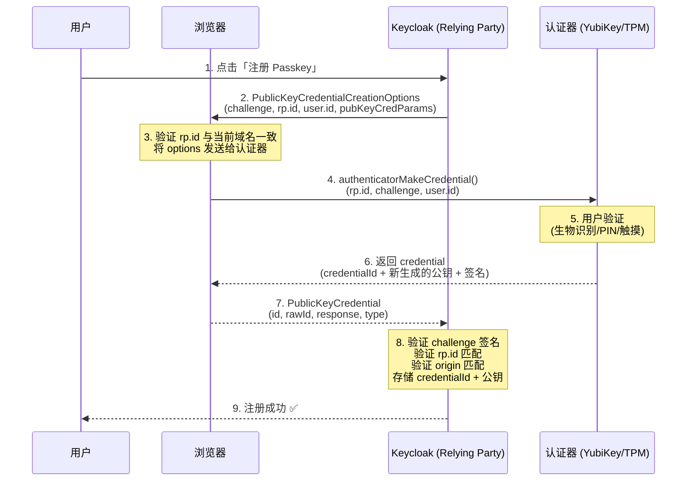
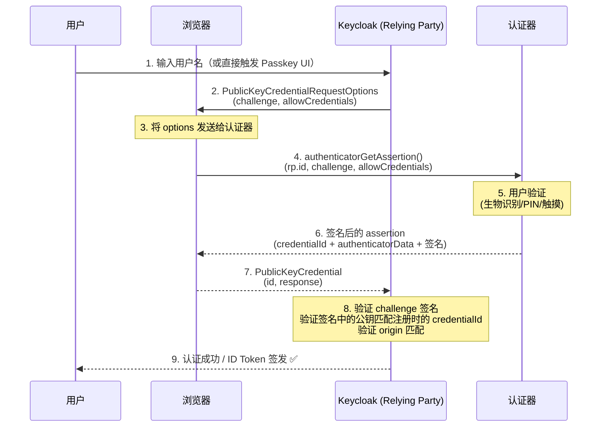

## 场景描述

你的企业正在推动「去密码化」，或者等保 2.0 要求关键系统启用双因素认证。你评估了一圈方案——短信验证码有 SIM swap 风险，TOTP 用户嫌扫码麻烦，App Push 需要额外安装——最后发现 Passkey（WebAuthn/FIDO2）是安全性和用户体验的平衡点。

问题是：FIDO2 协议涉及浏览器、认证器、Relying Party、Attestation、CTAP 等概念，Keycloak 的 Passkey 配置文档分散在多个版本说明中。你需要一份从协议原理到生产落地的完整指南——这正是本文要解决的。

## 适用场景

- 面向员工/合作伙伴的企业 IAM 系统，希望用 Passkey 替代或增强密码认证
- Keycloak 26.x 生产集群，已启用 HTTPS（WebAuthn 强制要求）
- 需要支持多种认证器：YubiKey 等安全密钥、Windows Hello / Apple Touch ID 平台认证器
- 合规要求双因素认证，同时希望改善登录体验

## 不适用场景

- Keycloak 版本低于 24.x——WebAuthn 功能不完整，Passkey Conditional UI 需要 25.x+
- 要在不支持 WebAuthn 的环境中部署（如内网仅 HTTP 的遗留系统）
- 用户群体普遍使用老旧设备（WebAuthn 需要现代浏览器 + OS 支持）
- 完全不想管理恢复流程的场景——无密码意味着必须有设备丢失的备用方案

## 核心概念：FIDO2 / WebAuthn / CTAP / Passkey

这几个术语经常混用，先理清关系：

| 术语 | 全称 | 定位 | 作用 |
|------|------|------|------|
| **FIDO2** | Fast IDentity Online 2 | 标准家族 | CTAP + WebAuthn 的统称 |
| **WebAuthn** | Web Authentication (W3C) | 浏览器 API | Relying Party（网站/IDP）与浏览器之间的 JS API |
| **CTAP** | Client to Authenticator Protocol | 硬件协议 | 浏览器/OS 与认证器（安全密钥、平台 TPM）之间的协议 |
| **Passkey** | — | FIDO 联盟品牌 | 基于 FIDO2 的可同步多设备凭据（Apple/Google/Microsoft/1Password 支持） |

简单说：**WebAuthn 是浏览器说话的 API，CTAP 是认证器说话的协议，FIDO2 把它们装在一起，Passkey 是这套体系的产品化名字。**

与密码认证的本质区别：密码是「你知道的秘密」，认证器验证的是「你持有的设备 + 你是什么（生物识别）」。私钥从不出认证器，服务端只存公钥——即使数据库泄露，攻击者也伪造不了认证。

## FIDO2 注册流程（WebAuthn Registration）

注册（Attestation）就是用户告诉 Keycloak「这个认证器是我的」的过程。



关键点：
1. **Challenge** 是随机生成的 32 字节，防重放攻击——每次注册/认证都不同
2. **RP ID** 是 `auth.example.com` 或其父域 `example.com`——浏览器会在步骤 3 校验当前域名是否匹配
3. **私钥不在服务端**——认证器内部生成密钥对，只导出公钥给 Keycloak
4. **Origin 校验**是 WebAuthn 安全模型的核心——认证器签名时会包含 origin 信息，服务端验证时确保调用来自合法的 HTTPS 源

## FIDO2 认证流程（WebAuthn Authentication）

认证（Assertion）就是用户通过认证器向 Keycloak 证明「我就是注册时的那个人」。



与注册的区别：认证时认证器**搜索已存储的凭据**（通过 allowCredentials 列表），用注册时生成的私钥对 challenge 签名。Keycloak 用存储的公钥验签——签名通过则确认用户持有对应认证器。

## Keycloak Passkey 最小配置

以下基于 Keycloak 26.7。

### 前置条件

- Keycloak 运行在 HTTPS 下（WebAuthn 要求 `rp.id` 对应实际的 TLS 域名）
- Keycloak 26.x 已启用 `web-authn` feature（默认启用，不需额外配置）

### 步骤一：创建 Passkey 认证流

1. 进入 **Authentication** → **Flows** → 复制 **Browser** 流，命名为 **Browser - Passkey**
2. 在 **Browser - Passkey Forms** 子流中，将 **Username Password Form** 设置为 `ALTERNATIVE`
3. 添加 **Passkey Authenticator** 步骤，设置为 `ALTERNATIVE`（与密码表单并列）
4. 确保 **Cookie** 步骤仍在最后（所有认证路径汇合处）

配置后的认证流：

```
Browser - Passkey
├── Cookie (ALTERNATIVE)
├── Identity Provider Redirector (ALTERNATIVE)
└── Browser - Passkey Forms (ALTERNATIVE)
    ├── Username Password Form (ALTERNATIVE)
    ├── Passkey Authenticator (ALTERNATIVE)
    └── OTP Form (ALTERNATIVE) [可选，作为备用第二因素]
```

### 步骤二：绑定认证流

**Authentication** → **Bindings** → **Browser Flow** → 选择 **Browser - Passkey**

### 步骤三：配置 WebAuthn 策略

**Authentication** → **Policies** → **WebAuthn Policy**：

| 参数 | 推荐值 | 说明 |
|------|--------|------|
| Relying Party Entity Name | `{公司名称} SSO` | 在浏览器 Passkey 弹窗中显示 |
| Signature Algorithms | ES256, RS256 | ES256 优先（硬件支持更好） |
| Attestation Preference | `none` | 不验证认证器型号（兼容性最好） |
| Authenticator Attachment | `not specified` | 接受平台认证器和跨平台安全密钥 |
| Require Resident Key | `Yes` | Passkey 需要 resident key |
| User Verification | `preferred` | 优先要求生物识别，但不强制 |
| Timeout | 120000 ms | 用户操作超时时间 |

### 步骤四：用户注册 Passkey

用户登录后进入 **Account Console** → **Signing in** → **Passkey** → 点击 **Set up**。浏览器弹出 Passkey 注册弹窗，用户完成生物识别验证或触摸安全密钥。

### Conditional UI（自动填充，推荐）

从 Keycloak 25.x 起，在认证流中添加 **Passkey Authenticator** 并放在 **Username Form** 之前，设置为 `ALTERNATIVE`：

```
Browser - Passkey Forms
├── Passkey Authenticator (ALTERNATIVE)    ← 放在前面
├── Username Password Form (ALTERNATIVE)
└── OTP Form (ALTERNATIVE)
```

效果：用户访问登录页时，浏览器自动弹出 Passkey 选择器（不需要先输入用户名）。用户选择 Passkey → 指纹/面部验证 → 直接登录。

> **注意**：Conditional UI 要求认证器类型为「平台认证器」（Windows Hello / Apple Touch ID / Android 生物识别）。USB 安全密钥（YubiKey）在部分浏览器上可能不触发 Conditional UI——用户仍然可以通过点击「使用安全密钥」按钮手动触发。

## 企业部署考量

### 认证器类型选型

| 类型 | 示例 | 安全性 | 便利性 | 适用角色 |
|------|------|--------|--------|---------|
| 平台认证器 | Windows Hello, Touch ID, Android Biometric | ★★★★ | ★★★★★ | 普通员工 |
| 安全密钥 | YubiKey 5, Feitian ePass | ★★★★★ | ★★★ | 管理员/运维 |
| Passkey 同步 | iCloud Keychain, Google Password Manager | ★★★ | ★★★★★ | 普通员工（多设备） |

**推荐策略**：普通员工用平台认证器 + Passkey 同步（降低设备丢失风险）；管理员强制使用硬件安全密钥，不允许同步。

### 多设备与恢复策略

无密码的最大风险是「设备丢了怎么办」：

| 机制 | 说明 | 推荐 |
|------|------|------|
| 多认证器注册 | 用户注册 2 个以上认证器（手机 + 安全密钥） | ✅ 必须 |
| Recovery Codes | Keycloak 原生支持的备用恢复码 | ✅ 必须 |
| 管理员重置 | 管理员在控制台删除旧认证器，用户重新注册 | ✅ 作为兜底 |
| 邮箱/SMS 回退 | 允许回退到传统第二因素 | 可选——但削弱了无密码的安全性 |

Keycloak 配置恢复码：确保认证流中 **Recovery Authentication Code** 步骤在 **Browser - Passkey Forms** 之后、**Cookie** 之前，设置为 `ALTERNATIVE`。

### IAM 合规考量

- **等保 2.0**：Passkey（基于 WebAuthn 的生物识别 + 持有因素）满足「双因素认证」要求。认证记录中的 authenticatorAttachment 和 userVerification 字段可作为审计证据
- **GDPR / 个保法**：生物识别数据（指纹、面部）不离开用户设备——认证器只在本地验证，不上传到 Keycloak。这是 Passkey 相比中心化生物识别的核心隐私优势
- **密码策略**：启用 Passkey 后，仍然需要维护密码策略（最小长度、过期策略）——因为恢复码和密码仍是备用路径

## 验证

### 功能验证

```bash
# 1. 检查 Keycloak WebAuthn endpoint
curl -s https://auth.example.com/realms/master/.well-known/webauthn | jq .

# 2. 测试登录（用 Playwright 或 Puppeteer 自动化）
# WebAuthn 无法纯 curl 测试——必须用浏览器自动化，参考：
# playwright codegen https://auth.example.com/realms/master/account
```

### 浏览器兼容性检查

| 浏览器 | WebAuthn | Conditional UI | Passkey 同步 |
|--------|----------|----------------|-------------|
| Chrome 108+ | ✅ | ✅ | ✅ (Google Password Manager) |
| Edge 108+ | ✅ | ✅ | ✅ (Windows Hello) |
| Safari 16+ | ✅ | ✅ | ✅ (iCloud Keychain) |
| Firefox 108+ | ✅ | ✅ (部分) | ❌ (2026.7 仍不支持) |

## 常见错误

### 1. "The operation either timed out or was not allowed"

**症状**：用户点击注册/登录后超时 120 秒。

| 原因 | 排查与修复 |
|------|-----------|
| 用户没有完成生物识别验证 | 检查浏览器控制台 console 是否有 WebAuthn 错误 |
| TLS 证书无效或自签名 | 浏览器拒绝在不安全的上下文上使用 WebAuthn——检查 HTTPS 证书 |
| RP ID 不匹配 | 检查 `Security > WebAuthn Policy > Relying Party ID` 是否与当前访问域名一致 |

### 2. "The relying party ID is not a registrable domain suffix"

**症状**：Keycloak 日志报错 `rp.id` 无效。

**修复**：`rp.id` 必须是可注册域名（不能是 IP 地址或 `localhost`）。如果开发环境用 `localhost`，需要设置 `Origin` 和 `RP ID` 都指向 `localhost`（Chrome 允许 `localhost` 的特殊处理）。

### 3. 用户换了手机，Passkey 丢了

**原因**：用户的 Passkey 存在旧设备的平台认证器中，没有启用云端同步（iCloud Keychain / Google Password Manager）。

**修复**：
1. 管理员在 Keycloak 控制台 → Users → 用户 → Credentials → 删除旧的 WebAuthn credential
2. 用户用管理员重置的临时密码登录，重新注册 Passkey
3. **预防**：企业推送文档指导员工启用 Passkey 同步（iOS: Settings > Passwords > Passkey 同步；Android: Google 密码管理器）

### 4. Firefox 用户看不了 Conditional UI

Firefox 108+ 支持 WebAuthn 认证，但 Conditional UI（自动弹出 Passkey 选择器）支持不完整。Firefox 用户仍然可以点击页面上的「使用 Passkey 登录」按钮手动触发——只是没有自动弹窗。

**处理**：登录页在 Conditional UI 不可用时，显式显示「使用 Passkey / 安全密钥登录」按钮作为降级方案。

### 5. 负载均衡后的 RP ID 校验失败

**症状**：单节点 Passkey 正常，经过反向代理后报错 `rp.id` 或 `origin` 不匹配。

**原因**：WebAuthn 的 `origin` 校验依赖浏览器看到的域名。如果 TLS 在反向代理处终结，Keycloak 收到的请求中 `Host` 头可能是内部地址（如 `keycloak.default.svc.cluster.local`）而非对外的 `auth.example.com`。

**修复**：确保反向代理设置了正确的 `X-Forwarded-Host` 和 `X-Forwarded-Proto`，并且 Keycloak 配置为信任代理：

```bash
# Keycloak 启动参数
KC_PROXY=edge
KC_HOSTNAME=auth.example.com
KC_HTTP_ENABLED=false
```

## 回滚方式

如果要暂时关闭 Passkey，回到纯密码/TOTP 模式：

1. **Authentication** → **Bindings** → **Browser Flow** → 切回原始的 **Browser** 流
2. 已注册 Passkey 的用户不受影响——他们的密码仍然有效，只是恢复为密码 + 可选 OTP 的认证流程
3. 如果想完全删除用户的 Passkey 凭据：Keycloak 控制台 → Users → 用户 → Credentials → 逐条删除 WebAuthn credential（暂无批量操作 API）

关闭 metrics 不影响 Keycloak 核心功能——所有认证、授权、Token 签发照常运行，只是失去可见性。

> **注意**：从 Passkey 回退到纯密码后，已注册 Passkey 的用户仍然可以用密码登录（除非你也禁用了密码表单）。所以回退是低风险的——不会把用户锁在外面。

## IAM FAQ

### 1. Passkey 和 WebAuthn 是什么关系？

Passkey 是基于 WebAuthn/FIDO2 的**产品化品牌名称**（由 Apple/Google/Microsoft/FIDO 联盟共同推广）。技术上，Passkey = WebAuthn + Resident Key + 跨设备同步。所有 Passkey 都是 WebAuthn，但不是所有 WebAuthn 都是 Passkey（如一次性绑定不可同步的安全密钥）。

### 2. 企业 IAM 部署 Passkey 会不会有用户锁定的风险？

风险可控，但必须建立恢复机制：要求用户注册 2+ 认证器（如手机 + YubiKey），启用 Recovery Codes，管理员有权限在审核后删除凭据让用户重新注册。参考本文「多设备与恢复策略」小节的四层保障。

### 3. Passkey 能在内网/离线环境中使用吗？

可以，但有限制。WebAuthn 要求在 HTTPS（或 `localhost`）上下文中运行——内网环境必须有内部 CA 签发的证书。认证器验证本身不需要网络（生物识别在设备本地完成），但 Keycloak 必须可达且 TLS 证书被浏览器信任。

### 4. IAM 等保合规中，Passkey 算不算双因素？

算。Passkey 同时使用了「持有因素」（设备/安全密钥）和「固有因素」（指纹/面部识别），或者「持有因素」+「知识因素」（PIN）。在等保 2.0 三级系统中，Passkey 是合规的双因素认证方式之一。详见 [IAM 等保合规指南]()。

### 5. 已有 TOTP 的用户，需要迁移到 Passkey 吗？

不需要强制迁移。TOTP 和 Passkey 可以并行——在认证流中都将它们设为 `ALTERNATIVE`，用户登录时选择自己习惯的方式。如果企业策略是逐步淘汰 TOTP，可以先要求管理员组切换到 Passkey，再逐步推广到全体员工。

## 进一步阅读

- [第11章：多因素认证（MFA）— TOTP、FIDO2、WebAuthn 与自适应认证]()：MFA 的整体理论框架与协议对比
- [Keycloak 26.7 新特性深度解读]()：当前稳定版的核心能力
- [IAM 等保合规指南]()：等保 2.0 对 IAM 认证的要求
- [IAM 安全最佳实践]()：包括 Token 安全、会话安全、审计日志等
- [W3C WebAuthn Level 3](https://www.w3.org/TR/webauthn-3/)：WebAuthn 规范最新版
- [FIDO Alliance Passkey 白皮书](https://fidoalliance.org/white-paper-multiple-authenticators-for-reducing-account-recovery-needs-for-fido-enabled-consumer-accounts/)：多认证器降低账户恢复需求
