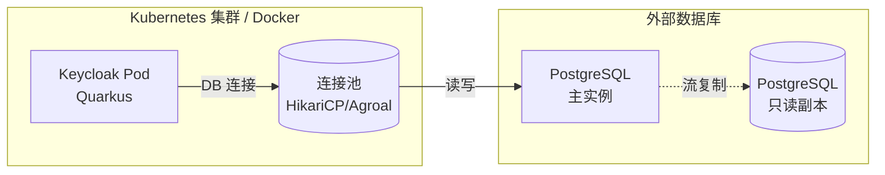

Keycloak 默认使用嵌入式 H2 数据库，方便本地开发和快速体验。但 H2 不支持高可用、不适合并发写入、数据文件容易损坏——生产环境必须换成 PostgreSQL（或 MySQL/MariaDB/Oracle）。

这篇指南覆盖从零到一的生产数据库配置，不只是在 `docker-compose.yml` 里改一行 `DB_VENDOR`——而是把连接池、Kubernetes Secret、备份考虑、常见线上排错一起讲清楚。

## 适用与不适用

| 场景 | 是否适用 |
|------|----------|
| 首次将 Keycloak 部署到生产环境 | ✅ 适用 |
| 正在从 H2 迁移数据到 PostgreSQL | ✅ 适用（含迁移步骤） |
| 在 Kubernetes 中通过 Helm/Operator 部署 Keycloak | ✅ 适用 |
| 已有 PostgreSQL 但遇到连接超时/连接池耗尽 | ✅ 适用（参见连接池调优） |
| 只是本地开发验证功能 | ❌ H2 足够 |
| 需要 Oracle/MSSQL 数据库（本文以 PostgreSQL 为例，但大部分配置思路通用） | ⚠️ 参考思路 |

## 总体架构



Keycloak 的数据库连接由 Quarkus 内置的连接池（Agroal）管理。生产环境不要依赖默认的连接池大小——根据实际并发量调优。

## Keycloak 26.x 数据库配置方式

Keycloak 26.x（当前最新 26.7.0）使用 Quarkus 配置体系，不再用旧的 `-Dkeycloak.connectionsJpa.*` 方式。所有数据库配置通过环境变量或 `conf/keycloak.conf` 文件设置。

### 最小生产配置

```bash
# 数据库类型
KC_DB=postgres

# JDBC 连接（多节点集群建议用 PgBouncer 或连接池中间件）
KC_DB_URL=jdbc:postgresql://postgres-prod.internal:5432/keycloak

# 数据库凭据
KC_DB_USERNAME=keycloak
KC_DB_PASSWORD=<强密码，至少 16 位>

# 连接池配置（关键！）
KC_DB_POOL_MIN_SIZE=5
KC_DB_POOL_MAX_SIZE=20
KC_DB_POOL_INITIAL_SIZE=5
```

**重要**：`KC_DB_PASSWORD` 不要直接写在 `keycloak.conf` 里。在 Kubernetes 中用 Secret 注入环境变量；在 Docker Compose 中用 `.env` 文件（确保 `.env` 不提交到 Git）。

### Docker Compose 示例

```yaml
version: "3.8"
services:
  postgres:
    image: postgres:16-alpine
    environment:
      POSTGRES_DB: keycloak
      POSTGRES_USER: keycloak
      POSTGRES_PASSWORD: ${KC_DB_PASSWORD}
    volumes:
      - pgdata:/var/lib/postgresql/data
    healthcheck:
      test: ["CMD-SHELL", "pg_isready -U keycloak"]
      interval: 10s
      timeout: 5s
      retries: 5

  keycloak:
    image: quay.io/keycloak/keycloak:26.7.0
    environment:
      KC_DB: postgres
      KC_DB_URL: jdbc:postgresql://postgres:5432/keycloak
      KC_DB_USERNAME: keycloak
      KC_DB_PASSWORD: ${KC_DB_PASSWORD}
      KC_DB_POOL_MIN_SIZE: 5
      KC_DB_POOL_MAX_SIZE: 15
      KC_HOSTNAME: idaas.example.com
      KC_PROXY: edge
      KEYCLOAK_ADMIN: admin
      KEYCLOAK_ADMIN_PASSWORD: ${KEYCLOAK_ADMIN_PASSWORD}
    command: start --optimized
    depends_on:
      postgres:
        condition: service_healthy
    ports:
      - "8080:8080"

volumes:
  pgdata:
```

### Kubernetes 示例（Deployment 片段）

```yaml
apiVersion: v1
kind: Secret
metadata:
  name: keycloak-db-credentials
type: Opaque
stringData:
  username: keycloak
  password: "<强密码>"
---
apiVersion: apps/v1
kind: Deployment
metadata:
  name: keycloak
spec:
  replicas: 2
  template:
    spec:
      containers:
        - name: keycloak
          image: quay.io/keycloak/keycloak:26.7.0
          args: ["start", "--optimized"]
          env:
            - name: KC_DB
              value: "postgres"
            - name: KC_DB_URL
              value: "jdbc:postgresql://postgres-svc.default:5432/keycloak"
            - name: KC_DB_USERNAME
              valueFrom:
                secretKeyRef:
                  name: keycloak-db-credentials
                  key: username
            - name: KC_DB_PASSWORD
              valueFrom:
                secretKeyRef:
                  name: keycloak-db-credentials
                  key: password
            - name: KC_DB_POOL_MIN_SIZE
              value: "5"
            - name: KC_DB_POOL_MAX_SIZE
              value: "20"
            - name: KC_PROXY
              value: "edge"
            - name: KC_HOSTNAME
              value: "idaas.example.com"
```

### PostgreSQL 侧的准备

```sql
-- 创建数据库和用户
CREATE DATABASE keycloak;
CREATE USER keycloak WITH PASSWORD '<强密码>';
GRANT ALL PRIVILEGES ON DATABASE keycloak TO keycloak;

-- Keycloak 需要 public schema 的完整权限
\c keycloak
GRANT ALL ON SCHEMA public TO keycloak;
GRANT CREATE ON SCHEMA public TO keycloak;
```

Keycloak 启动时会通过 Liquibase 自动创建表结构，不需要手动执行 SQL 脚本。

## 从 H2 迁移到 PostgreSQL

### 迁移步骤

1. **导出 H2 数据**（仅开发/测试环境有数据）：

```bash
# 在 H2 环境的 Keycloak 容器内
/opt/keycloak/bin/kc.sh export --dir /tmp/export --realm <realm-name>
```

2. **确认 PostgreSQL 已就绪**（见上文）。

3. **修改数据库配置**指向 PostgreSQL，启动 Keycloak——Liquibase 会自动建表。

4. **导入 Realm 数据**：

```bash
/opt/keycloak/bin/kc.sh import --dir /tmp/export
```

### 迁移注意事项

| 注意点 | 说明 |
|--------|------|
| **H2 不适用于生产** | 不要在生产环境导出 H2。生产环境应该直接切换到 PostgreSQL，Realm 配置通过 `kc.sh import` 或手动重建 |
| **用户密码哈希兼容** | Keycloak 用 PBKDF2 存储密码，切换数据库不影响密码验证 |
| **Session 数据丢失** | 在线 Session 存在 Infinispan 缓存（非数据库）。切换数据库会导致所有用户需重新登录 |
| **`KC_DB_URL` 编码** | JDBC URL 中的特殊字符（如 `&`）在 YAML/K8s 环境变量中不需要转义，但在 shell 中需要引号包裹 |

## 连接池调优

Keycloak 的连接池默认值偏保守（`min=0, max=10`），生产环境需要根据实际负载调整：

```bash
# 最小空闲连接——预热连接，避免冷启动延迟
KC_DB_POOL_MIN_SIZE=5

# 最大连接数——每节点
KC_DB_POOL_MAX_SIZE=20

# 初始连接数——启动时立即创建
KC_DB_POOL_INITIAL_SIZE=5
```

### 连接数计算

```
总连接数 = KC_DB_POOL_MAX_SIZE × Keycloak 节点数
PostgreSQL max_connections ≥ 总连接数 + 20%（预留管理连接）
```

例如：3 个 Keycloak 节点 × 20 连接/节点 = 60，PostgreSQL `max_connections` 至少设为 80。

### PostgreSQL 侧配置建议

```ini
# postgresql.conf
max_connections = 100           # 根据上述公式计算
shared_buffers = 512MB          # 建议为总内存的 25%
effective_cache_size = 1.5GB    # 建议为总内存的 75%
work_mem = 16MB                 # 根据并发查询数调整
```

## 常见错误排错

| 症状 | 原因 | 解决 |
|------|------|------|
| `Connection refused` | PostgreSQL 未就绪或网络不通 | `pg_isready -h <host>` 验证连通性；检查防火墙/SecurityGroup |
| `FATAL: password authentication failed` | 密码错误或 `pg_hba.conf` 不允许连接 | 检查密码；确认 `pg_hba.conf` 中 `md5` 或 `scram-sha-256` 认证方式 |
| `FATAL: sorry, too many clients already` | 连接数超限 | 增加 `max_connections` 或减少 `KC_DB_POOL_MAX_SIZE` |
| `ERROR: relation "xxx" does not exist` | Liquibase 未自动建表 | 检查数据库用户权限（需要 CREATE 权限）；确认 Keycloak 启动日志无 Liquibase 错误 |
| `Container startup timeout waiting for DB` | Keycloak 启动比 PostgreSQL 快 | 加 `depends_on` + healthcheck（Docker）或 `initContainers`（K8s）等待数据库就绪 |
| `ERROR: could not serialize access due to concurrent update` | 多节点并发更新同一数据行（如 Realm 配置） | 这是正常的乐观锁行为，Keycloak 会自动重试；如果频繁出现需检查是否所有节点都在频繁修改 Realm |
| `KC_DB_URL contains invalid hostname` | JDBC URL 格式错误 | 确认 URL 为 `jdbc:postgresql://host:port/database`，注意是 `postgresql` 不是 `postgres` |
| 启动后 H2 数据未出现在 PostgreSQL | 这是新建数据库，不会自动迁移数据 | 用 `kc.sh export/import` 迁移 H2 数据 |

## 常见问题（FAQ）

### Keycloak 能用 MySQL 吗？

可以。Keycloak 官方支持 PostgreSQL、MySQL/MariaDB、Oracle、MSSQL。MySQL 的配置方式为 `KC_DB=mysql`，JDBC URL 为 `jdbc:mysql://host:port/keycloak`。注意 MySQL 8.0+ 的默认认证插件是 `caching_sha2_password`，需要在连接 URL 上指明或改用 `mysql_native_password`。

### 多节点 Keycloak 共用同一个数据库会有问题吗？

不会，这是标准做法。Keycloak 的所有节点共享同一个数据库，通过 JGroups（集群内通信）和 Infinispan（分布式缓存）协调状态。数据库是持久化的真理源，缓存是临时的性能优化。节点之间通过数据库的乐观锁（`JPAVERSION` 字段）处理并发写冲突。

### 需要为 Keycloak 配读写分离吗？

不推荐。Keycloak 的很多操作（Token 签发、Session 创建、事件记录）都涉及写操作，而且读操作对一致性要求高（例如刚创建的 Session 立即被另一个请求读取）。如果你的 PostgreSQL 已有只读副本，确保 Keycloak 只连接主库。

### 数据库备份策略应该怎么做？

参考 [Keycloak 高可用与灾难恢复指南]()——核心是 `pg_dump` 定时备份（每 6 小时）+ WAL 归档。**特别注意**：数据库备份 + Realm 导出（`kc.sh export`）双重保障更安全。

### IAM 生产环境中还有哪些数据库注意事项？

除了 Keycloak 自身的数据库，IAM 生产环境还需要考虑：
- **审计日志存储**：Keycloak 的事件日志默认存数据库，高流量场景可以考虑导出到外部日志系统（ELK/Loki），防止数据库膨胀。详见 [IAM 安全最佳实践]()。
- **用户源的数据库**：如果 Keycloak 通过 User Federation 对接了 LDAP/AD，源端的数据库（通常是 AD 的 NTDS）也需要纳入备份策略。详见 [Keycloak LDAP/AD 用户联邦]()。
- **连接加密**：Keycloak 到 PostgreSQL 的连接建议启用 TLS（`KC_DB_URL` 中加 `sslmode=require`），防止内网嗅探。

## 回滚方式

如果数据库迁移后出现问题：

1. **应用层面回滚**：将 `KC_DB_URL` 改回旧的数据库地址 → 重启 Keycloak → 验证功能。只要旧数据库还在，回滚是秒级操作。
2. **数据层面回滚**：如果新数据库中已有脏数据，切回旧数据库即可（Keycloak 是无状态的，数据库是唯一真理源）。
3. **版本回滚**：Keycloak 升级后 Liquibase 会自动修改表结构（数据库迁移），降级需要恢复 `pg_dump` 备份。**每次升级前务必备份数据库**。

## 小结

Keycloak 的数据库配置在开发阶段用 H2 没问题，但上生产前必须切换到 PostgreSQL。核心要点：
- 使用环境变量/Secret 管理凭据，不要明文写在配置文件中
- 根据节点数量合理设置连接池大小和 PostgreSQL `max_connections`
- 多节点共享同一数据库是标准做法
- 迁移场景使用 `kc.sh export/import`，注意 Session 会丢失
- 每次升级前备份数据库

更多 Keycloak 生产部署内容参见 [Keycloak 高可用与灾难恢复指南]() 和 [Keycloak Kubernetes 生产部署]()。
