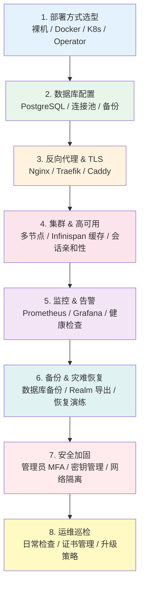
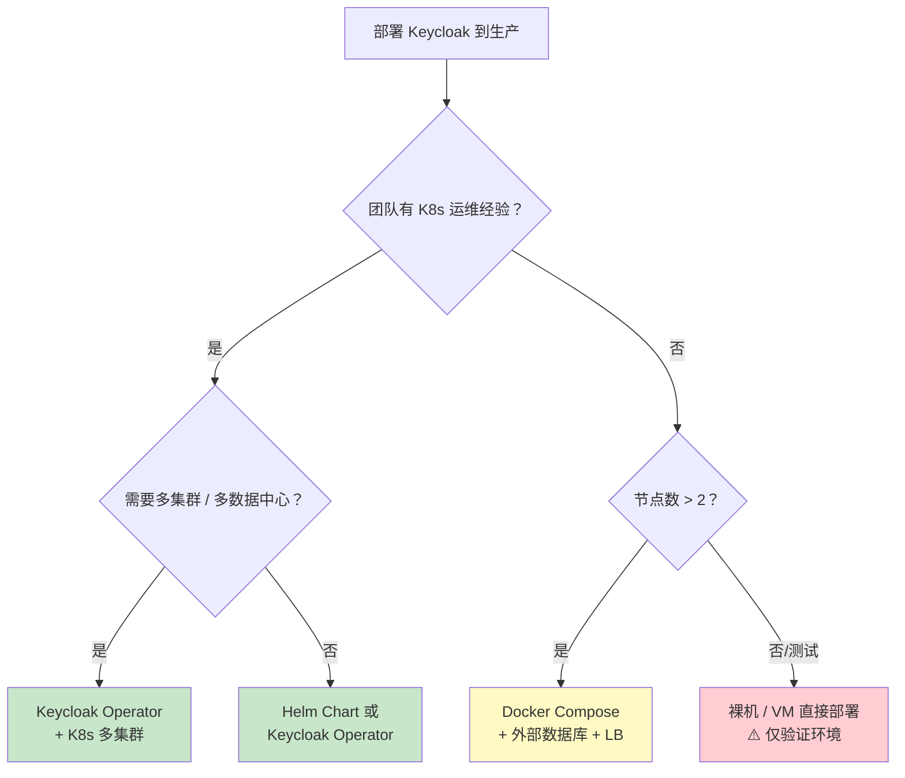

## 场景

你决定用 Keycloak 作为企业的 IAM（身份与访问管理）平台。看完了[入门文档]()，`start-dev` 也能跑起来了——但离生产环境还有很长的路。你需要的不是另一篇零散的配置教程，而是一张**从零到高可用的完整路线图**：先做什么、后做什么、每一步有哪些坑、遇到问题该跳转到哪篇详细文档。

本文就是这张图。

## 适用与不适用

| 适用 | 不适用 |
|------|--------|
| 第一次把 Keycloak 部署到生产环境 | 只是在本地开发环境试用 |
| 已有部署但缺乏完整的运维体系（监控/备份/高可用） | 已经有一套成熟的 Keycloak 运维体系，只需要查具体错误 |
| 需要向团队或领导说明部署方案的全貌 | 只需要某一个环节的深入配置（直接跳转到对应文章） |

## 路线图总览

下图展示了一条典型的 Keycloak 生产部署路径。每个方框代表一个里程碑，里程碑之间的箭头代表依赖关系。**可以跳过第 3 步和第 6 步，但其他步骤不建议省略。**



以下按顺序展开每一步的核心决策、最小可行配置和相关详细文档。

---

## 第一步：部署方式选型

这是整个路线图的入口——选错了部署方式，后续的所有步骤都会受影响。

### 决策树



### 四种方式的对比

| 部署方式 | 适合场景 | 高可用能力 | 运维复杂度 | 推荐度 |
|---------|---------|-----------|-----------|--------|
| **K8s Operator** | 有 K8s 集群的团队 | ⭐⭐⭐ 最强（滚动更新、自动扩缩） | 中（需理解 CRD） | 🟢 生产首选 |
| **Helm Chart** | 习惯 Helm 管理应用 | ⭐⭐⭐（需手动配置 HPA） | 中 | 🟢 生产可用 |
| **Docker Compose** | 小团队、单机或少量节点 | ⭐⭐（需外部 LB + 共享数据库） | 低 | 🟡 适合中小规模 |
| **裸机 / VM** | 传统运维，无容器化 | ⭐（手动管理多节点） | 高（手动运维） | 🔴 不推荐新项目 |

### 关键决策因素

- **Operator vs Helm**：Operator 管理 Keycloak 的完整生命周期（升级、备份、自动扩缩），Helm 更像是"一次性安装"。长期运维选 Operator。
- **内存要求**：生产环境每个 Keycloak 节点建议至少 2 GB 堆内存。K8s 中设置 `-Xms1g -Xmx2g`，并通过 `resources.limits` 预留。
- **CPU 要求**：至少 2 vCPU。Keycloak 的密码哈希（Argon2/bcrypt）是 CPU 密集型操作。

---

## 第二步：数据库配置

Keycloak 支持 PostgreSQL、MySQL、MariaDB、Oracle、MSSQL。**生产环境唯一推荐 PostgreSQL**——Keycloak 官方测试最充分、社区踩坑最少。

### 最小配置

```bash
# Keycloak 启动参数（Quarkus 发行版）
kc.sh start \
  --db=postgres \
  --db-url=jdbc:postgresql://db-host:5432/keycloak \
  --db-username=keycloak \
  --db-password=${DB_PASSWORD}
```

### 关键检查

- **连接池大小**：每个 Keycloak 节点的数据库连接池默认 20（`--db-pool-initial-size` / `--db-pool-max-size`）。两个节点就是 40 个连接。确保 PostgreSQL 的 `max_connections` 足够。
- **不要用 H2**：H2 是开发数据库，不支持集群、不支持并发、数据在重启时可能丢失。
- **K8s Secret 管理**：数据库密码通过 K8s Secret 注入，不要写在 ConfigMap 里。

> 📖 完整配置指南：[Keycloak 生产数据库配置 — PostgreSQL 实战]()

---

## 第三步：反向代理 & TLS 终结

Keycloak 默认监听 `http://localhost:8080`。生产环境中，必须在 Keycloak 前面放置一个反向代理来：

1. 终止 TLS（HTTPS）
2. 转发正确的 `X-Forwarded-*` 头
3. 可选：限流、WAF、日志

### Keycloak 端的 proxy 模式

Keycloak 需要知道自己在反向代理后面运行，否则会生成错误的 redirect URI（`http://localhost:8080` 而不是 `https://your-domain.com`）。

```bash
kc.sh start --proxy=edge  # TLS 在反向代理层终止（最常见）
# 或
kc.sh start --proxy=reencrypt  # 反向代理做 TLS 再加密（更高安全要求）
```

### Nginx 最小配置

```nginx
server {
    listen 443 ssl http2;
    server_name sso.example.com;

    ssl_certificate     /etc/ssl/certs/sso.example.com.pem;
    ssl_certificate_key /etc/ssl/private/sso.example.com-key.pem;

    location / {
        proxy_pass http://keycloak:8080;
        proxy_set_header Host $host;
        proxy_set_header X-Real-IP $remote_addr;
        proxy_set_header X-Forwarded-For $proxy_add_x_forwarded_for;
        proxy_set_header X-Forwarded-Proto $scheme;
        proxy_set_header X-Forwarded-Host $host;
    }
}
```

### 常见错误

| 症状 | 原因 | 解决 |
|------|------|------|
| `HTTPS required` 错误 | Keycloak 未配置 `--proxy` | 添加 `--proxy=edge` |
| 重定向到 `localhost:8080` | 缺少 `X-Forwarded-Proto` 或 `X-Forwarded-Host` | 检查反向代理的 Header 转发 |
| 重定向循环 | 反向代理做了 HTTP → HTTPS 但不传 `X-Forwarded-Proto` | 确保反向代理传了该 Header，且 Keycloak 配了 `--proxy` |

> 📖 详细排错：[Keycloak 重定向循环与 401 排错指南]()

---

## 第四步：集群 & 高可用

单节点 Keycloak = 单点故障。生产环境至少 2 个节点组成集群。

### 最小集群配置

```bash
# 节点 1
kc.sh start \
  --db=postgres --db-url=... --db-username=... --db-password=... \
  --proxy=edge \
  --cache=ispn \
  --cache-stack=jdbc-ping  # 或 kubernetes / tcp

# 节点 2（相同命令，不同主机）
```

### 缓存模式选择

Keycloak 的分布式缓存由 Infinispan 驱动，三种缓存类型：

| 缓存类型 | 存储内容 | 同步方式 | 丢失影响 |
|---------|---------|---------|---------|
| **Local** | realms, users, authorization, keys | 每个节点独立，通过 work 缓存失效 | 自动从数据库重建 |
| **Distributed** | sessions, clientSessions, authenticationSessions | 多节点分片存储，每个 session 只在 2 个节点持有 | 用户需重新登录 |
| **Replicated** | work（失效消息） | 广播到所有节点 | 配置更新延迟 |

### 会话亲和性（Sticky Sessions）

负载均衡器必须配置会话亲和性（Sticky Sessions），确保同一用户的请求始终落到同一节点：

- **Nginx**：`ip_hash` 或 `sticky cookie`
- **K8s Ingress Nginx**：annotation `nginx.ingress.kubernetes.io/affinity: cookie`
- **Traefik**：`sticky.cookie: true` 在 Service 或 IngressRoute 上

> 📖 缓存调优：[Keycloak 集群缓存深度调优与排错指南]()
> 📖 HA 部署：[Keycloak 高可用集群部署与灾难恢复]()

---

## 第五步：监控 & 告警

没有监控的生产环境就是在裸奔。

### 需要监控的指标

| 指标类型 | 关键指标 | 告警阈值建议 |
|---------|---------|------------|
| **JVM** | Heap Memory Used | > 80% 持续 5min |
| **JVM** | GC Time | > 5% 总 CPU 时间 |
| **HTTP** | Request Count / Error Rate | 5xx > 1% |
| **认证** | Login Success / Failure | 失败率突增（异常攻击） |
| **数据库** | Connection Pool Active | > 80% max |
| **缓存** | Cache Hit Rate | < 90%（分布式缓存） |

### 最小监控部署

1. 在 Keycloak 中启用 metrics 端点：`kc.sh start --metrics-enabled=true`
2. 配置 Prometheus ServiceMonitor 抓取 `/metrics`
3. 导入 Grafana Dashboard（[21997](https://grafana.com/grafana/dashboards/21997-keycloak-metrics/)）

> 📖 完整监控配置：[Keycloak Prometheus 监控指标详解]()

---

## 第六步：备份 & 灾难恢复

备份是所有生产系统的底线。Keycloak 的备份分两层：

### 数据库备份（最优先）

数据库是 Keycloak 的唯一持久化状态。备份 PostgreSQL：

```bash
pg_dump -h db-host -U keycloak -Fc keycloak > keycloak-$(date +%Y%m%d).dump
```

**RPO（恢复点目标）建议**：≤ 1 小时（连续归档 + WAL）
**RTO（恢复时间目标）建议**：≤ 30 分钟

### Realm 导出（补充）

数据库备份之外，定期导出 Realm 作为 JSON 文件，方便跨环境迁移：

```bash
kc.sh export --realm=your-realm --dir=/backups/realms
```

### 恢复验证清单

- [ ] 最后一份数据库备份能成功恢复到空数据库
- [ ] Keycloak 启动后 Realm、用户、角色、Client 配置完整
- [ ] OIDC/SAML Client 的 Secret/证书仍然有效
- [ ] 用户能正常登录并访问 SSO 应用

> 📖 完整恢复流程：[Keycloak 高可用集群部署与灾难恢复]() — 灾难恢复章节

---

## 第七步：安全加固

IDP 是整个 IAM 体系的安全基石，被攻破 = 所有应用失守。

### 强制措施（不可省略）

1. **管理员账号强制 MFA**：所有 `admin` 角色的用户必须绑定 OTP 或 FIDO2
2. **管理控制台不暴露公网**：通过内网或 VPN 访问 `/admin`
3. **默认 Admin 账号必须改名**：不要用 `admin` 作为管理员用户名
4. **Brute Force 防护**：Keycloak 内置 Brute Force Detection，在生产环境必须开启

### 推荐措施

- 定期轮换 Realm 签名密钥（Keycloak `Keys` tab）
- 审计日志接入集中日志平台，不可篡改
- 关注 [Keycloak Security Advisories](https://github.com/keycloak/keycloak/security/advisories)，补丁在 7 天内上线

> 📖 完整安全实践：[IAM / IDaaS 安全最佳实践]()
> 📖 K8s 安全部署：[Keycloak 生产巡检与运维清单]()

---

## 第八步：运维巡检

日常运维的核心是**从被动救火变成主动巡检**。

### 日常检查清单（每天 5 分钟）

- [ ] Keycloak 所有节点健康检查端点返回 200
- [ ] Prometheus 无活跃告警
- [ ] 数据库连接池使用率 < 80%
- [ ] 磁盘空间 > 20%（日志 + 数据库）
- [ ] TLS 证书有效期 > 30 天

### 升级策略

Keycloak 平均每 6-8 周发布一个新版本。升级路径：

1. 在 staging 环境先升级并跑完整回归测试
2. 数据库备份（升级前！）
3. 滚动升级 K8s 节点，或逐个替换 VM 节点
4. 监控 24 小时，确认无异常后关闭旧节点

> 📖 完整运维清单：[Keycloak 生产巡检与运维清单]()

---

## 常见问题

### Q1：从零开始到生产环境，一般要多久？

一个 2 人团队，从零开始部署 Keycloak 到生产就绪状态：
- **部署方式选型 + 数据库配置**：1-2 天
- **反向代理 + TLS**：半天
- **集群 + 高可用**：1-2 天（含测试）
- **监控 + 告警**：1 天
- **备份 + 安全加固**：1 天

总计约 **5-7 个工作日**。如果使用 K8s Operator，第 1 和第 4 步可以合并，减少 1-2 天。

### Q2：可以直接跳过集群，单节点跑到用户量大了再加吗？

**可以，但要做好准备。** 单节点部署的 Keycloak 切换到集群模式需要：
1. 确认数据库支持多节点并发（PostgreSQL 天然支持）
2. 配置缓存栈（`jdbc-ping` 或 `kubernetes`）
3. 在 LB 层加上会话亲和性

建议在单节点阶段就把 `--cache=ispn` 和 `--cache-stack` 参数配置好（不会影响单节点运行），后续加节点只需横向扩展。

### Q3：Keycloak Operator 和 Helm 怎么选？

- **选 Operator**：如果你希望 Keycloak 的升级、扩缩容、备份都由 K8s 原生 CRD 管理，且团队愿意学习 Operator 的工作方式
- **选 Helm**：如果你的团队已经用 Helm 管理所有应用，希望部署方式统一，不介意手动处理升级和扩缩容

两者都能跑生产。Operator 的长期运维成本更低。

### Q4：IaaS 上的托管数据库（RDS / Cloud SQL）还是自建 PostgreSQL？

**对于 Keycloak 本身，两者都可以。** 区别在于：
- 托管数据库：省心（自动备份、自动补丁、高可用），但成本更高、有网络延迟（跨 AZ）
- 自建：更可控、更低成本，但需要自己处理备份和高可用

如果团队没有专职 DBA，用托管数据库。Keycloak 对数据库的负载不高（主要是读写 meta 数据和 session），不需要特别高性能的实例。

### Q5：这个路线图是否适用于 Keycloak 24 之前的版本？

**不适用**。Keycloak 24（2024 年 12 月）之前的 WildFly 发行版配置方式完全不同：
- 使用 `standalone.xml` / `standalone-ha.xml` 而非 Quarkus CLI 参数
- 缓存配置通过 `standalone-ha.xml` 中的 Infinispan subsystem，不需要 `--cache-stack`
- 没有 `--proxy` 参数，需通过环境变量 `KEYCLOAK_FRONTEND_URL` 或 proxy-address-forwarding SPI

如果你还在用 WildFly 版，建议参考[迁移指南]()升级到 Quarkus 发行版后再使用本文。

---

## 小结

Keycloak 从零到生产就绪，核心是**八个里程碑**：部署方式选型 → 数据库 → 反向代理 → 集群 → 监控 → 备份 → 安全加固 → 运维巡检。每一步都有明确的决策依据和详细文档支撑。如果你按照这个顺序推进，可以避免 90% 的生产踩坑。
