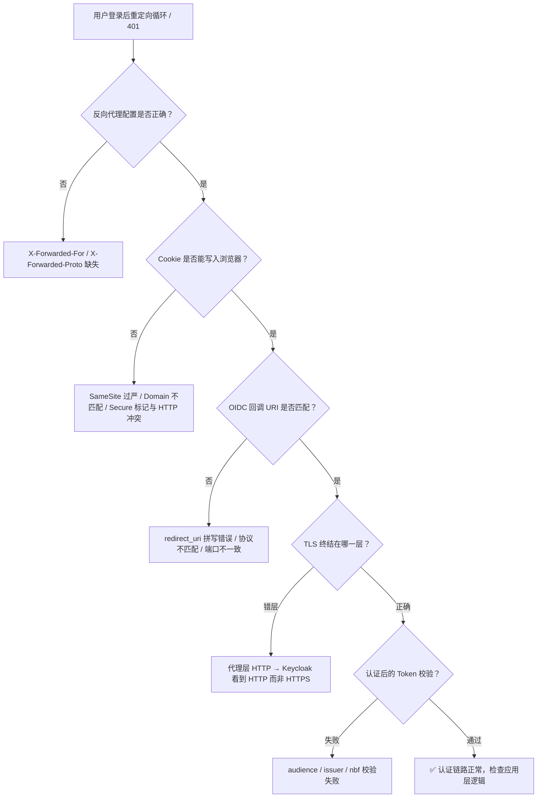
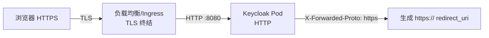

## 场景

你已经部署好了 Keycloak +反向代理，用户能在 Keycloak 登录页输入用户名密码，但登录成功后浏览器在 Keycloak 和应用之间反复跳转，最终浏览器报 `ERR_TOO_MANY_REDIRECTS`；或者直接返回 401，看起来"登录成功了但就是进不去"。

这类问题的根因几乎都在 **Cookie、反向代理 Header、TLS 终结 和 OIDC 回调 URI** 四个环节。本文给出一个系统性的排查路线图。

## 适用与不适用

| 适用 | 不适用 |
|------|--------|
| Keycloak + 任意反向代理（Nginx/Traefik/HAProxy/ALB） | Keycloak 本身无法启动（那是部署问题） |
| oauth2-proxy / Traefik ForwardAuth / Nginx auth-url 模式 | 用户凭据错误（先确认用户名密码正确） |
| OIDC 标准客户端（非 Keycloak Adapter） | Keycloak Adapter 老项目（Adapters 已弃用，参考 [迁移指南]() 迁移到标准 OIDC 库再排查） |
| SAML 单点登录重定向问题 | 纯 LDAP/Kerberos 认证（不涉及 HTTP 重定向） |

## 排查路线图



## 第一关：反向代理 Header

Keycloak 自身不面向公网时，反向代理必须正确传递三个 Header，否则 Keycloak 构建的重定向 URL 会出错。

### 三个必需 Header

| Header | 含义 | 缺失后果 |
|--------|------|----------|
| `X-Forwarded-For` | 真实客户端 IP | Keycloak 可能把代理 IP 当成客户端，影响限流和审计 |
| `X-Forwarded-Proto` | 原始请求协议（http/https） | Keycloak 生成的 redirect_uri 可能变成 `http://`，TLS 不匹配导致循环 |
| `X-Forwarded-Host` | 原始请求 Host 头 | Keycloak 重定向到内部 hostname 而非公网域名 |

### Nginx 配置检查

```nginx
location / {
    proxy_pass http://keycloak:8080;
    proxy_set_header Host $host;
    proxy_set_header X-Real-IP $remote_addr;
    proxy_set_header X-Forwarded-For $proxy_add_x_forwarded_for;
    proxy_set_header X-Forwarded-Proto $scheme;
    proxy_set_header X-Forwarded-Host $host;
}
```

### 快速验证

```bash
# 在 Keycloak 容器内检查它看到的头
# 如果 Keycloak 有 admin 权限，检查 Server Info → 查看前端 URL
# 或者直接 curl 测试：
curl -v https://keycloak.example.com/auth/realms/myrealm/protocol/openid-connect/auth \
  -d "client_id=myclient&redirect_uri=https://myapp.example.com/callback&response_type=code&scope=openid"
# 观察 Location 头中的 redirect_uri 是否使用 https:// 和正确域名
```

### Traefik 配置检查

```yaml
# Traefik IngressRoute 不需要手动设这些 Header，Traefik 默认会传
# 但需要确认 Keycloak Service 使用正确的端口和 scheme
apiVersion: traefik.io/v1alpha1
kind: IngressRoute
metadata:
  name: keycloak
spec:
  entryPoints:
  - websecure
  routes:
  - match: Host(`keycloak.example.com`)
    kind: Rule
    services:
    - name: keycloak
      port: 8080
      # 关键：告诉 Traefik 后端是 HTTP（内部不加密）
      # Keycloak 看到 X-Forwarded-Proto: https 才会生成正确的重定向
```

## 第二关：Cookie 配置

### SameSite 过严

用户在 Keycloak 登录后，浏览器跳回应用时携带的 Cookie 被 SameSite=Strict 拦截，导致应用认为"没登录"，再次重定向到 Keycloak。

| SameSite 值 | 行为 | 推荐 |
|-------------|------|------|
| `Strict` | 跨站请求完全不带 Cookie | ❌ 会导致回调时 Cookie 丢失 |
| `Lax` | 顶级导航（GET 请求）带 Cookie | ✅ OIDC 回调是 GET 请求，Lax 足够 |
| `None` | 总是发送 | 需要配合 `Secure` 标记，仅 HTTPS |

### Cookie Domain 不匹配

如果配置了 `--cookie-domain=.example.com`，但实际访问 `app.other.com`，Cookie 不会随请求发送。

**常见错误**：
- 域名前少了一个点号：`example.com` 只匹配 `example.com` 自身，不匹配 `app.example.com`
- 配置了点号但访问不同主域

### Cookie Secure 与 HTTP 冲突

生产环境 Keycloak 要求 `Cookie Secure=true`，但如果反向代理和 Keycloak 之间走 HTTP（内部网络），Keycloak 在收到 `X-Forwarded-Proto: https` 时会把 Cookie 标记为 Secure。

**症状**：浏览器不接受 Secure Cookie（因为是通过 HTTP 连接的），导致每次请求都重新跳转登录。

**解决方案**：确保浏览器到反向代理是 HTTPS（TLS 终结在代理层），代理到 Keycloak 走 HTTP 是正常的。

## 第三关：OIDC 回调 URI 精确匹配

OAuth 2.0 规范要求 `redirect_uri` 必须与客户端注册的值**完全一致**。多数重定向循环由此引起：

| 注册值 | 实际请求 | 匹配？ |
|--------|----------|--------|
| `https://myapp.example.com/callback` | `https://myapp.example.com/callback` | ✅ |
| `https://myapp.example.com/callback` | `https://myapp.example.com/callback/` | ❌ 多了尾部斜杠 |
| `https://myapp.example.com/callback` | `http://myapp.example.com/callback` | ❌ 协议不同 |
| `https://myapp.example.com/callback` | `https://myapp.example.com:8443/callback` | ❌ 端口不同 |
| `https://myapp.example.com/*` | `https://myapp.example.com/callback` | ✅ 通配符匹配（Keycloak 支持） |

### 在 Keycloak 中检查

Keycloak Admin Console → Clients → `<your-client>` → Settings → Valid Redirect URIs。

**建议**：开发阶段用通配符 `https://myapp.example.com/*`，生产环境收紧为精确路径。

### 在 oauth2-proxy 中检查

oauth2-proxy 的 `--redirect-url` 参数必须与 Keycloak 注册的 redirect URI 一致。如果不指定，oauth2-proxy 会自动构造为 `https://<当前Host>/oauth2/callback`。

```bash
# oauth2-proxy 日志中搜索 callback URL
kubectl logs -n auth deploy/oauth2-proxy | grep "redirect"
```

## 第四关：TLS 终结层次

Keycloak 部署在 Kubernetes 中时，典型的 TLS 终结拓扑：



**如果 Keycloak 没有正确识别 `X-Forwarded-Proto`**，它会认为请求是 HTTP，于是生成的 redirect_uri 也是 `http://`。浏览器访问 `http://` 又被重定向到 Keycloak（这次可能走 HTTPS），形成循环。

### Keycloak 26+：配置代理头，不要照搬旧版 `KC_PROXY`

Keycloak 当前的 Quarkus 配置使用 `KC_PROXY_HEADERS`（命令行形式为 `--proxy-headers`）选择代理头格式。下面的示例适用于 TLS 在 Ingress 终结、Keycloak Pod 内使用 HTTP 的常见拓扑：

```yaml
env:
- name: KC_HTTP_ENABLED
  value: "true"
- name: KC_PROXY_HEADERS
  value: "xforwarded"
```

`xforwarded` 对应 `X-Forwarded-*` 头；如果你的代理发送标准 `Forwarded` 头，则使用 `forwarded`。两者不要混用。关键不是把某个旧版 `KC_PROXY=edge` 原样搬过来，而是让代理实际发送的头格式与 Keycloak 配置一致，并固定公网主机名：

```yaml
env:
- name: KC_HOSTNAME
  value: "https://keycloak.example.com"
```

> `KC_PROXY`、`proxy=edge` 等旧版示例在网上仍很常见，但不应作为 Keycloak 26+ 的默认配置。升级时先执行 `kc.sh show-config`，确认最终生效的配置，再删除已弃用或不再识别的参数。不要为了“先能跑”关闭 hostname 校验。

| 检查项 | 正确做法 | 典型误区 |
|---|---|---|
| 代理头格式 | `KC_PROXY_HEADERS=xforwarded` 配合 `X-Forwarded-*` | 配置为 `forwarded`，代理却只发送 `X-Forwarded-*` |
| 公网地址 | 使用 `KC_HOSTNAME=https://keycloak.example.com` | 依赖内部 Service 名称自动推断 |
| TLS 终结 | 外部 HTTPS、内部 HTTP 时启用 `KC_HTTP_ENABLED=true` | 让 Keycloak 误以为外部也是 HTTP |
| 旧配置 | 升级前后用 `kc.sh show-config` 对比 | 继续堆叠 `KC_PROXY=edge`、`KC_HOSTNAME_STRICT=false` |

**Keycloak 24 及更早版本**的配置语义不同。维护旧集群时按对应版本文档操作；不要把旧配置和新配置混在同一个 Deployment 里。

### 验证

```bash
# 在 Keycloak 管理控制台检查
# Realm Settings → General → Frontend URL
# 如果设置了，它会覆盖自动检测的 URL
# 排查时先清空这个字段，让 Keycloak 自动检测
```

## 第五关：Token 校验失败导致 401

如果登录流程完成（Keycloak 返回了 code，应用换到了 token），但后续请求仍然 401：

### Audience 不匹配

oauth2-proxy v7.4+ 默认验证 `aud`（audience）。Keycloak 默认不把 client ID 写入 audience。

```json
// 错误日志
{"error": "invalid_token", "error_description": "expected audience \"oauth2-proxy\" got [\"account\"]"}
```

**解决**：在 Keycloak 客户端的 Mappers 中添加 Audience mapper，选择目标 client 并勾选 "Add to ID token"。

### Issuer URL 不一致

oauth2-proxy 从 `--oidc-issuer-url` 构造 discovery URL。如果配置的 issuer 与 Keycloak 实际签发的不一致，JWT 校验会失败。

```bash
# 检查 Keycloak 实际 issuer
curl -s https://keycloak.example.com/realms/myrealm/.well-known/openid-configuration | jq .issuer
# 输出例: "https://keycloak.example.com/realms/myrealm"

# oauth2-proxy 的 --oidc-issuer-url 必须完全一致（尾部不带斜杠）
# 正确: --oidc-issuer-url=https://keycloak.example.com/realms/myrealm
# 错误: --oidc-issuer-url=https://keycloak.example.com/realms/myrealm/
# 错误: --oidc-issuer-url=https://keycloak.example.com （漏了 /realms/myrealm）
```

### Token 时间偏差 (nbf/exp)

如果 Keycloak 容器和 oauth2-proxy 容器之间时钟偏差超过 Token 的 `nbf`（not before）或 `exp`（expiration）窗口：

```bash
# 检查各 Pod 的时间
kubectl exec deploy/keycloak -- date
kubectl exec -n auth deploy/oauth2-proxy -- date
# 偏差在 30 秒内可接受，超过需要配置 NTP
```

## 常见错误症状速查表

| 症状 | 浏览器表现 | 最可能原因 | 优先检查 |
|------|-----------|-----------|----------|
| 登录后立即回到登录页 | URL 在 login 和 app 之间闪烁 | Cookie 未写入 / 被清除 | SameSite、Cookie Domain、Cookie Secure |
| `ERR_TOO_MANY_REDIRECTS` | 浏览器直接报错 | redirect_uri 不匹配 / X-Forwarded-Proto 缺失 | 反向代理 Header、Keycloak `KC_PROXY_HEADERS` |
| 登录成功显示 401 | 页面空白或 JSON 错误 | Token 校验失败 | Audience mapper、issuer URL、时钟偏差 |
| 首次访问正常，刷新后 401 | Cookie 存在但被拒绝 | Cookie Secure 与 HTTP 冲突 | 确认外部 HTTPS→内部 HTTP 的 TLS 终结 |
| Chrome 正常 Firefox 异常 | 浏览器差异 | SameSite 默认值不同 | Chrome 默认 Lax、Firefox 默认 Strict（部分版本） |
| 子域名间跳转丢失登录 | `app1.example.com` 和 `app2.example.com` | Cookie Domain 未覆盖子域 | `--cookie-domain=.example.com` |
| Keycloak Admin Console 也重定向 | Admin Console 自身无法使用 | KC_HOSTNAME 配置问题 | 检查 `KC_HOSTNAME` / `KC_HOSTNAME_ADMIN_URL` |

## 诊断命令速查

```bash
# 1. 查看 Keycloak 日志 — 确认它看到的请求 URL
kubectl logs deploy/keycloak --tail=100 | grep -i "redirect\|callback\|login"

# 2. 用 curl 模拟完整流程，观察每一跳
curl -v -L --cookie-jar /tmp/cookies.txt \
  https://myapp.example.com/ 2>&1 | grep -E "^< HTTP|^< Location|^< Set-Cookie"

# 3. 检查 oauth2-proxy 日志
kubectl logs -n auth deploy/oauth2-proxy --tail=50

# 4. 检查 Ingress Controller 日志
kubectl logs -n ingress-nginx deploy/ingress-nginx-controller --tail=50 | grep -i auth

# 5. 检查 Keycloak 是否正确识别代理头
# 在 Keycloak Admin Console → Server Info → 搜索 "proxy" / "hostname"
# 或通过 Metrics 端点确认
kubectl exec deploy/keycloak -- curl -s http://localhost:9000/metrics | grep keycloak_requests

# 6. 解码 JWT 检查 issuer / audience
# 从浏览器 DevTools → Application → Cookies → 复制 KEYCLOAK_SESSION 或 AUTH_SESSION_ID
# 然后用 jwt.io 粘贴解码，检查 iss / aud / nbf / exp 字段
```

## 生产环境注意事项

1. **不要用 `SameSite=None` 作为万金油**：这是最弱的 Cookie 保护，应优先排查为什么 Lax 不生效。
2. **`KC_HOSTNAME_STRICT=false` 不是长期方案**：在旧版 Keycloak 中常见，但它会放宽 hostname 校验，有安全风险。Keycloak 26+ 应明确配置 `KC_HOSTNAME` 与 `KC_PROXY_HEADERS`。
3. **监视管理员的登录体验**：如果终端用户能登录但管理员不能，检查 `KC_HOSTNAME_ADMIN_URL` 是否配置。
4. **反向代理的 `proxy_set_header Host $host` 不能省**：Keycloak 需要知道外部 Host 来构建正确的 redirect_uri。

## 回滚方式

如果排查过程中修改了反向代理配置导致服务不可用：

```bash
# Nginx Ingress：回滚 ConfigMap 或 Ingress
kubectl rollout undo deployment/ingress-nginx-controller -n ingress-nginx

# Keycloak Deployment：回滚环境变量改动
kubectl rollout undo deployment/keycloak

# oauth2-proxy：回滚配置
kubectl rollout undo deployment/oauth2-proxy -n auth
```

**重要**：在修改反向代理或 Keycloak 环境变量之前，先用 `kubectl get <resource> -o yaml > backup.yaml` 导出当前配置。

---

## 延伸阅读

- [Keycloak + oauth2-proxy 集成实战指南]()：完整配置 + audience mapper + Nginx Ingress auth-url 示例
- [OAuth 2.0 深度解读 — 授权码流程与 PKCE]()：理解 redirect_uri 在授权码流程中的角色
- [OAuth 2.0 攻击面图解]()：redirect_uri 劫持与 CSRF 防护
- [Keycloak 官方文档 — Configuring the hostname](https://www.keycloak.org/server/hostname)
- [oauth2-proxy GitHub Issues — redirect loop](https://github.com/oauth2-proxy/oauth2-proxy/issues?q=redirect+loop)
