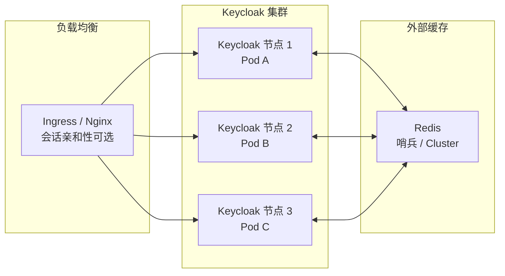

## 场景

你把 Keycloak 从单节点扩到 3 节点，以为高可用搞定了。第二天用户反馈：同一个浏览器，刷几次页面就要重新登录。检查日志发现 Session 在节点 A 上创建，但下次请求被负载均衡打到节点 B——节点 B 不认识这个 Session，直接 401。

Keycloak 默认用 Infinispan 做分布式缓存，节点间通过 JGroups 同步数据。但 Infinispan 在 Kubernetes 环境中有几个常见痛点：Pod 重启后缓存丢失、JGroups 发现偶尔分裂、跨区域延迟让同步变慢。**外挂 Redis 把 Session 数据放到独立缓存层，让每个 Keycloak 节点变成无状态**——Pod 随便重启，Session 还在 Redis 里。

> **版本说明**：Keycloak 26.7.0（2026-07-09 发布）引入了免外部缓存的多集群 HA 模式。如果你刚从 26.7 起步且只用单集群，可以跳过本文。如果你在 25.x / 早期 26.x，或者需要跨集群/跨数据中心共享 Session，Redis 外挂仍然是经过生产验证的选择。

## 适用与不适用

| 场景 | 是否适用 |
|------|----------|
| Keycloak 25.x / 26.0-26.6 需要集群 Session 共享 | ✅ 适用 |
| Kubernetes 环境 Pod 频繁重启、不希望缓存丢失 | ✅ 适用 |
| 跨数据中心 / 跨 K8s 集群共享 Session | ✅ 适用 |
| Keycloak 26.7+ 单集群部署 | ❌ 用内置多集群 HA 模式即可 |
| 只跑单节点 Keycloak | ❌ 不需要分布式会话 |
| 只需要缓存 Client/Realm 配置（非 Session） | ⚠️ 可以参考，但本文侧重 Session 缓存 |

## 架构概览

单节点 Keycloak 时，Session 在内存或本地 Infinispan 中。多节点场景下，负载均衡打到不同节点时，Session 必须在节点间可访问：



关键设计决策：

- **Infinispan 内嵌模式**：节点间 JGroups 直接通信，不需要额外组件。优点是少一层依赖，缺点是 Pod 重启缓存丢失、跨区域延迟敏感。
- **Redis 外部模式**：Session 数据写到一个独立 Redis，Keycloak 节点变成无状态。优点是 Pod 重启不影响 Session、跨集群共享简单；缺点是多一个 Redis 要维护。

如果你已经用 [Keycloak 生产数据库配置]() 把 PostgreSQL 准备好了，Redis 是第二块需要外部化的基础设施。

## Keycloak 端配置

### 方式一：环境变量（Quarkus Keycloak 25.x+)

Keycloak 25+ 基于 Quarkus，用 `KC_CACHE_REMOTE_*` 环境变量配置外部缓存：

```bash
# 启用远程缓存（替代内嵌 Infinispan）
KC_CACHE=remote
KC_CACHE_REMOTE_HOST=redis.platform.svc.cluster.local
KC_CACHE_REMOTE_PORT=6379

# Redis 认证（生产必须配密码）
KC_CACHE_REMOTE_USERNAME=default
KC_CACHE_REMOTE_PASSWORD=your-redis-password

# TLS 加密（Redis 6+ 支持 TLS，强烈建议生产启用）
# KC_CACHE_REMOTE_TLS_ENABLED=true
# KC_CACHE_REMOTE_TLS_KEYSTORE_FILE=/certs/redis-truststore.jks
# KC_CACHE_REMOTE_TLS_KEYSTORE_PASSWORD=keystore-pass
```

如果走了 TLS，把 CA 证书挂载进 Pod：

```yaml
# Keycloak Deployment 片段
volumes:
  - name: redis-tls
    secret:
      secretName: redis-tls-cert
containers:
  - name: keycloak
    volumeMounts:
      - name: redis-tls
        mountPath: /certs
        readOnly: true
```

### 方式二：kubectl set env（即时生效，重启后丢失）

不方便改 Helm values 时可以先试试：

```bash
kubectl -n platform set env deploy/keycloak \
  KC_CACHE=remote \
  KC_CACHE_REMOTE_HOST=redis.platform.svc.cluster.local \
  KC_CACHE_REMOTE_PORT=6379 \
  KC_CACHE_REMOTE_PASSWORD=your-redis-password
```

但这只改了环境变量，如果 Deployment 重建会丢失。正式操作还是改 Helm values 或 Kustomize overlay。

### 确认生效

检查 Keycloak 启动日志中是否有 `remote-cache` 相关条目：

```bash
kubectl -n platform logs deploy/keycloak | grep -i "remote-cache\|Infinispan.*remote"
```

如果日志出现 `ISPN000` 前缀且提到 Redis host，说明已经切到外部缓存。

## Redis 端配置

### 最小 Redis 配置

```conf
# redis.conf
port 6379
requirepass your-strong-password
maxmemory 2gb
maxmemory-policy allkeys-lru

# 持久化：RDB + AOF 都开，重启后恢复策略优先
save 900 1
save 300 10
save 60 10000
appendonly yes
appendfsync everysec
```

`maxmemory-policy` 用 `allkeys-lru` 而不是 `noeviction`——Keycloak Session 可以丢弃（用户重新登录即可），但缓存满了返回 OOM 错误会让 Keycloak 挂掉。

### 建议：Redis Sentinel 或 Cluster

生产环境别用单节点 Redis。最低配是 Redis Sentinel（一主两从 + 三个 Sentinel），提供自动故障转移。Keycloak 只关心 Redis 地址，切主时 Sentinel 会把新主 IP 推过来。

Keycloak 不需要 Redis Cluster 的分片能力——Session 数据通常不超过几个 GB，单个 Redis 实例加够内存即可。Redis Cluster 的 slot 路由反而增加了配置复杂度。

### Kubernetes 部署（Bitnami Helm Chart）

```bash
helm repo add bitnami https://charts.bitnami.com/bitnami
helm upgrade --install redis bitnami/redis \
  -n platform \
  --set auth.password=your-strong-password \
  --set master.persistence.size=10Gi \
  --set replica.replicaCount=2 \
  --set sentinel.enabled=true \
  --set sentinel.quorum=2
```

部署后拿到 Redis Service 地址：

```bash
# 输出类似 redis.platform.svc.cluster.local:6379
kubectl -n platform get svc redis -o jsonpath='{.metadata.name}.{.metadata.namespace}.svc.cluster.local:{.spec.ports[0].port}'
```

## 验证

### 1. 确认 Keycloak 能连上 Redis

```bash
kubectl -n platform logs deploy/keycloak --tail=50 | grep -i redis
```

期望看到类似 `ISPN000xxx: Successfully connected to Redis at redis://redis.platform:6379` 的日志。

### 2. 确认 Session 在 Redis 中

```bash
# 进 Redis 容器
kubectl -n platform exec -it redis-master-0 -- redis-cli -a your-strong-password

# 查 Keycloak Session key（前缀通常是 keycloak:sessions: 或 session）
> KEYS *session*

# 应该有类似 keycloak:sessions:<session-id> 的 key
> TTL keycloak:sessions:abc123
# 输出 Session 剩余的秒数（应与 Keycloak 配置的 Session 超时一致）
```

### 3. 模拟节点故障

```bash
# 删除一个 Keycloak Pod
kubectl -n platform delete pod keycloak-1

# 在浏览器中刷新受保护的应用页面
# 不应该被要求重新登录——Session 在 Redis 中，新 Pod 可以读取
```

### 4. 检查 Session 数量

```bash
kubectl -n platform exec -it redis-master-0 -- redis-cli -a your-strong-password DBSIZE
```

如果数量持续增长但 Session 超时设为 30 分钟，检查 `maxmemory-policy` 是否正确。如果 Session 数突然归零后回升，优先检查 Redis 是否有意外重启。

## 常见错误症状

| 症状 | 原因 | 解决 |
|------|------|------|
| Keycloak 启动后一直重试连接 Redis，日志里 `Connection refused` | Redis Service 不可达、DNS 解析失败、网络策略阻断 | `kubectl -n platform exec -it deploy/keycloak -- nc -zv redis 6379` |
| `NOAUTH Authentication required` | Redis 配了密码但 Keycloak 没传 `KC_CACHE_REMOTE_PASSWORD` | 检查 Deployment 中环境变量是否完整 |
| `READONLY You can't write against a read only replica` | Keycloak 连到了 Redis 从节点而非主节点 | 确认 Redis Service 的 selector 只匹配主节点；或启 Sentinel 并让 Keycloak 指向 Sentinel |
| 集群中只有一个 Pod 在线时正常，两个以上就随机 401 | Infinispan 没切到 Redis，还在用内嵌模式 JGroups 发现 | 确认 `KC_CACHE=remote` 且日志中没有 `JGroups` 相关条目 |
| Redis 内存满，Keycloak 报 `OOM command not allowed` | `maxmemory-policy` 是 `noeviction` | 改成 `allkeys-lru`，Session 过期是可接受的损失（用户重登即可） |
| 切换 Redis 后 Session 超时变短 | Redis `maxmemory-policy` 驱逐了 Session key | 增加 Redis 内存或加大 `maxmemory` |
| 所有 Pod 都挂了，重启后 Session 全部丢失 | Redis 没持久化（RDB/AOF 都关闭） | 开启 `save` 和 `appendonly`；最低配也至少开 AOF |
| Keycloak 26.7 环境变量不生效 | 26.7 内置 HA 模式可能覆盖了 `KC_CACHE` 配置 | 检查是否启用了 26.7 多集群特性；两套方案只能选其一 |

## 回滚方式

回滚分两步：先切回内嵌 Infinispan，再确认 Session 稳定。

### 第一步：恢复 Infinispan 内嵌模式

```bash
# 去掉远程缓存配置
kubectl -n platform set env deploy/keycloak KC_CACHE- KC_CACHE_REMOTE_HOST- KC_CACHE_REMOTE_PORT- KC_CACHE_REMOTE_PASSWORD-
```

或回滚 Helm release：

```bash
helm rollback keycloak 1 -n platform
```

### 第二步：验证

- 确认日志中出现 `ISPN000` 开头的 JGroups 发现日志（而非 Redis 连接日志）
- 对多 Pod 集群，做一次 `kubectl delete pod` 测试——内嵌模式下，Session 会在剩余节点中保留，已删除 Pod 上的 Session 会丢失
- 如果你已经在多个集群共享 Redis Session，回滚后跨集群 Session 共享会失效——这是预期的

### 不影响什么

- Redis 实例可以保留不删，切回内嵌模式后只是 Keycloak 不再往里面写数据
- PostgreSQL 完全不受影响

## FAQ

### Q1：Keycloak 26.7 说不需要外部缓存了，我还有必要配 Redis 吗？

视部署场景而定。26.7 的免外部缓存 HA 针对**单 K8s 集群内部的多 Pod 部署**。如果你需要跨两个 K8s 集群或跨数据中心共享 Session，Redis 仍然是更简单的选择——两台 Keycloak 各自接同一个 Redis 就行，不需要打通 JGroups 网络。

### Q2：用 Redis 替代 Infinispan 后，Keycloak Admin Console 的 Session 查看还能用吗？

能用。Session 数据的内容没变，只是存储位置从 Infinispan 内存变成了 Redis。Admin Console 中的 Sessions 列表和 Revocation 功能仍然照常工作。

### Q3：Redis 挂了会怎样？Keycloak 还能不能用？

Redis 挂掉后，Keycloak 节点还能继续处理已缓存在本地的 Session（如果有短期本地缓存层）。但新登录的 Session 写不进 Redis，用户登录后会立刻遇到 Session 不一致的问题——请求打到不同 Pod 可能得到不同结果。

所以 Redis 的可用性要求和 Keycloak 本身一样高。至少配 Sentinel，最好在 Redis 前加一层 HAProxy 或 Kubernetes Service 自动切主。

### Q4：Cookie 的会话亲和性（Sticky Session）和 Redis 外部缓存放一起会冲突吗？

不冲突，但有一个值得注意的陷阱。如果负载均衡器配置了 Sticky Session（`sessionAffinity: ClientIP`），用户请求会一直打到同一个 Pod——这时候 Redis 里确实有 Session 数据，但负载均衡让跨 Pod 访问变成了小概率事件，Redis 的存在感很低。

这不是坏事——Redis 的价值在 Pod 故障转移时体现。但是如果你配了 Sticky Session 又发现 Redis 利用率很低，不用紧张，说明集群够稳定。监控 Pod 重启次数和 Session 迁移频率，而不是片面看 Redis QPS。

### Q5：可以和 Keycloak 缓存 Server Config / Client / Realm 一起放 Redis 吗？

可以。`KC_CACHE=remote` 模式下，不只是 Session，Realm 配置、Client 注册、用户凭证缓存（`brute-force` 计数器等）也会进 Redis。好处是所有节点看到完全一致的配置，坏处是 Redis 一旦慢下来会影响登录性能。

建议分段控制：

- **Session 缓存**：进 Redis，跨节点共享
- **Realm/Client 配置缓存**：保留本地 Infinispan 缓存，用数据库轮询同步（变更频率低，本地缓存够用）
- **密码暴力破解计数器**：进 Redis（跨节点联防才有意义）

> 分段控制在 Keycloak 26.x 中可以通过 `cache-ispn.xml` 微调；`KC_CACHE=remote` 模式下默认所有缓存进远程。需要分段控制的话，参考 [Keycloak Infinispan Cache Configuration](https://www.keycloak.org/server/caching) 官方文档中的 `remote-cache` 配置块。

## 参考来源

- Keycloak Server Caching Guide: <https://www.keycloak.org/server/caching>
- Keycloak 26.7 Release Notes (multi-cluster HA without external cache): <https://www.keycloak.org/2026/07/keycloak-2670-released.html>
- Infinispan Remote Cache Configuration: <https://infinispan.org/docs/stable/titles/configuring/configuring.html>
- Redis production deployment guide (Bitnami Helm): <https://github.com/bitnami/charts/tree/main/bitnami/redis>
