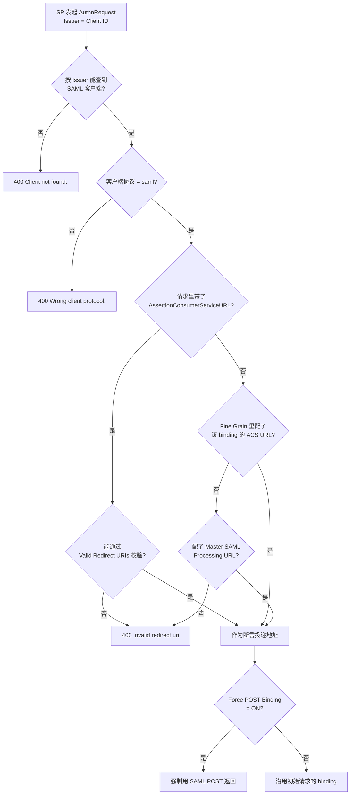

## 场景

只支持 SAML 的存量系统（OA、ERP、报表平台、采购的 SaaS）要接 Keycloak，配完以后通常卡在下面几种表现上，而且报错信息都不指向真正的配置项：

- 用户点登录，浏览器停在 Keycloak 的错误页：`Client not found.` 或 `Invalid Request`；
- SP 侧日志说断言签名校验失败，但 Keycloak 的重启、证书、算法看起来都没动过；
- 断言能解密、能验签，SP 却建了一个新账号——NameID 对不上既有用户；
- IdP 发起的入口链接（企业门户点图标直接进应用）返回 `Invalid redirect uri`。

这些问题的共同点是：**Keycloak 侧的 SAML 客户端有 20 多个开关，而 SP 只关心其中 5 个，两边的对应关系没有文档写过**。本文按「一条断言从 SP 请求到落地」的顺序，把这些开关和它们的实际行为对齐。

本文涉及的 Keycloak 行为核对自 `keycloak/keycloak` 26.7.4 tag 的 `SamlService`、`SamlProtocol`、`SamlClient`、`AttributeStatementHelper` 源码，以及 26.7 官方 Server Administration Guide 的 SAML 客户端章节；错误页文案取自 `themes` 中的 `messages_en.properties`。

## 适用与不适用

**适用**：存量应用只实现 SAML 2.0，需要在 Keycloak 侧建 SAML 客户端并完成对接、排错、回滚。SP 是 ADFS、Shibboleth、自研 Java/PHP 系统、采购的 SaaS 都算。

**不适用**：新开发的应用应优先用 OIDC，协议选型的判断见 [IAM 协议选型指南]()。同一个 Realm 里 OIDC 与 SAML 共存时的身份主键设计（`sub` 与 NameID 如何统一）是另一个问题，见 [IAM 多协议集成实战]() —— 那篇解决「两个协议怎么共享同一个用户」，本文解决「一个 SAML 客户端为什么配不通」。

**不适用（另一类）**：Keycloak 作为 SP 去对接上游 SAML IdP（企业微信、Entra ID、AD FS）是身份联邦方向，配置入口在 Identity Providers 而不是 Clients，见 [Keycloak 社交登录配置]()。

## 五个开关与 SP 概念的对应关系

SAML 集成失败最常见的原因不是「少配了」，而是「配到了名字相似的另一个字段上」。先把对应关系钉死：

| SP 侧概念 | Keycloak 里对应什么 | 存到哪里（Admin REST API 视角） |
|-----------|--------------------|-------------------------------|
| EntityID / AuthnRequest 的 `Issuer` | **Client ID** | `clientId` |
| Assertion Consumer Service URL | Valid Redirect URIs（**必须**覆盖） + Fine Grain 里的 ACS URL | `redirectUris`、`attributes.saml_assertion_consumer_url_post` / `..._redirect` |
| 通用 SAML 处理地址 | Master SAML Processing URL | 客户端的管理地址（源码中即 `client.getManagementUrl()`） |
| SP 签名公钥（入向请求验签） | Keys 标签页 `Client Signature Required` + 证书 | `attributes["saml.signing.certificate"]`，或由 Metadata descriptor URL 自动拉取 |
| SP 加解密公钥（加密断言） | Keys 标签页 `Encrypt Assertions` + 证书 | `attributes["saml.encryption.certificate"]` |
| Single Logout 端点 | Fine Grain 里的 Logout Service URL | `attributes.saml_single_logout_service_url_post` / `..._redirect` |

三条硬约束：

1. **Client ID 必须与 SP 发来的 `Issuer` 完全一致**（含大小写、尾斜杠）。Keycloak 拿到 AuthnRequest 后用 `Issuer` 反查客户端，查不到就是 `Client not found.`——它不会提示「你差一个斜杠」。
2. **Client ID 撞上已有的 OIDC 客户端也是错误**。源码里客户端找到后会检查协议，不是 `saml` 时直接返回硬编码文案 `Wrong client protocol.`。用同一个 `clientId` 同时服务 OIDC 和 SAML 是不成立的。
3. **这些 SAML 开关都是客户端级属性**。`SamlClient` 继承的 `resolveAttribute()` 实现就是 `client.getAttribute(name)`，没有 Realm 级兜底。用 Admin REST API 更新时必须写到 `client.attributes`，写到 Realm attributes 里不生效。

## 断言会被发到哪个地址

SP 发起（SP-Initiated）和 IdP 发起（IdP-Initiated）走的是两条不同的回退链，这一点官方文档把 IdP 发起那条写清楚了，SP 发起那条需要从源码确认。



SP 发起的链路（`SamlService.loginRequest()`）：先看请求里有没有 `AssertionConsumerServiceURL`——有就走 `Valid Redirect URIs` 校验，校验不过直接 400；没有才按 binding 去取 Fine Grain 里的 ACS URL（artifact / post / redirect 各一个），**取不到时回退到 Master SAML Processing URL**，两者都没有才报 `Invalid redirect uri`。

IdP 发起的链路（`SamlService.getUrlAndBindingForIdpInitiatedSso()`）顺序不同：**ACS POST Binding URL → Master SAML Processing URL（POST）→ ACS Redirect Binding URL**，前两个都会用 POST，只有最后一个才降级为 REDIRECT。

三个实践结论：

- **Valid Redirect URIs 与 ACS URL 是两件事**。ACS 地址写在 Fine Grain 里只是「本客户端打算把断言发去哪」，它仍然要能匹配 `Valid Redirect URIs` 的规则（通配符只允许出现在末尾）。只填了 ACS URL 而没加白名单，症状就是 `Invalid redirect uri`。
- **Force POST Binding 是响应 binding 的强覆盖**。默认行为是「客户端用什么 binding 提问，就用什么 binding 回答」。Redirect binding 把整条断言放进 URL，既有长度上限又会被接入层日志记下来——对断言体积大的 Realm（属性多、group 多）尤其危险。SP 侧只接受 POST 时必须显式打开这个开关，而不是让 SP 去适配。
- **IdP 发起的入口由客户端属性决定，而不是一个全局页面**。入口地址形如 `/realms/{realm}/protocol/saml/clients/{IDP-Initiated SSO URL name}`，Keycloak 用 `saml_idp_initiated_sso_url_name` 属性精确检索客户端；这个字段留空就等于关闭该客户端的 IdP-Initiated 登录。返回 400 时先核对这个 URL name，再核对上面那条回退链——两条都对不上时表现都是同一个错误页。

## NameID 是怎么算出来的

NameID 决定了 SP 认为「这是谁」，是整条链路里最需要一次配对的字段。`SamlProtocol.getNameIdFormat()` 与 `getNameId()` 的逻辑是：

**先定格式**：AuthnRequest 里的 NameIDPolicy 优先；勾了 `Force Name ID Format` 则忽略 SP 的请求，强制用 Admin Console 里配置的值；两处都没有时用默认值 `urn:oasis:names:tc:SAML:1.1:nameid-format:unspecified`。

**再算值**：

| Console 里的 Name ID Format | 断言里的 NameID | 取值来源 |
|-----------------------------|----------------|---------|
| `username`（映射为 `unspecified`） | 用户名 | `user.getUsername()` |
| `email` | 用户邮箱 | `user.getEmail()`，**可能为空** |
| `persistent` | 稳定随机标识 | 用户属性 `saml.persistent.name.id.for.<clientId>` |
| `transient` | 每次登录都不同 | 现生成的 `G-<uuid>` |

几个只有读源码才会知道的细节，正好对应最常见的三个「配置看起来没问题但就是不工作」：

1. **`email` 格式不会因为用户没有邮箱而报错**。源码里只在邮箱为 null 时打一条 debug 日志，然后把这个空值返回——SP 收到的是空 NameID。日志级别不够的人根本看不到，现象是「SP 建号失败或说用户标识为空」。
2. **`persistent` 的值存在用户属性里，而属性名带 Client ID**。Keycloak 先找 `saml.persistent.name.id.for.<clientId>`，再找通配的 `saml.persistent.name.id.for.*`，都没有才生成 `G-<uuid>` 并**写回用户属性**持久化。这意味着：改 Client ID 等于换一套 NameID，SP 侧的老用户全部对不上（要用**同一个 Client ID 重建客户端**才会复用旧值）；反过来，这也解释了为什么 `persistent` 是跨协议稳定关联的推荐值。
3. **`transient` 天生不能被 SP 用来建号**。它每次登录生成新的 `G-<uuid>` 且不落库，只适合「每次登录都要重新匹配」的场景。
4. **SP 可以在 AuthnRequest 里指定 NameIDPolicy**。如果 SP 一直要求 persistent，而你在 Console 里配了 email，不打 `Force Name ID Format` 的话生效的是 SP 的策略——两边对不上时先抓一条真实断言确认实际用的是哪个格式，不要只看 Console。

跨协议一致性（同一个人的 OIDC `sub` 与 SAML NameID 是否指向同一个人）是独立议题，做法见 [IAM 多协议集成实战]()。

## 断言的有效期比你以为的短

这一条值得单独拉出来，因为它解释了「登录明明成功，SP 却说断言已过期」。

`SamlProtocol.buildResponse()` 组装断言的三个时间来自不同配置：

| XML 位置 | 取值 | 客户端 `Assertion Lifespan` 未配置时的回退 |
|----------|------|------------------------------------------|
| `<Conditions NotOnOrAfter>` | Assertion Lifespan | **Realm 的 Access Code Lifespan（默认 60 秒）** |
| `<SubjectConfirmationData NotOnOrAfter>` | Assertion Lifespan | Realm 的 Access Token Lifespan（默认 300 秒） |
| `<AuthnStatement SessionNotOnOrAfter>` | **始终**为 Realm 的 SSO Session Max | 与 Assertion Lifespan 无关 |

也就是说：不配 Assertion Lifespan 时，断言条件默认只在 **60 秒**内有效，而「Assertion Lifespan 不影响 `SessionNotOnOrAfter`」这一点官方文档明确写出来了。SP 从这个断言推导出的应用会话长度，取决于它读的是哪个字段——只读 SSO Session Max 的 SP 拿到的会是 10 小时。

落地建议：**对接 SAML 应用时显式配一个 Assertion Lifespan**（例如 300 秒），不要依赖默认值。两个理由：一是这个字段的默认回退值来自 Access Code Lifespan，是个语义上属于授权码流程的配置，改动它会影响 OIDC 侧；二是断言有效期过短时，SP 与 Keycloak 的时钟偏差、慢链路、队列积压都会表现为「随机有一部分登录失败」，很难复现。

时钟偏差本身在 **SP / 适配器侧**判定（适配器配置里的 `allowedClockSkew` 属于校验入向断言的开关），Keycloak 作为 IdP 没有对应的同名字段——不要按适配器文档去 IdP 侧找它。

## 签名、加密与两个容易配反的组合

| 开关 | 作用 | 默认 |
|------|------|------|
| Sign Documents | 用 Realm 私钥对整个响应签名 | 关闭 |
| Sign Assertions | 只对断言部分签名 | 关闭 |
| Signature Algorithm | 签名算法 | `RSA_SHA256`（源码兜底值） |
| SAML Signature Key Name | POST 断言里 `KeyName` 的内容 | `KEY_ID` |
| Include AuthnStatement | 是否带认证方式与时间戳 | **开启** |

四个要点：

- **Sign Documents 与 Sign Assertions 是两个独立开关，SP 可能只验其中一个**。「两位都开」是最不容易出错的选择；只开某一个时，必须确认 SP 校验的是同一个位置。这个组合问题是「签名校验失败」报错的第一嫌疑，而不是证书。
- **`SAML Signature Key Name` 是 ADFS 互操作的坑**。默认 `KEY_ID` 表示 `KeyName` 放 key ID；ADFS 期望的是证书主题，必须切成 `CERT_SUBJECT`；`NONE` 则完全不输出 KeyName 提示。ADFS 报签名相关错误时先看这个字段。
- **`*_SHA1` 算法不要再选**。官方文档明确指出 SHA1 系列已弃用，并且**在 Java 17 及以上运行的 SAML 客户端无法验证用 SHA1 签名的响应**。表现为 SP 升级 JDK 后突然验签失败，而 Keycloak 什么都没改。
- **`Include AuthnStatement` 关掉会产生永不过期的应用会话**。文档给出的后果是「客户端无法确定最大会话时长」。除非 SP 明确要求，不要关。

**加密断言的顺序**：`Encrypt Assertions` 要求 SP 的公钥已经在 Keys 里（手工导入证书，或打开 `Use metadata descriptor URL` 让 Keycloak 从 SP 的 metadata 拉取并缓存）。顺序错了就是「SP 收到一段它解不开的密文」——所以开加密永远在 SP 侧就绪之后，且回滚时第一步就关它。

## 验证

**一、取 IdP metadata，确认对外暴露的地址和签名证书**

```bash
curl -s "https://kc.example.com/realms/demo/protocol/saml/descriptor" \
  | xmllint --format - \
  | grep -E "entityID|SingleSignOnService|NameIDFormat"
```

顺手核对签名证书的有效期（这是 SAML 集成最常见的「某天突然全挂」来源）：

```bash
curl -s "https://kc.example.com/realms/demo/protocol/saml/descriptor" \
  | xmllint --xpath 'string(//*[local-name()="X509Certificate"])' - \
  | base64 -d | openssl x509 -noout -subject -dates
```

**二、抓一条真实断言看实际内容**

不要根据 Console 推断断言长什么样。POST binding 下从浏览器开发者工具的网络面板复制 `SAMLResponse` 的值（Base64）：

```bash
echo '<SAMLResponse 的值>' | base64 -d | xmllint --format - | less
```

Redirect binding 下断言先 DEFLATE 压缩再 Base64、再 URL 编码，需要先解压：

```bash
python3 -c "import sys,zlib,base64,urllib.parse; \
print(zlib.decompress(base64.b64decode(urllib.parse.unquote(sys.argv[1])),-15).decode())" '<SAMLResponse 的值>'
```

解码后按顺序看四处：`Issuer`（是否等于 Client ID）、`NameID` 与 `NameID Format`（是否与预期一致）、`Conditions` 与 `SubjectConfirmationData` 的 `NotOnOrAfter`（是否就是上面那 60 秒）、`AttributeStatement` 里每个属性的 `NameFormat`。

**三、按需打开 SAML 相关日志**

Keycloak 支持按 category 单独设级别，不需要把全局日志调到 DEBUG：

```bash
kc.sh start --log-level="INFO,org.keycloak.saml:debug,org.keycloak.protocol.saml:debug"
```

**四、属性对不上时先看 NameFormat**

属性 mapper 的配置键是 `attribute.name`、`attribute.nameformat`、`friendly.name`（还有取值的 `user.attribute`）。NameFormat 的可选值是 `Basic` / `URI Reference` / `Unspecified`，**未设置时源码里按 `Basic` 处理**。SP 若按 URI 形式的属性名匹配（很多 Java SP 与 Shibboleth 系 SP 会这么做），而 Keycloak 发的是 Basic 名的属性，SP 侧表现就是「属性没收到」而不是「属性名不对」。这类问题在断言解码后一眼可见。

## 常见错误表

| 症状（含确定性文案） | 先看什么 | 常见根因 | 修法 |
|---------------------|---------|---------|------|
| 错误页 `Client not found.` | Client ID 与 SP 的 EntityID | 大小写、尾斜杠、`http`/`https` 不一致；SP 发的是元数据里的 EntityID 而非应用配置里那个 | 让 Client ID 逐字符等于 SP 发来的 `Issuer` |
| 错误页 `Wrong client protocol.` | 该 Client ID 上已存在的客户端 | 同 Client ID 复用了 OIDC 客户端 | 为 SAML 应用单独建客户端，Client ID 用 SP 的 EntityID |
| 错误页 `Invalid redirect uri` | Valid Redirect URIs / Fine Grain 的 ACS URL / Master SAML Processing URL | 只填了某个 ACS 地址但没进白名单；通配符写在中间；IdP 发起的入口用的 URL name 与 ACS 都没配 | 补白名单；通配符只保留末尾；IdP 发起场景至少配 ACS POST 地址 |
| 错误页 `Invalid Request` | AuthnRequest 本身（Destination、格式） | 请求的 `Destination` 与实际访问的 Keycloak 地址不一致（常见于内外网双域名、反向代理改写 Host） | 统一 SP 看到的对外地址，并核对反向代理头的处理，见 [真实客户端 IP 与代理信任边界]() |
| SP 报签名验证失败 | Sign Documents / Sign Assertions 组合、Signature Algorithm、SAML Signature Key Name | SP 只验了没开签名的那个位置；仍在用 SHA1（Java 17+ 验不了）；ADFS 需要 `CERT_SUBJECT` | 两个签名开关都开、算法统一到 `RSA_SHA256`、按 SP 类型选 KeyName |
| SP 报断言过期（NotOnOrAfter） | 断言里 `<Conditions>` 的 `NotOnOrAfter` | 未配 Assertion Lifespan，回退到了 Realm 的 Access Code Lifespan（默认 60 秒） | 客户端显式配置 Assertion Lifespan（如 300 秒）；同时检查两侧时钟 |
| SP 拿到空 NameID / 建号失败 | 用户的 email 字段 | Name ID Format 配成 `email`，但用户没有邮箱 | 补用户邮箱，或改用 `persistent` / username |
| SP 建了新账号而不是匹配上老账号 | 断言里的 NameID 实际值 | Client ID 变更导致 `persistent` 的存储键变化 | 用原 Client ID 重建客户端；必要时在 SP 侧做一次用户重新绑定 |
| SP 说「属性没收到」 | 解码后属性的 `NameFormat` | NameFormat 用了默认 `Basic`，而 SP 按 URI 名匹配 | 把 mapper 的 NameFormat 改成 `URI Reference` 并同步属性名 |
| SP 解不开断言 | Keys 里 SP 的加密公钥 | 开了 `Encrypt Assertions` 但证书未导入或不匹配 | 导入 SP 正确公钥，或打开 `Use metadata descriptor URL`；先关加密验证链路 |
| 断言体积过大、URL 被截断 | 响应使用的 binding | 走 Redirect binding 把断言放在 URL 上 | 打开 `Force POST Binding`；同时考虑精简属性 mapper |
| IdP 发起链接 400 | `IDP-Initiated SSO URL name` 与回退链 | URL name 留空、拼错，或三种 ACS 地址一个都没配 | 补 URL name 与 ACS POST 地址，见上文回退链 |

排查顺序建议固定成两步：**先看 Keycloak 侧返回的是哪一页错误**（这一步就能把范围缩到「找不到客户端 / 协议不对 / 地址没登记 / 请求本身有问题」四类之一），**再解码一条真实断言**确认 NameID 与有效期。绝大多数「配置正确但不工作」的案例，答案都在解码后的断言里，而不是在 Console 的某个开关上。

## 回滚

按「影响面从小到大」的顺序退：

1. **先关 `Encrypt Assertions`**。这一步不需要 SP 配合，能立刻把「SP 解不开密文」从变量里排除。
2. **再关 `Sign Assertions` / `Sign Documents`**，或在 SP 侧放宽校验。注意这是**降低安全等级**的临时手段，只能用于定位，不能停在打开状态上线。
3. **需要改 NameID 格式时，必须与 SP 侧同步**。`email` ↔ `persistent` 的切换会改变 SP 认定的用户标识，SP 若以 NameID 建号，切换等于换一批用户。回滚前先确认 SP 侧的用户表是否以 NameID 为键。
4. **不要用删除客户端来「重置」配置**。`persistent` NameID 存在用户属性里，删除客户端不会清掉这些属性；而重建客户端时只要 **Client ID 相同**，旧值就会被复用——所以删了重建并不会得到一套干净的 NameID。要真正重置必须同时处理用户属性。
5. **禁用优于删除**。`Client disabled.` 是可控的中间态，禁用后随时可以恢复原配置；删除会一并丢掉该客户端的 mapper、scope 关联与 SLO 端点配置。
6. **换过证书或改过 `Use metadata descriptor URL` 的，注意缓存窗口**。Keycloak 会把从 metadata 拉到的证书缓存起来，缓存时长取决于 metadata 里的 `cacheDuration` / `validUntil` 或缓存 provider 的默认值。在这个窗口内观察到的验签失败可能只是旧证书还没过期，不要在窗口内就判定回滚失败。

## IAM SAML 对接 FAQ

**Q1：为什么 IAM 平台里 Client ID 必须等于 SP 的 EntityID，而不是随便取个名字？**

因为 SAML 的 AuthnRequest 里没有 `client_id` 参数，Keycloak 唯一能用来定位客户端的字段就是 `Issuer`，而 SP 通常把 EntityID 填进 `Issuer`。这也是 SAML 与 OIDC 的结构性差异：OIDC 每个请求显式带 `client_id`，SAML 靠约定把 EntityID 当成客户端标识。要在 IAM 里换掉这个标识，成本在 SP 侧而不在 Keycloak 侧。

**Q2：IAM 从别的 IdP 迁到 Keycloak 后，用户全被 SP 当成新用户，怎么定位？**

先解码一条断言看 NameID 的实际值，再判断 SP 以什么为键建号。若 SP 用 NameID 建号且原 IdP 用的是邮箱或员工号，就要让 Keycloak 侧产生同一套值——用 `email` 格式或 `User Attribute NameID Mapper` 映射同一属性，而不是接受 `persistent` 生成的新随机值。迁移前的对照清单见 [IAM 多协议集成实战]() 里的身份键检查。

**Q3：IAM 里的 SAML 会话时长由哪个配置决定？**

三个时间分别来自三个配置：断言的 `<Conditions>` 有效期来自客户端的 Assertion Lifespan（未配则回退到 Realm 的 Access Code Lifespan），SP 可能据此推断的会话上限来自 Realm 的 SSO Session Max，而 `<AuthnStatement>` 里的 `SessionNotOnOrAfter` **始终**是 SSO Session Max，不受 Assertion Lifespan 影响。调「SAML 登录多久过期」前先确定 SP 读的是哪个字段。

**Q4：SP 只接受 POST，但 Keycloak 回的是 Redirect，怎么改？**

打开客户端的 `Force POST Binding`。默认行为是沿用客户端初始请求所用的 binding，SP 用 Redirect 提问时 Keycloak 就用 Redirect 回答；Force POST Binding 覆盖这个默认。改完抓一条断言确认绑定方式，同时检查接入层的响应大小限制——断言放进 URL 时被截断是另一个独立故障。

**Q5：IdP 发起的单点登录（门户点图标免登）在 IAM 里怎么配？**

在客户端里填 `IDP-Initiated SSO URL name`（纯字符串、无空格），门户链接指向 `/realms/{realm}/protocol/saml/clients/{该名称}`。同时必须至少配好三类 ACS 地址中的一个，否则 Keycloak 找不到投递目标，直接返回 `Invalid redirect uri`。需要固定 RelayState 时用 `IDP Initiated SSO Relay State` 字段，也可以在链接上加 `?RelayState=` 覆盖。

## 延伸阅读

- 协议原理、断言结构与元数据交换：[SAML 2.0 协议详解]()
- 断言签名、重放与攻击面：[SAML 2.0 攻击面与防护]()
- 从 AD FS 撤离时的 NameID 与声明映射：[AD FS 迁移 Microsoft Entra ID]()
- 用户源侧（AD/LDAP）与 SAML 的配合：[Keycloak LDAP / AD 用户联邦]()
