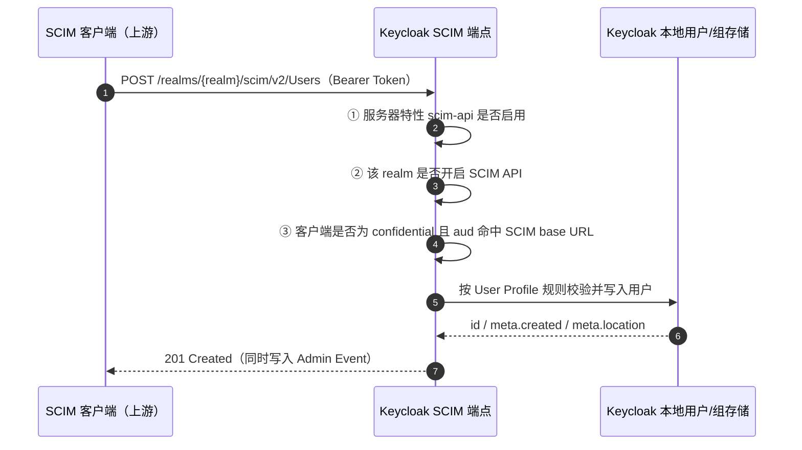

## 场景描述

上游身份治理平台或 HR 系统支持标准 SCIM 2.0，希望直接把用户和组推进 Keycloak。在此之前只有两条路：装社区 SCIM 扩展，或者在 Keycloak 前面自建一个网关把 SCIM 翻译成 Admin REST API。Keycloak 26.7.0 把 SCIM API 从 experimental 提升为 preview，realm 可以原生对外暴露 `/realms/{realm}/scim/v2`，HR 系统或身份治理平台不必再依赖第三方插件。

这一篇只回答两个问题：怎么把它打开并跑通，以及它明确做不到什么。

**适用场景：**

- Keycloak 26.7.x，上游是标准 SCIM 2.0 客户端（Okta、Entra ID、身份治理平台、自研同步任务）
- 需要**入站** provisioning：由上游 push 创建、更新、停用 Keycloak 本地用户与组
- 可以接受「preview 特性 + 灰度验证」的落地方式

**不适用场景：**

- 仍停留在 26.6 及更早版本。26.6.0 的 `Profile.java` 中 `SCIM_API` 只是 `Type.EXPERIMENTAL` 且未写入管理指南，26.7.0 起才是 `Type.PREVIEW`。旧版本仍需社区扩展或外部 SCIM 网关，不要因为升级前的旧文章说「支持 SCIM」就假设已经有 `/scim/v2`。
- 需要**出站** provisioning（Keycloak → 下游 SaaS）。官方明确：把 Keycloak 作为 SCIM client 去联邦外部 SCIM 服务提供方属于 future releases，当前实现只覆盖「Keycloak 作为 SCIM 服务端」这一个方向。
- 需要同步密码。`ServiceProviderConfig` 返回 `changePassword.supported=false`，上游连接器里「设置密码」这类动作必须关掉或改走别的通道。
- 用户权威源在 AD/LDAP、由 User Federation 提供。此时先用 [Keycloak LDAP / AD 用户联邦]() 的方案，不要用 SCIM 对同一批账号做双写。

协议本身的分页、PATCH、过滤语义见 [SCIM 2.0 协议深度解读]()，Joiner-Mover-Leaver 全链路编排见 [IAM SCIM 用户自动配置实战]()。本篇只讲 Keycloak 这一端的具体实现与限制。

## 打开它需要两个开关，少一个就是 404

很多人卡在这里：特性开了，请求还是 404。原因是 Keycloak 要求**服务器端特性**和**realm 开关**都打开。

1. **服务器特性（一次性，重启生效）**：启动参数 `--features=scim-api`；容器/K8s 环境对应 `KC_FEATURES=scim-api`。这是 preview 特性，默认 profile 不加载。启动日志里应出现 `Preview features enabled: scim-api` 之类的确认行。
2. **逐个 realm 打开**：Admin Console → *Realm settings* → *General* 标签页 → *SCIM API* 开关置为 On 并保存；官方同时支持通过 Admin REST API 设置。

源码行为可以解释这个 404：`ScimRealmResourceFactory#create()` 在 realm 未开启 SCIM 时直接 `return null`，并打一行 `WARN SCIM API is not enabled for realm '<realm>'`。所以判断方法很直接——看服务端有没有这行 WARN，而不是先怀疑反向代理。

Base URL 是 `https://<host>/realms/<realm-name>/scim/v2`，默认使用 realm 的 frontend URL 生成。可用端点：

| 端点 | 方法 | 说明 |
|------|------|------|
| `/Users`、`/Users/{id}` | GET, POST / GET, PUT, PATCH, DELETE | 用户资源的列表、创建、读取、整体替换、部分更新、删除 |
| `/Groups`、`/Groups/{id}` | GET, POST / GET, PUT, PATCH, DELETE | 组资源的同套操作，含成员管理 |
| `/Users/.search`、`/Groups/.search` | POST | 把复杂或超长 filter 放进请求体 |
| `/ServiceProviderConfig`、`/ResourceTypes`、`/Schemas` | GET | 能力协商与 schema 发现 |

请求与响应使用 `application/scim+json`；请求体用 `application/json` 也被接受。状态码与 SCIM 规范一致：POST 返回 201、GET/PUT/PATCH 返回 200、DELETE 返回 204。

## 鉴权：服务账号客户端 + audience 必须精确匹配

SCIM 端点全部要求 OAuth 2.0 Bearer Token，未认证请求返回 401。只允许 confidential client，public client 会被明确拒绝——源码里对应 403 `Public client not allowed`。

创建服务账号客户端的步骤：*Clients* → Create client，勾选 *Client authentication* 与 *Service accounts roles*，然后在 *Service account roles* 里给 `realm-management` 客户端角色授权。

| 操作 | 所需角色 |
|------|----------|
| 创建、更新、删除用户与组 | `manage-users` |
| 读取单个用户 / 组 | `view-users` |
| 搜索（列表 + filter）用户 | `query-users` |
| 搜索（列表 + filter）组 | `query-groups` |
| 访问 `/ServiceProviderConfig`、`/ResourceTypes`、`/Schemas` | `query-users` 或 `query-groups`（含 `view-users`、`manage-users` 等隐含角色） |

最小全量权限是 `manage-users`。这里有一个容易忽略的复用点：SCIM 与 Admin REST API 共用同一套权限模型，如果已有服务账号具备管理用户和组的管理员角色，不需要额外配置就能调 SCIM；反过来，如果 realm 启用了细粒度管理权限，同一套 FGAP 策略也会约束 SCIM 的可见范围，可以先只授一个只读账号做验收。

**最容易卡住的一步是 audience。** SCIM API 会校验 Token 的 `aud`，期望值就是该 realm 的 SCIM base URL 本身（含 scheme、host、port、path）：

```
https://id.example.com/realms/myrealm/scim/v2
```

配置方式：给客户端加一个 *Audience* 类型的 protocol mapper，*Included Custom Audience* 填上面的完整 URL，并确保 *Add to access token* 打开。缺 mapper 或值不匹配都返回 401，错误原文是 `Invalid token audience`。

实践中有两个坑：

- **别猜 audience 的值**。客户端 ID、`scim`、`scim-api`、`urn:keycloak:scim` 都不是期望值，只有完整 base URL 匹配。
- **反向代理后面要用 frontend URL**。`ScimRealmResourceFactory` 用 `UrlType.FRONTEND` 的 base URI 拼出期望 audience，也就是说 Keycloak 按自己认定的对外地址校验，而不是按请求头里的 Host。代理层转发的外部域名与 Keycloak hostname/frontendUrl 配置不一致时，从外部访问会稳定 401，而集群内直连却正常——这与 [Hostname v2]() 里描述的 issuer 不一致属于同一类问题，先对齐 hostname 配置再排查 Token。

请求链路上有三道校验：



这三道校验分别指向不同的排查方向：① 没开特性时端点不存在；② 没开 realm 时是 404 + WARN 日志；③ Token 问题统一是 401（缺 Token 是 `Bearer token required`，audience 不符是 `Invalid token audience`）。图里最后一步写 Admin Event 是因为 SCIM 请求会构造 `AdminEventBuilder`，走的是与 Admin REST API 相同的管理员事件链路——启用 realm 的 Admin Events 之后，SCIM 写入同样会留下审计记录，这一点直接决定合规场景能不能验收。

## 最小可运行验证

先取 Token，再按「能力协商 → 创建 → 查询 → 停用 → 删除」的顺序验证。所有命令使用占位符，不要在生产环境把真实密钥写进 shell 历史。

```bash
export KC=https://id.example.com
export REALM=myrealm
export SCIM_BASE="$KC/realms/$REALM/scim/v2"

# 1. 用服务账号取 Token（client_credentials）
export TOKEN=$(curl -sS -X POST "$KC/realms/$REALM/protocol/openid-connect/token" \
  -d 'grant_type=client_credentials' \
  -d 'client_id=scim-client' \
  -d 'client_secret=<client-secret>' | jq -r '.access_token')

# 2. 能力协商：先确认服务端支持什么，再决定客户端开哪些功能
curl -sS -H "Authorization: Bearer $TOKEN" -H 'Accept: application/scim+json' \
  "$SCIM_BASE/ServiceProviderConfig" | jq '{patch,bulk,filter,changePassword,sort,etag}'

# 3. 创建用户（userName 必填）
curl -sS -X POST "$SCIM_BASE/Users" \
  -H "Authorization: Bearer $TOKEN" \
  -H 'Content-Type: application/scim+json' \
  -d '{
    "schemas": ["urn:ietf:params:scim:schemas:core:2.0:User"],
    "userName": "zhangsan@example.com",
    "name": {"givenName": "三", "familyName": "张"},
    "emails": [{"value": "zhangsan@example.com", "type": "work", "primary": true}],
    "active": true
  }' | jq '{id,userName,active,meta}'

# 4. 幂等查重：上游创建前应先做这一步，避免 409
curl -sS -G "$SCIM_BASE/Users" \
  -H "Authorization: Bearer $TOKEN" \
  --data-urlencode 'filter=userName eq "zhangsan@example.com"' | jq '.totalResults'

# 5. 停用（软删除）
curl -sS -X PATCH "$SCIM_BASE/Users/<user-id>" \
  -H "Authorization: Bearer $TOKEN" \
  -H 'Content-Type: application/scim+json' \
  -d '{
    "schemas": ["urn:ietf:params:scim:api:messages:2.0:PatchOp"],
    "Operations": [{"op": "replace", "path": "active", "value": false}]
  }' | jq '{id,active}'
```

验收不能停在「返回 201」。停用之后还要用该用户的会话访问一个受保护资源，确认新登录被拒绝；`active=false` 只改用户状态，不负责吊销已经签发的 Token 和已有会话，这与 [SCIM 协议解读]() 里强调的边界一致。资源层面的撤销窗口由 Token 生命周期决定。

## ServiceProviderConfig 给出的能力边界

很多 SCIM 连接器默认假设服务端「什么都有」，这在实际对接时会造成大量无意义重试。Keycloak 26.7.x 返回的能力如下，建议在集成契约里逐条对齐：

| 能力 | 返回值 | 对同步任务的实际影响 |
|------|--------|----------------------|
| `patch` | `supported: true` | 可以用 `add`/`replace`/`remove`，停用、改属性、加组成员都走 PATCH |
| `bulk` | `supported: false`，`maxOperations: 0` | 不能用批量端点，校招季这类大批量导入必须在客户端分批提交并自行控制并发与退避重试 |
| `filter` | `supported: true`，`maxResults: 100` | 单次最多返回 100 条，超过要用 `startIndex` 循环翻页；`startIndex` 从 1 开始 |
| `changePassword` | `supported: false` | 不能通过 SCIM 设置密码，上游「同步密码」功能必须关闭 |
| `sort` | `supported: false` | `sortBy` / `sortOrder` 会被接受但不生效，返回顺序由底层存储决定，不要依赖排序做增量 |
| `etag` | `supported: false` | 没有 `If-Match` 乐观锁，并发写没有版本保护，必须保证单一写入方 |

`ServiceProviderConfig` 当前是只读的，不能通过配置改成「支持 bulk」。过滤语法本身覆盖 RFC 7644 §3.4.2.2：`eq`/`ne`/`co`/`sw`/`ew`/`pr` 用于字符串，`gt`/`ge`/`lt`/`le` 用于 `meta.created`、`meta.lastModified` 这类时间属性，逻辑运算符支持 `and`/`or`/`not`。把 `co`、`sw`、`ew` 用在时间或布尔属性上会返回 `400` + `scimType: "invalidFilter"`。

## 组和属性：两处必须按规则写，否则 400

**组的成员只能通过 PATCH 管理。** 创建组时不能带 `members`（否则 400），`PUT` 也不能改成员（同样 400）。正确顺序是：`POST /Groups` 建组（只带 `displayName`、可选 `externalId`），再用 `PATCH /Groups/{id}` 加成员。`displayName` 重复会返回 `409` + `scimType: "uniqueness"`，与 `userName` 重复的行为一致。

**属性映射默认只覆盖一小部分。** 开箱映射的关系是：`userName`↔`username`、`emails`↔`email`、`name.givenName`/`name.familyName`↔名/姓、`active`↔`enabled`、`meta.created`↔`createdTimestamp`，`locale` 仅在 realm 开启国际化时可用。以下三类必须手工配置，否则字段会被静默忽略或直接报错：

1. **`externalId`**：默认未映射，需要在 *Realm settings → User profile* 建一个属性并把 SCIM 属性值设为 `externalId`。工号这类稳定主键就靠它，别用会变的 `userName`。
2. **Enterprise User 扩展**：`employeeNumber`、`department`、`manager` 等属性要逐个建用户属性，值填完整 URN，例如 `urn:ietf:params:scim:schemas:extension:enterprise:2.0:User:department`；复合属性的子字段还要拆开映射（`...:manager.value` 与 `...:manager.displayName` 分两个属性）。
3. **自定义 schema 扩展**：用同样的机制填写完整 URN 前缀值，配置完成后会自动出现在 `/Schemas` 里。

另外三点实际影响对接：Keycloak 不支持多邮箱，提交多个 `emails` 只保留第一个，返回时统一是单个 `work` + `primary` 的地址；`name.formatted` 由组件自动生成且只读；用户画像的校验规则在 SCIM 写入时同样生效，缺必填或格式不符返回 `400`，报错信息来自 User Profile 配置，与 [用 User Profile 限制企业邮箱注册]() 里描述的是同一套规则。

## 管理员资源保护：对管理账号的写入固定 403

Keycloak 会把带管理员角色的用户和组保护起来，防止 SCIM 客户端误删或降权管理员：

- **管理用户**：`GET` 只返回最小表示（`id`、`schemas`、`userName`），`PUT`/`PATCH`/`DELETE` 一律 `403`。用户仍会出现在列表和搜索结果里，但只有最小表示；管理员角色被全部回收后，该用户恢复可管理。
- **管理组**：同样只返回最小表示（`id`、`schemas`、`displayName`），写操作 `403`。成员变更双向封锁：既不能通过组的 PATCH 加人，也不能通过用户的 PATCH 把用户加进管理组，子组因为继承父组的管理员角色也被保护。

这意味着「同步脚本对某些账号总是 403」不是权限没配够，而是设计如此——不要为了绕过它去扩大服务账号权限。此外，未知的资源类型路径会返回 404 `Resource type not found`。

## 与 LDAP / AD User Federation 的分工

两条路径都会让 Keycloak 里出现企业用户，但数据归属和方向完全不同，混用会造成双写和状态回滚：

| 维度 | SCIM API（26.7 preview） | LDAP / AD User Federation |
|------|--------------------------|----------------------------|
| 数据归属 | 写入 Keycloak 自己的用户与组存储 | 用户在外部目录，Keycloak 从中读取 |
| 方向 | 上游 push 到 Keycloak（入站） | Keycloak 在登录/查询时向目录取（拉取） |
| 典型用途 | 由 HR / 治理平台自动开户、改属性、停用 | 企业已有 AD/OpenLDAP，避免维护两套账号 |
| 密码 | 不支持（`changePassword=false`） | 由目录验证 |
| 选择建议 | 权威源要落在 Keycloak 侧并管理生命周期 | 权威源是 AD/LDAP，Keycloak 只做认证与联邦 |

如果权威源在目录里，用 User Federation；如果要让上游系统按自己的节奏驱动 Keycloak 的账号生命周期，用 SCIM。**不要对同一批账号同时开启两条通道**，否则一次上游变更可能被另一条路径覆盖回去，且很难从日志上区分是谁改的。

## 常见错误症状表

| 症状 | 根因 | 处理 |
|------|------|------|
| `404`，日志有 `SCIM API is not enabled for realm '<realm>'` | 服务器特性开了，realm 开关没开 | 在 Realm settings → General 打开 SCIM API（源码在 realm 未开启时直接返回 null） |
| `404 Resource type not found` | 资源类型路径写错（如 `/User`、`/users`） | 用 `/Users`、`/Groups` 等规范路径，先调 `/ResourceTypes` 确认 |
| `401 Invalid token audience` | 缺 audience mapper，或值与 SCIM base URL 不一致（含代理导致的 frontend URL 差异） | 加 Audience mapper，值填完整 base URL；对齐 hostname/frontendUrl 后用外部域名复测 |
| `401 Bearer token required` | 未带 Token、Token 过期或签发方不对 | 用 client_credentials 重新取 Token；确认用的是本 realm 的 token 端点 |
| `403 Public client not allowed` | 用了 public client | 改为 confidential client + service accounts |
| 对某个用户/组的写操作固定 `403` | 该用户/组带管理员角色，属于管理员资源保护 | 属预期行为，改走 Admin Console 或 Admin REST API |
| `409` + `scimType: "uniqueness"` | `userName` 或组 `displayName` 重复 | 创建前先 `filter` 查重，把查重写进连接器流程 |
| `400` 创建组带 `members`，或 `PUT` 改成员 | 成员只能通过 PATCH 管理 | 先建组，再 `PATCH /Groups/{id}` 加成员 |
| `400` + `scimType: "invalidFilter"` | 操作符与属性类型不匹配（对布尔/时间属性用 `co`/`sw`/`ew`） | 按类型选操作符，时间比较用 `gt`/`ge`/`lt`/`le` |
| `400`，报错来自 User Profile 校验 | 必填属性缺失或格式不符 | 与 realm 的 User Profile 配置对齐，先补映射再同步 |
| 属性写进去但查不到 | `externalId`、Enterprise 扩展等未配置映射 | 在 User Profile 中逐项建立 SCIM 属性映射 |

## Preview 状态下的灰度、审计与回滚

SCIM API 目前是 tech preview，官方文档明确标注预览状态，行为可能在后续版本调整。落地时按下面几条控制风险：

1. **灰度顺序**：先在非生产 realm 打开，用只读服务账号（`view-users` + `query-users`）跑通能力协商和查询；确认字段映射与幂等策略后再授 `manage-users` 放开写入。上线前把上游连接器的「批量操作」「同步密码」「依赖排序的增量」全部关闭，这些能力服务端不提供。
2. **审计**：SCIM 写入会走管理员事件链路，但审计是否落库取决于 realm 的 Admin Events 开关与 listener 配置。合规场景要实测一次 PATCH 停用，确认事件里有操作者、资源与时间。
3. **回滚**：最快的手段是关掉 realm 的 SCIM API 开关——端点立即变 404，同步任务会显式失败而不是静默跳过，便于立刻发现；已同步的用户不会被删除，因为 SCIM 写的就是 Keycloak 普通用户，不是独立的影子数据。如果还要退回扩展方案，记得回收服务账号的客户端角色和 audience mapper。
4. **回滚后要处理的残留**：上游暂停推送，但已创建的用户仍然存在；需要一个明确的处置策略（保留、批量停用，还是按 `externalId` 清理），并确认密钥与 Secret 轮换。
5. **监控**：把 SCIM 端点的 4xx/5xx 比例、同步失败计数、以及「上游已停用但 Keycloak 侧仍为启用」的记录数纳入告警。最后一项最容易漏，因为它不会产生任何 HTTP 错误。

## 常见问题（FAQ）

**Q: 升级到 26.7 之后，能不能用 Keycloak 给下游 SaaS 做自动开户？**

不能。当前实现只有入站方向：Keycloak 作为 SCIM 服务端，接受外部系统推送用户和组。把 Keycloak 当作 SCIM client 去联邦外部 SCIM 服务提供方在官方规划里属于 future releases。出站 provisioning 仍需应用连接器或独立中间服务。

**Q: 还要不要装社区 SCIM 扩展？**

26.7.x 上不需要，原生 API 已覆盖用户与组的 CRUD、PATCH、过滤、分页、schema 扩展与发现端点。26.6 及更早版本（该特性在 26.6.0 只是 EXPERIMENTAL 且未文档化）仍需扩展或外部网关，选扩展时要锁定它支持的 Keycloak 版本和实际测试过的能力集合，不要笼统地写「支持 SCIM 2.0」。

**Q: Okta / Entra ID 这类上游能直接对接吗？**

标准 SCIM 2.0 客户端可以对接，但服务端能力要按 `ServiceProviderConfig` 协商。实测中最常见的三个不兼容点是：连接器要求批量端点、要求设置密码、以及依赖 `sort` 排序做增量——这三项 Keycloak 都不支持。对接时先把「服务端不支持的功能」在连接器里关掉，再排查字段映射。

**Q: 同步过来的用户会覆盖 LDAP federation 的用户吗？**

不要把同一批账号交给两条通道。SCIM 写入的是 Keycloak 本地用户存储，LDAP federation 的用户由外部目录提供，权威源不同；同时写入会出现互相覆盖、状态来回翻转，而且日志上很难区分变更来源。先确定权威源，再选一条路径。

**Q: `active=false` 之后用户还能继续用旧 Token 吗？**

在 Access Token 到期前可能还能访问仅校验签名和 `exp` 的资源服务；已有会话和刷新令牌的处置取决于 Keycloak 会话策略与资源服务的校验方式，不是 SCIM 的职责。离职演练必须包含「停用后旧会话还能不能用」这一项，不能只看 PATCH 返回 200。

## 技术来源

- Keycloak Server Administration Guide — SCIM 章节（启用、端点、鉴权与权限、属性映射、过滤、schema 扩展、管理员资源保护）：<https://www.keycloak.org/docs/latest/server_admin/>
- Keycloak 26.7.0 发布说明（SCIM API 提升为 preview、多集群 HA、SAML Step-up）：<https://www.keycloak.org/2026/07/keycloak-2670-released>
- 源码 `common/src/main/java/org/keycloak/common/Profile.java`（26.6.0：`SCIM_API = EXPERIMENTAL`；26.7.0/26.7.4：`SCIM_API = PREVIEW`）
- 源码 `scim/services/src/main/java/org/keycloak/scim/services/ScimRealmResourceFactory.java`（realm 未开启时返回 null 并打 WARN；public client → 403；audience 按 frontend base URI 计算；audience 不符 → 401 `Invalid token audience`）
- 源码 `scim/services/src/main/java/org/keycloak/scim/services/ScimRealmResource.java`（未知资源类型 404；SCIM 请求构建 `AdminEventBuilder`）
- SCIM 规范：RFC 7643（Core Schema）、RFC 7644（Protocol，含 PATCH 与过滤语法）：<https://www.rfc-editor.org/rfc/rfc7644>

预览特性的行为以你部署的具体补丁版本为准；升级 26.7.x 之前先看 [Keycloak 26.7 新特性解读]() 里的兼容性检查清单，以及 [Keycloak 26.7.3 安全补丁解读]() 中与本版本相关的修复项。
