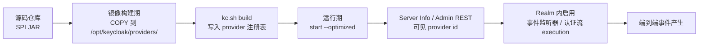

## 场景描述

产品能力覆盖不到、又必须挂在登录链路上时，Keycloak 的 SPI 是唯一正规出口：短信验证码、设备指纹、风控回调、事件外发 Kafka。多数团队写 Java 的环节很顺，卡在交付：JAR 放哪里、什么时候执行 `build`、Operator 下怎么落地、怎么证明它真的加载了、出事怎么退回去。

自定义 SPI 又和普通业务服务不同——它跑在身份服务进程内，而身份服务挂了就是全站登录挂了。所以这篇不讨论怎么写 Authenticator 或 EventListenerProvider，只讨论一个 JAR 从仓库到生产的完整路径和失败模式。

## 适用与不适用

**适用**：需要自定义认证步骤、Required Action、事件监听、用户存储、身份提供者或协议映射；在 Kubernetes 上用 Operator 或 Helm 交付 Keycloak；需要把扩展纳入镜像和 CI，而不是手工往容器里拷文件。

**不适用（先别写 SPI）**：

| 需求 | 先试内置能力 |
|------|-------------|
| 给 Token 加自定义 claim | Protocol Mapper（含 User Attribute / Hardcoded claim mapper） |
| 约束注册邮箱格式 | [User Profile 正则校验]() |
| 登录后强制用户做某事（改密、补手机号） | Required Action（内置 + 条件流编排） |
| 内外网差别化 MFA | [条件认证与 Step-Up]()，不需要代码 |
| 想拿登录事件做审计 | 内置 `jboss-logging` / `jpa` 监听器 + [审计日志与事件外发]()；只有要直连 Kafka/SIEM 才写监听器 SPI |

写 SPI 的真实成本不在第一版代码，而在后续升级：Keycloak 大版本之间 SPI 接口会变，扩展必须跟着重新编译、回归。能靠配置解决的，不要靠 SPI 解决。

## 一、先确立一条时间线：provider 是在「构建期」还是「运行期」被发现的

这是所有 SPI 交付问题的总根源。官方 [Configuring providers](https://www.keycloak.org/server/configuration-provider) 写得很直白：自定义 provider 打包成 JAR 放进 `providers` 目录后，**如果使用 `--optimized`，你必须执行 `build` 命令**，用 JAR 里的实现更新服务器的 provider 注册表。

原因也在同一页：这么做是为了让服务器在启动前就已知所有 provider，而不是等到启动或运行时才去发现。

由此得到两条互斥的部署路径：

| 路径 | 命令 | provider 发现时机 | 代价 |
|------|------|------------------|------|
| 未优化启动 | `start`（不带 `--optimized`） | 启动时/运行时发现 `providers/` 下的 JAR | 每次启动更慢；启动期行为依赖文件系统状态，不可复现 |
| 优化启动 | 镜像构建期 `kc.sh build`，运行期 `start --optimized` | 构建期固化进 provider 注册表 | 镜像与 JAR 必须一起构建；构建期选项与运行期不一致会直接启动失败（分类与版本差异见 [Keycloak --optimized 启动失败：构建期选项与运行期选项的边界]()） |

**生产走第二条。** 第一条只在开发容器里图省事，把它带到生产会出现「人肉改了容器里的 JAR，重启后行为变了，但没人知道哪个版本生效」——这正是不可变基础设施要避免的状态。



图里有两个容易被跳过的边界：`B→C` 是构建期唯一一次「JAR 进入注册表」的机会，漏了它后面全是白费；`E→F` 是「加载」和「生效」的分界——provider 被服务器认识，不等于它在任何 realm 里被使用。下面第三、四、五节分别对应这两条边界。

## 二、最小可运行扩展：一个事件监听 SPI

以「登录失败事件外发到内部审计接收端」为例。工程部分按官方 [Server Developer Guide](https://www.keycloak.org/docs/latest/server_development/) 的要求组织：

`pom.xml` 关键三点——用 `keycloak-parent` 的 `dependencyManagement` 固定整条依赖树的版本；依赖按接口实际所在模块声明（见下）；SPI 接口一律 `provided`（运行时由服务器提供，不要打进 JAR）：

```xml
<dependencyManagement>
  <dependencies>
    <dependency>
      <groupId>org.keycloak</groupId>
      <artifactId>keycloak-parent</artifactId>
      <version>26.7.4</version>
      <type>pom</type>
      <scope>import</scope>
    </dependency>
  </dependencies>
</dependencyManagement>
<dependencies>
  <!-- Event / EventType / EventListenerProvider 等事件模型类型 -->
  <dependency>
    <groupId>org.keycloak</groupId>
    <artifactId>keycloak-core</artifactId>
    <scope>provided</scope>
  </dependency>
  <!-- Provider / ProviderFactory 等基础接口 -->
  <dependency>
    <groupId>org.keycloak</groupId>
    <artifactId>keycloak-server-spi</artifactId>
    <scope>provided</scope>
  </dependency>
  <!-- EventListenerSpi / EventListenerProviderFactory -->
  <dependency>
    <groupId>org.keycloak</groupId>
    <artifactId>keycloak-server-spi-private</artifactId>
    <scope>provided</scope>
  </dependency>
</dependencies>
```

为什么是三个 artifact：事件链路用到的类型并不都在同一个 JAR 里。`EventListenerSpi`、`EventListenerProviderFactory`、`EventListenerProvider`、`Event`、`EventType` 在 `keycloak-server-spi-private` 的 `org.keycloak.events` 包下；`Provider`、`ProviderFactory` 等基础接口在 `keycloak-server-spi`。而 `keycloak-server-spi-private` 对 `keycloak-server-spi`、`keycloak-core` 的依赖都是 `provided` 作用域，Maven 不会把 `provided` 依赖传递给你的扩展——只声明 `keycloak-server-spi-private` 会编译不过。官方 event-listener 示例同样是把这三个都显式声明。换其他 SPI 时按同样办法处理：先确认接口在哪个模块，再补 artifact。

服务发现文件放在 `src/main/resources/META-INF/services/`，文件名是工厂接口的全限定名：

```
src/main/resources/META-INF/services/org.keycloak.events.EventListenerProviderFactory
```

内容是实现类的全限定名，一行一个。官方文档对这一步的说明是「实现 ProviderFactory 与 Provider 接口，并创建服务配置文件」——文件路径写错不会有任何警告，只会表现为 provider 不存在，所以它值得进 code review checklist。

工厂的 `getId()` 返回该 provider 的唯一 id，**用小写**（后续配置项、Admin REST 输出、日志都用它）：

```java
public class AuditSinkEventListenerFactory implements EventListenerProviderFactory {

    @Override
    public EventListenerProvider create(KeycloakSession session) {
        return new AuditSinkEventListener(session);
    }

    @Override
    public void init(Config.Scope config) {
        this.endpoint = config.get("endpoint");   // 来自 spi-* 配置项
        this.timeoutMs = config.getInt("timeout-ms", 2000);
    }

    @Override
    public void postInit(KeycloakSessionFactory factory) { }

    @Override
    public void close() { }

    @Override
    public String getId() {
        return "audit-sink";
    }
}
```

两个运行时约定必须提前知道，否则会写出线程不安全的代码：

- **工厂实例是单例**，可以跨请求保存状态（连接池放这里）；
- **Provider 实例每个请求创建**（`create(session)` 每次调用），必须保持轻量，阻塞式网络调用要设超时，不能让身份服务线程被审计接收端的慢响应拖住。

监听器本身只需要实现 `onEvent(Event)` 与 `onEvent(AdminEvent, boolean)`。审计场景要做的取舍是：同步调用接收端会进入登录关键路径，建议只把事件投递到本地队列/内存缓冲，由独立线程发送；发送失败不能影响登录结果。

### 配置项注入：双连字符不是风格问题

官方 [Configuring providers](https://www.keycloak.org/server/configuration-provider) 给出的格式是：

```
spi-<spi-id>--<provider-id>--<property>=<value>
# 无歧义时可省略为
spi-<spi-id>-<provider-id>-<property>=<value>
```

命名转换规则原文要求：全小写，camelCase 需在上大写字母前加连字符——`connectionsHttpClient` 变成 `connections-http-client`。套用到本文的例子：SPI id 是 `eventsListener` → `events-listener`，provider id 是 `audit-sink`，于是：

```bash
# 开发容器里验证配置生效
bin/kc.sh start-dev --spi-events-listener--audit-sink--endpoint=http://audit.internal/ingest
```

单连字符写法 `spi-events-listener-audit-sink-endpoint=...` 服务器**仍然接受**，但官方明确写了后果：`the server will not properly detect when reaugmentation is needed`。也就是说，改了这个选项之后服务器不认为需要重建，滚动更新时 `--optimized` 可能继续用旧配置——表现为「改了配置重启，行为没变」。这类问题排查起来极其费时，所以生产一律用双连字符形式。

同一页还有两条容易忽略的语义，**两条都出现在 `build` 子命令下，也就是构建期选项**——能写进命令行不等于能在运行期改：

- 属性名 `enabled` 是保留字，用于启用/禁用 provider：`spi-<spi-id>--<provider-id>--enabled=false` 可以下线一个 provider，但官方示例把它写在 `build` 命令上。在 `--optimized` 的镜像里这等于要重建镜像，不要把它当成运行期开关；想临时停用，先在 Realm 配置里摘掉引用。
- 想让某个 provider 成为某 SPI 的默认实现，用 `--spi-<spi-id>--provider-default=<provider-id>`。默认 provider 的判定顺序是：显式配置的默认 > `order()` 最高的实现（`order() <= 0` 的忽略）> id 恰好是 `default` 的。

## 三、镜像：build 必须发生在镜像构建期

官方 [Running Keycloak in a container](https://www.keycloak.org/server/containers) 给的标准做法是两阶段构建：构建阶段把 JAR 放进 `providers`、执行 `kc.sh build`，再把整个 `/opt/keycloak/` 拷进最终镜像。**包含自定义 provider JAR 的步骤必须放在 `RUN kc.sh build` 之前**——这是官方原文强调的顺序。

```dockerfile
FROM quay.io/keycloak/keycloak:26.7.4 AS builder

# 1) 先放扩展 JAR 及其第三方依赖（依赖同样放 providers/，见下）
COPY --chown=keycloak:keycloak --chmod=644 build/libs/audit-sink-spi-1.4.0.jar /opt/keycloak/providers/
COPY --chown=keycloak:keycloak --chmod=644 vendor/kafka-clients-3.9.0.jar  /opt/keycloak/providers/

# 2) Docker 会改写文件时间戳，构建前统一为固定值，保证 --optimized 校验通过
RUN touch -m --date=@1758499200 /opt/keycloak/providers/*

# 3) 固化构建期选项并写入 provider 注册表
ENV KC_HEALTH_ENABLED=true
ENV KC_METRICS_ENABLED=true
ENV KC_DB=postgres
WORKDIR /opt/keycloak
RUN /opt/keycloak/bin/kc.sh build

FROM quay.io/keycloak/keycloak:26.7.4
COPY --from=builder /opt/keycloak/ /opt/keycloak/
ENTRYPOINT ["/opt/keycloak/bin/kc.sh"]
```

三处细节都对应真实的失败：

1. **`touch -m --date=@...` 不是迷信。** 官方在「Known issues with Docker」里记录了这个问题：如果包含 provider JAR 的容器在 `start --optimized` 时失败，并提示某个 provider JAR 发生了变化，原因就是 Docker 截断或改写了文件修改时间，与 `build` 时记录的（mtime 与内容哈希）不一致。官方给的修法就是在 `build` 之前用 `touch` 把时间戳固定成自己选定的值。用固定 epoch（上面是 2025-09-22 UTC，取任意固定时间即可）还顺带让镜像层可复现。
2. **第三方依赖 JAR 直接放 `providers/`。** 官方「Using third-party dependencies」说明：把额外依赖拷到 `providers` 目录并执行 `build`，之后运行时对任何依赖它们的 provider 都可用。放进 `providers/` 的 JAR 会被一并加载，所以不要塞同族库的多个版本（Jackson、Netty 之类），否则会踩到下面第 4 条的类加载优先级。
3. **不要为了 `curl` 或安装 RPM 破坏镜像。** 官方镜像做了加固，`microdnf`/`dnf`/`rpm` 都不可用，且明确建议：需要下载文件用 `ADD`（原生支持远程 URL），需要系统工具就在前一个构建阶段完成再 `COPY` 过来。往里装 RPM 会扩大攻击面，收益极低。
4. **把「加载自定义 JAR」当成引入一段进程内代码来对待。** 官方在安装 provider 一节用了一个醒目的安全提示：整个应用只有一个 classloader，`providers` 目录里的 JAR **优先于内置库**；provider 逻辑没有沙箱，能做服务器进程能做的一切——直接访问数据库、读取所有服务器配置（包括凭据）。推论很直接：扩展的构建产物必须来自受控仓库、固定版本、走代码审查，禁止在生产镜像里 `ADD` 一个 URL 上的第三方 JAR。

另外，如果自定义了 `ENTRYPOINT` 脚本，最后一步必须用 `exec` 启动 `kc.sh`。否则 shell 脚本是 PID 1，`SIGTERM` 到不了 Keycloak，滚动更新退化成强杀；官方给的判据是关闭日志里应出现 `Keycloak stopped in ...s`。

## 四、Operator 部署：`spec.image` 与它隐含的契约

Operator 场景下，扩展不是在集群里装进去的，而是**打包进镜像后用 CR 指定的**。CRD 里 `spec.image` 的字段描述就是「Custom Keycloak image to be used.」，私有仓库另配 `spec.imagePullSecrets`。

真正需要提前知道的是 `spec.startOptimized` 这条字段描述（来自 `keycloak-k8s-resources` 的 CRD）：

> Set to force the behavior of the `--optimized` flag for the start command. **If left unspecified the operator will assume custom images have already been augmented.**

翻译成工程约束：**只要你把 `spec.image` 指向自建镜像，Operator 就默认这个镜像已经做过 augmentation（也就是已经执行过 `kc.sh build`）。** 把官方原版镜像换个 tag、再把 JAR 挂进去这种半吊子做法，在 Operator 下不会生效——要么 provider 不在注册表里，要么 JAR mtime 与注册表记录不一致导致启动失败。

```yaml
apiVersion: k8s.keycloak.org/v2beta1
kind: Keycloak
metadata:
  name: production-keycloak
  namespace: keycloak
spec:
  instances: 3
  image: registry.internal.example.com/platform/keycloak:26.7.4-audit-sink.1.4.0
  imagePullSecrets:
    - name: registry-internal
  additionalOptions:
    # SPI 选项：双连字符分隔 spi/provider/property
    - name: spi-events-listener--audit-sink--endpoint
      value: "http://audit-ingest.audit.svc.cluster.local/events"
    - name: health-enabled
      value: "true"
```

三个具体建议：

- **镜像 tag 与 CRD/Operator 版本对齐。** CRD、Operator、Keycloak 镜像三者版本漂移是升级故障的常见来源；tag 里带上扩展版本（`26.7.4-audit-sink.1.4.0`）比 `latest` 更省事。
- **不要用 `spec.unsupported.podTemplate` 挂 `providers` 卷来绕开重建镜像。** 该字段在官方文档里明确标为 unsupported，basic-deployment 的安全说明也指出它与自定义镜像一样需要高信任级别（在单 namespace 部署里，这些工作负载可能拿到与 Operator 相同的权限，包括读取该命名空间的 Secret）。更糟的是它绕过了构建期，正好撞上 `--optimized` 的注册表校验。
- **灰度顺序：先装镜像，再启用。** 上线新扩展时，先发布含 JAR 的新镜像但不改任何 realm 配置——此时扩展只出现在 Server Info 里，对登录链路零影响；确认加载正常后，再在目标 realm 事件配置里勾选该监听器，或在认证流里加 execution。回滚同理反向执行，这比「镜像和 realm 配置一把梭」可控得多。

## 五、验证：分四层，不要只看容器起没起来

容器启动成功完全不代表 provider 加载成功。按下面四层依次确认，每层都有可复制的命令（`$TOKEN` 用 master realm 的 admin 账号或专用服务账号获取）：

**第一层：构建期。** CI 里必须让 `kc.sh build` 的退出码决定流水线成败——provider 冲突、依赖缺失（`NoClassDefFoundError`）都会在这一步暴露。镜像构建后确认 JAR 真的进了目录：

```bash
docker run --rm --entrypoint ls registry.internal.example.com/platform/keycloak:26.7.4-audit-sink.1.4.0 \
  -l /opt/keycloak/providers
```

**第二层：服务端层（provider 是否被注册）。** `/admin/serverinfo` 的 `providers` 段按 SPI 名组织，包含服务器已知的全部 provider（含 internal SPI）：

```bash
curl -s -H "Authorization: Bearer $TOKEN" https://kc.example.com/admin/serverinfo \
  | jq '.providers.eventsListener.providers | keys'
# 期望输出里出现 "audit-sink"
```

进阶做法：让工厂同时实现 `org.keycloak.provider.ServerInfoAwareProviderFactory`，返回 `getOperationalInfo()`（官方文档的写法是返回一个 Map），这些键值会出现在同一响应里——把扩展的构建版本号暴露出来，运维就能一眼确认线上跑的是哪个版本，而不是靠镜像 tag 猜。

**第三层：Realm 层（在目标 realm 里是否启用）。** 事件监听器在 realm 的事件配置里：

```bash
curl -s -H "Authorization: Bearer $TOKEN" https://kc.example.com/admin/realms/<realm>/events/config \
  | jq '.eventsListeners'
```

如果扩展是 Authenticator，对应的校验接口是 `/admin/realms/{realm}/authentication/authenticator-providers`，返回 `id` / `displayName` / `description`（`id` 即 `getId()`）：

```bash
curl -s -H "Authorization: Bearer $TOKEN" \
  https://kc.example.com/admin/realms/<realm>/authentication/authenticator-providers | jq '.[].id'
```

**第四层：端到端。** 制造一次真实事件——用错误密码触发一次 `LOGIN_ERROR`，然后确认审计接收端收到了这条记录，并且请求体里的 `realm`、`userId`、`time` 都符合预期。只做前三层，很可能在一个「配置对了但事件类型没选」的状态下上线：realm 的 `enabledEventTypes` 是白名单，只监听 `LOGIN` 是收不到 `LOGIN_ERROR` 的。

## 六、常见错误表

| 症状 | 根因 | 处理 |
|------|------|------|
| `start --optimized` 并提示 provider JAR 已变化 | Docker 改写了 JAR mtime，与 `build` 记录不符 | 在 `kc.sh build` 之前 `touch -m --date=@<固定 epoch> /opt/keycloak/providers/*`，重新构建镜像 |
| 容器正常启动，但 provider 在 UI / Admin REST 中不存在 | JAR 在 `kc.sh build` **之后**才拷进镜像；或构建期根本没跑 `build` | 调整 Dockerfile 顺序，`ADD/COPY` 一定在 `RUN kc.sh build` 之前 |
| 自定义监听器不在 Realm → Events 的下拉列表里 | 服务发现文件路径或内容写错（`META-INF/services/<工厂接口全限定名>`）；`getId()` 与预期不一致 | 解包 JAR 检查 `META-INF/services/`；用 `serverinfo` 的 providers 列表反查真实 id |
| 启动报 `ClassNotFoundException` / `NoClassDefFoundError` | 第三方依赖没放进 `providers/`，或只 `COPY` 了扩展 JAR | 依赖 JAR 一并拷入 `providers/` 并重新 `build` |
| 改了 `spi-*` 选项，重启后行为没变 | 用了单连字符形式，服务器不认为需要 reaugmentation；或该选项是构建期选项但镜像没重建 | 改回 `spi-<spi-id>--<provider-id>--<property>`；构建期选项必须在镜像里重建 |
| 自定义 provider 覆盖内置实现后，内置功能异常 | 复用了内置 provider id，但实现不完整；或未设置更高的 `order()` | 官方建议：优先用新 id + `--spi-<spi-id>--provider-default`；必须复用 id 时实现 `order()` 并返回比内置更高的值 |
| 登录明显变慢，超时增多 | 监听器在登录关键路径上做同步远程调用 | 先在 Realm 事件配置里取消勾选该监听器止血（不需要重建），再把同步调用改成「本地缓冲 + 异步投递」并设置网络超时 |
| 回滚镜像后登录报错，提示找不到认证器 | Realm 的认证流里仍引用已被移除的 provider | 回滚镜像**之前**先从认证流移除该 execution、清空事件监听器配置 |

## 七、回滚

回滚要分两层做，顺序不能颠倒。

**服务端层（官方步骤）**：卸载 provider 是「从 `providers` 目录删除 JAR 并重新执行 `build`」（官方原文）。在不可变基础设施里等价于：把 `spec.image` 指回上一个镜像 tag，让 Operator 完成滚动更新。

**Realm 层（先做）**：先把 realm 上的引用摘干净——事件配置里的 `eventsListeners`、认证流里的相关 execution、以及依赖该 provider 的 Required Action。引用还在、provider 已消失时，登录链路会在运行时找不到实现而失败，且失败发生在认证过程中，排查窗口很短。

```bash
# 1) 摘除 realm 引用并确认
curl -s -H "Authorization: Bearer $TOKEN" https://kc.example.com/admin/realms/<realm>/events/config \
  | jq '.eventsListeners'
# 2) 回退镜像
kubectl -n keycloak patch keycloak production-keycloak --type merge \
  -p '{"spec":{"image":"registry.internal.example.com/platform/keycloak:26.7.4"}}'
kubectl -n keycloak get keycloaks/production-keycloak \
  -o go-template='{{range .status.conditions}}CONDITION: {{.type}} STATUS: {{.status}}{{"\n"}}{{end}}'
```

两点提醒：镜像回退后必须确认 `Ready` 条件为 `true` 再放量；如果扩展引入了构建期选项变化（例如同时打开了 tracing 或 metrics），`--optimized` 下镜像的构建期选项与 CR 传入值不一致时服务器会直接启动失败——回退镜像时要把这些 `additionalOptions` 一起比对，这类失败模式的细节见 [Keycloak OpenTelemetry 追踪接入]()。

## 常见问题（IAM FAQ）

**Keycloak 自定义 SPI 需要重新构建镜像吗？**
生产环境需要。`providers` 目录里的 JAR 只有在执行过 `kc.sh build` 的镜像里才会进入 provider 注册表；不带 `--optimized` 的启动虽然会在启动时发现 JAR，但启动更慢、状态不可复现，不适合生产。Operator 下更明确：指定 `spec.image` 后 Operator 假定自定义镜像已经构建过。

**Operator 能不能把 providers 目录挂进去，省掉重建镜像？**
技术上要动 `spec.unsupported.podTemplate`，官方把它标为 unsupported，且需要与自定义镜像同级的高信任；更关键的是它绕过了构建期，与 `--optimized` 的注册表校验冲突。正确做法是把扩展打进镜像。

**自定义 SPI 升级 Keycloak 大版本要注意什么？**
SPI 接口在大版本之间可能变更，升级前要看 release notes，重新编译扩展并跑登录链路的回归测试；`pom.xml` 里 `keycloak-parent` 的版本要跟目标 Keycloak 版本一致。没有回归测试的扩展不建议直接上生产。

**怎么在不停机的情况下确认扩展已加载？**
把含扩展的镜像先发布，但不在任何 realm 启用它——此时 `/admin/serverinfo` 的 `providers` 段已经能看到该 provider id，而登录链路不受影响。确认后再在目标 realm 启用，影响面就收敛到配置这一步。

**一个 Keycloak 实例能装多少个自定义 SPI？**
没有硬性数量限制，但每个 JAR 都运行在同一个 classloader 里且优先于内置库。真正的约束是升级面和排查面：扩展越多，版本升级的回归矩阵越大，建议按能力边界拆分成少量可独立回滚的 JAR。

## 参考来源

- [Configuring providers — Keycloak](https://www.keycloak.org/server/configuration-provider)：`spi-<spi-id>--<provider-id>--<property>` 格式、单连字符不做 reaugmentation 检测、构建期的 `enabled` / `provider-default` 选项与默认 provider 判定顺序、安装/卸载与重新 `build`（卸载 = 删除 JAR 后再跑 `build`）、第三方依赖放 `providers/`、单 classloader 与无沙箱的安全提示
- [Running Keycloak in a container — Keycloak](https://www.keycloak.org/server/containers)：两阶段 Containerfile、`providers` 目录步骤须在 `kc.sh build` 之前、`microdnf`/`dnf`/`rpm` 不可用与 `ADD` 拉远程文件、Docker 时间戳导致 `start --optimized` 失败的 `touch -m --date=@<epoch>` 修法、`exec` 与「Keycloak stopped in ...s」判据
- [Server Developer Guide（providers）— Keycloak](https://www.keycloak.org/docs/latest/server_development/)：`dependencyManagement` 中 import `keycloak-parent` 固定版本、SPI 实现与 `META-INF/services` 服务文件、`getId()` 唯一 id、覆盖内置实现要提供更高的 `order()`、`ServerInfoAwareProviderFactory` 与 Server Info 页
- [keycloak-quickstarts：event-listener-sysout](https://github.com/keycloak/keycloak-quickstarts/tree/main/extension/event-listener-sysout)：官方事件监听扩展示例的 `pom.xml` 依赖声明（`keycloak-core` + `keycloak-server-spi` + `keycloak-server-spi-private`）
- [Advanced configuration — Keycloak Operator](https://www.keycloak.org/operator/advanced-configuration)：`additionalOptions` 中 SPI 选项的写法（官方示例即 `spi-connections-http-client--default--connection-pool-size`、`spi-email-template--mycustomprovider--enabled`，双连字符）
- [Basic Keycloak deployment — Keycloak Operator](https://www.keycloak.org/operator/basic-deployment)：CR 结构、`Ready` 条件检查、自定义镜像与 unsupported `podTemplate` 的高信任要求（单 namespace 部署下可能获得与 Operator 相同权限）
- [keycloak-k8s-resources 26.7.4 CRD](https://raw.githubusercontent.com/keycloak/keycloak-k8s-resources/26.7.4/kubernetes/keycloaks.k8s.keycloak.org-v1.yml)：`spec.image`（`Custom Keycloak image to be used.`）、`spec.imagePullSecrets`、`spec.startOptimized` 的字段描述，`v2beta1` 为 `served` + `storage` 版本，`v2alpha1` 带 `deprecated: true` 与 `deprecationWarning: "Please migrate to v2beta1"`
- Keycloak 源码 `release/26.7`（26.7.4）：`server-spi-private` 中的 `EventListenerSpi`（`getName()` 返回 `eventsListener`）、`EventListenerProviderFactory`、`EventListenerProvider`、`Event`、`EventType`；`services` 中的 `ServerInfoAdminResource`（`providers` 按 SPI 名组织、`operationalInfo` 来自 `ServerInfoAwareProviderFactory`、遍历全部 SPI 含 internal 的）、`AuthenticationManagementResource`（`/authentication/authenticator-providers`）、`RealmEventsConfigRepresentation`（`eventsListeners`、`enabledEventTypes`）
