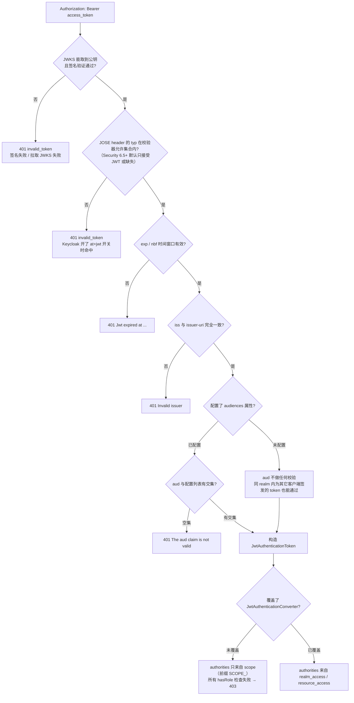

## 场景

后端 API 从 Spring Boot 2 + `keycloak-spring-boot-starter` 迁到 Spring Boot 3，改用 Spring Security 标准的 OAuth2 Resource Server。配置看起来只有三行，但上线前会依次撞上三类问题：

- 认证明明通过（`/userinfo` 能拿到用户），业务接口却在角色校验处统一 `403`；
- 一旦按安全要求补上 `aud` 校验，所有请求立刻 `401`，描述是 `The aud claim is not valid`；
- Keycloak 升到 26.6.2 之后，走 Introspection 校验的服务开始收到 `{"active": false}`，而 token 本身没过期。

这三件事的共同点是：**校验发生在三个不同的的位置**（Spring Security 的 `JwtDecoder`、Keycloak 的令牌签发逻辑、Keycloak 的 introspection 端点），而官方文档分散在三处。本文把它们放进同一条链路里对齐。

基线：Spring Boot 3.x / Spring Security 6.x 为主体，Spring Boot 4 / Spring Security 7 的行为差异单列一节（见后文《Spring Boot 4 / Spring Security 7 的差异》）。文中涉及的 Keycloak 行为核对自 26.7 的官方文档与 `keycloak/keycloak` 源码，Spring Security 侧核对自官方参考文档与 `JwtValidators` / `JwtTypeValidator` 源码。

## 适用与不适用

| 场景 | 是否适用 | 说明 |
|------|---------|------|
| SPA + 后端 API（BFF 或纯 API） | ✅ | 前端拿 token，后端按 Bearer 校验并授权，本文的主场景 |
| 微服务之间用 `client_credentials` 服务账号调用 | ✅ | 服务账号 token 同样受角色映射与 `aud` 约束 |
| 服务端 Web 应用（`oauth2Login` 浏览器登录、Session 会话） | ⚠️ | 那是 OAuth2 **Client** 的角色，配置入口与本文不同，见 [Keycloak Adapter 弃用迁移指南]() 的 Java 段落 |
| 网关统一认证（oauth2-proxy / Ingress / ForwardAuth）后把身份透传给后端 | ⚠️ | 后端不解析 JWT，改读 Header，见 [IAM 网关：Keycloak + oauth2-proxy]() |
| 只有 Keycloak 内置 Adapter 能用、无法改代码的存量系统 | ❌ | 先按迁移指南评估，不要指望在新代码里继续沿用 Adapter |

## 校验链路：一次请求里到底谁在检查什么

把 Spring Security 的校验顺序和 Keycloak 的签发行为叠在一起，才能解释「为什么有些错误必须改 Keycloak，有些必须改代码」。



三个必须记住的边界：

1. **只配 `issuer-uri` 时 Spring 不校验 `aud`。** 官方文档明确列出默认会做的事：验签、校验 `exp`/`nbf`/`iss`、把 `scope` 映射为 `SCOPE_` 前缀的权限——没有 `aud`。源码层面：Spring Security 6.2.x 的 `JwtValidators.createDefaultWithIssuer(issuer)` 只组装 `JwtTimestampValidator` + `JwtIssuerValidator`，audience 校验需要额外的 `JwtAudienceValidator` 或 `JwtClaimValidator`。**但这条默认栈在 6.5 之后变长了**：`createDefaultWithValidators` 会在缺省时补入 `JwtTypeValidator.jwt()` 与 `X509CertificateThumbprintValidator`，也就是 JOSE header 的 `typ` 从"不校验"变成"默认校验"，详见 [Spring Boot 4 / Spring Security 7 的差异](#spring-boot-4--spring-security-7-的差异)。
2. **`jwk-set-uri` 单独使用会让 `iss` 校验一起消失。** Spring Boot 只有在 `issuer-uri` 非空时才添加 `JwtIssuerValidator`（`JwtDecoderConfiguration#getValidator`），所以「为了避开启动时依赖 Keycloak，只写 jwk-set-uri」是拿掉了发卡行校验，不是等价替换。
3. **`audiences` 属性是「有交集即通过」，不是「全部匹配」。** Boot 的实现是 `hasElementsInCommon(claim, audiences)`，即 `aud` 数组与配置列表存在任一相同值就通过。配了多个值不等于要求 token 同时带上全部值。

## 最小配置

### 依赖

```xml
<dependency>
    <groupId>org.springframework.boot</groupId>
    <artifactId>spring-boot-starter-oauth2-resource-server</artifactId>
</dependency>
```

不要引入 `keycloak-spring-boot-starter` 或任何 Keycloak 专用适配器：资源服务器的能力全部在 Spring Security 里，多一层适配器只会多一份升级负担。

Boot 4 起这个 starter 已改名（`spring-boot-starter-security-oauth2-resource-server`），旧名被标记为弃用，见后文差异一节。

### application.yml

```yaml
app:
  keycloak:
    # 本服务对应的 Keycloak 客户端 ID，与上面的 audiences 保持一致
    client-id: api-orders

spring:
  security:
    oauth2:
      resourceserver:
        jwt:
          # 必须与 token 的 iss 完全一致（协议、端口、/realms/<realm> 路径）
          issuer-uri: https://kc.example.com/realms/iam-demo
          # 本服务作为资源方的标识；留空则不校验 aud
          audiences: api-orders
```

如果确认要脱离启动依赖（例如 Keycloak 与业务服务不在同一故障域），可以额外加 `jwk-set-uri`，但**同时保留 `issuer-uri`**——文档给出的就是这个组合；只写 `jwk-set-uri` 会丢掉 `iss` 校验。

### Keycloak 端：让资源的标识出现在 `aud`

这是最容易漏掉的一步。Keycloak 官方文档对 `aud` 的行为写得很明确：

- 默认的 `roles` client scope 里有一个 **Audience Resolve** 映射器，它根据**客户端角色**决定 `aud`：只有当 token 里带有某个客户端的客户端角色时，该客户端 ID 才会被加进 `aud`。用户只有 realm 角色、或者服务只依赖 realm 角色时，`aud` 不会出现对应值。
- 需要固定值时用 **Audience** 映射器：`Included Client Audience` 填客户端 ID，或 `Included Custom Audience` 填自定义值（例如 `https://api.example.com`）。两者互斥，`Included Custom Audience` 只在 `Included Client Audience` 为空时生效；值是**追加**进 `aud`，不覆盖已有值。
- 两个映射器默认**只写 access token**。ID token 的 `aud` 按 OIDC 规范就是签发它的 client id，因此「ID token 里看得见 client id」不能证明 access token 里也有。
- 官方文档的注记也点明了另一半：**access token 不会自动把签发它的客户端放进 `aud`**，所以「同一个 client 既做前端登录又做资源服务器」的写法天然拿不到 `aud`。

落地路径（在签发 token 的客户端上做）：

```
Clients → <签发 token 的 client> → Client scopes → <专属 scope>
  → Mappers → Configure a new mapper → Audience
     Included Client Audience: api-orders      （或 Included Custom Audience: https://api.example.com）
     Add to access token: ON
```

配完用 **Clients → `<client>` → Client scopes → Evaluate → Generated access token** 直接看 `aud`，不要靠猜。若采用 Audience Resolve 路线，Evaluate 里还需要把对应 scope 放进 *Scope* 字段才会出现客户端角色与 `aud`。

上面两条都是**服务端决定** audience。客户端侧还有一条独立路径：OAuth 2.0 的 `resource` 参数（RFC 8707）允许调用方声明自己要访问哪个资源，由授权服务器据此收窄 `aud`。Keycloak 在 26.7.4 默认忽略这个参数（官方 MCP 文档仍标 *Not supported*），只有实验特性 `resource-indicators` 打开后才会处理它，且实现语义是「从已有 `aud` 里过滤出对应值」而不是「按参数追加」。如果你的资源服务器要接 MCP 客户端或其它会主动带 `resource` 的调用方，见 [Keycloak 作为 MCP 授权服务器]()——那里的失败模式（`invalid_target` 与 `aud` 静默缺失）正是这两条路径混用造成的。

### SecurityConfig：角色映射

默认转换器只认 `scope`，不认 Keycloak 的嵌套角色结构。Keycloak 把 realm 角色放在 `realm_access.roles`、客户端角色放在 `resource_access.<client_id>.roles`，两份都是嵌套 JSON，默认转换器遍历不到，结果就是「认证成功、权限为零、全站 403 且日志干净」。

```java
@Configuration
@EnableWebSecurity
public class ResourceServerConfig {

    /** 本服务对应的 Keycloak 客户端 ID，用于限定客户端角色的来源 */
    @Value("${app.keycloak.client-id}")
    private String clientId;

    @Bean
    SecurityFilterChain api(HttpSecurity http) throws Exception {
        http
            .authorizeHttpRequests(auth -> auth
                .requestMatchers("/actuator/health").permitAll()
                .requestMatchers("/api/admin/**").hasRole("iam-admin")
                .anyRequest().authenticated())
            .oauth2ResourceServer(oauth2 -> oauth2
                .jwt(jwt -> jwt.jwtAuthenticationConverter(keycloakJwtConverter())));
        return http.build();
    }

    private JwtAuthenticationConverter keycloakJwtConverter() {
        JwtAuthenticationConverter converter = new JwtAuthenticationConverter();
        converter.setJwtGrantedAuthoritiesConverter(new KeycloakAuthoritiesConverter(clientId, false));
        return converter;
    }
}
```

```java
/**
 * 只把与本服务相关的客户端角色纳入授权；realm 角色按需单独开关。
 * Keycloak 角色名保持原样，不转大写——hasRole("iam-admin") 需要的是 ROLE_iam-admin。
 */
public class KeycloakAuthoritiesConverter implements Converter<Jwt, Collection<GrantedAuthority>> {

    private final String clientId;
    private final boolean includeRealmRoles;

    public KeycloakAuthoritiesConverter(String clientId, boolean includeRealmRoles) {
        this.clientId = clientId;
        this.includeRealmRoles = includeRealmRoles;
    }

    @Override
    public Collection<GrantedAuthority> convert(Jwt jwt) {
        Set<GrantedAuthority> authorities = new LinkedHashSet<>();
        if (includeRealmRoles) {
            rolesOf(jwt.getClaimAsMap("realm_access")).stream()
                .map(role -> new SimpleGrantedAuthority("ROLE_" + role))
                .forEach(authorities::add);
        }
        Map<String, Object> resourceAccess = jwt.getClaimAsMap("resource_access");
        if (resourceAccess != null) {
            rolesOf(asMap(resourceAccess.get(clientId))).stream()
                .map(role -> new SimpleGrantedAuthority("ROLE_" + role))
                .forEach(authorities::add);
        }
        return authorities;
    }

    @SuppressWarnings("unchecked")
    private static Map<String, Object> asMap(Object value) {
        return value instanceof Map ? (Map<String, Object>) value : Map.of();
    }

    @SuppressWarnings("unchecked")
    private static Collection<String> rolesOf(Map<String, Object> access) {
        Object roles = access == null ? null : access.get("roles");
        return roles instanceof Collection ? (Collection<String>) roles : List.of();
    }
}
```

两个容易写错的细节：

- **`hasRole("iam-admin")` 加的是前缀，不是大写。** `hasRole` 等价于 `hasAuthority("ROLE_" + 参数)`，Keycloak 里的角色名是 `iam-admin`，那么权限就是 `ROLE_iam-admin`。照抄「全部转大写」的写法，会得到 `ROLE_IAM-ADMIN`，与 Keycloak 实际角色永远对不上。
- **realm 角色与客户端角色不要一起扁平化。** 同一个 realm 里，为别的客户端签发的 token 也会带 `realm_access.roles`。如果本服务的授权只依赖 realm 角色，那就等于把「为一个无关客户端签发的 token」也当成本服务的合法凭据；只有 `aud` 校验到位时这层风险才被关掉。授权边界能收窄就收窄：客户端角色按 `clientId` 取，realm 角色只在确实需要跨客户端统一角色时打开。

## Spring Boot 4 / Spring Security 7 的差异

升级到 Boot 4 后配置骨架不变，但有四处差异会直接表现为构建失败或 401。以下核对自 Spring Boot 4.0 迁移指南、Spring Security 参考文档与 `JwtValidators`/`JwtTypeValidator` 源码。

### 1. starter 改名

| Boot 3 写法（已弃用） | Boot 4 写法 |
|----------------------|------------|
| `spring-boot-starter-oauth2-resource-server` | `spring-boot-starter-security-oauth2-resource-server` |
| `spring-boot-starter-oauth2-client` | `spring-boot-starter-security-oauth2-client` |
| `spring-boot-starter-web` | `spring-boot-starter-webmvc` |

迁移指南把这些旧 starter 标为弃用、并声明会在后续版本移除；旧名目前仍可解析，所以"依赖没报错"不能证明这步已经做完。Boot 4 的基线也变了：Java 17+、Spring Framework 7、Jakarta EE 11 / Servlet 6.1。

### 2. 旧 DSL 写法编译不过

`.and()` 链式调用、`authorizeRequests()`、`antMatchers()` 在 Spring Security 7 已移除，请求匹配统一到 `requestMatchers(...)`（由 `PathPatternRequestMatcher` 支撑）。这属于好消息：问题暴露在构建期，而不是上线后变成 401。

### 3. 默认校验栈多了 `typ`，会与 Keycloak 的 at+jwt 开关相撞

Spring Security 6.5 起，`JwtValidators.createDefaultWithIssuer(issuer)` 组装的默认栈里包含 `JwtTypeValidator.jwt()`，它**只接受 JOSE header 的 `typ` 为 `JWT` 或缺失**。

Keycloak 26.2 起给每个客户端加了一个开关：Clients → Advanced → Fine grain OpenID Connect configuration → *Use "at+jwt" as access token header type*（默认关闭）。打开后 access token 的 header 变为 `at+jwt` 以符合 RFC 9068——符合规范，但会被上面那条默认栈拒掉，症状是 401 `invalid_token`，且 `error_description` 不会点名 `typ`。

两个容易搞错的地方：

- `typ` 有两个同名值。JOSE header 里的 `typ`（校验对象）和 payload 里的 `typ: "Bearer"`（普通 claim，没有任何组件校验）。用 `jwt.getClaimAsString("typ")` 判断 token 类型是错的。
- Keycloak 默认签发 `typ: "JWT"`，所以**默认配置下不会命中这个坑**；它只在开了上述开关、或换成按 RFC 9068 严格签发的授权服务器时出现。

确认与修复：

```bash
# 看 header，不是 payload
echo "$ACCESS_TOKEN" | cut -d. -f1 | base64 -d 2>/dev/null
# {"alg":"RS256","typ":"at+jwt","kid":"..."}
```

```java
JwtDecoder decoder = NimbusJwtDecoder.withIssuerLocation(issuer).build();
decoder.setJwtValidator(JwtValidators.createDefaultWithValidators(
        new JwtTypeValidator("at+jwt")));
```

`createDefaultWithValidators` 只在列表里找不到同类 validator 时才补默认值，所以这段写法保留了时间戳、`iss` 和 X509 指纹校验，只把 `typ` 的允许集合换成 `at+jwt`。

若打算直接用 `JwtValidators.createAtJwtValidator()`（RFC 9068 校验器），先看它的构建约束：`build()` 要求 `typ`、`exp`、`sub`、`iat`、`jti`、`iss`、`aud`、`client_id` 每一项都有对应 validator，缺一项就断言失败。Keycloak 用 `azp` 表示客户端，不保证出现 `client_id`，这条路径需要把 `client_id` 换成 `azp` 校验——以你所处版本的实际解码结果为准。

### 4. `setJwtValidator` 是替换，不是追加

上面两处自定义 decoder 都用 `createDefaultWithIssuer` / `createDefaultWithValidators` 打底，原因在这里：`setJwtValidator` 会**整体替换**校验栈。写成 `decoder.setJwtValidator(new JwtAudienceValidator(...))` 之后，`iss`、`exp`、`typ` 全都不再校验，而且没有任何日志提醒——这是升级里最容易变成越权的"顺手简化"。

同一个位置还有一层惰性：`issuer-uri` 的发现由 `SupplierJwtDecoder` 延迟到第一个带 JWT 的请求才执行，授权服务器不可用不会拖垮启动；自己声明 `JwtDecoder` `@Bean` 就丢掉了这个特性，官方建议把自定义 decoder 包进 `SupplierJwtDecoder`。

### 升级后要补的两项检查

- **authorities 里会出现 `FACTOR_BEARER`。** Spring Security 7 的认证结果至少包含这个 authority，排错时看到它属于正常现象，别当成配置错误去改代码。
- **JWKS 缓存默认 5 分钟。** 密钥轮换（`kid` 变化）后，新密钥在最长 5 分钟内可能尚未被实例感知，表现为一小段 401；多实例各自缓存还会让灰度期行为不一致。轮换演练要纳入发布流程，或用 `.cache(CacheManager)` 换成共享缓存。

## 角色集合是怎么算出来的

Keycloak 官方文档给了明确的交集规则：token 里的角色 = **用户的角色映射** ∩ **客户端可访问的 role scope mappings**。由此有三个反直觉的结果：

| 现象 | 原因 |
|------|------|
| 管理员给用户建了角色，`realm_access.roles` 里没有 | 服务端的 client scope 里没有该角色的 role scope mapping，或 `Full scope allowed` 被关掉后没有补 scope |
| 数值小的角色出现在 token 里，复合角色的子角色也在 | 复合角色（composite）在 token 中会被展开成子角色列表 |
| `client_credentials` 的 token 里 `realm_access` 是服务账号自己的角色 | 服务账号的角色来自该客户端的 *Service account roles*，与真实用户无关 |

排查顺序固定为：先解码 token 看实际 claim → 再对 Keycloak 的 Client scopes / Role mappings → 最后才怀疑 Spring 的转换器。顺序反了会在代码里反复改 converter 而问题一直在 Keycloak 端。

## `aud` 校验的三种用法，选一种

| 做法 | 适用 | 代价 |
|------|------|------|
| `audiences` 属性（推荐） | 资源方标识是客户端 ID 或固定字符串 | 需要 Keycloak 端有对应 Audience 映射器；配置留空即等于关闭校验，可随时回滚 |
| 自定义 `OAuth2TokenValidator<Jwt>` | 需要「全部命中」而不是「有交集」，或需要同时校验 `azp` | 需自己维护 `JwtDecoder`，失去一部分自动配置 |
| 完全不校验 `aud` | 仅在单客户端、单资源的封闭环境 | 同 realm 内其它客户端的 token 可横向访问本服务，属于明确的越权面 |

解码 token 时至少核对 `iss`、`aud`、`azp`、`sub`、`scope` 五项。`azp` 指向签发该 token 的客户端，是判断「这个 token 是谁要来的」最直接的线索（以实际解码结果为准，不要依赖文档示例）。

## 走 Introspection 而不是本地验签时，多了一层校验方

使用不透明 token，或需要即时感知吊销时，资源服务器的校验方式会从「本地验签」换成「调用 `/protocol/openid-connect/token/introspect`」。这时 Spring Security 侧的规则变了：官方文档的原话是 *the authorization server's word is the law*——它只检查响应里的 `active: true`，然后把 `scope` 映射成 `SCOPE_` 权限，`aud` 不在 Spring 的检查范围内。

**真正的变化在 Keycloak 侧，而且是破坏性变更。** 26.6.2 起，Keycloak 的 introspection 端点会校验执行 introspection 的客户端是否出现在 token 的 `aud` 中：

- 不在 `aud` 中 → 返回 `{"active": false}`，不返回其它字段。以前任何已认证客户端都可以 introspect 任何有效 token。
- 临时兼容：服务端配置项 `allow-token-introspection-without-audience-check`，或客户端级 *Advanced → OpenID Connect Compatibility Modes → Allow token introspection without audience check*。注意客户端级开关配在**执行 introspection 的那个客户端**上（因为它是以自身身份调用的），不是签发 token 的客户端。
- 两个兼容开关都已被标记为弃用、会在未来版本移除，并且每次请求都会打警告日志——它只适合作为升级窗口的临时措施。

同一版本还有一条相关的破坏性变更：UserInfo 端点默认拒绝轻量级 access token（lightweight access token，24.0 引入、26.0 起 admin-cli / security-admin-console 默认使用）。轻量级 token 的设计目的就是配合 introspection，其 `aud` 可能只出现在 introspection 响应里、不在 token 本身。所以「本地解 token 看不到 aud，但 introspection 能过」在轻量级 token 上是正常现象（需开启 *Support JWT claim in Introspection Response* 才能拿到完整 JWT 原文），而 UserInfo 走轻量级 token 会直接 401。

Spring 侧对应配置（只支持 `introspection-uri` / `client-id` / `client-secret`，没有 audience 属性）：

```yaml
spring:
  security:
    oauth2:
      resourceserver:
        opaquetoken:
          introspection-uri: https://kc.example.com/realms/iam-demo/protocol/openid-connect/token/introspect
          client-id: api-orders-introspect
          client-secret: ${KC_INTROSPECTION_SECRET}
```

此时 `client-id` 指向的客户端必须出现在被校验 token 的 `aud` 里，否则就是上面那个 `active: false`。

## 验证

```bash
# 1. 确认 issuer 与实际下发的一致
curl -s https://kc.example.com/realms/iam-demo/.well-known/openid-configuration \
  | jq '{issuer, jwks_uri, introspection_endpoint}'

# 2. 取一个服务账号 token（用户 token 用 Admin Console 的 Evaluate 页生成）
TOKEN=$(curl -s -X POST \
  https://kc.example.com/realms/iam-demo/protocol/openid-connect/token \
  -d grant_type=client_credentials \
  -d client_id=api-orders-caller \
  -d client_secret="$KC_CALLER_SECRET" | jq -r .access_token)

# 3. 解码关键 claim（base64url 需要补 padding，用 python3 最省事）
printf '%s' "$TOKEN" | python3 -c 'import base64,json,sys;p=sys.stdin.read().strip().split(".")[1];p+="="*(-len(p)%4);print(json.dumps(json.loads(base64.urlsafe_b64decode(p)),ensure_ascii=False,indent=2))' \
  | jq '{iss, aud, azp, sub, scope, realm_access, resource_access}'

# 4. 正向：本服务应 200
curl -s -o /dev/null -w '%{http_code}\n' -H "Authorization: Bearer $TOKEN" https://api.example.com/api/me

# 5. 正向：授权接口应 200，越权角色应 403（不能只测 200）
curl -s -o /dev/null -w '%{http_code}\n' -H "Authorization: Bearer $TOKEN" https://api.example.com/api/admin/iam-users

# 6. 负向：换一个同 realm 内、不在 aud 里的客户端 token，必须 401 而不是 200
curl -s -o /dev/null -w '%{http_code}\n' -H "Authorization: Bearer $OTHER_TOKEN" https://api.example.com/api/me
```

第 6 步是唯一能证明 `aud` 校验真的生效的测试。只测正向，等于没测。

走 Introspection 的服务还要单独确认 introspection 响应：

```bash
curl -s -u api-orders-introspect:"$KC_INTROSPECTION_SECRET" \
  -d token="$TOKEN" -d token_type_hint=access_token \
  https://kc.example.com/realms/iam-demo/protocol/openid-connect/token/introspect \
  | jq '{active, aud, azp, scope}'
```

## 常见错误表

| 症状 / 日志 | 根因 | 处理 |
|------------|------|------|
| `401 invalid_token`，描述 `The aud claim is not valid` | 配了 `audiences`，但 Keycloak 端没有 Audience 映射器；或走了 Audience Resolve 但用户没有该客户端的客户端角色 | 加 Audience 映射器（`Included Client Audience` / `Included Custom Audience`），然后用 Evaluate 页确认 `aud` |
| `401 invalid_token`，描述含 `Invalid issuer` | `issuer-uri` 与 token 的 `iss` 不一致：协议、端口、`/realms/<realm>` 路径，或经反向代理后 host 变了 | 以 `.well-known/openid-configuration` 的 `issuer` 为准；反向代理场景核对 [Keycloak hostname v2 配置]() |
| 认证成功但所有接口 `403`，无异常栈 | 默认转换器只读 `scope`，Keycloak 角色在 `realm_access` / `resource_access` 里 | 覆盖 `JwtAuthenticationConverter` |
| 只有部分接口 `403` | `hasRole("IAM-ADMIN")` 与实际角色名 `iam-admin` 大小写不符；或角色来自客户端角色而非 realm 角色 | 用 `hasRole("iam-admin")`；先解码 token 确认角色在哪个 claim |
| 开发环境正常、生产环境 `403` | 开发用 realm 角色、生产按策略换成客户端角色（或相反） | 明确「哪种角色是本服务的授权源」，converter 与 Keycloak 侧同步调整 |
| `401` 只在 Ingress/网关后出现，直连 Pod 正常 | 代理未透传 `X-Forwarded-Proto`/`Host`，`iss` 与内外部 URL 不一致 | 先修代理 header 与 hostname 配置，不要靠放开 `iss` 校验绕过 |
| introspection 返回 `{"active": false}`，token 有效 | Keycloak ≥ 26.6.2 校验 `aud`，执行 introspection 的客户端不在其中 | 给 token 加该客户端为 audience；兼容开关仅作临时措施且已弃用 |
| 升级后 UserInfo 返回 `401` | 用的是轻量级 access token，26.6.2 起 UserInfo 默认拒绝 | 改用 introspection，或按文档交换为完整 token |
| 只配 `jwk-set-uri` 时能接受其它 issuer 的 token | `iss` 校验未启用 | 补上 `issuer-uri` |
| 服务账号 token 没有 `preferred_username` | `client_credentials` 签发，没有用户上下文 | 审计日志按 `azp`/`sub`（`service-account-*`）记录，不要按用户名 |
| Boot 4 / Security 7 下 `401 invalid_token`，token header 是 `at+jwt` | 默认栈里的 `JwtTypeValidator.jwt()` 只接受 `JWT` 或缺失；Keycloak 客户端开了 at+jwt 开关 | `JwtValidators.createDefaultWithValidators(new JwtTypeValidator("at+jwt"))` |
| 升级 Boot 4 后配置类编译失败，报找不到 `and()` / `antMatchers()` | Spring Security 7 移除了旧 DSL | 改 lambda 写法，`requestMatchers` 走 PathPattern |
| 自定义 decoder 后 `iss`、`exp` 校验静默失效 | `setJwtValidator` 替换整个校验栈 | 用 `JwtValidators.createDefaultWithIssuer(issuer)` 包住再追加 validator |
| 密钥轮换后短暂出现一批 401 | JWKS 缓存默认 5 分钟且各实例独立 | 轮换避开发布窗口；或 `.cache(CacheManager)` 换共享缓存 |

## 回滚

- **`aud` 校验引起大面积 401**：把 `audiences` 从配置里移除即恢复到「不校验 `aud`」的旧行为（Boot 只在列表非空时添加校验器），然后单独修 Keycloak 侧的 Audience 映射器，再灰度打开。这是可逆的单行改动，优先用它止血。
- **角色映射引起 403**：保留旧转换器实现，用配置开关在两个 `JwtGrantedAuthoritiesConverter` 之间切换，而不是直接回滚整次发布——认证路径没坏，只是授权口径变了。
- **Keycloak 升级到 26.6.2+ 后 introspection 失效**：可以临时打开兼容开关恢复旧行为，但同时必须把「为 introspecting client 补 audience」排进同一轮变更；兼容开关会移除，把临时措施当成长期方案会在下一次升级时再次中断。
- **客户端侧回滚顺序**：先加 `aud` 到 token（Keycloak 侧，向前兼容，不影响旧调用方），再在被保护服务上开启 `aud` 校验。反过来做，中间态必然是一批服务 401。

## 常见问题（IAM 资源服务器）

### Q1：IAM 资源服务器不校验 `aud` 会有什么实际风险？

同一个 realm 内为其它客户端签发的 token，可以带着有效签名访问本服务。真实场景是：为管理后台或移动端签发的 token 被第三方或日志泄露后，可以直接调用本服务 API；如果本服务的授权又只依赖 realm 角色，攻击者连角色都不用换。`aud` 是「这个 token 本来要发给谁」的边界声明，本地验签只能证明它由本 realm 签发，证明不了它属于你。

### Q2：Keycloak 的 realm 角色和客户端角色，IAM 授权该选哪个？

客户端角色（`resource_access.<client>.roles`）表达的是「某应用内的角色」，授权范围天然收窄到该应用，是资源服务器的默认选择；realm 角色（`realm_access.roles`）表达跨应用的统一角色，适合全公司统一的粗粒度身份（如 `employee`、`auditor`）。混用本身没问题，但必须明确服务端以哪一个为授权源，并把另一个只当参考信息——否则环境之间一次角色口径变化，就会出现「开发全通、生产全 403」这类只在特定环境复现的故障。

### Q3：从 Keycloak Adapter 迁移后，`use-resource-role-mappings` 对应什么？

Adapter 的这个开关控制「取 realm 角色还是取客户端角色」；标准 OIDC 库没有同名开关，等价物就是你自己实现的 `JwtGrantedAuthoritiesConverter` 读哪个 claim。迁移时要把它当成一次显式决策而不是默认继承：Adapter 默认读 realm 角色，若你当年打开过 `use-resource-role-mappings=true`，迁移后必须改成读 `resource_access[clientId].roles`，否则角色会静默全部丢失，表现为权限接口一律 403。相关排查项见 [Keycloak Adapter 弃用迁移指南]()。

## 相关章节

- [Keycloak Adapter 弃用迁移指南]()：服务端 Web 应用（OAuth2 Client）的迁移路径，与本文的资源服务器路径互补
- [OAuth 2.0 Token Introspection 实践]()：RFC 7662 请求响应格式、缓存与性能权衡，以及 26.6.2 的 audience 校验变化
- [Keycloak 架构与核心概念]()：Clients、Roles、Groups、Client scopes 与 role scope mapping 的关系
- [OpenID Connect 深度解读]()：ID Token 与 Access Token 的用途差异，理解为什么 `aud` 只在 access token 上需要额外配置
- [JWT 深度解读]()：claim 结构与验签流程
- [OAuth 2.0 攻击面与防护]()：token 越权与横向访问的威胁模型
- [Keycloak 细粒度授权与 FGAP]()：角色之外更细的授权模型
- [Keycloak hostname v2 配置]()：反向代理下 `iss`/endpoint URL 的正确配置
- [oauth2-proxy 常见错误排错]()：`expected audience` 的网关侧同类问题

## 来源

- [Spring Security — OAuth 2.0 Resource Server JWT](https://docs.spring.io/spring-security/reference/servlet/oauth2/resource-server/jwt.html)：默认校验范围（签名、`exp`/`nbf`/`iss`、`scope` → `SCOPE_`）、`audiences` 属性、`NimbusJwtDecoder` 缓存、`JwtAuthenticationConverter` 定制
- [Spring Security — OAuth 2.0 Resource Server Opaque Token](https://docs.spring.io/spring-security/reference/servlet/oauth2/resource-server/opaque-token.html)：introspection 路径只检查 `active`、`opaquetoken` 三个属性、`SpringOpaqueTokenIntrospector`
- Spring Security 源码 `oauth2/oauth2-jose/.../JwtValidators.java`（6.2.x）：`createDefaultWithIssuer` 只含 `JwtTimestampValidator` + `JwtIssuerValidator`
- Spring Security 源码 `oauth2/oauth2-jose/.../JwtClaimValidator.java`：失败时 `OAuth2Error(invalid_token, "The <claim> claim is not valid", ...)`
- Spring Boot 源码 `OAuth2ResourceServerProperties`（v2.7–3.2 及当前主线）：`jwt.audiences` 与 `opaquetoken` 字段构成
- Spring Boot 源码 `JwtDecoderConfiguration`（主线）：`issuer-uri` 非空才添加 `JwtIssuerValidator`；`audiences` 用 `hasElementsInCommon` 判定（有交集即通过）
- Keycloak Server Admin Guide — [Audience support](https://www.keycloak.org/docs/latest/server_admin/index.html#audience-support)：Audience Resolve 依赖客户端角色、Access token 不自动包含签发它的 client、两种映射器默认只写 access token、`Included Custom Audience` 仅当 `Included Client Audience` 为空时生效
- Keycloak Server Admin Guide — [Role mappings in the token](https://www.keycloak.org/docs/latest/server_admin/index.html#_oidc_token_role_mappings)：`realm_access` / `resource_access` 的写入规则、角色为「用户角色 ∩ role scope mapping」、复合角色展开、服务账号角色
- Keycloak 升级指南 26.6.2 — *Token introspection now validates audience claim*、*UserInfo endpoint rejects lightweight access tokens*：`allow-token-introspection-without-audience-check` 的服务端与客户端级兼容开关及其弃用状态、轻量级 token 的 `aud` 可能只出现在 introspection 响应中
- Keycloak 源码 `AudienceProtocolMapper`（`included.client.audience` / `included.custom.audience`）与 Admin UI 文案 `included.custom.audience.tooltip`：两个 audience 字段的互斥优先级与追加语义
- Keycloak 源码 `OIDCLoginProtocolFactory.CONFIG_ALLOW_TOKEN_INTROSPECTION_WITHOUT_AUDIENCE_CHECK`：兼容开关的配置键名
- [Spring Boot 4.0 迁移指南](https://github.com/spring-projects/spring-boot/wiki/Spring-Boot-4.0-Migration-Guide)：*Deprecated Starters* 一节给出 `spring-boot-starter-oauth2-resource-server` → `spring-boot-starter-security-oauth2-resource-server` 的改名与移除计划；同页给出 Java 17+ / Spring Framework 7 / Jakarta EE 11 基线
- Spring Security 源码 `oauth2/oauth2-jose/.../JwtValidators.java`（main 分支）：`createDefaultWithValidators` 在缺省时补入 `JwtTypeValidator.jwt()` 与 `X509CertificateThumbprintValidator`；`createAtJwtValidator().build()` 要求 `typ`/`exp`/`sub`/`iat`/`jti`/`iss`/`aud`/`client_id` 均有 validator
- [JwtTypeValidator API](https://docs.spring.io/spring-security/site/docs/current/api/org/springframework/security/oauth2/jwt/JwtTypeValidator.html)：`jwt()` 要求 `typ` 为 `JWT` 或缺失，`setAllowEmpty` 默认 `false`
- [JwtAudienceValidator API](https://docs.spring.io/spring-security/site/docs/current/api/org/springframework/security/oauth2/jwt/JwtAudienceValidator.html)：6.5 起提供，构造参数为单个 audience
- Spring Security 参考文档 — *OAuth 2.0 Resource Server JWT*：`issuer-uri` 的发现由 `SupplierJwtDecoder` 延迟到首个带 JWT 的请求、JWK Set 默认缓存 5 分钟并可用 `Cache` 替换、认证成功后的 authorities 至少包含 `FACTOR_BEARER`
- [Keycloak 26.2 Release Notes](https://www.keycloak.org/2025/04/keycloak-2620-released)：*Use "at+jwt" as access token header type* 客户端开关默认关闭
- [RFC 9068](https://www.rfc-editor.org/rfc/rfc9068.txt)：JWT access token 的 `typ`、`aud`、`client_id` 要求，以及资源服务器必须校验 `typ` 的规定
