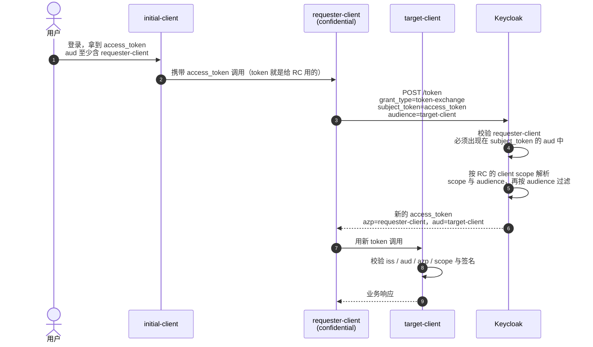

**一句话结论**：Keycloak 有**两套** token exchange。`token-exchange-standard:v2` 从 26.2 起官方支持、默认启用、**不需要** FGAP 权限；`token-exchange:v1`（Legacy）是 preview 且已标记 deprecated，它才是「Permissions 标签页 + token-exchange 权限」那套配置的出处。用哪套决定你的权限模型、排错方向和迁移路径——先把这一条定下来，后面的配置才有意义。

## 场景

网关或 BFF 拿到用户 access token 后要调用下游服务，但 token 的 `aud` 只包含网关自己，下游按 audience 校验直接拒绝；或者下游只需要读权限，而手上的 token 权限过大。重新走一次授权码流程不合理——用户已经登录了。这时用 RFC 8693 定义的 token exchange：拿**已有 token** 换一个**换手后重新限定受众和 scope** 的 token。

Keycloak 的 token endpoint 同时实现两套机制，请求都是同一个端点：

```
POST /realms/{realm}/protocol/openid-connect/token
grant_type=urn:ietf:params:oauth:grant-type:token-exchange
```

## 先分清 V1 和 V2

| 维度 | Standard V2（`token-exchange-standard:v2`） | Legacy V1（`token-exchange:v1`） |
|------|------------------------------------------|--------------------------------|
| 状态 | 26.2 起官方支持，**默认启用** | Preview，**26.6 起标记 deprecated**，未来会移除 |
| 规范符合度 | 按 RFC 8693 实现 | 官方自述「loose implementation」，忽略并扩展了部分规范 |
| 支持场景 | 仅**同 realm 内部换手**（Keycloak token → Keycloak token） | 内部换手 + 外部令牌换内部 + 内部换外部 + 用户 impersonation |
| 权限模型 | **不需要 FGAP**；靠「客户端开关 + subject_token 的 aud 校验 + Client Policies」 | 依赖 **FGAP v1**，通过 Permissions 标签页授权 |
| `scope` 语义 | 与其他 grant 一致——请求的是**请求方客户端**的 optional client scope（可放大） | 基于 `audience` 指定的 target client 的 scope，只能降权 |
| `audience` 语义 | 可多值，只做**收窄过滤**，不会新增受众 | 单值，token 按该 client 签发并使用其 scope |
| public client | **不允许**发起 | 仅允许自己换自己（降权），该场景现在建议改用 refresh token grant |
| sender-constrained 令牌 | 26.6 全拒 → 26.7 起允许**同客户端自换**，见下文安全边界 | 不支持，换手后的 token **不带绑定**（会剥离 `cnf`） |
| impersonation / `requested_subject` | 未实现 | Preview 实现（Direct Naked Impersonation） |
| 跨域换手（external ↔ internal） | 用 Identity Brokering API 与 **JWT Authorization Grant** | Preview 实现 |

**判断口径**：如果你的场景是「同一 realm 内、服务 A 的 token 换成给服务 B 用的 token」，那就是 V2，绝大多数中文资料里那套 Permissions 配置对你**完全无效**——照抄的结果是 403 `Client not allowed to exchange`。

## 适用与不适用

| 适用 | 不适用 |
|------|--------|
| 网关/BFF 把用户 token 降权后转发给下游服务 | 想用它换一个权限更大的 token（V2 默认允许放大，但这是安全反模式，见安全边界第 5 条） |
| 微服务链路上逐跳收窄 audience，避免内部 token 横穿全网 | 想用它在服务间传递「用户身份之外」的权限（那是授权模型问题，参考 [Keycloak 细粒度权限与授权策略实战]()） |
| CLI/后台任务拿自己的 token 换一个带目标受众的 token | 想换出外部 IdP 的令牌（走 Identity Brokering API） |
| 需要 impersonation（只能停留在 V1，且不要用于生产新项目） | public client 场景（改用 refresh token grant 降权，或加一层 BFF） |

## 最小配置

V2 不需要改启动参数，`token-exchange-standard:v2` 默认就是 enable 的。你要做的是**只给需要发起换手的客户端开开关**：

1. 确认 requester client 是 **confidential client**（V2 明确不支持 public client 发起换手，也不支持自己换自己这种降权用法）。
2. Admin Console → Clients → 选中 requester client → 客户端设置里的 **Standard token exchange** 开关打开。
3. 客户端认证方式沿用该 client 已配置的方式（client secret、`private_key_jwt`、mTLS 都行），换手请求必须按该方式完成客户端认证。

Legacy V1 默认是关的，只有确实需要 impersonation 或跨域换手时才显式打开：

```bash
# V1（Legacy）：默认关闭，需要 preview 或显式特性名
bin/kc.sh start --features=token-exchange

# 需要授权委派（实验特性）时才开这两个，不要用于生产
bin/kc.sh start --features=token-exchange-delegation,parameterized-scopes
```

## 请求与响应

```bash
curl -sS -X POST \
  "https://<keycloak-host>/realms/<realm>/protocol/openid-connect/token" \
  -u "<requester-client>:<client-secret>" \
  -d "grant_type=urn:ietf:params:oauth:grant-type:token-exchange" \
  -d "subject_token=<initial-client 签发的 access_token>" \
  -d "subject_token_type=urn:ietf:params:oauth:token-type:access_token" \
  -d "requested_token_type=urn:ietf:params:oauth:token-type:access_token" \
  -d "audience=<target-client>"
```

```json
{
  "access_token": "eyJhbGciOiJSUzI1NiIsIn...",
  "expires_in": 300,
  "refresh_expires_in": 0,
  "token_type": "Bearer",
  "issued_token_type": "urn:ietf:params:oauth:token-type:access_token",
  "session_state": "287f3c57-32b8-4c0f-8b00-8c7db231d701",
  "scope": "default-scope1",
  "not-before-policy": 0
}
```

几个字段的语义要看清：

- `issued_token_type` 与请求的 `requested_token_type` 一致；请求 ID token 时，**ID token 会放在 `access_token` 字段里**（RFC 8693 定义的返回形式），同时 `token_type` 变成 `N_A`。解析代码不能假设 `access_token` 一定是 access token。
- `refresh_expires_in: 0` 表示这次没有下发 refresh token。要拿到 refresh token 需要额外开关（见安全边界第 6 条），而且 V2 官方建议能换 access token 就别换 refresh token。
- token exchange **不会创建新的 user session**。换手不产生新会话，只在请求 refresh token 时可能为 requester client 补一个 client session。

## 换手流程



图里有两处是设计决策，不是实现细节：

- **第 4 步的 aud 校验**是 V2 替代 FGAP 的核心防线。它保证「只有原始 token 明确授权给过的客户端，才能拿它去换手」。所以 `subject_token` 的 `aud` 里必须有 requester client——唯一例外是客户端换自己的 token。
- **第 5 步的解析主体是发起换手的客户端，而不是 `audience` 指定的目标客户端**。这是 V1 和 V2 最容易搞混的语义翻转，也是下一节所有坑的根源。

## 最大的坑：audience 只能收窄，scope 才能放大

V2 里 `audience` 参数**不会给 token 增加受众**。`aud` 的来源是「请求方客户端被分配的 client scope + 这些 scope 里的 client role 映射」，`audience` 只是在这套已解析出的受众里做过滤。官方文档把它写成「effectively downscoping the token」。

于是最常见的失败长这样：

```json
{
  "error": "invalid_request",
  "error_description": "Requested audience not available: <target-client>"
}
```

原因是 `target-client` 从来没出现在解析结果里——通常是 initial client 的 token 只带了 `aud: ["initial-client"]`，客户端角色/受众映射没有把 `target-client` 接进来。社区里被验证有效的修法是**给发起换手的客户端挂上包含目标客户端角色的 client scope**（例如把内置 `roles` scope 设为默认 scope，让其他 resource server 的 client role 进入令牌受众解析）；更可控的做法是自建一个 client scope，里面放 `target-client` 的 client role scope mapping 或一个 audience mapper，再把它作为 requester client 的 optional/default scope。

另一条容易忽略的规则：`audience` 过滤**会连带过滤 client scope**。一个 client scope 如果含有 client role 映射，但里面没有任何被请求受众客户端的角色，这个 scope 会被整个丢掉。所以过滤之后 `scope` 可能比请求时短。

两个可操作的验证手段：

1. 先用 **Clients → Client scopes → Evaluate** 把 requester client 对某个用户的令牌算出来，确认 `aud` 与 `resource_access` 里有没有目标客户端；这一步能把「换手失败」提前暴露在配置阶段。
2. 换手拿到 token 后本地解一遍：

```bash
curl -sS -X POST ... | jq -r '.access_token' \
  | cut -d. -f2 | base64 -d 2>/dev/null | jq '{azp, aud, scope, resource_access: (.resource_access|keys)}'
```

另外，官方明确建议**尽量只请求一个 audience**：请求的受众越多，其中某个受众在解析结果里不可用的概率越高，整请求就直接失败（官方示例 3 就是同时请求两个受众、其中一个用户没有对应角色而被拒）。

## 安全边界

1. **`subject_token` 的 `aud` 必须包含 requester client**，否则拒绝。唯一的例外是客户端换自己签发的 token——这个用法本身还是合理的：用它做 up/down scoping 或裁掉多余的 `aud`。
2. **public client 不能发起换手**。V1 时代允许 public client 自己换自己来做降权，现在这条路被 V2 关闭了，替代方案是 refresh token grant 加 `scope` 参数降权。
3. **sender-constrained 令牌的规则在两个版本里摆动过，升级前必须回归**：
   - 26.6：Standard Token Exchange **一律拒绝**所有 sender-constrained 令牌（RFC 7800，含 DPoP 绑定与 X.509/mTLS 绑定）作为 `subject_token`，返回 `invalid_request`。
   - 26.7：放宽为**允许客户端交换自己签发的 sender-constrained 令牌**（用于改 audience、up/down scoping），并仍然要求客户端提供有效的 possession proof（DPoP proof 或匹配的客户端证书）；换成**另一个客户端**的令牌依旧被拒。
   - Legacy V1 则是另一种行为：换手后签发的 token **不带任何绑定**，DPoP 约束在链路中段消失。这条与 [OAuth 2.0 DPoP 深度解析]() 里记录的 26.7.3 缺陷条目是同一个语义缺口。**不要把「入口用了 DPoP」当成「全链路 sender-constrained」。**
4. **撤销没有链**：把 `access-token1` 换成 `access-token2` 之后，撤销 `access-token1` **不会**撤销 `access-token2`（官方明确说不做 access token 的撤销链）。换手签发的 access token 只能靠短 TTL 自然过期。refresh token 才有链：撤销 `access-token1` 会连带撤销换手得到的 `refresh-token2`，并移除对应 client session，后续整条换手链一起失效。
5. **V2 默认允许放大**。默认情况下换手可以请求 `subject_token` 里根本没有的 scope 和 audience。要强制「只降不升」，给客户端加 `downscope-assertion-grant-enforcer` 策略执行器——它会要求请求的 scope 不超过 subject token 已有的 scope，只允许降权（这个执行器在标准 token exchange 和 JWT Authorization Grant 上都适用）。
6. **要 refresh token 必须单独开开关**：Admin Console → 该 OIDC 客户端 → **Advanced** 标签 → **OpenID Connect Compatibility Modes** → `Allow refresh token in Standard Token Exchange` 从默认的 `No` 改成 `Same session`。`Same session` 的含义是只有能复用 subject token 同一 user session 时才发放；subject token 来自 transient session 或 offline session 时会被拒。同理，**不能**请求 offline token（`scope=offline_access`）或从离线会话里换手。
7. **不开 FGAP ≠ 没有管控**，只是管控点挪了位置：谁能发起换手 = 客户端开关 × `subject_token` 的受众校验 × **Client Policies**（可按 `client-scope`、`grant-type`、`client-roles` 组合条件拒绝特定换手）。既然 V2 不再需要任何管理权限，那么这个客户端开关就不能"顺手全开"——它等于把「该客户端持有的任意用户 token 交给它自行换受众」的能力交出去。
8. **V2 的边界**：不支持 `resource` 参数；不支持 impersonation；`Consent required` 的客户端只有在用户已同意全部被请求 scope 时才允许换手。正式的 RFC 8693 授权委派（`act`/`may_act`）还是 experimental，需要同时开 `token-exchange-delegation` 和 `parameterized-scopes`，官方文档的原文警告是「不要在生产环境使用」。

## V1 → V2 迁移

| 你在 V1 里的做法 | V2 下的对应动作 |
|-----------------|----------------|
| `--features=token-exchange` 或 `--features=preview` 打开 V1 | 关掉该特性（V2 默认已启用）；只有仍需 V1 独有能力时才保留 |
| 在 Permissions 标签页给 client / target client 配 token-exchange 权限，并开 FGAP:v1 | 不需要。改为给 requester client 打开 Standard token exchange 开关，并让 requester client 出现在 subject token 的 `aud` 里 |
| `audience=<target>` 决定 token 用哪个 client 的 scope | 语义翻转：scope 与受众按**请求方客户端**的 client scope 解析，`audience` 只做过滤 |
| 用 public client 自换自做降权 | 改用 refresh token grant 的 `scope` 参数降权 |
| `requested_token_type=urn:ietf:params:oauth:token-type:saml2` | V2 不支持换出 SAML 断言 |
| 用 `requested_subject` 做 impersonation | V2 未实现。要么留在 V1（preview + deprecated），要么改用真正的用户登录流程 |
| 用 `subject_issuer` / `requested_issuer` 做外部令牌双向换手 | 外部 → 内部用 V2 + **JWT Authorization Grant**；内部 → 外部用 Identity Brokering API |

两个升级期的事实：

- V1 和 V2 **可以同时启用**。系统按请求参数分发：带 `requested_issuer`、`requested_subject` 这类非标准参数的请求走 V1（Legacy），其余的内部换手优先走 V2。所以渐进迁移是可行的，不需要一次切完。
- 26.7.0 移除了实验性且未文档化的 `token-exchange-external-internal:v2`。如果你的启动参数里有它，删掉——标准 token exchange 已经覆盖了同样的能力。

顺带提醒：社区里多个 issue（如 `keycloak#35902`）长期反映 **V1 的 impersonation 权限配置文档与实际行为不一致**，按文档配仍然 403。这也是把新项目直接建在 V2 上、而不是先学 V1 权限模型再迁移的一个现实理由。

## 验证清单

- [ ] requester client 是 confidential，且 Standard token exchange 开关处于你预期的状态（只给需要换手的客户端开）
- [ ] `subject_token` 本地解一遍，确认 `aud` 里含 requester client
- [ ] 用 Client scopes → Evaluate 预演 requester client 的 `aud` / `resource_access`，确认目标受众确实可解析
- [ ] 换手后的 token 解出 `azp`、`aud`、`scope`，与预期逐项对比（`azp` 应为 requester client）
- [ ] 下游服务按 `iss` + `aud` + `azp` + `scope` 重新校验，而不是只验签名
- [ ] 如果链路上有 DPoP/mTLS 令牌，用「跨客户端换手」和「同客户端自换」两种请求各测一次，确认版本行为与预期一致
- [ ] 需要 refresh token 时，确认 `Allow refresh token in Standard Token Exchange = Same session` 已在预发环境验证过
- [ ] 验证降权策略：故意请求一个 subject token 里没有的 scope，确认被拒（而不是悄悄放大成功）

## 常见错误表

| 症状 | 根因 | 处理 |
|------|------|------|
| `403` `access_denied`，描述为 `Client not allowed to exchange` | 按 V1 文档配了 Permissions/GFAP，但 V1 特性没启用；或 V1 下权限资源与策略方向绑错（该文档已知有误，见 keycloak#35902） | 内部换手切 V2 并删掉 FGAP 依赖；确实需要 V1 时显式启用 `token-exchange:v1` + FGAP:v1，并按实测而非文档截图配权限 |
| `invalid_request`：`Requested audience not available: <client>` | `audience` 只做过滤，不能新增受众；目标客户端没进入 requester client 的受众解析结果 | 给 requester client 挂上包含目标客户端 client role 的 client scope（自建 scope 或内置 `roles`），再用 Evaluate 验证；单次只请求一个 audience |
| `invalid_request`：换手 sender-constrained 令牌被拒 | 26.6 一律拒绝；26.7 起只允许同客户端自换 | 确认是否自己签发的令牌；跨客户端场景改为先在链路首跳完成换手，或让下游直接接受原令牌 |
| `subject_token` 校验失败（受众不匹配） | `subject_token` 的 `aud` 不含 requester client | 修 client scope / audience mapper，让 requester client 进入初始 token 的 `aud` |
| 换手成功但下游仍 401/403 | 下游把 `azp` 或 `scope` 当成原客户端的值，或只验签名不验 `aud` | 下游按 `azp`（已变为 requester client）、`aud`、`scope` 重新授权 |
| 响应里没有 refresh token | 客户端未开启 `Allow refresh token in Standard Token Exchange` | 在 Advanced → OpenID Connect Compatibility Modes 改成 `Same session`；或改为只换 access token |
| public client 换手被拒 | V2 不支持 public client 发起 | 加 BFF/后端 confidential client，或用 refresh token grant 降权 |
| 换手后 DPoP 校验失败 | 换手签发的令牌与绑定关系不匹配（V1 会剥离绑定） | 按第 3 条安全边界逐版本确认行为，不要在 V1 链路上假设 sender-constrained 成立 |

## 回滚

换手的配置面很小，回滚成本低，但要按顺序：

1. **最快止血**：关掉 requester client 的 **Standard token exchange** 开关。立即生效，不需要重启，也不需要回滚数据——换手不创建 user session，关掉不会影响已登录用户。
2. **不要关 `token-exchange-standard:v2` 特性本身**。它默认启用，一关所有已配置开关的客户端全部换手失败；要停就停单个客户端的开关。
3. **如果已经迁移到 V2 需要退回 V1**：显式启用 `--features=token-exchange`（并按 V1 要求确认 FGAP:v1 状态），同时关掉客户端的 V2 开关。V1 与 V2 可共存，退回期间两者不会互相干扰。
4. **已经签发的换手 token 无法撤回**：access token 没有撤销链，只能等 TTL 过期；需要立即失效时用 realm/client 的 not-before 策略（注意 26.7.2 之前存在客户端 not-before 吊销被忽略的缺陷，背景见 [Keycloak 26.7.3 安全补丁解读]()）。
5. **数据库无迁移**，回滚不涉及 schema 变更；升级/回退前按常规备份即可。

## FAQ

**Q：V2 还需要配 FGAP 权限吗？**
不需要，官方明确说标准 token exchange 不接受也不需要 fine-grained admin permissions，且不打算把 token exchange 权限加进 FGAP v2。V1 才依赖 FGAP v1。

**Q：能不能给换手后的 token 加一个 subject token 里没有的 audience？**
不能。`audience` 参数只能收窄。要新增受众，必须从请求方客户端的 client scope / client role 映射入手，让它进入受众解析结果。反过来，`scope` 参数可以放大（请求 optional client scope）——这也是为什么 V2 需要 `downscope-assertion-grant-enforcer` 这类策略来兜底。

**Q：DPoP 或 mTLS 绑定的令牌能换手吗？**
26.6 全部拒绝，26.7 起允许客户端换成自己签发的令牌并需提供 possession proof，跨客户端换手仍然被拒。Legacy V1 会剥离绑定，换手后即失去 sender-constrained 语义。

**Q：撤销原 token 会连带撤销换手后的 token 吗？**
access token 不会（没有撤销链），refresh token 会（撤销会连带整条换手链和对应 client session）。所以换手得到的 access token 必须短 TTL。

**Q：token exchange 和客户端凭证（client credentials）怎么选？**
client credentials 是"没有用户、以客户端自己身份"调用；token exchange 是"保持用户身份、换一个受众/权限范围"。前者用于后台任务和 M2M，后者用于代表用户访问下游服务。相关定位可参考 [OAuth 2.0 深度解析]() 中 grant type 的适用场景对比。

## 参考来源

- Keycloak 官方文档：Configuring and using token exchange（Standard token exchange、参数与响应、scopes and audiences、Additional details、Comparison of standard and legacy token exchange、Token exchange delegation）
- Keycloak 升级指南：Migrating to 26.2.0 `Supported standard token exchange`；Migrating to 26.6.0 `Sender-constrained tokens are now rejected in Standard Token Exchange`、`Deprecation of legacy Token Exchange`；Migrating to 26.7.0 `Token Exchange with Sender-constrained tokens allowed for scope changes`、`Experimental token-exchange-external-internal:v2 feature removed`
- Keycloak 官方博客：Standard Token Exchange is now officially supported in Keycloak 26.2
- Keycloak Server Administration Guide：Downscoping 与 Client Policies（`downscope-assertion-grant-enforcer`）
- keycloak/keycloak discussion #40870（`Requested audience not available` 的实际成因与 client scope 修法）、issues #35902 / #25788 / #16965（V1 impersonation 权限文档与实际行为不一致）
- RFC 8693 OAuth 2.0 Token Exchange；RFC 7800 Proof-of-Possession Key Semantics
