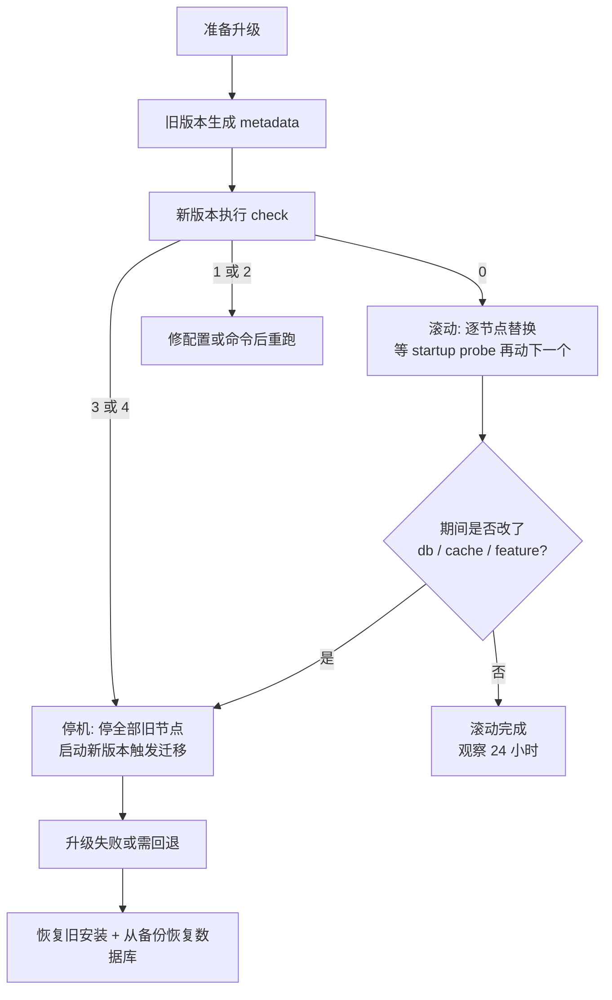

IAM 的升级窗口比普通服务难排：Keycloak 一停，所有依赖它登录的应用同时不可用。Keycloak 从 **26.6.0** 起把「补丁版本零停机滚动更新」变成受支持能力，并且给了一条可编程的判定命令——能不能不停机，不再靠经验猜，而是由命令的退出码回答。

但这条能力有明确边界：**跨 minor/major 必须停机**，**改数据库或缓存后端永远停机**，**升级后数据库 schema 只能前滚**，回滚的唯一途径是恢复备份。本文按「判定 → 停机清单 → 数据库迁移 → 回滚」的顺序把这些边界写清楚，并给出一段可以直接放进 CI 的判定逻辑。

事实性内容核对自 Keycloak 官方 Upgrading Guide、Rolling Updates Guide、Checking if rolling updates are possible、Operator 的 Avoiding downtime with rolling updates 指南与 26.6.0 发布说明；核查日期 2026-09-27，对应文档版本 26.7.4。

## 适用 / 不适用

| 场景 | 是否适用 |
|------|----------|
| 自建 Keycloak（容器 / VM / Operator），要安排版本升级与回滚方案 | ✅ 本文的主要场景 |
| 补丁升级（同一 `major.minor`，例如 26.7.3 → 26.7.4）想避免停机 | ✅ 26.6.0 起官方支持，见第 1 节判定方法 |
| 跨 minor / major 升级（26.5 → 26.7 之类） | ⚠️ 判定一定是「不可滚动」，必须停机，见第 2 节 |
| 只想看某个 CVE 值不值得升 | ❌ 看 [Keycloak 26.7.4 安全补丁解读]() 一类的版本页 |
| Keycloak 作为托管服务使用，运维交给厂商 | ❌ 升级窗口由厂商决定 |
| 需要从 WildFly 发行版迁移 | ⚠️ 那是另一条路径，见 [Keycloak Adapter 弃用迁移]() |

## 1. 先判定：这次升级能不能不中断

官方提供的判定命令有两个子命令，顺序不能颠倒：

```bash
# 1) 在「旧版本 + 旧配置」上生成元数据
bin/kc.sh update-compatibility metadata --file=/tmp/kc-compat.json

# 2) 在「新版本 + 新配置」上判定（注意：是拿新版本的二进制跑）
bin/kc.sh update-compatibility check --file=/tmp/kc-compat.json
```

`metadata` 接受 `start` 命令的全部选项，并把描述当前部署的元数据写成 JSON；`check` 用这份元数据与当前配置、当前版本比对，把结论打在退出码上：

| 退出码 | 含义 | 流水线动作 |
|--------|------|-----------|
| `0` | 可以滚动更新 | 逐节点替换，等 startup probe 成功再动下一个 |
| `1` | 未预期错误（元数据文件缺失或损坏等） | 修问题后重跑，**不要**当成可滚动 |
| `2` | CLI 选项非法 | 修命令 |
| `3` | 不可以滚动更新，必须先停整个部署 | 走停机窗口流程，见第 2、4 节 |
| `4` | `rolling-updates` 特性未启用，因此不可滚动 | 按停机处理，或按官方指引评估启用该特性 |

三个使用要点，每一条都有踩坑成本：

1. **两次命令带上的配置必须完全一致**。官方明确警告：任何配置项（无论来自环境变量还是 CLI 参数）漏掉都会让元数据不完整，「可能导致下一步给出错误的结论」。实际最容易漏的就是 `--db-url-host`、`--hostname`、`--cache` 这类由环境变量注入、本地手工跑命令时没导出的项。建议直接从部署清单（Deployment/StatefulSet 的 env、或 Operator CR 的 `spec.env`）导出后跑，不要凭记忆敲。
2. **只依赖退出码，不要解析元数据文件结构**。官方原文就是：消费者不应依赖元数据文件的内部行为或结构，只应依赖 `check` 的退出码，这样才能在官方改判定逻辑时继续工作。这对 CI 的长期可维护性很关键——把 JSON 字段名写进流水线的判断脚本，未来一定会被上游改动打断。
3. **注意 `--optimized`**。官方提示：不使用 `--optimized` 时，`update` 类命令可能隐式重建 optimized build；如果你在同一台机器上跑过命令，可能影响该机器上 server 的下一次启动。在 CI 里跑判定最好用独立的一次性容器，不要在业务节点上执行。

### 有一处文档口径需要你自己用命令确认

「什么情况下允许滚动」在不同页面上的表述并不一致：

- [Avoiding downtime with rolling updates](https://www.keycloak.org/operator/rolling-updates) 与 26.6.0 发布说明的口径是：**补丁版本（同一 `major.minor` 流内升到更高补丁）支持滚动更新**。
- [Checking if rolling updates are possible](https://www.keycloak.org/server/update-compatibility) 页面开头仍保留着更早的口径：当前版本只在**新旧版本相同时**判定可滚动，它举的例子是 `'keycloak.version' is incompatible: 26.2.0 -> 26.2.1` 判定为不可滚动——示例用的 26.2 早于 26.6，反映的是该能力落地之前的行为；同一页稍后的 "Rolling updates for patch releases" 一节又给出补丁可滚动的说明。

这种新旧文字并存的情况，正确处理方式是：**不要按记忆里的规则决定要不要排窗口**，用你手上这两个版本各跑一次 `metadata` / `check`，以退出码为准。这也是官方把判定做成命令而不是文档表格的原因。

## 2. 哪些变更一定需要停机

判定的另一半是：即使版本号只动了补丁位，有些变更也会被判为不可滚动。官方列出了完整的重建（recreate）清单。

**特性开关变更 → 始终需要停机：**

| 特性 | 说明 |
|------|------|
| `multi-site:v1` | 多站点支持 |
| `persistent-user-sessions:v1` | 在线用户会话跨重启与升级持久化 |
| `stateless:v1` | stateless 模式（认证会话、action token、登录失败数据存数据库，多集群只靠数据库连通） |

> 这两个特性都属于「跨机房多集群」这条线：`multi-site` 是 v1 方案（依赖外部 Infinispan 跨站点复制与围栏自动化），`stateless` 是 Keycloak 26.7 起的 v2 方案（去掉外部 Infinispan，改用同步复制数据库 + outbox 分发缓存失效）。切换它们不只是配置变更，还牵扯站点级停机、数据库容量翻倍和部分易失数据丢失，规划升级前先读 [Keycloak 跨机房多集群高可用与 IAM 双活部署]()。

**特性版本变更 → 需要停机（例如从 `login:v1` 切到 `login:v2`）：** `login:v1`、`login:v2`、`passkeys-conditional-ui-authenticator:v1`。

**缓存相关选项变更 → 需要停机：**

| 选项 | 官方给出的理由 |
|------|----------------|
| `--cache` | `ispn` 与 `local` 互斥，切换会丢数据 |
| `--cache-config-file` | 配置不兼容时集群无法成形；官方**不会**校验该文件的内容差异，改文件必须自己先测新旧节点能否组成集群 |
| `--cache-stack` | 滚动期间集群无法成形并导致数据丢失 |
| `--cache-embedded-mtls-enabled` | 开关 TLS 会导致滚动期间集群无法成形并丢数据 |
| `--cache-remote-host` / `--cache-remote-port` | 连到新缓存会让已缓存数据丢失 |

**数据库相关选项变更 → 需要停机：** `--db`、`--db-schema`、`--db-url-database`、`--db-url-host`、`--db-url-port`。理由都是同一条：这类变更必须同时对集群所有成员生效，否则数据不一致。

由此可以推出一条变更切分原则：**「换数据库厂商 / 换库 / 换 schema / 换缓存后端」和「升版本」不要放进同一次变更**。前者本身就要求停机，混在一起会让判定必然返回 `3`（不可滚动），你也就失去了用滚动升级消化 CVE 补丁的机会。把它们拆成两次变更，补丁升级就能保持零停机。

## 3. Operator 的默认策略本身就会给你停机

如果 Keycloak 由 Operator 管理，滚动与否还取决于 CR 里的更新策略：

| 策略 | 停机时机 | 说明 |
|------|----------|------|
| `RecreateOnImageChange`（**默认**） | 镜像名或 tag 变化时 | 等价于 Keycloak 26.1 及更早的行为：`image` 一变，先缩容再更新 |
| `Auto` | 仅在不兼容变更时 | Operator 用配置、镜像与版本判断能否滚动；补丁版本（同版本或同一 `major.minor` 内升补丁）走滚动 |
| `Explicit` | 只在 `spec.update.revision` 变化时由你决定 | Operator 不解释 `revision` 的值，只把它当作滚动触发器 |

也就是说：**默认配置下，你把 image tag 从 26.7.3 改成 26.7.4，得到的是停机更新**。要拿到补丁版本的零停机，必须显式改成 `Auto`（或自己用 `Explicit` 控制节奏）：

```yaml
apiVersion: k8s.keycloak.org/v2beta1
kind: Keycloak
metadata:
  name: production-keycloak
spec:
  update:
    strategy: Auto
```

滚动更新能不能成立，还依赖两个前提条件，官方要求在升级前逐项确认：

1. **节点能优雅关闭**。关闭中的节点日志里应出现 `INFO  [io.quarkus] (Shutdown thread) Keycloak stopped in ...s`；没有这行说明不是优雅关闭，正在处理的请求会被切断。
2. **负载均衡尊重 readiness probe**。否则滚动期间流量仍会打到正在退出的节点上——请确认健康检查与就绪探针配置，见 [Keycloak Prometheus 监控指标详解]() 与官方 health check 指南。

事后核对 Operator 到底走了哪种策略，看 CR 的 status 条件 `RecreateUpdateUsed`：`Unknown` 表示尚未更新过，`False` 表示上次用的是滚动，`True` 表示上次用的是重建，`message` 字段会写出原因，`lastTransitionTime` 是发生时间。排查「为什么这次升级有中断」时，先看这个条件，比翻 Pod 事件高效。

两个容易忽略的边界：

- 如果你在 CR 里用了 `unsupported` 的 `podTemplate` 字段，Operator 在判断滚动可行性时会尽量套用它，但官方明确说可能漏掉部分设置，从而得出**错误结论**。这类部署建议改用 `Explicit`，由人来控制滚动时机。
- `Explicit` 配合 Operator 生命周期管理（OLM）自动升级有风险：Operator 自身被升级时可能触发一次实际并不支持的滚动。官方对 `Explicit` 的建议是先在非生产环境充分测试。

## 4. 数据库迁移：自动、阈值、超时和手工策略

Keycloak 默认在**新版本第一次启动时自动执行数据库 schema 迁移**。几个数字决定了这个动作会不会把你打穿。

| 参数 | 默认值 | 控制方式 | 说明 |
|------|--------|----------|------|
| 迁移超时 | 30 分钟 | `--transaction-setup-timeout=60m` | 数据量大或硬件慢时不够用，超时按启动失败处理 |
| 自动建索引的阈值 | `300000` 条记录 | `--spi-connections-liquibase--quarkus--index-creation-threshold=0`（设为 0 或负数即关闭） | 超过阈值的表不在迁移时建索引，避免在千万级表上加索引把服务卡死 |
| 后台补建索引 | 自动 | `--spi-connections-jpa--quarkus--auto-create-missing-indexes=false` 改为只打印 SQL | 仅 PostgreSQL、Oracle 企业版、MySQL/MariaDB、SQL Server 企业版/开发者版/Azure SQL 支持非阻塞建索引；不支持该能力的数据库只记录 warning 并输出需手工执行的 SQL |

两条硬约束：

- **迁移不支持默认的 H2 `dev-file` 数据库类型**，生产必须用外部关系型数据库（见 [Keycloak 生产数据库配置]()）。
- **迁移前必须停掉所有运行旧版本的节点**。这条与第 2 节的判定逻辑一致：可滚动的前提是本次没有 schema 变更。

如果变更窗口不允许「启动时才做迁移」这种不可控动作，可以用手工策略把 DDL 提前拿到：

```bash
# 生成 SQL 后进程会退出，不会真正迁移
kc.sh start --spi-connections-jpa--quarkus--migration-strategy=manual

# 需要自定义输出路径时
kc.sh start --spi-connections-jpa--quarkus--migration-strategy=manual \
  --spi-connections-jpa--quarkus--migration-export=/tmp/keycloak-database-update.sql
```

默认会在启动目录下生成 `keycloak-database-update.sql`，你审阅后手工对库执行，再启动新版本。这里有一个在权限收紧的数据库上会直接卡住启动的细节：**Keycloak 启动时必然要写两张 Liquibase 记账表**——`DATABASECHANGELOG`（记录已应用的 changeset）和 `DATABASECHANGELOGLOCK`。空库生成的脚本里会包含创建 `DATABASECHANGELOG` 的语句，但**不含** `DATABASECHANGELOGLOCK`（Keycloak 自己建）。所以当数据库账号没有 `CREATE TABLE` 权限时，必须在**生成脚本的库**和**执行脚本的库**上**都**预先建好这两张表。两张表已存在时脚本里不会出现对应的 `CREATE TABLE`，因此脚本也可以安全地在它自己的生成库上执行。

手工执行完 SQL 后启动新版本，首次启动仍可能执行 schema 之外的数据迁移，日志里要留着看。

## 5. 升级前必做的四件事，以及唯一的一条回滚路径

官方给出的升级前置步骤很短，但每一条都是在限制事故影响面：

1. **不支持滚动更新时，先停掉所有节点**（跨 minor/major 升级、或判定返回 `3`/`4`）。
2. **备份旧安装**：配置文件、自定义主题等。
3. **如果启用了 XA 事务**：处理未完成事务并删除 `data/transaction-logs/` 目录。
4. **备份数据库**（按所用数据库厂商的官方方式）。

必须记住的一条不可逆边界，官方原文是警告级别的：

> 升级后数据库 schema 不再与旧版本兼容。由于 Keycloak **不支持回滚数据库变更**，如果需要退回旧版本，必须**先恢复旧安装，再从备份副本恢复数据库**。

也就是说，Keycloak 升级的「回滚」不是改镜像 tag，而是**一次数据库恢复**。它直接决定了三件事：

- 数据库备份必须**可恢复且验证过**（只 dump 不验证等于没有备份），流程见 [Keycloak 高可用集群部署与灾难恢复]()。
- 变更窗口要把「恢复数据库」的时间算进去，而不是算「回退镜像」的时间。
- 补丁版本回滚同样适用：数据库已迁移过，旧版本可能根本起不来——这一点在 [26.7.4 安全补丁解读]() 里有同向的说明。

另外两条与用户直接相关的变化：

- **`persistent-user-sessions` 被禁用时的部署，升级会丢会话**：除离线会话（offline session）外的所有用户会话都会丢失，用户必须重新登录。该特性在 26.0.0 之前默认禁用，所以从 25.x 一路升上来的环境要特别确认当前是否开着。
- **升级过程中正在进行的认证流程会中断**：正在进行中的登录、改密、重置密码流程只存在内部缓存里，节点重启后这些用户要从头走一遍。窗口内用户会看到登录页重来，这不是故障。

主题是另一类必须跟着升的东西：自定义主题的分支要拷到新安装的 `themes` 目录，然后逐个对比官方基线主题的模板、消息键和样式差异——官方建议用 diff 工具比对 `login.css` 一类的文件，而不是凭印象判断「应该没变」。

## 6. 把它接进流水线的判定逻辑

```bash
# 在旧版本上生成（配置项要与生产完全一致）
kc.sh update-compatibility metadata --file=/tmp/kc-compat.json
# 在新版本上判定
kc.sh update-compatibility check --file=/tmp/kc-compat.json
rc=$?
case "$rc" in
  0) echo "rolling update possible" ;;
  3) echo "recreate required" ;;
  4) echo "rolling-updates feature disabled" ;;
  1|2) echo "check failed (rc=$rc)"; exit 1 ;;
  *) echo "unexpected exit code $rc"; exit 1 ;;
esac
```

关键不是这段脚本本身，而是**它把「要不要排停机窗口」这个决策从人的经验搬到了流水线的退出码上**：跨版本升级、改数据库、改缓存这些变更会自动落到 `3`，你不需要每次重新论证一遍。



## 7. 验证清单

滚动升级期间，官方明确受支持的能力是：OIDC 客户端的登录与登出、OIDC 客户端的全部常规操作（刷新 token、查询 userinfo）。建议按下面的顺序验证：

1. **滚之前**：`check` 返回 `0`；确认 LB 遵循 readiness probe；确认关闭中的节点日志有 `Keycloak stopped in ...s`；确认 `spec.update.strategy` 不是默认的 `RecreateOnImageChange`。
2. **滚的过程中**：逐节点确认新 Pod 的 startup probe 通过再继续；用 `kubectl get pod -n keycloak -o jsonpath='{range .items[*]}{.metadata.name}{"\t"}{.spec.containers[0].image}{"\n"}{end}'` 观察版本切换是否一个一个发生，而不是整批重建。
3. **滚完立即**：Prometheus 无新增告警；登录一次管理控制台；用一个普通账号走一遍登录 → userinfo → 登出。
4. **滚完 24 小时内**：看第 3 节的 `RecreateUpdateUsed` 条件确认是滚动而非重建；抽查登录成功率与 token 刷新错误率。

已知限制要提前通知：如果补丁版本改了 Account Console 或 Admin UI，**在升级前或升级中打开过这两个界面的用户可能看到报错并要求刷新页面**。官方同时建议在负载均衡上启用粘性会话（sticky session），避免用户在不同版本的节点之间来回跳——否则用户可能被反复要求刷新。

## 8. 常见错误对照表

| 症状 | 根因 | 处理 |
|------|------|------|
| `check` 返回 `3`，但这次只动了补丁位 | 两次命令带的配置项不一致（常见：`--db-url-host`、`--hostname`、`--cache` 由环境变量注入，本地没导出） | 从部署清单导出完整配置后重跑；不要凭记忆敲 |
| `check` 返回 `4` | 该部署未启用 `rolling-updates` 特性 | 按停机流程安排，或按官方指引评估启用 |
| 滚完之后发现服务中断了几十秒 | `spec.update.strategy` 仍是默认的 `RecreateOnImageChange`，image tag 变化触发了重建 | 改为 `Auto`；用 CR 条件 `RecreateUpdateUsed` 复核历史 |
| 滚动期间部分用户被要求刷新页面或看到错误 | 官方已知限制（Account Console / Admin UI 有变更时） | 属预期行为，提前通知；启用粘性会话降低概率 |
| 新版本启动失败，日志显示迁移超时 | 默认迁移超时 30 分钟不够 | 调大 `--transaction-setup-timeout`，大表迁移预留足够窗口 |
| 数据库里索引没建上，只有 warning 和一堆 SQL | 数据库不支持非阻塞建索引，或记录数超过 30 万阈值 | 按日志手工执行；或调整 `--spi-connections-liquibase--quarkus--index-creation-threshold` |
| 手工迁移脚本执行后仍报权限错误 | 数据库账号无 `CREATE TABLE`，缺 `DATABASECHANGELOG` / `DATABASECHANGELOGLOCK` | 在生成库与目标库上都预建这两张表 |
| 想回滚，把镜像 tag 改回旧版本后启动失败 | 数据库 schema 已前滚，旧版本不兼容 | schema 变更无法回滚：恢复旧安装 + 从备份恢复数据库 |
| 升级后所有用户都要重新登录 | 该部署禁用了 `persistent-user-sessions` | 设计如此（26.0 起默认启用）；如必须保留会话，先评估启用该特性 |
| 滚动期间正在进行登录的用户流程中断 | 进行中的认证流程只存在内存缓存里 | 属预期行为，可通过选择低峰窗口减少影响 |

## 9. 回滚

回滚计划在升级前就要写好，因为它的主体是数据库恢复，而不是部署回退：

1. **升级前**：确认数据库备份存在、并在隔离环境验证过可恢复；保留旧版本镜像 tag 与旧安装的配置、主题副本。
2. **判定要回退时**：停止新版本节点，恢复旧安装，从备份恢复数据库，再启动旧版本节点。顺序不能颠倒——旧版本起不来通常就是因为库已被前滚。
3. **接受数据损失**：恢复到备份点意味着备份点之后的用户、会话、配置变更都会丢失，这部分要在变更单里写清楚。
4. **短期缓解**：如果只是因为某个补丁引入的问题，先评估回退到**同一 `major.minor` 的更高补丁**是否可行，通常比回到更老的版本代价小。
5. **Operator 场景**：回退前先确认旧版本与该 schema 的兼容性；`spec.image` 改回旧 tag 会触发一次重建（默认策略），同样要按停机窗口安排。

## 常见问题（IAM 升级）

**Q1：Keycloak 升级必须停机吗？**

分三种情况：同一 `major.minor` 内的补丁升级，26.6.0 起可以零停机滚动完成；跨 minor 或 major 升级必须停机；补丁升级中只要动了 `--db*`、`--cache*` 或上表列出的特性开关，判定同样会要求停机。最终以 `update-compatibility check` 的退出码为准，不要凭经验判断。

**Q2：升级完成之后还能降回旧版本吗？**

不能按「回退镜像」的方式降级。数据库 schema 升级后与旧版本不兼容，Keycloak 不提供数据库变更的回滚。退回旧版本必须先恢复旧安装，再从备份恢复数据库，代价是备份点之后的数据丢失。所以生产 IAM 的变更单里，「回滚方案」一栏写的应该是数据库恢复方案。

**Q3：滚动升级期间用户会掉线吗？**

OIDC 的登录、登出、token 刷新和 userinfo 查询在滚动期间都受支持，会话由数据库持久化（`persistent-user-sessions` 默认启用），不会因为节点重启而丢失。会受影响的是两类情形：正在进行的认证流程（登录中、改密中）需要用户重走一遍；补丁版本改动了 Account Console / Admin UI 时，已打开界面的用户可能被要求刷新。官方另外建议在负载均衡上启用粘性会话。

**Q4：升级窗口应该怎么切，能不能和数据库变更一起做？**

不要合并。更换数据库厂商、换库名、改 `--db-schema`、切换缓存后端这些变更本身都会让判定返回「不可滚动」，必须停机；把它们和版本升级塞进同一次变更，等于每次补丁升级都要停一次机。正确做法是拆成两类变更：数据库/缓存迁移按独立的停机窗口做，版本升级尽量走滚动。

**Q5：大数据量环境迁移会不会超时？**

默认迁移超时是 30 分钟，超时按启动失败处理。数据量大时先用 `--transaction-setup-timeout` 调大窗口，并注意 30 万条记录这个自动建索引阈值：超过阈值的表不在迁移阶段建索引，支持非阻塞建索引的数据库会在启动后后台补建，不支持的数据库只打印 SQL，需要你按日志手工执行。迁移耗时无法预估时，用手工策略预生成 `keycloak-database-update.sql`、审阅后执行，比在窗口里等启动更可控。

**Q6：VM / 裸机部署能用滚动更新吗？**

可以，滚动的本质是「逐个替换节点、每个节点起来后再动下一个」，不依赖 Kubernetes。但需要自己保证两件事：负载均衡遵循就绪探针把流量从正在退出的节点摘走；以及判定命令真的返回了允许滚动——判定与编排方式无关。

## 参考来源

- [Keycloak Upgrading Guide](https://www.keycloak.org/docs/latest/upgrading/index.html)（升级顺序、Migration Changes、各版本 breaking / notable / removed 条目）
- [Preparing for an upgrade](https://github.com/keycloak/keycloak/blob/main/docs/documentation/upgrading/topics/prep_migration.adoc)（26.6.0 起支持补丁滚动更新、停机前提、备份项、XA 事务日志、schema 不可回滚警告、`persistent-user-sessions` 与会话丢失）
- [Migrating the database](https://github.com/keycloak/keycloak/blob/main/docs/documentation/upgrading/topics/migrate_db.adoc)（自动/手工迁移、`transaction-setup-timeout` 默认 30 分钟、`index-creation-threshold` 默认 300000、非阻塞建索引支持的数据库、`auto-create-missing-indexes`、H2 dev-file 不支持迁移、`DATABASECHANGELOG` 与 `DATABASECHANGELOGLOCK` 的建立责任）
- [Migrating themes](https://github.com/keycloak/keycloak/blob/main/docs/documentation/upgrading/topics/migrate_themes.adoc)（自定义主题迁移步骤与 diff 方法）
- [Checking if rolling updates are possible](https://www.keycloak.org/server/update-compatibility)（`update-compatibility metadata` / `check`、退出码 `0/1/2/3/4`、必须带全配置项、不要依赖元数据结构、强制重建的特性与选项清单、补丁滚动与粘性会话建议、Account Console / Admin UI 的已知限制）
- [Avoiding downtime with rolling updates](https://www.keycloak.org/operator/rolling-updates)（`RecreateOnImageChange` / `Auto` / `Explicit` 三种策略、`spec.update.revision`、优雅关闭日志、readiness probe 前提、CR 条件 `RecreateUpdateUsed`、`podTemplate` 导致误判、OLM 自动升级与 `Explicit` 的风险）
- [Keycloak 26.6.0 Release Notes](https://www.keycloak.org/docs/latest/release_notes/index.html)（Zero-downtime patch releases 转为受支持；启动时的数据库字符集检查，MySQL/MariaDB 建议 `utf8mb4`）
- [Keycloak Operator Keycloak CRD 参考](https://www.keycloak.org/operator/installation)（`spec.update` 字段与 `k8s.keycloak.org/v2beta1` API 版本）

相关章节：[Keycloak 高可用集群部署与灾难恢复]()、[Keycloak 生产环境完整部署路线图]()、[Keycloak 生产巡检与运维清单]()、[Keycloak 26.7.4 安全补丁解读与 IAM 升级判断]()、[Keycloak 集群缓存调优与排错指南]()。
