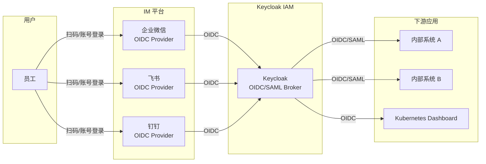

## 场景

国内企业普遍使用企业微信、飞书或钉钉作为组织协作平台，员工已经在这些平台上拥有身份。将 Keycloak 作为企业的统一 IAM 认证入口，对接这些平台的 OIDC/OAuth 能力，可以实现：

1. **员工一键登录**：内部应用使用「企业微信登录」「飞书登录」「钉钉登录」，无需额外记住密码
2. **统一身份管理**：Keycloak 作为中间层，下游应用对接 Keycloak 即可，不需要每个应用单独对接 IM 平台
3. **混合认证**：同时支持 IM 扫码登录 + 本地密码登录 + LDAP 登录等多种方式

## 适用场景

- 企业内部应用需要对接企业微信、飞书或钉钉登录
- 已有 Keycloak 作为 IAM 中心，想复用现有架构而非每应用单独适配 IM SDK
- 需要统一管理不同 IM 来源的用户（部分员工用企业微信，部分用飞书）
- 新员工入职后自动在 Keycloak 中创建用户（Just-In-Time Provisioning）

> **协议选型提示**：在对接前，建议先了解 IAM 中 OIDC 和 SAML 的适用场景差异——详见 [IAM 协议选型指南]()。国内 IM 平台中，飞书对标准 OIDC 的支持最成熟，企业微信和钉钉需要额外适配。

## 不适用场景

- 只需要在单一应用中对接 IM 登录——直接用 IM 的 OAuth SDK 更快，Keycloak 中间层反而增加复杂度
- 对外 C 端用户登录——企业微信和钉钉的 OAuth 登录通常限定组织内成员
- 需要极致的移动端体验——IM 平台原生 SDK 在某些场景下比 OIDC 重定向流程更流畅

## 总体架构



Keycloak 在这一架构中扮演 **Identity Broker（身份中介）**角色：对外对接多个上游 IM 平台的 OIDC，对内向下游应用统一暴露 OIDC/SAML 接口。下游应用不需要知道用户来自哪个 IM 平台。

## 三平台对比速览

| 平台 | 协议支持 | 应用创建入口 | 用户标识字段 | 文档入口 |
|------|---------|-------------|-------------|---------|
| **企业微信** | OAuth 2.0 | 企业微信管理后台 → 应用管理 → 自建应用 | `UserId`（企业内唯一） | [open.work.weixin.qq.com](https://open.work.weixin.qq.com) |
| **飞书** | OIDC（推荐）/ OAuth 2.0 | 飞书开放平台 → 创建企业自建应用 | `open_id` / `union_id` | [open.feishu.cn](https://open.feishu.cn) |
| **钉钉** | OAuth 2.0 / OIDC（新版） | 钉钉开放平台 → 创建应用 | `openId` / `unionId` | [open.dingtalk.com](https://open.dingtalk.com) |

> 三平台均在向标准 OIDC 协议靠拢。飞书的 OIDC 支持最成熟（Discovery Endpoint、标准 claims）。企业微信和钉钉传统上使用自有 OAuth 2.0 变体，但 Keycloak 可以通过 Generic OIDC Provider 或自定义 Identity Provider 对接。

## 通用配置步骤

以下步骤适用于所有三个平台。平台特定差异在后续小节说明。

### 第一步：在 IM 平台创建 OAuth 应用

核心信息需要记录：

| 配置项 | 说明 | 示例 |
|--------|------|------|
| 应用名称 | IM 平台中显示 | 「内部系统统一登录」 |
| 回调地址（Redirect URI） | Keycloak 的 broker endpoint | `https://sso.example.com/realms/example/broker/wecom/endpoint` |
| 可信域名 | 部分平台要求配置 | `sso.example.com` |

**回调地址格式**：`https://<keycloak-host>/realms/<realm-name>/broker/<idp-alias>/endpoint`

其中 `<idp-alias>` 是你在 Keycloak 中配置的 Identity Provider 别名（如 `wecom`、`feishu`、`dingtalk`）。

### 第二步：在 Keycloak 中添加 Identity Provider

进入 Keycloak 管理控制台 → 选择 Realm → Identity Providers → 选择 **OpenID Connect v1.0**。

基础配置：

| 配置项 | 说明 |
|--------|------|
| **Alias** | 唯一标识，如 `wecom`。决定了回调地址路径 |
| **Display Name** | 登录页显示名称，如「企业微信登录」 |
| **Enabled** | `ON` |
| **Store Tokens** | 建议 `ON`（便于调试 token 内容） |
| **Trust Email** | 根据平台决定（企业微信可能不返回已验证邮箱） |

### 第三步：配置 OIDC 端点

三个平台的 OIDC 端点如下表：

| 端点 | 企业微信 | 飞书 | 钉钉（新版 OIDC） |
|------|---------|------|------------------|
| **Authorization URL** | `https://open.weixin.qq.com/connect/oauth2/authorize` | `https://passport.feishu.cn/suite/passport/oauth/authorize` | `https://login.dingtalk.com/oauth2/auth` |
| **Token URL** | `https://qyapi.weixin.qq.com/cgi-bin/gettoken`（非标准，需二步获取） | `https://passport.feishu.cn/suite/passport/oauth/token` | `https://api.dingtalk.com/v1.0/oauth2/userAccessToken` |
| **User Info URL** | `https://qyapi.weixin.qq.com/cgi-bin/user/getuserinfo` | `https://passport.feishu.cn/suite/passport/oauth/userinfo` | `https://api.dingtalk.com/v1.0/contact/users/me` |
| **Client ID** | 应用的 `CorpId` + 自建应用凭据 | 飞书应用的 `App ID` | 钉钉应用的 `Client ID` |
| **Client Secret** | 自建应用的 `Secret` | 飞书应用的 `App Secret` | 钉钉应用的 `Client Secret` |

> ⚠️ **企业微信用户信息端点差异**：企业微信的 `/getuserinfo` 端点接收的参数名是 `access_token` 而非标准 `Authorization: Bearer` header，需要在 Keycloak 中自定义 User Info 请求方式或使用自定义 Identity Provider 插件（如 [keycloak-services-social-weixin](https://github.com/joe-stifler/keycloak-services-social-weixin)）。

### 第四步：配置属性映射（Mappers）

用户在 IM 平台的身份信息需要映射到 Keycloak 用户属性。以飞书为例：

```
Keycloak Mapper 配置：
  - 用户名：sub → username（或使用 open_id）
  - 邮箱：email → email
  - 姓名：name → firstName + lastName
  - 手机号：mobile → 自定义属性 phone_number
```

企业微信的 `/getuserinfo` 返回字段：

| 字段 | 说明 | Keycloak 映射建议 |
|------|------|------------------|
| `UserId` | 企业内唯一用户标识 | → `username` 或自定义属性 |
| `DeviceId` | 设备 ID | 忽略 |
| `user_ticket` | 成员票据 | 可选存储 |

飞书 OIDC UserInfo 返回字段：

| 字段 | 说明 | Keycloak 映射建议 |
|------|------|------------------|
| `sub` | 用户唯一标识 | → `username` |
| `name` | 用户姓名 | → `firstName` + `lastName`（需拆分） |
| `email` | 邮箱 | → `email`（需确认已配置邮箱权限） |
| `mobile` | 手机号（需申请权限） | → 自定义属性 |
| `avatar_url` | 头像 URL | → 自定义属性 |

## 飞书 OIDC 集成详解（推荐起点）

飞书对标准 OIDC 协议的支持最完整，推荐作为第一个对接的平台。

### 飞书开放平台配置

1. 登录 [飞书开放平台](https://open.feishu.cn)，创建**企业自建应用**
2. 在「安全设置」中添加重定向 URL：`https://sso.example.com/realms/example/broker/feishu/endpoint`
3. 在「权限管理」中开启以下权限：
   - `contact:user.email:readonly`（获取邮箱）
   - `contact:user.phone:readonly`（获取手机号，按需）
   - `contact:user.base:readonly`（获取基本信息）
4. 发布应用并获得管理员审批

### Keycloak 飞书 IdP 配置

```yaml
# 在 Keycloak 管理界面配置，此处用配置结构展示
Alias: feishu
Display Name: 飞书登录
Enabled: true

# OIDC 设置
Authorization URL: https://passport.feishu.cn/suite/passport/oauth/authorize
Token URL: https://passport.feishu.cn/suite/passport/oauth/token
User Info URL: https://passport.feishu.cn/suite/passport/oauth/userinfo
Client ID: cli_xxxxxxxxxxxx
Client Secret: xxxxxxxxxxxxxxxxxxxxxxxx

# 高级设置
Scopes: openid profile email phone
Prompt: consent
Validate Signatures: false  # 飞书暂不支持 JWKS 验证，使用 UserInfo 端点确认
```

### 验证

配置完成后，访问 Keycloak 的账号管理页面，应能看到「飞书登录」按钮：

```bash
# 1. 检查 IdP 重定向端点是否可达
curl -I "https://sso.example.com/realms/example/broker/feishu/endpoint"
# 应返回 302 重定向到 passport.feishu.cn

# 2. 在浏览器中访问，应跳转到飞书登录页面
# https://sso.example.com/realms/example/account
# → 点击「飞书登录」→ 飞书授权页 → 授权后回到 Keycloak
```

## 企业微信集成（自定义 IdP 方式）

企业微信的 OAuth 2.0 不是标准 OIDC，不能直接用 Keycloak 内置的 OIDC Identity Provider。有两种方案：

### 方案 A：使用社区插件

GitHub 上有针对企业微信的 Keycloak 插件，封装了非标准 API 调用：

```bash
# 社区插件示例（需验证兼容性）
# https://github.com/joe-stifler/keycloak-services-social-weixin
```

部署方式：将 JAR 放入 `providers/` 目录，重启 Keycloak，在 Identity Providers 列表中选择新增的「WeChat Work」类型。

### 方案 B：通过企业微信 OAuth 2.0 代理（推荐）

如果无法使用社区插件，更可靠的方式是在 Keycloak 前放置一个轻量的 OAuth 2.0 → OIDC 转换代理：


可以使用 Dex、oauth2-proxy 或一个简单的 Flask/Express 服务将企业微信的非标准 OAuth 封装成标准 OIDC 端点，然后 Keycloak 作为标准 OIDC IdP 接入。

## 钉钉集成

钉钉在 2023 年后逐步支持标准 OIDC 协议。新版应用（钉钉开放平台 2.0）可以使用标准 OIDC 接入。

### 钉钉开放平台配置

1. 登录 [钉钉开放平台](https://open.dingtalk.com)，创建**企业内部应用**
2. 在「开发管理」中添加回调域名
3. 记录 `Client ID` 和 `Client Secret`

### Keycloak 钉钉 OIDC 配置要点

钉钉的 OIDC 支持仍在演进中，如果标准 OIDC 端点不可用，可回退到 Generic OAuth 2.0 Provider 模式：

| 参数 | 值 |
|------|-----|
| Authorization URL | `https://login.dingtalk.com/oauth2/auth` |
| Token URL | `https://api.dingtalk.com/v1.0/oauth2/userAccessToken` |
| User Info URL | `https://api.dingtalk.com/v1.0/contact/users/me` |
| Client ID | 应用 Client ID |
| Scope | `openid corpid` |

## 常见错误与排错

| 错误现象 | 可能原因 | 解决方案 |
|---------|---------|---------|
| `redirect_uri_mismatch` | IM 平台配置的回调地址与 Keycloak  Broker Endpoint 不一致 | 检查两端的完整 URL，特别注意 `http` vs `https`、尾部斜杠 |
| `invalid_client` | Client ID/Secret 错误或应用未发布 | 到 IM 开放平台确认凭据、确认应用已发布上线 |
| 登录后 Keycloak 显示「用户已存在」 | 邮箱已被其他 IdP 或本地用户占用 | 检查 Trust Email 设置，或为不同 IdP 来源的用户设置不同的用户名生成策略 |
| 飞书返回邮箱为空 | 未申请 `contact:user.email` 权限或未审批 | 到飞书开放平台的「权限管理」中申请并发布 |
| 企业微信 redirect 后卡住 | 企业微信 OAuth 是二步流程，Keycloak 标准 OIDC IdP 无法直接处理 | 使用社区插件或自建 OAuth2-OIDC 代理 |
| 钉钉 `userAccessToken` 接口返回权限不足 | 应用未申请 `Contact.User.Read` 权限 | 到钉钉开放平台申请权限并发布 |
| 回调后出现 `Identity Provider email not verified` | IM 平台返回的 email 未标记 verified | 在 Keycloak IdP 设置中开启「Trust Email」，或调整 First Login Flow 跳过邮箱验证 |

## 用户属性映射最佳实践

```yaml
# 推荐的用户名生成策略（避免冲突）
# 不同 IdP 来源的用户使用不同前缀
user_pre:
  # 飞书用户: sub（open_id）
  feishu → feishu_${CLAIM.sub}
  # 企业微信用户: UserId
  wecom → wecom_${CLAIM.UserId}
  # 钉钉用户: openId
  dingtalk → dingtalk_${CLAIM.openId}

# 邮箱: 优先使用 IM 平台已验证邮箱（需确认平台是否验证）
email → ${CLAIM.email}

# 部门/组织信息（用于自动分组）
department → ${CLAIM.department}
```

### 自动分配用户组

可以通过 Keycloak 的 Identity Provider Mapper 将 IM 平台的部门信息映射到 Keycloak Group：

1. 创建「Advanced Attribute to Group」类型的 Mapper
2. 将飞书的 `department_ids` 或企业微信的 `department` 字段映射到 Keycloak 已有 Group
3. 新用户首次登录时自动加入对应 Group

## 生产环境注意事项

1. **证书与 HTTPS**：所有回调 URL 必须使用 HTTPS。Keycloak 部署在反向代理后时，确保反向代理正确设置了 `X-Forwarded-Proto` 和 `X-Forwarded-Host` headers
2. **令牌刷新**：IM 平台的 access_token 有效期通常较短（2 小时），Keycloak 会自动处理 refresh（如果平台支持）
3. **用户注销**：Keycloak 登出时，是否需要同步注销 IM 平台？通常不需要——IM 平台的会话独立管理，只需注销 Keycloak 自身会话
4. **多平台并存**：如果同时对接企业微信和飞书，确保两个 IdP 的用户名生成策略不会冲突（见上文前缀方案）
5. **速率限制**：IM 平台通常有 API 调用频率限制。大规模用户集中登录（如早晨上班高峰）时，Keycloak 自带的缓存可以减轻对 IM 平台的压力——User Info 结果会被缓存
6. **权限审批**：飞书和钉钉的某些权限（如手机号）需要平台管理员审批，提前申请避免上线时被卡

## 回滚方式

如果集成出现问题：

```bash
# 1. 禁用 IdP（不删除，保留配置）
# Keycloak Admin Console → Identity Providers → 选择 IdP → Enabled: OFF

# 2. 清除已创建的用户（如果需要）
# 通过 Admin CLI 批量清理特定 IdP 来源的用户

# 3. 或者通过修改 First Login Flow 拒绝该 IdP 的新用户创建
# Authentication → Flows → First Broker Login → 在「Create User If Unique」后添加拒绝条件
```

禁用 IdP 不会影响已通过该 IdP 创建的用户——他们仍可正常登录（如果设置了密码）或通过其他 IdP 登录。

## 小结

将企业微信、飞书、钉钉作为 Keycloak 的上游 Identity Provider，是让企业内部应用「一键登录」最少的维护成本方案。飞书的 OIDC 支持最成熟，推荐优先对接；企业微信和钉钉需要额外适配，但收益同样明显——员工用自己每天都在用的 IM 账号登录内部系统，无需额外记忆密码，IT 团队不需要维护独立的密码数据库。

## 常见问题（FAQ）

### 三个平台能同时接入吗？

可以。Keycloak 支持配置多个 Identity Provider。用户在登录页面会看到多个登录选项（企业微信登录、飞书登录、钉钉登录），任选其一即可。

### 员工的 IM 账号被禁用后，还能登录内部系统吗？

取决于 Keycloak 的配置。默认情况下，如果 IM 平台拒绝认证（用户被禁用、离职），用户无法通过该 IdP 登录 Keycloak。但用户在 Keycloak 中的账户仍然存在，如果设置了独立的密码或其他 IdP 绑定，仍可通过其他方式登录。

### 如何限制只有特定部门的员工才能登录？

在 Keycloak IdP 配置中，可以在 Post Broker Login Flow 中添加一个「Script Mapper」或条件判断，检查用户的部门属性是否在允许列表中。或者更简单的方式：在 IdP Mapper 中将部门映射到 Group，然后在下游应用的 Keycloak Client 中配置只有特定 Group 可以访问。

### Keycloak 本身需要对接 AD/LDAP 吗？

不冲突。Keycloak 可以同时配置多个 User Federation（如 LDAP/AD）和多个 Identity Provider（如飞书/企业微信）。用户可以先通过飞书登录，Keycloak 自动创建本地用户；如果用户也存在于 LDAP 中，可以通过属性匹配（如邮箱）自动关联。
