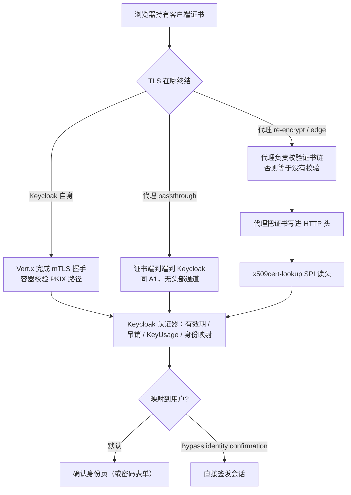

## 场景与边界

内网系统用客户端证书登录（企业 CA 签发的员工证书做第一因子）是个老需求，但它在 Keycloak 里失败的方式很不直观：证书确实发出去了，浏览器也弹了选择框，登录页出现的却是密码表单，或者停在一个「确认身份」按钮上，或者干脆报 `Certificate validation's failed.`——一句话都看不出是证书没到、链不全、映射不到用户，还是被人事系统里的属性名写错了。

适用：已有企业 PKI（AD CS、内部 CA），需要浏览器免密登录或证书 + 密码的组合；Keycloak 26.x（本文以 26.7.4 为基线，认证器默认值取自该 tag 源码）。不适用：只需要服务间 mTLS 的场景——那是客户端认证器 `client-x509`，配置项与失败模式都不同，见 [Keycloak 客户端认证与 IAM 凭据轮换]()。用 Passkey/WebAuthn 替代证书作为免密因子，成本通常更低，对比见 [Passkey / WebAuthn / FIDO2 IAM 企业落地指南]()。

## 先分清「谁验证书」

X.509 登录最容易踩的坑不是 Keycloak 配置，而是责任划分。Keycloak 官方文档写得很直接：**PKIX 路径校验是 Web 容器的责任**，Keycloak 侧的认证器只额外做有效期、吊销状态、KeyUsage/EKU/Certificate Policy 检查。这句话决定了整条拓扑：TLS 在哪一层终结，校验就在哪一层发生。



三个值得记住的结论：

1. **Keycloak 默认不会重新验证证书链**。`CertificateValidator.validateTrust()` 的第一行就是 `if (!_trustValidationEnabled) return this;`，而这个开关只在认证器选项 `x509-cert-auth.revalidate-certificate-enabled`（控制台里的 *Revalidate Client Certificate*）打开时才为 true。默认关。
2. 因此 **re-encrypt/edge 拓扑下，验证证书链是代理的活儿**。代理不验，就等于把「任意自签证书都能当合法凭据」这一条留给攻击者。
3. 只有当代理不验（或信任的 CA 太多导致握手协商失败）时，才打开 *Revalidate Client Certificate*，让它用 Keycloak 自己的信任库重建并校验链。这时信任库不可用会直接抛异常：`Cannot validate client certificate trust: Truststore not available. Please make sure to correctly configure truststore provider in order to be able to revalidate certificate trust`。

## 拓扑选择

| 拓扑 | 证书到达方式 | 谁校验 PKIX | 需要 lookup SPI | 判断 |
|---|---|---|---|---|
| Keycloak 直接终结 TLS | 握手直接到 Keycloak | Vert.x 容器 | 否 | 控制面最小，但要暴露 8443 并管理 Keycloak 的 keystore |
| 代理 passthrough | 握手透传到 Keycloak | Vert.x 容器 | 否 | **官方推荐的 X.509 拓扑**：证书不走 HTTP 头，不存在伪造头问题 |
| 代理 re-encrypt / edge | 代理写入 HTTP 头 | 代理（或 Keycloak 的 revalidate） | 是 | 运维上最省事，安全上最需要自查 |

官方对头部转发这条路给出的前提条件不是可选建议，而是硬条件：Keycloak 必须只接受来自代理的连接（NetworkPolicy / 安全组）、代理必须**覆盖写**而不是追加配置里那个证书头、`trust-proxy-verification` 只能在代理确实校验证书链时打开。三条缺一条，伪造一个 `Client-Cert` 头就是一次无需凭据的登录。

如果 Keycloak 前面还有一层不做证书校验的 LB（例如只做 TCP 转发的云 LB 转给 nginx），责任就落在 nginx 上：`ssl_verify_client on;` 必须真的打开，否则请回到 revalidate 方案。

## 最小配置：先让 Keycloak 要到证书

mTLS 默认是关的。不开这个开关，浏览器根本不会发送证书，后面所有认证器配置都不会被触发：

```bash
# required：不提供证书的请求直接失败
# request ：允许无证书请求，有证书时才校验（灰度期用这个）
bin/kc.sh start --https-client-auth=request \
  --https-trust-store-file=/opt/kc/tls/truststore.p12 \
  --https-trust-store-password=${KC_TRUSTSTORE_PASSWORD}
```

信任库（truststore）有三个容易搞错的点：

- **它是全局的，不能按 realm 配置**。官方文档用 WARNING 明确写了 mTLS 配置与信任库由所有 realm 共享。这正是 26.7 给客户端 X.509 认证强加 *Certificate Authority subject DN* 的原因（见下节与 [Keycloak 26.7 新特性解读]()）。
- **管理接口会继承**。上了 mTLS，9000 管理端口也要求客户端证书；需要用 `--https-management-client-auth` 单独降级，或给管理接口配另一套 `--https-management-trust-store-*`。巡检脚本、Operator 探针在这里断掉是常见事故。
- **系统信任库是叠加而不是替换**。JRE 默认证书始终受信，额外证书放 `conf/truststores/`（递归扫描）或由 `--truststore-paths=/opt/ca/a.pem,/opt/ca/b.p12` 指定。PEM 或**未加密** PKCS12 均可；扩展名与内容类型不匹配时要显式给 `--https-trust-store-type`。这是给 LDAPS、上游 IdP 自签证书、DB TLS 一起用的那个信任库，配置细节见 [Keycloak 跨机房多集群高可用]() 里的 `db-tls-mode=verify-server` 部分。

Kubernetes 上还有一个官方刚写进文档、但很容易被忽略的 WARNING：`--truststore-kubernetes-enabled` 默认为 `true`，会自动把 `/var/run/secrets/kubernetes.io/serviceaccount/ca.crt`（以及 OpenShift 的 service-ca.crt）纳入系统信任库。如果你把 `--https-client-auth` 设为 `request`/`required` 却**没有显式设置 `--https-trust-store-file`**，客户端证书校验会回落到系统信任库——于是**任何由集群 CA 签发的证书都会被当成合法客户端证书**。内网多租户集群里这就是一条越权路径。要么显式指定 `https-trust-store-file`，要么关掉 `truststore-kubernetes-enabled`。

## Realm 侧：Browser Flow 与认证器配置

官方路径是复制内置 Browser flow 再插一步，不要直接改内置 flow：

1. Authentication → Browser flow → Action → Duplicate，起个名字。
2. Add step → **X509/Validate Username Form**（provider id `auth-x509-client-username-form`）。
3. 把它拖到 *Browser Forms* 之前，requirement 设为 `ALTERNATIVE`——证书优先，无证书时回落到密码表单（灰度期就是这个语义，不是故障）。
4. Action → Bind flow，绑到 Browser flow。

要强制证书登录就把这一步设为 `REQUIRED`，同时把 *Browser Forms* 停用；此时代理没验链、证书没带等任何原因都会变成一次硬失败，而不是静默回落。这一点在选择 requirement 时必须有意识：**`ALTERNATIVE` + 代理没配好 = 用户照样能用密码进，你从告警上看不出来**。

认证器的配置项名称、标签与默认值如下（全部取自 26.7.4 的 `AbstractX509ClientCertificateAuthenticatorFactory`，`x509-cert-auth.*` 前缀）：

| 控制台标签 | 配置键 | 默认值 | 说明 |
|---|---|---|---|
| User Identity Source | `x509-cert-auth.mapping-source-selection` | `Match SubjectDN using regular expression` | 身份从哪里取，见下节 |
| A regular expression | `x509-cert-auth.regular-expression` | `(.*?)(?:$)` | 仅在两个 `Match …DN` 来源下生效 |
| User mapping method | `x509-cert-auth.mapper-selection` | `Username or Email` | 或 `Custom Attribute Mapper` |
| A name of user attribute | `x509-cert-auth.mapper-selection.user-attribute-name` | `usercertificate` | 自定义属性名 |
| Canonical DN representation enabled | `x509-cert-auth.canonical-dn-enabled` | `false` | JDK 的 canonical 归一化会去空格、按英文 locale 改大小写，可能与 CA 实际下发的 DN 冲突 |
| Enable Serial Number hexadecimal representation | `x509-cert-auth.serialnumber-hex-enabled` | `false` | RFC 5280 要求符号位为 1 时左补 `00` |
| Check certificate validity | `x509-cert-auth.timestamp-validation-enabled` | `true` | 校验证书 `notBefore`/`notAfter` |
| CRL Checking Enabled | `x509-cert-auth.crl-checking-enabled` | 未开启 | 配合 `CRL Path`（默认 `crl.pem`，相对 Keycloak 配置目录） |
| Enable CRL Distribution Point… | `x509-cert-auth.crldp-checking-enabled` | `false` | 走证书里的 CDP 拉 CRL |
| CRL abort if non updated | `x509-cert-auth-crl-abort-if-non-updated` | `true` | CRL 过期即认证失败（官方推荐） |
| OCSP Checking Enabled | `x509-cert-auth.ocsp-checking-enabled` | 未开启 | 走 AIA/OCSP Responder URI |
| OCSP Fail-Open Behavior | `x509-cert-auth.ocsp-fail-open` | `false` | 默认要求 OCSP 明确成功；开启后仅在明确吊销时失败 |
| Validate Key Usage / Extended Key Usage / Certificate Policy | `…keyusage` / `…extendedkeyusage` / `…certificate-policy` | 空 | 留空即关闭 |
| Certificate Policy Validation Mode | `x509-cert-auth.certificate-policy-mode` | `All` | 多个 policy OID 时要求全部命中 |
| Bypass identity confirmation | `x509-cert-auth.confirmation-page-disallowed` | 未开启 | 见下文免密一节 |
| Revalidate Client Certificate | `x509-cert-auth.revalidate-certificate-enabled` | 未开启 | 见上文「谁验证书」 |

**先别急着打开 CRL/OCSP。** 这两个开关在证书链里任何一环不可达时都能让登录整体中断，`OCSP Fail-Open` 默认是关的意味着 OCSP 服务不可达 = 拒绝登录。生产上更稳的做法是先用代理侧或旁路的吊销检查，确认 PKI 的 CRL/OCSP 端点在内网可达、且 `nextUpdate` 有稳定产出，再逐条打开。

## 身份映射：10 个来源与两类误配

Keycloak 支持的 `User Identity Source` 共 10 种，控制台里显示的就是这些字符串（等号右边为源码常量值）：

- `Match SubjectDN using regular expression`（默认）
- `Match IssuerDN using regular expression`
- `Subject's e-mail`、`Subject's Alternative Name E-mail`
- `Subject's Alternative Name otherName (UPN)`
- `Subject's Common Name`
- `Certificate Serial Number`、`Certificate Serial Number and IssuerDN`
- `SHA-256 Thumbprint`
- `Full Certificate in PEM format`

默认值是 `Match SubjectDN using regular expression`，而默认正则 `(.*?)(?:$)` 会把整段 SubjectDN 原样当成身份——除非用户名恰好等于这段 DN，否则映射必然失败。**「配了认证器、证书也到了，却总提示身份映射失败」的第一嫌疑就是这个默认值没改。** 邮箱型证书的常见写法是 `emailAddress=(.*?)(?:,|$)`，映射方式保持 `Username or Email`。

另外四个有边界的点，官方文档给了明确限制：

- 关闭 realm 的 *Login with email* 后，证书里用邮箱做身份也一样进不来，规则是共用的。
- `Certificate Serial Number and IssuerDN` 需要**两个**自定义属性（序列号一个、IssuerDN 一个），顺序错一个就是静默映射不上。
- `SHA-256 Thumbprint` 取的是小写十六进制表示，人工核对时大小写不一致会误判。
- `Full Certificate in PEM format` **只能**用在来自外部联邦源（如 LDAP）的自定义属性上，Keycloak 自身数据库存不下整证书；LDAP 场景还需要开启 *Always Read Value From LDAP*。目录侧的属性准备见 [IAM 目录对接：Keycloak LDAP / Active Directory 用户联邦]()。

用自定义属性做映射时记得给它加个可视化与审计路子：`usercertificate` 这类属性在用户详情页里默认不显眼，排查「这个人的证书到底注册了没有」往往要么查 Admin API，要么用 [Keycloak 生产巡检与运维清单]() 里的那套检查。

## 免密：为什么会停在「确认身份」页

默认行为值得说清楚，因为它非常容易被当成 bug：认证器成功映射到用户后**不会直接登录**。源码里 `config.getConfirmationPageDisallowed()` 为 false 时调的是 `context.forceChallenge(...)`，弹出确认页让用户选择「用证书里的身份继续」或「改用用户名密码」。只有打开 *Bypass identity confirmation*（`x509-cert-auth.confirmation-page-disallowed`）才会走 `context.success(UserCredentialModel.CLIENT_CERT)` 直接签发会话。

也就是说，想做到「插证书即登录」，要同时满足三件事：`https-client-auth` 不是 `none`、用户映射成功、*Bypass identity confirmation* 打开。少最后一条的表现就是用户每次都要点一下确认。

证书里没有可用身份、或映射不到用户时，认证器会走到 `context.challenge()` 并带上错误文案（源码原文）：`Unable to extract user identity from specified certificate`，或扩展校验失败时的 `Certificate validation's failed.` / `Certificate revoked or incorrect.`。这些字符串会出现在浏览器页面上，比翻日志快。

## 代理转发证书链：六个 lookup provider

TLS 终结在 Keycloak 之外时才需要这一步。官方文档把 provider 选择列为 **build time** 选项（改动要重新 `kc.sh build` 或重建镜像），头部名与链长则作为启动参数给出：

```bash
bin/kc.sh build --spi-x509cert-lookup--provider=nginx
bin/kc.sh start \
  --spi-x509cert-lookup--nginx--ssl-client-cert=ssl-client-cert \
  --spi-x509cert-lookup--nginx--ssl-cert-chain-prefix=ssl-client-chain \
  --spi-x509cert-lookup--nginx--certificate-chain-length=2
```

通用选项只有四个：`ssl-client-cert`（证书所在头名，`traefik`/`envoy` 不适用，`rfc9440` 可省）、`ssl-cert-chain-prefix`（索引式链头前缀，仅 `apache`/`nginx`）、`ssl-cert-chain`（整条链装在单个头里，`haproxy`/`rfc9440`）、`certificate-chain-length`（除 `envoy` 外适用，**默认 1**）。这些 lookup provider 不导出配置元数据，`kc.sh show-config` 之外的选项校验不会帮你发现拼写错误，改完用 `show-config` 核对实际生效值最稳；`--optimized` 镜像下对 `spi-*` 参数拿不准时，重新 build 一次比线上排查便宜。

`certificate-chain-length` 默认 1 是个实打实的坑：证书链里中间 CA 多于这个数时，官方文档的原话是 provider 会**丢弃整个请求**。企业 PKI 常见的「根 → 中间 → 签发」结构配默认值就会随机挂，一定要按实际的链长设置。

| provider | 头名（默认） | 独有选项与默认 | 关键行为 |
|---|---|---|---|
| `nginx` | `ssl-client-cert` | `trust-proxy-verification=false`；`cert-is-url-encoded=true` | SSL 模块**不导出证书链**，Keycloak 用信任库重建链 |
| `haproxy` | `ssl-client-cert` / `ssl-cert-chain` | 链长默认 1 | `ssl-cert-chain` 收 base64 DER（`ssl_c_chain_der,base64`）；`ssl-cert-chain-prefix` 已弃用 |
| `apache` | `ssl-client-cert` | 链头走 `_0`、`_1`… 索引前缀 | 对应 `SSL_CLIENT_CERT` 一类头 |
| `traefik` | 固定 `X-Forwarded-Tls-Client-Cert` | 链长默认 1 | 需要 PassTLSClientCert 中间件开 `pem: true`，PEM 块用逗号分隔 |
| `envoy` | 固定 `x-forwarded-client-cert` | 无选项 | 读 XFCC 的 `Cert` / `Chain` |
| `rfc9440` | `Client-Cert` / `Client-Cert-Chain` | 链长默认 1 | 头名合规时零配置；链长同样要按实际调整 |

两个 provider 细节值得单独盯：

**nginx**：`cert-is-url-encoded` 默认是 `true`，对应 nginx 变量 `$ssl_client_escaped_cert`。很多人按老教程写 `proxy_set_header ssl-client-cert $ssl_client_cert;`——那是带换行和制表符的非转义格式，provider 会解不出来并打日志 `HTTP header "ssl-client-cert" does not contain a valid x.509 certificate`。要么改用 `$ssl_client_escaped_cert`，要么显式把 `cert-is-url-encoded` 关掉。另外 nginx 侧不导出链，Keycloak 必须能用信任库把链拼出来，信任库为空时的日志是两行 warning：`Keycloak Truststore is null or empty, but it's required for NGINX x509cert-lookup provider` 和 `Impossible to rebuild end user cert chain : client certificate authentication will fail.`。

**haproxy**：官方示例把 `ssl_c_der,base64` 与 `ssl_c_chain_der,base64` 分别写进两个头，并限制只在 `ssl_c_used` 且 `ssl_c_verify 0` 时写入：

```
http-request del-header Client-Cert
http-request del-header Client-Cert-Chain
http-request set-header Client-Cert %[ssl_c_der,base64] if { ssl_c_used } { ssl_c_verify 0 }
http-request set-header Client-Cert-Chain %[ssl_c_chain_der,base64] if { ssl_c_used } { ssl_c_verify 0 }
```

`del-header` 那两行不是装饰——它保证客户端伪造的同名头被覆盖。少了它，攻击者自带一个 `Client-Cert` 头就能绕过代理的校验。

还有一道 26.2 起生效的闸门：内置的 X.509 证书查找会遵守 `proxy-trusted-addresses`。代理不在白名单里时，lookup 会打 `HTTP header "…" is not trusted` 并返回 null，认证器于是走「没有证书」的分支。**这正是最隐蔽的一种故障**：证书、头部、链长都对，但代理地址没进白名单，结果是 `ALTERNATIVE` 静默回落到密码登录，日志里没有 error。信任边界的完整语义见 [Keycloak 反向代理真实客户端 IP 与代理信任边界]()。

## 排错表

| 症状 / 日志 | 根因 | 动作 |
|---|---|---|
| 浏览器从不弹证书选择框 | `https-client-auth=none`（默认） | 设为 `request` 或 `required` 后重启 |
| 同上，且配置已开 | 浏览器证书库没有该证书，或服务器在握手时不请求证书（代理未配 `ssl_verify_client`） | 用 `openssl s_client` 确认服务端是否发送 CertificateRequest |
| 握手直接失败、部分客户端正常 | 信任库广告的 CA 过多，超出浏览器 TLS 协商包上限（32767 字节，约 200 个 CA） | 收敛信任库；或改用 re-validate 方案把关卡拉到应用层 |
| 停在确认身份页 | *Bypass identity confirmation* 未开 | 打开该选项（免密场景） |
| `Unable to extract user identity from specified certificate` | 身份来源与正则不匹配（默认正则会取整段 DN） | 按证书实际字段换来源、改正则，并用 `openssl x509 -noout -subject` 对照 |
| 映射失败但日志只说 `Invalid user` | 取到身份了，但用户名/自定义属性对不上；或 realm 关闭了 *Login with email* 而映射走邮箱 | 核对属性名与值，注意序列号/IssuerDN 需要两个属性 |
| `Certificate validation's failed.` / `Certificate revoked or incorrect.` | 有效期、KeyUsage/EKU/Policy、CRL/OCSP 任一校验失败 | 先关 CRL/OCSP 复现，再逐条打开定位 |
| `Cannot validate client certificate trust: Truststore not available…` | 开了 *Revalidate Client Certificate* 但信任库不可用 | 配置 `https-trust-store-file` 或 `--truststore-paths` |
| 代理后证书登录失效，日志无 error | 代理地址不在 `proxy-trusted-addresses`，lookup 打 `HTTP header "…" is not trusted` 后返回 null | 把代理地址/网段加入白名单（留空表示信任所有来源） |
| `HTTP header "…" does not contain a valid x.509 certificate` | 头部格式不对：nginx 用了 `$ssl_client_cert` 而非转义版本，或编码与 `cert-is-url-encoded` 不匹配 | 换 `$ssl_client_escaped_cert`，或关闭该选项 |
| `Keycloak Truststore is null or empty, but it's required for NGINX x509cert-lookup provider` | nginx 不导出链，靠 Keycloak 信任库重建，但信任库为空 | 配置信任库并放入根 CA 与中间 CA |
| 链上中间证书 ≥ 2 时请求被丢弃 | `certificate-chain-length` 默认 1 | 按实际链长调大（haproxy/traefik/rfc9440 都一样） |
| 管理接口突然要求证书、探针失败 | mTLS 配置被管理接口继承 | 用 `--https-management-client-auth` / `--https-management-trust-store-*` 单独处理 |
| K8s 上自签证书也能登录 | 未显式设 `https-trust-store-file`，校验回落到系统信任库，而集群 CA 默认受信 | 显式指定信任库或关闭 `truststore-kubernetes-enabled` |
| 26.7 升级后客户端 X.509 认证配置校验不过 | `x509.casubjectdn`（*Certificate Authority subject DN*）在 26.7 起为必填 | 补齐 CA 主体 DN；顺手把正则比较改成精确 DN |
| 日志出现 `Regex comparison is deprecated…` | `x509.allow.regex.pattern.comparison` 已弃用 | 改成精确 Subject DN 后关闭该开关 |

## 验证

```bash
# 1. 服务端是否请求证书、返回码是否 0（证书链是否被服务端接受）
openssl s_client -connect kc.example.com:8443 \
  -cert user.pem -key user.key -CAfile corp-ca.pem -showcerts

# 2. 通过 Direct Grant 拿 token（仅在测试环境验证证书登录链路时使用）
curl --cacert /opt/kc/tls/corp-ca.pem \
     --cert /opt/kc/tls/user.pem --key /opt/kc/tls/user.key \
     -d "client_id=resource-owner" -d "client_secret=${CLIENTSECRET}" \
     -d "grant_type=password" \
     https://kc.example.com/realms/test/protocol/openid-connect/token

# 3. 确认 lookup provider 与信任库配置真的生效
bin/kc.sh show-config | grep -i -E "x509|truststore"
```

Direct Grant 路线要单独建 flow：复制 *Direct grant* flow、删掉 Username Validation 与 Password、加入 **X509/Validate Username**（provider id `direct-grant-auth-x509-username`，requirement 只有 `REQUIRED`），然后绑到 Direct Grant Flow。官方在这里给了明确的倾向性建议：能用 service account + 客户端 mTLS 就别用 Direct Grant + X.509，因为后者要求把**用户**证书交给客户端应用。

排错时把日志级别开到 DEBUG，然后按顺序找三句话：`x509 client certificate is not available for mutual SSL.`（证书没到认证器）、`HTTP header "…" is not trusted`（代理信任）、`Unable to extract user identity from certificate.`（映射失败）。事件侧结合 [Keycloak 审计日志配置与 IAM 合规实践]() 看登录事件里的用户名与失败原因。

## 回滚

分层回滚，顺序不能反：

1. **认证器层**（影响最小）：把 X.509 那个 execution 设为 `DISABLED`，或把 Browser flow 绑回内置 flow。认证器配置与正则都留着，反悔代价是零。
2. **代理层**：先恢复密码登录路径可用，再摘代理的 `ssl_verify_client` 与证书头。反过来做会得到一个「证书已不发、Keycloak 仍在读头」的窗口，`ALTERNATIVE` 下表现为所有人被回落到密码页，可接受；但 `REQUIRED` 下就是全员登录失败。
3. **Keycloak 层**：`--https-client-auth` 从 `required` 降到 `request` 是运行期改动；降到 `none` 前先确认客户端不再依赖证书登录，否则浏览器会开始报「必须提供证书」。
4. **lookup SPI 层**：`--spi-x509cert-lookup--provider` 是 build time 选项，回退需要重新 build 或换回直连 TLS 镜像。把它写进变更窗口，不要当成随手可改的参数。

## 安全边界

- passthrough 是 X.509 的首选拓扑，因为它把「证书可信」这件事留在 TLS 层，不引入可伪造的头部通道。
- 一旦走头部转发：网络隔离、代理覆盖写头、`trust-proxy-verification` 只在代理确实验链时才为 true，三条同时成立才算配置完成。
- 别用 `.*` 这类全匹配正则当白名单：身份来源决定了「谁是谁」，正则写宽了等于给整条 CA 链上的所有证书开用户查找。
- 信任库跨 realm 共享，K8s 上还会默认叠加集群 CA；mTLS 的准入面比多数人以为的宽，必须显式收窄。
- 证书登录的会话强度取决于证书本身：需要「带证书 + 二次因子」时，把 X.509 放进 `ALTERNATIVE`/条件流程与 OTP 组合，别把证书当唯一因子。合规语境下的分级要求见 [IAM 安全合规与等保 2.0 要求 Checklist]()。

## IAM FAQ

### IAM 里客户端证书登录需要 Keycloak 开 mTLS 吗？

需要，但只开 mTLS 不够。`--https-client-auth` 从 `none` 改成 `request`/`required` 只是让服务端在握手时请求证书；把证书里的身份映射到用户，还要在 Browser flow 里挂 *X509/Validate Username Form* 认证器并配置身份来源。两者是两件事，缺哪一件表现都是「登录还是让我输密码」。

### Keycloak 会重新验证客户端证书的信任链吗？

默认不会。PKIX 路径校验由终结 TLS 的一侧负责——Keycloak 自己终结时是 Vert.x 容器，代理终结时是代理。只有打开 *Revalidate Client Certificate*（`x509-cert-auth.revalidate-certificate-enabled`）才会用 Keycloak 信任库重新建链校验，这个选项正是为「代理不验链」和「信任的 CA 太多导致握手协商失败」这两种情况准备的。

### 为什么 Keycloak 前面加了反向代理之后，客户端证书登录就失效了？

因为证书变成 HTTP 头里的内容了，而 Keycloak 只从配置指定的头里读、且只信任 `proxy-trusted-addresses` 里的来源。逐项核对：`--spi-x509cert-lookup--provider` 是否与代理匹配、头名是否一致、编码语义（nginx 的 `cert-is-url-encoded`）是否对、代理地址是否在信任白名单、`certificate-chain-length` 是否够装下整条链。任一项不对，认证器都会当作「本次请求没有证书」处理。

### 有证书的用户能登录，没证书的员工怎么办？

把 X.509 execution 设为 `ALTERNATIVE` 并保持 *Browser Forms* 可用，没证书的请求会走到密码表单；需要全员强制证书时改成 `REQUIRED` 并停用表单。灰度期的推荐姿势是先在 `ALTERNATIVE` 下观察多久有人落到密码路径，再决定是否强制。

### Keycloak 26.7 对 X.509 认证改了什么？

用户侧认证器没有破坏性变更；客户端侧（`client-x509`）新增了必填的 *Certificate Authority subject DN*（`x509.casubjectdn`），因为信任库对所有 realm 共享、需要靠 CA 主体 DN 把证书归属到正确的客户端；同时 `x509.allow.regex.pattern.comparison` 进入弃用，建议改用精确 DN。升级检查清单见 [Keycloak 26.7 新特性解读]()。

## 延伸阅读

- [Keycloak 客户端认证与 IAM 凭据轮换：client secret、private_key_jwt、mTLS]()：服务间 mTLS 与客户端 X.509 认证器的边界，与本文的用户侧认证器互补
- [Keycloak 反向代理真实客户端 IP 与代理信任边界]()：`proxy-trusted-addresses` 的默认语义与证书头为什么会被忽略
- [Passkey / WebAuthn / FIDO2 IAM 企业落地指南]()：同样面向免密，但不需要 PKI 与代理改造
- [IAM 目录对接：Keycloak LDAP / Active Directory 用户联邦]()：`usercertificate`、`Always Read Value From LDAP` 这类属性映射的上游准备
- [OAuth 2.0 DPoP 深度解析 — Sender-Constrained Token 的原理与实战]()：证书绑定令牌与 DPoP 在「令牌不能被盗用」这件事上的两条路线

## 参考来源

- [Keycloak Server Admin Guide — X.509 Client Certificate User Authentication](https://www.keycloak.org/docs/latest/server_admin/#_x509)：身份来源清单、Browser/Direct Grant flow 配置步骤、`Bypass identity confirmation` 与 `Revalidate client certificate` 的用途说明、PKIX 校验责任在 Web 容器
- [Keycloak — Configuring trusted certificates for mTLS](https://www.keycloak.org/server/mutual-tls)：`https-client-auth` 三种取值、信任库跨 realm 共享、管理接口继承与覆盖项、信任库文件类型识别
- [Keycloak — Configuring trusted certificates](https://www.keycloak.org/server/keycloak-truststore)：系统信任库叠加语义、`truststore-paths`、Kubernetes/OpenShift 集群 CA 自动纳入及其 WARNING、`tls-hostname-verifier`
- [Keycloak — Using a reverse proxy](https://www.keycloak.org/server/reverseproxy)：client certificate lookup 一章的 provider 矩阵、通用选项与默认值、`certificate-chain-length` 不足会丢弃请求、HAProxy 示例与安全前提
- [Keycloak 26.7.0 升级说明](https://www.keycloak.org/docs/latest/upgrading/)：客户端 X.509 认证的 *Certificate Authority subject DN* 必填、正则比较弃用、`tls-client-auth-ca-subject-dn` 客户端策略执行器、HAProxy `ssl-cert-chain` 取代 `ssl-cert-chain-prefix`
- 源码（26.7.4 tag）：`AbstractX509ClientCertificateAuthenticatorFactory.java`（配置项与默认值）、`X509ClientCertificateAuthenticator.java`（无证书分支、`forceChallenge`、`context.success(UserCredentialModel.CLIENT_CERT)`）、`ValidateX509CertificateUsernameFactory.java`（`direct-grant-auth-x509-username`）、`CertificateValidator.java`（`validateTrust()` 的信任库前置与异常文案）、`services/x509/*`（六个 lookup provider 的默认头名、`cert-is-url-encoded`、信任库重建链与告警文案）
