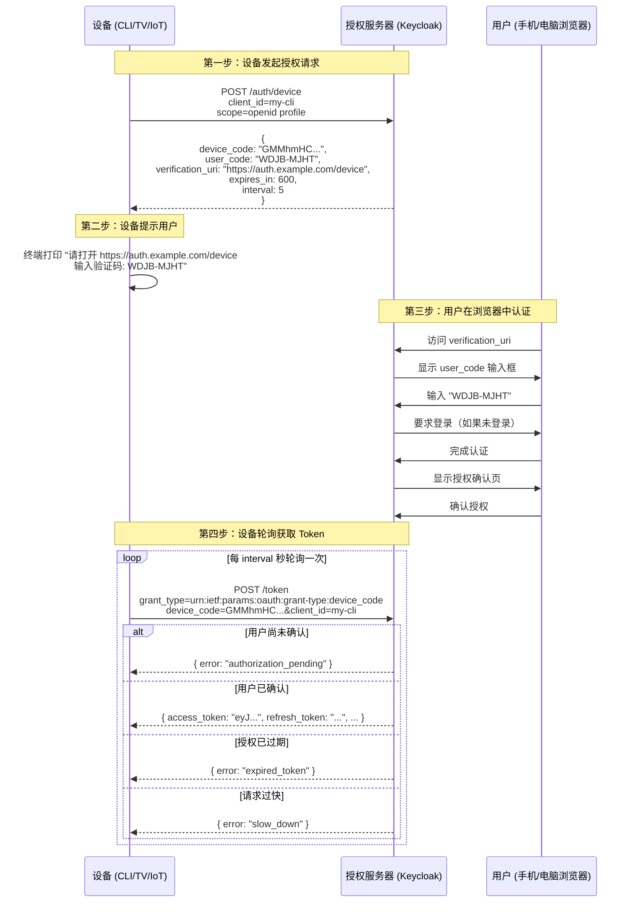

## 场景

你开发了一个 CLI 工具，需要在终端里让用户登录。没有浏览器、不能弹出 OAuth 授权页——用户只有黑底白字的命令行。AWS CLI 的 `aws sso login` 是怎么做到的？GitHub CLI 的 `gh auth login` 背后是什么？

答案是 **OAuth 2.0 Device Authorization Grant**（RFC 8628）。设备显示一个 8 位验证码，用户在手机或电脑上打开网页输入这个码——授权确认后，设备拿到 Token，流程结束。整个过程用户密码从未出现在设备上。

> 这不是什么边缘协议。AWS CLI、GitHub CLI、Google Cloud SDK、Azure CLI 的 SSO 登录、Apple TV 的第三方应用授权——全是 Device Flow。

## 适用与不适用

| 场景 | 是否适用 |
|------|----------|
| CLI 工具（kubectl 插件、自定义 DevOps 工具）的用户登录 | ✅ 适用 |
| 智能电视 / 机顶盒 / 游戏主机的第三方应用授权 | ✅ 适用 |
| IoT 设备首次配网后的用户授权绑定 | ✅ 适用 |
| 打印机、扫描仪等输入受限设备的云端服务绑定 | ✅ 适用 |
| Web 应用 / SPA 的用户登录 | ❌ 用 Authorization Code + PKCE |
| 服务间调用（M2M） | ❌ 用 Client Credentials |
| 设备已有安全存储且可跑完整浏览器 | ❌ 用 Authorization Code + PKCE |

## 协议原理

### 四个角色

Device Authorization Grant 比标准 Authorization Code Flow 多引入一个交互维度——设备和用户在**不同的通道**上完成认证。

| 角色 | 对应实体 | 职责 |
|------|---------|------|
| 设备（Device） | CLI / TV / IoT | 发起授权请求，轮询获取 Token |
| 授权服务器（AS） | Keycloak / Auth0 / Entra ID | 签发 device_code / user_code，验证用户确认 |
| 用户代理（User Agent） | 用户的手机浏览器 / 电脑 | 访问验证 URL，输入 user_code，完成认证 |
| 资源服务器（RS） | 目标 API | 验证 Access Token |

### 完整时序



### 关键参数说明

| 参数 | 含义 | 注意事项 |
|------|------|---------|
| `device_code` | 设备凭证（长随机串） | 设备持有，用于轮询换取 Token，对外不可见 |
| `user_code` | 用户验证码（短串，如 `WDJB-MJHT`） | 展示给用户，有效期短（通常 10 分钟） |
| `verification_uri` | 用户访问的验证 URL | 可以是完整的 URL（含 `?user_code=XXX`）或基础 URL |
| `expires_in` | device_code 有效期（秒） | 超时后 device_code 失效，设备收到 `expired_token` |
| `interval` | 建议轮询间隔（秒） | 设备必须至少等这么久才发下一次请求 |

### 与 Authorization Code Flow 的关键差异

| 维度 | Authorization Code + PKCE | Device Authorization Grant |
|------|--------------------------|---------------------------|
| 交互通道 | 同设备、同浏览器 | 设备与用户在**不同设备**上 |
| 回调方式 | 重定向 URI（`redirect_uri`） | 设备主动轮询 |
| 用户认证位置 | 授权服务器弹出的登录页 | 用户在另一个设备上的浏览器中认证 |
| 适用场景 | Web/SPA/移动 App | 输入受限或无浏览器的设备 |
| 安全机制 | PKCE（code_challenge） | user_code 短码 + 轮询 + 过期时间 |
| OAuth 2.1 | ✅ 推荐 | ✅ 保留 |

## Keycloak 配置

### Step 1：创建 Client

进入 Keycloak Admin Console → 选择 Realm → Clients → Create client：

| 字段 | 值 |
|------|-----|
| Client ID | `my-cli-tool` |
| Client type | OpenID Connect |
| Name | My CLI Tool |
| Client authentication | On（设备需要 client_secret 或使用 public client） |

### Step 2：启用 Device Authorization Grant

在 Client 详情页 → Settings 选项卡：

- 确保 **Standard Flow** 已启用（用户需要在浏览器中登录）
- 在 **Authentication flow** 部分，勾选 **OAuth 2.0 Device Authorization Grant**

### Step 3：配置 Client 类型选择

**Public Client**（推荐用于本地 CLI 工具，无 client_secret）：

```
Client authentication: Off
```

在这种情况下，设备请求不需要 client_secret —— 但 `device_code` 本身已经是足够强度的凭证。要注意：Public Client 模式下，Token Endpoint 的 `client_id` 声明性传递，安全性依赖 `device_code` 的秘密性和 `user_code` 的确认。

**Confidential Client**（后端服务模拟设备行为时）：

```
Client authentication: On
```

设备端需要持有 `client_secret`。

### Step 4：Keycloak 端点速查

| 端点 | URL 模式 |
|------|---------|
| Device Authorization | `https://<host>/realms/<realm>/protocol/openid-connect/auth/device` |
| Token（轮询） | `https://<host>/realms/<realm>/protocol/openid-connect/token` |
| 用户验证页面 | `https://<host>/realms/<realm>/device` 或 `https://<host>/realms/<realm>/login-actions/authenticate` |

> **生产环境注意**：`verification_uri` 返回的 URL 必须能从用户设备（手机/电脑）访问到。如果你的 Keycloak 部署在内网，用户在外部网络访问不到这个 URL——那就需要配置 Frontend URL 或通过反向代理暴露。

## CLI 工具集成示例

### Bash 脚本：最小可用 Device Flow 客户端

```bash
#!/bin/bash
# 使用 Device Authorization Grant 获取 Keycloak Access Token

KEYCLOAK_URL="https://auth.example.com"
REALM="myrealm"
CLIENT_ID="my-cli-tool"
SCOPE="openid profile"

# Step 1: 请求 device_code
RESPONSE=$(curl -s -X POST "${KEYCLOAK_URL}/realms/${REALM}/protocol/openid-connect/auth/device" \
  -d "client_id=${CLIENT_ID}" \
  -d "scope=${SCOPE}")

DEVICE_CODE=$(echo "$RESPONSE" | jq -r '.device_code')
USER_CODE=$(echo "$RESPONSE" | jq -r '.user_code')
VERIFICATION_URI=$(echo "$RESPONSE" | jq -r '.verification_uri')
INTERVAL=$(echo "$RESPONSE" | jq -r '.interval')

# Step 2: 提示用户
echo ""
echo "╔══════════════════════════════════════════════╗"
echo "║  请打开以下链接完成登录:                      ║"
echo "║  ${VERIFICATION_URI}                         ║"
echo "║                                              ║"
echo "║  然后输入验证码: ${USER_CODE}                 ║"
echo "╚══════════════════════════════════════════════╝"
echo ""

# Step 3: 轮询获取 Token
while true; do
  TOKEN_RESPONSE=$(curl -s -X POST "${KEYCLOAK_URL}/realms/${REALM}/protocol/openid-connect/token" \
    -d "grant_type=urn:ietf:params:oauth:grant-type:device_code" \
    -d "device_code=${DEVICE_CODE}" \
    -d "client_id=${CLIENT_ID}")

  ERROR=$(echo "$TOKEN_RESPONSE" | jq -r '.error // empty')

  if [ -z "$ERROR" ]; then
    ACCESS_TOKEN=$(echo "$TOKEN_RESPONSE" | jq -r '.access_token')
    REFRESH_TOKEN=$(echo "$TOKEN_RESPONSE" | jq -r '.refresh_token')
    echo "✅ 登录成功！"
    echo "Access Token: ${ACCESS_TOKEN:0:20}..."
    
    # 保存到文件
    echo "$ACCESS_TOKEN" > ~/.my-cli-token
    chmod 600 ~/.my-cli-token
    break
  fi

  case "$ERROR" in
    "authorization_pending")
      # 正常等待
      ;;
    "slow_down")
      INTERVAL=$((INTERVAL + 5))
      echo "⚠️  服务器要求降低轮询频率，调整为 ${INTERVAL}s"
      ;;
    "expired_token")
      echo "❌ 验证码已过期，请重新运行"
      exit 1
      ;;
    "access_denied")
      echo "❌ 用户拒绝了授权"
      exit 1
      ;;
    *)
      echo "❌ 未知错误: $ERROR"
      exit 1
      ;;
  esac

  sleep "$INTERVAL"
done
```

### 使用 Refresh Token 续期

```bash
# Access Token 过期后，用 Refresh Token 换新的
NEW_TOKEN=$(curl -s -X POST "${KEYCLOAK_URL}/realms/${REALM}/protocol/openid-connect/token" \
  -d "grant_type=refresh_token" \
  -d "refresh_token=${REFRESH_TOKEN}" \
  -d "client_id=${CLIENT_ID}" | jq -r '.access_token')
```

## 验证

```bash
# 1. 验证 Access Token 是否有效
curl -s -H "Authorization: Bearer ${ACCESS_TOKEN}" \
  "${KEYCLOAK_URL}/realms/${REALM}/protocol/openid-connect/userinfo" | jq .

# 预期输出:
# {
#   "sub": "f:xxx-xxx-xxx:user-id",
#   "email_verified": true,
#   "preferred_username": "alice",
#   ...
# }

# 2. 验证 Token 的 audience（确认是给你的 client 的）
echo "$ACCESS_TOKEN" | cut -d. -f2 | base64 -d 2>/dev/null | jq '.aud'

# 3. Introspect Token（Confidential Client 才能用）
curl -s -X POST "${KEYCLOAK_URL}/realms/${REALM}/protocol/openid-connect/token/introspect" \
  -u "${CLIENT_ID}:${CLIENT_SECRET}" \
  -d "token=${ACCESS_TOKEN}" | jq '{active, sub, exp, scope}'
```

## 常见错误

| 错误 | 症状 | 原因 | 解决 |
|------|------|------|------|
| `authorization_pending` | 轮询持续返回此错误 | 用户还没在浏览器中确认 | 正常状态，继续轮询；如果超过 2 分钟，检查用户是否真的打开了验证 URL |
| `slow_down` | 服务器要求降速 | 轮询频率超过了 `interval` 建议值 | 增加 sleep 间隔（通常 +5 秒），不要小于服务器返回的 `interval` |
| `expired_token` | device_code 过期 | 用户在 `expires_in` 时间内未完成确认 | 重新发起 Device Authorization 请求，通常过期时间是 5-10 分钟 |
| `access_denied` | 用户拒绝授权 | 用户在授权确认页点了 Deny | 引导用户重新运行 CLI 命令，发起新请求 |
| `invalid_grant` | Token Endpoint 返回此错误 | device_code 已使用或无效 | device_code 只能用一次——收到 Token 后立即丢弃 |
| `unauthorized_client` | Device Authorization 请求直接被拒 | Client 未启用 Device Authorization Grant | 在 Keycloak Client 设置中勾选 OAuth 2.0 Device Authorization Grant |
| `invalid_client` | Public Client 传了 client_secret | Public Client 模式下不需要 secret | 去掉 client_secret 参数，只传 client_id |
| 用户打不开验证 URL | 用户手机/电脑无法访问 Keycloak | Keycloak 配置了内网地址作为 Frontend URL | 检查 Keycloak 的 Frontend URL 配置与反向代理的公网可达性 |

## 安全考量

### Device Flow 的威胁模型

与 Authorization Code Flow 不同，Device Flow 的安全边界建立在**通道分离**上：

- **user_code 熵值**：8 位字符（如 `WDJB-MJHT`）只有约 2^28 种组合。攻击者可以暴力枚举——所以 `expires_in` 必须是短时间（通常 10 分钟以内），且 AS 应该对错误 user_code 尝试做速率限制。
- **device_code 秘密性**：device_code 是 40+ 字符的高熵随机串，应视为秘密。如果 device_code 泄露，攻击者可以抢在用户之前完成认证。**device_code 通过 HTTPS 传输，不要在 URL 参数或日志中暴露。**
- **轮询间隔**：设备应该严格遵守 `interval` 参数，不给 AS 造成 DoS。如果收到 `slow_down`，必须减慢节奏。
- **无 PKCE 保护**：Device Flow 不使用 PKCE——不需要，因为没有 redirect_uri 劫持的风险。安全链路从 "用户输入 user_code" 这一步建立。

### Remote Phishing 风险

RFC 8628 Section 5.4 专门讨论了远程钓鱼：攻击者自己发起 Device Authorization，然后把 `verification_uri` 和 `user_code` 通过钓鱼邮件/短信发给受害者。受害者以为是自己的设备在请求授权，实际上在为攻击者的设备授权。

**缓解措施**：Keycloak 的验证界面上应明确显示 client 信息和请求的 scope，让用户判断"我真的在用这个应用吗"。

### 生产环境建议

1. **设置短过期时间**：`expires_in` 不超过 600 秒（10 分钟），防止 user_code 被暴力猜解
2. **限制 scope**：Device Flow 的 scope 应尽量窄，例如不给 `offline_access` 除非确实需要长期 Refresh Token
3. **速率限制**：AS 应对 Device Authorization 请求和 user_code 验证做速率限制
4. **Token Rotation**：成功获取 Token 后立即丢弃 device_code，启用 Refresh Token Rotation
5. **设备指纹**：如果可以，AS 应记录设备发起请求时的 User-Agent 和 IP，用于异常检测

## IAM FAQ

### Q1: Device Authorization Grant 和 Authorization Code + PKCE 什么时候互相替换？

**不能互相替换。** 它们面向根本不同的交互模式：

- **Authorization Code + PKCE**：设备有完整浏览器，用户在同一设备上完成认证和授权
- **Device Flow**：设备没有浏览器或输入受限，用户在**另一个设备**上完成认证

如果你在一个有浏览器的设备上强行用 Device Flow——让用户掏出手机扫个码——体验很怪，而且绕过了浏览器已有的 Cookie 和 SSO 会话。反过来，如果你在没有浏览器的设备上试图启动 Authorization Code Flow，你连 `redirect_uri` 都处理不了。

### Q2: Device Flow 能在 SPA 中用吗？

**不应该。** 虽然技术上可行（SPA 发起 Device Authorization 请求 → 用户拿手机扫码 → SPA 轮询获取 Token），但这种用法：

- 绕过了 SPA 最适合的 Authorization Code + PKCE 流程
- 增加了不必要的轮询延迟
- 用户体验差——SPA 明明就在同一个浏览器里，为什么要用手机？

有人用 Device Flow 做 SPA 的"扫码登录"——但这种场景用 [FIDO2 Cross-Device Authentication](https://developers.google.com/identity/fido2) 或 OIDC 的 CIBA（Client Initiated Backchannel Authentication）更合适。

### Q3: Keycloak 的 Device Flow 对 Public Client 有什么特殊要求？

Keycloak 的 Device Flow 对 Public Client 的要求与 Authorization Code Flow 一致：

- Client 设置中 **Client authentication** 为 Off
- Device Authorization 请求只需要 `client_id`，不需要 `client_secret`
- Token 请求也只需要 `device_code` + `client_id`

安全链路：攻击者即使知道 `client_id`，也无法凭空构造出有效的 `device_code`，且必须抢在合法用户输入 `user_code` 之前完成——这在 `expires_in` 内几乎不可能。

### Q4: 自定义 CLI 工具中如何处理 Refresh Token 存储？

Refresh Token 是长期凭证，需要安全存储。对于 CLI 工具，推荐做法：

| 操作系统 | 推荐存储位置 | 权限 |
|---------|-------------|------|
| macOS | Keychain (`security add-generic-password`) | 系统管理 |
| Linux | `~/.config/<app>/token.json` | `chmod 600` |
| Windows | Credential Manager | 系统管理 |

**不要**把 Refresh Token 存到环境变量、shell 历史文件（`.bash_history`）或 Git 仓库中。如果你用的是 Public Client，确保 Token 文件权限严格限定为当前用户只读。

### Q5: Device Flow 怎样接入 IAM 零信任架构？

在零信任架构中，Device Flow 的设备本身就是一个需要持续评估的访问主体。IAM 策略引擎（如 Keycloak 的 Authorization Services + 自定义 Policy）可以在 Token 签发时注入设备上下文：

- 设备发起的 IP 地址范围（是否来自企业网络）
- 设备首次注册时间（新设备 vs 已知设备）
- 请求的 scope（设备是否在请求超出其业务需要的权限）

这些上下文可以编码进 Access Token 的 claims，下游 PEP（Policy Enforcement Point）据此做准入判断。

## 回滚

如果你在 Keycloak 中为 client 启用了 Device Authorization Grant 后发现问题：

1. **禁用 Grant Type**：Keycloak Admin Console → Client → Settings → 取消勾选 **OAuth 2.0 Device Authorization Grant** → Save。立即生效，不会影响已有的 Access Token（Token 有效期独立于 Client 配置）。
2. **吊销已有 Token**：如需立即吊销通过 Device Flow 获取的 Token：Admin Console → Sessions → 找到对应用户 → Logout。或通过 Admin REST API 的 `DELETE /admin/realms/{realm}/users/{id}/sessions`。
3. **撤销 Client 权限**：如果问题严重，可以临时禁用整个 Client：Client → Settings → **Enabled: Off**。

## 参考来源

- [RFC 8628: OAuth 2.0 Device Authorization Grant](https://datatracker.ietf.org/doc/html/rfc8628)
- [OAuth 2.1 Authorization Framework (draft-ietf-oauth-v2-1-13)](https://datatracker.ietf.org/doc/draft-ietf-oauth-v2-1/) — 确认 Device Flow 在 OAuth 2.1 中保留
- [Keycloak Server Administration Guide: OIDC Clients](https://www.keycloak.org/docs/latest/server_admin/#_oidc_clients)
- [Keycloak Device Authorization Endpoint 源码](https://github.com/keycloak/keycloak/blob/main/services/src/main/java/org/keycloak/protocol/oidc/endpoints/DeviceAuthorizationEndpoint.java)
- [AWS CLI SSO 实现（基于 Device Authorization Grant）](https://docs.aws.amazon.com/cli/latest/userguide/sso-configure-token.html)
- [GitHub CLI OAuth Device Flow 实现](https://docs.github.com/en/developers/apps/building-oauth-apps/authorizing-oauth-apps#device-flow)
