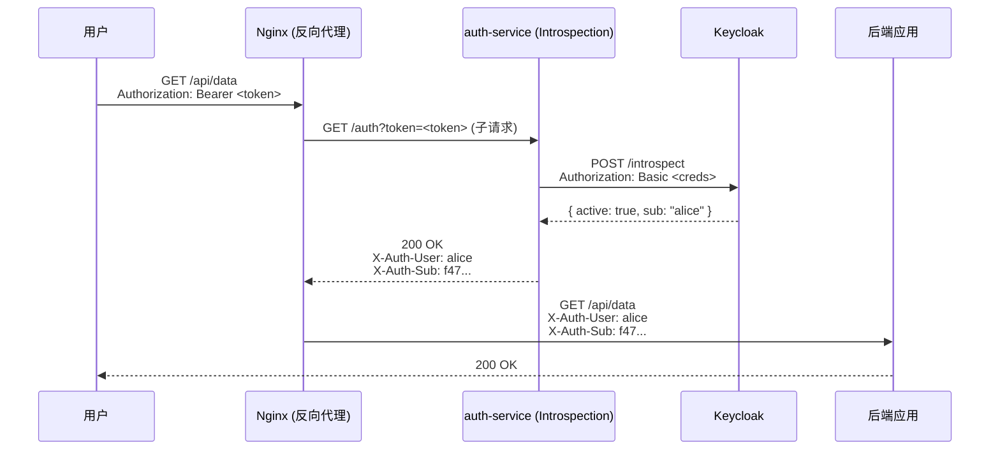

## 场景描述

你的微服务架构里有十几个后端服务，每个服务有自己的 JWT 验证逻辑——有的用 `jjwt`，有的用 `PyJWT`，有的自己写了个 Base64 解码就当验证了（别笑，见过）。安全审计时发现三个问题：

1. 某个服务忘了验证 `exp`，Token 过期了还能用
2. 不同服务的 JWT 验证代码版本不一致，一个已知漏洞修了另一个没修
3. Token 被吊销了，但 JWT 本身没过期，所有服务都不知情

这就是**把 Token 验证分散到各个服务**的后果。OAuth 2.0 Token Introspection（RFC 7662）把验证逻辑收回授权服务器——API 网关或后端服务不再自己解析 JWT，而是把 Token 发给授权服务器问一句：「这个 Token 还有效吗？」

**适用场景：**

- 微服务架构，多个后端需要统一验证 Token
- API 网关（Kong、APISIX、Nginx）需要在入口做 Token 校验
- 需要实时感知 Token 吊销（用户被禁用、被管理员强制登出）
- 使用不透明 Token（opaque token）而非 JWT

**不适用场景：**

- 只有一个后端服务，没有统一的网关层——本地 JWT 验证更简单
- 对延迟极度敏感且 Token 有效期极短（Introspection 增加一次网络往返）
- Token 签发量极大且 Introspection 端点成为瓶颈——考虑 JWT 本地验证 + 短有效期 + 定期拉取吊销列表

## 两种 Token 验证方式：本地 JWT vs Introspection

```mermaid
flowchart LR
    subgraph "方式一：本地 JWT 验证"
        C1[客户端] -->|Bearer Token| API1[后端服务]
        API1 -->|1. 用 JWK 公钥验签| JWT1[JWT 解析]
        JWT1 -->|2. 检查 exp/iss/aud| API1
        API1 -->|3. 自行判断| R1[放行/拒绝]
    end

    subgraph "方式二：Token Introspection"
        C2[客户端] -->|Bearer Token| GW[API 网关]
        GW -->|POST /introspect| AS[授权服务器]
        AS -->|{ active: true/false }| GW
        GW -->|放行/拒绝| API2[后端服务]
    end
```

| 维度 | 本地 JWT 验证 | Token Introspection |
|------|-------------|-------------------|
| 延迟 | 极低（无网络调用） | 一次 HTTP 往返（~5-50ms） |
| 能否感知 Token 吊销 | ❌ Token 签发后不可撤销（除非加黑名单） | ✅ 实时感知（管理员禁用用户后立即生效） |
| 能否处理 opaque token | ❌ 必须用 JWT | ✅ 支持任意 Token 类型 |
| 需要知道签名密钥 | ✅ 需要 JWK Set | ❌ 不需要 |
| 授权服务器压力 | 低（只请求 JWK） | 中（每个请求一次调用） |
| 生产推荐 | Token 有效期 ≤ 5 分钟的场景 | 需要实时吊销、API 网关统一管控 |

**核心判断**：如果你的 Access Token 有效期是 15 分钟且需要实时吊销——选 Introspection。如果 Access Token 只有 2 分钟且不关心吊销——本地 JWT 验证就够了。大部分生产环境是**混合使用**：网关做 Introspection，后端服务信任网关传递的已验证身份 Header。

## Introspection 请求与响应

### 请求格式

```
POST /protocol/openid-connect/token/introspect
Content-Type: application/x-www-form-urlencoded
Authorization: Basic <base64(client_id:client_secret)>

token=<the-access-token>
```

需要 Client Credentials 认证——Introspection 是受保护的端点，只有注册过的客户端才能调用。

### 响应格式

```json
{
  "active": true,
  "scope": "openid profile email",
  "client_id": "my-gateway",
  "username": "alice",
  "token_type": "Bearer",
  "exp": 1720000000,
  "iat": 1719996400,
  "sub": "f47ac10b-58cc-4372-a567-0e02b2c3d479",
  "aud": "my-gateway",
  "iss": "https://keycloak.example.com/realms/myrealm"
}
```

关键字段：

| 字段 | 含义 | 验证时必须检查 |
|------|------|--------------|
| `active` | Token 是否有效 | **首先检查——为 false 时直接拒绝** |
| `exp` | 过期时间 | 检查是否大于当前时间 |
| `username` | 用户名 | 可传递给后端服务用于审计 |
| `sub` | 用户唯一标识 | **后端权限判断的核心依据** |
| `scope` | 授权范围 | 检查是否包含请求操作所需的 scope |

**特别重要**：`active: false` 时不返回其他字段——不要尝试从 `active: false` 的响应里取 `sub` 或 `username`。

## Keycloak 端配置

### 1. 创建 Introspection 客户端

在 Keycloak 管理控制台创建一个 `confidential` 客户端，用于网关/后端调用 Introspection 端点：

```
Clients → Create
  Client ID: api-gateway-introspect
  Client type: OpenID Connect
  Access Type: confidential
  Service Accounts Enabled: ON
```

保存后在 Credentials 标签页获取 `Client Secret`。

### 2. 检查 Introspection 端点

```
https://<keycloak-host>/realms/<realm>/protocol/openid-connect/token/introspect
```

### 3. 测试调用

```bash
# 1. 先获取一个用户的 Access Token（用于被 Introspection 查询的 Token）
ACCESS_TOKEN=$(curl -s -X POST \
  "https://keycloak.example.com/realms/myrealm/protocol/openid-connect/token" \
  -d "client_id=my-app" \
  -d "grant_type=password" \
  -d "username=alice" \
  -d "password=alice123" \
  | jq -r '.access_token')

# 2. 用 gateway 客户端的凭据调用 Introspection
curl -s -X POST \
  "https://keycloak.example.com/realms/myrealm/protocol/openid-connect/token/introspect" \
  -u "api-gateway-introspect:<client-secret>" \
  -d "token=$ACCESS_TOKEN" \
  | jq .

# 预期输出：
# {
#   "active": true,
#   "username": "alice",
#   "sub": "f47ac10b-58cc-4372-a567-0e02b2c3d479",
#   ...
# }
```

**验证吊销**：在 Keycloak 中禁用用户 `alice`，再次调用 Introspection，`active` 应为 `false`。

## Nginx auth_request 集成

这是最常用的集成方式——用 Nginx 的 `auth_request` 模块在反向代理层做 Token 校验，后端服务完全不用关心认证。

### 架构



### Nginx 配置

```nginx
server {
    listen 443 ssl;
    server_name api.example.com;

    # SSL 证书配置
    ssl_certificate     /etc/nginx/certs/api.example.com.crt;
    ssl_certificate_key /etc/nginx/certs/api.example.com.key;

    # ===== auth_request 子请求的验证端点 =====
    location = /auth {
        internal;  # 只允许内部子请求，不暴露给外部
        proxy_pass http://127.0.0.1:8080/validate;
        proxy_pass_request_body off;
        proxy_set_header Content-Length "";
        proxy_set_header X-Original-URI $request_uri;
        proxy_set_header X-Original-Method $request_method;
        proxy_set_header X-Auth-Token $http_authorization;
    }

    # ===== 受保护的后端服务 =====
    location /api/ {
        auth_request /auth;  # 在访问后端前先经过验证

        # 将验证服务返回的用户信息传递给后端
        auth_request_set $auth_user $upstream_http_x_auth_user;
        auth_request_set $auth_sub $upstream_http_x_auth_sub;
        auth_request_set $auth_scope $upstream_http_x_auth_scope;

        proxy_set_header X-Auth-User $auth_user;
        proxy_set_header X-Auth-Sub $auth_sub;
        proxy_set_header X-Auth-Scope $auth_scope;

        proxy_pass http://backend-service:8080;
    }

    # 验证失败的处理
    error_page 401 = @unauthorized;
    location @unauthorized {
        return 401 '{"error": "invalid_token", "message": "Token 无效或已过期"}';
    }
}
```

### 独立验证服务（Python/FastAPI 示例）

Nginx 子请求需要一个实际的 HTTP 服务来执行 Introspection：

```python
from fastapi import FastAPI, Request, HTTPException
import httpx

app = FastAPI()

KEYCLOAK_URL = "https://keycloak.example.com/realms/myrealm"
CLIENT_ID = "api-gateway-introspect"
CLIENT_SECRET = "your-client-secret"

@app.get("/validate")
async def validate(request: Request):
    auth_header = request.headers.get("X-Auth-Token", "")
    if not auth_header.startswith("Bearer "):
        raise HTTPException(status_code=401)
    token = auth_header[7:]

    async with httpx.AsyncClient() as client:
        resp = await client.post(
            f"{KEYCLOAK_URL}/protocol/openid-connect/token/introspect",
            data={"token": token},
            auth=(CLIENT_ID, CLIENT_SECRET),
            timeout=5.0
        )
        data = resp.json()

    if not data.get("active"):
        raise HTTPException(status_code=401)

    # 将有用的信息通过响应头传回 Nginx
    from fastapi.responses import Response
    return Response(
        status_code=200,
        headers={
            "X-Auth-User": data.get("username", ""),
            "X-Auth-Sub": data.get("sub", ""),
            "X-Auth-Scope": data.get("scope", ""),
        }
    )
```

## 性能优化

Introspection 每次调用都是一次 HTTP 往返，在高并发下会成为瓶颈。三种优化策略：

### 1. 短期缓存（推荐）

如果 Token 有效期是 15 分钟，缓存 30 秒的 Introspection 结果可以削减 95%+ 的 Introspection 请求量，同时将吊销延迟控制在 30 秒以内。

```python
from functools import lru_cache
import time
import hashlib

# 简单但有效的 Token → Introspection 结果缓存
_cache = {}

def introspect_with_cache(token: str, ttl: int = 30):
    key = hashlib.sha256(token.encode()).hexdigest()
    now = time.time()
    if key in _cache and _cache[key]["expires"] > now:
        return _cache[key]["data"]

    data = introspect(token)  # 实际调用 Keycloak
    if data.get("active"):
        _cache[key] = {"data": data, "expires": now + ttl}
    return data
```

**缓存粒度**：按 Token 的 SHA256 哈希缓存，而不是 Token 原文。不是出于安全（缓存通常在内存中），而是避免日志泄露。

### 2. 连接池复用

Introspection 客户端和 Keycloak 之间是频繁的长连接——用 HTTP keep-alive 减少 TLS 握手开销：

```python
# httpx 默认使用连接池，keep-alive 自动管理
limits = httpx.Limits(max_keepalive_connections=20, max_connections=100)
client = httpx.AsyncClient(limits=limits, timeout=httpx.Timeout(5.0))
```

### 3. 混合模式：JWT 预检 + Introspection 二次确认

对于高频 API，先用本地 JWK 公钥快速验证 JWT 签名和 `exp`（几乎零成本），只在以下情况才发起 Introspection：

- Token 的 `jti` 出现在本地吊销缓存中（实时推送的吊销列表）
- 用户访问敏感操作（删除、提权）
- 定期抽样验证（如每 100 个请求做一次 Introspection）

```python
def verify_token_hybrid(token: str, is_sensitive_operation: bool = False):
    # 第一步：本地 JWT 验证（必须通过）
    claims = verify_jwt_locally(token)  # 验证签名 + exp + iss + aud
    if not claims:
        return None

    # 第二步：检查是否需要远程确认
    if is_sensitive_operation or claims["jti"] in get_revoked_jtis():
        if not introspect(token).get("active"):
            return None

    return claims
```

## 常见错误

| 症状 | 原因 | 解决方案 |
|------|------|---------|
| Introspection 返回 `active: false` 但 Token 未过期 | 用户被禁用/登出、Client 被禁用、Refresh Token 已被轮换后旧的 Access Token 仍有效但 Introspection 判断为无效 | 正常行为——检查 Keycloak 中用户状态和 Client 状态 |
| `401 Unauthorized` 调用 Introspection | Client 凭据错误或 Client 没有 Service Account | 确认 Client 类型为 `confidential`，Service Accounts Enabled = ON |
| Introspection 返回 `active: true` 但没有 `username` | Token 是 Client Credentials Grant 签发的（机器到机器，没有用户上下文） | 检查 `sub` 为 service account 的 ID，`username` 不存在是正常的 |
| Nginx `auth_request` 子请求超时 | 验证服务响应慢或 Keycloak 不可达 | 设置合理的 proxy timeout（3-5 秒），增加 Introspection 缓存层 |
| 缓存导致吊销延迟 | Token 缓存了旧的 Introspection 结果 | 降低缓存 TTL（生产建议 30 秒），对敏感操作绕过缓存 |

## 安全注意事项

1. **Introspection 端点必须走 HTTPS**：明文传输会让 Token 暴露在网络中。生产环境在 Keycloak 前置 Nginx/Traefik 做 TLS 终结。

2. **客户端凭据轮换**：用于调用 Introspection 的 Client Secret 应定期更换。Keycloak 支持 Client Secret 轮换（在 Credentials 标签页生成新 Secret，保留旧 Secret 一段过渡期）。

3. **错误响应统一处理**：`active: false` 和网络超时都应返回 401，不要在响应体中暴露 `Token 在 2026-07-13 14:30:00 过期` 这类信息——攻击者可以根据错误信息调整攻击策略。

4. **不要在前端暴露 Introspection 端点**：Introspection 是服务端到服务端的通道。前端代码中绝对不要硬编码 Client Secret 并直接调用 Introspection。

## 与 oauth2-proxy 的关系

oauth2-proxy 不支持 Token Introspection——它只做 OIDC 认证（登录时验证 ID Token，之后用加密 Cookie 维护会话）。如果你的架构是：

```
用户 → oauth2-proxy（认证） → Nginx（反向代理） → 后端服务
```

那么 Introspection 是在 oauth2-proxy 之后的 API 网关层使用——后端 API 收到的请求里带有 `X-Auth-Request-User` / `X-Auth-Request-Email` 等 Header，不需要再到 Keycloak 验证。但如果你的 API 还接受直接过来的 Bearer Token（不经过 oauth2-proxy），那就需要 Introspection。

有关 oauth2-proxy 的配置细节见 [oauth2-proxy 常见错误排错速查表]() 和 [Keycloak + oauth2-proxy 集成指南]()。

## 小结

Token Introspection 解决了分布式系统中 Token 验证的**一致性**问题：不再让每个服务各自验证 JWT，而是把「这个 Token 还有效吗」收归授权服务器统一回答。它的代价是一次额外的网络调用——用缓存和混合模式可以把代价降到可接受。

选择策略：**短期缓存 + 关键操作不缓存 + 敏感操作强制 Introspection**。

## 常见问题

### Q1：Introspection 和 UserInfo 端点有什么区别？

**Introspection**（`/token/introspect`）回答「这个 Token 还有效吗」，返回 Token 的元信息（active、exp、scope、sub），面向**资源服务器/API 网关**。**UserInfo**（`/userinfo`）回答「这个用户是谁」，返回用户的身份属性（name、email），面向**客户端应用**。

Introspection 需要客户端凭据（`client_id` + `client_secret`），UserInfo 只需要 Token 本身。

### Q2：Introspection 会暴露用户敏感信息吗？

Introspection 返回的字段由授权服务器控制，默认不含 PII（个人身份信息）。Keycloak 的 Introspection 响应默认返回 `sub`、`username`、`scope` 等字段，不返回 `email` 或自定义属性——除非通过 Client Scope 或 Protocol Mapper 显式配置。

### Q3：Kong / APISIX 的 OIDC 插件是不是就做了 Introspection？

Kong 的 `kong-oidc` 插件、APISIX 的 `openid-connect` 插件在认证阶段主要做 OIDC Authorization Code Flow（登录），而不是 Token Introspection。但它们通常也支持 Bearer Token 验证——验证方式就是 Introspection。在 APISIX 中配置：

```yaml
plugins:
  openid-connect:
    client_id: api-gateway
    client_secret: xxx
    discovery: https://keycloak.example.com/realms/myrealm/.well-known/openid-configuration
    bearer_only: true   # 仅验证 Bearer Token，不触发登录跳转
```

`bearer_only: true` 时，APISIX 对每个请求做 Introspection。

### Q4：Introspection 对性能的影响有多大？能撑多少 QPS？

一次 Introspection 调用的开销主要是网络延迟 + Keycloak 的数据库查询（查 Token 状态）。在 Keycloak 和验证服务在同一数据中心（低延迟内网）时：

- 单次调用：5-20ms
- 加缓存（TTL 30s）后：99% 命中率，缓存查询 < 0.1ms
- Keycloak 单节点 Introspection QPS 约 2000-5000（取决于硬件和 DB）

一个中等规模微服务架构（几百个后端 Pod，万级 QPS），用缓存把 Introspection 调用量压到每秒几十次——对 Keycloak 几乎零压力。

---

> **关联阅读**
> - [OAuth 2.0 深度解读]()：Token 类型与授权流程全景
> - [JWT 深入解读]()：JWT 本地验证的完整逻辑
> - [IAM 会话管理与 Token 生命周期]()：Token 刷新、吊销与会话联动
> - [Keycloak 生产巡检与运维清单]()：日常监控 Introspection 端点的健康状态
> - RFC 7662 (OAuth 2.0 Token Introspection)
