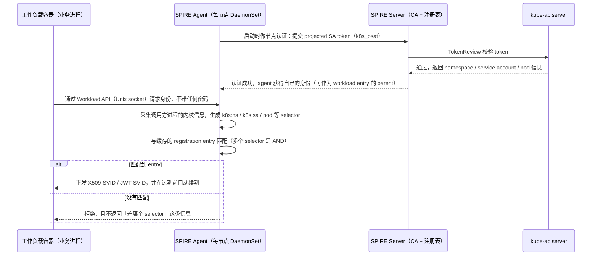

## 场景描述

服务间调用的凭据，是 IAM 里最容易被忽略的一半。人类身份有登录、MFA、离职流程；服务之间的凭据往往是一串写在 Secret 里的共享密钥——有效期以年计，轮换要发版，泄露了也无法归因到具体进程。

Kubernetes 给的 projected ServiceAccount Token 已经是短生命周期凭据，但它有一个硬边界：**只有 Kubernetes API Server 能验证它**（TokenReview 接口）。token 出了集群，或者对端是另一个云的 Vault、另一个集群的 mesh、另一家公司的服务，就没有第三方能离线校验这个身份。跨环境服务间认证于是长期停留在「共享密钥 + IP 白名单」。

SPIFFE 解决的就是这一段：把身份从静态密钥里剥离出来，做成一个**任何持有信任根的一方都能离线验证、且绑定在运行环境上**的标识。它的标识形态是 SPIFFE ID（`spiffe://<trust domain>/<path>`），签发出的凭据叫 SVID，参考实现是 SPIRE（CNCF 毕业项目，当前版本 v1.15.3）。默认 X509-SVID 有效期 1 小时、JWT-SVID 5 分钟，续期由节点上的 agent 自动完成——目标不是「让团队去管理证书」，而是让证书不再需要被管理。

本文只讨论落地：K8s 上最小可运行的部署、registration entry / selector 这个最常见的静默失败、逐层验证命令、与 Keycloak 这类人类 IAM 的分工边界、以及回滚顺序。

## 适用与不适用

**适用**

| 场景 | SPIFFE/SPIRE 提供什么 |
|------|---------------------|
| 多集群、多云的服务间 mTLS | 信任根是一份可发布的 trust bundle，对端不需要回连你的集群，也不需要共享 CA 私钥 |
| 想让身份绑定运行环境而不是载体 | selector 基于 namespace / ServiceAccount / 标签，Pod 重建、节点漂移、扩缩容后身份不变 |
| 消除服务间共享密钥 | 无密钥分发、分钟级过期、泄露窗口有限且可追溯到具体 SPIFFE ID |
| 跨组织的服务互调 | SPIFFE Federation 交换 bundle，各自保留自己的信任根 |

**不适用（先别上 SPIRE）**

| 需求 | 更合适的做法 |
|------|-------------|
| 用户登录、SSO、MFA、账号生命周期 | Keycloak 等 IdP：OIDC / SAML / SCIM，见 [SSO 架构与会话管理]() |
| 只在一个集群里做请求级 JWT 校验 | Istio RequestAuthentication + Keycloak 令牌，见 [Istio + Keycloak JWT 认证]() |
| 服务调用 Keycloak 保护的业务 API | OAuth 2.0 客户端凭据 / `private_key_jwt`，见 [Keycloak 客户端认证与 IAM 凭据轮换]() |
| 容器平台不允许 DaemonSet、不允许主机卷 | 评估成本后再决定：agent 必须拿到进程级证明，退化成 join_token 会削弱「身份绑定运行环境」这一前提 |

判断标准很直接：**主体是服务还是人**。服务用 SVID，人用 OIDC/SAML，混用会让两套信任模型互相污染。

## 一、两层认证：节点认证与工作负载认证

SPIRE 的认证是两级的，很多误解都来自把这两级当成一级。



四个需要记住的点：

1. **节点认证**解决「这个 agent 是不是跑在我认可的节点上」。Kubernetes 下标准做法是 `k8s_psat`：agent 提交 projected ServiceAccount token，server 用 TokenReview 验证。认证通过后，agent 的 SPIFFE ID 形如 `spiffe://<trust domain>/spire/agent/k8s_psat/<cluster 名>/<node UID>`。
2. **工作负载认证**解决「这个进程是谁」。agent 不看密码，而是采集调用方进程的内核信息（所属容器、Pod、ServiceAccount、标签）生成 selector。
3. **registration entry = SPIFFE ID + 一组 selector + parent ID**。多个 `-selector` 之间是 AND：必须全部满足才签发。parent ID 决定「哪个 agent 有权为这个身份背书」。
4. **没有 entry 就没有身份，且 selector 不匹配是静默失败**。工作负载拿不到 SVID，但不会收到「你少了一个 selector」的错误——它只会看到连接被拒或请求超时。所以排错顺序永远是：先看 entry 与实际 selector，再看应用代码。

常用 selector（来自 SPIRE 的 k8s workload attestor 文档）：

| Selector | 取值来源 | 使用建议 |
|----------|---------|---------|
| `k8s:ns` | 工作负载所在 namespace | 长期身份的基础维度 |
| `k8s:sa` | 工作负载的 ServiceAccount | 长期身份的基础维度，与 `k8s:ns` 组合即「哪个应用」 |
| `k8s:pod-uid` / `k8s:pod-name` | Pod 的 UID / 名称 | 随滚动更新、驱逐、扩缩容变化，只适合临时排查 |
| `k8s:pod-label` | Pod 标签 | 标签可变，作为唯一维度等于把身份交给「谁都能改的字段」 |
| `k8s:container-name` | 容器名 | 多容器 Pod 里区分 sidecar 与业务容器 |
| `k8s:node-name` | 节点名 | 用于把身份限制到特定节点池，不建议作为主维度 |
| `k8s:container-image` | 容器镜像 tag 或 digest | 镜像类 selector 用 tag 匹配有已知限制（tag 可被重新指向不同内容），优先用 digest 形式 |

安全边界上有两条经验规则：

- **长期身份用 `k8s:ns` + `k8s:sa`，不要用可变字段**（Pod 名、标签）。前者由 Kubernetes 对象模型约束，后者任何有权限改标签的人都能改变身份归属。
- **selector 越少越容易匹配，也越容易越权**。只写 `k8s:ns:orders` 意味着该 namespace 下任何 Pod 都能拿到这个身份，包括攻击者临时部署的 Pod。

## 二、Kubernetes 最小落地（SPIRE 1.15.3 / Helm chart 0.30.2）

官方推荐的安装方式是 hardened Helm charts，分两步（先 CRD，再主 chart）：

```bash
helm upgrade --install -n spire-mgmt spire-crds spire-crds \
  --repo https://spiffe.github.io/helm-charts-hardened/ --create-namespace

helm upgrade --install -n spire-mgmt spire spire \
  --repo https://spiffe.github.io/helm-charts-hardened/ -f your-values.yaml
```

生产用的 `your-values.yaml` 关键项（其余按官方 production 说明补）：

```yaml
global:
  spire:
    recommendations:
      enabled: true
    namespaces:
      create: true
    clusterName: prod-cluster-a
    trustDomain: prod.example.com
    caSubject:
      country: CN
      organization: Example
      commonName: prod.example.com
```

`trustDomain` 一旦投产就不该再改——它出现在所有 SPIFFE ID 与证书 URI SAN 里，改域名等于让所有既有身份失效。按官方建议，不同环境（生产 / 预发 / 实验）应使用不同 trust domain，而不是靠路径区分：它们的信任根和安全实践本就不同。

这套 chart 会同时装上五个组件，理解各自职责比记参数更重要：

| 组件 | 形态 | 职责 |
|------|------|------|
| `spire-server` | StatefulSet | 签发 SVID 的 CA、保存 registration entry 的注册表 |
| `spire-agent` | DaemonSet | 每节点一个，做工作负载认证，并通过本地 Unix socket 暴露 Workload API |
| `spiffe-csi-driver` | DaemonSet | 把 Workload API socket 以 CSI 内联卷挂进业务 Pod，避免业务容器使用 hostPath |
| `spire-controller-manager` | Deployment | 把 `ClusterSPIFFEID` CRD 转成 registration entry |
| `spiffe-oidc-discovery-provider` | Deployment | 以标准 OIDC 发现文档对外暴露 JWT-SVID，供只认 OIDC 的系统校验 |

两个容易被忽略的边界：

- **CSI 驱动自身仍需要 hostPath**。它存在的意义是让业务 Pod 不必挂 hostPath，但它要和 kubelet 通信，所以在完全禁止 hostPath 的集群上不可用（官方 README 把这条列为限制）。
- **server 的 datastore 是 CA 资产**。默认 datastore 是 SQLite，签名密钥与所有 entry 都在这里；官方生产安装说明明确建议考虑使用外部数据库。备份口径要按 CA 对待（密钥 + entry 一起、可恢复演练），而不是按应用配置文件对待。

### 注册工作负载：两种写法

声明式（推荐，`spire-controller-manager` 会据此生成 entry，Pod 一创建就自动注册）：

```yaml
apiVersion: spire.spiffe.io/v1alpha1
kind: ClusterSPIFFEID
metadata:
  name: orders-workload
spec:
  spiffeIDTemplate: "spiffe://{{ .TrustDomain }}/ns/{{ .PodMeta.Namespace }}/sa/{{ .PodSpec.ServiceAccountName }}"
  podSelector:
    matchLabels:
      spiffe.io/spire-managed-identity: "true"
  workloadSelectorTemplates:
    - "k8s:ns:orders"
    - "k8s:sa:orders-sa"
```

手工写法（用于核对声明式结果，或在调试时快速验证）。注意 workload entry 的 parent 用**节点别名**，而不是某个具体节点的 UID，别名 entry 由 `k8s_psat` 侧的 selector 动态匹配：

```bash
# 1) 节点别名：任何满足这三个 selector 的 agent 都属于这个身份
kubectl exec -n spire-mgmt spire-server-0 -- \
  /opt/spire/bin/spire-server entry create \
  -node \
  -spiffeID spiffe://prod.example.com/ns/spire-mgmt/sa/spire-agent \
  -selector k8s_psat:cluster:prod-cluster-a \
  -selector k8s_psat:agent_ns:spire-mgmt \
  -selector k8s_psat:agent_sa:spire-agent

# 2) 工作负载 entry：parent 指向上面的别名
kubectl exec -n spire-mgmt spire-server-0 -- \
  /opt/spire/bin/spire-server entry create \
  -spiffeID spiffe://prod.example.com/ns/orders/sa/orders-sa \
  -parentID spiffe://prod.example.com/ns/spire-mgmt/sa/spire-agent \
  -selector k8s:ns:orders \
  -selector k8s:sa:orders-sa \
  -x509SVIDTTL 3600
```

如果直接把 parent 写成 `spiffe://<trust domain>/spire/agent/k8s_psat/<cluster>/<node UID>`，节点扩容或换节点时这个 entry 就失效了——那种 ID 适合在排查时定位「是哪台机器上的 agent」，不适合当长期注册的锚点。

### TTL：这些数字决定什么

| 配置 | 默认值 | 含义 |
|------|--------|------|
| `default_x509_svid_ttl` | 1h | X509-SVID 有效期 |
| `default_jwt_svid_ttl` | 5m | JWT-SVID 有效期 |
| `ca_ttl` | 24h | 签名密钥有效期 |
| `agent_ttl` | 跟随 `default_x509_svid_ttl` | agent 自身 SVID 有效期 |

entry 级 `-x509SVIDTTL` / `-jwtSVIDTTL` 可覆盖默认；实际取值按 `entry.x509_svid_ttl` → `entry.ttl` → `default_x509_svid_ttl` → `1h` 取第一个非零值。这几个值应该进变更评审：**TTL 决定的是凭据泄露后的可用窗口**，不是运维负担——续期由 agent 在过期前自动完成。把 TTL 调大通常只是想减少日志噪音，代价是把「分钟级泄露窗口」变回「小时级」。

### 让业务容器拿到 socket

CSI 内联卷把 agent 的 socket 目录只读挂进容器，官方示例的写法是：

```yaml
containers:
  - name: orders-api
    env:
      - name: SPIFFE_ENDPOINT_SOCKET
        value: unix:///spiffe-workload-api/spire-agent.sock
    volumeMounts:
      - name: spiffe-workload-api
        mountPath: /spiffe-workload-api
        readOnly: true
volumes:
  - name: spiffe-workload-api
    csi:
      driver: "csi.spiffe.io"
      readOnly: true
```

应用接 Workload API 有两种方式：直接用 SPIFFE 客户端库（go-spiffe 等）从 socket 拉取并自动轮换；或者用 `spiffe-helper` 这类工具把证书与私钥写到磁盘、并在轮换后给子进程发信号——适合不能改代码、只能读文件的存量服务。`SPIFFE_ENDPOINT_SOCKET` 这一类环境变量是多数客户端库的默认入口，先统一注入，能省掉后面每个应用各自写死路径。

## 三、验证：四层逐层排除

SPIRE 的问题几乎都能定位到某一层，所以按层验证比直接看应用日志快得多。

**第 1 层：agent 有没有被认证**

```bash
kubectl exec -n spire-mgmt spire-server-0 -- /opt/spire/bin/spire-server agent list
kubectl exec -n spire-mgmt spire-server-0 -- /opt/spire/bin/spire-server agent show -spiffeID <agent 的 SPIFFE ID>
```

agent 不在列表里，后面三层都不用查。检查 server 的 `k8s_psat` 配置：`clusters` 下对应条目的 `service_account_allow_list` 是否包含 agent 的 `namespace:sa`；server 访问 apiserver 用的 kubeconfig 是否有 `pods`、`nodes` 的读权限与 `tokenreviews` 的创建权限。

**第 2 层：entry 是否匹配**

```bash
kubectl exec -n spire-mgmt spire-server-0 -- /opt/spire/bin/spire-server entry show \
  -selector k8s:ns:orders -selector k8s:sa:orders-sa
```

逐条核对该 entry 的 `Selectors` 字段是否覆盖了工作负载实际具备的属性，以及 `Parent ID` 指向的 agent 身份是否真的有节点在承担。声明式场景下，先确认 `ClusterSPIFFEID` 的 `podSelector` 命中了目标 Pod（`kubectl get pod -l ...`），再看 entry。入口错了，entry 不会存在。

**第 3 层：容器里能不能真的拿到**

```bash
# 先确认 socket 实际路径（CSI 挂载时文件名由挂载目录内容决定）
ls -l /spiffe-workload-api

# 官方文档给的取用方式：连接 Workload API，取出该进程对应身份并落盘
spire-agent api fetch x509 \
  -socketPath /spiffe-workload-api/spire-agent.sock \
  -write /tmp/
```

这条命令会连接 Workload API、取出该进程对应的身份、把 X509-SVID 与私钥、以及验证对端证书所需的 trust bundle 写到目标目录。**不要猜 socket 路径**：路径写错的表现和「没有身份」完全一样，会让你误判成注册问题。宿主直装 agent 的部署另有一套约定路径（如 `/run/spire/sockets/` 下），以实际 `socket_path` 配置为准。

**第 4 层：对端校验了 SPIFFE ID 吗**

前三层通过，只说明凭据合法。X509-SVID 的信任模型是「同一信任域内，任何被 CA 签发的身份都能通过证书链校验」——**如果应用只做链校验、不做身份校验，A 服务可以拿自己那张合法证书冒充 B 服务**，mTLS 就退化成「加密了但没有授权」。

正确做法是链校验通过之后，再取对端证书的 URI SAN（X509-SVID 规范要求：证书中有且仅有一个 URI SAN，值就是 SPIFFE ID），比对它是否在允许列表内。这也是为什么授权判断应该写 `spiffe://prod.example.com/ns/orders/sa/orders-sa` 这样的完整 ID，而不是只看「证书是不是我们 CA 签的」。

## 四、与 Keycloak（人类 IAM）的边界

| 维度 | 工作负载身份（SPIFFE/SPIRE） | 人类 / 企业 IAM（Keycloak 等） |
|------|---------------------------|------------------------------|
| 主体 | 进程、Pod、服务 | 用户、合作伙伴身份 |
| 凭据 | X509-SVID（TLS 客户端证书）、JWT-SVID | 会话、OIDC ID Token、OAuth 2.0 access token |
| 信任根 | trust bundle（可发布、可联邦、可离线校验） | realm 签名密钥 + 客户端凭据 |
| 协议 | mTLS、JWT 校验 | OAuth 2.0 / OIDC / SAML / SCIM |
| 生命周期 | 分钟到小时级，agent 自动续期 | 会话级 + 账号生命周期（入职到离职） |
| 是否有用户交互 | 没有：没有登录页、没有 MFA、没有同意、没有账号找回 | 有：登录、MFA、授权同意、密码重置 |
| 典型责任方 | 平台 / 基础设施团队 | 安全 / IT / 身份团队 |

四个判断点：

1. **传输层与身份层分工**。Istio 场景下，sidecar 可以通过 Envoy SDS 直接从 SPIRE 取身份做东西向 mTLS，而应用层的用户身份校验继续用 Keycloak 签发的 JWT——两层各自收口，互不替代。SPIRE 与 Envoy/Istio 的集成是官方支持的接入方式（Istio 文档有完整示例，含 CSI 驱动挂载 SDS socket 与 `ClusterSPIFFEID` 注册）。相关排错见 [Istio + Keycloak JWT 认证与 IAM 授权]()。
2. **JWT-SVID 可以进 OIDC 生态，但它是短期凭据**。`spiffe-oidc-discovery-provider` 会以标准 OIDC 发现文档的形式暴露 JWT-SVID 的校验能力，让只认 OIDC 的系统（云厂商 IAM 等）验证工作负载身份——官方 AWS IAM OIDC 联邦教程就是这个模式，并明确提醒生产环境需要自动刷新令牌（JWT-SVID 默认 5 分钟过期）。把它当「跨系统的短期身份凭据」，不要当长效 API key。
3. **服务调用 Keycloak 保护的业务 API，仍然走 OAuth 2.0**：客户端凭据或 `private_key_jwt`，轮换方案见 [Keycloak 客户端认证与 IAM 凭据轮换]()。**不要把 JWT-SVID 直接当 client assertion 或 access token 用**：JWT-SVID 的 `sub` 是 SPIFFE ID，`aud` 是它要投递的目标，与客户端断言「断言主体必须就是该客户端自己」的语义不同。两套语义混用，会让令牌校验链路的排错成本成倍上升。
4. **反过来也别指望 SPIFFE 管人**。Workload API 没有任何面向用户的交互面。遇到「员工离职要立刻失效全部访问」这类需求，那是账号生命周期与 SCIM 配置的范畴，见 [IAM SCIM 用户自动配置]()。

一句话分工：**用户登录看 OIDC / SAML，服务间认证看 SVID。**

## 五、常见错误表

| 症状 | 根因 | 定位与处理 |
|------|------|-----------|
| 业务容器里找不到 Workload API socket | CSI 卷未挂载，或 CSI 驱动未部署/未注册成功 | 看 Pod 的 `volumes` 与 `volumeMounts`；再看 CSI 驱动 Pod 日志与 registrar 容器日志（驱动注册失败时 Pod 会一直停在创建阶段） |
| 工作负载拿不到 SVID，但日志里没有明确报错 | 没有匹配的 registration entry，或 selector 不匹配（静默失败） | 用 `spire-server entry show -selector ...` 与工作负载实际属性逐项对齐；优先核对 Pod 是否真的带上了 `ClusterSPIFFEID` 要求的标签 |
| agent 起不来或一直未被认证 | `k8s_psat` 的 `service_account_allow_list` 不含该 `namespace:sa`；或 `audience` 配置与 token 不符 | 比对 server 配置与 agent 的 ServiceAccount；确认 server 能成功调用 TokenReview |
| 所有节点上的工作负载同时拿不到身份 | agent 与 kubelet 通信受阻（kubelet 校验 bearer token 依赖 API Server 的 TokenReview） | 官方文档明确指出 API Server 故障会中断工作负载认证；可用 kubelet 的 `--authentication-token-webhook-cache-ttl` 缓存缓解，但缓存过大会延迟权限回收 |
| 身份在某个节点上时有时无 | selector 用了 Pod 名/Pod UID 这类随滚动更新变化的字段 | 改用 `k8s:ns` + `k8s:sa`；节点级差异用 `k8s:node-name` 或节点池标签显式表达 |
| 跨信任域调用握手失败 | 对端 trust bundle 没有联邦进来，或 entry 未声明 `federatesWith` | 先确认两端 bundle 都已交换（`spire-server bundle list`），再核对 entry 的联邦声明 |
| 删掉/重启 CSI 驱动后，相关 Pod 卡在 Terminating | CSI 驱动不可用时，挂载了它提供的卷的 Pod 无法完成卸载 | 这是官方 README 记载的行为：驱动恢复健康后卸载会自动完成，不需要强删 Pod |
| mTLS 全部握手成功，但任意服务都能调用任意服务 | 应用只做了证书链校验，没有校验对端 SPIFFE ID | 在链校验后增加 URI SAN 白名单比对；把「谁的证书都信」当成未完成项列入上线检查 |

## 六、回滚与退出

回滚要按「注册面 → 应用面 → 基础设施面」的顺序，反过来做会把故障窗口拉长。

**第 1 步：停掉新的注册（可逆、无感）**

```bash
kubectl delete clusterspiffeid orders-workload
# 手工 entry 需要单独删（声明式的 entry 通常随 CR 一起回收）
kubectl exec -n spire-mgmt spire-server-0 -- \
  /opt/spire/bin/spire-server entry show -spiffeID spiffe://prod.example.com/ns/orders/sa/orders-sa
kubectl exec -n spire-mgmt spire-server-0 -- \
  /opt/spire/bin/spire-server entry delete -entryID <entry-id>
```

**第 2 步：应用面回退**

前提是上线时就设计了双轨：应用优先用 SVID，拿不到时回退到原有凭据（共享密钥 / mTLS 证书 / 令牌）。没有双轨设计的服务，回滚等同于一次发版，要把发布窗口预留出来。**这一步先做完，再动基础设施**——SPIRE 组件先没了而业务仍在请求身份，失败会集中在业务侧。

**第 3 步：卸载 SPIRE（官方步骤）**

```bash
helm -n spire-mgmt uninstall spire-crds
helm -n spire-mgmt uninstall spire
kubectl -n spire-server delete pvc -l app.kubernetes.io/instance=spire
kubectl delete crds clusterfederatedtrustdomains.spire.spiffe.io clusterspiffeids.spire.spiffe.io clusterstaticentries.spire.spiffe.io
```

注意两点：删 CRD 会连带删除所有 CR 实例，所以必须放在应用不再依赖之后；PVC 里是 server 的 datastore，删除即丢失注册表与签名密钥——如果只是「暂时下线」，保留 PVC 并停掉工作负载即可，不必走完整卸载。

**升级路径**：官方 Helm chart 明确只支持一次跨一个 major/minor 版本，不允许跳版本升级；跨 `spire-crds` 的大版本要严格按 release notes 的顺序执行。生产升级前，把「datastore 备份 + 旧版本回退 + entry 表导出」三件事准备好。

## 常见问题（IAM FAQ）

**SPIFFE/SPIRE 能替代 Keycloak 吗？**
不能，两者主体不同。Keycloak 管「谁能登录、登录后有什么权限」，主体是人；SPIRE 管「这个进程是谁」，主体是服务。企业里更常见的组合是：用户经 Keycloak 完成 OIDC 登录拿到令牌，服务之间用 SVID 做 mTLS 和短期身份——这是 IAM 里机器身份（工作负载身份）与人类身份分工的标准形态。

**工作负载身份属于 IAM 吗？**
属于，而且是当前 IAM 增长最快的分支。传统 IAM 覆盖人、账号、权限；容器化与多云之后，服务数量远超人员数量，静态密钥与手工证书轮换在这个量级上不可维护（也就是常说的非人类身份 / NHI 管理问题）。SPIFFE 提供的是这个分支里可标准化、可跨厂商的一层。

**必须用 Kubernetes 吗？**
不必。SPIRE 在裸机、虚拟机上都能跑（官方有 Linux/macOS quickstart），只是 K8s 上的证明路径（`k8s_psat` + `k8s` workload attestor）最成熟。虚拟机场景可以用 TPM、云厂商实例身份文档或 x509pop 做节点认证，选择取决于你手上有什么可验证的运行环境证据。

**X509-SVID 和 JWT-SVID 怎么选？**
看边界的层次。进程之间直接建 TLS 通道，用 X509-SVID；需要穿过 HTTP 中间层（网关、消息头、跨组织的 HTTP 调用）时用 JWT-SVID，因为它天然适合放在请求头里。两者可以同时申请，不必二选一。

**一定要改代码接 Workload API 吗？**
不一定。能用客户端库就用（自动续期最省心）；不能改代码的存量服务用 `spiffe-helper` 把证书写到约定路径、轮换后通知进程重载。后者牺牲的是「零落盘」，但比继续用长期密钥要好。

**一个 trust domain 够用吗？**
按边界划分：不同环境（生产/预发/实验）、不同物理位置、不同安全实践的系统应使用不同 trust domain，因为 trust domain 等价于「同一套信任根、互相默认可验证」。把所有系统塞进一个 trust domain，等于把所有服务和环境放进同一个信任圈：任何一处被攻破，整个信任圈的假设都不再成立。

## 参考来源

- [SPIFFE Concepts](https://spiffe.io/docs/latest/spiffe-about/spiffe-concepts/)：SPIFFE ID 格式 `spiffe://<trust domain>/<path>`、trust domain 作为信任根的划分建议（不同环境/物理位置应使用不同 trust domain）、workload 的粒度定义
- [JWT-SVID 规范](https://github.com/spiffe/spiffe/blob/main/standards/JWT-SVID.md)：`sub` 必须是工作负载的 SPIFFE ID、`aud` 必须存在、签名密钥以 JWK 形式发布在 trust bundle 中（`use=jwt-svid`、必须带 `kid`）
- [X509-SVID 规范](https://github.com/spiffe/spiffe/blob/main/standards/X509-SVID.md)：SPIFFE ID 编码在 Subject Alternative Name 的 URI 字段，证书必须且只能包含一个 URI SAN；验证失败的 SVID 必须被拒绝
- [SPIRE Concepts](https://spiffe.io/docs/latest/spire-about/spire-concepts/)：Server 负责注册表与签发、Agent 暴露 Workload API、节点认证与工作负载认证的两级结构、插件类型
- [Registering workloads](https://spiffe.io/docs/latest/deploying/registering/)：registration entry 由 SPIFFE ID + selector 集合 + parent ID 组成、selector 全部满足才签发、`spire-server entry create/show/delete` 用法、节点别名（node alias）作为 parent 的用法
- [SPIRE Server Configuration Reference](https://spiffe.io/docs/latest/deploying/spire_server/)：`default_x509_svid_ttl` 默认 1h、`default_jwt_svid_ttl` 默认 5m、`ca_ttl` 默认 24h、`agent_ttl` 跟随 X509-SVID TTL、entry 级 TTL 与 `-x509SVIDTTL` / `-jwtSVIDTTL`、签发时 TTL 取值的优先级链、datastore 仅内置 SQL 插件（SQLite/PostgreSQL/MySQL）
- [SPIRE Agent Configuration Reference](https://spiffe.io/docs/latest/deploying/spire_agent/)：`socket_path` 默认值、`trust_bundle_path` / `trust_bundle_url` 引导方式、`spire-agent api fetch` 命令行选项
- [k8s_psat 节点认证插件](https://github.com/spiffe/spire/blob/main/doc/plugin_server_nodeattestor_k8s_psat.md)：agent SPIFFE ID 形如 `spiffe://<td>/spire/agent/k8s_psat/<cluster>/<node UID>`、`clusters` 与 `service_account_allow_list`、`audience` 默认 `["spire-server"]`、server 侧 kubeconfig 所需的 `pods`/`nodes` 读与 `tokenreviews` 创建权限、节点别名 entry 与 `k8s_psat:cluster:<name>` 的匹配要求
- [k8s 工作负载认证插件](https://github.com/spiffe/spire/blob/main/doc/plugin_agent_workloadattestor_k8s.md)：`k8s:ns` / `k8s:sa` / `k8s:pod-uid` / `k8s:pod-name` / `k8s:pod-label` / `k8s:container-name` / `k8s:node-name` / `k8s:container-image` 等 selector 定义、镜像 tag 类 selector 的限制、kubelet 校验 bearer token 依赖 TokenReview 与 `--authentication-token-webhook-cache-ttl` 的影响
- [Working with SVIDs](https://spiffe.io/docs/latest/deploying/svids/)：`spire-agent api fetch x509 -socketPath ... -write ...` 的行为（连接 Workload API、取出进程对应身份、写证书与 trust bundle）、`spiffe-helper` 的用途（落盘、启动子进程、轮换后通知）
- [SPIRE CSI 驱动](https://github.com/spiffe/spiffe-csi)：以 CSI 内联卷注入 Workload API socket 以避免 hostPath、驱动自身仍依赖 hostPath 的限制、驱动异常时相关 Pod 无法完成终止的行为
- [Kubernetes Quickstart](https://spiffe.io/docs/latest/try/getting-started-k8s/)：节点别名 entry（`-node` + `k8s_psat:cluster` / `agent_ns` / `agent_sa`）与工作负载 entry（`-parentID` 指向别名 + `k8s:ns` / `k8s:sa`）的官方示例
- [SPIRE Helm Charts Hardened（chart 0.30.2 / SPIRE 1.15.3）](https://github.com/spiffe/helm-charts-hardened/tree/main/charts/spire)：`spire-crds` 与 `spire` 两步安装、生产 values（`trustDomain` / `clusterName` / `caSubject` / 外部数据库建议）、同时安装的五个组件、卸载与清理命令、仅支持一次跨一个 minor 版本升级
- [Istio SPIRE 集成](https://istio.io/latest/docs/ops/integrations/spire/)：Envoy SDS 取身份、SPIFFE CSI 驱动挂载 SDS socket 的推荐做法、`ClusterSPIFFEID` 的 `spiffeIDTemplate` 与 `workloadSelectorTemplates` 示例、联邦场景下 `default_svid_name` / `default_all_bundles_name` 的 SDS 资源名
- [SPIRE 版本发布](https://github.com/spiffe/spire/releases)：v1.15.3（2026-08-21）为当前稳定版本
