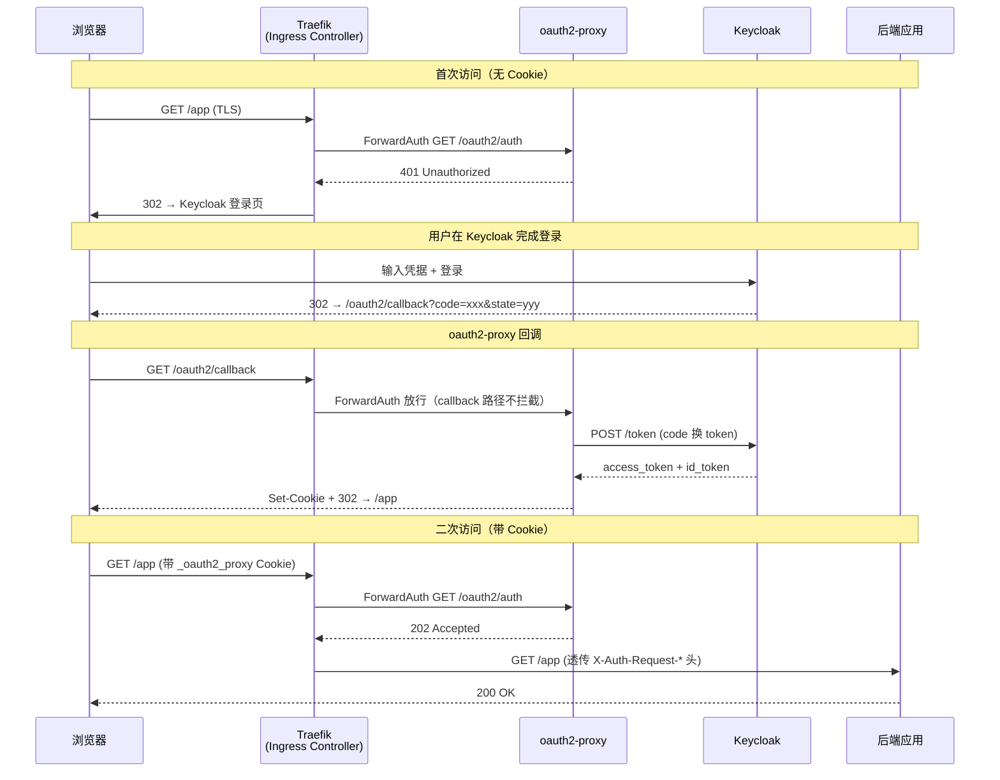

## 场景

你用 Traefik 做 Kubernetes Ingress Controller，用 Keycloak 做统一身份认证，现在有一组内部 Web 应用需要加登录保护。不想在每个应用里改代码接 OIDC，想在入口层解决问题。

一句话：**Traefik ForwardAuth 中间件指向 oauth2-proxy，oauth2-proxy 对接 Keycloak——三个组件各司其职，入口层统一认证。**

## 适用与不适用

| 适用 | 不适用 |
|------|--------|
| 已使用 Traefik 作为 Ingress Controller 的 K8s 集群 | 使用 Nginx Ingress Controller（参考 [Keycloak + oauth2-proxy 集成指南]() 的 auth-url 模式） |
| 需要给多个内部工具统一加 OIDC 登录（Grafana、Kibana、Argo CD） | SPA 直连 Keycloak（不需要代理层） |
| 需要链式中间件（限流 + 认证 + 头改写） | 需要细粒度路径级授权（用 Pomerium 或 API 网关） |
| 已有 Traefik EntryPoint 做 TLS 终结 | 移动端 Native App（用系统浏览器 + PKCE） |

## 架构



**关键点**：
1. Traefik 的 ForwardAuth 中间件在请求到达后端**之前**拦截，向 oauth2-proxy 发子请求
2. oauth2-proxy 返回 2xx → Traefik 认为已认证，放行到后端；返回 4xx → Traefik 认为未认证，把响应原样返回给浏览器
3. 浏览器看到 401 + `Location` 头，自动跟随重定向到 Keycloak 登录页——整个过程对后端应用透明
4. `callback` 路径（`/oauth2/callback`）必须被 ForwardAuth 放行，否则认证循环无法完成

## Keycloak 端配置

Keycloak 端的客户端创建、Audience Mapper 配置、角色映射等步骤与 Nginx Ingress 方案完全一致。详细步骤参考 [Keycloak + oauth2-proxy 集成指南 — Keycloak 端配置]()，这里只强调 Traefik 场景下容易遗漏的两个点：

### redirect_uri 配置

Traefik 场景下，oauth2-proxy 的回调地址是 `https://<你的域名>/oauth2/callback`——与 Nginx Ingress 模式完全一样。oauth2-proxy 默认用请求的 `Host` 头构造 redirect_uri，所以在 Keycloak Client 配置中需要把所有受保护域名的 callback 路径都加上：

```
https://grafana.example.com/oauth2/callback
https://kibana.example.com/oauth2/callback
https://argocd.example.com/oauth2/callback
```

如果只用了一个 oauth2-proxy 实例保护多个应用（共享 Cookie），更简单的做法是配一个通配 redirect_uri 或用一个统一的域名。

### Web Origins

Traefik ForwardAuth 模式下，浏览器不会直接向 oauth2-proxy 发跨域请求，所以 Keycloak Client 的 Web Origins 填 `+`（允许同 redirect_uri 域）即可。

## oauth2-proxy 端配置

```yaml
# oauth2-proxy Deployment 的关键参数
apiVersion: apps/v1
kind: Deployment
metadata:
  name: oauth2-proxy
  namespace: auth
spec:
  replicas: 2
  selector:
    matchLabels:
      app: oauth2-proxy
  template:
    metadata:
      labels:
        app: oauth2-proxy
    spec:
      containers:
      - name: oauth2-proxy
        image: quay.io/oauth2-proxy/oauth2-proxy:v7.6.0
        args:
        - --provider=keycloak-oidc
        - --oidc-issuer-url=https://keycloak.example.com/realms/myrealm
        - --client-id=oauth2-proxy
        - --client-secret=<从 Keycloak Client Credentials 获取>
        - --cookie-secret=<openssl rand -base64 32 生成>
        - --cookie-secure=true
        - --cookie-samesite=lax
        - --cookie-domain=.example.com
        # 只对内部集群暴露 HTTP（Traefik 在外部做 TLS 终结）
        - --http-address=0.0.0.0:4180
        # 反向代理模式：信任 Traefik 传过来的 X-Forwarded-* 头
        - --reverse-proxy=true
        # 只信任 Traefik/入口代理的网段；不要让可直达 oauth2-proxy 的客户端伪造转发头
        - --trusted-proxy-ip=10.42.0.0/16
        # 传递给后端的 headers
        - --set-xauthrequest=true
        - --set-authorization-header=true
        # 跳过对 /oauth2/callback 的认证检查
        - --skip-auth-route=^/oauth2/callback$
        # 可选：限制允许的邮箱域
        - --email-domain=example.com
        ports:
        - containerPort: 4180
          name: http
        livenessProbe:
          httpGet:
            path: /ping
            port: 4180
        readinessProbe:
          httpGet:
            path: /ping
            port: 4180
```

**Traefik 场景的配置要点**：

1. `--reverse-proxy=true`：告诉 oauth2-proxy 它在反向代理后面，会从受信任代理提供的 `X-Forwarded-Proto` 和 `X-Forwarded-Host` 取原始请求的协议和域名来构造 redirect_uri。生产环境必须同时配置 `--trusted-proxy-ip`（示例中的网段需替换为实际入口代理来源）；否则任何能直接访问 oauth2-proxy 的客户端都可能伪造转发头。
2. `--skip-auth-route=^/oauth2/callback$`：仅用于 oauth2-proxy 自身路由的认证豁免。ForwardAuth 路由仍应把 `/oauth2/*`（尤其是 `/oauth2/callback`）直接转发到 oauth2-proxy，不能让回调再经过保护该业务应用的 ForwardAuth。
3. oauth2-proxy Service 使用 ClusterIP 即可——只有 Traefik 会通过 ForwardAuth 调用它，不需要对外暴露。

## Traefik ForwardAuth Middleware 配置

```yaml
apiVersion: traefik.io/v1alpha1
kind: Middleware
metadata:
  name: oauth2-proxy-forwardauth
  namespace: auth
spec:
  forwardAuth:
    # oauth2-proxy 的 Service 地址
    address: http://oauth2-proxy.auth.svc.cluster.local:4180/oauth2/auth
    # 信任 X-Forwarded-* 头，让 oauth2-proxy 拿到原始请求信息
    trustForwardHeader: true
    # 认证成功后透传给后端的响应头
    authResponseHeaders:
    - X-Auth-Request-User
    - X-Auth-Request-Email
    - X-Auth-Request-Groups
    - X-Auth-Request-Preferred-Username
    - X-Auth-Request-Access-Token
    # 可选：Authorization 头（如果后端需要 Bearer token）
    - Authorization
```

> **Traefik 入口的信任边界**：`trustForwardHeader: true` 只适合放在已经由 EntryPoint 清洗过转发头的链路上。生产配置还应把入口代理网段写入 `forwardedHeaders.trustedIPs`；不要把这个选项当成“所有请求头都可信”。Traefik 当前文档已将该 Middleware 选项标为待移除，后续升级应优先迁移到 EntryPoint 级别的可信 IP 配置。

**`authResponseHeaders` 说明**：

| Header | 内容 | 后端用途 |
|--------|------|----------|
| `X-Auth-Request-User` | 用户标识（通常是 email） | 日志、审计、判断"是谁在操作" |
| `X-Auth-Request-Email` | 用户邮箱 | 通知、关联账号 |
| `X-Auth-Request-Groups` | 逗号分隔的用户组 | 后端自己做粗粒度授权 |
| `X-Auth-Request-Preferred-Username` | 用户显示名 | UI 展示 |
| `X-Auth-Request-Access-Token` | 完整的 access_token (JWT) | 后端调用其他服务时携带 |
| `Authorization` | `Bearer <access_token>` | 后端直接用于 API 鉴权 |

> **安全提示**：`X-Auth-Request-Access-Token` 和 `Authorization` 包含完整的 access token。只在你信任后端应用且后端确实需要时才传递。原则上后端应该通过 oauth2-proxy 的 Session 来确认身份，不应依赖客户端传过来的 header。

## Traefik IngressRoute 配置

### 基础单应用配置

```yaml
apiVersion: traefik.io/v1alpha1
kind: IngressRoute
metadata:
  name: grafana-route
  namespace: monitoring
spec:
  entryPoints:
  - websecure
  routes:
  - match: Host(`grafana.example.com`)
    kind: Rule
    middlewares:
    - name: oauth2-proxy-forwardauth
      namespace: auth
    services:
    - name: grafana
      port: 3000
  tls:
    secretName: grafana-tls
```

### 多中间件链式调用

Traefik 支持在一条路由上链式调用多个中间件，例如限流 + 认证 + 响应头改写：

```yaml
apiVersion: traefik.io/v1alpha1
kind: Middleware
metadata:
  name: rate-limit
  namespace: monitoring
spec:
  rateLimit:
    average: 100
    burst: 50
---
apiVersion: traefik.io/v1alpha1
kind: IngressRoute
metadata:
  name: grafana-route
  namespace: monitoring
spec:
  entryPoints:
  - websecure
  routes:
  - match: Host(`grafana.example.com`)
    kind: Rule
    middlewares:
    # 顺序重要：按声明顺序执行
    - name: rate-limit              # 1. 先限流
      namespace: monitoring
    - name: oauth2-proxy-forwardauth  # 2. 再认证
      namespace: auth
    services:
    - name: grafana
      port: 3000
  tls:
    secretName: grafana-tls
```

### 多应用共享一个 oauth2-proxy 实例

如果你用同一个 oauth2-proxy 实例保护多个应用（都部署在 `.example.com` 下），只需要在每个应用的 IngressRoute 上引用同一个 ForwardAuth 中间件：

```yaml
---
# Grafana
apiVersion: traefik.io/v1alpha1
kind: IngressRoute
metadata:
  name: grafana-route
spec:
  entryPoints: [websecure]
  routes:
  - match: Host(`grafana.example.com`)
    kind: Rule
    middlewares:
    - name: oauth2-proxy-forwardauth
      namespace: auth
    services:
    - name: grafana
      port: 3000
  tls:
    secretName: grafana-tls
---
# Kibana
apiVersion: traefik.io/v1alpha1
kind: IngressRoute
metadata:
  name: kibana-route
spec:
  entryPoints: [websecure]
  routes:
  - match: Host(`kibana.example.com`)
    kind: Rule
    middlewares:
    - name: oauth2-proxy-forwardauth
      namespace: auth
    services:
    - name: kibana
      port: 5601
  tls:
    secretName: kibana-tls
```

前提：oauth2-proxy 的 `--cookie-domain=.example.com`（注意前面的点号），这样在一个应用登录后，其他同主域名的应用也带 Cookie，不用反复登录。

## 验证

按以下顺序验证，先确认基础设施可达，再测端到端：

```bash
# 1. 确认 oauth2-proxy 健康
curl -sS http://oauth2-proxy.auth.svc.cluster.local:4180/ping
# 预期：OK

# 2. 确认 Keycloak OIDC Discovery 可访问（从 oauth2-proxy Pod 内执行）
kubectl exec -n auth deploy/oauth2-proxy -- \
  curl -sS https://keycloak.example.com/realms/myrealm/.well-known/openid-configuration
# 预期：返回 JSON，包含 issuer、authorization_endpoint、token_endpoint

# 3. 确认未经认证请求被拦截
curl -sS -o /dev/null -w "%{http_code}" https://grafana.example.com/
# 预期：302（重定向到 Keycloak 登录）

# 4. 确认 /oauth2/callback 可访问
curl -sS -o /dev/null -w "%{http_code}" https://grafana.example.com/oauth2/callback
# 预期：302 或 401（callback 不带有效 code 时正常返回错误，重点是能到达 oauth2-proxy）

# 5. 端到端：浏览器打开 https://grafana.example.com/
# 预期：跳转 Keycloak 登录页 → 登录 → 跳回 Grafana

# 6. 确认后端收到认证头（在后端应用内打印 HTTP Headers）
# 预期见到：
# X-Auth-Request-User: user@example.com
# X-Auth-Request-Email: user@example.com
# X-Auth-Request-Groups: group1,group2
```

## 常见错误排错表

| 错误现象 | 根本原因 | Traefik 场景特定排查 |
|----------|----------|---------------------|
| `expected audience "oauth2-proxy" got ["account"]` | Keycloak 未配置 Audience Mapper | 与反向代理无关，纯 Keycloak 配置问题。在 Client → Client scopes → 添加 Audience mapper，勾选 "Add to ID token" |
| 登录后无限重定向 (`ERR_TOO_MANY_REDIRECTS`) | Cookie Domain/SameSite 不匹配，或 TLS 终结配置不一致 | 检查 `--cookie-domain` 是否正确、`--cookie-samesite=lax`、`--cookie-secure=true`。同时确认 Traefik EntryPoint 的 TLS 配置正确，`X-Forwarded-Proto` 被正确设置为 `https`。详见 [Keycloak 重定向循环排错指南]() |
| `csrf cookie not found` | Cookie 被浏览器拦截（跨域或 SameSite 过严） | 确认所有应用部署在同一主域名（`.example.com`）。如果是不同域名，需要各自独立的 oauth2-proxy 实例 |
| Traefik 返回 500 Internal Server Error | ForwardAuth 中间件无法连接到 oauth2-proxy | 检查 Middleware 中的 `address` 是否正确；`kubectl get svc -n auth oauth2-proxy` 确认 Service 存在且 ClusterIP 可达 |
| Traefik 返回 503 Service Unavailable | oauth2-proxy Service 或后端应用 Service 不可达 | `kubectl get endpoints -n auth oauth2-proxy` 确认有 Ready 的 Pod IP |
| oauth2-proxy 日志报 `invalid_token: token contains an invalid number of segments` | ID Token 格式异常或 issuer URL 不匹配 | 确认 `--oidc-issuer-url` 末尾不带斜杠，且与 Keycloak `.well-known/openid-configuration` 返回的 issuer 完全一致 |
| 登录成功但后端收不到 X-Auth-Request-* 头 | ForwardAuth 中间件未配置 `authResponseHeaders` | 检查 Middleware CRD 的 `spec.forwardAuth.authResponseHeaders` 列表是否包含需要的 header |
| `/oauth2/callback` 返回 404 | IngressRoute 未正确路由 callback 路径到 oauth2-proxy | 确保有一条 IngressRoute 规则将 `oauth2.example.com`（或应用域名下的 `/oauth2/*`）路由到 oauth2-proxy Service，且该路由**不经过** ForwardAuth 中间件 |
| 多个应用间频繁要求重新登录 | Cookie Domain 未覆盖全部应用域名 | `--cookie-domain=.example.com` 必须是 `.example.com`（带前导点号），确保所有 `*.example.com` 子域共享 Cookie |

### 诊断命令速查

```bash
# 查看 oauth2-proxy 日志（认证失败第一现场）
kubectl logs -n auth deploy/oauth2-proxy --tail=100 -f

# 查看 Traefik 日志（中间件执行失败线索）
kubectl logs -n traefik deploy/traefik --tail=100 | grep -i "forwardauth\|middleware\|error"

# 从集群内手动测试 ForwardAuth 端点
kubectl run -it --rm debug --image=curlimages/curl --restart=Never -- \
  curl -v http://oauth2-proxy.auth.svc.cluster.local:4180/oauth2/auth

# 从集群内测试（模拟已认证请求）
# 先从浏览器 DevTools → Cookies 复制 _oauth2_proxy 的值
kubectl run -it --rm debug --image=curlimages/curl --restart=Never -- \
  curl -v -H "Cookie: _oauth2_proxy=<复制的值>" \
  -H "X-Forwarded-Proto: https" \
  -H "X-Forwarded-Host: grafana.example.com" \
  http://oauth2-proxy.auth.svc.cluster.local:4180/oauth2/auth
# 预期：HTTP 202

# 确认 Traefik Middleware 已被 IngressRoute 引用
kubectl get ingressroute -A -o json | jq '.items[].spec.routes[].middlewares'
```

## 生产环境注意事项

1. **TLS 终结位置**：Traefik 在 EntryPoint 上做 TLS 终结。oauth2-proxy 和 Keycloak 之间的通信如果走集群内部，可以使用 HTTP（因为 Traefik 在入口层已经加密）。但 Keycloak 本身建议在反向代理后仍然感知到外部协议（设置 `proxy=edge`）。
2. **oauth2-proxy Service**：使用 ClusterIP 类型即可，不需要 LoadBalancer 或 NodePort。只有 Traefik 的 ForwardAuth 中间件会调用它。
3. **中间件顺序**：如果一条路由上有多个中间件，Traefik 按声明顺序执行。认证中间件通常放在限流之后、头改写之前。
4. **多副本**：oauth2-proxy 至少 2 副本，配合 `PodDisruptionBudget`。oauth2-proxy 用加密 Cookie 存状态，即使不配 Redis 也能在多副本间正常工作。
5. **Cookie Secret**：`--cookie-secret` 泄露后攻击者可伪造认证 Cookie。使用 `openssl rand -base64 32` 生成，通过 Kubernetes Secret 注入。
6. **callback 路由**：必须有一条不经过 ForwardAuth 中间件的路由将 `/oauth2/callback` 指向 oauth2-proxy。最简单的做法是用单独的域名（如 `auth.example.com`）承载 oauth2-proxy，并通过 `--redirect-url` 参数指定。
7. **转发头信任边界**：Traefik 文档已将 ForwardAuth 的 `trustForwardHeader` 标为待移除的选项；应在 EntryPoint 级别用 `forwardedHeaders.trustedIPs` 清理来自不可信客户端的 `X-Forwarded-*`，再明确设置 Middleware 的 `trustForwardHeader`。oauth2-proxy 侧仍用 `--trusted-proxy-ip` 限制谁可以提供转发头。不要把“能跑通”误当成“信任边界已闭合”。
8. **健康检查**：oauth2-proxy 暴露 `/ping` 端点（返回 200 OK），可用于 Kubernetes 的 `livenessProbe` 和 `readinessProbe`。

## 回滚方式

```bash
# 1. 回滚 oauth2-proxy Deployment
kubectl rollout undo deployment/oauth2-proxy -n auth

# 2. 回滚 Traefik Middleware（如果改过）
kubectl apply -f middleware-backup.yaml

# 3. 临时禁用认证（保留 oauth2-proxy 实例以便事后复盘）
# 从 IngressRoute 中移除 middlewares 引用：
kubectl edit ingressroute grafana-route -n monitoring
# 删除或注释掉 middlewares 块，保存后 Traefik 自动生效（无需重启）

# 4. 验证服务恢复
curl -sS -o /dev/null -w "%{http_code}" https://grafana.example.com/
# 预期：200（应用直接可达，无认证拦截）
```

如果问题是 Keycloak Client 配置导致的（如误改 Audience Mapper 或 redirect_uri），在 Keycloak Admin Console 中手动还原。Keycloak 客户端配置不在 Kubernetes 管控范围内，建议改动前用 Admin CLI 导出备份：

```bash
kcadm.sh get clients/<client-id> -r myrealm > client-backup.json
```

---

## 与 Nginx Ingress auth-url 方案对比

| 维度 | Traefik ForwardAuth | Nginx Ingress auth-url |
|------|--------------------|-----------------------|
| 配置方式 | Middleware CRD + IngressRoute CRD | Ingress 注解 (`nginx.ingress.kubernetes.io/auth-url`) |
| 中间件链 | 原生支持，声明式链式调用 | 通过 `configuration-snippet` 拼接（维护性差） |
| 响应头透传 | `authResponseHeaders` 声明式配置 | `auth-response-headers` 注解 |
| TLS | EntryPoint 统一管理 | 每个 Ingress 独立 TLS 配置 |
| 多应用共享 | 引用同一个 Middleware 名称即可 | 每个 Ingress 重复注解 |
| 适用场景 | Traefik 用户、需要链式中间件 | Nginx Ingress 用户、简单场景 |

**选型建议**：如果你已经在用 Traefik 做 Ingress Controller，用 ForwardAuth 方案更简洁，中间件可复用且维护成本更低。详见 [oauth2-proxy 深度介绍 — 选型对比]()。

## 延伸阅读

- [Keycloak + oauth2-proxy 集成实战指南]()：Nginx Ingress auth-url 模式的完整方案
- [Keycloak 重定向循环与 401 排错指南]()：Cookie、TLS 终结、SameSite 问题的系统化排查
- [oauth2-proxy 深度介绍]()：架构原理、Provider 选型、安全加固
- [第 18 章：IDaaS 集成模式与实践]()：网关模式与其他集成模式的对比
- [Traefik ForwardAuth 官方文档](https://doc.traefik.io/traefik/middlewares/http/forwardauth/)
- [oauth2-proxy Keycloak OIDC Provider 文档](https://oauth2-proxy.github.io/oauth2-proxy/configuration/providers/keycloak_oidc)
