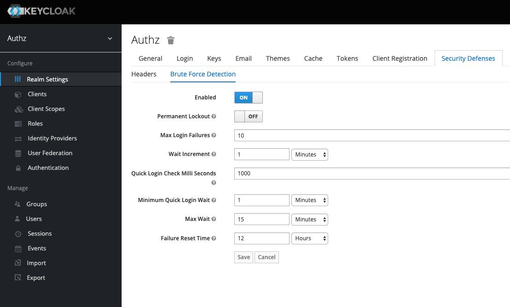
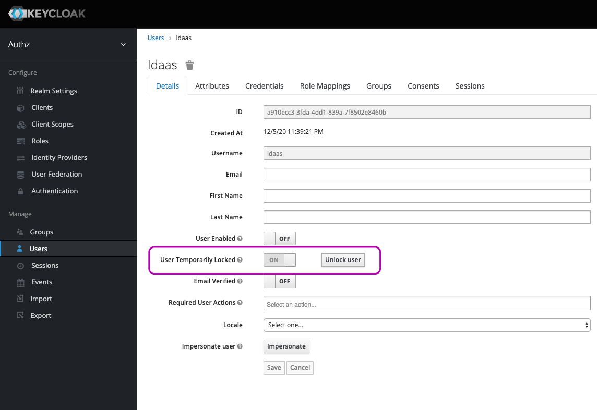

Brute Force Detection 暴力检测，防止密码暴力破解，登录失败 N 次锁定。

## 启用暴力检测

控制台选择 Realm，设置：Realm Settings -> Security Defenses -> Brute Force Detection。

- Permanent Lockout

  ON 表示永久锁定。  
  OFF 表示临时锁定。

- Max Login Failures

  登录失败达到多少次时，锁定账号。

- Quick Login Check Milli Seconds

  快速登录检测，两次登录请求之间的时间间隔（单位毫秒）小于该值时，则认定为快速登录。

- Minimum Quick Login Wait

  一旦被认定为快速登录，该账号将被临时锁定为该配置项配置的时长。

## 解除锁定

1. 临时锁定用户，达到锁定时长后，会自动解锁。
2. 管理员在用户列表或用户详情里可以手动解锁。

   

## 注意事项

1. 失败次数统计仅与登录账号相关，与会话无关，关闭重启浏览器，次数不会重置。
2. 用户锁定后，给出的错误提示还是默认的用户名密码错误，就是不想让攻击者知道用户暂时被禁用了。

[keycloak-brute-force]: https://github.com/keycloak/keycloak-documentation/blob/master/server_admin/topics/threat/brute-force.adoc
